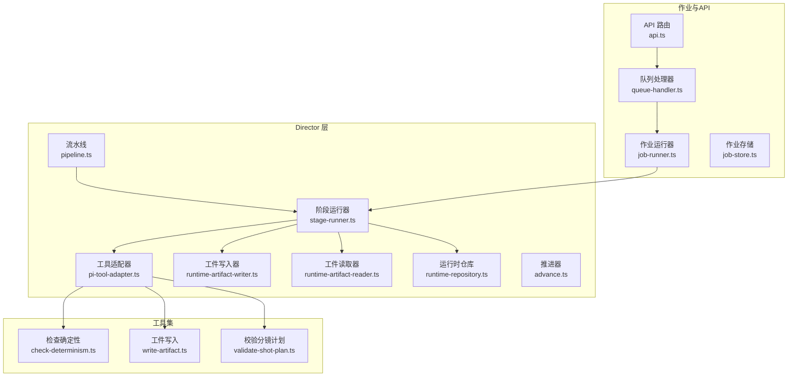
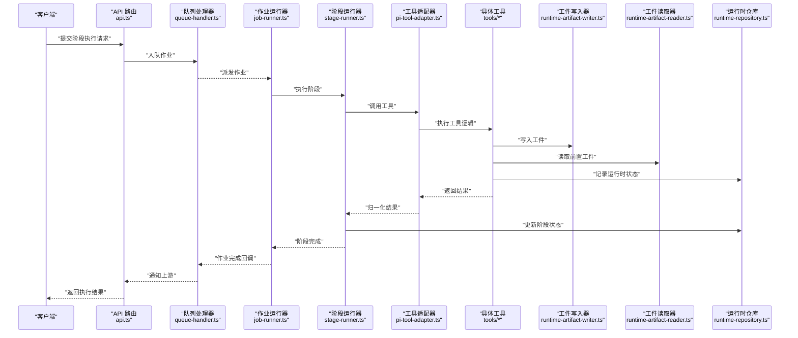
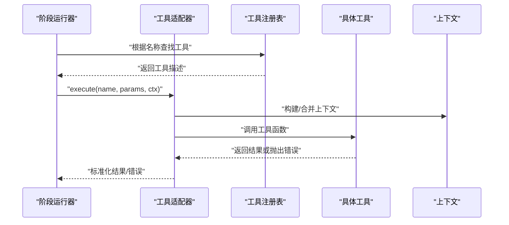
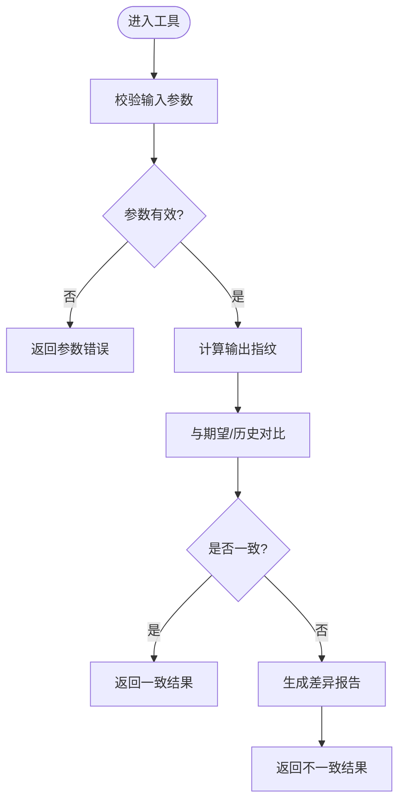
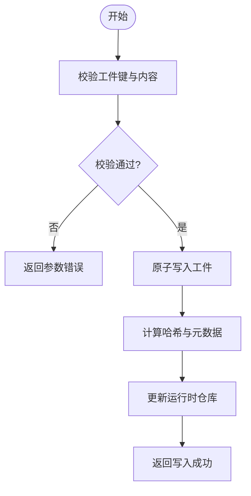
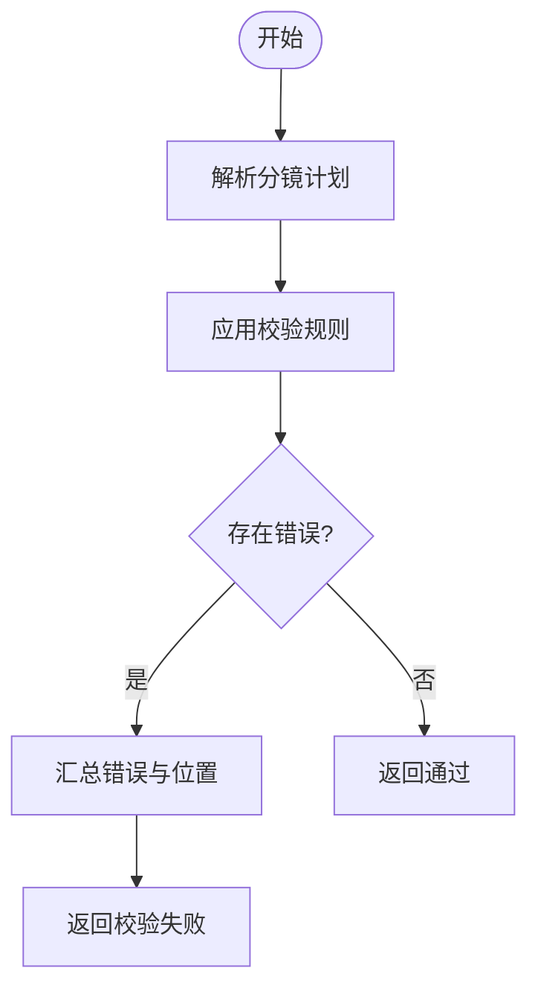
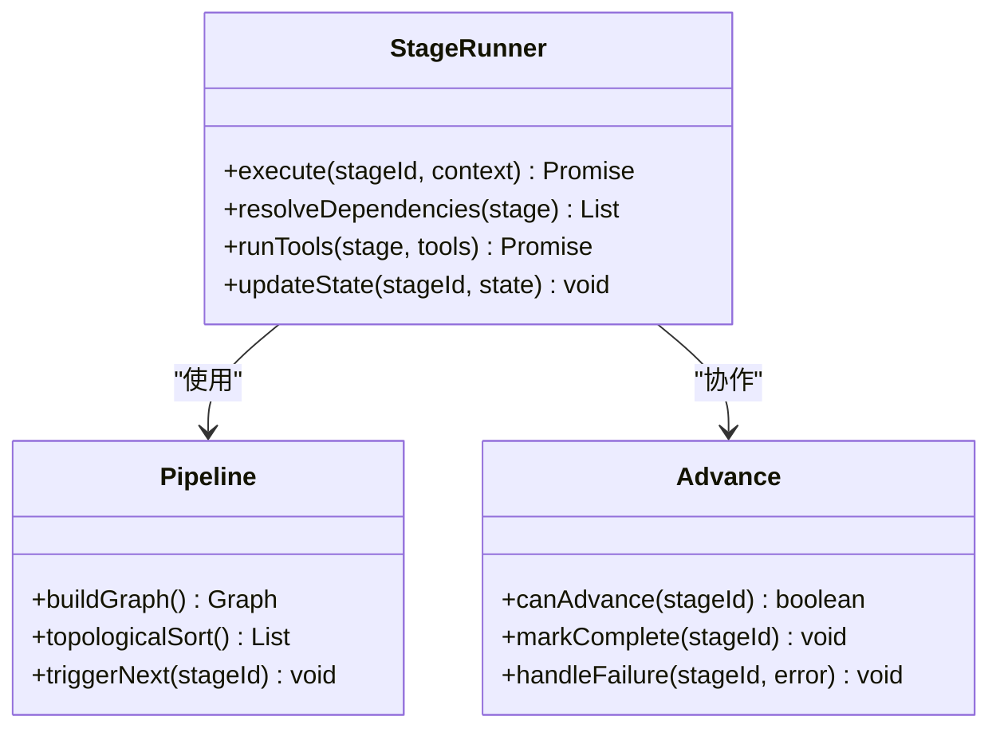
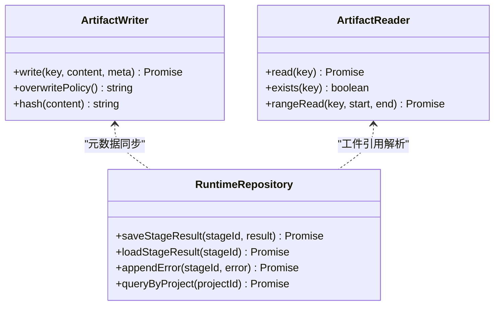
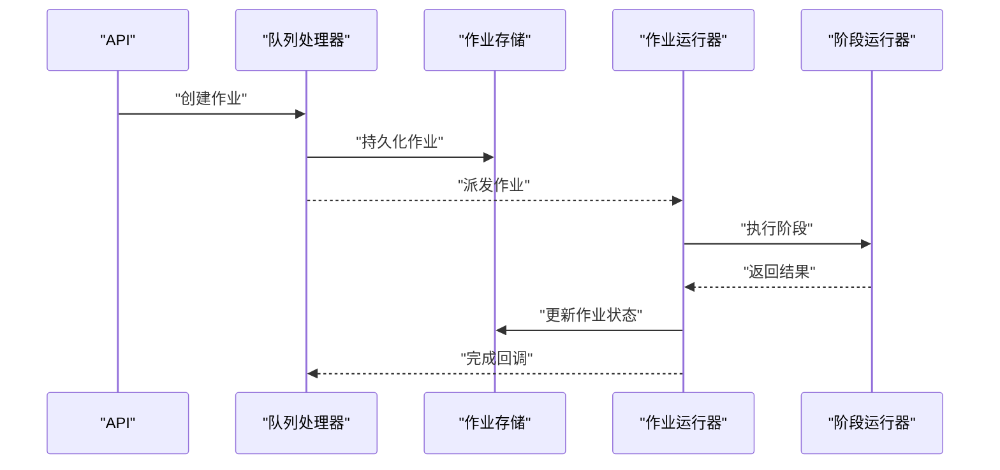
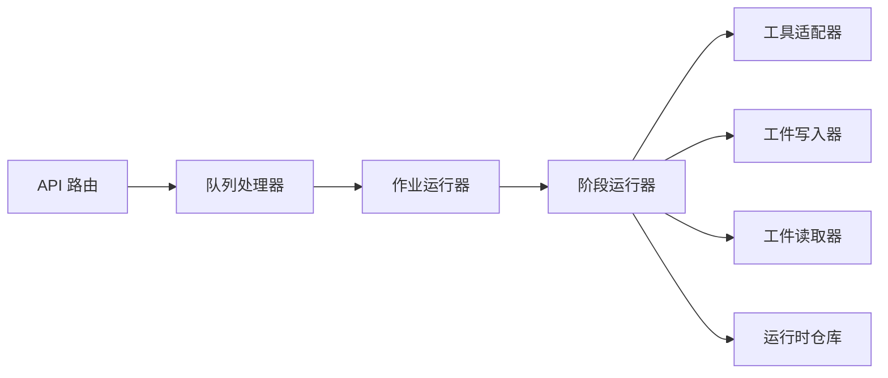

# 工具链集成

<cite>
**本文引用的文件**   
- [pi-tool-adapter.ts](file://src/features/director/pi-tool-adapter.ts)
- [check-determinism.ts](file://src/features/director/tools/check-determinism.ts)
- [write-artifact.ts](file://src/features/director/tools/write-artifact.ts)
- [validate-shot-plan.ts](file://src/features/director/tools/validate-shot-plan.ts)
- [stage-runner.ts](file://src/features/director/stage-runner.ts)
- [runtime-artifact-writer.ts](file://src/features/director/runtime-artifact-writer.ts)
- [runtime-artifact-reader.ts](file://src/features/director/runtime-artifact-reader.ts)
- [runtime-repository.ts](file://src/features/director/runtime-repository.ts)
- [pipeline.ts](file://src/features/director/pipeline.ts)
- [advance.ts](file://src/features/director/advance.ts)
- [queue-handler.ts](file://src/features/director/queue-handler.ts)
- [job-runner.ts](file://server/src/server/job-runner.ts)
- [job-store.ts](file://server/src/server/job-store.ts)
- [api.ts](file://server/src/server/api.ts)
- [index.ts](file://src/features/director/index.ts)
</cite>

## 目录
1. [简介](#简介)
2. [项目结构](#项目结构)
3. [核心组件](#核心组件)
4. [架构总览](#架构总览)
5. [详细组件分析](#详细组件分析)
6. [依赖关系分析](#依赖关系分析)
7. [性能考量](#性能考量)
8. [故障排查指南](#故障排查指南)
9. [结论](#结论)
10. [附录](#附录)

## 简介
本文件面向 PurpleInk 工具链集成系统，系统性阐述工具注册机制、适配器模式与插件化架构；详解内置工具（检查确定性、运行时探测、工件写入等）的用法；给出自定义工具开发流程、接口规范与最佳实践；并覆盖工具调用上下文、参数校验与错误处理机制，提供组合使用示例与性能优化建议。文档力求对非技术读者友好，同时为开发者提供可追溯的代码级依据。

## 项目结构
PurpleInk 的工具链位于 features/director 模块中，围绕“阶段运行器”“工具适配器”“工件读写”“队列与作业执行”展开。关键目录与职责：
- tools：内置工具实现（如 check-determinism、write-artifact、validate-shot-plan）
- pi-tool-adapter.ts：工具适配器与统一调用入口
- stage-runner.ts：阶段编排与工具调度
- runtime-artifact-writer/reader：工件持久化与读取
- runtime-repository：运行时状态与工件元数据管理
- pipeline.ts / advance.ts：流水线推进与阶段推进逻辑
- queue-handler.ts / job-runner.ts / job-store.ts：异步任务与作业生命周期管理
- server/src/server/api.ts：对外 API 暴露

图表来源 
- [stage-runner.ts](file://src/features/director/stage-runner.ts)
- [pi-tool-adapter.ts](file://src/features/director/pi-tool-adapter.ts)
- [check-determinism.ts](file://src/features/director/tools/check-determinism.ts)
- [write-artifact.ts](file://src/features/director/tools/write-artifact.ts)
- [validate-shot-plan.ts](file://src/features/director/tools/validate-shot-plan.ts)
- [runtime-artifact-writer.ts](file://src/features/director/runtime-artifact-writer.ts)
- [runtime-artifact-reader.ts](file://src/features/director/runtime-artifact-reader.ts)
- [runtime-repository.ts](file://src/features/director/runtime-repository.ts)
- [pipeline.ts](file://src/features/director/pipeline.ts)
- [advance.ts](file://src/features/director/advance.ts)
- [queue-handler.ts](file://src/features/director/queue-handler.ts)
- [job-runner.ts](file://server/src/server/job-runner.ts)
- [job-store.ts](file://server/src/server/job-store.ts)
- [api.ts](file://server/src/server/api.ts)

章节来源
- [index.ts](file://src/features/director/index.ts)

## 核心组件
- 工具适配器（Tool Adapter）
  - 作用：将不同工具的统一接口暴露给阶段运行器，屏蔽工具差异，集中处理上下文注入、参数校验、错误包装与结果归一化。
  - 关键点：统一的调用签名、上下文对象（包含工件读写能力、运行时ID、阶段信息等）、错误类型映射。
- 阶段运行器（Stage Runner）
  - 作用：按阶段定义顺序调度工具，维护阶段状态，协调工件读写与运行时仓库更新。
  - 关键点：串行/并行策略、失败回滚或继续策略、日志与指标上报。
- 工件读写器（Artifact Writer/Reader）
  - 作用：抽象工件的持久化与读取，支持多种后端（本地、对象存储），提供一致性接口。
  - 关键点：原子写入、版本化、元数据同步。
- 运行时仓库（Runtime Repository）
  - 作用：持久化阶段结果、工件引用、进度与错误信息，支撑恢复与审计。
  - 关键点：幂等更新、并发安全、查询索引。
- 流水线与推进器（Pipeline & Advance）
  - 作用：定义阶段拓扑、依赖关系与推进条件，驱动阶段从入队到完成。
  - 关键点：拓扑排序、依赖解析、重试与超时。
- 作业执行（Queue/Job）
  - 作用：将阶段执行封装为作业，通过队列进行削峰填谷与分布式扩展。
  - 关键点：去重、幂等、可观测性。

章节来源
- [pi-tool-adapter.ts](file://src/features/director/pi-tool-adapter.ts)
- [stage-runner.ts](file://src/features/director/stage-runner.ts)
- [runtime-artifact-writer.ts](file://src/features/director/runtime-artifact-writer.ts)
- [runtime-artifact-reader.ts](file://src/features/director/runtime-artifact-reader.ts)
- [runtime-repository.ts](file://src/features/director/runtime-repository.ts)
- [pipeline.ts](file://src/features/director/pipeline.ts)
- [advance.ts](file://src/features/director/advance.ts)
- [queue-handler.ts](file://src/features/director/queue-handler.ts)
- [job-runner.ts](file://server/src/server/job-runner.ts)
- [job-store.ts](file://server/src/server/job-store.ts)

## 架构总览
下图展示一次典型“阶段执行”的请求流：API 接收请求后入队，作业运行器拉取并交由阶段运行器执行，阶段运行器通过工具适配器调用具体工具，工具通过工件读写器与运行时仓库读写数据，最终返回结果并推进流水线。

图表来源 
- [api.ts](file://server/src/server/api.ts)
- [queue-handler.ts](file://src/features/director/queue-handler.ts)
- [job-runner.ts](file://server/src/server/job-runner.ts)
- [stage-runner.ts](file://src/features/director/stage-runner.ts)
- [pi-tool-adapter.ts](file://src/features/director/pi-tool-adapter.ts)
- [runtime-artifact-writer.ts](file://src/features/director/runtime-artifact-writer.ts)
- [runtime-artifact-reader.ts](file://src/features/director/runtime-artifact-reader.ts)
- [runtime-repository.ts](file://src/features/director/runtime-repository.ts)

## 详细组件分析

### 工具适配器与插件架构
- 设计要点
  - 统一接口：所有工具通过同一调用签名接入，包括输入参数、上下文、返回值与错误类型。
  - 上下文注入：自动注入运行时ID、阶段ID、工件读写句柄、配置项与日志能力。
  - 参数校验：在适配器层进行强类型校验与默认值填充，减少工具内部样板代码。
  - 错误处理：将工具异常转换为统一错误模型，便于上层重试与降级。
  - 插件发现：通过注册表动态加载工具，支持热插拔与按需启用。
- 调用序列（以任意工具为例）

图表来源 
- [pi-tool-adapter.ts](file://src/features/director/pi-tool-adapter.ts)
- [stage-runner.ts](file://src/features/director/stage-runner.ts)

章节来源
- [pi-tool-adapter.ts](file://src/features/director/pi-tool-adapter.ts)

### 内置工具：检查确定性（Check Determinism）
- 用途：验证某阶段的输出是否具备确定性（相同输入产生相同输出），用于回归测试与缓存命中判定。
- 输入参数：阶段标识、输入快照、期望哈希或比较策略。
- 行为流程：计算当前输出指纹，与历史或期望比对，返回一致/不一致及差异摘要。
- 错误处理：输入非法、快照缺失、比较引擎不可用等情况返回结构化错误。

图表来源 
- [check-determinism.ts](file://src/features/director/tools/check-determinism.ts)

章节来源
- [check-determinism.ts](file://src/features/director/tools/check-determinism.ts)

### 内置工具：工件写入（Write Artifact）
- 用途：将阶段产物持久化到工件存储，并记录元数据（路径、大小、哈希、版本）。
- 输入参数：工件键、二进制或文本内容、元数据、覆盖策略。
- 行为流程：校验内容与元数据 -> 原子写入 -> 生成哈希 -> 更新运行时仓库。
- 错误处理：写入失败、权限不足、空间不足时返回可重试或不可重试错误。

图表来源 
- [write-artifact.ts](file://src/features/director/tools/write-artifact.ts)
- [runtime-artifact-writer.ts](file://src/features/director/runtime-artifact-writer.ts)
- [runtime-repository.ts](file://src/features/director/runtime-repository.ts)

章节来源
- [write-artifact.ts](file://src/features/director/tools/write-artifact.ts)
- [runtime-artifact-writer.ts](file://src/features/director/runtime-artifact-writer.ts)
- [runtime-repository.ts](file://src/features/director/runtime-repository.ts)

### 内置工具：校验分镜计划（Validate Shot Plan）
- 用途：对分镜计划的结构与约束进行静态校验，确保后续阶段可正确消费。
- 输入参数：分镜计划对象、校验规则集。
- 行为流程：遍历节点与边 -> 应用规则 -> 收集错误与警告 -> 返回校验结果。
- 错误处理：规则冲突、必填字段缺失、类型不匹配等。

图表来源 
- [validate-shot-plan.ts](file://src/features/director/tools/validate-shot-plan.ts)

章节来源
- [validate-shot-plan.ts](file://src/features/director/tools/validate-shot-plan.ts)

### 阶段运行器与流水线推进
- 阶段运行器负责：
  - 解析阶段拓扑与依赖
  - 按序或并行调度工具
  - 管理阶段状态（待执行、执行中、成功、失败）
  - 与工件读写器和运行时仓库交互
- 流水线推进器负责：
  - 触发下一阶段的条件判断
  - 处理重试、超时与补偿
  - 聚合阶段结果并推进整体状态

图表来源 
- [stage-runner.ts](file://src/features/director/stage-runner.ts)
- [pipeline.ts](file://src/features/director/pipeline.ts)
- [advance.ts](file://src/features/director/advance.ts)

章节来源
- [stage-runner.ts](file://src/features/director/stage-runner.ts)
- [pipeline.ts](file://src/features/director/pipeline.ts)
- [advance.ts](file://src/features/director/advance.ts)

### 工件读写与运行时仓库
- 工件写入器：
  - 提供原子写入、版本控制、哈希校验
  - 支持多后端适配（本地、对象存储）
- 工件读取器：
  - 提供按键读取、范围读取、缓存策略
- 运行时仓库：
  - 持久化阶段状态、工件引用、错误堆栈、指标
  - 提供查询接口与索引优化

图表来源 
- [runtime-artifact-writer.ts](file://src/features/director/runtime-artifact-writer.ts)
- [runtime-artifact-reader.ts](file://src/features/director/runtime-artifact-reader.ts)
- [runtime-repository.ts](file://src/features/director/runtime-repository.ts)

章节来源
- [runtime-artifact-writer.ts](file://src/features/director/runtime-artifact-writer.ts)
- [runtime-artifact-reader.ts](file://src/features/director/runtime-artifact-reader.ts)
- [runtime-repository.ts](file://src/features/director/runtime-repository.ts)

### 作业执行与队列
- 队列处理器：
  - 接收阶段执行请求，生成作业并落库
  - 支持优先级、去重、限流
- 作业运行器：
  - 拉取作业，分配工作进程
  - 监控执行时间、重试与失败处理
- 作业存储：
  - 持久化作业状态、负载、结果与日志指针

图表来源 
- [queue-handler.ts](file://src/features/director/queue-handler.ts)
- [job-runner.ts](file://server/src/server/job-runner.ts)
- [job-store.ts](file://server/src/server/job-store.ts)
- [stage-runner.ts](file://src/features/director/stage-runner.ts)

章节来源
- [queue-handler.ts](file://src/features/director/queue-handler.ts)
- [job-runner.ts](file://server/src/server/job-runner.ts)
- [job-store.ts](file://server/src/server/job-store.ts)

## 依赖关系分析
- 低耦合高内聚
  - 工具与阶段运行器通过适配器解耦，新增工具无需修改运行器
  - 工件读写与运行时仓库独立演进，支持替换后端实现
- 直接依赖
  - 阶段运行器依赖工具适配器、工件读写器、运行时仓库
  - 作业运行器依赖队列处理器与阶段运行器
- 潜在循环依赖
  - 避免在工具中反向依赖阶段运行器，应通过上下文传递必要能力
- 外部依赖
  - 对象存储、数据库、消息队列等基础设施通过抽象接口隔离

图表来源 
- [stage-runner.ts](file://src/features/director/stage-runner.ts)
- [pi-tool-adapter.ts](file://src/features/director/pi-tool-adapter.ts)
- [runtime-artifact-writer.ts](file://src/features/director/runtime-artifact-writer.ts)
- [runtime-artifact-reader.ts](file://src/features/director/runtime-artifact-reader.ts)
- [runtime-repository.ts](file://src/features/director/runtime-repository.ts)
- [queue-handler.ts](file://src/features/director/queue-handler.ts)
- [job-runner.ts](file://server/src/server/job-runner.ts)
- [api.ts](file://server/src/server/api.ts)

章节来源
- [stage-runner.ts](file://src/features/director/stage-runner.ts)
- [pi-tool-adapter.ts](file://src/features/director/pi-tool-adapter.ts)
- [runtime-artifact-writer.ts](file://src/features/director/runtime-artifact-writer.ts)
- [runtime-artifact-reader.ts](file://src/features/director/runtime-artifact-reader.ts)
- [runtime-repository.ts](file://src/features/director/runtime-repository.ts)
- [queue-handler.ts](file://src/features/director/queue-handler.ts)
- [job-runner.ts](file://server/src/server/job-runner.ts)
- [api.ts](file://server/src/server/api.ts)

## 性能考量
- 工具执行
  - 避免阻塞 I/O 的同步操作，使用异步与流式处理
  - 对重复计算结果进行缓存（基于输入快照与哈希）
- 工件读写
  - 大文件采用分块上传/下载与断点续传
  - 写入前压缩与去重，减少存储与带宽占用
- 阶段调度
  - 无依赖阶段可并行执行，合理设置并发度
  - 长耗时阶段拆分子阶段，提升细粒度重试与恢复能力
- 队列与作业
  - 设置合理的队列容量与消费者数量，避免背压
  - 作业幂等设计，防止重复执行导致副作用
- 运行时仓库
  - 热点查询建立索引，分页与投影减少数据传输
  - 写放大控制，批量更新与事务边界明确

[本节为通用指导，不直接分析具体文件]

## 故障排查指南
- 常见问题定位
  - 参数校验失败：检查工具输入结构与默认值填充
  - 工件写入失败：确认存储后端可用性与权限
  - 运行时仓库更新失败：检查连接与事务状态
  - 阶段卡住：查看队列积压与消费者健康状态
- 错误分类与处理
  - 可重试错误（网络抖动、临时资源不足）：指数退避重试
  - 不可重试错误（参数非法、权限不足）：快速失败并告警
- 可观测性
  - 记录关键步骤的时间戳与指标
  - 输出结构化日志，便于检索与分析

章节来源
- [stage-runner.ts](file://src/features/director/stage-runner.ts)
- [pi-tool-adapter.ts](file://src/features/director/pi-tool-adapter.ts)
- [runtime-artifact-writer.ts](file://src/features/director/runtime-artifact-writer.ts)
- [runtime-repository.ts](file://src/features/director/runtime-repository.ts)
- [queue-handler.ts](file://src/features/director/queue-handler.ts)
- [job-runner.ts](file://server/src/server/job-runner.ts)

## 结论
PurpleInk 工具链集成系统通过适配器与插件化架构实现了工具的灵活扩展与统一管理；阶段运行器与工件读写、运行时仓库形成清晰的职责边界；队列与作业机制保障系统的可扩展性与稳定性。遵循本文的接口规范与最佳实践，可高效开发自定义工具并组合成复杂流水线，同时获得良好的性能与可维护性。

## 附录
- 自定义工具开发流程
  - 定义工具输入参数类型与默认值
  - 实现工具函数，使用上下文提供的工件读写与仓库能力
  - 在工具注册表中声明工具名称、版本与依赖
  - 编写单元测试，覆盖正常路径与错误分支
  - 通过阶段运行器集成并验证端到端流程
- 接口规范要点
  - 统一调用签名与错误模型
  - 上下文对象包含运行时ID、阶段ID、工件句柄、配置与日志
  - 返回值包含状态、数据与可选的诊断信息
- 最佳实践
  - 保持工具无副作用或副作用可控
  - 输入校验在前，错误信息清晰
  - 大对象流式处理，避免内存峰值
  - 可观测性先行，记录关键指标与日志

[本节为概念性内容，不直接分析具体文件]