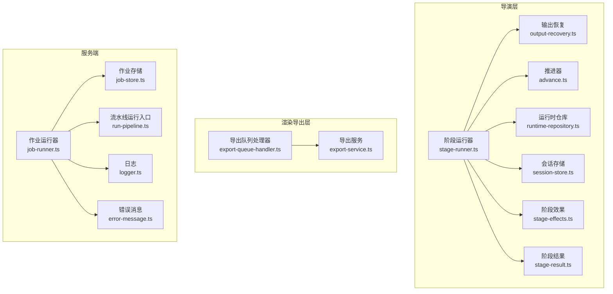
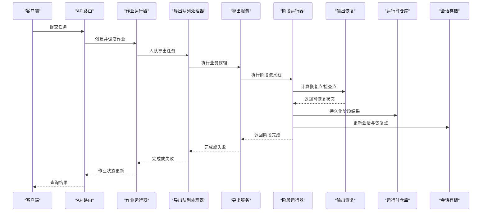
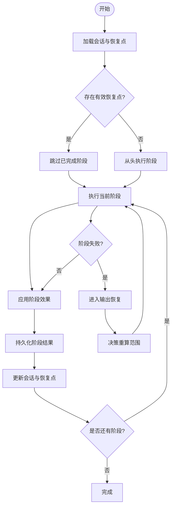
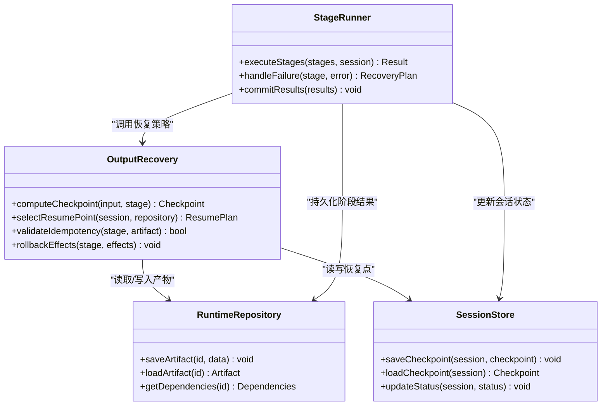
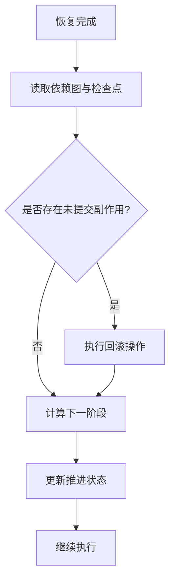
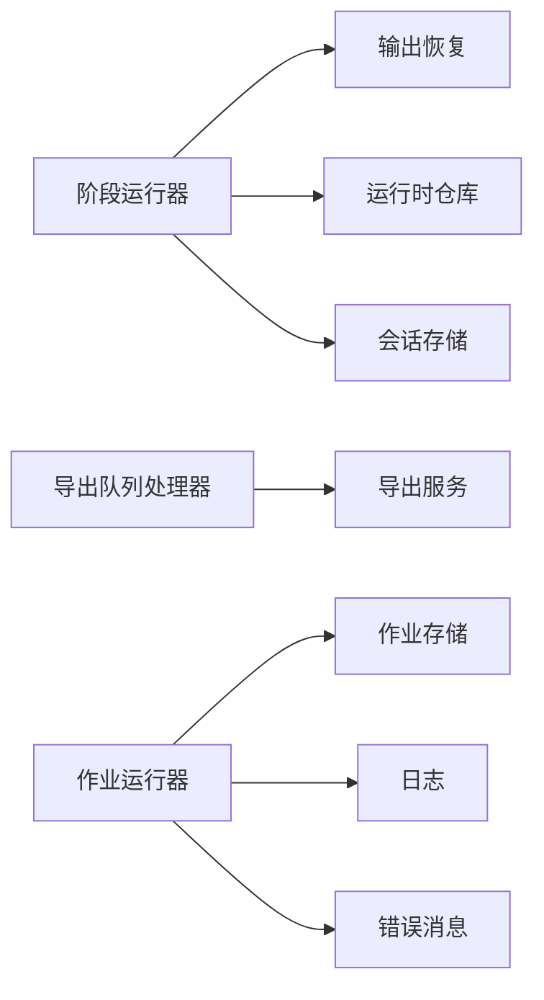

# 恢复系统

<cite>
**本文引用的文件**   
- [output-recovery.ts](file://src/features/director/output-recovery.ts)
- [stage-runner.ts](file://src/features/director/stage-runner.ts)
- [advance.ts](file://src/features/director/advance.ts)
- [runtime-repository.ts](file://src/features/director/runtime-repository.ts)
- [queue-handler.ts](file://src/features/director/queue-handler.ts)
- [job-runner.ts](file://server/src/server/job-runner.ts)
- [job-store.ts](file://server/src/server/job-store.ts)
- [pi-session.ts](file://src/features/director/pi-session.ts)
- [session-store.ts](file://src/features/director/session-store.ts)
- [stage-result.ts](file://src/features/director/stage-result.ts)
- [stage-effects.ts](file://src/features/director/stage-effects.ts)
- [logger.ts](file://server/src/lib/logger.ts)
- [error-message.ts](file://server/src/lib/error-message.ts)
- [run-pipeline.ts](file://server/src/compose/run-pipeline.ts)
- [render-service.ts](file://src/features/render/export-service.ts)
- [export-queue-handler.ts](file://src/features/render/export-queue-handler.ts)
</cite>

## 目录
1. [简介](#简介)
2. [项目结构](#项目结构)
3. [核心组件](#核心组件)
4. [架构总览](#架构总览)
5. [详细组件分析](#详细组件分析)
6. [依赖关系分析](#依赖关系分析)
7. [性能考量](#性能考量)
8. [故障排查指南](#故障排查指南)
9. [结论](#结论)
10. [附录](#附录)

## 简介
本文件为 PurpleInk 恢复系统的权威技术文档，聚焦于：
- 故障检测机制与自动恢复策略
- 补偿事务设计与一致性保证
- 输出恢复、任务取消等待与资源清理流程
- 恢复点选择、状态回滚与数据一致性
- 恢复监控、日志记录与故障分析工具
- 恢复策略配置与自定义恢复逻辑开发指南

目标读者包括后端工程师、运维人员以及需要扩展恢复能力的开发者。

## 项目结构
恢复能力贯穿“导演（Director）”、“渲染导出”和“服务端作业运行器”三大层：
- 导演层负责阶段执行、结果提交、会话持久化与恢复点管理
- 渲染导出层负责长耗时任务的队列处理与失败重试
- 服务端作业运行器负责调度、持久化与进程级异常恢复

图表来源
- [stage-runner.ts](file://src/features/director/stage-runner.ts)
- [output-recovery.ts](file://src/features/director/output-recovery.ts)
- [advance.ts](file://src/features/director/advance.ts)
- [runtime-repository.ts](file://src/features/director/runtime-repository.ts)
- [session-store.ts](file://src/features/director/session-store.ts)
- [stage-effects.ts](file://src/features/director/stage-effects.ts)
- [stage-result.ts](file://src/features/director/stage-result.ts)
- [export-queue-handler.ts](file://src/features/render/export-queue-handler.ts)
- [export-service.ts](file://src/features/render/export-service.ts)
- [job-runner.ts](file://server/src/server/job-runner.ts)
- [job-store.ts](file://server/src/server/job-store.ts)
- [run-pipeline.ts](file://server/src/compose/run-pipeline.ts)
- [logger.ts](file://server/src/lib/logger.ts)
- [error-message.ts](file://server/src/lib/error-message.ts)

章节来源
- [stage-runner.ts](file://src/features/director/stage-runner.ts)
- [output-recovery.ts](file://src/features/director/output-recovery.ts)
- [advance.ts](file://src/features/director/advance.ts)
- [runtime-repository.ts](file://src/features/director/runtime-repository.ts)
- [session-store.ts](file://src/features/director/session-store.ts)
- [stage-effects.ts](file://src/features/director/stage-effects.ts)
- [stage-result.ts](file://src/features/director/stage-result.ts)
- [export-queue-handler.ts](file://src/features/render/export-queue-handler.ts)
- [export-service.ts](file://src/features/render/export-service.ts)
- [job-runner.ts](file://server/src/server/job-runner.ts)
- [job-store.ts](file://server/src/server/job-store.ts)
- [run-pipeline.ts](file://server/src/compose/run-pipeline.ts)
- [logger.ts](file://server/src/lib/logger.ts)
- [error-message.ts](file://server/src/lib/error-message.ts)

## 核心组件
- 阶段运行器：编排阶段执行、捕获异常、触发恢复与回滚、提交结果
- 输出恢复：基于检查点与幂等性实现断点续跑与部分重算
- 推进器：在恢复后决定从哪个阶段继续推进
- 运行时仓库：持久化阶段输入/输出、中间产物与进度
- 会话存储：保存会话上下文、恢复点与元数据
- 阶段效果：副作用的原子提交与撤销
- 阶段结果：标准化阶段产出与校验
- 作业运行器：进程级调度、超时与重启、错误上报
- 作业存储：作业状态机与持久化
- 导出队列与服务：长任务重试、去抖与幂等写入
- 日志与错误消息：结构化日志与可观测性

章节来源
- [stage-runner.ts](file://src/features/director/stage-runner.ts)
- [output-recovery.ts](file://src/features/director/output-recovery.ts)
- [advance.ts](file://src/features/director/advance.ts)
- [runtime-repository.ts](file://src/features/director/runtime-repository.ts)
- [session-store.ts](file://src/features/director/session-store.ts)
- [stage-effects.ts](file://src/features/director/stage-effects.ts)
- [stage-result.ts](file://src/features/director/stage-result.ts)
- [job-runner.ts](file://server/src/server/job-runner.ts)
- [job-store.ts](file://server/src/server/job-store.ts)
- [export-queue-handler.ts](file://src/features/render/export-queue-handler.ts)
- [export-service.ts](file://src/features/render/export-service.ts)
- [logger.ts](file://server/src/lib/logger.ts)
- [error-message.ts](file://server/src/lib/error-message.ts)

## 架构总览
恢复系统在三个层面协作：
- 进程级：作业运行器负责启动、监控、重启与资源回收
- 任务级：导出队列处理器对长任务进行重试、退避与幂等写入
- 阶段级：阶段运行器结合输出恢复与推进器，实现细粒度断点续跑

图表来源
- [job-runner.ts](file://server/src/server/job-runner.ts)
- [export-queue-handler.ts](file://src/features/render/export-queue-handler.ts)
- [export-service.ts](file://src/features/render/export-service.ts)
- [stage-runner.ts](file://src/features/director/stage-runner.ts)
- [output-recovery.ts](file://src/features/director/output-recovery.ts)
- [runtime-repository.ts](file://src/features/director/runtime-repository.ts)
- [session-store.ts](file://src/features/director/session-store.ts)

## 详细组件分析

### 阶段运行器与恢复编排
- 职责：编排阶段执行、异常捕获、触发输出恢复、提交阶段结果、回滚副作用
- 关键点：
  - 每个阶段前后设置检查点，支持增量重算
  - 副作用通过阶段效果模块原子提交或撤销
  - 失败时进入恢复路径，依据恢复点选择最小重算范围
  - 成功时提交结果并推进会话状态

图表来源
- [stage-runner.ts](file://src/features/director/stage-runner.ts)
- [output-recovery.ts](file://src/features/director/output-recovery.ts)
- [stage-effects.ts](file://src/features/director/stage-effects.ts)
- [runtime-repository.ts](file://src/features/director/runtime-repository.ts)
- [session-store.ts](file://src/features/director/session-store.ts)

章节来源
- [stage-runner.ts](file://src/features/director/stage-runner.ts)
- [output-recovery.ts](file://src/features/director/output-recovery.ts)
- [stage-effects.ts](file://src/features/director/stage-effects.ts)
- [runtime-repository.ts](file://src/features/director/runtime-repository.ts)
- [session-store.ts](file://src/features/director/session-store.ts)

### 输出恢复与恢复点选择
- 职责：根据已持久化的阶段结果与依赖关系，确定最小重算集合
- 关键点：
  - 检查点粒度以阶段为单位，支持跨阶段依赖追踪
  - 幂等写入确保重复执行不产生副作用
  - 恢复点包含输入哈希、阶段版本与产物指纹
  - 失败分支自动降级到最近稳定检查点

图表来源
- [output-recovery.ts](file://src/features/director/output-recovery.ts)
- [stage-runner.ts](file://src/features/director/stage-runner.ts)
- [runtime-repository.ts](file://src/features/director/runtime-repository.ts)
- [session-store.ts](file://src/features/director/session-store.ts)

章节来源
- [output-recovery.ts](file://src/features/director/output-recovery.ts)
- [stage-runner.ts](file://src/features/director/stage-runner.ts)
- [runtime-repository.ts](file://src/features/director/runtime-repository.ts)
- [session-store.ts](file://src/features/director/session-store.ts)

### 推进器与状态回滚
- 职责：在恢复后决定下一步执行阶段，并在必要时回滚未提交的状态
- 关键点：
  - 基于阶段依赖图与检查点状态计算推进计划
  - 对未完成副作用进行撤销，保证一致性
  - 支持软回滚（仅标记）与硬回滚（删除产物）

图表来源
- [advance.ts](file://src/features/director/advance.ts)
- [stage-effects.ts](file://src/features/director/stage-effects.ts)
- [stage-result.ts](file://src/features/director/stage-result.ts)

章节来源
- [advance.ts](file://src/features/director/advance.ts)
- [stage-effects.ts](file://src/features/director/stage-effects.ts)
- [stage-result.ts](file://src/features/director/stage-result.ts)

### 会话与会话存储
- 职责：维护会话上下文、恢复点、阶段进度与元数据
- 关键点：
  - 会话快照用于快速恢复
  - 恢复点包含输入摘要、阶段版本、产物指纹
  - 并发安全与事务性写入

章节来源
- [pi-session.ts](file://src/features/director/pi-session.ts)
- [session-store.ts](file://src/features/director/session-store.ts)

### 作业运行器与作业存储
- 职责：进程级调度、超时控制、异常捕获、重启策略与状态持久化
- 关键点：
  - 作业状态机驱动生命周期
  - 失败重试与指数退避
  - 资源清理与僵尸进程回收

章节来源
- [job-runner.ts](file://server/src/server/job-runner.ts)
- [job-store.ts](file://server/src/server/job-store.ts)

### 导出队列与服务
- 职责：长耗时任务的队列处理、重试、幂等写入与结果聚合
- 关键点：
  - 队列消费者隔离，避免单任务阻塞
  - 幂等键防止重复写入
  - 失败告警与降级策略

章节来源
- [export-queue-handler.ts](file://src/features/render/export-queue-handler.ts)
- [export-service.ts](file://src/features/render/export-service.ts)

### 流水线运行入口
- 职责：统一入口，协调作业运行器与导出服务，提供可观测性
- 关键点：
  - 参数校验与上下文注入
  - 生命周期钩子与监控埋点

章节来源
- [run-pipeline.ts](file://server/src/compose/run-pipeline.ts)

## 依赖关系分析
- 低耦合高内聚：各模块职责清晰，通过接口交互
- 关键依赖链：
  - 阶段运行器依赖输出恢复、运行时仓库与会话存储
  - 导出队列依赖导出服务与持久化层
  - 作业运行器依赖作业存储与日志模块
- 潜在循环依赖规避：通过抽象接口与事件解耦

图表来源
- [stage-runner.ts](file://src/features/director/stage-runner.ts)
- [output-recovery.ts](file://src/features/director/output-recovery.ts)
- [runtime-repository.ts](file://src/features/director/runtime-repository.ts)
- [session-store.ts](file://src/features/director/session-store.ts)
- [export-queue-handler.ts](file://src/features/render/export-queue-handler.ts)
- [export-service.ts](file://src/features/render/export-service.ts)
- [job-runner.ts](file://server/src/server/job-runner.ts)
- [job-store.ts](file://server/src/server/job-store.ts)
- [logger.ts](file://server/src/lib/logger.ts)
- [error-message.ts](file://server/src/lib/error-message.ts)

章节来源
- [stage-runner.ts](file://src/features/director/stage-runner.ts)
- [output-recovery.ts](file://src/features/director/output-recovery.ts)
- [runtime-repository.ts](file://src/features/director/runtime-repository.ts)
- [session-store.ts](file://src/features/director/session-store.ts)
- [export-queue-handler.ts](file://src/features/render/export-queue-handler.ts)
- [export-service.ts](file://src/features/render/export-service.ts)
- [job-runner.ts](file://server/src/server/job-runner.ts)
- [job-store.ts](file://server/src/server/job-store.ts)
- [logger.ts](file://server/src/lib/logger.ts)
- [error-message.ts](file://server/src/lib/error-message.ts)

## 性能考量
- 检查点粒度：以阶段为单位平衡恢复速度与存储开销
- 幂等写入：避免重复计算与IO放大
- 队列背压：限制并发消费，防止内存溢出
- 缓存命中：利用产物指纹提升恢复命中率
- 资源回收：及时释放临时文件与句柄

[本节为通用指导，无需特定文件引用]

## 故障排查指南
- 日志定位：使用结构化日志关键字过滤，关注阶段失败与恢复路径
- 错误分类：区分网络错误、资源不足与业务异常，采用不同重试策略
- 恢复验证：检查恢复点一致性与产物指纹匹配
- 监控指标：队列长度、重试次数、恢复成功率、平均恢复时间
- 诊断工具：导出会话快照、阶段依赖图与检查点详情

章节来源
- [logger.ts](file://server/src/lib/logger.ts)
- [error-message.ts](file://server/src/lib/error-message.ts)

## 结论
PurpleInk 恢复系统通过阶段级检查点、幂等写入与细粒度恢复策略，实现了高可用的断点续跑与一致性保障。配合作业运行器的进程级容错与导出队列的长任务重试，整体具备较强的鲁棒性与可扩展性。建议在生产环境启用完整监控与告警，并定期演练恢复流程以确保可靠性。

[本节为总结性内容，无需特定文件引用]

## 附录
- 恢复策略配置要点：
  - 检查点频率与粒度
  - 重试次数与退避策略
  - 幂等键生成规则
  - 资源清理阈值
- 自定义恢复逻辑开发指南：
  - 实现幂等写入接口
  - 注册阶段效果的回滚逻辑
  - 扩展恢复点数据结构
  - 接入监控与日志埋点

[本节为通用指导，无需特定文件引用]