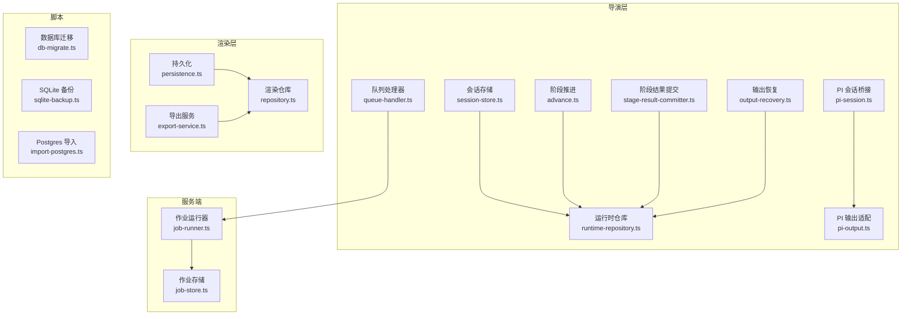
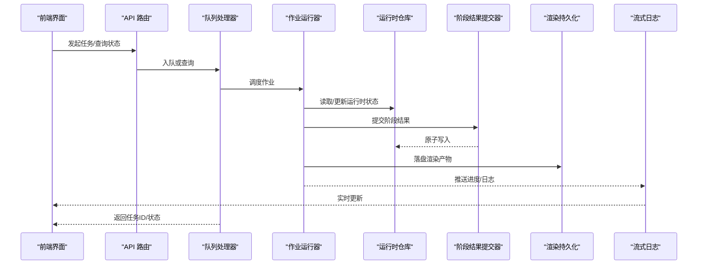
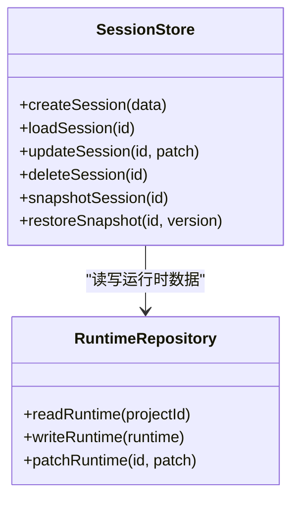
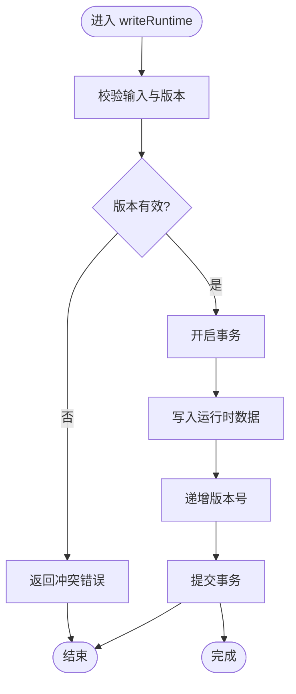
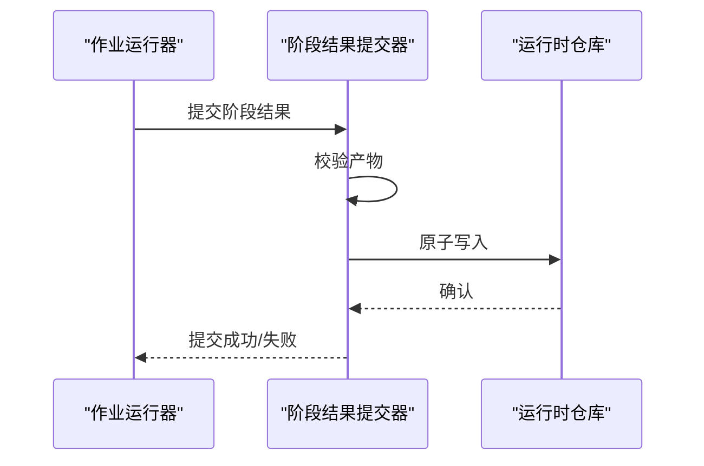
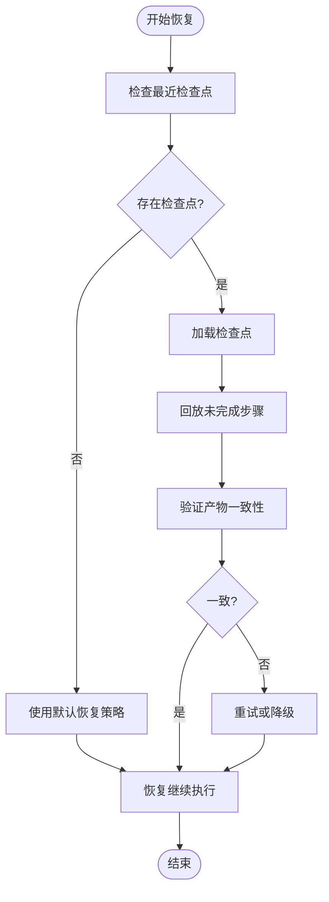
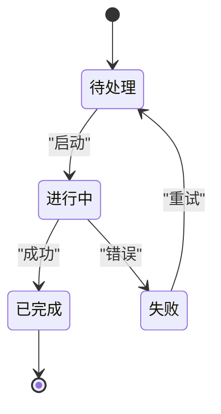
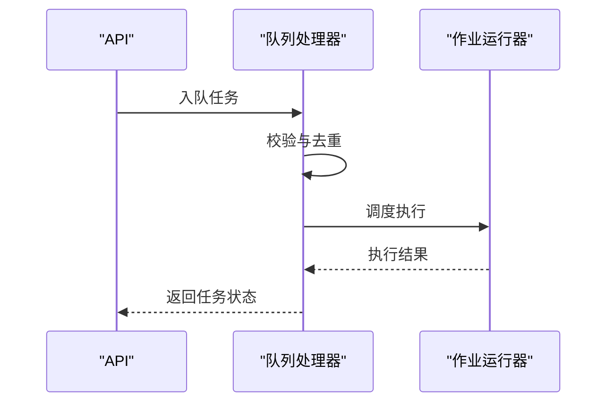
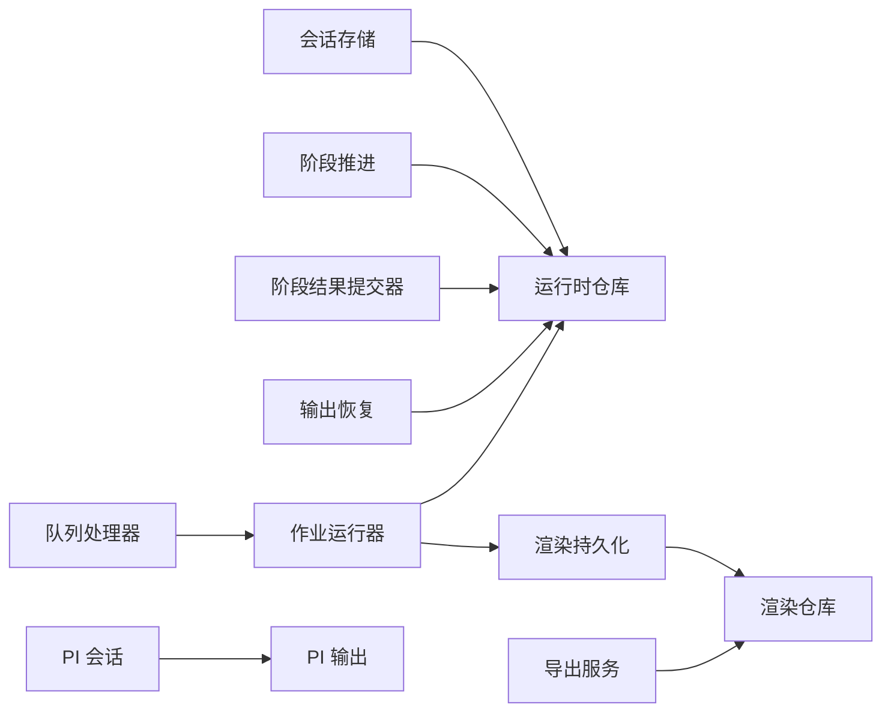

# 状态持久化

<cite>
**本文引用的文件**   
- [session-store.ts](file://src/features/director/session-store.ts)
- [runtime-repository.ts](file://src/features/director/runtime-repository.ts)
- [stage-result-committer.ts](file://src/features/director/stage-result-committer.ts)
- [output-recovery.ts](file://src/features/director/output-recovery.ts)
- [advance.ts](file://src/features/director/advance.ts)
- [queue-handler.ts](file://src/features/director/queue-handler.ts)
- [job-runner.ts](file://server/src/server/job-runner.ts)
- [job-store.ts](file://server/src/server/job-store.ts)
- [persistence.ts](file://src/features/render/persistence.ts)
- [repository.ts](file://src/features/render/repository.ts)
- [export-service.ts](file://src/features/render/export-service.ts)
- [pi-session.ts](file://src/features/director/pi-session.ts)
- [pi-output.ts](file://src/features/director/pi-output.ts)
- [streaming-log-card.tsx](file://src/app/products/(app)/canvas/[projectId]/streaming-log-card.tsx)
- [live-status.ts](file://src/app/products/(app)/canvas/[projectId]/live-status.ts)
- [db-migrate.ts](file://scripts/setup/db-migrate.ts)
- [sqlite-backup.ts](file://scripts/migration/sqlite-backup.ts)
- [import-postgres.ts](file://scripts/migration/import-postgres.ts)
</cite>

## 目录
1. [简介](#简介)
2. [项目结构](#项目结构)
3. [核心组件](#核心组件)
4. [架构总览](#架构总览)
5. [详细组件分析](#详细组件分析)
6. [依赖关系分析](#依赖关系分析)
7. [性能考虑](#性能考虑)
8. [故障排查指南](#故障排查指南)
9. [结论](#结论)
10. [附录](#附录)

## 简介
本文件面向 PurpleInk 的状态持久化系统，聚焦以下目标：
- 会话存储机制与运行时数据持久化
- 进度跟踪策略、状态快照与版本控制
- 恢复机制、并发访问控制与一致性保证
- 状态迁移、备份恢复与性能优化
- 状态查询、监控与调试工具使用指南

PurpleInk 的持久化体系贯穿“导演（Director）”编排与“渲染（Render）”管线，通过数据库仓库、作业队列与流式日志等能力，实现跨进程、跨阶段的可靠状态管理。

## 项目结构
与状态持久化相关的代码主要分布在：
- 导演层（Director）：会话、阶段推进、结果提交、输出恢复、队列处理
- 渲染层（Render）：持久化、仓库、导出服务
- 服务端（Server）：作业运行器与作业存储
- 脚本（Scripts）：数据库迁移、备份与导入

图表来源
- [session-store.ts](file://src/features/director/session-store.ts)
- [runtime-repository.ts](file://src/features/director/runtime-repository.ts)
- [stage-result-committer.ts](file://src/features/director/stage-result-committer.ts)
- [output-recovery.ts](file://src/features/director/output-recovery.ts)
- [advance.ts](file://src/features/director/advance.ts)
- [queue-handler.ts](file://src/features/director/queue-handler.ts)
- [job-runner.ts](file://server/src/server/job-runner.ts)
- [job-store.ts](file://server/src/server/job-store.ts)
- [persistence.ts](file://src/features/render/persistence.ts)
- [repository.ts](file://src/features/render/repository.ts)
- [export-service.ts](file://src/features/render/export-service.ts)
- [pi-session.ts](file://src/features/director/pi-session.ts)
- [pi-output.ts](file://src/features/director/pi-output.ts)
- [db-migrate.ts](file://scripts/setup/db-migrate.ts)
- [sqlite-backup.ts](file://scripts/migration/sqlite-backup.ts)
- [import-postgres.ts](file://scripts/migration/import-postgres.ts)

章节来源
- [session-store.ts](file://src/features/director/session-store.ts)
- [runtime-repository.ts](file://src/features/director/runtime-repository.ts)
- [stage-result-committer.ts](file://src/features/director/stage-result-committer.ts)
- [output-recovery.ts](file://src/features/director/output-recovery.ts)
- [advance.ts](file://src/features/director/advance.ts)
- [queue-handler.ts](file://src/features/director/queue-handler.ts)
- [job-runner.ts](file://server/src/server/job-runner.ts)
- [job-store.ts](file://server/src/server/job-store.ts)
- [persistence.ts](file://src/features/render/persistence.ts)
- [repository.ts](file://src/features/render/repository.ts)
- [export-service.ts](file://src/features/render/export-service.ts)
- [pi-session.ts](file://src/features/director/pi-session.ts)
- [pi-output.ts](file://src/features/director/pi-output.ts)
- [db-migrate.ts](file://scripts/setup/db-migrate.ts)
- [sqlite-backup.ts](file://scripts/migration/sqlite-backup.ts)
- [import-postgres.ts](file://scripts/migration/import-postgres.ts)

## 核心组件
- 会话存储（Session Store）：负责会话生命周期、上下文与元数据的持久化与读取
- 运行时仓库（Runtime Repository）：统一读写运行时数据（节点输入/输出、阶段状态、进度）
- 阶段结果提交器（Stage Result Committer）：原子提交阶段产物，确保一致性
- 输出恢复（Output Recovery）：失败重试、幂等写入与断点续跑
- 阶段推进（Advance）：驱动阶段流转，更新状态机并触发后续动作
- 队列处理器（Queue Handler）：任务入队、调度与执行边界
- 作业运行器（Job Runner）：后台作业执行与状态回写
- 作业存储（Job Store）：作业持久化与查询
- 渲染持久化（Persistence）：渲染产物落盘与索引
- 渲染仓库（Repository）：渲染相关实体存取
- 导出服务（Export Service）：导出任务编排与状态追踪
- PI 会话桥接（PI Session）：与外部 AI 会话交互的持久化桥接
- PI 输出适配（PI Output）：AI 输出的结构化持久化

章节来源
- [session-store.ts](file://src/features/director/session-store.ts)
- [runtime-repository.ts](file://src/features/director/runtime-repository.ts)
- [stage-result-committer.ts](file://src/features/director/stage-result-committer.ts)
- [output-recovery.ts](file://src/features/director/output-recovery.ts)
- [advance.ts](file://src/features/director/advance.ts)
- [queue-handler.ts](file://src/features/director/queue-handler.ts)
- [job-runner.ts](file://server/src/server/job-runner.ts)
- [job-store.ts](file://server/src/server/job-store.ts)
- [persistence.ts](file://src/features/render/persistence.ts)
- [repository.ts](file://src/features/render/repository.ts)
- [export-service.ts](file://src/features/render/export-service.ts)
- [pi-session.ts](file://src/features/director/pi-session.ts)
- [pi-output.ts](file://src/features/director/pi-output.ts)

## 架构总览
下图展示了从前端请求到后端作业执行、再到状态落盘的完整链路，以及流式日志与实时状态的反馈路径。

图表来源
- [queue-handler.ts](file://src/features/director/queue-handler.ts)
- [job-runner.ts](file://server/src/server/job-runner.ts)
- [runtime-repository.ts](file://src/features/director/runtime-repository.ts)
- [stage-result-committer.ts](file://src/features/director/stage-result-committer.ts)
- [persistence.ts](file://src/features/render/persistence.ts)
- [streaming-log-card.tsx](file://src/app/products/(app)/canvas/[projectId]/streaming-log-card.tsx)

## 详细组件分析

### 会话存储（Session Store）
职责
- 会话创建、加载、更新与销毁
- 会话元数据与上下文的持久化
- 与运行时仓库协作，维护会话级状态

关键点
- 会话 ID 作为主键，确保唯一性
- 支持增量更新与全量快照两种模式
- 错误时回滚至最近一致快照

图表来源
- [session-store.ts](file://src/features/director/session-store.ts)
- [runtime-repository.ts](file://src/features/director/runtime-repository.ts)

章节来源
- [session-store.ts](file://src/features/director/session-store.ts)
- [runtime-repository.ts](file://src/features/director/runtime-repository.ts)

### 运行时仓库（Runtime Repository）
职责
- 统一的运行时数据存取接口
- 阶段状态、节点输入/输出、进度指标
- 事务与一致性保障

关键点
- 读写分离与批量操作
- 版本号字段用于乐观锁
- 失败重试与幂等写入

图表来源
- [runtime-repository.ts](file://src/features/director/runtime-repository.ts)

章节来源
- [runtime-repository.ts](file://src/features/director/runtime-repository.ts)

### 阶段结果提交器（Stage Result Committer）
职责
- 将阶段产物原子提交到运行时仓库
- 校验产物完整性与一致性
- 失败时进行补偿与回滚

关键点
- 幂等提交，避免重复写入
- 支持部分成功与最终一致性
- 记录提交审计日志

图表来源
- [stage-result-committer.ts](file://src/features/director/stage-result-committer.ts)
- [runtime-repository.ts](file://src/features/director/runtime-repository.ts)

章节来源
- [stage-result-committer.ts](file://src/features/director/stage-result-committer.ts)
- [runtime-repository.ts](file://src/features/director/runtime-repository.ts)

### 输出恢复（Output Recovery）
职责
- 失败任务的自动重试与断点续跑
- 幂等写入与去重
- 恢复策略配置与降级

关键点
- 指数退避与最大重试次数
- 检查点保存与恢复
- 可观测性与告警

图表来源
- [output-recovery.ts](file://src/features/director/output-recovery.ts)

章节来源
- [output-recovery.ts](file://src/features/director/output-recovery.ts)

### 阶段推进（Advance）
职责
- 驱动阶段状态机流转
- 触发下一阶段与副作用
- 记录推进历史与审计

关键点
- 状态转换规则与约束
- 事件驱动与回调
- 失败时的状态回退

图表来源
- [advance.ts](file://src/features/director/advance.ts)

章节来源
- [advance.ts](file://src/features/director/advance.ts)

### 队列处理器（Queue Handler）
职责
- 任务入队、出队与调度
- 并发控制与限流
- 失败重试与死信队列

关键点
- 优先级与公平调度
- 幂等消费与去重
- 监控指标与告警

图表来源
- [queue-handler.ts](file://src/features/director/queue-handler.ts)
- [job-runner.ts](file://server/src/server/job-runner.ts)

章节来源
- [queue-handler.ts](file://src/features/director/queue-handler.ts)
- [job-runner.ts](file://server/src/server/job-runner.ts)

### 作业运行器（Job Runner）
职责
- 后台作业执行与状态管理
- 资源隔离与超时控制
- 与运行时仓库和持久化模块交互

关键点
- 并行度控制与资源池
- 异常捕获与上报
- 健康检查与自愈

章节来源
- [job-runner.ts](file://server/src/server/job-runner.ts)
- [job-store.ts](file://server/src/server/job-store.ts)

### 渲染持久化（Persistence）
职责
- 渲染产物落盘与索引
- 分片与压缩
- 缓存与命中策略

关键点
- 对象存储与本地缓存
- 元数据与内容哈希
- 清理与归档策略

章节来源
- [persistence.ts](file://src/features/render/persistence.ts)
- [repository.ts](file://src/features/render/repository.ts)

### 导出服务（Export Service）
职责
- 导出任务编排与状态追踪
- 多格式支持与质量配置
- 失败重试与进度上报

关键点
- 流水线式处理
- 中间产物暂存
- 用户通知与下载链接

章节来源
- [export-service.ts](file://src/features/render/export-service.ts)

### PI 会话桥接（PI Session）与输出适配（PI Output）
职责
- 与外部 AI 会话交互的持久化桥接
- AI 输出的结构化与版本化
- 会话上下文同步与恢复

关键点
- 会话令牌与鉴权
- 输出校验与回滚
- 流式传输与缓冲

章节来源
- [pi-session.ts](file://src/features/director/pi-session.ts)
- [pi-output.ts](file://src/features/director/pi-output.ts)

## 依赖关系分析
- 低耦合高内聚：各组件通过明确接口交互，减少直接依赖
- 事务边界清晰：运行时仓库与提交器承担一致性责任
- 异步解耦：队列与作业运行器分离执行与调度
- 可观测性：日志、指标与状态查询贯穿全流程

图表来源
- [session-store.ts](file://src/features/director/session-store.ts)
- [runtime-repository.ts](file://src/features/director/runtime-repository.ts)
- [stage-result-committer.ts](file://src/features/director/stage-result-committer.ts)
- [output-recovery.ts](file://src/features/director/output-recovery.ts)
- [advance.ts](file://src/features/director/advance.ts)
- [queue-handler.ts](file://src/features/director/queue-handler.ts)
- [job-runner.ts](file://server/src/server/job-runner.ts)
- [persistence.ts](file://src/features/render/persistence.ts)
- [repository.ts](file://src/features/render/repository.ts)
- [export-service.ts](file://src/features/render/export-service.ts)
- [pi-session.ts](file://src/features/director/pi-session.ts)
- [pi-output.ts](file://src/features/director/pi-output.ts)

章节来源
- [session-store.ts](file://src/features/director/session-store.ts)
- [runtime-repository.ts](file://src/features/director/runtime-repository.ts)
- [stage-result-committer.ts](file://src/features/director/stage-result-committer.ts)
- [output-recovery.ts](file://src/features/director/output-recovery.ts)
- [advance.ts](file://src/features/director/advance.ts)
- [queue-handler.ts](file://src/features/director/queue-handler.ts)
- [job-runner.ts](file://server/src/server/job-runner.ts)
- [persistence.ts](file://src/features/render/persistence.ts)
- [repository.ts](file://src/features/render/repository.ts)
- [export-service.ts](file://src/features/render/export-service.ts)
- [pi-session.ts](file://src/features/director/pi-session.ts)
- [pi-output.ts](file://src/features/director/pi-output.ts)

## 性能考虑
- 批量写入与合并：减少数据库往返与锁竞争
- 索引优化：针对常用查询字段建立合适索引
- 缓存策略：热点数据缓存与失效策略
- 异步处理：长耗时任务入队与后台执行
- 资源限制：并发度与内存上限控制
- 压缩与分片：大文件存储与传输优化

[本节为通用指导，不直接分析具体文件]

## 故障排查指南
常见问题与定位方法
- 状态不一致：检查事务边界与提交器日志
- 任务卡住：查看队列长度与作业运行器健康状态
- 恢复失败：检查检查点与恢复策略配置
- 导出失败：核对产物完整性与权限

实用工具
- 流式日志卡片：实时查看任务执行日志
- 实时状态面板：监控阶段状态与进度
- 数据库迁移脚本：验证结构与数据一致性
- 备份与导入：快速恢复与迁移

章节来源
- [streaming-log-card.tsx](file://src/app/products/(app)/canvas/[projectId]/streaming-log-card.tsx)
- [live-status.ts](file://src/app/products/(app)/canvas/[projectId]/live-status.ts)
- [db-migrate.ts](file://scripts/setup/db-migrate.ts)
- [sqlite-backup.ts](file://scripts/migration/sqlite-backup.ts)
- [import-postgres.ts](file://scripts/migration/import-postgres.ts)

## 结论
PurpleInk 的状态持久化系统以“会话存储 + 运行时仓库 + 阶段提交器”为核心，结合队列与作业运行器实现可靠的异步处理，辅以输出恢复与持久化模块保障数据一致性与可用性。通过完善的监控与调试工具，团队能够快速定位问题并优化性能。建议在生产环境中启用严格的备份与迁移流程，并持续优化索引与缓存策略以提升整体吞吐。

[本节为总结，不直接分析具体文件]

## 附录
- 术语表
  - 运行时数据：阶段状态、节点输入/输出、进度指标等
  - 检查点：用于恢复的执行状态快照
  - 幂等写入：多次执行产生相同结果
  - 乐观锁：基于版本号的并发控制
- 最佳实践
  - 始终使用事务边界包裹关键写入
  - 为高频查询字段建立索引
  - 对长耗时任务采用异步队列
  - 定期备份与演练恢复流程

[本节为补充信息，不直接分析具体文件]