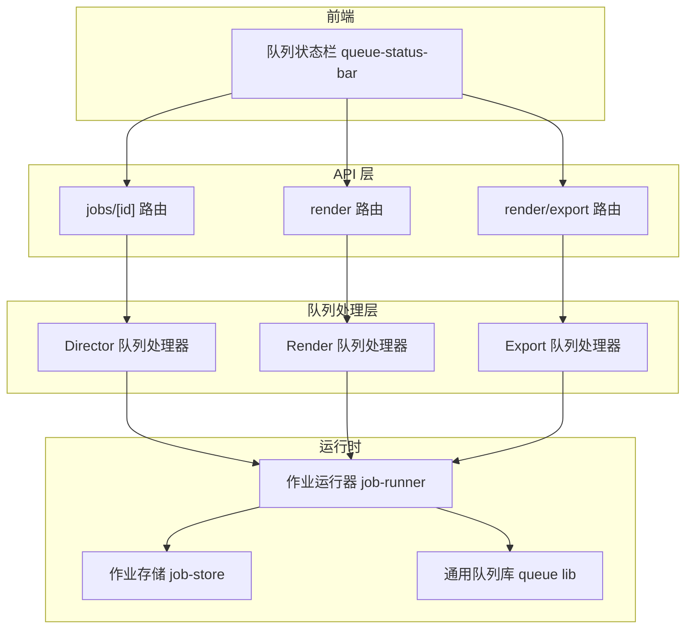
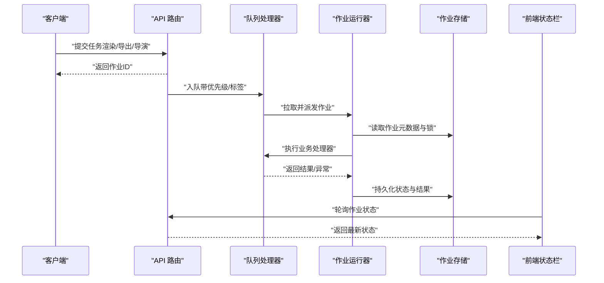
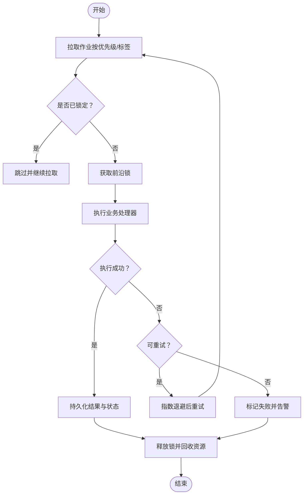
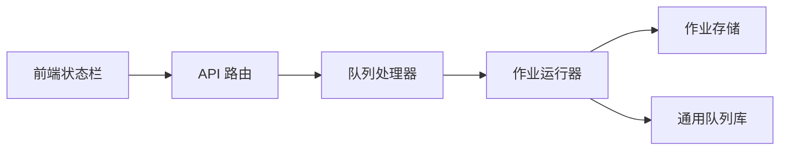

# 队列处理器

<cite>
**本文引用的文件**   
- [server/src/server/job-runner.ts](file://server/src/server/job-runner.ts)
- [server/src/server/job-store.ts](file://server/src/server/job-store.ts)
- [src/features/director/queue-handler.ts](file://src/features/director/queue-handler.ts)
- [src/features/render/export-queue-handler.ts](file://src/features/render/export-queue-handler.ts)
- [src/features/render/queue-handler.ts](file://src/features/render/queue-handler.ts)
- [src/lib/queue/index.ts](file://src/lib/queue/index.ts)
- [src/app/api/jobs/[id]/route.ts](file://src/app/api/jobs/[id]/route.ts)
- [src/app/api/render/route.ts](file://src/app/api/render/route.ts)
- [src/app/api/render/export/route.ts](file://src/app/api/render/export/route.ts)
- [src/components/ui/queue-status-bar.tsx](file://src/components/ui/queue-status-bar.tsx)
- [docs/issues/ISSUE-004-queue-concurrency-lanes.md](file://docs/issues/ISSUE-004-queue-concurrency-lanes.md)
</cite>

## 目录
1. [简介](#简介)
2. [项目结构](#项目结构)
3. [核心组件](#核心组件)
4. [架构总览](#架构总览)
5. [详细组件分析](#详细组件分析)
6. [依赖关系分析](#依赖关系分析)
7. [性能考量](#性能考量)
8. [故障排查指南](#故障排查指南)
9. [结论](#结论)
10. [附录](#附录)

## 简介
本文件为 PurpleInK 的队列处理器提供系统化文档，覆盖任务队列设计、优先级调度与并发控制机制，前沿锁定（front-locking）、冲突检测与协调算法，以及任务分发、负载均衡与故障转移策略。同时给出队列监控、性能调优与容量规划指南，并提供自定义队列处理器与调度策略的开发示例路径，帮助读者快速扩展与优化系统能力。

## 项目结构
队列相关代码主要分布在以下位置：
- 服务端作业运行器与存储：server/src/server/job-runner.ts、server/src/server/job-store.ts
- 业务队列处理器：src/features/director/queue-handler.ts、src/features/render/queue-handler.ts、src/features/render/export-queue-handler.ts
- 通用队列库：src/lib/queue/index.ts
- API 路由入口：src/app/api/jobs/[id]/route.ts、src/app/api/render/route.ts、src/app/api/render/export/route.ts
- 前端队列状态展示：src/components/ui/queue-status-bar.tsx
- 并发通道设计说明：docs/issues/ISSUE-004-queue-concurrency-lanes.md

图表来源
- [server/src/server/job-runner.ts](file://server/src/server/job-runner.ts)
- [server/src/server/job-store.ts](file://server/src/server/job-store.ts)
- [src/features/director/queue-handler.ts](file://src/features/director/queue-handler.ts)
- [src/features/render/queue-handler.ts](file://src/features/render/queue-handler.ts)
- [src/features/render/export-queue-handler.ts](file://src/features/render/export-queue-handler.ts)
- [src/lib/queue/index.ts](file://src/lib/queue/index.ts)
- [src/app/api/jobs/[id]/route.ts](file://src/app/api/jobs/[id]/route.ts)
- [src/app/api/render/route.ts](file://src/app/api/render/route.ts)
- [src/app/api/render/export/route.ts](file://src/app/api/render/export/route.ts)
- [src/components/ui/queue-status-bar.tsx](file://src/components/ui/queue-status-bar.tsx)

章节来源
- [server/src/server/job-runner.ts](file://server/src/server/job-runner.ts)
- [server/src/server/job-store.ts](file://server/src/server/job-store.ts)
- [src/features/director/queue-handler.ts](file://src/features/director/queue-handler.ts)
- [src/features/render/queue-handler.ts](file://src/features/render/queue-handler.ts)
- [src/features/render/export-queue-handler.ts](file://src/features/render/export-queue-handler.ts)
- [src/lib/queue/index.ts](file://src/lib/queue/index.ts)
- [src/app/api/jobs/[id]/route.ts](file://src/app/api/jobs/[id]/route.ts)
- [src/app/api/render/route.ts](file://src/app/api/render/route.ts)
- [src/app/api/render/export/route.ts](file://src/app/api/render/export/route.ts)
- [src/components/ui/queue-status-bar.tsx](file://src/components/ui/queue-status-bar.tsx)

## 核心组件
- 作业运行器（job-runner）：负责从队列拉取作业、执行生命周期管理、错误恢复与重试、并发控制与限流。
- 作业存储（job-store）：持久化作业元数据、状态机、结果与审计信息，支持事务与一致性保障。
- 队列处理器（queue-handler）：面向具体业务的任务编排与执行逻辑，如导演流程、渲染、导出等。
- 通用队列库（queue lib）：提供队列抽象、优先级队列、去重、背压与指标上报等基础能力。
- API 路由：接收外部请求，入队任务并返回作业 ID，供前端轮询或事件驱动更新。
- 前端状态栏：展示队列长度、活跃作业数、失败率与吞吐等关键指标。

章节来源
- [server/src/server/job-runner.ts](file://server/src/server/job-runner.ts)
- [server/src/server/job-store.ts](file://server/src/server/job-store.ts)
- [src/features/director/queue-handler.ts](file://src/features/director/queue-handler.ts)
- [src/features/render/queue-handler.ts](file://src/features/render/queue-handler.ts)
- [src/features/render/export-queue-handler.ts](file://src/features/render/export-queue-handler.ts)
- [src/lib/queue/index.ts](file://src/lib/queue/index.ts)
- [src/app/api/jobs/[id]/route.ts](file://src/app/api/jobs/[id]/route.ts)
- [src/app/api/render/route.ts](file://src/app/api/render/route.ts)
- [src/app/api/render/export/route.ts](file://src/app/api/render/export/route.ts)
- [src/components/ui/queue-status-bar.tsx](file://src/components/ui/queue-status-bar.tsx)

## 架构总览
下图展示了从 API 到队列处理器再到作业运行器的端到端调用链，以及状态回写与前端展示的闭环。

图表来源
- [src/app/api/jobs/[id]/route.ts](file://src/app/api/jobs/[id]/route.ts)
- [src/app/api/render/route.ts](file://src/app/api/render/route.ts)
- [src/app/api/render/export/route.ts](file://src/app/api/render/export/route.ts)
- [src/features/director/queue-handler.ts](file://src/features/director/queue-handler.ts)
- [src/features/render/queue-handler.ts](file://src/features/render/queue-handler.ts)
- [src/features/render/export-queue-handler.ts](file://src/features/render/export-queue-handler.ts)
- [server/src/server/job-runner.ts](file://server/src/server/job-runner.ts)
- [server/src/server/job-store.ts](file://server/src/server/job-store.ts)
- [src/components/ui/queue-status-bar.tsx](file://src/components/ui/queue-status-bar.tsx)

## 详细组件分析

### 作业运行器（job-runner）
- 职责：作业拉取、生命周期管理、并发控制、重试与退避、超时与取消、指标采集。
- 并发控制：基于“通道”（lanes）隔离不同类别作业，避免相互干扰；通过令牌桶或信号量限制全局并发度。
- 前沿锁定：在拉取阶段对同一资源键加锁，防止重复消费；结合幂等键确保跨进程安全。
- 错误处理：区分可重试与不可重试错误，记录审计日志，触发告警与降级策略。

图表来源
- [server/src/server/job-runner.ts](file://server/src/server/job-runner.ts)
- [server/src/server/job-store.ts](file://server/src/server/job-store.ts)

章节来源
- [server/src/server/job-runner.ts](file://server/src/server/job-runner.ts)
- [server/src/server/job-store.ts](file://server/src/server/job-store.ts)

### 作业存储（job-store）
- 职责：作业元数据、状态机、结果、审计与追踪信息的持久化；支持事务与一致性。
- 一致性：使用分布式锁或数据库唯一约束保证作业状态迁移原子性。
- 查询接口：提供按作业ID、状态、标签、时间窗口的查询能力，支撑监控与回溯。

章节来源
- [server/src/server/job-store.ts](file://server/src/server/job-store.ts)

### Director 队列处理器（director）
- 职责：导演流程的任务编排，包括脚本生成、素材准备、节点执行与结果聚合。
- 调度策略：按阶段优先级与依赖关系组织子任务，支持并行与串行混合。
- 冲突检测：对共享资源（如模型、模板）进行访问冲突检测与协调，避免竞态条件。

章节来源
- [src/features/director/queue-handler.ts](file://src/features/director/queue-handler.ts)

### Render 队列处理器（render）
- 职责：渲染管线任务执行，包括帧捕获、编码、合成与产物输出。
- 并发控制：按项目或镜头维度分片，限制 GPU/CPU 占用，避免资源争用。
- 故障转移：断点续跑与中间产物缓存，失败时自动恢复。

章节来源
- [src/features/render/queue-handler.ts](file://src/features/render/queue-handler.ts)

### Export 队列处理器（export）
- 职责：导出任务编排，包括格式转换、打包与上传。
- 负载均衡：根据目标存储与网络带宽动态调整并发度。
- 质量检查：导出前后校验，确保产物完整性与一致性。

章节来源
- [src/features/render/export-queue-handler.ts](file://src/features/render/export-queue-handler.ts)

### 通用队列库（queue lib）
- 职责：提供队列抽象、优先级队列、去重、背压、指标上报与可观测性。
- 扩展点：允许注册自定义调度策略与处理器适配器。

章节来源
- [src/lib/queue/index.ts](file://src/lib/queue/index.ts)

### API 路由（jobs / render / export）
- 职责：接收外部请求，参数校验，入队任务并返回作业ID；提供状态查询接口。
- 鉴权与限流：对入队速率进行限制，防止滥用与雪崩。

章节来源
- [src/app/api/jobs/[id]/route.ts](file://src/app/api/jobs/[id]/route.ts)
- [src/app/api/render/route.ts](file://src/app/api/render/route.ts)
- [src/app/api/render/export/route.ts](file://src/app/api/render/export/route.ts)

### 前端队列状态栏（queue-status-bar）
- 职责：展示队列长度、活跃作业数、失败率、吞吐与延迟分布。
- 交互：支持刷新、过滤与跳转至作业详情。

章节来源
- [src/components/ui/queue-status-bar.tsx](file://src/components/ui/queue-status-bar.tsx)

## 依赖关系分析
- API 路由依赖队列处理器进行任务入队。
- 队列处理器依赖作业运行器与作业存储完成执行与持久化。
- 作业运行器依赖通用队列库实现并发控制与调度。
- 前端状态栏依赖 API 路由获取实时状态。

图表来源
- [src/app/api/jobs/[id]/route.ts](file://src/app/api/jobs/[id]/route.ts)
- [src/app/api/render/route.ts](file://src/app/api/render/route.ts)
- [src/app/api/render/export/route.ts](file://src/app/api/render/export/route.ts)
- [src/features/director/queue-handler.ts](file://src/features/director/queue-handler.ts)
- [src/features/render/queue-handler.ts](file://src/features/render/queue-handler.ts)
- [src/features/render/export-queue-handler.ts](file://src/features/render/export-queue-handler.ts)
- [server/src/server/job-runner.ts](file://server/src/server/job-runner.ts)
- [server/src/server/job-store.ts](file://server/src/server/job-store.ts)
- [src/lib/queue/index.ts](file://src/lib/queue/index.ts)
- [src/components/ui/queue-status-bar.tsx](file://src/components/ui/queue-status-bar.tsx)

章节来源
- [src/app/api/jobs/[id]/route.ts](file://src/app/api/jobs/[id]/route.ts)
- [src/app/api/render/route.ts](file://src/app/api/render/route.ts)
- [src/app/api/render/export/route.ts](file://src/app/api/render/export/route.ts)
- [src/features/director/queue-handler.ts](file://src/features/director/queue-handler.ts)
- [src/features/render/queue-handler.ts](file://src/features/render/queue-handler.ts)
- [src/features/render/export-queue-handler.ts](file://src/features/render/export-queue-handler.ts)
- [server/src/server/job-runner.ts](file://server/src/server/job-runner.ts)
- [server/src/server/job-store.ts](file://server/src/server/job-store.ts)
- [src/lib/queue/index.ts](file://src/lib/queue/index.ts)
- [src/components/ui/queue-status-bar.tsx](file://src/components/ui/queue-status-bar.tsx)

## 性能考量
- 并发通道（lanes）：按业务域划分通道，隔离热点与长尾任务，避免相互影响。参考并发通道设计说明。
- 优先级调度：高优先级任务优先拉取，但需设置上限以避免饥饿低优先级任务。
- 背压与限流：当下游资源紧张时，降低拉取速率，保护系统稳定性。
- 缓存与幂等：利用中间产物缓存与幂等键减少重复计算与网络开销。
- 指标与可观测性：采集吞吐、延迟、失败率与队列深度，用于容量规划与调优。

章节来源
- [docs/issues/ISSUE-004-queue-concurrency-lanes.md](file://docs/issues/ISSUE-004-queue-concurrency-lanes.md)
- [server/src/server/job-runner.ts](file://server/src/server/job-runner.ts)
- [src/lib/queue/index.ts](file://src/lib/queue/index.ts)

## 故障排查指南
- 常见问题
  - 作业堆积：检查通道并发度、下游资源利用率与背压策略。
  - 频繁重试：确认错误类型是否为可重试，调整退避策略与最大重试次数。
  - 锁竞争：查看前沿锁持有时间与锁粒度，必要时拆分资源键。
  - 数据不一致：核对作业存储的事务边界与状态迁移原子性。
- 诊断步骤
  - 通过 API 查询作业状态与审计日志。
  - 观察队列深度、活跃作业数与失败率趋势。
  - 定位阻塞点（CPU/GPU/IO），评估是否需要扩容或优化处理器逻辑。
- 恢复策略
  - 重启运行器实例以清理僵尸锁。
  - 重新入队失败作业，启用幂等键避免重复执行。
  - 临时提升通道并发度，缓解积压。

章节来源
- [server/src/server/job-runner.ts](file://server/src/server/job-runner.ts)
- [server/src/server/job-store.ts](file://server/src/server/job-store.ts)
- [src/app/api/jobs/[id]/route.ts](file://src/app/api/jobs/[id]/route.ts)

## 结论
PurpleInK 的队列处理器通过清晰的职责分层、严格的并发控制与一致的状态管理，实现了高可靠、可扩展的任务处理能力。借助前沿锁定、冲突检测与协调算法，系统在复杂业务场景下仍能保持稳定与高效。配合完善的监控与调优手段，能够从容应对流量波动与资源瓶颈。

## 附录

### 自定义队列处理器开发示例
- 定义处理器接口：实现任务解析、执行与结果回写。
- 注册调度策略：指定优先级、标签与通道归属。
- 接入运行器：通过通用队列库将处理器纳入调度循环。
- 测试与验证：编写单元测试与集成测试，覆盖正常路径与异常分支。

章节来源
- [src/lib/queue/index.ts](file://src/lib/queue/index.ts)
- [src/features/director/queue-handler.ts](file://src/features/director/queue-handler.ts)
- [src/features/render/queue-handler.ts](file://src/features/render/queue-handler.ts)
- [src/features/render/export-queue-handler.ts](file://src/features/render/export-queue-handler.ts)

### 容量规划指南
- 指标基线：采集平均吞吐、P95/P99 延迟与失败率。
- 资源估算：根据峰值负载与处理器耗时估算 CPU/GPU/内存需求。
- 弹性伸缩：基于队列深度与延迟阈值自动扩缩容运行器实例。
- 压测与演练：定期开展压力测试与故障演练，验证容量与恢复能力。

[本节为通用指导，不直接分析具体文件]