# 阶段管理

<cite>
**本文引用的文件**   
- [stage-runner.ts](file://src/features/director/stage-runner.ts)
- [stage-result.ts](file://src/features/director/stage-result.ts)
- [stage-effects.ts](file://src/features/director/stage-effects.ts)
- [stage-prompt.ts](file://src/features/director/stage-prompt.ts)
- [advance.ts](file://src/features/director/advance.ts)
- [pipeline.ts](file://src/features/director/pipeline.ts)
- [pi-provider.ts](file://src/features/director/pi-provider.ts)
- [runtime-repository.ts](file://src/features/director/runtime-repository.ts)
- [stage-artifact-gate.ts](file://src/features/director/stage-artifact-gate.ts)
- [stage-result-committer.ts](file://src/features/director/stage-result-committer.ts)
- [queue-handler.ts](file://src/features/director/queue-handler.ts)
- [job-runner.ts](file://server/src/server/job-runner.ts)
- [run-capture.ts](file://server/src/capture/run-capture.ts)
- [compose/run-pipeline.ts](file://server/src/compose/run-pipeline.ts)
</cite>

## 目录
1. [简介](#简介)
2. [项目结构](#项目结构)
3. [核心组件](#核心组件)
4. [架构总览](#架构总览)
5. [详细组件分析](#详细组件分析)
6. [依赖关系分析](#依赖关系分析)
7. [性能考量](#性能考量)
8. [故障排查指南](#故障排查指南)
9. [结论](#结论)
10. [附录](#附录)

## 简介
本文件为 PurpleInk 的“阶段管理系统”提供系统化文档，覆盖阶段的定义规范、生命周期与状态机设计、阶段结果处理机制、效果应用系统、提示词模板管理、阶段间依赖与数据传递、错误传播策略，以及验证、测试与调试方法。同时给出常见阶段模式的实现示例与扩展指南，帮助开发者快速理解并扩展阶段能力。

## 项目结构
阶段管理相关代码主要位于前端特性模块与服务器编排层：
- 前端特性层（src/features/director）：阶段运行器、阶段结果、效果系统、提示词组装、推进器、流水线编排、运行时仓库等。
- 服务器层（server/src）：作业运行器、捕获执行入口、编排流水线执行入口。

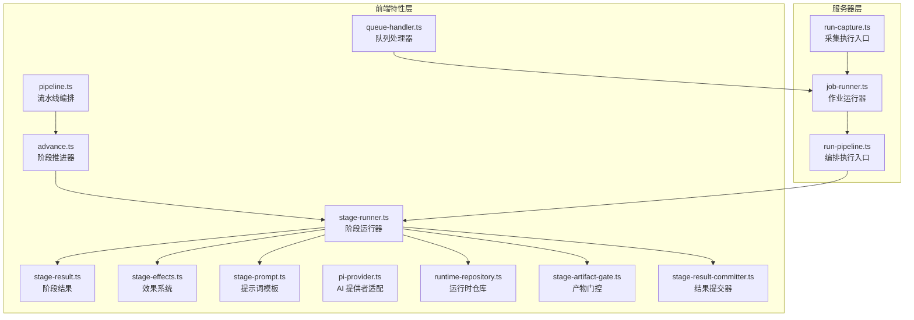

**图表来源** 
- [stage-runner.ts](file://src/features/director/stage-runner.ts)
- [stage-result.ts](file://src/features/director/stage-result.ts)
- [stage-effects.ts](file://src/features/director/stage-effects.ts)
- [stage-prompt.ts](file://src/features/director/stage-prompt.ts)
- [advance.ts](file://src/features/director/advance.ts)
- [pipeline.ts](file://src/features/director/pipeline.ts)
- [pi-provider.ts](file://src/features/director/pi-provider.ts)
- [runtime-repository.ts](file://src/features/director/runtime-repository.ts)
- [stage-artifact-gate.ts](file://src/features/director/stage-artifact-gate.ts)
- [stage-result-committer.ts](file://src/features/director/stage-result-committer.ts)
- [queue-handler.ts](file://src/features/director/queue-handler.ts)
- [job-runner.ts](file://server/src/server/job-runner.ts)
- [run-capture.ts](file://server/src/capture/run-capture.ts)
- [compose/run-pipeline.ts](file://server/src/compose/run-pipeline.ts)

**章节来源**
- [stage-runner.ts](file://src/features/director/stage-runner.ts)
- [pipeline.ts](file://src/features/director/pipeline.ts)
- [job-runner.ts](file://server/src/server/job-runner.ts)
- [run-capture.ts](file://server/src/capture/run-capture.ts)
- [compose/run-pipeline.ts](file://server/src/compose/run-pipeline.ts)

## 核心组件
- 阶段运行器（Stage Runner）：负责加载阶段上下文、校验输入、调用阶段逻辑、应用效果、持久化结果与错误信息。
- 阶段结果（Stage Result）：统一封装阶段输出、元数据、错误与追踪信息，支持序列化与回滚。
- 效果系统（Stage Effects）：在阶段成功或失败时触发副作用（如写入产物、更新状态、发送通知）。
- 提示词模板（Stage Prompt）：集中管理阶段提示词模板与变量注入，保证一致性。
- 阶段推进器（Advance）：根据阶段状态与依赖决定下一步执行路径。
- 流水线编排（Pipeline）：定义阶段序列、分支与合并策略。
- AI 提供者（PI Provider）：抽象外部模型调用，屏蔽差异。
- 运行时仓库（Runtime Repository）：读写阶段运行期数据与中间产物。
- 产物门控（Artifact Gate）：控制阶段产物的可见性与可用性。
- 结果提交器（Result Committer）：将阶段结果原子性地提交到持久化存储。
- 队列处理器（Queue Handler）：消费任务队列，驱动作业运行。
- 作业运行器（Job Runner）：调度具体作业（如采集、渲染、编排），协调阶段执行。

**章节来源**
- [stage-runner.ts](file://src/features/director/stage-runner.ts)
- [stage-result.ts](file://src/features/director/stage-result.ts)
- [stage-effects.ts](file://src/features/director/stage-effects.ts)
- [stage-prompt.ts](file://src/features/director/stage-prompt.ts)
- [advance.ts](file://src/features/director/advance.ts)
- [pipeline.ts](file://src/features/director/pipeline.ts)
- [pi-provider.ts](file://src/features/director/pi-provider.ts)
- [runtime-repository.ts](file://src/features/director/runtime-repository.ts)
- [stage-artifact-gate.ts](file://src/features/director/stage-artifact-gate.ts)
- [stage-result-committer.ts](file://src/features/director/stage-result-committer.ts)
- [queue-handler.ts](file://src/features/director/queue-handler.ts)
- [job-runner.ts](file://server/src/server/job-runner.ts)

## 架构总览
阶段管理的整体流程从作业运行器开始，经由编排执行入口进入流水线编排，再由阶段推进器驱动阶段运行器执行具体阶段，期间通过运行时仓库读写数据，使用效果系统完成副作用，最终由结果提交器持久化结果。

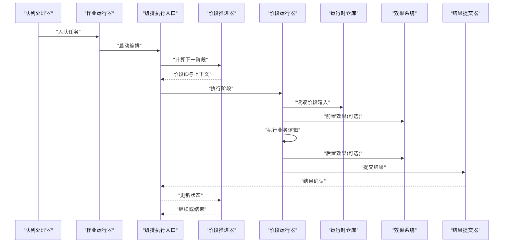

**图表来源** 
- [queue-handler.ts](file://src/features/director/queue-handler.ts)
- [job-runner.ts](file://server/src/server/job-runner.ts)
- [compose/run-pipeline.ts](file://server/src/compose/run-pipeline.ts)
- [advance.ts](file://src/features/director/advance.ts)
- [stage-runner.ts](file://src/features/director/stage-runner.ts)
- [runtime-repository.ts](file://src/features/director/runtime-repository.ts)
- [stage-effects.ts](file://src/features/director/stage-effects.ts)
- [stage-result-committer.ts](file://src/features/director/stage-result-committer.ts)

**章节来源**
- [queue-handler.ts](file://src/features/director/queue-handler.ts)
- [job-runner.ts](file://server/src/server/job-runner.ts)
- [compose/run-pipeline.ts](file://server/src/compose/run-pipeline.ts)
- [advance.ts](file://src/features/director/advance.ts)
- [stage-runner.ts](file://src/features/director/stage-runner.ts)
- [runtime-repository.ts](file://src/features/director/runtime-repository.ts)
- [stage-effects.ts](file://src/features/director/stage-effects.ts)
- [stage-result-committer.ts](file://src/features/director/stage-result-committer.ts)

## 详细组件分析

### 阶段运行器（Stage Runner）
- 职责：加载阶段上下文、参数校验、调用阶段逻辑、应用效果、记录日志与错误、返回统一结果。
- 关键点：
  - 上下文隔离：每个阶段拥有独立上下文，避免污染。
  - 错误边界：捕获异常并转换为标准错误对象，便于上层处理。
  - 可观测性：记录阶段耗时、输入摘要与输出摘要。

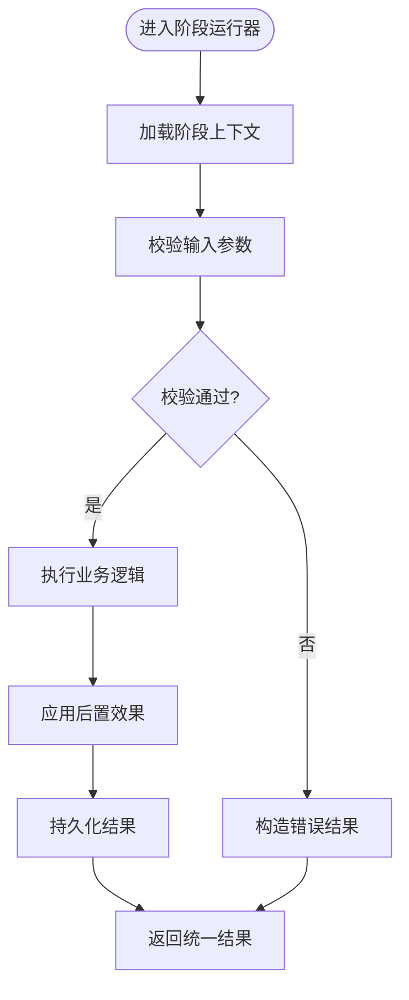

**图表来源** 
- [stage-runner.ts](file://src/features/director/stage-runner.ts)

**章节来源**
- [stage-runner.ts](file://src/features/director/stage-runner.ts)

### 阶段结果（Stage Result）
- 职责：统一封装阶段输出、元数据、错误信息与追踪标识。
- 关键点：
  - 不可变性：结果对象创建后不应被修改。
  - 序列化友好：便于跨进程传输与持久化。
  - 版本兼容：支持字段演进与降级。

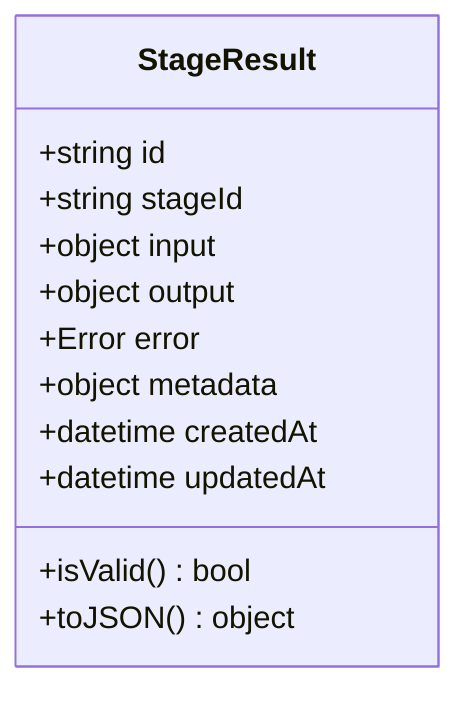

**图表来源** 
- [stage-result.ts](file://src/features/director/stage-result.ts)

**章节来源**
- [stage-result.ts](file://src/features/director/stage-result.ts)

### 效果系统（Stage Effects）
- 职责：在阶段成功或失败时触发副作用，如写入产物、更新状态、发送通知。
- 关键点：
  - 幂等性：同一效果多次触发不产生副作用。
  - 可配置：支持启用/禁用特定效果。
  - 错误隔离：单个效果失败不影响主流程。

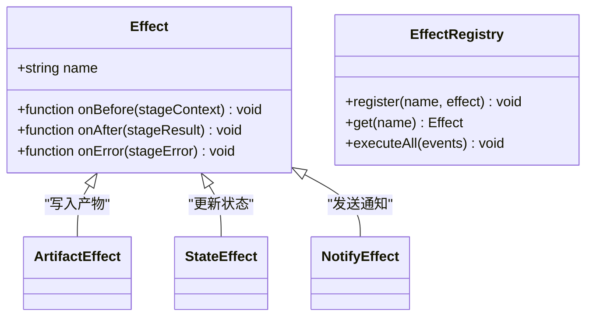

**图表来源** 
- [stage-effects.ts](file://src/features/director/stage-effects.ts)

**章节来源**
- [stage-effects.ts](file://src/features/director/stage-effects.ts)

### 提示词模板（Stage Prompt）
- 职责：集中管理阶段提示词模板与变量注入，确保一致性。
- 关键点：
  - 模板引擎：支持占位符替换与条件渲染。
  - 版本管理：模板变更需版本化与回滚。
  - 安全过滤：防止注入攻击。

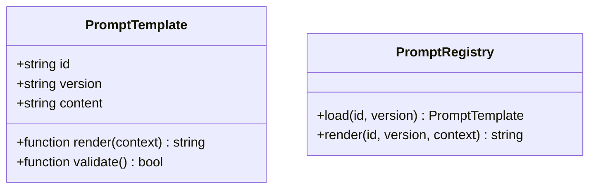

**图表来源** 
- [stage-prompt.ts](file://src/features/director/stage-prompt.ts)

**章节来源**
- [stage-prompt.ts](file://src/features/director/stage-prompt.ts)

### 阶段推进器（Advance）
- 职责：根据阶段状态与依赖决定下一步执行路径。
- 关键点：
  - 状态机：维护阶段状态转换规则。
  - 依赖解析：检查前置阶段是否满足条件。
  - 重试策略：支持失败重试与退避。

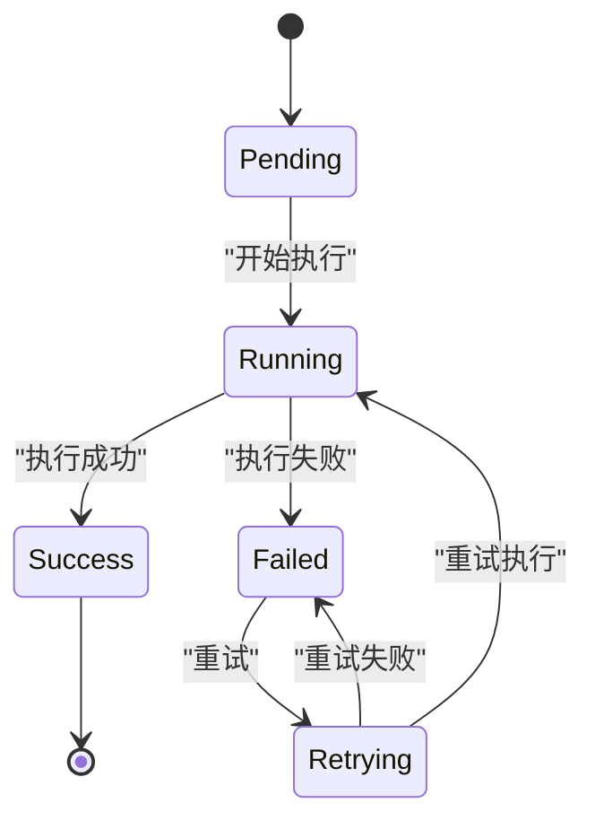

**图表来源** 
- [advance.ts](file://src/features/director/advance.ts)

**章节来源**
- [advance.ts](file://src/features/director/advance.ts)

### 流水线编排（Pipeline）
- 职责：定义阶段序列、分支与合并策略。
- 关键点：
  - 声明式配置：通过配置文件描述阶段依赖与顺序。
  - 动态路由：根据输入数据动态选择阶段路径。
  - 并行执行：支持无依赖阶段的并行执行。

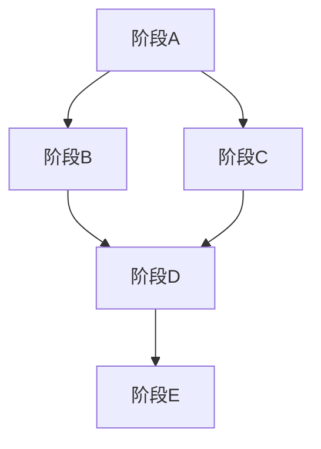

**图表来源** 
- [pipeline.ts](file://src/features/director/pipeline.ts)

**章节来源**
- [pipeline.ts](file://src/features/director/pipeline.ts)

### AI 提供者（PI Provider）
- 职责：抽象外部模型调用，屏蔽差异。
- 关键点：
  - 适配器模式：不同模型实现统一接口。
  - 重试与超时：内置重试与超时控制。
  - 限流与配额：支持速率限制与配额管理。

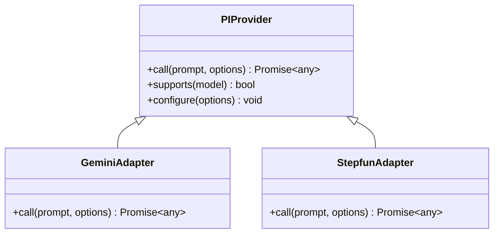

**图表来源** 
- [pi-provider.ts](file://src/features/director/pi-provider.ts)

**章节来源**
- [pi-provider.ts](file://src/features/director/pi-provider.ts)

### 运行时仓库（Runtime Repository）
- 职责：读写阶段运行期数据与中间产物。
- 关键点：
  - 事务性：支持事务操作保证一致性。
  - 缓存：本地缓存提升读取性能。
  - 压缩：大对象压缩存储。

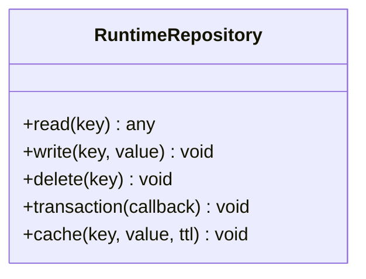

**图表来源** 
- [runtime-repository.ts](file://src/features/director/runtime-repository.ts)

**章节来源**
- [runtime-repository.ts](file://src/features/director/runtime-repository.ts)

### 产物门控（Artifact Gate）
- 职责：控制阶段产物的可见性与可用性。
- 关键点：
  - 权限控制：基于角色访问产物。
  - 版本管理：产物版本化与回滚。
  - 清理策略：过期产物自动清理。

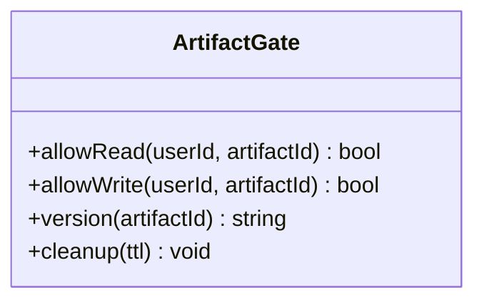

**图表来源** 
- [stage-artifact-gate.ts](file://src/features/director/stage-artifact-gate.ts)

**章节来源**
- [stage-artifact-gate.ts](file://src/features/director/stage-artifact-gate.ts)

### 结果提交器（Result Committer）
- 职责：将阶段结果原子性地提交到持久化存储。
- 关键点：
  - 原子性：提交失败则回滚。
  - 幂等性：重复提交不产生副作用。
  - 审计日志：记录提交历史。

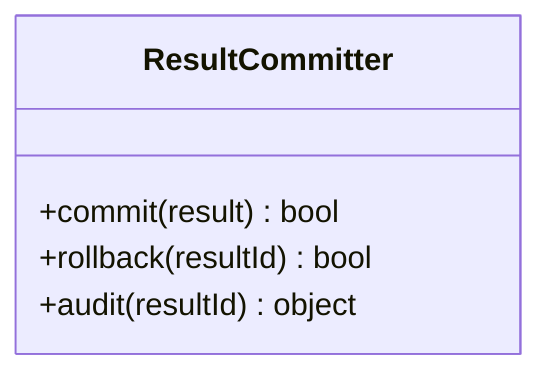

**图表来源** 
- [stage-result-committer.ts](file://src/features/director/stage-result-committer.ts)

**章节来源**
- [stage-result-committer.ts](file://src/features/director/stage-result-committer.ts)

### 队列处理器（Queue Handler）
- 职责：消费任务队列，驱动作业运行。
- 关键点：
  - 并发控制：限制并发任务数。
  - 死信队列：失败任务进入死信队列。
  - 监控指标：暴露队列长度与处理延迟。

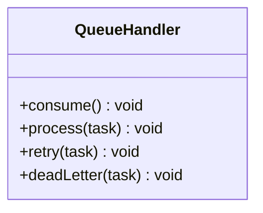

**图表来源** 
- [queue-handler.ts](file://src/features/director/queue-handler.ts)

**章节来源**
- [queue-handler.ts](file://src/features/director/queue-handler.ts)

### 作业运行器（Job Runner）
- 职责：调度具体作业（如采集、渲染、编排），协调阶段执行。
- 关键点：
  - 资源管理：分配 CPU、内存与 I/O 资源。
  - 优先级：支持作业优先级调度。
  - 健康检查：监控作业健康状态。

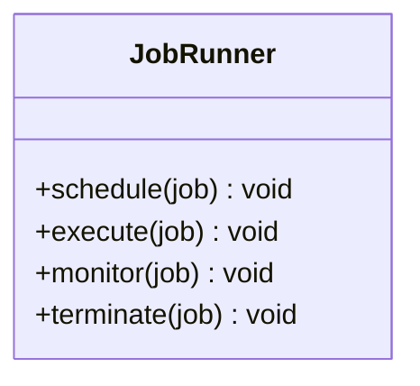

**图表来源** 
- [job-runner.ts](file://server/src/server/job-runner.ts)

**章节来源**
- [job-runner.ts](file://server/src/server/job-runner.ts)

## 依赖关系分析
阶段管理各组件之间的依赖关系如下：

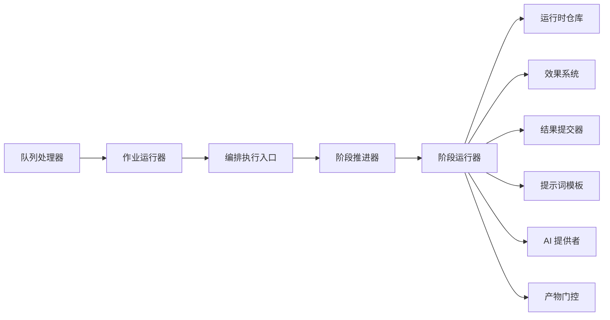

**图表来源** 
- [queue-handler.ts](file://src/features/director/queue-handler.ts)
- [job-runner.ts](file://server/src/server/job-runner.ts)
- [compose/run-pipeline.ts](file://server/src/compose/run-pipeline.ts)
- [advance.ts](file://src/features/director/advance.ts)
- [stage-runner.ts](file://src/features/director/stage-runner.ts)
- [runtime-repository.ts](file://src/features/director/runtime-repository.ts)
- [stage-effects.ts](file://src/features/director/stage-effects.ts)
- [stage-result-committer.ts](file://src/features/director/stage-result-committer.ts)
- [stage-prompt.ts](file://src/features/director/stage-prompt.ts)
- [pi-provider.ts](file://src/features/director/pi-provider.ts)
- [stage-artifact-gate.ts](file://src/features/director/stage-artifact-gate.ts)

**章节来源**
- [queue-handler.ts](file://src/features/director/queue-handler.ts)
- [job-runner.ts](file://server/src/server/job-runner.ts)
- [compose/run-pipeline.ts](file://server/src/compose/run-pipeline.ts)
- [advance.ts](file://src/features/director/advance.ts)
- [stage-runner.ts](file://src/features/director/stage-runner.ts)
- [runtime-repository.ts](file://src/features/director/runtime-repository.ts)
- [stage-effects.ts](file://src/features/director/stage-effects.ts)
- [stage-result-committer.ts](file://src/features/director/stage-result-committer.ts)
- [stage-prompt.ts](file://src/features/director/stage-prompt.ts)
- [pi-provider.ts](file://src/features/director/pi-provider.ts)
- [stage-artifact-gate.ts](file://src/features/director/stage-artifact-gate.ts)

## 性能考量
- 并行执行：对无依赖阶段进行并行执行以提升吞吐。
- 缓存策略：对只读数据进行缓存以减少重复计算。
- 批处理：批量处理小任务以降低开销。
- 资源限制：设置合理的并发度与超时时间。
- 监控指标：收集关键指标以优化性能。

[本节为通用指导，无需引用具体文件]

## 故障排查指南
- 常见问题：
  - 阶段执行失败：检查输入参数与依赖状态。
  - 效果执行异常：查看效果日志与错误堆栈。
  - 结果提交失败：确认持久化存储连接与权限。
  - 提示词渲染错误：验证模板语法与变量注入。
- 调试技巧：
  - 启用详细日志：记录阶段执行过程与数据流。
  - 单元测试：覆盖关键路径与边界条件。
  - 集成测试：模拟真实环境进行端到端测试。
  - 性能剖析：识别瓶颈与热点代码。

**章节来源**
- [stage-runner.ts](file://src/features/director/stage-runner.ts)
- [stage-effects.ts](file://src/features/director/stage-effects.ts)
- [stage-result-committer.ts](file://src/features/director/stage-result-committer.ts)
- [stage-prompt.ts](file://src/features/director/stage-prompt.ts)

## 结论
PurpleInk 的阶段管理系统通过清晰的组件划分与统一的接口设计，实现了高内聚、低耦合的阶段执行框架。借助状态机、效果系统与提示词模板，系统具备良好的可扩展性与可维护性。开发者可基于此框架快速实现新阶段，并通过完善的测试与调试工具保障质量。

[本节为总结性内容，无需引用具体文件]

## 附录
- 常见阶段模式：
  - 数据处理阶段：读取输入、转换格式、输出结果。
  - AI 生成阶段：调用模型生成内容、后处理与验证。
  - 渲染阶段：合成媒体、导出文件、生成缩略图。
  - 审核阶段：人工或自动审核、反馈与修正。
- 扩展指南：
  - 新增阶段：实现阶段逻辑、注册效果、添加提示词模板。
  - 自定义效果：实现效果接口、注册到效果系统。
  - 集成新模型：实现 AI 提供者接口、配置适配器。
  - 优化性能：引入缓存、批处理与并行执行。

[本节为概念性内容，无需引用具体文件]