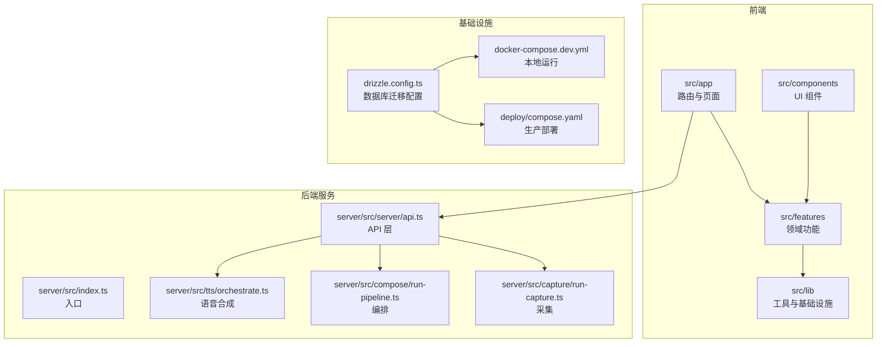
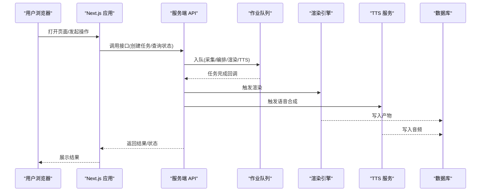
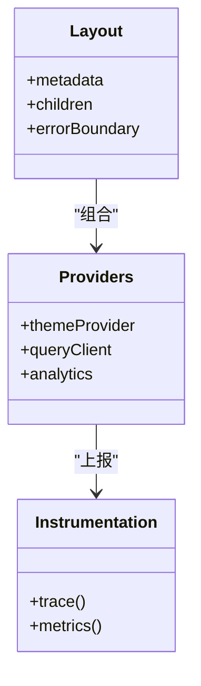
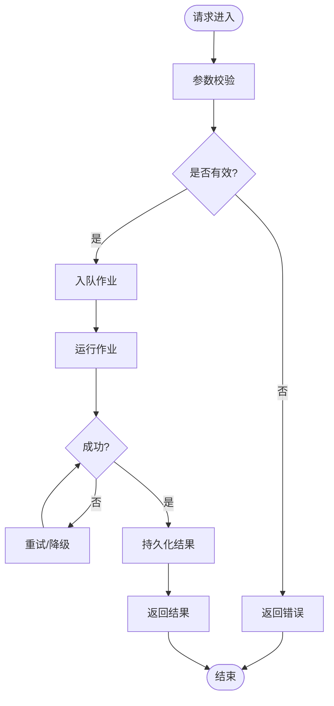
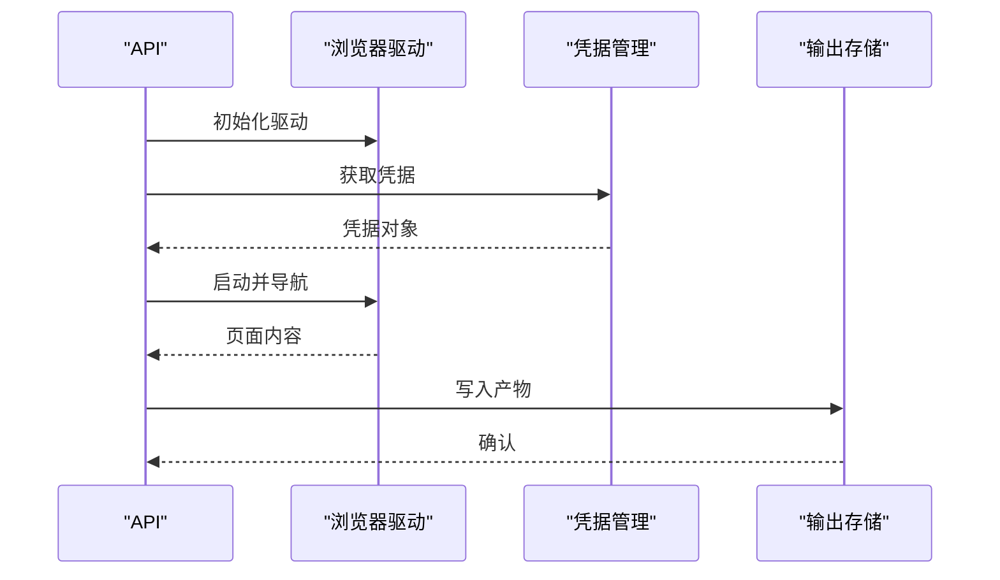
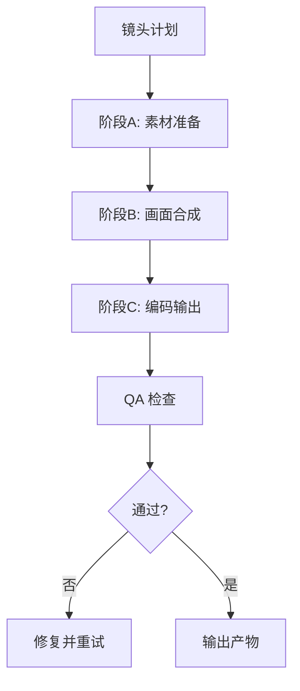
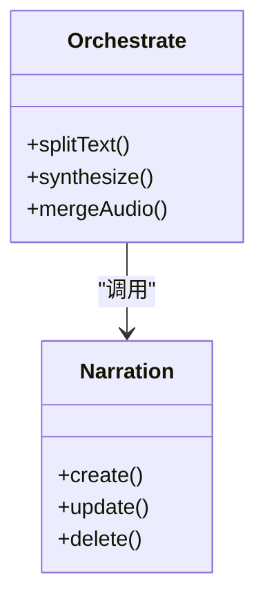
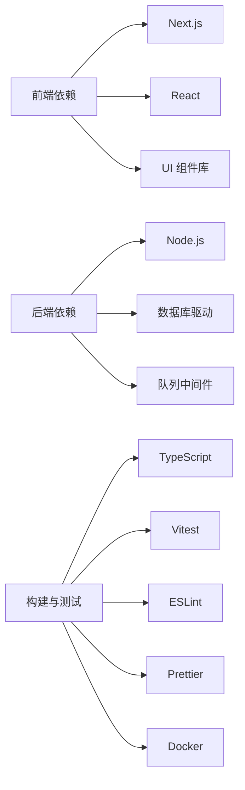

# 开发指南

<cite>
**本文引用的文件**   
- [package.json](file://package.json)
- [pnpm-workspace.yaml](file://pnpm-workspace.yaml)
- [tsconfig.json](file://tsconfig.json)
- [next.config.ts](file://next.config.ts)
- [vitest.config.ts](file://vitest.config.ts)
- [vitest.pg.config.ts](file://vitest.pg.config.ts)
- [eslint.config.mjs](file://eslint.config.mjs)
- [.prettierrc](file://.prettierrc)
- [docker-compose.dev.yml](file://docker-compose.dev.yml)
- [Dockerfile.web](file://Dockerfile.web)
- [Dockerfile.worker](file://Dockerfile.worker)
- [Dockerfile.migrate](file://Dockerfile.migrate)
- [drizzle.config.ts](file://drizzle.config.ts)
- [deploy/compose.yaml](file://deploy/compose.yaml)
- [deploy/env.example](file://deploy/env.example)
- [deploy/worker.env.example](file://deploy/worker.env.example)
- [server/package.json](file://server/package.json)
- [server/tsconfig.json](file://server/tsconfig.json)
- [server/src/index.ts](file://server/src/index.ts)
- [server/src/server/api.ts](file://server/src/server/api.ts)
- [server/src/server/job-runner.ts](file://server/src/server/job-runner.ts)
- [server/src/capture/run-capture.ts](file://server/src/capture/run-capture.ts)
- [server/src/compose/run-pipeline.ts](file://server/src/compose/run-pipeline.ts)
- [server/src/tts/orchestrate.ts](file://server/src/tts/orchestrate.ts)
- [src/app/layout.tsx](file://src/app/layout.tsx)
- [src/app/providers.tsx](file://src/app/providers.tsx)
- [src/instrumentation.ts](file://src/instrumentation.ts)
- [src/features/director/pipeline.ts](file://src/features/director/pipeline.ts)
- [src/features/render/renderer.ts](file://src/features/render/renderer.ts)
- [src/features/audio/narration.ts](file://src/features/audio/narration.ts)
- [src/lib/queue/index.ts](file://src/lib/queue/index.ts)
- [scripts/setup/db-migrate.ts](file://scripts/setup/db-migrate.ts)
- [scripts/verify/e2e-smoke.ts](file://scripts/verify/e2e-smoke.ts)
- [docs/conventions/routing.md](file://docs/conventions/routing.md)
- [docs/configuration/credentials.md](file://docs/configuration/credentials.md)
- [docs/configuration/tts.md](file://docs/configuration/tts.md)
- [Agent采集设计.md](file://Agent采集设计.md)
</cite>

## 目录
1. [简介](#简介)
2. [项目结构](#项目结构)
3. [核心组件](#核心组件)
4. [架构总览](#架构总览)
5. [详细组件分析](#详细组件分析)
6. [依赖关系分析](#依赖关系分析)
7. [性能考量](#性能考量)
8. [故障排除指南](#故障排除指南)
9. [结论](#结论)
10. [附录](#附录)

## 简介
本指南面向 PurpleInk 项目的开发者与维护者，覆盖代码规范、命名约定、最佳实践、开发环境配置、调试技巧、性能分析方法、Git 工作流与分支策略、代码审查流程、新功能与插件扩展模式、常见问题与排障、文档编写规范、测试要求与发布流程。目标是帮助团队以一致的方式高效协作，保证质量与可维护性。

## 项目结构
PurpleInk 采用前后端一体化工程组织：
- 前端应用位于 src/app（Next.js App Router）、src/components（UI 组件库）、src/features（按领域划分的业务模块）、src/lib（通用工具与基础设施）。
- 服务端逻辑位于 server/src，包含采集、编排、渲染、TTS 等子系统，并通过 API 暴露能力。
- 脚本与部署位于 scripts 与 deploy，提供数据库迁移、验证与容器化部署能力。
- 配置与规范集中在根级配置文件与 docs 目录。

图表来源
- [next.config.ts:1-200](file://next.config.ts#L1-L200)
- [server/src/index.ts:1-200](file://server/src/index.ts#L1-L200)
- [drizzle.config.ts:1-200](file://drizzle.config.ts#L1-L200)
- [docker-compose.dev.yml:1-200](file://docker-compose.dev.yml#L1-L200)
- [deploy/compose.yaml:1-200](file://deploy/compose.yaml#L1-L200)

章节来源
- [package.json:1-200](file://package.json#L1-L200)
- [pnpm-workspace.yaml:1-200](file://pnpm-workspace.yaml#L1-L200)
- [tsconfig.json:1-200](file://tsconfig.json#L1-L200)
- [next.config.ts:1-200](file://next.config.ts#L1-L200)
- [vitest.config.ts:1-200](file://vitest.config.ts#L1-L200)
- [vitest.pg.config.ts:1-200](file://vitest.pg.config.ts#L1-L200)
- [eslint.config.mjs:1-200](file://eslint.config.mjs#L1-L200)
- [.prettierrc:1-200](file://.prettierrc#L1-L200)
- [docker-compose.dev.yml:1-200](file://docker-compose.dev.yml#L1-L200)
- [Dockerfile.web:1-200](file://Dockerfile.web#L1-L200)
- [Dockerfile.worker:1-200](file://Dockerfile.worker#L1-L200)
- [Dockerfile.migrate:1-200](file://Dockerfile.migrate#L1-L200)
- [drizzle.config.ts:1-200](file://drizzle.config.ts#L1-L200)
- [deploy/compose.yaml:1-200](file://deploy/compose.yaml#L1-L200)
- [deploy/env.example:1-200](file://deploy/env.example#L1-L200)
- [deploy/worker.env.example:1-200](file://deploy/worker.env.example#L1-L200)

## 核心组件
- 前端运行时与提供者：通过 Next.js 的布局与提供者管理全局状态、主题、国际化与监控埋点。
- 领域功能模块：director（导演编排）、render（渲染管线）、audio（音频处理）、ai（模型适配）、routing（路由选择）等。
- 服务端 API：统一对外暴露采集、编排、渲染、TTS 等能力，内部调用各子系统进行任务执行。
- 队列与作业：异步任务调度与持久化，支撑高并发与容错。
- 数据库与迁移：使用 Drizzle ORM 进行数据建模与迁移，支持 SQLite/PostgreSQL。

章节来源
- [src/app/layout.tsx:1-200](file://src/app/layout.tsx#L1-L200)
- [src/app/providers.tsx:1-200](file://src/app/providers.tsx#L1-200)
- [src/instrumentation.ts:1-200](file://src/instrumentation.ts#L1-200)
- [src/features/director/pipeline.ts:1-200](file://src/features/director/pipeline.ts#L1-200)
- [src/features/render/renderer.ts:1-200](file://src/features/render/renderer.ts#L1-200)
- [src/features/audio/narration.ts:1-200](file://src/features/audio/narration.ts#L1-200)
- [server/src/server/api.ts:1-200](file://server/src/server/api.ts#L1-200)
- [server/src/server/job-runner.ts:1-200](file://server/src/server/job-runner.ts#L1-200)
- [src/lib/queue/index.ts:1-200](file://src/lib/queue/index.ts#L1-200)
- [drizzle.config.ts:1-200](file://drizzle.config.ts#L1-200)

## 架构总览
系统由前端应用、服务端 API、后台作业与外部服务组成。前端通过 Next.js 路由访问页面与 API；服务端将请求分发至采集、编排、渲染与 TTS 子系统；作业队列负责异步任务执行；数据库用于持久化状态与结果。

图表来源
- [server/src/server/api.ts:1-200](file://server/src/server/api.ts#L1-200)
- [server/src/server/job-runner.ts:1-200](file://server/src/server/job-runner.ts#L1-200)
- [server/src/capture/run-capture.ts:1-200](file://server/src/capture/run-capture.ts#L1-200)
- [server/src/compose/run-pipeline.ts:1-200](file://server/src/compose/run-pipeline.ts#L1-200)
- [server/src/tts/orchestrate.ts:1-200](file://server/src/tts/orchestrate.ts#L1-200)
- [src/features/render/renderer.ts:1-200](file://src/features/render/renderer.ts#L1-200)
- [src/features/audio/narration.ts:1-200](file://src/features/audio/narration.ts#L1-200)

## 详细组件分析

### 前端应用与提供者
- 布局与提供者：集中管理主题、导航、错误边界与监控埋点，确保一致的体验与可观测性。
- 路由约定：遵循 Next.js App Router 约定，结合领域路由与公共路由分离。
- 组件规范：UI 组件与业务组件分层，避免跨层耦合，保持单一职责。

图表来源
- [src/app/layout.tsx:1-200](file://src/app/layout.tsx#L1-200)
- [src/app/providers.tsx:1-200](file://src/app/providers.tsx#L1-200)
- [src/instrumentation.ts:1-200](file://src/instrumentation.ts#L1-200)

章节来源
- [src/app/layout.tsx:1-200](file://src/app/layout.tsx#L1-200)
- [src/app/providers.tsx:1-200](file://src/app/providers.tsx#L1-200)
- [src/instrumentation.ts:1-200](file://src/instrumentation.ts#L1-200)

### 服务端 API 与作业运行器
- API 层：接收 HTTP 请求，校验参数，调用领域服务，返回结构化响应。
- 作业运行器：负责任务生命周期管理、重试、超时与失败回滚。
- 错误处理：统一错误码与消息格式，便于前端展示与日志追踪。

图表来源
- [server/src/server/api.ts:1-200](file://server/src/server/api.ts#L1-200)
- [server/src/server/job-runner.ts:1-200](file://server/src/server/job-runner.ts#L1-200)

章节来源
- [server/src/server/api.ts:1-200](file://server/src/server/api.ts#L1-200)
- [server/src/server/job-runner.ts:1-200](file://server/src/server/job-runner.ts#L1-200)

### 采集子系统
- 驱动抽象：支持多种浏览器驱动与模拟驱动，便于扩展与测试。
- 凭证管理：安全加载凭据，支持多提供商。
- 执行流程：解析目标、注入凭据、启动浏览器、抓取内容、输出产物。

图表来源
- [server/src/capture/run-capture.ts:1-200](file://server/src/capture/run-capture.ts#L1-200)

章节来源
- [server/src/capture/run-capture.ts:1-200](file://server/src/capture/run-capture.ts#L1-200)

### 编排与渲染管线
- 编排：根据镜头计划生成步骤，协调各阶段执行与状态流转。
- 渲染：帧捕获、序列拼接、编码与 QA 检查，确保输出一致性。
- 反馈：实时状态与错误信息推送，提升用户体验。

图表来源
- [server/src/compose/run-pipeline.ts:1-200](file://server/src/compose/run-pipeline.ts#L1-200)
- [src/features/render/renderer.ts:1-200](file://src/features/render/renderer.ts#L1-200)

章节来源
- [server/src/compose/run-pipeline.ts:1-200](file://server/src/compose/run-pipeline.ts#L1-200)
- [src/features/render/renderer.ts:1-200](file://src/features/render/renderer.ts#L1-200)

### TTS 语音合成
- 编排：文本分句、语速控制、音轨合并。
- 集成：对接不同 TTS 提供商，统一接口与错误处理。
- 持久化：音频片段与元数据落库，支持回放与导出。

图表来源
- [server/src/tts/orchestrate.ts:1-200](file://server/src/tts/orchestrate.ts#L1-200)
- [src/features/audio/narration.ts:1-200](file://src/features/audio/narration.ts#L1-200)

章节来源
- [server/src/tts/orchestrate.ts:1-200](file://server/src/tts/orchestrate.ts#L1-200)
- [src/features/audio/narration.ts:1-200](file://src/features/audio/narration.ts#L1-200)

### 队列与作业
- 队列模型：定义任务类型、优先级、重试策略与超时。
- 消费者：并行消费、幂等处理、失败补偿。
- 监控：指标收集与告警，保障稳定性。

章节来源
- [src/lib/queue/index.ts:1-200](file://src/lib/queue/index.ts#L1-200)
- [server/src/server/job-runner.ts:1-200](file://server/src/server/job-runner.ts#L1-200)

### 数据库与迁移
- 建模：使用 Drizzle 定义表结构与关系。
- 迁移：版本化管理，支持回滚与增量更新。
- 连接：环境变量配置，区分开发与生产。

章节来源
- [drizzle.config.ts:1-200](file://drizzle.config.ts#L1-200)
- [scripts/setup/db-migrate.ts:1-200](file://scripts/setup/db-migrate.ts#L1-200)

## 依赖关系分析
- 前端依赖：Next.js、React、UI 组件库、状态管理与监控 SDK。
- 后端依赖：Node.js 运行时、HTTP 框架、数据库驱动、队列中间件、外部服务客户端。
- 构建与测试：TypeScript、Vitest、ESLint、Prettier、Docker。

图表来源
- [package.json:1-200](file://package.json#L1-200)
- [server/package.json:1-200](file://server/package.json#L1-200)
- [tsconfig.json:1-200](file://tsconfig.json#L1-200)
- [vitest.config.ts:1-200](file://vitest.config.ts#L1-200)
- [eslint.config.mjs:1-200](file://eslint.config.mjs#L1-200)
- [.prettierrc:1-200](file://.prettierrc#L1-200)

章节来源
- [package.json:1-200](file://package.json#L1-200)
- [server/package.json:1-200](file://server/package.json#L1-200)
- [tsconfig.json:1-200](file://tsconfig.json#L1-200)
- [vitest.config.ts:1-200](file://vitest.config.ts#L1-200)
- [eslint.config.mjs:1-200](file://eslint.config.mjs#L1-200)
- [.prettierrc:1-200](file://.prettierrc#L1-200)

## 性能考量
- 前端优化：代码分割、懒加载、缓存策略、资源压缩与 CDN。
- 后端优化：连接池、批处理、异步并发、内存限制与 GC 调优。
- 渲染优化：帧率控制、增量渲染、产物缓存与去重。
- 监控与诊断：APM、日志聚合、指标采集与告警阈值。

[本节为通用指导，不直接分析具体文件]

## 故障排除指南
- 常见问题：
  - 环境变量缺失或错误导致服务启动失败。
  - 数据库连接失败或迁移冲突。
  - 队列积压或作业重复执行。
  - 浏览器驱动初始化失败或超时。
  - TTS 提供商限流或认证失败。
- 排查方法：
  - 查看应用日志与错误堆栈，定位异常点。
  - 检查环境变量与配置文件是否正确。
  - 使用健康检查与探针验证服务状态。
  - 逐步缩小范围，隔离问题模块。
  - 复现最小用例，提交证据与修复建议。

章节来源
- [server/src/server/api.ts:1-200](file://server/src/server/api.ts#L1-200)
- [server/src/server/job-runner.ts:1-200](file://server/src/server/job-runner.ts#L1-200)
- [server/src/capture/run-capture.ts:1-200](file://server/src/capture/run-capture.ts#L1-200)
- [server/src/tts/orchestrate.ts:1-200](file://server/src/tts/orchestrate.ts#L1-200)

## 结论
PurpleInk 采用模块化与领域驱动的组织方式，前后端清晰分离，具备完善的作业调度与可观测性。遵循本指南的规范与实践，可显著提升开发效率与系统稳定性。建议在迭代中持续完善文档与测试，保持代码质量与可维护性。

[本节为总结，不直接分析具体文件]

## 附录

### 开发环境配置
- 安装依赖：使用 pnpm 安装前后端依赖。
- 启动服务：通过 docker-compose 启动本地开发环境。
- 数据库迁移：执行迁移脚本同步数据库结构。
- 环境变量：复制示例文件并填写必要配置。

章节来源
- [docker-compose.dev.yml:1-200](file://docker-compose.dev.yml#L1-200)
- [deploy/env.example:1-200](file://deploy/env.example#L1-200)
- [deploy/worker.env.example:1-200](file://deploy/worker.env.example#L1-200)
- [scripts/setup/db-migrate.ts:1-200](file://scripts/setup/db-migrate.ts#L1-200)

### 调试技巧
- 前端调试：启用 Source Map，使用浏览器开发者工具断点调试。
- 后端调试：附加 Node.js 调试器，打印关键变量与调用栈。
- 集成调试：模拟外部服务响应，验证端到端流程。
- 日志增强：增加上下文信息与追踪 ID，便于关联分析。

[本节为通用指导，不直接分析具体文件]

### 性能分析方法
- 基准测试：对关键路径进行压测，记录耗时与资源占用。
- 火焰图：定位 CPU 热点与慢函数。
- 内存分析：检测泄漏与峰值，优化数据结构与缓存。
- 网络分析：监控请求延迟与带宽，优化传输策略。

[本节为通用指导，不直接分析具体文件]

### Git 工作流与分支策略
- 分支模型：主分支保护，功能分支基于主分支创建，合并前需通过 CI。
- 提交规范：语义化提交信息，描述变更动机与影响范围。
- 代码审查：至少一名 reviewer，关注设计、实现与测试。
- 发布流程：标签化版本，自动生成变更日志与制品。

[本节为通用指导，不直接分析具体文件]

### 新功能开发指南
- 需求分析：明确目标、约束与验收标准。
- 设计评审：输出设计文档，讨论风险与替代方案。
- 实现步骤：小步快跑，频繁提交，及时更新文档与测试。
- 上线准备：灰度发布、监控告警与回滚预案。

[本节为通用指导，不直接分析具体文件]

### 插件开发模式与扩展点
- 插件接口：定义统一的接入协议与生命周期钩子。
- 注册机制：动态加载与配置管理，支持热更新。
- 沙箱隔离：限制权限与资源，防止相互干扰。
- 测试覆盖：单元测试与集成测试，确保兼容性。

[本节为通用指导，不直接分析具体文件]

### 常见问题解答
- 如何添加新的 TTS 提供商？参考现有适配器模式，实现统一接口并注册。
- 如何扩展渲染阶段？在编排管线中插入新阶段，定义输入输出契约。
- 如何处理大文件上传？分块上传、断点续传与进度反馈。
- 如何优化队列吞吐？调整并发度、批大小与重试策略。

[本节为通用指导，不直接分析具体文件]

### 社区贡献指南
- 行为准则：尊重他人，积极沟通，遵守开源协议。
- 贡献流程：Fork 仓库，创建分支，提交 PR，等待审查。
- 问题报告：详细描述复现步骤、预期与实际结果。
- 文档改进：修正错误、补充说明与示例。

[本节为通用指导，不直接分析具体文件]

### 文档编写规范
- 结构清晰：标题层级合理，内容分段明确。
- 语言简洁：避免歧义，使用术语一致。
- 图示辅助：流程图与架构图帮助理解复杂逻辑。
- 版本管理：标注适用版本与变更记录。

[本节为通用指导，不直接分析具体文件]

### 测试要求
- 覆盖率：核心逻辑与边界条件需覆盖。
- 类型检查：严格 TypeScript 配置，避免 any。
- 自动化：CI 中执行 lint、test 与 build。
- 回归测试：关键路径定期回归，防止退化。

章节来源
- [vitest.config.ts:1-200](file://vitest.config.ts#L1-200)
- [vitest.pg.config.ts:1-200](file://vitest.pg.config.ts#L1-200)
- [eslint.config.mjs:1-200](file://eslint.config.mjs#L1-200)
- [.prettierrc:1-200](file://.prettierrc#L1-200)

### 发布流程
- 版本标记：语义化版本号，附带变更摘要。
- 制品构建：生成镜像与安装包，签名校验。
- 部署策略：蓝绿或金丝雀发布，逐步放量。
- 监控回滚：实时监控指标，快速回滚异常版本。

[本节为通用指导，不直接分析具体文件]

### 相关文档与规范
- 路由约定：遵循 Next.js 与项目自定义规则。
- 凭据配置：安全存储与轮换策略。
- TTS 配置：提供商选择与参数调优。
- 采集设计：整体架构与关键决策。

章节来源
- [docs/conventions/routing.md:1-200](file://docs/conventions/routing.md#L1-200)
- [docs/configuration/credentials.md:1-200](file://docs/configuration/credentials.md#L1-200)
- [docs/configuration/tts.md:1-200](file://docs/configuration/tts.md#L1-200)
- [Agent采集设计.md:1-200](file://Agent采集设计.md#L1-200)