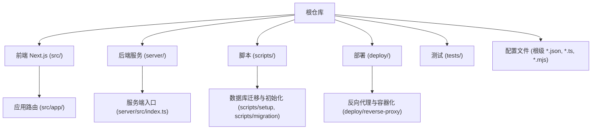
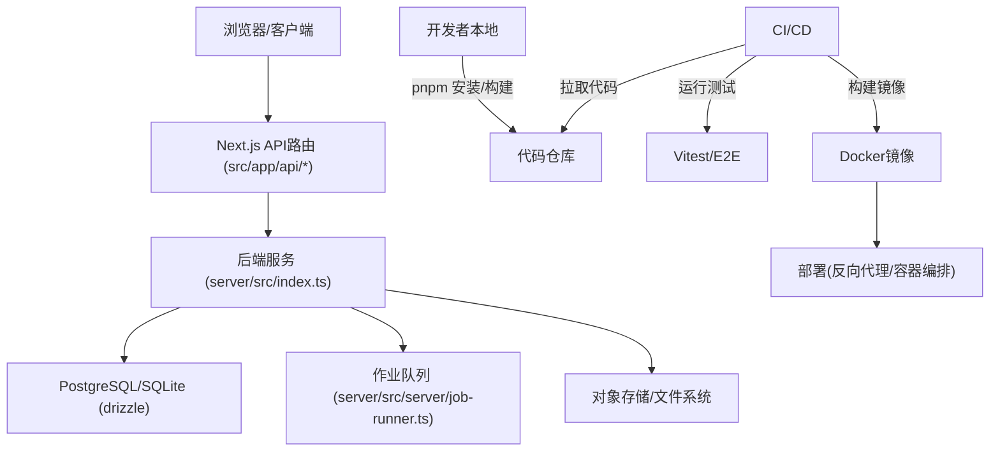
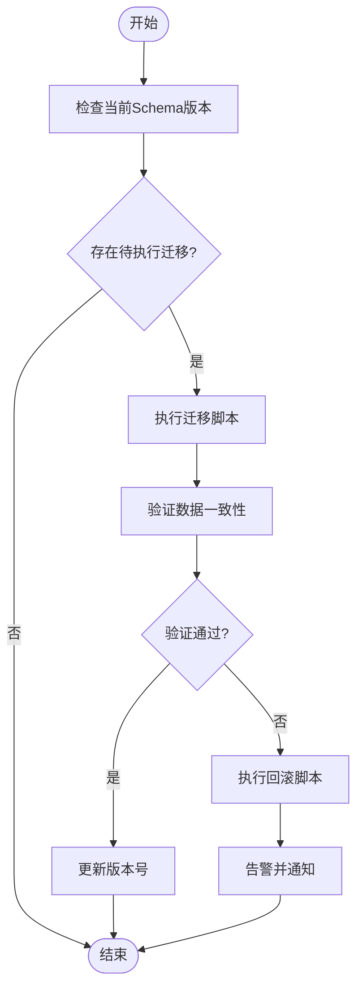
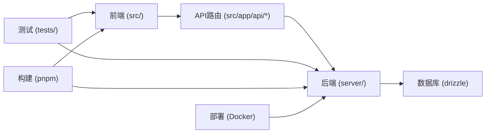

# Git工作流与协作

<cite>
**本文引用的文件**   
- [package.json](file://package.json)
- [drizzle.config.ts](file://drizzle.config.ts)
- [.gitignore](file://.gitignore)
- [docker-compose.dev.yml](file://docker-compose.dev.yml)
- [docker-compose.prod.yml](file://docker-compose.prod.yml)
- [Dockerfile](file://Dockerfile)
- [deploy/reverse-proxy/Dockerfile](file://deploy/reverse-proxy/Dockerfile)
- [scripts/setup/db-migrate.ts](file://scripts/setup/db-migrate.ts)
- [scripts/migration/export-sqlite.ts](file://scripts/migration/export-sqlite.ts)
- [scripts/migration/import-postgres.ts](file://scripts/migration/import-postgres.ts)
- [scripts/migration/reconcile-postgres.ts](file://scripts/migration/reconcile-postgres.ts)
- [scripts/migration/sqlite-backup.ts](file://scripts/migration/sqlite-backup.ts)
- [scripts/verify/e2e-smoke.ts](file://scripts/verify/e2e-smoke.ts)
- [scripts/verify/auth-flow-smoke.mjs](file://scripts/verify/auth-flow-smoke.mjs)
- [vitest.config.ts](file://vitest.config.ts)
- [vitest.pg.config.ts](file://vitest.pg.config.ts)
- [eslint.config.mjs](file://eslint.config.mjs)
- [.prettierrc](file:.prettierrc)
- [pnpm-workspace.yaml](file://pnpm-workspace.yaml)
- [next.config.ts](file://next.config.ts)
- [server/package.json](file://server/package.json)
- [server/tsconfig.json](file://server/tsconfig.json)
- [server/src/index.ts](file://server/src/index.ts)
- [src/app/api/ping/route.ts](file://src/app/api/ping/route.ts)
- [src/lib/db/index.ts](file://src/lib/db/index.ts)
</cite>

## 目录
1. [简介](#简介)
2. [项目结构](#项目结构)
3. [核心组件](#核心组件)
4. [架构总览](#架构总览)
5. [详细组件分析](#详细组件分析)
6. [依赖分析](#依赖分析)
7. [性能考虑](#性能考虑)
8. [故障排查指南](#故障排查指南)
9. [结论](#结论)
10. [附录](#附录)

## 简介
本规范面向PurpleInk项目的团队协作，目标是建立统一、可追溯、低风险的Git工作流与协作流程。内容覆盖分支策略、提交信息规范、代码审查流程、冲突解决与版本管理最佳实践、数据库迁移的版本控制方法，以及协作工具与流程的标准化建议。该规范旨在降低合并风险、提升交付质量，并保证生产环境稳定。

## 项目结构
仓库采用前后端一体化结构：前端基于Next.js（app路由），后端服务位于server目录，脚本集中在scripts目录，部署相关配置在deploy目录，测试与验证脚本分布于tests与scripts/verify。数据库迁移与初始化脚本位于scripts/setup与scripts/migration。

**图示来源** 
- [package.json](file://package.json)
- [next.config.ts](file://next.config.ts)
- [server/package.json](file://server/package.json)
- [server/src/index.ts](file://server/src/index.ts)
- [scripts/setup/db-migrate.ts](file://scripts/setup/db-migrate.ts)
- [scripts/migration/export-sqlite.ts](file://scripts/migration/export-sqlite.ts)
- [deploy/reverse-proxy/Dockerfile](file://deploy/reverse-proxy/Dockerfile)

**章节来源**
- [package.json:1-200](file://package.json)
- [next.config.ts:1-200](file://next.config.ts)
- [server/package.json:1-200](file://server/package.json)
- [server/src/index.ts:1-200](file://server/src/index.ts)

## 核心组件
- 包管理与工作区：使用pnpm workspace进行多包管理，确保依赖一致性与构建效率。
- 前端框架：Next.js app路由组织页面与API路由，便于前后端协同开发。
- 后端服务：独立Node服务，提供业务逻辑与队列处理等能力。
- 数据库迁移：Drizzle ORM配合脚本实现迁移与数据同步。
- 测试与验证：Vitest单元测试与E2E冒烟脚本保障质量。
- 部署：Docker镜像与反向代理配置，支持开发与生产环境。

**章节来源**
- [pnpm-workspace.yaml:1-200](file://pnpm-workspace.yaml)
- [vitest.config.ts:1-200](file://vitest.config.ts)
- [vitest.pg.config.ts:1-200](file://vitest.pg.config.ts)
- [drizzle.config.ts:1-200](file://drizzle.config.ts)
- [Dockerfile:1-200](file://Dockerfile)
- [docker-compose.dev.yml:1-200](file://docker-compose.dev.yml)
- [docker-compose.prod.yml:1-200](file://docker-compose.prod.yml)

## 架构总览
下图展示从客户端到后端服务、数据库与部署的整体交互关系，体现Git工作流中各阶段产物如何进入流水线并最终发布。

**图示来源** 
- [src/app/api/ping/route.ts](file://src/app/api/ping/route.ts)
- [server/src/index.ts](file://server/src/index.ts)
- [drizzle.config.ts](file://drizzle.config.ts)
- [server/src/server/job-runner.ts](file://server/src/server/job-runner.ts)
- [Dockerfile](file://Dockerfile)
- [deploy/reverse-proxy/Dockerfile](file://deploy/reverse-proxy/Dockerfile)

## 详细组件分析

### 分支策略
- 主分支保护
  - main/master：仅允许通过受保护的PR合并，禁止直接推送；必须通过所有检查（测试、Lint、类型检查）。
  - release/*：用于发布候选，冻结非关键变更，仅接受修复与文档更新。
  - hotfix/*：针对生产问题的快速修复分支，合并回main与release分支。
- 功能分支
  - feature/*：新功能开发，命名遵循feature/<模块>-<描述>。
  - bugfix/*：缺陷修复，命名遵循bugfix/<问题编号或描述>。
  - refactor/*：重构与优化，需附带影响范围说明。
- 开发协作
  - develop：集成分支，日常特性合并目标；定期同步main以获取最新稳定状态。
  - 短生命周期：每个分支对应一个明确任务，避免长期存活分支。
- 分支命名规范
  - 小写、连字符分隔，避免空格与特殊字符。
  - 示例：feature/auth-session、bugfix/login-timeout、refactor/render-pipeline。

**章节来源**
- [.gitignore:1-200](file://.gitignore)
- [pnpm-workspace.yaml:1-200](file://pnpm-workspace.yaml)

### 提交信息规范
- 格式要求
  - 标题行：<类型>(<作用域>): <简述>
  - 正文：描述变更动机、影响范围、注意事项。
  - 尾注：关联Issue、破坏性变更标记。
- 类型定义
  - feat：新功能
  - fix：缺陷修复
  - docs：文档更新
  - style：代码风格（不影响逻辑）
  - refactor：重构
  - test：测试相关
  - chore：构建/工具链变更
  - ci：CI/CD配置
  - perf：性能优化
  - revert：回滚提交
- 示例模板
  - feat(auth): 添加会话刷新机制
  - fix(render): 修复缩略图生成超时
  - refactor(director): 重命名管道阶段常量
  - chore(deps): 升级依赖至最新版本

**章节来源**
- [eslint.config.mjs:1-200](file://eslint.config.mjs)
- [.prettierrc:1-200](file:.prettierrc)

### 代码审查流程
- PR创建
  - 基于功能分支向develop/main发起PR。
  - 填写变更摘要、影响范围、测试覆盖说明。
  - 附加截图或日志（UI/行为变更）。
- 审查标准
  - 代码可读性与一致性（遵循Prettier/ESLint）。
  - 类型安全（TypeScript严格模式）。
  - 测试覆盖率与回归用例。
  - 安全性与性能考量。
- 合并策略
  - 至少一名维护者批准。
  - 所有检查通过（测试、Lint、类型检查）。
  - 优先使用Squash Merge保持历史整洁。
- 自动化检查
  - 预提交钩子（可选）：格式化、基础校验。
  - CI流水线：全量测试、构建、镜像扫描。

**章节来源**
- [vitest.config.ts:1-200](file://vitest.config.ts)
- [vitest.pg.config.ts:1-200](file://vitest.pg.config.ts)
- [eslint.config.mjs:1-200](file://eslint.config.mjs)
- [.prettierrc:1-200](file:.prettierrc)

### 冲突解决与版本管理
- 冲突解决
  - 频繁rebase保持线性历史。
  - 大冲突时创建新分支重新应用变更。
  - 记录冲突原因与解决方案于PR评论。
- 版本管理
  - 语义化版本（SemVer）：主版本.次版本.修订号。
  - 标签发布：vX.Y.Z，对应release分支最终状态。
  - 变更日志：自动生成或手动维护CHANGELOG.md。
- 回滚策略
  - 热修复分支hotfix/*，快速修复并双回merge。
  - 数据库回滚脚本与数据备份前置。

**章节来源**
- [docker-compose.dev.yml:1-200](file://docker-compose.dev.yml)
- [docker-compose.prod.yml:1-200](file://docker-compose.prod.yml)

### 数据库迁移版本控制
- 迁移脚本
  - 使用Drizzle ORM生成与管理迁移文件。
  - 每个迁移对应单一变更，命名清晰（如add_user_table.sql）。
- 执行流程
  - 开发环境：本地执行迁移脚本，确保与schema同步。
  - CI/CD：自动运行迁移，失败则阻断部署。
  - 生产环境：灰度发布，先迁移只读副本，再切换主库。
- 数据同步
  - SQLite与PostgreSQL之间导出/导入脚本。
  - 数据一致性校验与回滚预案。

**图示来源** 
- [scripts/setup/db-migrate.ts](file://scripts/setup/db-migrate.ts)
- [scripts/migration/export-sqlite.ts](file://scripts/migration/export-sqlite.ts)
- [scripts/migration/import-postgres.ts](file://scripts/migration/import-postgres.ts)
- [scripts/migration/reconcile-postgres.ts](file://scripts/migration/reconcile-postgres.ts)
- [drizzle.config.ts](file://drizzle.config.ts)

**章节来源**
- [scripts/setup/db-migrate.ts:1-200](file://scripts/setup/db-migrate.ts)
- [scripts/migration/export-sqlite.ts:1-200](file://scripts/migration/export-sqlite.ts)
- [scripts/migration/import-postgres.ts:1-200](file://scripts/migration/import-postgres.ts)
- [scripts/migration/reconcile-postgres.ts:1-200](file://scripts/migration/reconcile-postgres.ts)
- [drizzle.config.ts:1-200](file://drizzle.config.ts)

### 协作工具与流程标准化
- 工具链
  - pnpm：包管理与工作区。
  - Vitest：单元测试与集成测试。
  - ESLint/Prettier：代码质量与风格。
  - Drizzle：数据库迁移与类型安全。
  - Docker：容器化与部署。
- 流程标准化
  - 每日站会同步进度与阻塞点。
  - 每周回顾会议改进流程。
  - 文档驱动开发（RFC/设计文档）。
- 监控与告警
  - 错误追踪与性能监控。
  - 关键指标看板（构建成功率、测试通过率）。

**章节来源**
- [pnpm-workspace.yaml:1-200](file://pnpm-workspace.yaml)
- [vitest.config.ts:1-200](file://vitest.config.ts)
- [eslint.config.mjs:1-200](file://eslint.config.mjs)
- [.prettierrc:1-200](file:.prettierrc)
- [Dockerfile:1-200](file://Dockerfile)

## 依赖分析
项目依赖关系清晰，前端与后端解耦，通过API通信。测试与构建工具独立配置，便于并行执行。

**图示来源** 
- [src/app/api/ping/route.ts](file://src/app/api/ping/route.ts)
- [server/src/index.ts](file://server/src/index.ts)
- [drizzle.config.ts](file://drizzle.config.ts)
- [package.json](file://package.json)
- [server/package.json](file://server/package.json)

**章节来源**
- [package.json:1-200](file://package.json)
- [server/package.json:1-200](file://server/package.json)

## 性能考虑
- 构建优化
  - 使用pnpm workspace减少重复安装。
  - 增量构建与缓存策略。
- 测试优化
  - 并行执行测试套件。
  - 隔离数据库测试环境。
- 部署优化
  - 多阶段Docker构建减小镜像体积。
  - 蓝绿部署与灰度发布。

[本节为通用指导，无需特定文件引用]

## 故障排查指南
- 常见问题
  - 依赖冲突：清理node_modules，重新安装。
  - 测试失败：检查环境变量与数据库连接。
  - 构建失败：确认TypeScript配置与路径映射。
- 调试工具
  - 日志输出与错误追踪。
  - 性能分析与内存泄漏检测。
- 回滚策略
  - 快速回滚到上一个稳定版本。
  - 数据库迁移回滚脚本。

**章节来源**
- [scripts/verify/e2e-smoke.ts:1-200](file://scripts/verify/e2e-smoke.ts)
- [scripts/verify/auth-flow-smoke.mjs:1-200](file://scripts/verify/auth-flow-smoke.mjs)
- [vitest.pg.config.ts:1-200](file://vitest.pg.config.ts)

## 结论
本规范为PurpleInk项目提供了完整的Git工作流与团队协作指南。通过明确的分支策略、提交规范、代码审查流程与数据库迁移管理，确保团队高效协作与高质量交付。建议定期回顾与更新规范，适应项目发展需求。

[本节为总结性内容，无需特定文件引用]

## 附录
- 参考链接
  - Git Flow官方文档
  - Conventional Commits规范
  - Semantic Versioning指南
- 模板与工具
  - PR模板与Issue模板
  - 自动化脚本与CI配置

[本节为补充信息，无需特定文件引用]