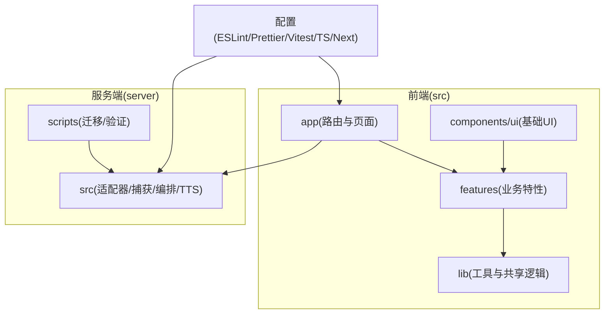
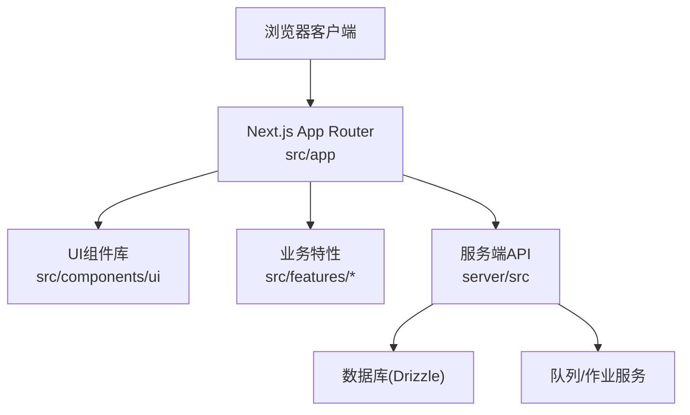
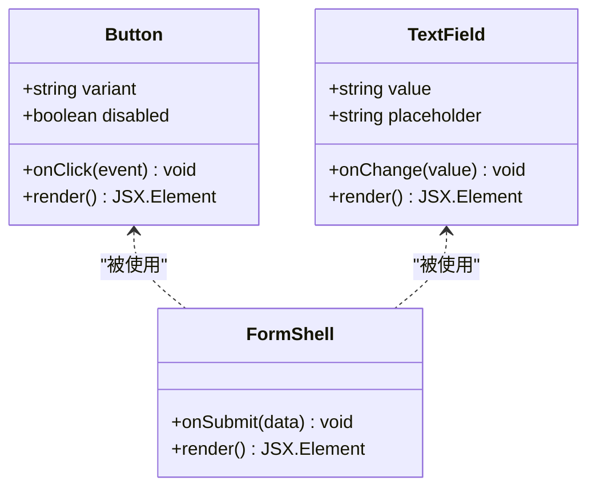
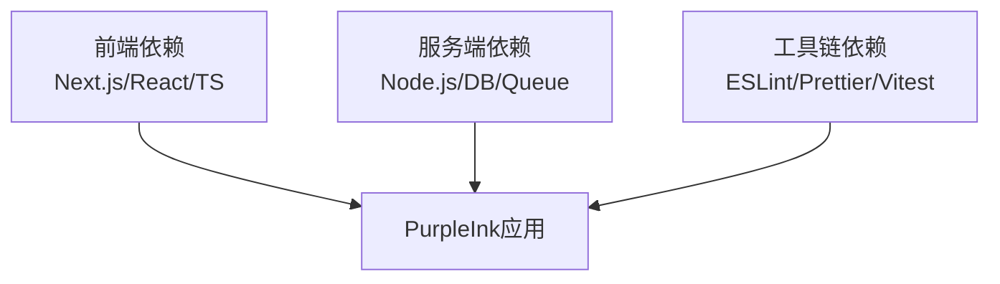

# 代码规范与最佳实践

<cite>
**本文档引用的文件**   
- [package.json](file://package.json)
- [tsconfig.json](file://tsconfig.json)
- [eslint.config.mjs](file://eslint.config.mjs)
- [.prettierrc](file://.prettierrc)
- [.prettierignore](file://.prettierignore)
- [vitest.config.ts](file://vitest.config.ts)
- [drizzle.config.ts](file://drizzle.config.ts)
- [next.config.ts](file://next.config.ts)
- [src/app/layout.tsx](file://src/app/layout.tsx)
- [src/providers.tsx](file://src/providers.tsx)
- [src/components/ui/button.tsx](file://src/components/ui/button.tsx)
- [src/features/auth/schemas.ts](file://src/features/auth/schemas.ts)
- [src/lib/utils.ts](file://src/lib/utils.ts)
- [server/src/index.ts](file://server/src/index.ts)
- [scripts/setup/db-migrate.ts](file://scripts/setup/db-migrate.ts)
</cite>

## 目录
1. [简介](#简介)
2. [项目结构](#项目结构)
3. [核心组件](#核心组件)
4. [架构总览](#架构总览)
5. [详细组件分析](#详细组件分析)
6. [依赖分析](#依赖分析)
7. [性能考虑](#性能考虑)
8. [故障排查指南](#故障排查指南)
9. [结论](#结论)
10. [附录](#附录)

## 简介
本指南面向PurpleInk项目的开发者，统一TypeScript编码规范、React组件开发规范、文件组织与命名约定、注释与文档标准，并给出ESLint规则配置与Prettier格式化设置建议。同时提供代码审查清单与质量检查标准，帮助团队在大型前端/全栈项目中保持一致的代码风格与工程质量。

## 项目结构
- 前端采用Next.js App Router，页面与路由位于src/app，通用UI组件位于src/components/ui，业务特性按领域划分到src/features，公共工具与库封装在src/lib。
- 服务端代码位于server/src，包含适配器、捕获、编排、TTS等模块；脚本位于scripts，涵盖迁移、验证与部署辅助。
- 工程化配置集中在根目录：TypeScript、ESLint、Prettier、Vitest、Drizzle ORM、Next.js等。

**图表来源** 
- [next.config.ts](file://next.config.ts)
- [tsconfig.json](file://tsconfig.json)
- [eslint.config.mjs](file://eslint.config.mjs)
- [.prettierrc](file://.prettierrc)

**章节来源**
- [package.json](file://package.json)
- [next.config.ts](file://next.config.ts)
- [tsconfig.json](file://tsconfig.json)

## 核心组件
- TypeScript配置与类型策略
  - 启用严格模式与路径别名，统一类型推断与编译选项，确保跨模块类型一致性。
  - 使用严格的null检查、函数参数校验与返回类型约束，避免any滥用。
- ESLint规则与静态检查
  - 基于现代ESLint配置，启用TypeScript解析器与Next.js插件，统一代码风格与潜在错误检测。
  - 推荐开启import排序、禁止未使用变量、强制Promise错误处理等规则。
- Prettier格式化
  - 统一缩进、引号、分号、行宽等格式，配合.prettierrc与.prettierignore排除生成文件。
- 测试框架与数据库迁移
  - Vitest用于单元测试与集成测试，Drizzle ORM用于数据库迁移与类型安全查询。

**章节来源**
- [tsconfig.json](file://tsconfig.json)
- [eslint.config.mjs](file://eslint.config.mjs)
- [.prettierrc](file://.prettierrc)
- [.prettierignore](file://.prettierignore)
- [vitest.config.ts](file://vitest.config.ts)
- [drizzle.config.ts](file://drizzle.config.ts)

## 架构总览
PurpleInk采用前后端分离的Next.js应用，前端通过App Router组织页面与布局，服务端提供API与后台任务（如渲染、导出、队列）。

**图表来源** 
- [src/app/layout.tsx](file://src/app/layout.tsx)
- [src/providers.tsx](file://src/providers.tsx)
- [server/src/index.ts](file://server/src/index.ts)

**章节来源**
- [src/app/layout.tsx](file://src/app/layout.tsx)
- [src/providers.tsx](file://src/providers.tsx)
- [server/src/index.ts](file://server/src/index.ts)

## 详细组件分析

### TypeScript编码规范
- 类型定义与接口设计
  - 优先使用interface描述对象形状，type用于联合类型、映射类型与计算类型。
  - 对外暴露的API契约使用明确的类型定义，避免隐式any。
  - 对复杂数据结构使用 discriminated union（区分联合）提升类型安全性。
- 错误处理
  - 使用自定义错误类或结构化错误对象，包含code、message、details等字段。
  - 异步操作必须处理Promise拒绝，避免未捕获异常。
- 常量与枚举
  - 使用const enum或字面量联合类型替代字符串魔法值，提高可读性与可维护性。

**章节来源**
- [src/features/auth/schemas.ts](file://src/features/auth/schemas.ts)
- [src/lib/utils.ts](file://src/lib/utils.ts)

### React组件开发规范
- 组件结构
  - 每个组件独立文件，文件名使用小写加连字符（kebab-case），组件名使用帕斯卡命名（PascalCase）。
  - 将展示型组件与容器型组件分离，保持职责单一。
- Props设计
  - 明确Props类型，使用可选属性与默认值减少调用方负担。
  - 避免传递过多props，必要时拆分子组件或使用组合模式。
- 状态管理
  - 局部状态使用useState/useReducer，全局状态使用上下文或状态库（如Zustand/Redux）。
  - 避免在组件内直接操作外部状态，通过回调或事件机制解耦。

**图表来源** 
- [src/components/ui/button.tsx](file://src/components/ui/button.tsx)

**章节来源**
- [src/components/ui/button.tsx](file://src/components/ui/button.tsx)

### 文件组织与命名约定
- 目录结构
  - src/app：页面与路由，按功能域划分子目录。
  - src/components/ui：基础UI组件，按原子组件组织。
  - src/features：业务特性，每个特性一个目录，内部再细分模块。
  - src/lib：工具函数、配置、第三方封装。
- 文件命名
  - 组件文件：PascalCase.tsx（如UserProfile.tsx）。
  - 工具文件：camelCase.ts（如formatDate.ts）。
  - 配置文件：snake_case或kebab-case（如db-config.ts）。
- 模块划分
  - 遵循单一职责原则，每个模块只负责一个功能域。
  - 避免循环依赖，使用接口抽象与依赖注入降低耦合。

**章节来源**
- [src/app/layout.tsx](file://src/app/layout.tsx)
- [src/components/ui/button.tsx](file://src/components/ui/button.tsx)
- [src/features/auth/schemas.ts](file://src/features/auth/schemas.ts)

### 代码注释与文档编写规范
- 注释标准
  - 函数与复杂逻辑添加JSDoc注释，说明参数、返回值与副作用。
  - 避免冗余注释，注释应解释“为什么”而非“是什么”。
- 文档编写
  - 使用Markdown编写README与API文档，保持版本同步。
  - 示例代码需可运行，避免过时信息。

**章节来源**
- [src/lib/utils.ts](file://src/lib/utils.ts)

### ESLint规则配置与Prettier格式化设置
- ESLint规则
  - 启用TypeScript解析器与Next.js插件，统一代码风格。
  - 推荐规则：import排序、禁止未使用变量、强制Promise错误处理。
- Prettier设置
  - 统一缩进、引号、分号、行宽等格式，忽略生成文件。
  - 与编辑器集成，保存时自动格式化。

**章节来源**
- [eslint.config.mjs](file://eslint.config.mjs)
- [.prettierrc](file://.prettierrc)
- [.prettierignore](file://.prettierignore)

### 测试与质量检查
- 单元测试与集成测试
  - 使用Vitest编写测试用例，覆盖关键业务逻辑与边界条件。
  - 数据库集成测试使用真实或模拟数据库环境。
- 代码审查清单
  - 类型是否完整且无any？
  - 错误处理是否完善？
  - 组件是否职责单一且可复用？
  - 是否有冗余代码或死代码？
  - 测试覆盖率是否达标？

**章节来源**
- [vitest.config.ts](file://vitest.config.ts)

## 依赖分析
- 前端依赖
  - Next.js、React、TypeScript为核心依赖，UI组件库与工具库按需引入。
- 服务端依赖
  - Node.js运行时、数据库驱动、队列服务等。
- 工具链依赖
  - ESLint、Prettier、Vitest、Drizzle ORM等。

**图表来源** 
- [package.json](file://package.json)

**章节来源**
- [package.json](file://package.json)

## 性能考虑
- 前端优化
  - 使用React.memo与useMemo优化重渲染。
  - 懒加载组件与路由，减少初始包体积。
- 服务端优化
  - 数据库查询优化，避免N+1问题。
  - 缓存热点数据，减少重复计算。
- 构建优化
  - Tree-shaking与代码分割，移除未使用代码。
  - 压缩资源与启用CDN加速。

[本节为通用指导，无需特定文件引用]

## 故障排查指南
- 常见问题
  - 类型错误：检查tsconfig与类型定义是否一致。
  - 运行时错误：查看控制台日志与错误堆栈。
  - 数据库连接失败：检查环境变量与连接配置。
- 调试技巧
  - 使用浏览器开发者工具与Node.js调试器。
  - 添加结构化日志，便于问题定位。
- 恢复策略
  - 回滚变更，逐步排查问题。
  - 使用备份与快照恢复数据。

**章节来源**
- [scripts/setup/db-migrate.ts](file://scripts/setup/db-migrate.ts)

## 结论
本指南提供了PurpleInk项目的代码规范与最佳实践，涵盖TypeScript、React、文件组织、注释文档、ESLint/Prettier配置、测试与质量检查。遵循这些规范有助于提升代码质量、团队协作效率与项目可维护性。

[本节为总结，无需特定文件引用]

## 附录
- 参考链接
  - TypeScript官方文档
  - React官方文档
  - Next.js官方文档
  - ESLint官方文档
  - Prettier官方文档
  - Vitest官方文档
  - Drizzle ORM官方文档

[本节为参考信息，无需特定文件引用]