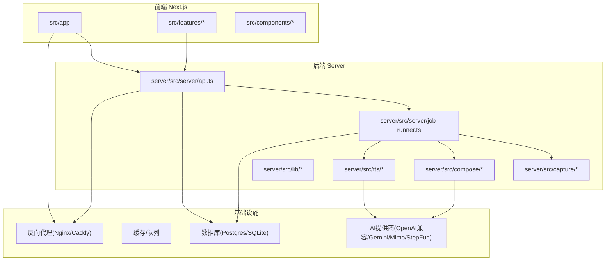
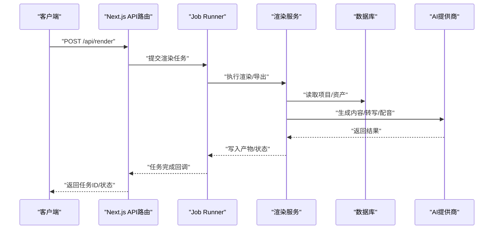
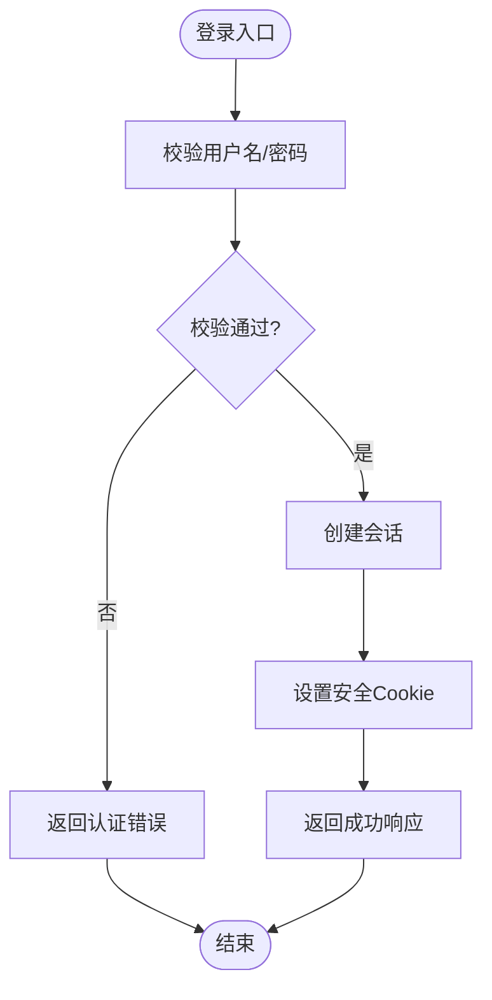
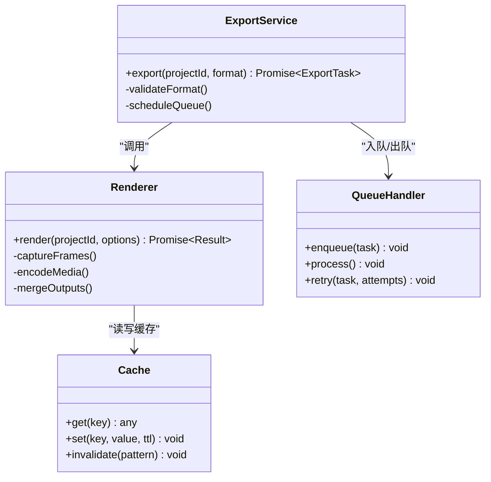
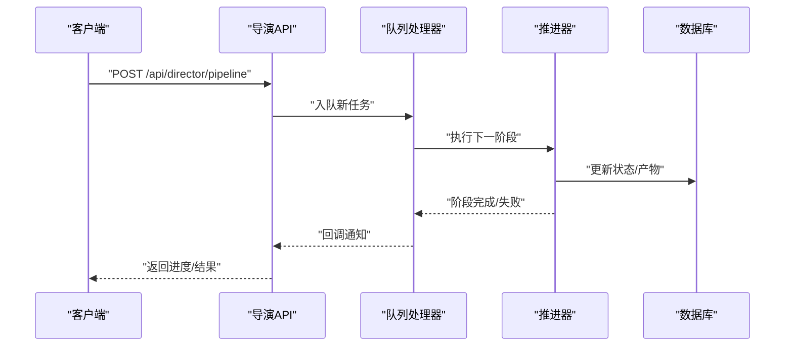
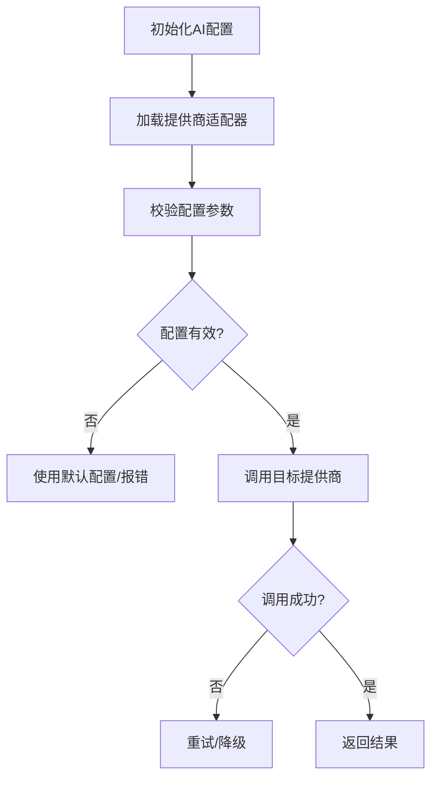
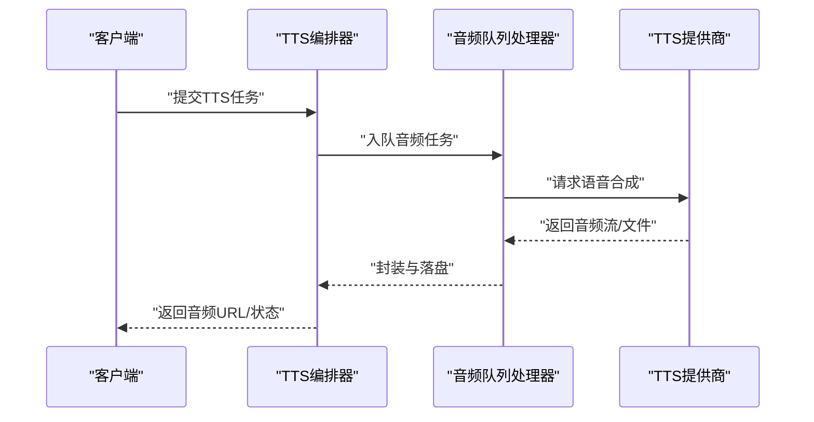
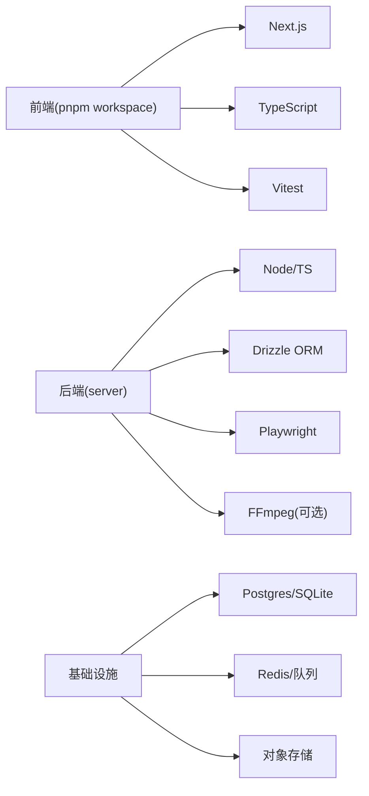

# 常见问题排查

<cite>
**本文引用的文件**   
- [package.json](file://package.json)
- [next.config.ts](file://next.config.ts)
- [tsconfig.json](file://tsconfig.json)
- [vitest.config.ts](file://vitest.config.ts)
- [drizzle.config.ts](file://drizzle.config.ts)
- [docker-compose.dev.yml](file://docker-compose.dev.yml)
- [docker-compose.prod.yml](file://docker-compose.prod.yml)
- [Dockerfile](file://Dockerfile)
- [server/package.json](file://server/package.json)
- [server/tsconfig.json](file://server/tsconfig.json)
- [server/src/index.ts](file://server/src/index.ts)
- [server/src/server/api.ts](file://server/src/server/api.ts)
- [server/src/server/job-runner.ts](file://server/src/server/job-runner.ts)
- [server/src/server/job-store.ts](file://server/src/server/job-store.ts)
- [server/src/lib/logger.ts](file://server/src/lib/logger.ts)
- [server/src/lib/load-env.ts](file://server/src/lib/load-env.ts)
- [server/src/capture/run-capture.ts](file://server/src/capture/run-capture.ts)
- [server/src/compose/run-pipeline.ts](file://server/src/compose/run-pipeline.ts)
- [server/src/tts/orchestrate.ts](file://server/src/tts/orchestrate.ts)
- [src/app/api/ping/route.ts](file://src/app/api/ping/route.ts)
- [src/app/api/auth/login/route.ts](file://src/app/api/auth/login/route.ts)
- [src/app/api/render/route.ts](file://src/app/api/render/route.ts)
- [src/app/api/director/pipeline/route.ts](file://src/app/api/director/pipeline/route.ts)
- [src/features/ai/config.ts](file://src/features/ai/config.ts)
- [src/features/ai/provider-registry.ts](file://src/features/ai/provider-registry.ts)
- [src/features/audio/narration-queue-handler.ts](file://src/features/audio/narration-queue-handler.ts)
- [src/features/render/export-service.ts](file://src/features/render/export-service.ts)
- [src/features/render/renderer.ts](file://src/features/render/renderer.ts)
- [src/features/render/cache.ts](file://src/features/render/cache.ts)
- [src/features/render/queue-handler.ts](file://src/features/render/queue-handler.ts)
- [src/features/director/advance.ts](file://src/features/director/advance.ts)
- [src/features/director/queue-handler.ts](file://src/features/director/queue-handler.ts)
- [src/features/auth/session.ts](file://src/features/auth/session.ts)
- [src/features/auth/errors.ts](file://src/features/auth/errors.ts)
- [scripts/setup/db-migrate.ts](file://scripts/setup/db-migrate.ts)
- [scripts/migration/provision-master-key.ts](file://scripts/migration/provision-master-key.ts)
- [deploy/reverse-proxy/Dockerfile](file://deploy/reverse-proxy/Dockerfile)
- [deploy/reverse-proxy/entrypoint.sh](file://deploy/reverse-proxy/entrypoint.sh)
- [docs/deployment/runbook.md](file://docs/deployment/runbook.md)
</cite>

## 目录
1. [简介](#简介)
2. [项目结构](#项目结构)
3. [核心组件](#核心组件)
4. [架构总览](#架构总览)
5. [详细组件分析](#详细组件分析)
6. [依赖分析](#依赖分析)
7. [性能考虑](#性能考虑)
8. [故障排查指南](#故障排查指南)
9. [结论](#结论)
10. [附录](#附录)

## 简介
本指南面向PurpleInk项目的开发与运维人员，聚焦于常见问题的快速定位与解决。内容覆盖环境配置、依赖冲突、编译错误、运行时错误诊断（日志、堆栈、性能瓶颈）、数据库问题（连接、查询优化、一致性）、AI服务集成、网络请求与API调试，以及紧急故障的应急处理流程。文档以仓库实际代码为依据，提供可追溯的文件来源与可视化图示，帮助读者从概念到实现逐步深入。

## 项目结构
PurpleInk采用前后端分离与多包协作：
- 前端Next.js应用位于src，包含路由、页面、组件与业务特性模块。
- 服务端Node/TS应用位于server/src，提供API、任务执行、捕获与TTS编排等能力。
- 脚本与部署位于scripts与deploy，涵盖数据库迁移、密钥初始化、反向代理与容器化。
- 测试与配置集中在根目录与各自子包中。

**图表来源** 
- [server/src/server/api.ts](file://server/src/server/api.ts)
- [server/src/server/job-runner.ts](file://server/src/server/job-runner.ts)
- [server/src/capture/run-capture.ts](file://server/src/capture/run-capture.ts)
- [server/src/compose/run-pipeline.ts](file://server/src/compose/run-pipeline.ts)
- [server/src/tts/orchestrate.ts](file://server/src/tts/orchestrate.ts)
- [src/app/api/render/route.ts](file://src/app/api/render/route.ts)
- [src/app/api/director/pipeline/route.ts](file://src/app/api/director/pipeline/route.ts)

**章节来源**
- [package.json](file://package.json)
- [next.config.ts](file://next.config.ts)
- [tsconfig.json](file://tsconfig.json)
- [vitest.config.ts](file://vitest.config.ts)
- [drizzle.config.ts](file://drizzle.config.ts)
- [docker-compose.dev.yml](file://docker-compose.dev.yml)
- [docker-compose.prod.yml](file://docker-compose.prod.yml)
- [Dockerfile](file://Dockerfile)

## 核心组件
- API网关与路由：Next.js App Router暴露REST接口，统一转发至服务端逻辑。
- 任务调度与执行：job-runner负责拉取并执行渲染、导出、导演流水线等任务。
- 捕获与合成：浏览器驱动与Playwright用于页面捕获；compose编排生成阶段。
- TTS编排：语音合成与媒体处理管线。
- 认证与会话：登录、注册、会话管理、验证码与邮件发送。
- 渲染与导出：帧捕获、编码、合并、缩略图与缓存。
- AI适配层：多提供商适配器与路由、配置校验与凭据存储。

**章节来源**
- [server/src/server/api.ts](file://server/src/server/api.ts)
- [server/src/server/job-runner.ts](file://server/src/server/job-runner.ts)
- [server/src/capture/run-capture.ts](file://server/src/capture/run-capture.ts)
- [server/src/compose/run-pipeline.ts](file://server/src/compose/run-pipeline.ts)
- [server/src/tts/orchestrate.ts](file://server/src/tts/orchestrate.ts)
- [src/app/api/auth/login/route.ts](file://src/app/api/auth/login/route.ts)
- [src/features/render/renderer.ts](file://src/features/render/renderer.ts)
- [src/features/render/export-service.ts](file://src/features/render/export-service.ts)
- [src/features/ai/provider-registry.ts](file://src/features/ai/provider-registry.ts)

## 架构总览
系统通过Next.js API路由接收请求，交由服务端job-runner进行异步任务处理。渲染与导出依赖数据库持久化与缓存，AI服务通过适配器调用外部模型。反向代理负责TLS终止与鉴权。

**图表来源** 
- [src/app/api/render/route.ts](file://src/app/api/render/route.ts)
- [server/src/server/job-runner.ts](file://server/src/server/job-runner.ts)
- [src/features/render/export-service.ts](file://src/features/render/export-service.ts)
- [src/features/render/renderer.ts](file://src/features/render/renderer.ts)
- [src/features/ai/provider-registry.ts](file://src/features/ai/provider-registry.ts)

## 详细组件分析

### 认证与会话
- 登录流程：校验凭据、生成会话、设置Cookie。
- 会话管理：读写会话数据、过期策略、安全签名。
- 错误处理：统一错误类型与消息映射。

**图表来源** 
- [src/app/api/auth/login/route.ts](file://src/app/api/auth/login/route.ts)
- [src/features/auth/session.ts](file://src/features/auth/session.ts)
- [src/features/auth/errors.ts](file://src/features/auth/errors.ts)

**章节来源**
- [src/app/api/auth/login/route.ts](file://src/app/api/auth/login/route.ts)
- [src/features/auth/session.ts](file://src/features/auth/session.ts)
- [src/features/auth/errors.ts](file://src/features/auth/errors.ts)

### 渲染与导出
- 渲染管线：帧捕获、编码、合并、缩略图生成。
- 缓存策略：基于输入哈希的缓存命中与失效。
- 队列处理：并发控制、重试与失败回滚。

**图表来源** 
- [src/features/render/renderer.ts](file://src/features/render/renderer.ts)
- [src/features/render/export-service.ts](file://src/features/render/export-service.ts)
- [src/features/render/cache.ts](file://src/features/render/cache.ts)
- [src/features/render/queue-handler.ts](file://src/features/render/queue-handler.ts)

**章节来源**
- [src/app/api/render/route.ts](file://src/app/api/render/route.ts)
- [src/features/render/renderer.ts](file://src/features/render/renderer.ts)
- [src/features/render/export-service.ts](file://src/features/render/export-service.ts)
- [src/features/render/cache.ts](file://src/features/render/cache.ts)
- [src/features/render/queue-handler.ts](file://src/features/render/queue-handler.ts)

### 导演流水线与队列
- 推进器：按阶段推进任务状态，处理依赖与副作用。
- 队列处理器：消费任务、执行阶段、记录结果与错误。

**图表来源** 
- [src/app/api/director/pipeline/route.ts](file://src/app/api/director/pipeline/route.ts)
- [src/features/director/advance.ts](file://src/features/director/advance.ts)
- [src/features/director/queue-handler.ts](file://src/features/director/queue-handler.ts)

**章节来源**
- [src/app/api/director/pipeline/route.ts](file://src/app/api/director/pipeline/route.ts)
- [src/features/director/advance.ts](file://src/features/director/advance.ts)
- [src/features/director/queue-handler.ts](file://src/features/director/queue-handler.ts)

### AI服务集成
- 提供商注册：动态加载适配器，支持OpenAI兼容、Gemini、Mimo、StepFun。
- 配置校验：必填字段、格式验证、默认值注入。
- 错误恢复：重试、降级与回退策略。

**图表来源** 
- [src/features/ai/config.ts](file://src/features/ai/config.ts)
- [src/features/ai/provider-registry.ts](file://src/features/ai/provider-registry.ts)

**章节来源**
- [src/features/ai/config.ts](file://src/features/ai/config.ts)
- [src/features/ai/provider-registry.ts](file://src/features/ai/provider-registry.ts)

### TTS与音频处理
- 编排器：协调文本转语音、媒体封装与输出。
- 队列处理器：音频任务串行/并行处理，避免资源竞争。

**图表来源** 
- [server/src/tts/orchestrate.ts](file://server/src/tts/orchestrate.ts)
- [src/features/audio/narration-queue-handler.ts](file://src/features/audio/narration-queue-handler.ts)

**章节来源**
- [server/src/tts/orchestrate.ts](file://server/src/tts/orchestrate.ts)
- [src/features/audio/narration-queue-handler.ts](file://src/features/audio/narration-queue-handler.ts)

## 依赖分析
- 前端依赖：Next.js、TypeScript、Vitest、Tailwind等。
- 后端依赖：Node/TS、Drizzle ORM、Playwright、FFmpeg（可能）。
- 运行依赖：数据库（Postgres/SQLite）、Redis/队列（可选）、对象存储（可选）。
- 构建与测试：pnpm工作区、ESLint、Prettier、Vitest。

**图表来源** 
- [package.json](file://package.json)
- [server/package.json](file://server/package.json)
- [drizzle.config.ts](file://drizzle.config.ts)

**章节来源**
- [package.json](file://package.json)
- [server/package.json](file://server/package.json)
- [drizzle.config.ts](file://drizzle.config.ts)

## 性能考虑
- 渲染与导出：启用缓存、限制并发、分块处理大文件。
- 数据库：索引优化、慢查询监控、连接池调优。
- AI调用：批量请求、超时与重试策略、缓存热点数据。
- 队列：背压控制、死信队列、监控告警。

[本节为通用指导，不直接分析具体文件]

## 故障排查指南

### 环境配置问题
- 环境变量缺失或格式错误：检查.env与配置文件加载路径。
- Docker镜像构建失败：确认基础镜像与依赖安装步骤。
- 反向代理证书与端口冲突：检查Nginx/Caddy配置与端口占用。

建议检查点：
- server/src/lib/load-env.ts中的环境变量加载逻辑。
- deploy/reverse-proxy/entrypoint.sh中的启动参数。
- docker-compose*.yml中的服务定义与端口映射。

**章节来源**
- [server/src/lib/load-env.ts](file://server/src/lib/load-env.ts)
- [deploy/reverse-proxy/entrypoint.sh](file://deploy/reverse-proxy/entrypoint.sh)
- [docker-compose.dev.yml](file://docker-compose.dev.yml)
- [docker-compose.prod.yml](file://docker-compose.prod.yml)

### 依赖冲突与版本问题
- pnpm工作区锁文件不一致：清理node_modules后重新安装。
- TypeScript版本不匹配：统一tsconfig与依赖版本。
- 第三方库破坏性更新：锁定版本并回归测试。

建议检查点：
- package.json与pnpm-lock.yaml的版本约束。
- tsconfig.json与server/tsconfig.json的路径映射。
- vitest.config.ts中的测试环境配置。

**章节来源**
- [package.json](file://package.json)
- [tsconfig.json](file://tsconfig.json)
- [server/tsconfig.json](file://server/tsconfig.json)
- [vitest.config.ts](file://vitest.config.ts)

### 编译错误
- Next.js构建失败：检查路由与组件导入、服务器端渲染限制。
- TypeScript编译错误：类型定义缺失或不一致。
- 测试失败：断言错误或模拟数据不一致。

建议检查点：
- next.config.ts中的构建选项与别名。
- src与server下的类型定义与接口契约。
- tests目录下的用例与fixture。

**章节来源**
- [next.config.ts](file://next.config.ts)
- [src/app/api/ping/route.ts](file://src/app/api/ping/route.ts)

### 运行时错误诊断
- 日志分析：集中收集server与前端日志，关联请求ID。
- 错误堆栈解读：定位异常抛出点与调用链。
- 性能瓶颈定位：CPU/内存/IO监控，慢查询与长耗时任务。

建议检查点：
- server/src/lib/logger.ts中的日志级别与输出格式。
- server/src/server/job-runner.ts中的任务执行与异常捕获。
- src/features/render/cache.ts中的缓存命中率与延迟。

**章节来源**
- [server/src/lib/logger.ts](file://server/src/lib/logger.ts)
- [server/src/server/job-runner.ts](file://server/src/server/job-runner.ts)
- [src/features/render/cache.ts](file://src/features/render/cache.ts)

### 数据库相关问题
- 连接失败：检查DSN、权限、防火墙与连接池上限。
- 查询缓慢：分析执行计划、添加索引、避免全表扫描。
- 数据不一致：事务边界、幂等写入、最终一致性补偿。

建议检查点：
- drizzle.config.ts中的ORM配置与迁移脚本。
- scripts/setup/db-migrate.ts中的迁移执行。
- scripts/migration/provision-master-key.ts中的密钥初始化。

**章节来源**
- [drizzle.config.ts](file://drizzle.config.ts)
- [scripts/setup/db-migrate.ts](file://scripts/setup/db-migrate.ts)
- [scripts/migration/provision-master-key.ts](file://scripts/migration/provision-master-key.ts)

### AI服务集成问题
- 凭据无效或配额耗尽：检查API Key、Base URL与限流策略。
- 模型不可用或超时：切换备用提供商、增加重试与超时。
- 输出格式异常：校验响应结构、增加容错解析。

建议检查点：
- src/features/ai/config.ts与provider-registry.ts中的配置与注册。
- 各适配器实现中的错误处理与降级逻辑。

**章节来源**
- [src/features/ai/config.ts](file://src/features/ai/config.ts)
- [src/features/ai/provider-registry.ts](file://src/features/ai/provider-registry.ts)

### 网络请求与API调试
- 健康检查：/api/ping用于服务可用性探测。
- 认证流程：/api/auth/login验证登录与会话。
- 渲染与导演：/api/render与/api/director/pipeline的任务提交与状态查询。

建议检查点：
- src/app/api/ping/route.ts中的健康检查实现。
- src/app/api/auth/login/route.ts中的认证逻辑。
- src/app/api/render/route.ts与src/app/api/director/pipeline/route.ts中的任务处理。

**章节来源**
- [src/app/api/ping/route.ts](file://src/app/api/ping/route.ts)
- [src/app/api/auth/login/route.ts](file://src/app/api/auth/login/route.ts)
- [src/app/api/render/route.ts](file://src/app/api/render/route.ts)
- [src/app/api/director/pipeline/route.ts](file://src/app/api/director/pipeline/route.ts)

### 紧急故障应急处理流程
- 快速止血：重启关键服务、回滚变更、隔离故障节点。
- 影响评估：监控指标、用户反馈、数据一致性检查。
- 根因分析：日志聚合、链路追踪、复现与修复。
- 恢复验证：健康检查、端到端测试、灰度发布。

建议检查点：
- docs/deployment/runbook.md中的标准操作程序。
- deploy/reverse-proxy/Dockerfile与entrypoint.sh中的容器化部署。
- server/src/server/api.ts中的API入口与错误处理。

**章节来源**
- [docs/deployment/runbook.md](file://docs/deployment/runbook.md)
- [deploy/reverse-proxy/Dockerfile](file://deploy/reverse-proxy/Dockerfile)
- [deploy/reverse-proxy/entrypoint.sh](file://deploy/reverse-proxy/entrypoint.sh)
- [server/src/server/api.ts](file://server/src/server/api.ts)

## 结论
本指南围绕PurpleInk的核心组件与常见故障场景，提供了从环境到运行、从数据库到AI集成的系统性排查方法。通过日志、堆栈、性能监控与标准化应急流程，团队可快速定位并解决问题，保障系统稳定与用户体验。

## 附录
- 常用命令：pnpm dev、pnpm build、pnpm test、docker-compose up。
- 监控指标：QPS、错误率、延迟分布、队列积压、数据库连接数。
- 参考文档：内部设计文档与问题证据目录。

[本节为补充信息，不直接分析具体文件]