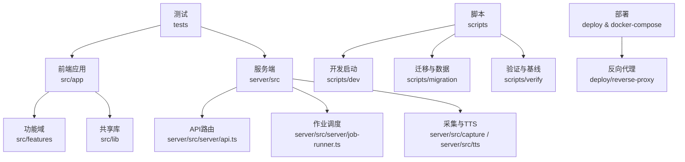
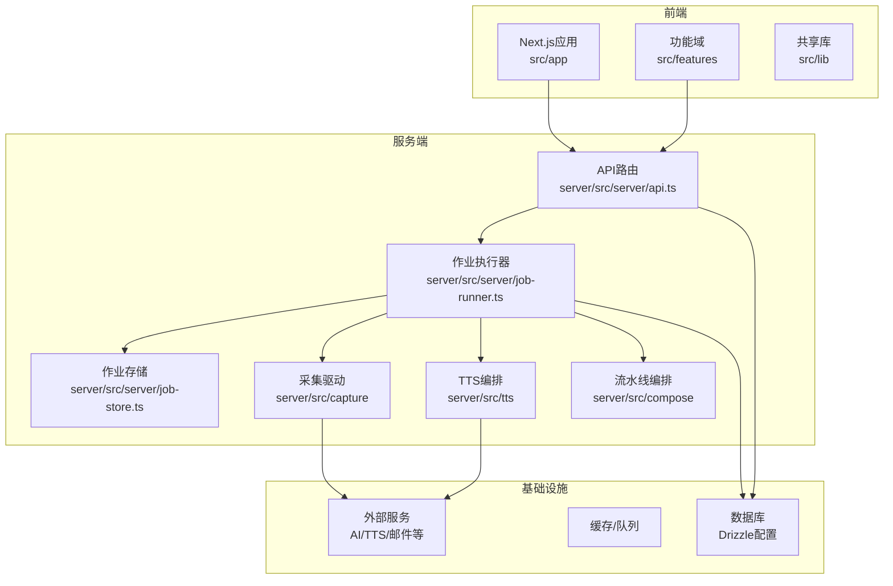
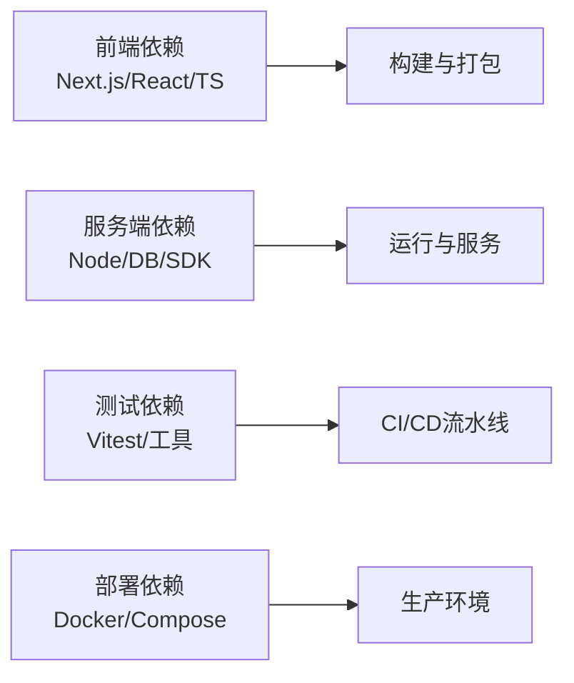

# 开发指南

<cite>
**本文引用的文件**   
- [package.json](file://package.json)
- [tsconfig.json](file://tsconfig.json)
- [eslint.config.mjs](file://eslint.config.mjs)
- [.prettierrc](file://.prettierrc)
- [.prettierignore](file://.prettierignore)
- [vitest.config.ts](file://vitest.config.ts)
- [vitest.pg.config.ts](file://vitest.pg.config.ts)
- [next.config.ts](file://next.config.ts)
- [postcss.config.mjs](file://postcss.config.mjs)
- [drizzle.config.ts](file://drizzle.config.ts)
- [docker-compose.dev.yml](file://docker-compose.dev.yml)
- [docker-compose.prod.yml](file://docker-compose.prod.yml)
- [Dockerfile](file://Dockerfile)
- [server/package.json](file://server/package.json)
- [server/tsconfig.json](file://server/tsconfig.json)
- [scripts/dev/start-dev.cmd](file://scripts/dev/start-dev.cmd)
- [scripts/dev/start-dev.ps1](file://scripts/dev/start-dev.ps1)
- [scripts/setup/README.md](file://scripts/setup/README.md)
- [scripts/migration/export-sqlite.ts](file://scripts/migration/export-sqlite.ts)
- [scripts/migration/import-postgres.ts](file://scripts/migration/import-postgres.ts)
- [scripts/migration/provision-master-key.ts](file://scripts/migration/provision-master-key.ts)
- [scripts/migration/reconcile-postgres.ts](file://scripts/migration/reconcile-postgres.ts)
- [scripts/migration/sqlite-backup.ts](file://scripts/migration/sqlite-backup.ts)
- [scripts/verify/auth-flow-smoke.mjs](file://scripts/verify/auth-flow-smoke.mjs)
- [scripts/verify/e2e-smoke.ts](file://scripts/verify/e2e-smoke.ts)
- [scripts/verify/capture-v3-baseline.ts](file://scripts/verify/capture-v3-baseline.ts)
- [server/src/index.ts](file://server/src/index.ts)
- [server/src/server/api.ts](file://server/src/server/api.ts)
- [server/src/server/job-runner.ts](file://server/src/server/job-runner.ts)
- [server/src/server/job-store.ts](file://server/src/server/job-store.ts)
- [server/src/lib/logger.ts](file://server/src/lib/logger.ts)
- [server/src/lib/load-env.ts](file://server/src/lib/load-env.ts)
- [server/src/compose/run-pipeline.ts](file://server/src/compose/run-pipeline.ts)
- [server/src/capture/run-capture.ts](file://server/src/capture/run-capture.ts)
- [server/src/tts/orchestrate.ts](file://server/src/tts/orchestrate.ts)
- [src/app/layout.tsx](file://src/app/layout.tsx)
- [src/app/providers.tsx](file://src/app/providers.tsx)
- [src/instrumentation.ts](file://src/instrumentation.ts)
- [src/features/director/pipeline.ts](file://src/features/director/pipeline.ts)
- [src/features/render/renderer.ts](file://src/features/render/renderer.ts)
- [src/features/audio/narration.ts](file://src/features/audio/narration.ts)
- [src/features/auth/session.ts](file://src/features/auth/session.ts)
- [src/features/auth/account-service.ts](file://src/features/auth/account-service.ts)
- [src/features/artifacts/service.ts](file://src/features/artifacts/service.ts)
- [src/features/routing/media-route-repository.ts](file://src/features/routing/media-route-repository.ts)
- [src/features/routing/model-route-repository.ts](file://src/features/routing/model-route-repository.ts)
- [tests/env.test.ts](file://tests/env.test.ts)
- [tests/tts-narration.test.ts](file://tests/tts-narration.test.ts)
- [tests/tts-orchestration.test.ts](file://tests/tts-orchestration.test.ts)
- [tests/tts-runtime.test.ts](file://tests/tts-runtime.test.ts)
- [tests/tts-pipeline-integration.test.ts](file://tests/tts-pipeline-integration.test.ts)
- [tests/hyperframes-local-command.test.ts](file://tests/hyperframes-local-command.test.ts)
- [tests/app-route-contract.test.tsx](file://tests/app-route-contract.test.tsx)
- [tests/products-settings-layout.test.ts](file://tests/products-settings-layout.test.ts)
- [tests/providers-theme.test.tsx](file://tests/providers-theme.test.tsx)
- [tests/url-encoding-contract.test.ts](file://tests/url-encoding-contract.test.ts)
- [tests/worker-error-hygiene.test.ts](file://tests/worker-error-hygiene.test.ts)
- [docs/configuration/credentials.md](file://docs/configuration/credentials.md)
- [docs/deployment/runbook.md](file://docs/deployment/runbook.md)
- [docs/conventions/workflow-failure-patterns.md](file://docs/conventions/workflow-failure-patterns.md)
- [docs/plans/PLAN-002-auth-system.md](file://docs/plans/PLAN-002-auth-system.md)
- [docs/issues/README.md](file://docs/issues/README.md)
- [deploy/reverse-proxy/Dockerfile](file://deploy/reverse-proxy/Dockerfile)
- [deploy/reverse-proxy/entrypoint.sh](file://deploy/reverse-proxy/entrypoint.sh)
- [config/tts.env.example](file://config/tts.env.example)
</cite>

## 目录
1. [简介](#简介)
2. [项目结构](#项目结构)
3. [核心组件](#核心组件)
4. [架构总览](#架构总览)
5. [详细组件分析](#详细组件分析)
6. [依赖分析](#依赖分析)
7. [性能考虑](#性能考虑)
8. [故障排查指南](#故障排查指南)
9. [结论](#结论)
10. [附录](#附录)

## 简介
本指南面向PurpleInk项目的开发者，覆盖从环境搭建、IDE与代码规范配置，到调试技巧、Git协作流程、新功能开发流程以及常见问题排查的全链路实践。目标是帮助新成员快速上手，并让团队在一致的开发体验下高效协作。

## 项目结构
本项目采用前后端一体化工程组织：
- 前端应用位于 src 目录，基于Next.js App Router，包含页面、组件、功能域（features）与共享库（lib）。
- 服务端逻辑位于 server 目录，提供API、作业调度、采集与TTS编排等能力。
- 测试统一位于 tests 目录，使用Vitest运行单元与集成测试。
- 脚本位于 scripts 目录，涵盖开发启动、数据库迁移、验证与基线捕获等。
- 部署相关配置位于 deploy 与 docker-compose.*.yml，支持反向代理与容器化部署。
- 文档位于 docs，包含配置说明、部署手册、设计文档与问题证据等。

**图表来源**
- [src/app/layout.tsx:1-50](file://src/app/layout.tsx#L1-L50)
- [server/src/server/api.ts:1-80](file://server/src/server/api.ts#L1-L80)
- [server/src/server/job-runner.ts:1-60](file://server/src/server/job-runner.ts#L1-L60)
- [server/src/capture/run-capture.ts:1-40](file://server/src/capture/run-capture.ts#L1-L40)
- [server/src/tts/orchestrate.ts:1-40](file://server/src/tts/orchestrate.ts#L1-L40)

**章节来源**
- [package.json:1-120](file://package.json#L1-L120)
- [next.config.ts:1-60](file://next.config.ts#L1-L60)
- [docker-compose.dev.yml:1-80](file://docker-compose.dev.yml#L1-L80)
- [docker-compose.prod.yml:1-80](file://docker-compose.prod.yml#L1-L80)

## 核心组件
- 前端运行时与提供者：Next.js布局与全局Provider管理状态与主题。
- 服务端API与作业：REST API路由、作业执行器与持久化存储。
- 采集与TTS：浏览器采集驱动与语音合成编排。
- 功能域：导演（Director）、渲染（Render）、音频（Audio）、认证（Auth）、制品（Artifacts）、路由（Routing）等。
- 测试与验证：Vitest单元测试、端到端冒烟测试与基线对比。
- 脚本与迁移：开发启动、数据库初始化、数据导出导入与密钥准备。

**章节来源**
- [src/app/providers.tsx:1-60](file://src/app/providers.tsx#L1-L60)
- [server/src/server/api.ts:1-80](file://server/src/server/api.ts#L1-L80)
- [server/src/server/job-runner.ts:1-60](file://server/src/server/job-runner.ts#L1-L60)
- [server/src/capture/run-capture.ts:1-40](file://server/src/capture/run-capture.ts#L1-L40)
- [server/src/tts/orchestrate.ts:1-40](file://server/src/tts/orchestrate.ts#L1-L40)
- [src/features/director/pipeline.ts:1-60](file://src/features/director/pipeline.ts#L1-L60)
- [src/features/render/renderer.ts:1-60](file://src/features/render/renderer.ts#L1-L60)
- [src/features/audio/narration.ts:1-60](file://src/features/audio/narration.ts#L1-L60)
- [src/features/auth/session.ts:1-60](file://src/features/auth/session.ts#L1-L60)
- [src/features/artifacts/service.ts:1-60](file://src/features/artifacts/service.ts#L1-L60)
- [src/features/routing/media-route-repository.ts:1-60](file://src/features/routing/media-route-repository.ts#L1-L60)
- [src/features/routing/model-route-repository.ts:1-60](file://src/features/routing/model-route-repository.ts#L1-L60)

## 架构总览
系统由前端应用、服务端API、作业调度、采集与TTS编排、数据库与外部服务组成。前端通过Next.js提供服务端渲染与API路由；服务端负责业务编排与异步任务；采集模块驱动浏览器完成页面抓取；TTS模块协调语音生成与媒体处理；测试与脚本贯穿开发与发布流程。

**图表来源**
- [server/src/server/api.ts:1-80](file://server/src/server/api.ts#L1-L80)
- [server/src/server/job-runner.ts:1-60](file://server/src/server/job-runner.ts#L1-L60)
- [server/src/server/job-store.ts:1-60](file://server/src/server/job-store.ts#L1-L60)
- [server/src/capture/run-capture.ts:1-40](file://server/src/capture/run-capture.ts#L1-L40)
- [server/src/tts/orchestrate.ts:1-40](file://server/src/tts/orchestrate.ts#L1-L40)
- [server/src/compose/run-pipeline.ts:1-60](file://server/src/compose/run-pipeline.ts#L1-L60)
- [drizzle.config.ts:1-40](file://drizzle.config.ts#L1-L40)

## 详细组件分析

### 开发环境与IDE配置
- Node与包管理器：建议使用pnpm工作区，确保前后端依赖一致性。
- TypeScript：统一tsconfig，启用严格模式与路径别名，保证类型安全。
- ESLint：集中式配置，统一代码风格与规则集，配合编辑器插件实时检查。
- Prettier：格式化规则集中管理，忽略文件列表避免误格式化。
- Next.js：App Router与中间件配置，环境变量加载与构建优化。
- PostCSS：样式预处理与插件链配置。
- Drizzle：数据库ORM与迁移工具配置。
- Docker与Compose：本地与生产环境容器编排，反向代理与密钥管理。

**章节来源**
- [package.json:1-120](file://package.json#L1-L120)
- [tsconfig.json:1-60](file://tsconfig.json#L1-L60)
- [eslint.config.mjs:1-80](file://eslint.config.mjs#L1-L80)
- [.prettierrc:1-40](file://.prettierrc#L1-L40)
- [.prettierignore:1-20](file://.prettierignore#L1-L20)
- [next.config.ts:1-60](file://next.config.ts#L1-L60)
- [postcss.config.mjs:1-40](file://postcss.config.mjs#L1-L40)
- [drizzle.config.ts:1-40](file://drizzle.config.ts#L1-L40)
- [docker-compose.dev.yml:1-80](file://docker-compose.dev.yml#L1-L80)
- [docker-compose.prod.yml:1-80](file://docker-compose.prod.yml#L1-L80)
- [Dockerfile:1-60](file://Dockerfile#L1-L60)

### 代码规范与最佳实践
- 命名约定：模块与文件采用小写下划线或短横线，组件以大写驼峰命名，常量全大写。
- 文件组织：按功能域划分features目录，公共逻辑放入lib，测试与源文件就近放置。
- 注释标准：关键函数与复杂逻辑添加JSDoc注释，解释参数、返回值与副作用。
- 错误处理：统一错误类型与日志记录，避免吞异常，提供可恢复策略。
- 配置管理：环境变量通过load-env加载，敏感信息通过密钥管理与示例模板。

**章节来源**
- [server/src/lib/logger.ts:1-60](file://server/src/lib/logger.ts#L1-L60)
- [server/src/lib/load-env.ts:1-40](file://server/src/lib/load-env.ts#L1-L40)
- [config/tts.env.example:1-40](file://config/tts.env.example#L1-L40)
- [docs/configuration/credentials.md:1-60](file://docs/configuration/credentials.md#L1-L60)

### 调试技巧与工具使用
- 断点调试：在VS Code中配置Node与Chrome调试器，设置断点于API路由与作业执行器。
- 日志分析：使用结构化日志与分级输出，结合grep与日志聚合工具定位问题。
- 性能分析：使用CPU与内存Profiler，识别热点函数与内存泄漏。
- 测试驱动：编写单测与集成测试，利用Vitest快速反馈。
- 冒烟与基线：通过scripts/verify进行端到端冒烟与截图基线对比。

**章节来源**
- [server/src/server/api.ts:1-80](file://server/src/server/api.ts#L1-L80)
- [server/src/server/job-runner.ts:1-60](file://server/src/server/job-runner.ts#L1-L60)
- [scripts/verify/auth-flow-smoke.mjs:1-40](file://scripts/verify/auth-flow-smoke.mjs#L1-L40)
- [scripts/verify/e2e-smoke.ts:1-40](file://scripts/verify/e2e-smoke.ts#L1-L40)
- [scripts/verify/capture-v3-baseline.ts:1-40](file://scripts/verify/capture-v3-baseline.ts#L1-L40)
- [vitest.config.ts:1-40](file://vitest.config.ts#L1-L40)
- [vitest.pg.config.ts:1-40](file://vitest.pg.config.ts#L1-L40)

### Git工作流与协作规范
- 分支策略：主分支保护，特性分支按功能命名，提交前运行lint与测试。
- 提交规范：遵循Conventional Commits，描述变更影响与动机。
- 代码审查：Pull Request需附带测试与文档更新，至少一名Reviewer批准。
- 版本发布：标签与变更日志自动生成，回滚策略明确。

**章节来源**
- [docs/conventions/workflow-failure-patterns.md:1-60](file://docs/conventions/workflow-failure-patterns.md#L1-L60)
- [docs/plans/PLAN-002-auth-system.md:1-60](file://docs/plans/PLAN-002-auth-system.md#L1-L60)

### 新功能开发流程
- 需求分析：明确目标、约束与验收标准，产出需求文档。
- 设计文档：定义接口、数据模型与流程图，评审通过后进入实现。
- 编码实现：遵循规范与最佳实践，编写单测与集成测试。
- 测试验证：本地冒烟与CI流水线验证，基线对比与回归测试。
- 上线与监控：灰度发布与监控告警，收集用户反馈持续优化。

**章节来源**
- [docs/issues/README.md:1-60](file://docs/issues/README.md#L1-L60)
- [tests/app-route-contract.test.tsx:1-60](file://tests/app-route-contract.test.tsx#L1-L60)
- [tests/products-settings-layout.test.ts:1-60](file://tests/products-settings-layout.test.ts#L1-L60)

## 依赖分析
- 前端依赖：Next.js、React、TypeScript、PostCSS、Tailwind等。
- 服务端依赖：Node.js运行时、数据库驱动、外部API客户端。
- 测试依赖：Vitest、Playwright（可选）、截图基线工具。
- 部署依赖：Docker、Compose、反向代理镜像。

**图表来源**
- [package.json:1-120](file://package.json#L1-L120)
- [server/package.json:1-80](file://server/package.json#L1-L80)
- [vitest.config.ts:1-40](file://vitest.config.ts#L1-L40)
- [docker-compose.dev.yml:1-80](file://docker-compose.dev.yml#L1-L80)

**章节来源**
- [package.json:1-120](file://package.json#L1-L120)
- [server/package.json:1-80](file://server/package.json#L1-L80)
- [vitest.config.ts:1-40](file://vitest.config.ts#L1-L40)
- [docker-compose.dev.yml:1-80](file://docker-compose.dev.yml#L1-L80)

## 性能考虑
- 前端：懒加载与代码分割，减少首屏体积，使用缓存与CDN。
- 后端：异步作业与批处理，数据库索引与查询优化，连接池与限流。
- 资源：图片与媒体压缩，静态资源预取与预加载。
- 监控：APM与指标采集，慢查询与错误率告警。

[本节为通用指导，不直接分析具体文件]

## 故障排查指南
- 环境问题：检查Node版本、pnpm安装与依赖完整性，确认环境变量加载。
- 数据库问题：查看迁移脚本与连接配置，验证表结构与权限。
- API错误：检查路由与中间件，核对请求体与响应格式。
- 作业失败：查看作业日志与重试策略，定位外部服务超时与限流。
- 采集与TTS：验证浏览器驱动与API密钥，检查媒体格式与时长。

**章节来源**
- [tests/env.test.ts:1-40](file://tests/env.test.ts#L1-L40)
- [scripts/migration/export-sqlite.ts:1-40](file://scripts/migration/export-sqlite.ts#L1-L40)
- [scripts/migration/import-postgres.ts:1-40](file://scripts/migration/import-postgres.ts#L1-L40)
- [scripts/migration/provision-master-key.ts:1-40](file://scripts/migration/provision-master-key.ts#L1-L40)
- [scripts/migration/reconcile-postgres.ts:1-40](file://scripts/migration/reconcile-postgres.ts#L1-L40)
- [scripts/migration/sqlite-backup.ts:1-40](file://scripts/migration/sqlite-backup.ts#L1-L40)
- [server/src/server/api.ts:1-80](file://server/src/server/api.ts#L1-L80)
- [server/src/server/job-runner.ts:1-60](file://server/src/server/job-runner.ts#L1-L60)
- [server/src/capture/run-capture.ts:1-40](file://server/src/capture/run-capture.ts#L1-L40)
- [server/src/tts/orchestrate.ts:1-40](file://server/src/tts/orchestrate.ts#L1-L40)

## 结论
本指南提供了PurpleInk项目的完整开发视角，从环境搭建到上线监控，帮助团队建立一致的工程实践。建议在新成员入职时作为必读材料，并在迭代过程中持续更新以反映项目演进。

[本节为总结性内容，不直接分析具体文件]

## 附录
- 快速启动：使用scripts/dev下的脚本一键启动开发环境。
- 数据库迁移：通过scripts/migration进行数据导出导入与备份。
- 验证与基线：运行scripts/verify中的冒烟与基线脚本确保质量。
- 部署手册：参考docs/deployment/runbook进行生产部署。

**章节来源**
- [scripts/dev/start-dev.cmd:1-40](file://scripts/dev/start-dev.cmd#L1-L40)
- [scripts/dev/start-dev.ps1:1-40](file://scripts/dev/start-dev.ps1#L1-L40)
- [scripts/setup/README.md:1-60](file://scripts/setup/README.md#L1-L60)
- [docs/deployment/runbook.md:1-80](file://docs/deployment/runbook.md#L1-L80)
- [deploy/reverse-proxy/Dockerfile:1-40](file://deploy/reverse-proxy/Dockerfile#L1-L40)
- [deploy/reverse-proxy/entrypoint.sh:1-40](file://deploy/reverse-proxy/entrypoint.sh#L1-L40)