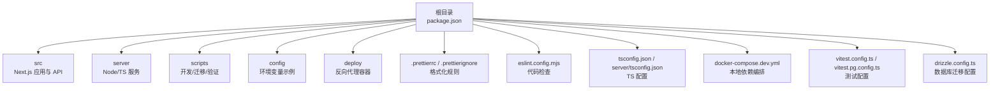
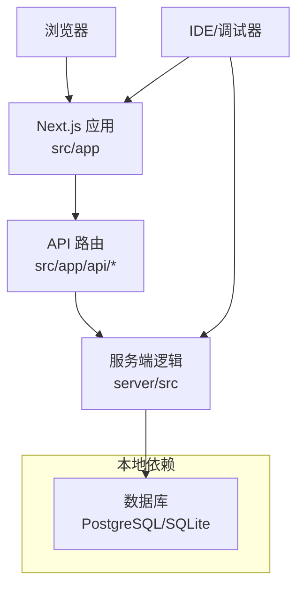
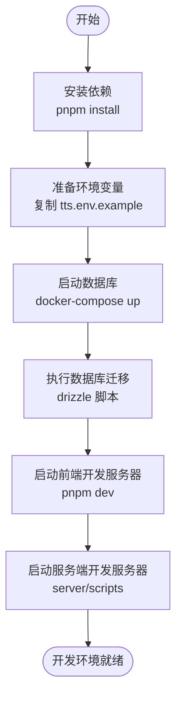
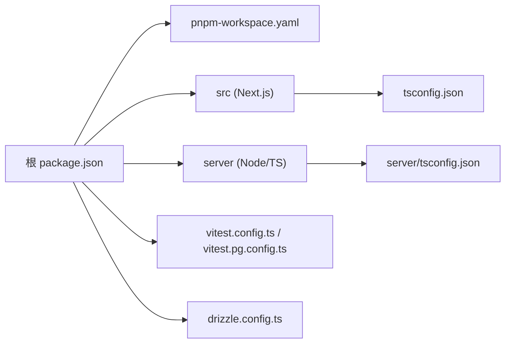

# 开发环境搭建

<cite>
**本文引用的文件**   
- [package.json](file://package.json)
- [pnpm-workspace.yaml](file://pnpm-workspace.yaml)
- [.prettierrc](file://.prettierrc)
- [.prettierignore](file://.prettierignore)
- [eslint.config.mjs](file://eslint.config.mjs)
- [tsconfig.json](file://tsconfig.json)
- [next.config.ts](file://next.config.ts)
- [vitest.config.ts](file://vitest.config.ts)
- [vitest.pg.config.ts](file://vitest.pg.config.ts)
- [drizzle.config.ts](file://drizzle.config.ts)
- [docker-compose.dev.yml](file://docker-compose.dev.yml)
- [Dockerfile](file://Dockerfile)
- [server/package.json](file://server/package.json)
- [server/tsconfig.json](file://server/tsconfig.json)
- [scripts/setup/README.md](file://scripts/setup/README.md)
- [scripts/dev/README.md](file://scripts/dev/README.md)
- [scripts/dev/start-dev.cmd](file://scripts/dev/start-dev.cmd)
- [scripts/dev/start-dev.ps1](file://scripts/dev/start-dev.ps1)
- [config/tts.env.example](file://config/tts.env.example)
- [deploy/reverse-proxy/Dockerfile](file://deploy/reverse-proxy/Dockerfile)
- [deploy/reverse-proxy/entrypoint.sh](file://deploy/reverse-proxy/entrypoint.sh)
</cite>

## 目录
1. [简介](#简介)
2. [项目结构](#项目结构)
3. [核心组件](#核心组件)
4. [架构总览](#架构总览)
5. [详细组件分析](#详细组件分析)
6. [依赖关系分析](#依赖关系分析)
7. [性能注意事项](#性能注意事项)
8. [故障排查指南](#故障排查指南)
9. [结论](#结论)
10. [附录](#附录)

## 简介
本指南面向首次参与 PurpleInk 开发的工程师，目标是帮助你在 Windows、macOS、Linux 上快速搭建可运行的本地开发环境。内容涵盖：
- Node.js 与 pnpm 的安装与版本要求
- IDE（VS Code）推荐配置与调试设置
- 项目初始化流程（依赖安装、环境变量、数据库初始化）
- 多平台差异与常见问题排查

## 项目结构
PurpleInk 采用 Next.js + TypeScript 的前后端一体化工程，并通过 pnpm workspace 管理前后端子包。关键目录说明：
- src：前端应用与 API 路由（Next.js App Router）
- server：服务端逻辑（Node/TS），包含采集、编排、渲染等能力
- scripts：开发、迁移、验证脚本
- config：示例环境变量模板
- deploy：反向代理容器化部署相关
- .prettierrc/.prettierignore：代码格式化规则与忽略
- eslint.config.mjs：ESLint 规则
- tsconfig.json/server/tsconfig.json：TypeScript 编译配置
- docker-compose.dev.yml：本地开发依赖（如数据库）编排
- vitest.config.ts/vitest.pg.config.ts：单元测试与 PostgreSQL 集成测试配置
- drizzle.config.ts：数据库迁移配置

图表来源
- [package.json:1-200](file://package.json#L1-L200)
- [pnpm-workspace.yaml:1-50](file://pnpm-workspace.yaml#L1-L50)
- [.prettierrc:1-100](file://.prettierrc#L1-L100)
- [.prettierignore:1-100](file://.prettierignore#L1-L100)
- [eslint.config.mjs:1-100](file://eslint.config.mjs#L1-L100)
- [tsconfig.json:1-100](file://tsconfig.json#L1-L100)
- [server/tsconfig.json:1-100](file://server/tsconfig.json#L1-L100)
- [docker-compose.dev.yml:1-100](file://docker-compose.dev.yml#L1-L100)
- [vitest.config.ts:1-100](file://vitest.config.ts#L1-L100)
- [vitest.pg.config.ts:1-100](file://vitest.pg.config.ts#L1-L100)
- [drizzle.config.ts:1-100](file://drizzle.config.ts#L1-L100)

章节来源
- [package.json:1-200](file://package.json#L1-L200)
- [pnpm-workspace.yaml:1-50](file://pnpm-workspace.yaml#L1-L50)

## 核心组件
- 前端应用（Next.js）：基于 App Router 的页面与 API 路由，位于 src/app
- 服务端（Node/TS）：位于 server/src，提供采集、编排、渲染、TTS 等能力
- 工作区（pnpm workspace）：通过 pnpm-workspace.yaml 统一管理与构建
- 数据库与迁移：Drizzle ORM 配置在 drizzle.config.ts，配合 scripts 中的迁移脚本
- 测试：Vitest 配置在 vitest.config.ts 与 vitest.pg.config.ts
- 代码质量：Prettier 与 ESLint 分别负责格式化与静态检查

章节来源
- [server/package.json:1-200](file://server/package.json#L1-L200)
- [drizzle.config.ts:1-100](file://drizzle.config.ts#L1-L100)
- [vitest.config.ts:1-100](file://vitest.config.ts#L1-L100)
- [vitest.pg.config.ts:1-100](file://vitest.pg.config.ts#L1-L100)

## 架构总览
下图展示了本地开发环境的整体交互：浏览器访问 Next.js 应用，API 路由调用服务端逻辑，必要时与数据库交互；开发时可通过 Docker Compose 启动数据库等依赖。

图表来源
- [next.config.ts:1-100](file://next.config.ts#L1-L100)
- [server/package.json:1-200](file://server/package.json#L1-L200)
- [docker-compose.dev.yml:1-100](file://docker-compose.dev.yml#L1-L100)

## 详细组件分析

### Node.js 与 pnpm 安装与版本要求
- Node.js：建议使用 LTS 版本（参考 package.json 中 engines 字段或 CI 配置）。确保 npm 全局命令可用。
- pnpm：推荐使用最新稳定版，以支持 workspace 与缓存加速。
- 验证方式：
  - node -v
  - pnpm -v

章节来源
- [package.json:1-200](file://package.json#L1-L200)

### IDE 推荐配置（VS Code）
- 扩展建议：
  - TypeScript/JavaScript IntelliSense
  - Prettier（启用保存时格式化）
  - ESLint（启用保存时修复）
  - Tailwind CSS（若使用）
  - Docker（用于运行 compose 与镜像）
- 格式化与检查：
  - Prettier 规则由 .prettierrc 定义，忽略列表在 .prettierignore
  - ESLint 规则在 eslint.config.mjs
- 调试配置：
  - 前端：使用 VS Code 内置 Chrome/Edge 调试器，指向 Next.js 开发服务器
  - 服务端：使用 Node 调试器，指向 server 入口脚本（参考 server/package.json 的 scripts）

章节来源
- [.prettierrc:1-100](file://.prettierrc#L1-L100)
- [.prettierignore:1-100](file://.prettierignore#L1-L100)
- [eslint.config.mjs:1-100](file://eslint.config.mjs#L1-L100)
- [server/package.json:1-200](file://server/package.json#L1-L200)

### 项目初始化流程
- 克隆仓库后，进入项目根目录
- 安装依赖：pnpm install（workspace 会同时安装 server 子包依赖）
- 环境变量：复制 config/tts.env.example 到 .env（或按需创建 .env.local），按注释填写必要项
- 数据库初始化：
  - 使用 docker-compose.dev.yml 启动数据库
  - 执行 Drizzle 迁移（参考 drizzle.config.ts 与 scripts 中的迁移脚本）
- 启动开发服务器：
  - 前端：pnpm dev（Next.js）
  - 服务端：根据 server/package.json 的 scripts 启动（例如 pnpm --filter server dev）

图表来源
- [scripts/setup/README.md:1-200](file://scripts/setup/README.md#L1-L200)
- [scripts/dev/README.md:1-200](file://scripts/dev/README.md#L1-L200)
- [config/tts.env.example:1-200](file://config/tts.env.example#L1-L200)
- [docker-compose.dev.yml:1-100](file://docker-compose.dev.yml#L1-L100)
- [drizzle.config.ts:1-100](file://drizzle.config.ts#L1-L100)

章节来源
- [scripts/setup/README.md:1-200](file://scripts/setup/README.md#L1-L200)
- [scripts/dev/README.md:1-200](file://scripts/dev/README.md#L1-L200)
- [config/tts.env.example:1-200](file://config/tts.env.example#L1-L200)

### 多平台特定配置
- Windows：
  - 可使用 scripts/dev/start-dev.cmd 或 start-dev.ps1 一键启动开发环境
  - 注意路径分隔符与权限问题，建议在 Git Bash 或 PowerShell 中运行
- macOS/Linux：
  - 直接使用 pnpm 与 docker-compose 命令
  - 如需跨进程调试，确保端口未被占用

章节来源
- [scripts/dev/start-dev.cmd:1-200](file://scripts/dev/start-dev.cmd#L1-L200)
- [scripts/dev/start-dev.ps1:1-200](file://scripts/dev/start-dev.ps1#L1-L200)

### 反向代理与容器化（可选）
- deploy/reverse-proxy 提供反向代理容器化方案，便于本地模拟生产环境
- Dockerfile 与 entrypoint.sh 定义了容器行为与启动参数

章节来源
- [deploy/reverse-proxy/Dockerfile:1-200](file://deploy/reverse-proxy/Dockerfile#L1-L200)
- [deploy/reverse-proxy/entrypoint.sh:1-200](file://deploy/reverse-proxy/entrypoint.sh#L1-L200)

## 依赖关系分析
- 根 package.json 声明了 workspace 与常用脚本
- server/package.json 声明了服务端依赖与脚本
- tsconfig.json 与 server/tsconfig.json 分别配置前后端 TS 编译选项
- vitest.config.ts 与 vitest.pg.config.ts 区分普通测试与需要 PostgreSQL 的测试
- drizzle.config.ts 指定数据库连接与迁移策略

图表来源
- [package.json:1-200](file://package.json#L1-L200)
- [pnpm-workspace.yaml:1-50](file://pnpm-workspace.yaml#L1-L50)
- [server/package.json:1-200](file://server/package.json#L1-L200)
- [tsconfig.json:1-100](file://tsconfig.json#L1-L100)
- [server/tsconfig.json:1-100](file://server/tsconfig.json#L1-L100)
- [vitest.config.ts:1-100](file://vitest.config.ts#L1-L100)
- [vitest.pg.config.ts:1-100](file://vitest.pg.config.ts#L1-L100)
- [drizzle.config.ts:1-100](file://drizzle.config.ts#L1-L100)

章节来源
- [package.json:1-200](file://package.json#L1-L200)
- [server/package.json:1-200](file://server/package.json#L1-L200)

## 性能注意事项
- 使用 pnpm 的缓存与硬链接机制提升安装速度
- 开发时仅启动必要的依赖（如数据库），避免不必要的容器
- 合理划分测试范围，优先运行受影响模块的单测
- 对大文件或频繁变更的文件，考虑排除 lint/format 扫描以提升体验

[本节为通用指导，不直接分析具体文件]

## 故障排查指南
- 依赖安装失败：
  - 确认 Node.js 版本满足要求
  - 清理 pnpm 缓存后重试
- 环境变量未生效：
  - 检查 .env 或 .env.local 是否被正确加载
  - 确认 tts.env.example 的必要字段已填写
- 数据库连接失败：
  - 使用 docker-compose.dev.yml 检查服务状态
  - 核对 drizzle.config.ts 的连接信息
- 端口冲突：
  - 修改 Next.js 或后端服务的端口配置
- 调试无断点：
  - 确认 VS Code 调试配置指向正确的入口与 sourcemaps

章节来源
- [scripts/setup/README.md:1-200](file://scripts/setup/README.md#L1-L200)
- [scripts/dev/README.md:1-200](file://scripts/dev/README.md#L1-L200)
- [config/tts.env.example:1-200](file://config/tts.env.example#L1-L200)
- [docker-compose.dev.yml:1-100](file://docker-compose.dev.yml#L1-L100)
- [drizzle.config.ts:1-100](file://drizzle.config.ts#L1-L100)

## 结论
通过以上步骤，你可以在不同平台上快速搭建 PurpleInk 的开发环境。建议初次搭建时严格遵循环境变量与数据库初始化流程，并在 IDE 中启用 Prettier 与 ESLint，以获得一致的代码风格与更好的开发体验。遇到问题时，优先检查依赖版本、环境变量与数据库连通性。

[本节为总结，不直接分析具体文件]

## 附录
- 常用命令参考：
  - 安装依赖：pnpm install
  - 启动前端：pnpm dev
  - 启动服务端：根据 server/package.json 的 scripts 执行
  - 数据库迁移：参考 drizzle.config.ts 与 scripts 中的迁移脚本
  - 运行测试：参考 vitest.config.ts 与 vitest.pg.config.ts

章节来源
- [server/package.json:1-200](file://server/package.json#L1-L200)
- [vitest.config.ts:1-100](file://vitest.config.ts#L1-L100)
- [vitest.pg.config.ts:1-100](file://vitest.pg.config.ts#L1-L100)
- [drizzle.config.ts:1-100](file://drizzle.config.ts#L1-L100)