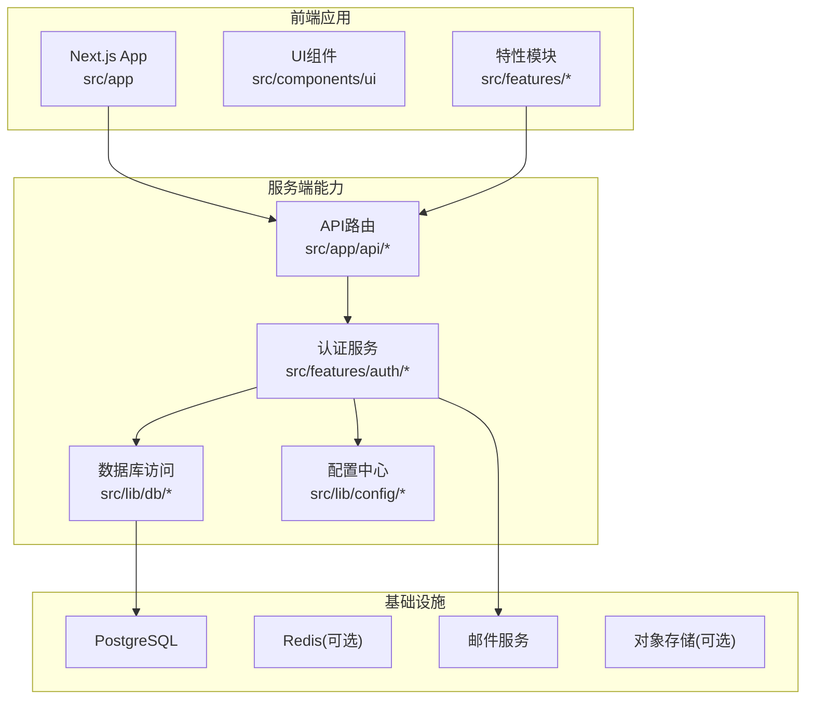
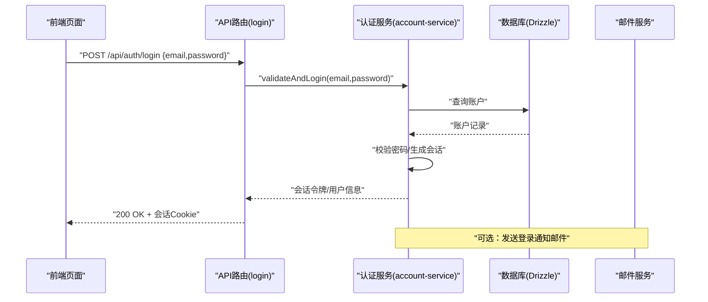
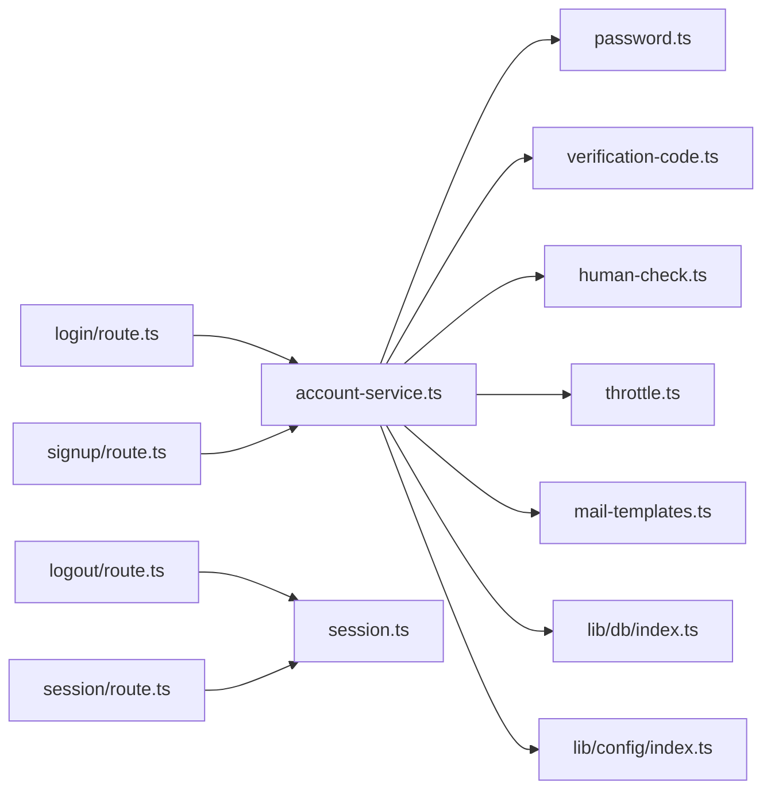
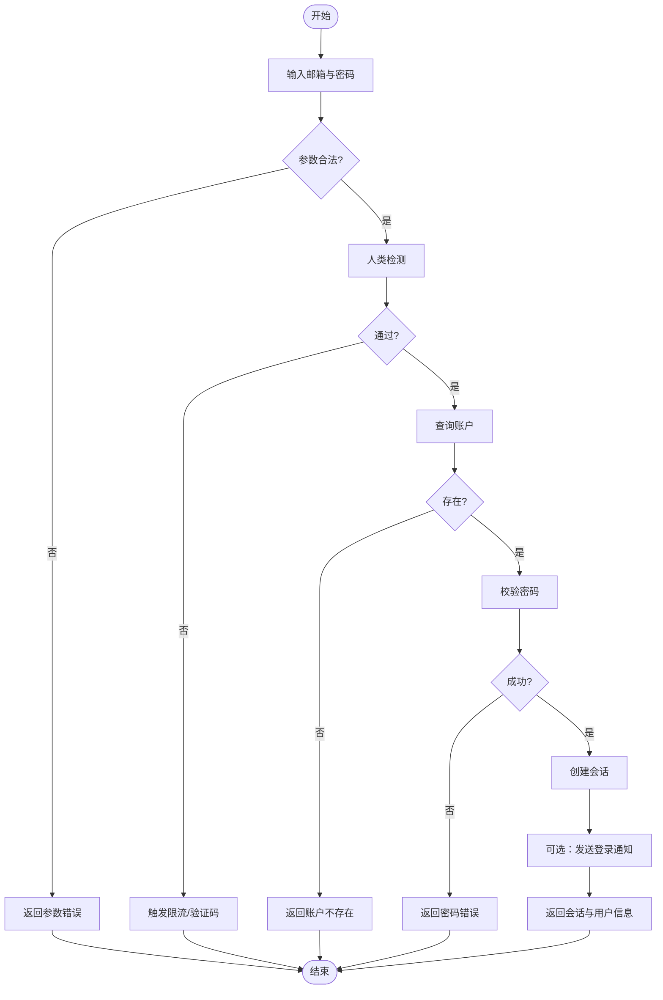

# 新功能开发流程

<cite>
**本文引用的文件**   
- [PLAN-002-auth-system.md](file://docs/plans/PLAN-002-auth-system.md)
- [auth-flow-smoke.txt](file://docs/issues/evidence/auth/auth-flow-smoke.txt)
- [README.md](file://docs/issues/evidence/auth/README.md)
- [package.json](file://package.json)
- [vitest.config.ts](file://vitest.config.ts)
- [vitest.pg.config.ts](file://vitest.pg.config.ts)
- [docker-compose.dev.yml](file://docker-compose.dev.yml)
- [docker-compose.prod.yml](file://docker-compose.prod.yml)
- [Dockerfile](file://Dockerfile)
- [next.config.ts](file://next.config.ts)
- [drizzle.config.ts](file://drizzle.config.ts)
- [server/Dockerfile](file://server/Dockerfile)
- [deploy/reverse-proxy/Dockerfile](file://deploy/reverse-proxy/Dockerfile)
- [scripts/setup/db-migrate.ts](file://scripts/setup/db-migrate.ts)
- [scripts/setup/bootstrap-credentials.ts](file://scripts/setup/bootstrap-credentials.ts)
- [scripts/verify/auth-flow-smoke.mjs](file://scripts/verify/auth-flow-smoke.mjs)
- [src/app/api/auth/login/route.ts](file://src/app/api/auth/login/route.ts)
- [src/app/api/auth/signup/route.ts](file://src/app/api/auth/signup/route.ts)
- [src/app/api/auth/logout/route.ts](file://src/app/api/auth/logout/route.ts)
- [src/app/api/auth/session/route.ts](file://src/app/api/auth/session/route.ts)
- [src/features/auth/index.ts](file://src/features/auth/index.ts)
- [src/features/auth/account-service.ts](file://src/features/auth/account-service.ts)
- [src/features/auth/session.ts](file://src/features/auth/session.ts)
- [src/features/auth/schemas.ts](file://src/features/auth/schemas.ts)
- [src/features/auth/mail-templates.ts](file://src/features/auth/mail-templates.ts)
- [src/features/auth/human-check.ts](file://src/features/auth/human-check.ts)
- [src/features/auth/password.ts](file://src/features/auth/password.ts)
- [src/features/auth/verification-code.ts](file://src/features/auth/verification-code.ts)
- [src/features/auth/throttle.ts](file://src/features/auth/throttle.ts)
- [src/lib/db/index.ts](file://src/lib/db/index.ts)
- [src/lib/config/index.ts](file://src/lib/config/index.ts)
</cite>

## 目录
1. [引言](#引言)
2. [项目结构](#项目结构)
3. [核心组件](#核心组件)
4. [架构总览](#架构总览)
5. [详细组件分析](#详细组件分析)
6. [依赖分析](#依赖分析)
7. [性能考虑](#性能考虑)
8. [故障排查指南](#故障排查指南)
9. [结论](#结论)
10. [附录](#附录)

## 引言
本文件面向PurpleInk项目的开发者与产品、测试、运维人员，提供“新功能开发流程”的完整实践指南。以认证系统为例，覆盖从需求分析、方案设计、API设计、编码实现、测试验证、代码审查、合并到上线部署的全链路流程，并给出常见问题与最佳实践建议。目标是让不同背景的参与者都能按统一标准高效协作，确保质量与可维护性。

## 项目结构
PurpleInk采用前后端一体化Next.js工程，结合Drizzle ORM进行数据访问，使用Vitest进行单元测试与集成测试，通过Docker与Compose编排本地与生产环境。认证功能位于前端路由与API路由中，业务逻辑集中在features/auth模块，数据库迁移与初始化脚本位于scripts/setup。

图表来源
- [next.config.ts](file://next.config.ts)
- [package.json](file://package.json)
- [drizzle.config.ts](file://drizzle.config.ts)
- [docker-compose.dev.yml](file://docker-compose.dev.yml)
- [docker-compose.prod.yml](file://docker-compose.prod.yml)

章节来源
- [package.json](file://package.json)
- [next.config.ts](file://next.config.ts)
- [drizzle.config.ts](file://drizzle.config.ts)
- [docker-compose.dev.yml](file://docker-compose.dev.yml)
- [docker-compose.prod.yml](file://docker-compose.prod.yml)

## 核心组件
- 认证API路由：登录、注册、登出、会话校验等REST接口，负责请求解析、参数校验、鉴权上下文构建与响应返回。
- 认证服务层：账户管理、密码处理、验证码、人类检测、限流、邮件模板等核心能力。
- 数据访问层：基于Drizzle的账户、会话、验证码等表操作。
- 配置与环境：环境变量加载、密钥管理、第三方服务凭据。
- 测试体系：单元、集成、端到端与冒烟脚本。

章节来源
- [src/app/api/auth/login/route.ts](file://src/app/api/auth/login/route.ts)
- [src/app/api/auth/signup/route.ts](file://src/app/api/auth/signup/route.ts)
- [src/app/api/auth/logout/route.ts](file://src/app/api/auth/logout/route.ts)
- [src/app/api/auth/session/route.ts](file://src/app/api/auth/session/route.ts)
- [src/features/auth/index.ts](file://src/features/auth/index.ts)
- [src/features/auth/account-service.ts](file://src/features/auth/account-service.ts)
- [src/features/auth/session.ts](file://src/features/auth/session.ts)
- [src/features/auth/schemas.ts](file://src/features/auth/schemas.ts)
- [src/features/auth/mail-templates.ts](file://src/features/auth/mail-templates.ts)
- [src/features/auth/human-check.ts](file://src/features/auth/human-check.ts)
- [src/features/auth/password.ts](file://src/features/auth/password.ts)
- [src/features/auth/verification-code.ts](file://src/features/auth/verification-code.ts)
- [src/features/auth/throttle.ts](file://src/features/auth/throttle.ts)
- [src/lib/db/index.ts](file://src/lib/db/index.ts)
- [src/lib/config/index.ts](file://src/lib/config/index.ts)

## 架构总览
认证子系统遵循分层架构：API路由层仅做协议适配与校验；服务层承载业务规则；数据访问层封装持久化；配置与环境提供外部依赖注入。所有对外交互均通过明确的契约（schemas）与错误码定义，保证前后端一致性与可测试性。

图表来源
- [src/app/api/auth/login/route.ts](file://src/app/api/auth/login/route.ts)
- [src/features/auth/account-service.ts](file://src/features/auth/account-service.ts)
- [src/lib/db/index.ts](file://src/lib/db/index.ts)

## 详细组件分析

### 需求分析与设计阶段
- 需求文档：明确角色、权限、安全策略、用户体验目标与合规要求。
- 技术方案：选择会话机制（如JWT或HttpOnly Cookie）、密码哈希算法、验证码策略、限流与防刷、审计日志。
- API设计：定义清晰的请求/响应结构、状态码、错误语义与版本策略。
- 数据模型：账户、会话、验证码、审计事件等实体与关系。
- 非功能指标：可用性、性能、可扩展性、可观测性、容错与回滚策略。

章节来源
- [PLAN-002-auth-system.md](file://docs/plans/PLAN-002-auth-system.md)

### 编码实现流程
- 模块设计：将认证能力拆分为账户、会话、验证码、人类检测、限流、邮件模板等子模块，职责单一、边界清晰。
- 接口定义：使用schema约束输入输出，确保类型安全与一致性。
- 核心逻辑：密码校验、会话创建与刷新、验证码生成与校验、限流计数与冷却、邮件发送与失败重试。
- 错误处理：统一错误分类与消息，便于前端提示与监控告警。
- 可测试性：为每个关键路径编写单测与集成测试，覆盖正常与异常分支。

章节来源
- [src/features/auth/schemas.ts](file://src/features/auth/schemas.ts)
- [src/features/auth/account-service.ts](file://src/features/auth/account-service.ts)
- [src/features/auth/session.ts](file://src/features/auth/session.ts)
- [src/features/auth/password.ts](file://src/features/auth/password.ts)
- [src/features/auth/verification-code.ts](file://src/features/auth/verification-code.ts)
- [src/features/auth/human-check.ts](file://src/features/auth/human-check.ts)
- [src/features/auth/throttle.ts](file://src/features/auth/throttle.ts)
- [src/features/auth/mail-templates.ts](file://src/features/auth/mail-templates.ts)

### 测试验证过程
- 单元测试：针对密码处理、验证码生成、限流计数、人类检测等纯函数或无副作用逻辑。
- 集成测试：连接真实或内存数据库，验证账户CRUD、会话创建、验证码生命周期。
- 端到端测试：模拟浏览器行为，完成注册、登录、验证码校验、会话保持与过期。
- 冒烟脚本：快速验证关键路径可用，用于CI门禁与发布前检查。

章节来源
- [vitest.config.ts](file://vitest.config.ts)
- [vitest.pg.config.ts](file://vitest.pg.config.ts)
- [scripts/verify/auth-flow-smoke.mjs](file://scripts/verify/auth-flow-smoke.mjs)
- [auth-flow-smoke.txt](file://docs/issues/evidence/auth/auth-flow-smoke.txt)

### 代码审查与合并流程
- 审查要点：安全性（密码、会话、输入校验）、性能（缓存、限流）、可维护性（模块化、注释）、可测试性（覆盖率）。
- 自动化检查：ESLint、Prettier、类型检查、单元测试、集成测试、冒烟脚本。
- 合并策略：小步提交、PR描述清晰、关联需求与问题、至少一名Reviewer批准。

章节来源
- [package.json](file://package.json)
- [vitest.config.ts](file://vitest.config.ts)
- [vitest.pg.config.ts](file://vitest.pg.config.ts)

### 功能上线与部署步骤
- 环境准备：PostgreSQL、Redis（可选）、邮件服务、对象存储（可选），通过Compose拉起。
- 数据库迁移：执行迁移脚本，确保表结构与初始数据正确。
- 构建与镜像：构建Next.js应用与服务端镜像，推送至镜像仓库。
- 部署发布：更新反向代理配置、滚动更新服务实例、健康检查与回滚预案。
- 验证观察：冒烟脚本、日志与指标、错误率与延迟监控。

章节来源
- [docker-compose.dev.yml](file://docker-compose.dev.yml)
- [docker-compose.prod.yml](file://docker-compose.prod.yml)
- [Dockerfile](file://Dockerfile)
- [server/Dockerfile](file://server/Dockerfile)
- [deploy/reverse-proxy/Dockerfile](file://deploy/reverse-proxy/Dockerfile)
- [scripts/setup/db-migrate.ts](file://scripts/setup/db-migrate.ts)
- [scripts/setup/bootstrap-credentials.ts](file://scripts/setup/bootstrap-credentials.ts)

## 依赖分析
认证子系统依赖数据库、配置、邮件服务与可选缓存。各模块间耦合度低，通过接口与schema解耦，便于替换实现与扩展能力。

图表来源
- [src/app/api/auth/login/route.ts](file://src/app/api/auth/login/route.ts)
- [src/app/api/auth/signup/route.ts](file://src/app/api/auth/signup/route.ts)
- [src/app/api/auth/logout/route.ts](file://src/app/api/auth/logout/route.ts)
- [src/app/api/auth/session/route.ts](file://src/app/api/auth/session/route.ts)
- [src/features/auth/account-service.ts](file://src/features/auth/account-service.ts)
- [src/features/auth/session.ts](file://src/features/auth/session.ts)
- [src/features/auth/password.ts](file://src/features/auth/password.ts)
- [src/features/auth/verification-code.ts](file://src/features/auth/verification-code.ts)
- [src/features/auth/human-check.ts](file://src/features/auth/human-check.ts)
- [src/features/auth/throttle.ts](file://src/features/auth/throttle.ts)
- [src/features/auth/mail-templates.ts](file://src/features/auth/mail-templates.ts)
- [src/lib/db/index.ts](file://src/lib/db/index.ts)
- [src/lib/config/index.ts](file://src/lib/config/index.ts)

章节来源
- [src/app/api/auth/login/route.ts](file://src/app/api/auth/login/route.ts)
- [src/app/api/auth/signup/route.ts](file://src/app/api/auth/signup/route.ts)
- [src/app/api/auth/logout/route.ts](file://src/app/api/auth/logout/route.ts)
- [src/app/api/auth/session/route.ts](file://src/app/api/auth/session/route.ts)
- [src/features/auth/account-service.ts](file://src/features/auth/account-service.ts)
- [src/features/auth/session.ts](file://src/features/auth/session.ts)
- [src/features/auth/password.ts](file://src/features/auth/password.ts)
- [src/features/auth/verification-code.ts](file://src/features/auth/verification-code.ts)
- [src/features/auth/human-check.ts](file://src/features/auth/human-check.ts)
- [src/features/auth/throttle.ts](file://src/features/auth/throttle.ts)
- [src/features/auth/mail-templates.ts](file://src/features/auth/mail-templates.ts)
- [src/lib/db/index.ts](file://src/lib/db/index.ts)
- [src/lib/config/index.ts](file://src/lib/config/index.ts)

## 性能考虑
- 会话优化：使用短效Token+刷新机制，减少敏感数据暴露面。
- 密码处理：合理选择哈希算法与迭代次数，平衡安全与性能。
- 验证码与限流：引入滑动窗口与令牌桶，避免暴力破解与资源耗尽。
- 缓存策略：对热点数据（如人类检测结果、限流计数）使用内存缓存。
- 数据库索引：为常用查询字段建立索引，提升账户与验证码检索效率。
- 并发控制：队列化邮件发送与异步任务，降低主线程阻塞。

[本节为通用指导，不直接分析具体文件]

## 故障排查指南
- 登录失败：检查邮箱与密码格式、账户是否存在、密码哈希是否匹配、会话是否过期。
- 验证码问题：确认有效期、频率限制、短信/邮件通道是否正常。
- 会话丢失：检查Cookie属性（Secure/SameSite）、跨域设置、代理转发。
- 限流触发：查看限流计数器与冷却时间，调整阈值或扩容。
- 邮件失败：核对SMTP配置、证书与网络连通性，启用重试与告警。

章节来源
- [src/features/auth/password.ts](file://src/features/auth/password.ts)
- [src/features/auth/verification-code.ts](file://src/features/auth/verification-code.ts)
- [src/features/auth/session.ts](file://src/features/auth/session.ts)
- [src/features/auth/throttle.ts](file://src/features/auth/throttle.ts)
- [src/features/auth/mail-templates.ts](file://src/features/auth/mail-templates.ts)

## 结论
通过规范化的需求分析、方案设计与API契约，配合严格的测试与审查流程，以及稳健的部署与监控策略，PurpleInk能够在保证安全与性能的前提下，持续交付高质量的认证功能。建议团队在后续功能开发中沿用此流程，形成统一的工程实践与文化。

[本节为总结，不直接分析具体文件]

## 附录

### 认证系统示例：端到端流程图

图表来源
- [src/app/api/auth/login/route.ts](file://src/app/api/auth/login/route.ts)
- [src/features/auth/account-service.ts](file://src/features/auth/account-service.ts)
- [src/features/auth/human-check.ts](file://src/features/auth/human-check.ts)
- [src/features/auth/password.ts](file://src/features/auth/password.ts)
- [src/features/auth/session.ts](file://src/features/auth/session.ts)
- [src/features/auth/throttle.ts](file://src/features/auth/throttle.ts)
- [src/features/auth/mail-templates.ts](file://src/features/auth/mail-templates.ts)

### 开发与测试命令参考
- 启动本地环境：使用Compose拉起PostgreSQL与依赖服务。
- 运行测试：执行Vitest单测与PG集成测试。
- 冒烟验证：运行认证流程冒烟脚本。
- 数据库迁移：执行迁移与初始化脚本。

章节来源
- [docker-compose.dev.yml](file://docker-compose.dev.yml)
- [vitest.config.ts](file://vitest.config.ts)
- [vitest.pg.config.ts](file://vitest.pg.config.ts)
- [scripts/verify/auth-flow-smoke.mjs](file://scripts/verify/auth-flow-smoke.mjs)
- [scripts/setup/db-migrate.ts](file://scripts/setup/db-migrate.ts)
- [scripts/setup/bootstrap-credentials.ts](file://scripts/setup/bootstrap-credentials.ts)

### 常见问题与最佳实践
- 安全优先：最小权限原则、输入校验、输出过滤、敏感信息脱敏。
- 可观测性：结构化日志、指标采集、错误追踪、告警阈值。
- 可回滚：灰度发布、蓝绿部署、快速回滚预案。
- 文档同步：API变更同步更新契约与示例，保持前后端一致。
- 测试驱动：先写测试再实现，提高覆盖率与稳定性。

[本节为通用指导，不直接分析具体文件]