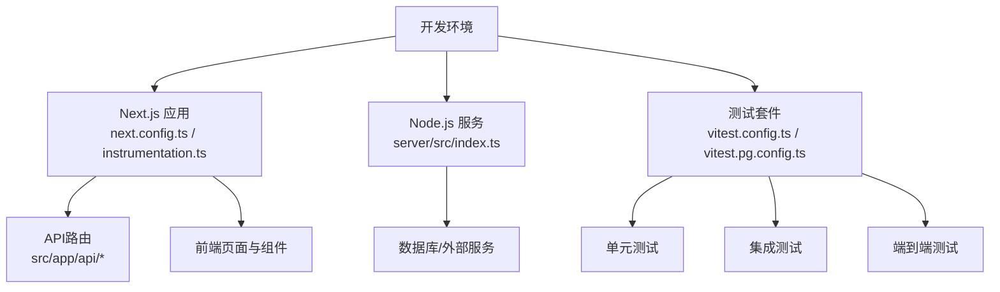
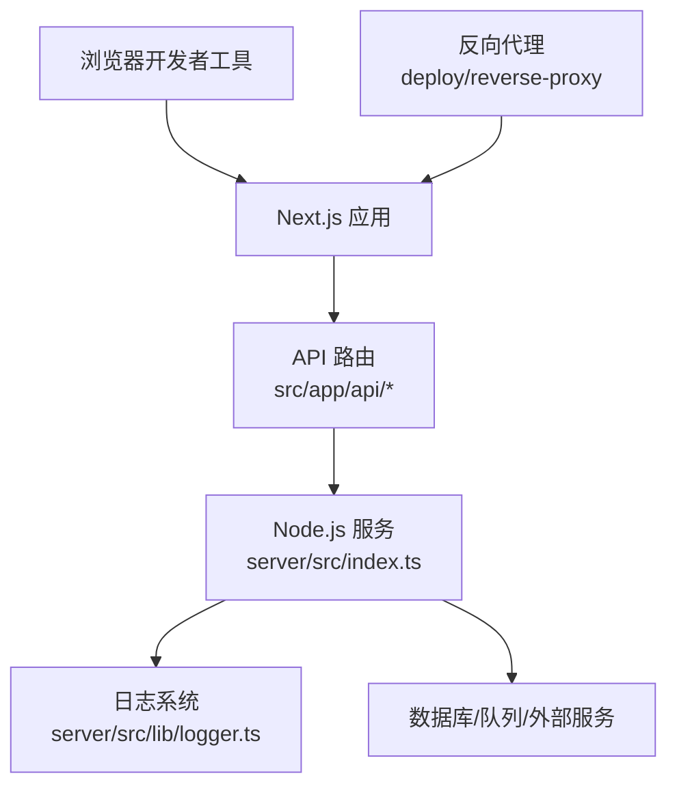
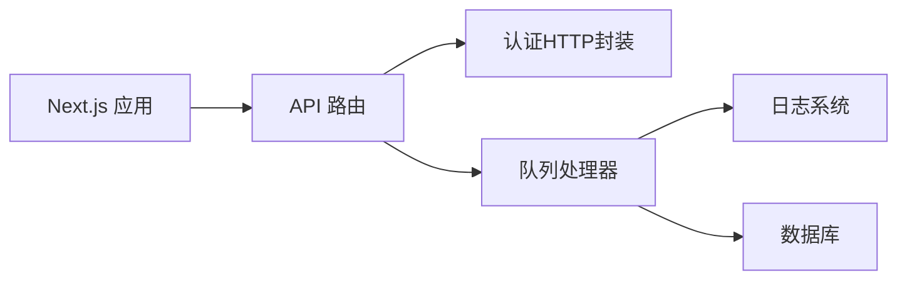

# 调试技巧与工具

<cite>
**本文引用的文件**   
- [package.json](file://package.json)
- [vitest.config.ts](file://vitest.config.ts)
- [vitest.pg.config.ts](file://vitest.pg.config.ts)
- [server/package.json](file://server/package.json)
- [server/src/lib/logger.ts](file://server/src/lib/logger.ts)
- [server/src/index.ts](file://server/src/index.ts)
- [next.config.ts](file://next.config.ts)
- [instrumentation.ts](file://instrumentation.ts)
- [scripts/dev/start-dev.cmd](file://scripts/dev/start-dev.cmd)
- [scripts/dev/start-dev.ps1](file://scripts/dev/start-dev.ps1)
- [docker-compose.dev.yml](file://docker-compose.dev.yml)
- [server/Dockerfile](file://server/Dockerfile)
- [deploy/reverse-proxy/Dockerfile](file://deploy/reverse-proxy/Dockerfile)
- [config/tts.env.example](file://config/tts.env.example)
- [docs/deployment/runbook.md](file://docs/deployment/runbook.md)
- [docs/conventions/workflow-failure-patterns.md](file://docs/conventions/workflow-failure-patterns.md)
- [tests/e2e-smoke.ts](file://tests/e2e-smoke.ts)
- [scripts/verify/e2e-smoke.mjs](file://scripts/verify/e2e-smoke.mjs)
- [src/app/api/ping/route.ts](file://src/app/api/ping/route.ts)
- [src/features/auth/http.ts](file://src/features/auth/http.ts)
- [src/features/director/queue-handler.ts](file://src/features/director/queue-handler.ts)
- [src/features/render/export-queue-handler.ts](file://src/features/render/export-queue-handler.ts)
</cite>

## 目录
1. [简介](#简介)
2. [项目结构](#项目结构)
3. [核心组件](#核心组件)
4. [架构总览](#架构总览)
5. [详细组件分析](#详细组件分析)
6. [依赖关系分析](#依赖关系分析)
7. [性能考虑](#性能考虑)
8. [故障排查指南](#故障排查指南)
9. [结论](#结论)
10. [附录](#附录)

## 简介
本指南面向PurpleInk项目的开发与运维人员，聚焦于调试技巧与工具使用。内容覆盖：
- 浏览器开发者工具的断点、网络与性能分析
- Node.js进程调试、内存分析与日志输出
- 测试框架（单元测试、集成测试、E2E）的调试方法
- 日志系统的配置与分析
- 性能分析与优化建议
- 常见问题定位流程与解决方案

## 项目结构
本项目采用前后端一体化开发模式，前端基于Next.js，后端服务位于server目录，测试脚本集中于scripts与tests目录，容器化部署通过Docker与docker-compose管理。关键调试入口包括：
- 开发启动脚本：scripts/dev/start-dev.*
- Next.js运行时与Instrumentation：next.config.ts、instrumentation.ts
- 服务端入口与日志：server/src/index.ts、server/src/lib/logger.ts
- 测试配置：vitest.config.ts、vitest.pg.config.ts
- 容器与环境：docker-compose.dev.yml、server/Dockerfile、deploy/reverse-proxy/Dockerfile、config/tts.env.example

**图表来源** 
- [next.config.ts](file://next.config.ts)
- [instrumentation.ts](file://instrumentation.ts)
- [server/src/index.ts](file://server/src/index.ts)
- [vitest.config.ts](file://vitest.config.ts)
- [vitest.pg.config.ts](file://vitest.pg.config.ts)

**章节来源**
- [package.json](file://package.json)
- [server/package.json](file://server/package.json)
- [next.config.ts](file://next.config.ts)
- [instrumentation.ts](file://instrumentation.ts)
- [server/src/index.ts](file://server/src/index.ts)
- [vitest.config.ts](file://vitest.config.ts)
- [vitest.pg.config.ts](file://vitest.pg.config.ts)
- [docker-compose.dev.yml](file://docker-compose.dev.yml)

## 核心组件
- 前端调试入口
  - Next.js配置与Instrumentation用于启用调试钩子与监控指标
- 后端调试入口
  - server/src/index.ts作为服务启动点，配合logger进行结构化日志输出
- 测试框架
  - Vitest配置支持单元与PostgreSQL集成测试
- 开发脚本
  - start-dev.*提供本地多服务一键启动

**章节来源**
- [next.config.ts](file://next.config.ts)
- [instrumentation.ts](file://instrumentation.ts)
- [server/src/index.ts](file://server/src/index.ts)
- [server/src/lib/logger.ts](file://server/src/lib/logger.ts)
- [vitest.config.ts](file://vitest.config.ts)
- [vitest.pg.config.ts](file://vitest.pg.config.ts)
- [scripts/dev/start-dev.cmd](file://scripts/dev/start-dev.cmd)
- [scripts/dev/start-dev.ps1](file://scripts/dev/start-dev.ps1)

## 架构总览
下图展示浏览器、Next.js应用、Node.js服务、数据库与反向代理之间的交互关系，便于理解请求链路和调试切入点。

**图表来源** 
- [src/app/api/ping/route.ts](file://src/app/api/ping/route.ts)
- [server/src/index.ts](file://server/src/index.ts)
- [server/src/lib/logger.ts](file://server/src/lib/logger.ts)
- [deploy/reverse-proxy/Dockerfile](file://deploy/reverse-proxy/Dockerfile)

## 详细组件分析

### 浏览器开发者工具调试
- 断点调试
  - 在Sources面板设置断点，结合Network面板观察请求上下文
  - 针对Next.js路由与API接口，优先在对应route.ts中打断点
- 网络请求分析
  - 使用Network面板过滤XHR/Fetch，查看请求头、响应体与错误码
  - 关注认证相关接口（如登录、会话），检查Cookie与Token传递
- 性能监控
  - Performance面板录制关键用户路径，识别长任务与阻塞点
  - Memory面板排查内存泄漏，重点关注事件监听器与缓存对象

实践要点：
- 对认证流程，建议在src/features/auth/http.ts附近设置断点，追踪HTTP封装逻辑
- 对API健康检查，可通过src/app/api/ping/route.ts验证服务连通性

**章节来源**
- [src/app/api/ping/route.ts](file://src/app/api/ping/route.ts)
- [src/features/auth/http.ts](file://src/features/auth/http.ts)

### Node.js调试方法
- 进程调试
  - 使用VS Code或命令行附加调试器到server进程，设置断点并逐步执行
  - 结合环境变量与配置文件，确保调试环境与开发一致
- 内存分析
  - 生成堆快照，比较差异定位内存增长原因
  - 关注长时间运行的队列处理器与缓存策略
- 日志输出
  - 使用server/src/lib/logger.ts进行结构化日志记录，包含时间戳、级别、模块与上下文
  - 在生产环境中调整日志级别，避免过多I/O开销

实践要点：
- 在服务启动时开启调试端口，便于远程调试
- 对队列处理逻辑（如导出、渲染）增加关键节点日志，便于问题定位

**章节来源**
- [server/src/index.ts](file://server/src/index.ts)
- [server/src/lib/logger.ts](file://server/src/lib/logger.ts)

### 测试框架调试
- 单元测试
  - 使用Vitest运行单测，结合--watch模式快速迭代
  - 对异步逻辑使用await与断言库验证状态变化
- 集成测试
  - 使用vitest.pg.config.ts连接PostgreSQL，准备测试数据与清理策略
  - 对数据库操作进行隔离，确保测试稳定性
- E2E测试
  - 通过scripts/verify/e2e-smoke.mjs或tests/e2e-smoke.ts模拟用户流程
  - 结合浏览器自动化与截图对比，验证UI一致性

实践要点：
- 为复杂业务逻辑编写边界用例，覆盖异常路径
- 对并发队列处理，设计幂等性与重试场景

**章节来源**
- [vitest.config.ts](file://vitest.config.ts)
- [vitest.pg.config.ts](file://vitest.pg.config.ts)
- [tests/e2e-smoke.ts](file://tests/e2e-smoke.ts)
- [scripts/verify/e2e-smoke.mjs](file://scripts/verify/e2e-smoke.mjs)

### 日志系统配置与分析
- 配置方式
  - 通过环境变量控制日志级别与输出目标
  - 在server/src/lib/logger.ts中定义格式化规则与传输策略
- 分析方法
  - 按模块与级别筛选日志，定位错误堆栈
  - 关联请求ID与用户会话，追踪完整调用链

实践要点：
- 对关键路径（认证、渲染、导出）增加详细日志
- 生产环境启用异步日志写入，减少同步阻塞

**章节来源**
- [server/src/lib/logger.ts](file://server/src/lib/logger.ts)

### 性能分析与优化建议
- 前端性能
  - 使用Performance面板分析渲染耗时，优化重绘与回流
  - 对大图片与媒体资源进行懒加载与压缩
- 后端性能
  - 对数据库查询添加索引与分页，减少全表扫描
  - 对队列任务进行批处理与限流，避免资源争用
- 缓存策略
  - 合理使用浏览器缓存与服务端缓存，降低重复计算

实践要点：
- 对热点接口进行压测，识别瓶颈点
- 对内存敏感操作进行采样分析，避免泄漏

**章节来源**
- [src/features/director/queue-handler.ts](file://src/features/director/queue-handler.ts)
- [src/features/render/export-queue-handler.ts](file://src/features/render/export-queue-handler.ts)

## 依赖关系分析
下图展示核心模块间的依赖关系，帮助理解调试时的调用链与潜在耦合点。

**图表来源** 
- [src/app/api/ping/route.ts](file://src/app/api/ping/route.ts)
- [src/features/auth/http.ts](file://src/features/auth/http.ts)
- [src/features/director/queue-handler.ts](file://src/features/director/queue-handler.ts)
- [src/features/render/export-queue-handler.ts](file://src/features/render/export-queue-handler.ts)
- [server/src/lib/logger.ts](file://server/src/lib/logger.ts)

**章节来源**
- [src/app/api/ping/route.ts](file://src/app/api/ping/route.ts)
- [src/features/auth/http.ts](file://src/features/auth/http.ts)
- [src/features/director/queue-handler.ts](file://src/features/director/queue-handler.ts)
- [src/features/render/export-queue-handler.ts](file://src/features/render/export-queue-handler.ts)
- [server/src/lib/logger.ts](file://server/src/lib/logger.ts)

## 性能考虑
- 前端优化
  - 代码分割与按需加载，减少首屏体积
  - 使用Web Workers处理重型计算，避免主线程阻塞
- 后端优化
  - 数据库连接池与查询优化，提升吞吐能力
  - 队列任务优先级与超时控制，保障服务稳定性
- 监控告警
  - 集成APM工具，实时监控关键指标
  - 设置阈值告警，及时发现异常

[本节为通用指导，不直接分析具体文件]

## 故障排查指南
- 常见问题
  - 认证失败：检查Cookie与Token传递，确认会话状态
  - 队列堆积：查看任务积压情况，调整并发与重试策略
  - 渲染失败：分析媒体格式与编码参数，验证输入合法性
- 排查流程
  - 复现问题，收集日志与网络请求
  - 逐步缩小范围，定位具体模块
  - 修复后回归测试，确保无副作用

实践要点：
- 对认证流程，重点检查src/features/auth/http.ts中的错误处理
- 对队列任务，关注src/features/director/queue-handler.ts与src/features/render/export-queue-handler.ts的状态机

**章节来源**
- [src/features/auth/http.ts](file://src/features/auth/http.ts)
- [src/features/director/queue-handler.ts](file://src/features/director/queue-handler.ts)
- [src/features/render/export-queue-handler.ts](file://src/features/render/export-queue-handler.ts)

## 结论
通过系统化的调试技巧与工具使用，可显著提升PurpleInk项目的开发与运维效率。建议团队统一调试规范，建立问题知识库，持续优化性能与稳定性。

[本节为总结性内容，不直接分析具体文件]

## 附录
- 开发环境搭建
  - 使用docker-compose.dev.yml启动本地依赖服务
  - 参考scripts/dev/start-dev.*脚本快速启动应用
- 部署与回滚
  - 遵循docs/deployment/runbook.md的操作流程
  - 利用容器镜像版本管理，实现平滑升级
- 故障模式参考
  - 查阅docs/conventions/workflow-failure-patterns.md了解常见失败模式

**章节来源**
- [docker-compose.dev.yml](file://docker-compose.dev.yml)
- [scripts/dev/start-dev.cmd](file://scripts/dev/start-dev.cmd)
- [scripts/dev/start-dev.ps1](file://scripts/dev/start-dev.ps1)
- [docs/deployment/runbook.md](file://docs/deployment/runbook.md)
- [docs/conventions/workflow-failure-patterns.md](file://docs/conventions/workflow-failure-patterns.md)