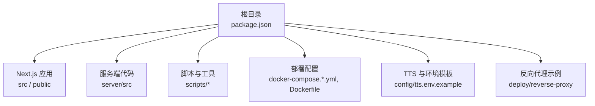
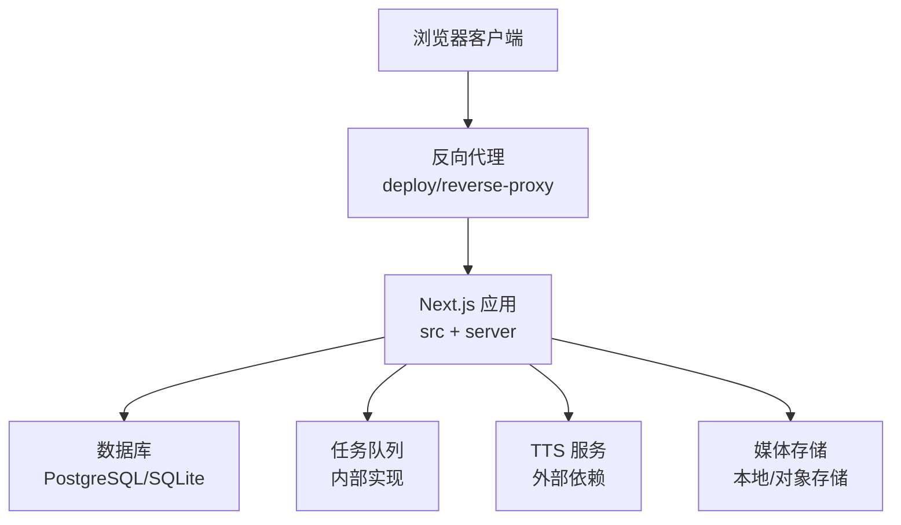
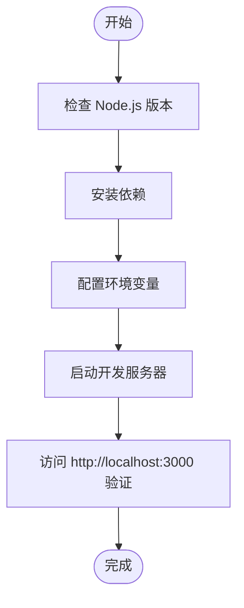
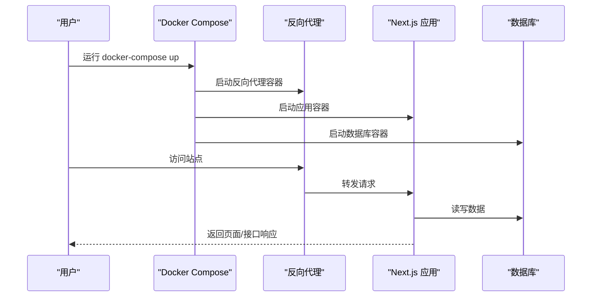
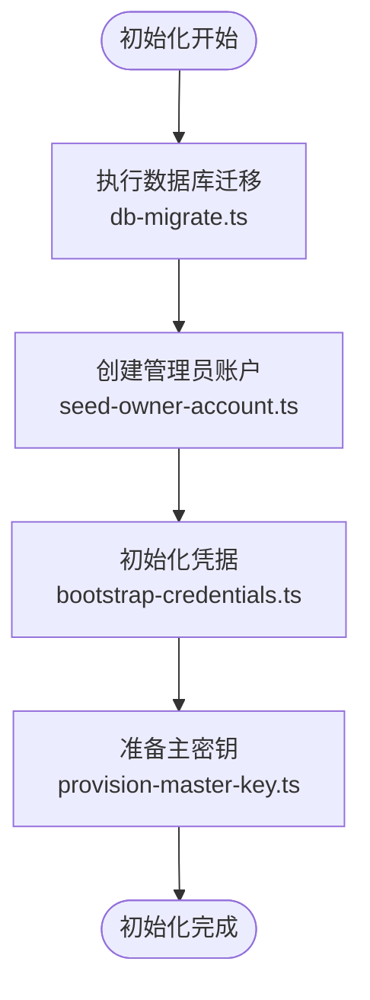
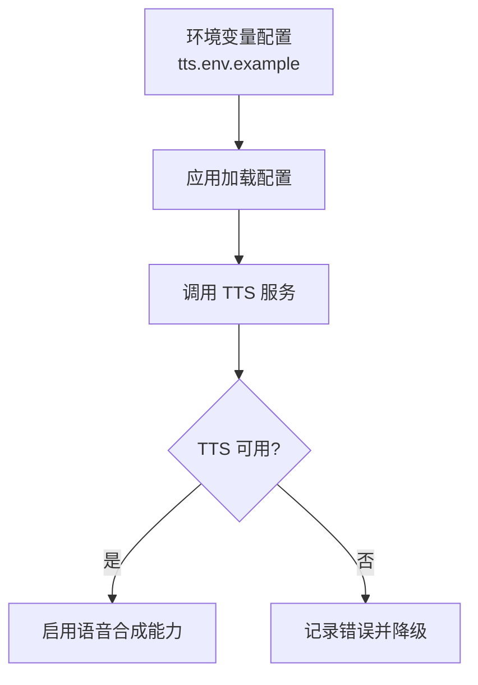
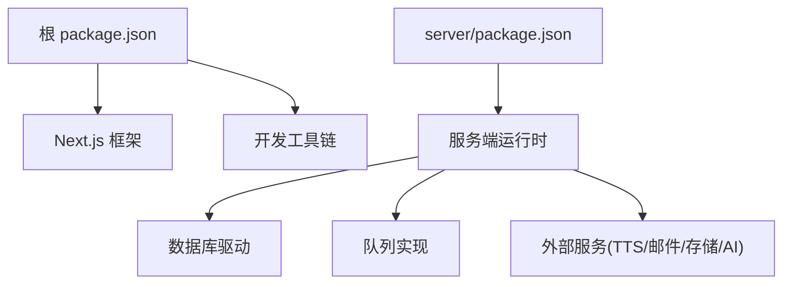

# 快速开始

<cite>
**本文引用的文件**   
- [package.json](file://package.json)
- [Dockerfile](file://Dockerfile)
- [docker-compose.dev.yml](file://docker-compose.dev.yml)
- [docker-compose.prod.yml](file://docker-compose.prod.yml)
- [drizzle.config.ts](file://drizzle.config.ts)
- [next.config.ts](file://next.config.ts)
- [config/tts.env.example](file://config/tts.env.example)
- [deploy/reverse-proxy/Dockerfile](file://deploy/reverse-proxy/Dockerfile)
- [deploy/reverse-proxy/entrypoint.sh](file://deploy/reverse-proxy/entrypoint.sh)
- [scripts/setup/db-migrate.ts](file://scripts/setup/db-migrate.ts)
- [scripts/setup/seed-owner-account.ts](file://scripts/setup/seed-owner-account.ts)
- [scripts/setup/bootstrap-credentials.ts](file://scripts/setup/bootstrap-credentials.ts)
- [scripts/migration/provision-master-key.ts](file://scripts/migration/provision-master-key.ts)
- [server/package.json](file://server/package.json)
- [server/src/index.ts](file://server/src/index.ts)
</cite>

## 目录
1. [简介](#简介)
2. [项目结构](#项目结构)
3. [核心组件](#核心组件)
4. [架构总览](#架构总览)
5. [详细组件分析](#详细组件分析)
6. [依赖分析](#依赖分析)
7. [性能注意事项](#性能注意事项)
8. [故障排查指南](#故障排查指南)
9. [结论](#结论)
10. [附录](#附录)

## 简介
本指南面向首次接触 PurpleInk 的开发者与运维人员，目标是在 30 分钟内完成本地开发环境搭建、Docker 部署、TTS 等外部依赖配置，并完成数据库初始化与管理员账户创建，最终成功访问基本功能。内容覆盖 Node.js 版本要求、依赖安装、环境变量配置、Docker Compose 常用命令、常见环境问题排查与解决方案。

## 项目结构
PurpleInk 采用前后端同仓（Monorepo）结构：
- 前端与 Next.js 应用位于根目录 src 与 public
- 服务端逻辑位于 server 子目录
- 脚本与工具集中在 scripts 目录，包含初始化、迁移、验证等
- 部署相关配置在 docker-compose.*.yml 与 Dockerfile
- TTS 与环境变量模板在 config 目录
- 反向代理示例在 deploy/reverse-proxy

**图表来源** 
- [package.json:1-200](file://package.json#L1-L200)
- [Dockerfile:1-200](file://Dockerfile#L1-L200)
- [docker-compose.dev.yml:1-200](file://docker-compose.dev.yml#L1-L200)
- [docker-compose.prod.yml:1-200](file://docker-compose.prod.yml#L1-L200)
- [config/tts.env.example:1-200](file://config/tts.env.example#L1-L200)
- [deploy/reverse-proxy/Dockerfile:1-200](file://deploy/reverse-proxy/Dockerfile#L1-L200)
- [deploy/reverse-proxy/entrypoint.sh:1-200](file://deploy/reverse-proxy/entrypoint.sh#L1-L200)

**章节来源**
- [package.json:1-200](file://package.json#L1-L200)
- [Dockerfile:1-200](file://Dockerfile#L1-L200)
- [docker-compose.dev.yml:1-200](file://docker-compose.dev.yml#L1-L200)
- [docker-compose.prod.yml:1-200](file://docker-compose.prod.yml#L1-L200)
- [config/tts.env.example:1-200](file://config/tts.env.example#L1-L200)
- [deploy/reverse-proxy/Dockerfile:1-200](file://deploy/reverse-proxy/Dockerfile#L1-L200)
- [deploy/reverse-proxy/entrypoint.sh:1-200](file://deploy/reverse-proxy/entrypoint.sh#L1-L200)

## 核心组件
- 应用入口与运行时
  - Next.js 应用通过根级 package.json 管理依赖与脚本
  - 服务端入口位于 server/src/index.ts
- 数据库与迁移
  - 使用 Drizzle ORM，配置文件 drizzle.config.ts
  - 迁移脚本 scripts/setup/db-migrate.ts
- 初始化与种子数据
  - 管理员账户种子脚本 scripts/setup/seed-owner-account.ts
  - 凭据引导脚本 scripts/setup/bootstrap-credentials.ts
  - 主密钥准备脚本 scripts/migration/provision-master-key.ts
- 部署与容器化
  - 根级 Dockerfile 构建镜像
  - docker-compose.dev.yml 与 docker-compose.prod.yml 编排服务
  - 反向代理示例 deploy/reverse-proxy

**章节来源**
- [package.json:1-200](file://package.json#L1-L200)
- [server/src/index.ts:1-200](file://server/src/index.ts#L1-L200)
- [drizzle.config.ts:1-200](file://drizzle.config.ts#L1-L200)
- [scripts/setup/db-migrate.ts:1-200](file://scripts/setup/db-migrate.ts#L1-L200)
- [scripts/setup/seed-owner-account.ts:1-200](file://scripts/setup/seed-owner-account.ts#L1-L200)
- [scripts/setup/bootstrap-credentials.ts:1-200](file://scripts/setup/bootstrap-credentials.ts#L1-L200)
- [scripts/migration/provision-master-key.ts:1-200](file://scripts/migration/provision-master-key.ts#L1-L200)
- [Dockerfile:1-200](file://Dockerfile#L1-L200)
- [docker-compose.dev.yml:1-200](file://docker-compose.dev.yml#L1-L200)
- [docker-compose.prod.yml:1-200](file://docker-compose.prod.yml#L1-L200)

## 架构总览
下图展示了本地开发与生产部署的核心组件交互关系：客户端浏览器通过反向代理或直连访问 Next.js 应用；后端服务负责业务逻辑与队列处理；数据库持久化存储；TTS 作为可选外部能力通过环境变量接入。

**图表来源** 
- [docker-compose.dev.yml:1-200](file://docker-compose.dev.yml#L1-L200)
- [docker-compose.prod.yml:1-200](file://docker-compose.prod.yml#L1-L200)
- [deploy/reverse-proxy/Dockerfile:1-200](file://deploy/reverse-proxy/Dockerfile#L1-L200)
- [deploy/reverse-proxy/entrypoint.sh:1-200](file://deploy/reverse-proxy/entrypoint.sh#L1-L200)
- [server/src/index.ts:1-200](file://server/src/index.ts#L1-L200)

## 详细组件分析

### 开发环境搭建（Node.js 与依赖）
- Node.js 版本要求
  - 请根据 package.json 中的引擎约束选择对应版本（建议使用 LTS）
- 安装依赖
  - 在项目根目录执行包管理器安装命令（pnpm/npm/yarn）
- 启动开发服务器
  - 使用根级 package.json 中定义的脚本启动 Next.js 开发模式
- 环境变量
  - 复制并编辑 .env（如存在），参考 TTS 模板 config/tts.env.example 配置外部依赖

**章节来源**
- [package.json:1-200](file://package.json#L1-L200)
- [config/tts.env.example:1-200](file://config/tts.env.example#L1-L200)

### Docker 快速部署
- 使用 docker-compose 启动
  - 开发环境：docker-compose -f docker-compose.dev.yml up -d
  - 生产环境：docker-compose -f docker-compose.prod.yml up -d
- 常用命令
  - 查看日志：docker-compose logs -f
  - 停止服务：docker-compose down
  - 重建镜像：docker-compose build --no-cache
- 反向代理
  - 可启用 deploy/reverse-proxy 提供基础认证与路由转发

**图表来源** 
- [docker-compose.dev.yml:1-200](file://docker-compose.dev.yml#L1-L200)
- [docker-compose.prod.yml:1-200](file://docker-compose.prod.yml#L1-L200)
- [deploy/reverse-proxy/Dockerfile:1-200](file://deploy/reverse-proxy/Dockerfile#L1-L200)
- [deploy/reverse-proxy/entrypoint.sh:1-200](file://deploy/reverse-proxy/entrypoint.sh#L1-L200)

**章节来源**
- [docker-compose.dev.yml:1-200](file://docker-compose.dev.yml#L1-L200)
- [docker-compose.prod.yml:1-200](file://docker-compose.prod.yml#L1-L200)
- [deploy/reverse-proxy/Dockerfile:1-200](file://deploy/reverse-proxy/Dockerfile#L1-L200)
- [deploy/reverse-proxy/entrypoint.sh:1-200](file://deploy/reverse-proxy/entrypoint.sh#L1-L200)

### 数据库迁移与初始化
- 数据库配置
  - 通过 drizzle.config.ts 指定连接信息与迁移路径
- 执行迁移
  - 使用 scripts/setup/db-migrate.ts 进行数据库表结构同步
- 管理员账户创建
  - 使用 scripts/setup/seed-owner-account.ts 创建初始管理员账户
- 凭据与密钥
  - 使用 scripts/setup/bootstrap-credentials.ts 初始化凭据
  - 使用 scripts/migration/provision-master-key.ts 准备主密钥

**图表来源** 
- [drizzle.config.ts:1-200](file://drizzle.config.ts#L1-L200)
- [scripts/setup/db-migrate.ts:1-200](file://scripts/setup/db-migrate.ts#L1-L200)
- [scripts/setup/seed-owner-account.ts:1-200](file://scripts/setup/seed-owner-account.ts#L1-L200)
- [scripts/setup/bootstrap-credentials.ts:1-200](file://scripts/setup/bootstrap-credentials.ts#L1-L200)
- [scripts/migration/provision-master-key.ts:1-200](file://scripts/migration/provision-master-key.ts#L1-L200)

**章节来源**
- [drizzle.config.ts:1-200](file://drizzle.config.ts#L1-L200)
- [scripts/setup/db-migrate.ts:1-200](file://scripts/setup/db-migrate.ts#L1-L200)
- [scripts/setup/seed-owner-account.ts:1-200](file://scripts/setup/seed-owner-account.ts#L1-L200)
- [scripts/setup/bootstrap-credentials.ts:1-200](file://scripts/setup/bootstrap-credentials.ts#L1-L200)
- [scripts/migration/provision-master-key.ts:1-200](file://scripts/migration/provision-master-key.ts#L1-L200)

### TTS 服务与其他外部依赖配置
- TTS 环境变量
  - 参考 config/tts.env.example 配置 TTS 提供商的 API Key、Endpoint、模型等
- 其他外部依赖
  - 邮件服务、对象存储、AI 模型等可通过环境变量注入
- 验证配置
  - 启动后调用健康检查接口或查看日志确认 TTS 连通性

**图表来源** 
- [config/tts.env.example:1-200](file://config/tts.env.example#L1-L200)

**章节来源**
- [config/tts.env.example:1-200](file://config/tts.env.example#L1-L200)

### 首次运行步骤（30 分钟清单）
- 前置条件
  - 安装 Node.js（按 package.json 引擎约束）、Docker、Docker Compose
- 克隆与安装
  - 克隆仓库，安装依赖
- 环境变量
  - 复制并填写必要的环境变量（含 TTS）
- 数据库与初始化
  - 执行数据库迁移、创建管理员账户、初始化凭据与主密钥
- 启动服务
  - 本地开发：启动 Next.js 开发服务器
  - Docker：使用 docker-compose 启动
- 访问验证
  - 打开浏览器访问站点，登录管理员账户，验证基本功能

**章节来源**
- [package.json:1-200](file://package.json#L1-L200)
- [docker-compose.dev.yml:1-200](file://docker-compose.dev.yml#L1-L200)
- [docker-compose.prod.yml:1-200](file://docker-compose.prod.yml#L1-L200)
- [scripts/setup/db-migrate.ts:1-200](file://scripts/setup/db-migrate.ts#L1-L200)
- [scripts/setup/seed-owner-account.ts:1-200](file://scripts/setup/seed-owner-account.ts#L1-L200)
- [scripts/setup/bootstrap-credentials.ts:1-200](file://scripts/setup/bootstrap-credentials.ts#L1-L200)
- [scripts/migration/provision-master-key.ts:1-200](file://scripts/migration/provision-master-key.ts#L1-L200)

## 依赖分析
- 应用依赖
  - 根级 package.json 定义前端与工具链依赖
  - server/package.json 定义服务端依赖
- 运行时依赖
  - 数据库驱动、ORM（Drizzle）、队列与存储服务
  - 外部服务：TTS、邮件、对象存储、AI 模型
- 部署依赖
  - Docker 镜像构建与编排
  - 反向代理容器（可选）

**图表来源** 
- [package.json:1-200](file://package.json#L1-L200)
- [server/package.json:1-200](file://server/package.json#L1-L200)

**章节来源**
- [package.json:1-200](file://package.json#L1-L200)
- [server/package.json:1-200](file://server/package.json#L1-L200)

## 性能注意事项
- 数据库连接池与索引
  - 合理配置连接池大小，确保关键查询字段建立索引
- 缓存策略
  - 对静态资源与热点数据启用缓存（CDN/浏览器缓存）
- 队列与并发
  - 调整队列消费者并发度，避免资源争用
- 媒体处理
  - 视频转码与截图任务异步化，限制并发与超时时间
- 反向代理
  - 启用 gzip/brotli 压缩，优化请求头与缓存策略

[本节为通用指导，不直接分析具体文件]

## 故障排查指南
- 无法访问站点
  - 检查端口占用与服务状态
  - 查看 docker-compose 日志定位错误
- 数据库连接失败
  - 校验数据库连接字符串与网络可达性
  - 确认迁移是否成功执行
- TTS 不可用
  - 检查环境变量是否正确配置
  - 查看 TTS 提供商限流与鉴权错误
- 权限与认证问题
  - 确认管理员账户已创建且凭据正确
  - 检查反向代理基础认证配置

**章节来源**
- [docker-compose.dev.yml:1-200](file://docker-compose.dev.yml#L1-L200)
- [docker-compose.prod.yml:1-200](file://docker-compose.prod.yml#L1-L200)
- [deploy/reverse-proxy/entrypoint.sh:1-200](file://deploy/reverse-proxy/entrypoint.sh#L1-L200)
- [config/tts.env.example:1-200](file://config/tts.env.example#L1-L200)

## 结论
通过以上步骤，您可以在 30 分钟内完成 PurpleInk 的开发环境搭建与 Docker 部署，完成数据库初始化与管理员账户创建，并配置 TTS 等外部依赖。建议在生产环境中启用反向代理与安全加固，持续监控日志与指标以保障稳定性。

[本节为总结，不直接分析具体文件]

## 附录
- 常用命令速查
  - 本地开发：安装依赖、启动开发服务器
  - Docker：启动、停止、查看日志、重建镜像
  - 数据库：执行迁移、初始化种子数据
- 参考文件
  - 环境变量模板：config/tts.env.example
  - 反向代理示例：deploy/reverse-proxy
  - 应用入口：server/src/index.ts

**章节来源**
- [config/tts.env.example:1-200](file://config/tts.env.example#L1-L200)
- [deploy/reverse-proxy/Dockerfile:1-200](file://deploy/reverse-proxy/Dockerfile#L1-L200)
- [deploy/reverse-proxy/entrypoint.sh:1-200](file://deploy/reverse-proxy/entrypoint.sh#L1-L200)
- [server/src/index.ts:1-200](file://server/src/index.ts#L1-L200)