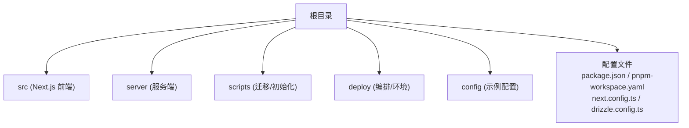
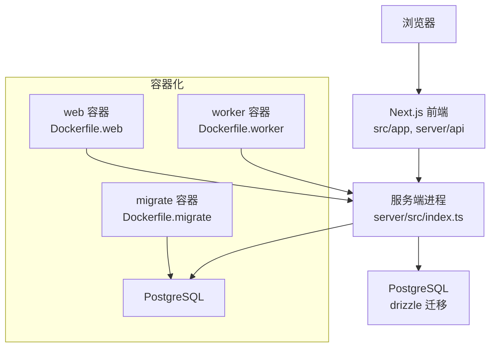
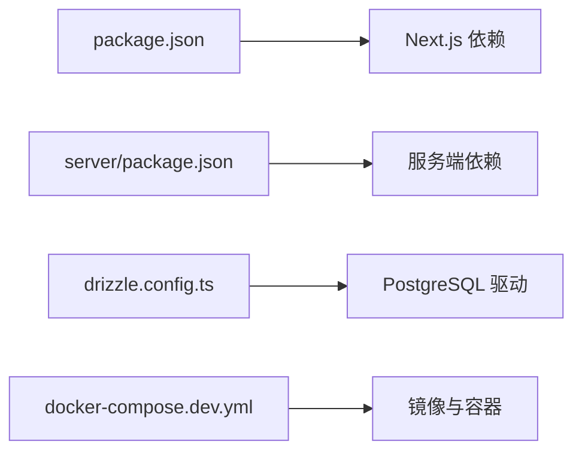

# 快速开始

<cite>
**本文引用的文件**   
- [package.json](file://package.json)
- [pnpm-workspace.yaml](file://pnpm-workspace.yaml)
- [next.config.ts](file://next.config.ts)
- [drizzle.config.ts](file://drizzle.config.ts)
- [docker-compose.dev.yml](file://docker-compose.dev.yml)
- [Dockerfile.web](file://Dockerfile.web)
- [Dockerfile.worker](file://Dockerfile.worker)
- [Dockerfile.migrate](file://Dockerfile.migrate)
- [deploy/compose.yaml](file://deploy/compose.yaml)
- [deploy/env.example](file://deploy/env.example)
- [deploy/worker.env.example](file://deploy/worker.env.example)
- [config/tts.env.example](file://config/tts.env.example)
- [scripts/setup/db-migrate.ts](file://scripts/setup/db-migrate.ts)
- [scripts/setup/postgres-init.sql](file://scripts/setup/postgres-init.sql)
- [server/package.json](file://server/package.json)
- [server/src/index.ts](file://server/src/index.ts)
</cite>

## 目录
1. [简介](#简介)
2. [项目结构](#项目结构)
3. [核心组件](#核心组件)
4. [架构总览](#架构总览)
5. [详细组件分析](#详细组件分析)
6. [依赖关系分析](#依赖关系分析)
7. [性能注意事项](#性能注意事项)
8. [故障排除指南](#故障排除指南)
9. [结论](#结论)
10. [附录](#附录)

## 简介
本快速开始指南面向首次接触 PurpleInk 的开发者，目标是帮助你在最短时间内完成环境搭建、依赖安装、数据库初始化与服务启动。内容涵盖：
- Node.js 与包管理器要求
- 环境变量配置
- 本地开发模式（pnpm + Next.js）
- Docker Compose 一键启动
- 与传统部署方式的对比
- 常见问题排查

## 项目结构
PurpleInk 采用前后端同仓管理，前端基于 Next.js，后端服务位于 server 子目录，使用 Drizzle ORM 进行数据库迁移与初始化，并通过 Docker 提供容器化运行能力。关键目录说明：
- src：Next.js 应用代码（页面、API、组件、功能模块）
- server：服务端逻辑（任务执行、渲染、TTS 等）
- scripts：数据库迁移、初始化脚本
- deploy：生产/开发编排与环境模板
- config：示例环境变量
- 根级配置文件：package.json、pnpm-workspace.yaml、next.config.ts、drizzle.config.ts

图表来源
- [package.json:1-200](file://package.json#L1-L200)
- [pnpm-workspace.yaml:1-50](file://pnpm-workspace.yaml#L1-L50)
- [next.config.ts:1-200](file://next.config.ts#L1-L200)
- [drizzle.config.ts:1-200](file://drizzle.config.ts#L1-L200)

章节来源
- [package.json:1-200](file://package.json#L1-L200)
- [pnpm-workspace.yaml:1-50](file://pnpm-workspace.yaml#L1-L50)
- [next.config.ts:1-200](file://next.config.ts#L1-L200)
- [drizzle.config.ts:1-200](file://drizzle.config.ts#L1-L200)

## 核心组件
- 前端应用（Next.js）：提供 Web UI、路由、API 代理与页面渲染
- 服务端（server）：处理任务队列、渲染、TTS、采集等后台逻辑
- 数据库与迁移：Drizzle ORM 负责 schema 定义与迁移；PostgreSQL 为推荐数据库
- 容器化：Dockerfile.* 与 docker-compose.* 提供可重复的运行环境

章节来源
- [server/package.json:1-200](file://server/package.json#L1-L200)
- [server/src/index.ts:1-200](file://server/src/index.ts#L1-L200)
- [drizzle.config.ts:1-200](file://drizzle.config.ts#L1-L200)

## 架构总览
下图展示了本地开发与容器化部署的整体交互关系：浏览器访问 Next.js 前端，前端通过 API 路由调用后端服务；数据库由 PostgreSQL 提供；迁移脚本在初始化阶段执行。

图表来源
- [docker-compose.dev.yml:1-200](file://docker-compose.dev.yml#L1-L200)
- [Dockerfile.web:1-200](file://Dockerfile.web#L1-L200)
- [Dockerfile.worker:1-200](file://Dockerfile.worker#L1-L200)
- [Dockerfile.migrate:1-200](file://Dockerfile.migrate#L1-L200)
- [deploy/compose.yaml:1-200](file://deploy/compose.yaml#L1-L200)

## 详细组件分析

### 环境准备与依赖安装
- Node.js 版本要求
  - 请根据 package.json 中的引擎声明选择匹配的 Node.js 版本（建议使用 LTS）。
- 包管理器
  - 本项目使用 pnpm 工作区（pnpm-workspace.yaml），请在根目录执行 pnpm 命令进行依赖安装与脚本运行。
- 安装步骤
  - 克隆仓库后，进入根目录执行依赖安装。
  - 若需构建或运行测试，参考 package.json 中提供的脚本。

章节来源
- [package.json:1-200](file://package.json#L1-L200)
- [pnpm-workspace.yaml:1-50](file://pnpm-workspace.yaml#L1-L50)

### 环境变量配置
- 必要的环境变量
  - 数据库连接串（PostgreSQL）
  - 第三方服务凭据（如 TTS、AI 模型等）
- 示例文件
  - deploy/env.example：通用环境变量模板
  - deploy/worker.env.example：worker 专用环境变量模板
  - config/tts.env.example：TTS 相关配置模板
- 使用方法
  - 将对应 .example 复制为 .env 并填写实际值。
  - 确保 Next.js 与服务端都能读取到所需变量。

章节来源
- [deploy/env.example:1-200](file://deploy/env.example#L1-L200)
- [deploy/worker.env.example:1-200](file://deploy/worker.env.example#L1-L200)
- [config/tts.env.example:1-200](file://config/tts.env.example#L1-L200)

### 数据库初始化与迁移
- 使用 Drizzle ORM 进行迁移
  - 通过 scripts/setup/db-migrate.ts 执行迁移脚本
  - 使用 scripts/setup/postgres-init.sql 初始化数据库结构
- 本地开发建议
  - 先启动 PostgreSQL 实例
  - 再执行迁移脚本创建表结构与初始数据
  - 确认迁移成功后再启动应用

章节来源
- [scripts/setup/db-migrate.ts:1-200](file://scripts/setup/db-migrate.ts#L1-L200)
- [scripts/setup/postgres-init.sql:1-200](file://scripts/setup/postgres-init.sql#L1-L200)
- [drizzle.config.ts:1-200](file://drizzle.config.ts#L1-L200)

### 启动服务（传统方式）
- 启动顺序
  - 确保数据库已就绪并完成迁移
  - 启动 Next.js 前端（开发模式）
  - 启动服务端进程（worker）
- 常用命令
  - 安装依赖：pnpm install
  - 启动前端：pnpm dev（或按 package.json 脚本）
  - 启动服务端：在 server 目录下执行相应启动命令（参考 server/package.json）

章节来源
- [package.json:1-200](file://package.json#L1-L200)
- [server/package.json:1-200](file://server/package.json#L1-L200)
- [server/src/index.ts:1-200](file://server/src/index.ts#L1-L200)

### 启动服务（Docker Compose 方式）
- 开发环境
  - 使用 docker-compose.dev.yml 启动 web、worker、数据库等容器
  - 首次运行需执行迁移容器以初始化数据库
- 生产/预发布
  - 使用 deploy/compose.yaml 作为编排模板，结合 env 文件进行部署

章节来源
- [docker-compose.dev.yml:1-200](file://docker-compose.dev.yml#L1-L200)
- [deploy/compose.yaml:1-200](file://deploy/compose.yaml#L1-L200)
- [Dockerfile.web:1-200](file://Dockerfile.web#L1-L200)
- [Dockerfile.worker:1-200](file://Dockerfile.worker#L1-L200)
- [Dockerfile.migrate:1-200](file://Dockerfile.migrate#L1-L200)

### 传统部署 vs Docker 部署对比
- 传统部署
  - 优点：灵活度高，便于调试与定制
  - 缺点：环境一致性较差，依赖管理复杂
- Docker 部署
  - 优点：环境一致、易于扩展与回滚
  - 缺点：需要掌握容器编排与镜像构建

[本节为概念性对比，不直接分析具体文件]

## 依赖关系分析
- 前端依赖
  - Next.js 框架与插件
  - 状态管理与 UI 库
- 后端依赖
  - 任务调度、渲染、TTS 等模块
- 数据库依赖
  - Drizzle ORM 与 PostgreSQL 驱动
- 容器依赖
  - 基础镜像与系统工具

图表来源
- [package.json:1-200](file://package.json#L1-L200)
- [server/package.json:1-200](file://server/package.json#L1-L200)
- [drizzle.config.ts:1-200](file://drizzle.config.ts#L1-L200)
- [docker-compose.dev.yml:1-200](file://docker-compose.dev.yml#L1-L200)

章节来源
- [package.json:1-200](file://package.json#L1-L200)
- [server/package.json:1-200](file://server/package.json#L1-L200)
- [drizzle.config.ts:1-200](file://drizzle.config.ts#L1-L200)
- [docker-compose.dev.yml:1-200](file://docker-compose.dev.yml#L1-L200)

## 性能注意事项
- 数据库连接池与超时：合理设置连接数与超时时间，避免阻塞
- 任务队列并发：根据资源调整 worker 并发度
- 缓存策略：对静态资源与热点数据进行缓存
- 日志与监控：开启结构化日志与指标收集，便于定位瓶颈

[本节为通用指导，不直接分析具体文件]

## 故障排除指南
- 无法连接数据库
  - 检查数据库连接串是否正确
  - 确认数据库服务已启动且端口可达
  - 查看迁移是否成功执行
- 环境变量未生效
  - 确认 .env 文件位置与命名正确
  - 检查 Next.js 与服务端是否读取到相同变量
- 端口冲突
  - 修改默认端口或在 compose 文件中映射不同端口
- 权限问题
  - 确保对数据库与文件系统具有读写权限
- 常见错误定位
  - 查看应用日志与容器日志
  - 使用健康检查接口验证服务状态

章节来源
- [scripts/setup/db-migrate.ts:1-200](file://scripts/setup/db-migrate.ts#L1-L200)
- [deploy/env.example:1-200](file://deploy/env.example#L1-L200)
- [docker-compose.dev.yml:1-200](file://docker-compose.dev.yml#L1-L200)

## 结论
通过以上步骤，你可以在本地或容器中快速启动 PurpleInk 项目。建议优先使用 Docker Compose 保证环境一致性，并在开发过程中充分利用迁移脚本与日志进行问题定位。遇到异常时，按照故障排除指南逐步排查，通常可在较短时间内恢复服务。

[本节为总结性内容，不直接分析具体文件]

## 附录
- 常用命令速查
  - 安装依赖：pnpm install
  - 启动开发：pnpm dev（前端）、server 启动命令（后端）
  - 数据库迁移：执行 db-migrate 脚本
  - Docker 启动：docker compose up（开发或生产编排）
- 参考文件
  - 环境变量模板：deploy/env.example、deploy/worker.env.example、config/tts.env.example
  - 迁移脚本：scripts/setup/db-migrate.ts、scripts/setup/postgres-init.sql
  - 容器编排：docker-compose.dev.yml、deploy/compose.yaml

[本节为补充信息，不直接分析具体文件]