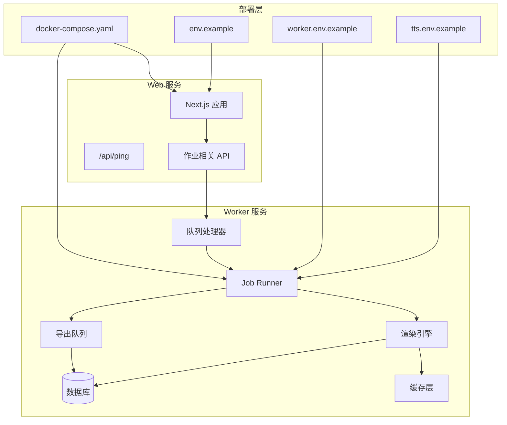
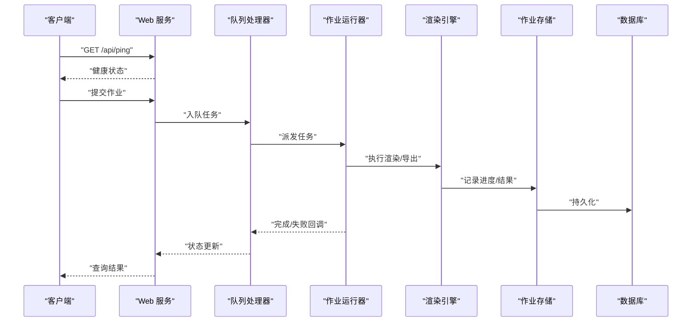
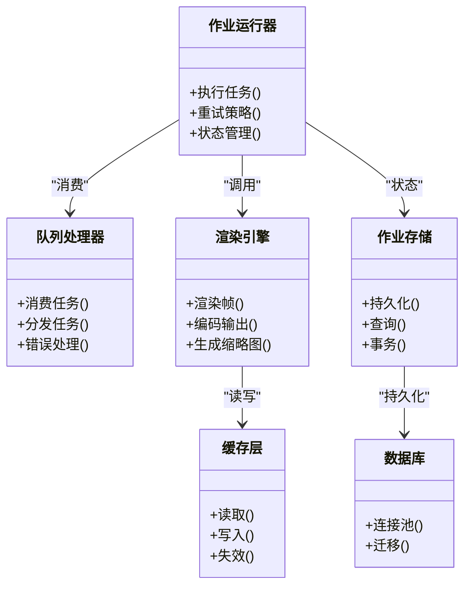

# 故障排除

<cite>
**本文引用的文件**   
- [deploy/compose.yaml](file://deploy/compose.yaml)
- [deploy/env.example](file://deploy/env.example)
- [deploy/worker.env.example](file://deploy/worker.env.example)
- [config/tts.env.example](file://config/tts.env.example)
- [server/src/lib/logger.ts](file://server/src/lib/logger.ts)
- [server/src/server/job-runner.ts](file://server/src/server/job-runner.ts)
- [server/src/server/job-store.ts](file://server/src/server/job-store.ts)
- [src/app/api/ping/route.ts](file://src/app/api/ping/route.ts)
- [src/features/director/queue-handler.ts](file://src/features/director/queue-handler.ts)
- [src/features/render/export-queue-handler.ts](file://src/features/render/export-queue-handler.ts)
- [src/features/render/renderer.ts](file://src/features/render/renderer.ts)
- [src/features/render/cache.ts](file://src/features/render/cache.ts)
- [src/features/render/admission.ts](file://src/features/render/admission.ts)
- [src/features/render/qa-check.ts](file://src/features/render/qa-check.ts)
- [src/features/render/thumbnail.ts](file://src/features/render/thumbnail.ts)
- [src/features/audio/narration.ts](file://src/features/audio/narration.ts)
- [src/features/audio/sfx.ts](file://src/features/audio/sfx.ts)
- [src/features/canvas/status.ts](file://src/features/canvas/status.ts)
- [src/features/canvas/layout.ts](file://src/features/canvas/layout.ts)
- [src/features/artifacts/service.ts](file://src/features/artifacts/service.ts)
- [scripts/setup/db-migrate.ts](file://scripts/setup/db-migrate.ts)
- [scripts/migration/sqlite-backup.ts](file://scripts/migration/sqlite-backup.ts)
- [tests/env.test.ts](file://tests/env.test.ts)
- [tests/worker-error-hygiene.test.ts](file://tests/worker-error-hygiene.test.ts)
- [docs/issues/README.md](file://docs/issues/README.md)
- [docs/issues/ISSUE-010-oversized-files.md](file://docs/issues/ISSUE-010-oversized-files.md)
- [docs/issues/ISSUE-004-queue-concurrency-lanes.md](file://docs/issues/ISSUE-004-queue-concurrency-lanes.md)
- [docs/superpowers/plans/2026-07-25-issue-010-oversized-files.md](file://docs/superpowers/plans/2026-07-25-issue-010-oversized-files.md)
</cite>

## 目录
1. [简介](#简介)
2. [项目结构](#项目结构)
3. [核心组件](#核心组件)
4. [架构总览](#架构总览)
5. [详细组件分析](#详细组件分析)
6. [依赖关系分析](#依赖关系分析)
7. [性能注意事项](#性能注意事项)
8. [故障排除指南](#故障排除指南)
9. [结论](#结论)
10. [附录](#附录)

## 简介
本故障排除文档面向 PurpleInK 的运维与开发者，聚焦环境配置、运行时错误、性能瓶颈的定位与修复。内容涵盖日志分析方法、调试工具与诊断技巧，监控系统使用、告警配置与指标解读，已知问题清单、临时方案与修复计划，社区支持渠道、问题报告模板与求助指南，以及紧急恢复与灾难恢复步骤。

## 项目结构
PurpleInK 采用前后端分离与多进程（Web + Worker）部署模式：
- Web 服务：Next.js 应用，提供 API、页面与实时状态展示
- Worker 服务：后台任务执行器，处理渲染、导出、TTS、队列消费等
- 数据库：PostgreSQL（生产），SQLite（开发/迁移）
- 配置：环境变量集中管理，含 TTS、模型凭据、队列与并发参数

图表来源
- [deploy/compose.yaml](file://deploy/compose.yaml)
- [deploy/env.example](file://deploy/env.example)
- [deploy/worker.env.example](file://deploy/worker.env.example)
- [config/tts.env.example](file://config/tts.env.example)
- [src/app/api/ping/route.ts](file://src/app/api/ping/route.ts)
- [server/src/server/job-runner.ts](file://server/src/server/job-runner.ts)
- [src/features/director/queue-handler.ts](file://src/features/director/queue-handler.ts)
- [src/features/render/export-queue-handler.ts](file://src/features/render/export-queue-handler.ts)
- [src/features/render/renderer.ts](file://src/features/render/renderer.ts)
- [src/features/render/cache.ts](file://src/features/render/cache.ts)

章节来源
- [deploy/compose.yaml](file://deploy/compose.yaml)
- [deploy/env.example](file://deploy/env.example)
- [deploy/worker.env.example](file://deploy/worker.env.example)
- [config/tts.env.example](file://config/tts.env.example)

## 核心组件
- 日志系统：统一结构化日志输出，便于聚合与检索
- 作业运行器：调度与执行后台任务，管理生命周期与重试
- 队列处理器：消费任务并分派到具体执行器
- 渲染引擎：视频/图像渲染、帧序列处理、缩略图生成
- 导出队列：批量导出任务编排与持久化
- 缓存层：渲染中间结果缓存，提升吞吐
- 数据库访问：迁移与数据一致性保障

章节来源
- [server/src/lib/logger.ts](file://server/src/lib/logger.ts)
- [server/src/server/job-runner.ts](file://server/src/server/job-runner.ts)
- [server/src/server/job-store.ts](file://server/src/server/job-store.ts)
- [src/features/director/queue-handler.ts](file://src/features/director/queue-handler.ts)
- [src/features/render/renderer.ts](file://src/features/render/renderer.ts)
- [src/features/render/export-queue-handler.ts](file://src/features/render/export-queue-handler.ts)
- [src/features/render/cache.ts](file://src/features/render/cache.ts)

## 架构总览
下图展示了从请求到执行的端到端流程，包括健康检查、作业入队、执行与结果落库。

图表来源
- [src/app/api/ping/route.ts](file://src/app/api/ping/route.ts)
- [src/features/director/queue-handler.ts](file://src/features/director/queue-handler.ts)
- [server/src/server/job-runner.ts](file://server/src/server/job-runner.ts)
- [src/features/render/renderer.ts](file://src/features/render/renderer.ts)
- [server/src/server/job-store.ts](file://server/src/server/job-store.ts)

## 详细组件分析

### 日志系统与可观测性
- 统一日志格式：包含时间戳、级别、模块、上下文字段，便于过滤与聚合
- 关键位置：
  - 作业生命周期：开始、阶段切换、错误、完成
  - 渲染管线：输入校验、中间产物、耗时统计
  - 队列消费：入队、出队、重试、死信
- 建议：
  - 在容器或宿主机集中收集日志
  - 按模块与作业 ID 建立索引
  - 对错误日志设置告警阈值

章节来源
- [server/src/lib/logger.ts](file://server/src/lib/logger.ts)
- [server/src/server/job-runner.ts](file://server/src/server/job-runner.ts)
- [src/features/director/queue-handler.ts](file://src/features/director/queue-handler.ts)

### 作业运行器与存储
- 职责：
  - 拉取任务、分配资源、执行与重试
  - 维护作业状态机与持久化
- 常见问题：
  - 状态不一致：需通过幂等写入与事务保证
  - 资源争用：限制并发度与超时策略
- 诊断要点：
  - 查看作业存储表的状态流转
  - 核对运行器日志中的阶段标记

章节来源
- [server/src/server/job-runner.ts](file://server/src/server/job-runner.ts)
- [server/src/server/job-store.ts](file://server/src/server/job-store.ts)

### 渲染引擎与缓存
- 职责：
  - 帧捕获、编码、拼接、缩略图生成
  - 中间结果缓存与失效策略
- 性能关键点：
  - 缓存命中率与过期时间
  - I/O 与 CPU 的平衡
  - 大文件处理与内存占用
- 诊断要点：
  - 监控缓存命中/未命中比率
  - 跟踪渲染各阶段耗时

章节来源
- [src/features/render/renderer.ts](file://src/features/render/renderer.ts)
- [src/features/render/cache.ts](file://src/features/render/cache.ts)
- [src/features/render/thumbnail.ts](file://src/features/render/thumbnail.ts)

### 导出队列与准入控制
- 职责：
  - 批量导出任务编排、优先级与限流
  - 准入校验防止过载
- 常见问题：
  - 队列积压：需调整并发与消费者数量
  - 准入拒绝：检查配额与资源上限
- 诊断要点：
  - 观察队列长度与消费速率
  - 分析准入规则触发原因

章节来源
- [src/features/render/export-queue-handler.ts](file://src/features/render/export-queue-handler.ts)
- [src/features/render/admission.ts](file://src/features/render/admission.ts)

### 质量检查与音频处理
- 质量检查：
  - 视觉 QA、时长校验、帧率一致性
- 音频处理：
  - 旁白合成、音效叠加、字幕对齐
- 诊断要点：
  - 关注 QA 失败项与音频时序偏差

章节来源
- [src/features/render/qa-check.ts](file://src/features/render/qa-check.ts)
- [src/features/audio/narration.ts](file://src/features/audio/narration.ts)
- [src/features/audio/sfx.ts](file://src/features/audio/sfx.ts)

### 画布状态与布局
- 职责：
  - 画布状态同步、布局计算与冲突解决
- 常见问题：
  - 布局错乱：检查约束与边界条件
  - 状态不同步：确认事件顺序与幂等性
- 诊断要点：
  - 对比期望布局与实际布局差异

章节来源
- [src/features/canvas/status.ts](file://src/features/canvas/status.ts)
- [src/features/canvas/layout.ts](file://src/features/canvas/layout.ts)

### 制品服务
- 职责：
  - 制品版本化、元数据管理与访问控制
- 诊断要点：
  - 追踪制品创建、更新与删除路径

章节来源
- [src/features/artifacts/service.ts](file://src/features/artifacts/service.ts)

## 依赖关系分析
- 组件耦合：
  - 作业运行器依赖队列处理器与渲染引擎
  - 渲染引擎依赖缓存与数据库
  - 导出队列依赖准入控制与存储
- 外部依赖：
  - 数据库连接池与迁移脚本
  - 第三方服务（如 TTS、模型 API）

图表来源
- [server/src/server/job-runner.ts](file://server/src/server/job-runner.ts)
- [src/features/director/queue-handler.ts](file://src/features/director/queue-handler.ts)
- [src/features/render/renderer.ts](file://src/features/render/renderer.ts)
- [src/features/render/cache.ts](file://src/features/render/cache.ts)
- [server/src/server/job-store.ts](file://server/src/server/job-store.ts)

章节来源
- [server/src/server/job-runner.ts](file://server/src/server/job-runner.ts)
- [src/features/director/queue-handler.ts](file://src/features/director/queue-handler.ts)
- [src/features/render/renderer.ts](file://src/features/render/renderer.ts)
- [src/features/render/cache.ts](file://src/features/render/cache.ts)
- [server/src/server/job-store.ts](file://server/src/server/job-store.ts)

## 性能注意事项
- 并发与限流：
  - 合理设置队列并发度与消费者数量
  - 使用准入控制避免过载
- 缓存策略：
  - 提高命中率，缩短过期时间
  - 区分冷热数据
- I/O 优化：
  - 减少磁盘读写次数
  - 使用流式处理大文件
- 资源监控：
  - CPU、内存、I/O 与网络带宽
  - 数据库连接池与慢查询

[本节为通用指导，无需特定文件引用]

## 故障排除指南

### 环境配置问题
- 症状：
  - 服务无法启动或健康检查失败
  - 第三方服务认证失败
- 排查步骤：
  - 检查环境变量是否完整且正确
  - 验证数据库连接与权限
  - 确认 TTS 与模型凭据有效
- 参考文件：
  - [deploy/env.example](file://deploy/env.example)
  - [deploy/worker.env.example](file://deploy/worker.env.example)
  - [config/tts.env.example](file://config/tts.env.example)
  - [tests/env.test.ts](file://tests/env.test.ts)

章节来源
- [deploy/env.example](file://deploy/env.example)
- [deploy/worker.env.example](file://deploy/worker.env.example)
- [config/tts.env.example](file://config/tts.env.example)
- [tests/env.test.ts](file://tests/env.test.ts)

### 运行时错误
- 症状：
  - 作业执行失败或卡住
  - 队列积压或消费停滞
- 排查步骤：
  - 查看作业运行器与队列处理器日志
  - 检查作业存储状态与重试计数
  - 分析渲染引擎错误堆栈
- 参考文件：
  - [server/src/server/job-runner.ts](file://server/src/server/job-runner.ts)
  - [src/features/director/queue-handler.ts](file://src/features/director/queue-handler.ts)
  - [src/features/render/renderer.ts](file://src/features/render/renderer.ts)
  - [tests/worker-error-hygiene.test.ts](file://tests/worker-error-hygiene.test.ts)

章节来源
- [server/src/server/job-runner.ts](file://server/src/server/job-runner.ts)
- [src/features/director/queue-handler.ts](file://src/features/director/queue-handler.ts)
- [src/features/render/renderer.ts](file://src/features/render/renderer.ts)
- [tests/worker-error-hygiene.test.ts](file://tests/worker-error-hygiene.test.ts)

### 性能瓶颈
- 症状：
  - 渲染耗时过长
  - 导出队列延迟高
  - 缓存命中率低
- 排查步骤：
  - 分析渲染各阶段耗时
  - 检查缓存命中与失效策略
  - 评估并发度与资源利用率
- 参考文件：
  - [src/features/render/renderer.ts](file://src/features/render/renderer.ts)
  - [src/features/render/cache.ts](file://src/features/render/cache.ts)
  - [src/features/render/export-queue-handler.ts](file://src/features/render/export-queue-handler.ts)
  - [src/features/render/admission.ts](file://src/features/render/admission.ts)

章节来源
- [src/features/render/renderer.ts](file://src/features/render/renderer.ts)
- [src/features/render/cache.ts](file://src/features/render/cache.ts)
- [src/features/render/export-queue-handler.ts](file://src/features/render/export-queue-handler.ts)
- [src/features/render/admission.ts](file://src/features/render/admission.ts)

### 日志分析方法
- 方法：
  - 按作业 ID 过滤日志
  - 聚合错误级别与模块分布
  - 关联上下游调用链
- 工具：
  - 日志聚合平台（如 ELK、Loki）
  - 指标采集（Prometheus）与可视化（Grafana）

[本节为通用指导，无需特定文件引用]

### 调试工具与诊断技巧
- 工具：
  - 健康检查接口快速定位服务状态
  - 数据库迁移脚本验证 schema 一致性
  - 备份脚本确保数据安全
- 技巧：
  - 使用最小复现用例
  - 逐步禁用功能模块隔离问题

章节来源
- [src/app/api/ping/route.ts](file://src/app/api/ping/route.ts)
- [scripts/setup/db-migrate.ts](file://scripts/setup/db-migrate.ts)
- [scripts/migration/sqlite-backup.ts](file://scripts/migration/sqlite-backup.ts)

### 监控系统使用与告警配置
- 监控：
  - 服务健康、队列长度、渲染耗时
  - 缓存命中率、数据库连接数
- 告警：
  - 错误率阈值、队列积压阈值
  - 资源使用率超限

[本节为通用指导，无需特定文件引用]

### 性能指标解读
- 关键指标：
  - 作业成功率与平均耗时
  - 队列消费速率与延迟
  - 缓存命中率与内存占用
- 解读：
  - 结合业务峰值与容量规划
  - 识别热点路径与瓶颈点

[本节为通用指导，无需特定文件引用]

### 已知问题列表与临时解决方案
- 问题：
  - 超大文件导致内存溢出
  - 队列并发度过高引发竞争
- 临时方案：
  - 限制文件大小与分块处理
  - 降低并发度与增加超时

章节来源
- [docs/issues/ISSUE-010-oversized-files.md](file://docs/issues/ISSUE-010-oversized-files.md)
- [docs/issues/ISSUE-004-queue-concurrency-lanes.md](file://docs/issues/ISSUE-004-queue-concurrency-lanes.md)

### 未来修复计划
- 计划：
  - 优化大文件处理流水线
  - 改进队列调度算法

章节来源
- [docs/superpowers/plans/2026-07-25-issue-010-oversized-files.md](file://docs/superpowers/plans/2026-07-25-issue-010-oversized-files.md)

### 社区支持与问题报告
- 渠道：
  - GitHub Issues 与 Discussions
  - 社区论坛与邮件列表
- 模板：
  - 环境信息、复现步骤、日志片段、预期与实际行为

章节来源
- [docs/issues/README.md](file://docs/issues/README.md)

### 紧急恢复与灾难恢复
- 紧急恢复：
  - 回滚到稳定版本
  - 重启关键服务与清理队列
- 灾难恢复：
  - 从备份恢复数据库
  - 重建缓存与中间状态

章节来源
- [scripts/migration/sqlite-backup.ts](file://scripts/migration/sqlite-backup.ts)

## 结论
通过系统化日志分析、监控告警与性能调优，可有效定位与解决 PurpleInK 的环境配置、运行时错误与性能瓶颈问题。结合已知问题与修复计划，持续改进系统稳定性与用户体验。

## 附录
- 常用命令：
  - 健康检查：GET /api/ping
  - 数据库迁移：执行迁移脚本
  - 备份恢复：使用备份脚本

[本节为通用指导，无需特定文件引用]