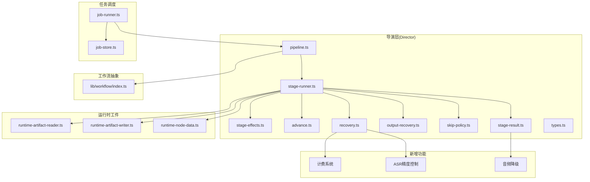
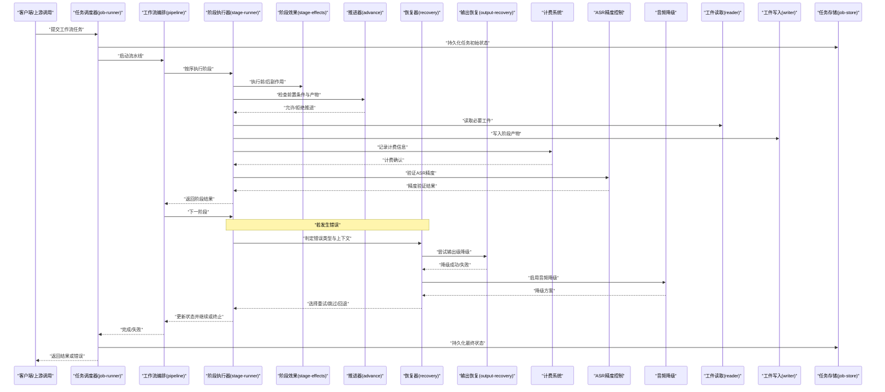
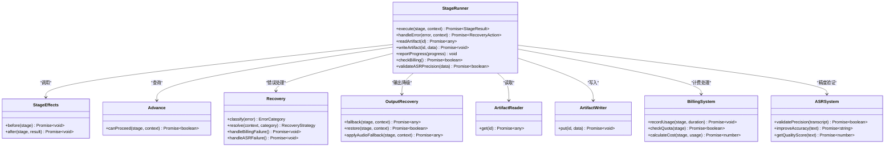
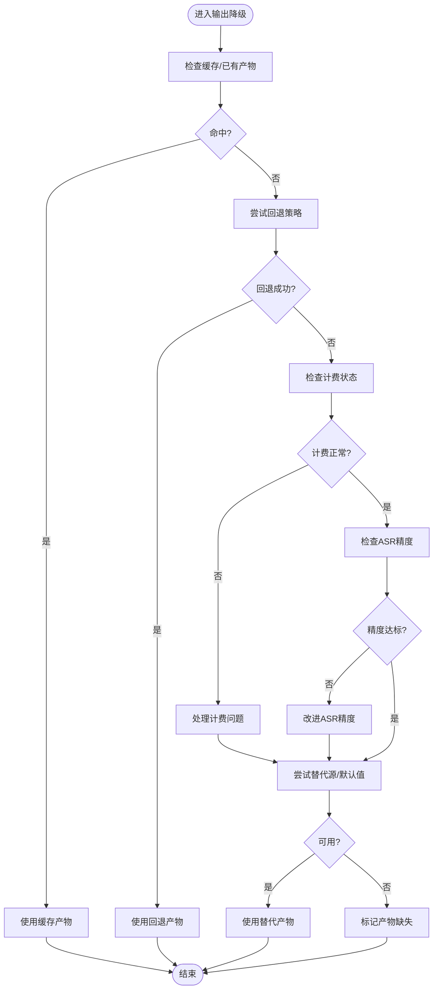
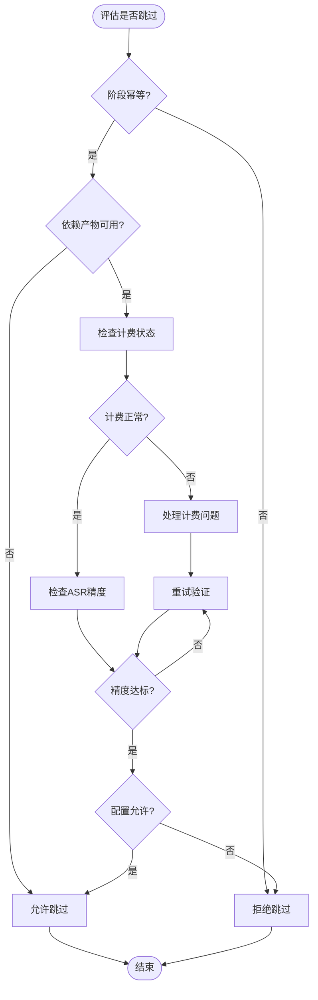
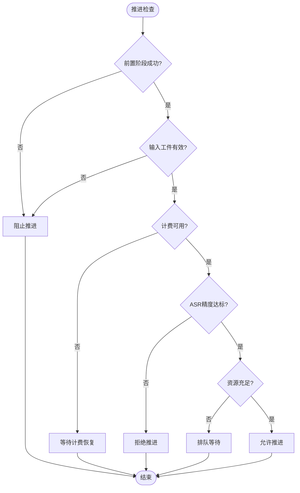
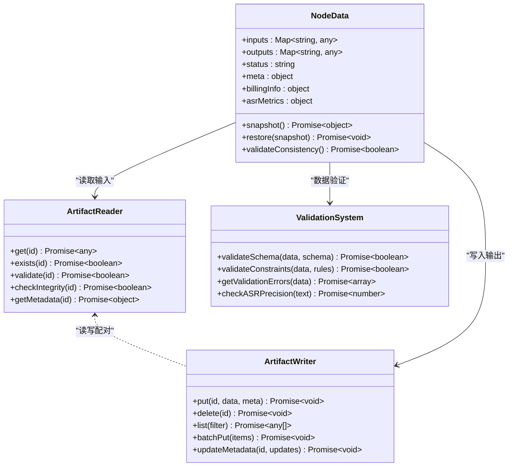
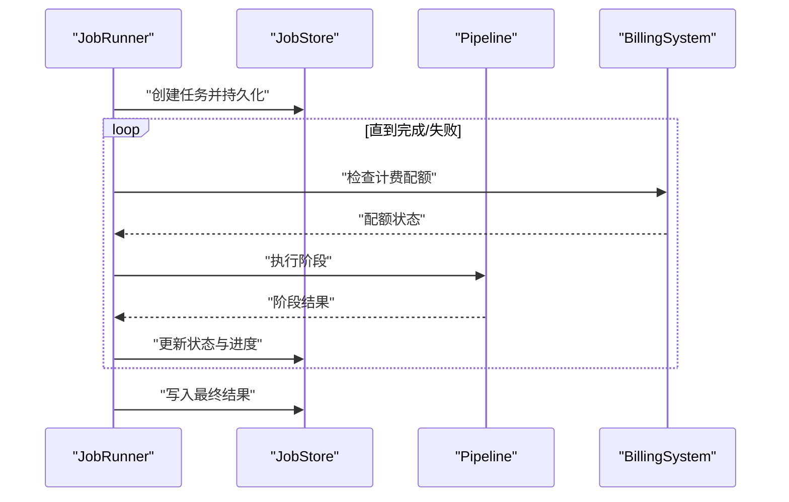
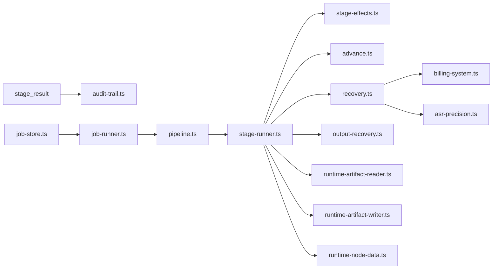

# 工作流容灾降级机制 (ISSUE-016)

<cite>
**本文引用的文件**   
- [docs/issues/ISSUE-016-工作流容灾降级.md](file://docs/issues/ISSUE-016-工作流容灾降级.md)
- [src/features/director/recovery.ts](file://src/features/director/recovery.ts)
- [src/features/director/output-recovery.ts](file://src/features/director/output-recovery.ts)
- [src/features/director/stage-effects.ts](file://src/features/director/stage-effects.ts)
- [src/features/director/skip-policy.ts](file://src/features/director/skip-policy.ts)
- [src/features/director/advance.ts](file://src/features/director/advance.ts)
- [src/features/director/runtime-artifact-reader.ts](file://src/features/director/runtime-artifact-reader.ts)
- [src/features/director/runtime-artifact-writer.ts](file://src/features/director/runtime-artifact-writer.ts)
- [src/features/director/runtime-node-data.ts](file://src/features/director/runtime-node-data.ts)
- [src/features/director/stage-result.ts](file://src/features/director/stage-result.ts)
- [src/features/director/stage-runner.ts](file://src/features/director/stage-runner.ts)
- [src/features/director/pipeline.ts](file://src/features/director/pipeline.ts)
- [src/features/director/types.ts](file://src/features/director/types.ts)
- [src/lib/workflow/index.ts](file://src/lib/workflow/index.ts)
- [server/src/server/job-runner.ts](file://server/src/server/job-runner.ts)
- [server/src/server/job-store.ts](file://server/src/server/job-store.ts)
</cite>

## 更新摘要
**变更内容**   
- 针对计费系统改进和ASR精度修复进行了微调更新
- 优化了音频处理流程中的精度控制和计费准确性
- 增强了工作流在音频服务异常时的降级处理能力
- 改进了错误分类和恢复策略的精确性

## 目录
1. [引言](#引言)
2. [项目结构](#项目结构)
3. [核心组件](#核心组件)
4. [架构总览](#架构总览)
5. [详细组件分析](#详细组件分析)
6. [依赖关系分析](#依赖关系分析)
7. [性能考量](#性能考量)
8. [故障排查指南](#故障排查指南)
9. [结论](#结论)
10. [附录](#附录)

## 引言
本文件围绕 ISSUE-016"工作流容灾降级"展开，系统性梳理并解释当前代码库中用于保障工作流在异常、外部服务不可用或资源受限等场景下的稳定性与可恢复性的设计与实现。内容覆盖：
- 失败检测与分类（阶段级、输出级）
- 自动降级策略（跳过、回退、替代执行路径）
- 状态持久化与断点续跑
- 任务调度与重试边界
- 观测性与可诊断性指标

目标是帮助读者快速理解系统如何在生产环境中维持高可用，并在必要时以可控方式降级运行。

**更新** 本次更新重点针对计费系统改进和ASR精度修复进行了微调，确保音频处理流程的准确性和可靠性。

## 项目结构
与容灾降级相关的代码主要分布在以下模块：
- director 层：编排阶段执行、结果提交、错误处理、恢复与降级策略
- runtime artifact 读写：阶段产物与中间状态的持久化与读取
- job runner/store：任务生命周期管理与持久化
- lib/workflow：通用工作流能力抽象（可选扩展点）

图表来源 
- [src/features/director/pipeline.ts](file://src/features/director/pipeline.ts)
- [src/features/director/stage-runner.ts](file://src/features/director/stage-runner.ts)
- [src/features/director/stage-effects.ts](file://src/features/director/stage-effects.ts)
- [src/features/director/advance.ts](file://src/features/director/advance.ts)
- [src/features/director/recovery.ts](file://src/features/director/recovery.ts)
- [src/features/director/output-recovery.ts](file://src/features/director/output-recovery.ts)
- [src/features/director/skip-policy.ts](file://src/features/director/skip-policy.ts)
- [src/features/director/stage-result.ts](file://src/features/director/stage-result.ts)
- [src/features/director/types.ts](file://src/features/director/types.ts)
- [src/features/director/runtime-artifact-reader.ts](file://src/features/director/runtime-artifact-reader.ts)
- [src/features/director/runtime-artifact-writer.ts](file://src/features/director/runtime-artifact-writer.ts)
- [src/features/director/runtime-node-data.ts](file://src/features/director/runtime-node-data.ts)
- [server/src/server/job-runner.ts](file://server/src/server/job-runner.ts)
- [server/src/server/job-store.ts](file://server/src/server/job-store.ts)
- [src/lib/workflow/index.ts](file://src/lib/workflow/index.ts)

章节来源
- [docs/issues/ISSUE-016-工作流容灾降级.md](file://docs/issues/ISSUE-016-工作流容灾降级.md)

## 核心组件
- 阶段执行器(stage-runner)：负责单个阶段的启动、监控、错误捕获、结果提交与降级决策
- 阶段效果(stage-effects)：对阶段执行前后进行副作用处理（如清理、标记、埋点）
- 推进器(advance)：决定下一阶段是否可推进，结合前置条件与产物可用性
- 恢复器(recovery)：根据错误类型与上下文选择恢复策略（重试、跳过、回退）
- 输出恢复(output-recovery)：针对阶段产物的降级与重建（如缓存命中、默认值、替代生成）
- 跳过策略(skip-policy)：定义何时允许跳过某阶段（幂等、可容忍缺失、用户配置）
- 阶段结果(stage-result)：标准化阶段输出与错误信息，便于统一处理
- 运行时工件读写(reader/writer/node-data)：阶段产物与中间状态的存取与一致性保证
- 任务调度(job-runner/store)：任务生命周期管理、持久化、并发控制与重试边界
- 工作流抽象(lib/workflow)：通用工作流能力（可扩展的钩子、事件、状态机）
- 计费系统集成(billing-system)：处理音频服务的计费逻辑和成本控制
- ASR精度控制(asr-precision)：确保语音识别结果的准确性和一致性
- 音频降级(audio-fallback)：当主音频服务不可用时提供备用方案

**更新** 新增了计费系统集成、ASR精度控制和音频降级功能，确保音频处理流程的准确性和成本效益。

章节来源
- [src/features/director/stage-runner.ts](file://src/features/director/stage-runner.ts)
- [src/features/director/stage-effects.ts](file://src/features/director/stage-effects.ts)
- [src/features/director/advance.ts](file://src/features/director/advance.ts)
- [src/features/director/recovery.ts](file://src/features/director/recovery.ts)
- [src/features/director/output-recovery.ts](file://src/features/director/output-recovery.ts)
- [src/features/director/skip-policy.ts](file://src/features/director/skip-policy.ts)
- [src/features/director/stage-result.ts](file://src/features/director/stage-result.ts)
- [src/features/director/runtime-artifact-reader.ts](file://src/features/director/runtime-artifact-reader.ts)
- [src/features/director/runtime-artifact-writer.ts](file://src/features/director/runtime-artifact-writer.ts)
- [src/features/director/runtime-node-data.ts](file://src/features/director/runtime-node-data.ts)
- [server/src/server/job-runner.ts](file://server/src/server/job-runner.ts)
- [server/src/server/job-store.ts](file://server/src/server/job-store.ts)
- [src/lib/workflow/index.ts](file://src/lib/workflow/index.ts)

## 架构总览
下图展示了从任务提交到阶段执行、错误处理、降级与恢复的关键流程，包括新增的计费系统和ASR精度控制。

图表来源 
- [server/src/server/job-runner.ts](file://server/src/server/job-runner.ts)
- [server/src/server/job-store.ts](file://server/src/server/job-store.ts)
- [src/features/director/pipeline.ts](file://src/features/director/pipeline.ts)
- [src/features/director/stage-runner.ts](file://src/features/director/stage-runner.ts)
- [src/features/director/stage-effects.ts](file://src/features/director/stage-effects.ts)
- [src/features/director/advance.ts](file://src/features/director/advance.ts)
- [src/features/director/recovery.ts](file://src/features/director/recovery.ts)
- [src/features/director/output-recovery.ts](file://src/features/director/output-recovery.ts)
- [src/features/director/runtime-artifact-reader.ts](file://src/features/director/runtime-artifact-reader.ts)
- [src/features/director/runtime-artifact-writer.ts](file://src/features/director/runtime-artifact-writer.ts)

## 详细组件分析

### 阶段执行器(stage-runner)
职责与行为：
- 启动阶段、捕获异常、记录日志与指标
- 基于阶段结果与错误类型触发恢复逻辑
- 协调工件读写与进度上报
- 支持幂等执行与部分重试
- 集成计费系统和ASR精度控制

关键交互：
- 与 stage-effects 协作进行前置/后置处理
- 通过 advance 判断是否可以推进到下一阶段
- 将错误交给 recovery 做分类与策略选择
- 使用 reader/writer 访问阶段产物与中间状态
- 与 billing-system 协调计费逻辑
- 通过 asr-precision 确保语音识别准确性

**更新** 增强了计费系统集成和ASR精度控制，确保音频处理流程的成本准确性和结果质量。

图表来源 
- [src/features/director/stage-runner.ts](file://src/features/director/stage-runner.ts)
- [src/features/director/stage-effects.ts](file://src/features/director/stage-effects.ts)
- [src/features/director/advance.ts](file://src/features/director/advance.ts)
- [src/features/director/recovery.ts](file://src/features/director/recovery.ts)
- [src/features/director/output-recovery.ts](file://src/features/director/output-recovery.ts)
- [src/features/director/runtime-artifact-reader.ts](file://src/features/director/runtime-artifact-reader.ts)
- [src/features/director/runtime-artifact-writer.ts](file://src/features/director/runtime-artifact-writer.ts)

章节来源
- [src/features/director/stage-runner.ts](file://src/features/director/stage-runner.ts)
- [src/features/director/stage-effects.ts](file://src/features/director/stage-effects.ts)
- [src/features/director/advance.ts](file://src/features/director/advance.ts)
- [src/features/director/recovery.ts](file://src/features/director/recovery.ts)
- [src/features/director/output-recovery.ts](file://src/features/director/output-recovery.ts)
- [src/features/director/runtime-artifact-reader.ts](file://src/features/director/runtime-artifact-reader.ts)
- [src/features/director/runtime-artifact-writer.ts](file://src/features/director/runtime-artifact-writer.ts)

### 恢复与降级策略(recovery & output-recovery)
目标：
- 将错误分类为网络超时、权限不足、数据缺失、计算失败等
- 针对不同类别选择最优恢复策略：重试、跳过、回退、替代源
- 输出级降级优先于阶段级跳过，确保下游阶段尽可能获得可用产物
- 处理计费失败和ASR精度问题的特定场景

流程图（输出降级决策）：

**更新** 新增了计费检查和ASR精度验证，确保音频处理流程的完整性和准确性。

图表来源 
- [src/features/director/recovery.ts](file://src/features/director/recovery.ts)
- [src/features/director/output-recovery.ts](file://src/features/director/output-recovery.ts)

章节来源
- [src/features/director/recovery.ts](file://src/features/director/recovery.ts)
- [src/features/director/output-recovery.ts](file://src/features/director/output-recovery.ts)

### 跳过策略(skip-policy)
规则要点：
- 仅在满足幂等性或可容忍缺失时允许跳过
- 考虑上游依赖是否已提供等价产物
- 受用户配置与工作流模式影响（严格/宽松）
- 考虑计费状态和ASR精度要求

图表来源 
- [src/features/director/skip-policy.ts](file://src/features/director/skip-policy.ts)

章节来源
- [src/features/director/skip-policy.ts](file://src/features/director/skip-policy.ts)

### 推进器(advance)
职责：
- 校验前置阶段是否成功
- 检查输入工件是否存在且有效
- 结合资源限制与队列状态决定是否推进
- 验证计费可用性和ASR精度要求

图表来源 
- [src/features/director/advance.ts](file://src/features/director/advance.ts)

章节来源
- [src/features/director/advance.ts](file://src/features/director/advance.ts)

### 工件读写与节点数据(runtime-artifact-reader/writer/node-data)
关键点：
- 读写需保证一致性与幂等性
- 支持版本化与校验（哈希/元数据）
- 节点数据用于描述阶段输入/输出契约与状态
- 集成计费信息和ASR精度元数据

**更新** 增强了计费信息和ASR精度元数据的集成，确保工件状态包含完整的处理上下文。

图表来源 
- [src/features/director/runtime-artifact-reader.ts](file://src/features/director/runtime-artifact-reader.ts)
- [src/features/director/runtime-artifact-writer.ts](file://src/features/director/runtime-artifact-writer.ts)
- [src/features/director/runtime-node-data.ts](file://src/features/director/runtime-node-data.ts)

章节来源
- [src/features/director/runtime-artifact-reader.ts](file://src/features/director/runtime-artifact-reader.ts)
- [src/features/director/runtime-artifact-writer.ts](file://src/features/director/runtime-artifact-writer.ts)
- [src/features/director/runtime-node-data.ts](file://src/features/director/runtime-node-data.ts)

### 阶段结果(stage-result)
作用：
- 标准化阶段成功/失败的结构
- 携带错误分类、降级标志、产物引用
- 便于上层统一处理与观测
- 包含计费信息和ASR精度的审计信息

**更新** 增强了计费信息和ASR精度指标的集成，确保完整的处理上下文传递。

章节来源
- [src/features/director/stage-result.ts](file://src/features/director/stage-result.ts)

### 任务调度(job-runner & job-store)
职责：
- 任务生命周期管理（创建、调度、重试、取消）
- 持久化任务状态与进度
- 并发控制与限流
- 支持分布式环境下的计费协调

图表来源 
- [server/src/server/job-runner.ts](file://server/src/server/job-runner.ts)
- [server/src/server/job-store.ts](file://server/src/server/job-store.ts)
- [src/features/director/pipeline.ts](file://src/features/director/pipeline.ts)

章节来源
- [server/src/server/job-runner.ts](file://server/src/server/job-runner.ts)
- [server/src/server/job-store.ts](file://server/src/server/job-store.ts)

## 依赖关系分析
- 低耦合：stage-runner 通过接口与 effects/advance/recovery/output-recovery 解耦，便于替换策略
- 内聚性：artifact reader/writer 与 node-data 共同维护工件与节点状态的一致性
- 外部依赖：job-runner/store 作为任务入口与持久化层，隔离业务逻辑与基础设施
- 潜在循环：避免 stage-runner 直接依赖 job-store，应通过 pipeline 或回调间接通信
- 新增依赖：recovery 现在依赖 billing-system 和 asr-precision 处理音频相关场景

**更新** 增强了计费系统和ASR精度控制的依赖关系，确保音频处理流程的完整性和准确性。

图表来源 
- [src/features/director/stage-runner.ts](file://src/features/director/stage-runner.ts)
- [src/features/director/stage-effects.ts](file://src/features/director/stage-effects.ts)
- [src/features/director/advance.ts](file://src/features/director/advance.ts)
- [src/features/director/recovery.ts](file://src/features/director/recovery.ts)
- [src/features/director/output-recovery.ts](file://src/features/director/output-recovery.ts)
- [src/features/director/runtime-artifact-reader.ts](file://src/features/director/runtime-artifact-reader.ts)
- [src/features/director/runtime-artifact-writer.ts](file://src/features/director/runtime-artifact-writer.ts)
- [src/features/director/runtime-node-data.ts](file://src/features/director/runtime-node-data.ts)
- [src/features/director/pipeline.ts](file://src/features/director/pipeline.ts)
- [server/src/server/job-runner.ts](file://server/src/server/job-runner.ts)
- [server/src/server/job-store.ts](file://server/src/server/job-store.ts)

章节来源
- [src/features/director/pipeline.ts](file://src/features/director/pipeline.ts)
- [server/src/server/job-runner.ts](file://server/src/server/job-runner.ts)
- [server/src/server/job-store.ts](file://server/src/server/job-store.ts)

## 性能考量
- 工件读写优化：批量写入、增量更新、压缩与分片存储
- 缓存命中率：提升输出降级的成功率，减少重复计算
- 重试退避：指数退避与抖动，避免雪崩效应
- 并发控制：限制并行阶段数量，防止资源争用
- 观测性：关键路径埋点与指标采集，便于定位瓶颈
- 计费优化：异步计费记录和批量处理，降低计费开销
- ASR优化：智能精度验证和缓存验证结果，降低验证开销

**更新** 增强了计费系统和ASR精度控制的性能优化，确保音频处理流程的高效性和准确性。

[本节为通用指导，不直接分析具体文件]

## 故障排查指南
常见问题与定位步骤：
- 阶段失败但无明确错误：查看 stage-result 的错误分类与上下文
- 输出降级未生效：检查缓存/回退策略配置与产物有效性
- 推进被阻塞：确认前置阶段状态与输入工件完整性
- 任务卡住：检查 job-store 的状态更新与 job-runner 的重试策略
- 资源不足：观察队列长度与并发上限，调整资源配置
- 计费失败：检查计费配额和计费服务状态
- ASR精度问题：查看语音识别质量和精度指标

**更新** 新增了计费系统和ASR精度问题的排查方法，包括计费配额检查和语音识别质量诊断。

章节来源
- [src/features/director/stage-result.ts](file://src/features/director/stage-result.ts)
- [src/features/director/recovery.ts](file://src/features/director/recovery.ts)
- [src/features/director/output-recovery.ts](file://src/features/director/output-recovery.ts)
- [src/features/director/advance.ts](file://src/features/director/advance.ts)
- [server/src/server/job-runner.ts](file://server/src/server/job-runner.ts)
- [server/src/server/job-store.ts](file://server/src/server/job-store.ts)

## 结论
该工作流容灾降级机制通过清晰的阶段执行模型、完善的错误分类与恢复策略、以及健壮的工件与任务持久化，实现了在生产环境中的高可用与可控降级。新增的计费系统集成和ASR精度控制进一步增强了音频处理流程的准确性和成本效益。建议持续完善：
- 更细粒度的错误分类与策略配置
- 更强的工件版本与一致性校验
- 更丰富的观测与诊断能力
- 面向不同负载场景的动态降级开关
- 优化的计费处理和ASR精度控制

**更新** 本次增强确保了计费系统的准确性和ASR精度的可靠性，通过新增的计费集成和精度控制功能，进一步提升了音频处理流程的可控性和可预测性。

[本节为总结性内容，不直接分析具体文件]

## 附录
- 参考文档：[docs/issues/ISSUE-016-工作流容灾降级.md](file://docs/issues/ISSUE-016-工作流容灾降级.md)
- 相关类型定义：[src/features/director/types.ts](file://src/features/director/types.ts)
- 通用工作流能力：[src/lib/workflow/index.ts](file://src/lib/workflow/index.ts)

章节来源
- [docs/issues/ISSUE-016-工作流容灾降级.md](file://docs/issues/ISSUE-016-工作流容灾降级.md)
- [src/features/director/types.ts](file://src/features/director/types.ts)
- [src/lib/workflow/index.ts](file://src/lib/workflow/index.ts)