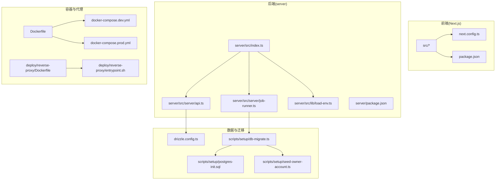
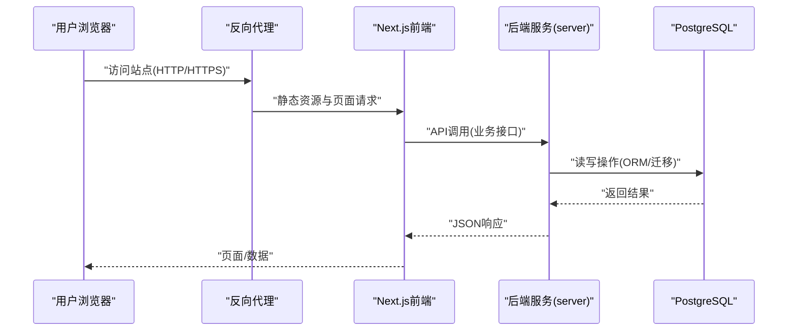
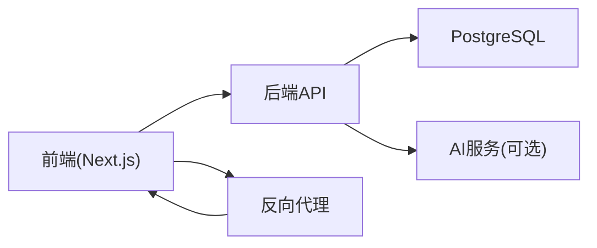

# 常见问题诊断

<cite>
**本文引用的文件**   
- [package.json](file://package.json)
- [next.config.ts](file://next.config.ts)
- [docker-compose.dev.yml](file://docker-compose.dev.yml)
- [docker-compose.prod.yml](file://docker-compose.prod.yml)
- [Dockerfile](file://Dockerfile)
- [drizzle.config.ts](file://drizzle.config.ts)
- [config/tts.env.example](file://config/tts.env.example)
- [deploy/reverse-proxy/Dockerfile](file://deploy/reverse-proxy/Dockerfile)
- [deploy/reverse-proxy/entrypoint.sh](file://deploy/reverse-proxy/entrypoint.sh)
- [scripts/setup/bootstrap-credentials.ts](file://scripts/setup/bootstrap-credentials.ts)
- [scripts/setup/db-migrate.ts](file://scripts/setup/db-migrate.ts)
- [scripts/setup/postgres-init.sql](file://scripts/setup/postgres-init.sql)
- [scripts/setup/seed-owner-account.ts](file://scripts/setup/seed-owner-account.ts)
- [server/package.json](file://server/package.json)
- [server/src/index.ts](file://server/src/index.ts)
- [server/src/lib/load-env.ts](file://server/src/lib/load-env.ts)
- [server/src/server/api.ts](file://server/src/server/api.ts)
- [server/src/server/job-runner.ts](file://server/src/server/job-runner.ts)
- [src/instrumentation.ts](file://src/instrumentation.ts)
- [src/proxy.ts](file://src/proxy.ts)
- [tests/env.test.ts](file://tests/env.test.ts)
</cite>

## 目录
1. [简介](#简介)
2. [项目结构](#项目结构)
3. [核心组件](#核心组件)
4. [架构总览](#架构总览)
5. [详细组件分析](#详细组件分析)
6. [依赖关系分析](#依赖关系分析)
7. [性能注意事项](#性能注意事项)
8. [故障排查指南](#故障排查指南)
9. [结论](#结论)
10. [附录](#附录)

## 简介
本指南面向PurpleInk平台的部署与运维人员，聚焦环境搭建、配置、启动阶段的常见问题与定位方法。内容覆盖Node.js版本与依赖安装、端口冲突、环境变量与密钥、数据库连接、AI服务凭据、反向代理、容器化运行等场景，并提供日志查看位置、关键配置文件检查点、常用调试命令及错误对照表，帮助快速定位并解决问题。

## 项目结构
本项目采用前后端一体化开发模式：前端基于Next.js，后端服务位于server目录，使用TypeScript构建；数据层通过Drizzle ORM管理迁移与初始化脚本；提供开发/生产两套Docker Compose配置；同时包含反向代理的Docker镜像与入口脚本。

图表来源
- [next.config.ts](file://next.config.ts)
- [package.json](file://package.json)
- [server/src/index.ts](file://server/src/index.ts)
- [server/src/server/api.ts](file://server/src/server/api.ts)
- [server/src/server/job-runner.ts](file://server/src/server/job-runner.ts)
- [server/src/lib/load-env.ts](file://server/src/lib/load-env.ts)
- [server/package.json](file://server/package.json)
- [drizzle.config.ts](file://drizzle.config.ts)
- [scripts/setup/db-migrate.ts](file://scripts/setup/db-migrate.ts)
- [scripts/setup/postgres-init.sql](file://scripts/setup/postgres-init.sql)
- [scripts/setup/seed-owner-account.ts](file://scripts/setup/seed-owner-account.ts)
- [docker-compose.dev.yml](file://docker-compose.dev.yml)
- [docker-compose.prod.yml](file://docker-compose.prod.yml)
- [Dockerfile](file://Dockerfile)
- [deploy/reverse-proxy/Dockerfile](file://deploy/reverse-proxy/Dockerfile)
- [deploy/reverse-proxy/entrypoint.sh](file://deploy/reverse-proxy/entrypoint.sh)

章节来源
- [package.json](file://package.json)
- [next.config.ts](file://next.config.ts)
- [docker-compose.dev.yml](file://docker-compose.dev.yml)
- [docker-compose.prod.yml](file://docker-compose.prod.yml)
- [Dockerfile](file://Dockerfile)

## 核心组件
- 前端应用（Next.js）：负责页面渲染、路由与API调用，依赖package.json中的脚本与依赖。
- 后端服务（server）：提供API与任务执行能力，加载环境变量，驱动数据库迁移与作业调度。
- 数据层（Drizzle + PostgreSQL）：通过drizzle.config.ts与迁移脚本完成库表初始化与数据准备。
- 容器编排（Docker Compose）：统一编排前后端、数据库、反向代理等服务。
- 反向代理：对外暴露HTTP/HTTPS入口，处理认证与转发。

章节来源
- [server/src/index.ts](file://server/src/index.ts)
- [server/src/server/api.ts](file://server/src/server/api.ts)
- [server/src/server/job-runner.ts](file://server/src/server/job-runner.ts)
- [server/src/lib/load-env.ts](file://server/src/lib/load-env.ts)
- [drizzle.config.ts](file://drizzle.config.ts)
- [scripts/setup/db-migrate.ts](file://scripts/setup/db-migrate.ts)

## 架构总览
下图展示从浏览器到后端服务、数据库以及反向代理的整体交互流程，便于理解请求路径与常见故障点。

图表来源
- [docker-compose.dev.yml](file://docker-compose.dev.yml)
- [docker-compose.prod.yml](file://docker-compose.prod.yml)
- [deploy/reverse-proxy/Dockerfile](file://deploy/reverse-proxy/Dockerfile)
- [deploy/reverse-proxy/entrypoint.sh](file://deploy/reverse-proxy/entrypoint.sh)
- [server/src/server/api.ts](file://server/src/server/api.ts)
- [drizzle.config.ts](file://drizzle.config.ts)

## 详细组件分析

### 环境与依赖（Node.js与pnpm）
- Node.js版本要求由package.json指定，需确保本地或容器内版本匹配，避免模块编译失败。
- 依赖安装使用pnpm工作区，根目录与server子包分别维护依赖，需按顺序安装。
- 常见症状：
  - 安装时报node-gyp或原生模块编译失败：检查Node版本与系统工具链。
  - 运行时找不到模块：确认pnpm install成功且路径正确。
- 建议步骤：
  - 使用nvm切换至指定Node版本。
  - 在根目录执行pnpm install，再进入server目录执行pnpm install。
  - 清理缓存后重试：pnpm store prune。

章节来源
- [package.json](file://package.json)
- [server/package.json](file://server/package.json)

### 配置与环境变量
- 环境变量加载由后端load-env模块负责，需在运行前注入必要变量（如数据库连接串、AI服务密钥）。
- TTS相关示例配置位于config/tts.env.example，可作为参考模板。
- 常见症状：
  - 启动报缺少环境变量或无效格式：检查.env或容器环境变量注入。
  - AI服务调用失败：核对密钥、域名、超时设置。
- 建议步骤：
  - 复制示例配置为实际env文件，逐项填写。
  - 在容器环境中通过docker-compose环境变量或外部密钥管理服务注入。
  - 使用测试脚本验证环境变量有效性。

章节来源
- [server/src/lib/load-env.ts](file://server/src/lib/load-env.ts)
- [config/tts.env.example](file://config/tts.env.example)
- [tests/env.test.ts](file://tests/env.test.ts)

### 数据库连接与迁移
- Drizzle配置位于drizzle.config.ts，迁移脚本位于scripts/setup/db-migrate.ts，初始化SQL位于postgres-init.sql。
- 常见症状：
  - 迁移失败：检查数据库连接串、权限、网络连通性。
  - 表不存在或字段缺失：确认迁移顺序与版本一致。
- 建议步骤：
  - 先创建数据库与用户，赋予足够权限。
  - 执行db-migrate进行迁移，必要时回滚后再试。
  - 使用seed脚本初始化基础账户与数据。

章节来源
- [drizzle.config.ts](file://drizzle.config.ts)
- [scripts/setup/db-migrate.ts](file://scripts/setup/db-migrate.ts)
- [scripts/setup/postgres-init.sql](file://scripts/setup/postgres-init.sql)
- [scripts/setup/seed-owner-account.ts](file://scripts/setup/seed-owner-account.ts)

### 启动流程与作业调度
- 后端服务入口在server/src/index.ts，API路由在api.ts，作业调度在job-runner.ts。
- 常见症状：
  - 启动即崩溃：检查依赖、环境变量、端口占用。
  - 作业不执行：检查队列、数据库状态、外部服务可用性。
- 建议步骤：
  - 单独启动后端服务，观察日志输出。
  - 验证API健康检查接口是否可用。
  - 检查作业调度器是否被正确初始化。

章节来源
- [server/src/index.ts](file://server/src/index.ts)
- [server/src/server/api.ts](file://server/src/server/api.ts)
- [server/src/server/job-runner.ts](file://server/src/server/job-runner.ts)

### 反向代理与入口
- 反向代理镜像与入口脚本位于deploy/reverse-proxy目录，用于对外暴露服务与基础认证。
- 常见症状：
  - 无法访问站点：检查代理配置、证书、上游服务地址。
  - 认证失败：检查basic_auth凭据文件。
- 建议步骤：
  - 校验entrypoint.sh中的环境变量与挂载卷。
  - 检查secrets目录下的凭据文件是否存在且格式正确。

章节来源
- [deploy/reverse-proxy/Dockerfile](file://deploy/reverse-proxy/Dockerfile)
- [deploy/reverse-proxy/entrypoint.sh](file://deploy/reverse-proxy/entrypoint.sh)

### 容器化与编排
- Dockerfile定义应用镜像构建过程，docker-compose.dev.yml与docker-compose.prod.yml分别用于开发与生产环境编排。
- 常见症状：
  - 容器启动失败：检查镜像构建日志、环境变量、端口映射。
  - 服务间通信失败：检查网络、DNS、服务名解析。
- 建议步骤：
  - 使用docker compose up --build重新构建并启动。
  - 通过docker logs查看各服务日志。
  - 使用docker exec进入容器内部调试。

章节来源
- [Dockerfile](file://Dockerfile)
- [docker-compose.dev.yml](file://docker-compose.dev.yml)
- [docker-compose.prod.yml](file://docker-compose.prod.yml)

## 依赖关系分析
- 前端依赖Next.js生态，后端依赖Express/Fastify（根据实际实现），数据层依赖Drizzle与PostgreSQL。
- 反向代理作为独立服务，通过环境变量与上游服务解耦。
- 建议关注：
  - 版本兼容性（Node、npm/pnpm、依赖库）。
  - 环境变量一致性（开发/生产）。
  - 容器网络与服务发现。

图表来源
- [package.json](file://package.json)
- [server/package.json](file://server/package.json)
- [drizzle.config.ts](file://drizzle.config.ts)

章节来源
- [package.json](file://package.json)
- [server/package.json](file://server/package.json)
- [drizzle.config.ts](file://drizzle.config.ts)

## 性能注意事项
- 数据库连接池大小与超时时间需根据负载调整。
- 作业调度器并发度与重试策略影响吞吐与稳定性。
- 反向代理应启用缓存与压缩以减少带宽消耗。
- 前端静态资源建议使用CDN与缓存策略。

## 故障排查指南

### 环境搭建问题
- Node.js版本不匹配
  - 现象：模块编译失败、运行时异常。
  - 排查：检查package.json中引擎版本，使用nvm切换。
  - 解决：安装指定版本并重启终端会话。
- 依赖安装失败
  - 现象：pnpm install报错、原生模块缺失。
  - 排查：确认系统工具链（gcc、python）、网络可达。
  - 解决：清理缓存、重装依赖、更新包管理器。
- 端口冲突
  - 现象：服务启动失败，提示端口占用。
  - 排查：使用netstat或lsof查找占用进程。
  - 解决：修改端口或终止占用进程。

章节来源
- [package.json](file://package.json)
- [server/package.json](file://server/package.json)

### 配置问题
- 环境变量缺失或格式错误
  - 现象：启动时报错、功能不可用。
  - 排查：检查.env或容器环境变量注入。
  - 解决：补全变量、修正格式、重启服务。
- 数据库连接失败
  - 现象：迁移失败、查询异常。
  - 排查：核对连接串、用户名密码、网络连通性。
  - 解决：修复配置、开放防火墙、重试连接。
- AI服务密钥无效
  - 现象：调用失败、返回鉴权错误。
  - 排查：检查密钥、域名、超时设置。
  - 解决：更新密钥、校验域名解析、增加重试。

章节来源
- [server/src/lib/load-env.ts](file://server/src/lib/load-env.ts)
- [config/tts.env.example](file://config/tts.env.example)
- [tests/env.test.ts](file://tests/env.test.ts)

### 启动失败问题
- 权限错误
  - 现象：无法写入文件或目录、数据库连接拒绝。
  - 排查：检查文件权限、数据库用户权限。
  - 解决：修正权限、授予必要权限。
- 内存不足
  - 现象：进程被OOM Killer终止、服务不稳定。
  - 排查：查看系统内存与容器限制。
  - 解决：增加内存配额、优化进程配置。
- 端口占用
  - 现象：服务无法绑定端口。
  - 排查：查找占用进程、检查端口分配。
  - 解决：释放端口或更换端口。

章节来源
- [server/src/index.ts](file://server/src/index.ts)
- [docker-compose.dev.yml](file://docker-compose.dev.yml)
- [docker-compose.prod.yml](file://docker-compose.prod.yml)

### 日志查看位置
- 前端日志：浏览器开发者工具Network与Console。
- 后端日志：server进程标准输出与错误输出。
- 数据库日志：PostgreSQL容器日志或主机日志目录。
- 反向代理日志：代理容器日志或访问日志文件。

章节来源
- [server/src/index.ts](file://server/src/index.ts)
- [deploy/reverse-proxy/entrypoint.sh](file://deploy/reverse-proxy/entrypoint.sh)

### 关键配置文件检查点
- package.json：Node版本、脚本命令、依赖列表。
- next.config.ts：Next.js构建与运行时配置。
- drizzle.config.ts：数据库连接与迁移配置。
- docker-compose.*.yml：服务定义、环境变量、端口映射。
- deploy/reverse-proxy/entrypoint.sh：代理启动参数与挂载卷。

章节来源
- [package.json](file://package.json)
- [next.config.ts](file://next.config.ts)
- [drizzle.config.ts](file://drizzle.config.ts)
- [docker-compose.dev.yml](file://docker-compose.dev.yml)
- [docker-compose.prod.yml](file://docker-compose.prod.yml)
- [deploy/reverse-proxy/entrypoint.sh](file://deploy/reverse-proxy/entrypoint.sh)

### 常用调试命令
- 查看容器日志：docker logs <container_name>
- 进入容器调试：docker exec -it <container_name> /bin/bash
- 检查端口占用：netstat -tulnp 或 lsof -i :<port>
- 重启服务：docker compose restart <service_name>
- 重建镜像：docker compose build <service_name>

### 错误信息对照表
- “端口已被占用”
  - 原因：目标端口被其他进程占用。
  - 解决：终止占用进程或修改端口配置。
- “ECONNREFUSED”
  - 原因：目标服务未启动或网络不可达。
  - 解决：检查服务状态、防火墙与网络配置。
- “ENOENT: no such file or directory”
  - 原因：文件路径错误或权限不足。
  - 解决：确认路径存在、修正权限。
- “Invalid environment variable”
  - 原因：环境变量缺失或格式错误。
  - 解决：补全变量、修正格式。
- “Database connection failed”
  - 原因：连接串错误、认证失败或网络问题。
  - 解决：核对连接串、用户名密码、网络连通性。

## 结论
通过系统化排查环境、配置与启动阶段的问题，结合日志与配置文件检查，可快速定位并解决PurpleInk平台常见故障。建议在开发与生产环境中保持一致的配置管理与监控手段，提升稳定性与可维护性。

## 附录
- 推荐工具：nvm（Node版本管理）、pnpm（包管理）、docker（容器化）、pgAdmin（数据库管理）。
- 最佳实践：环境变量集中管理、迁移脚本版本控制、日志集中收集与告警。