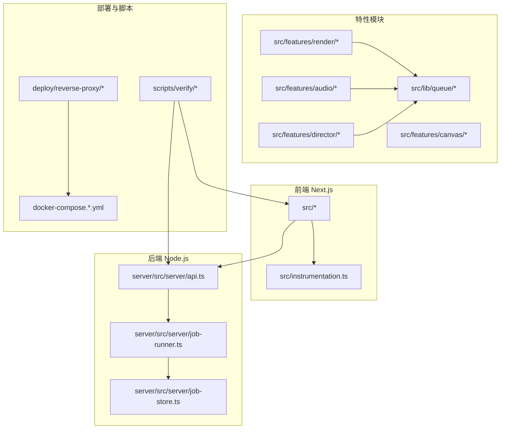
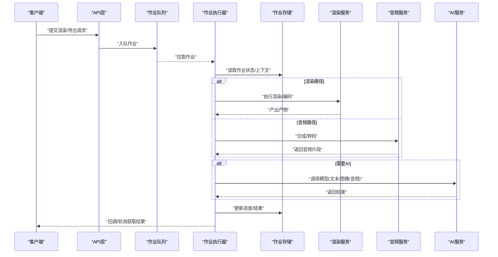
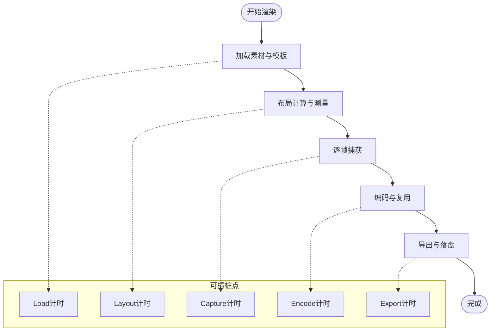
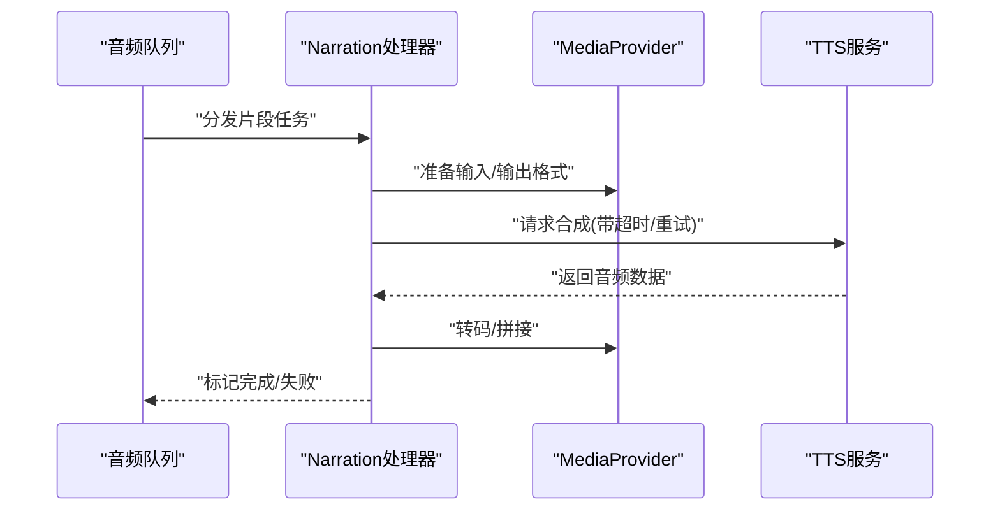
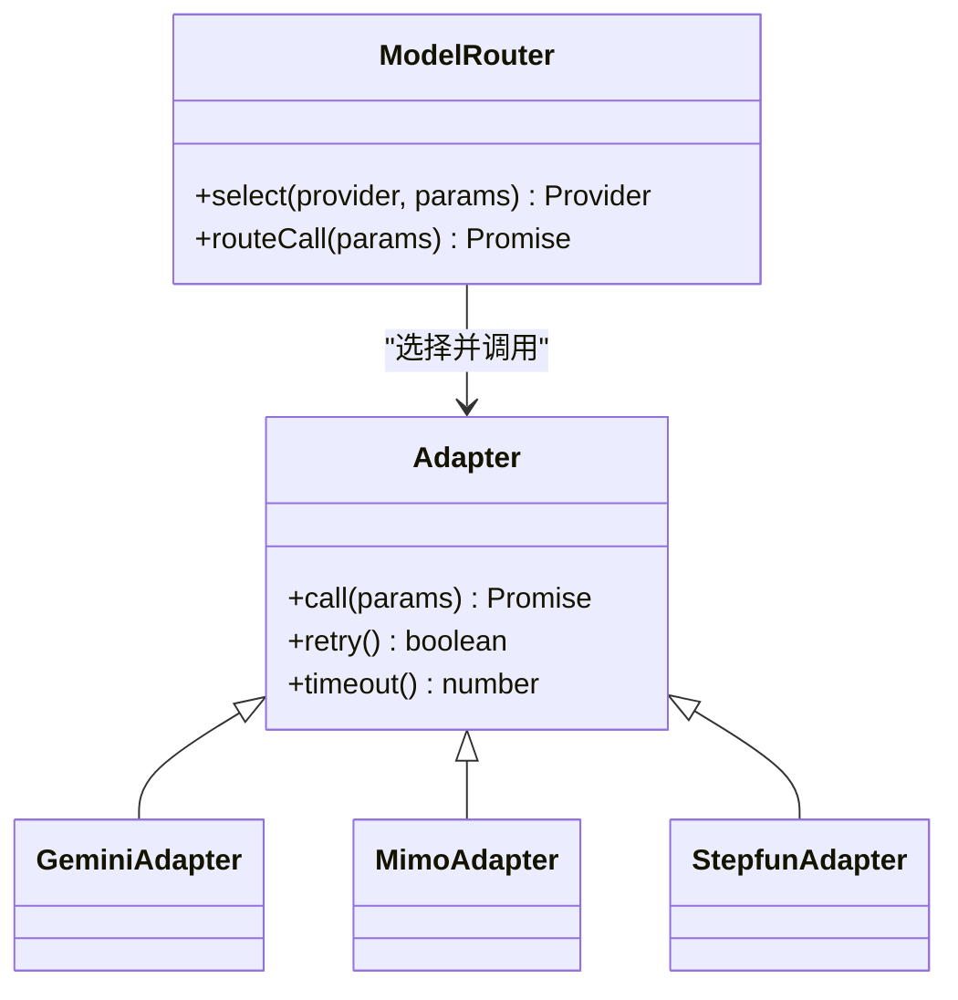
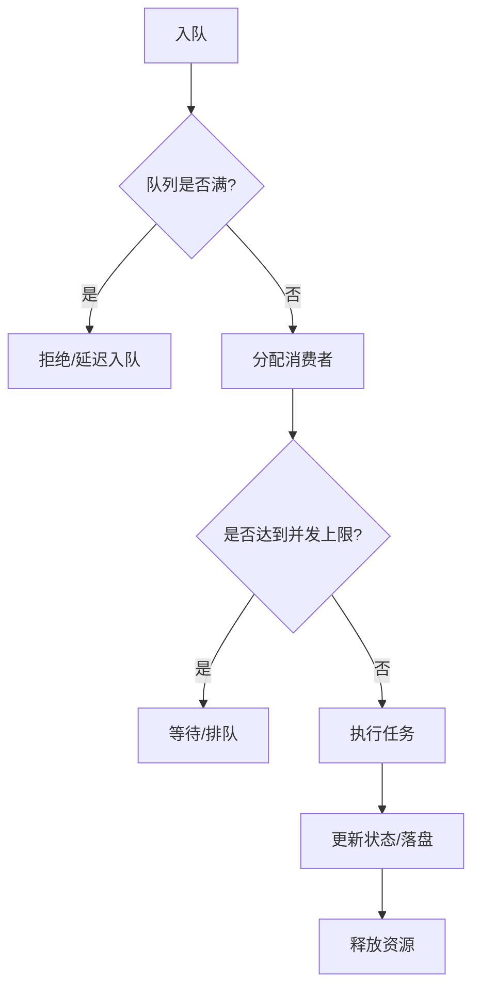
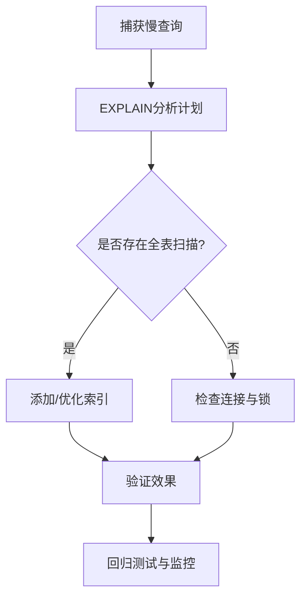
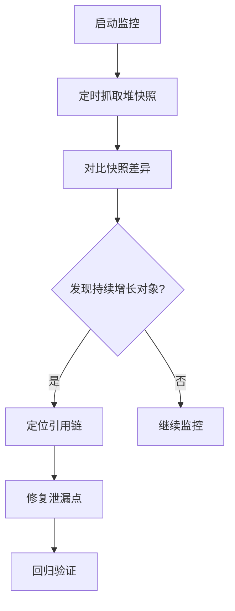
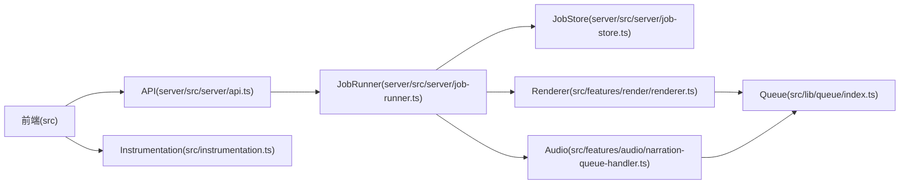

# 性能问题排查

<cite>
**本文引用的文件**   
- [package.json](file://package.json)
- [next.config.ts](file://next.config.ts)
- [server/package.json](file://server/package.json)
- [server/src/index.ts](file://server/src/index.ts)
- [server/src/server/api.ts](file://server/src/server/api.ts)
- [server/src/server/job-runner.ts](file://server/src/server/job-runner.ts)
- [server/src/server/job-store.ts](file://server/src/server/job-store.ts)
- [src/instrumentation.ts](file://src/instrumentation.ts)
- [src/lib/queue/index.ts](file://src/lib/queue/index.ts)
- [src/features/render/renderer.ts](file://src/features/render/renderer.ts)
- [src/features/render/export-service.ts](file://src/features/render/export-service.ts)
- [src/features/render/queue-handler.ts](file://src/features/render/queue-handler.ts)
- [src/features/director/pipeline.ts](file://src/features/director/pipeline.ts)
- [src/features/director/queue-handler.ts](file://src/features/director/queue-handler.ts)
- [src/features/audio/narration-queue-handler.ts](file://src/features/audio/narration-queue-handler.ts)
- [src/features/audio/media-provider.ts](file://src/features/audio/media-provider.ts)
- [src/features/canvas/layout.ts](file://src/features/canvas/layout.ts)
- [scripts/verify/capture-v3-baseline.ts](file://scripts/verify/capture-v3-baseline.ts)
- [scripts/verify/e2e-smoke.ts](file://scripts/verify/e2e-smoke.ts)
- [deploy/reverse-proxy/Dockerfile](file://deploy/reverse-proxy/Dockerfile)
- [docker-compose.dev.yml](file://docker-compose.dev.yml)
- [docker-compose.prod.yml](file://docker-compose.prod.yml)
</cite>

## 目录
1. [简介](#简介)
2. [项目结构](#项目结构)
3. [核心组件](#核心组件)
4. [架构总览](#架构总览)
5. [详细组件分析](#详细组件分析)
6. [依赖关系分析](#依赖关系分析)
7. [性能考量](#性能考量)
8. [故障排查指南](#故障排查指南)
9. [结论](#结论)
10. [附录](#附录)

## 简介
本指南面向PurpleInk平台的研发与运维人员，聚焦性能问题的系统化排查与优化。内容覆盖：
- 慢查询分析与数据库索引优化、查询计划分析
- Node.js内存泄漏检测（堆快照）、内存使用监控
- CPU使用率优化（异步任务调度、并发控制）
- 渲染性能瓶颈定位、音频处理性能调优、AI服务调用延迟分析
- 性能监控工具使用、关键指标采集、性能测试脚本编写

目标是帮助读者快速定位瓶颈、制定优化策略并落地验证。

## 项目结构
PurpleInk采用前后端分离与多模块组织：
- 前端Next.js应用位于根目录src，包含页面、组件、特性模块与通用库
- 服务端Node.js应用位于server/src，提供API、作业执行器与存储抽象
- 公共脚本scripts用于迁移、验证与基准测试
- 部署配置在deploy与docker-compose文件

图表来源
- [server/src/server/api.ts:1-200](file://server/src/server/api.ts#L1-L200)
- [server/src/server/job-runner.ts:1-200](file://server/src/server/job-runner.ts#L1-L200)
- [server/src/server/job-store.ts:1-200](file://server/src/server/job-store.ts#L1-L200)
- [src/features/render/renderer.ts:1-200](file://src/features/render/renderer.ts#L1-L200)
- [src/features/audio/narration-queue-handler.ts:1-200](file://src/features/audio/narration-queue-handler.ts#L1-L200)
- [src/features/director/pipeline.ts:1-200](file://src/features/director/pipeline.ts#L1-L200)
- [src/lib/queue/index.ts:1-200](file://src/lib/queue/index.ts#L1-L200)
- [src/instrumentation.ts:1-200](file://src/instrumentation.ts#L1-L200)
- [deploy/reverse-proxy/Dockerfile:1-200](file://deploy/reverse-proxy/Dockerfile#L1-L200)
- [docker-compose.dev.yml:1-200](file://docker-compose.dev.yml#L1-L200)
- [docker-compose.prod.yml:1-200](file://docker-compose.prod.yml#L1-L200)

章节来源
- [package.json:1-200](file://package.json#L1-L200)
- [next.config.ts:1-200](file://next.config.ts#L1-L200)
- [server/package.json:1-200](file://server/package.json#L1-L200)
- [server/src/index.ts:1-200](file://server/src/index.ts#L1-L200)

## 核心组件
- 作业执行器与队列：job-runner、job-store、各特性的queue-handler负责异步任务编排与并发控制
- 渲染管线：renderer、export-service、frame-capture等负责视频/图像生成与导出
- 音频处理：narration-queue-handler、media-provider、TTS相关适配器负责语音合成与媒体处理
- AI服务：features/ai下的适配器与路由，封装外部模型调用
- 监控与指标：instrumentation.ts统一埋点，结合Next.js运行时指标
- 部署与反向代理：Docker与Nginx配置影响网络与资源吞吐

章节来源
- [server/src/server/job-runner.ts:1-200](file://server/src/server/job-runner.ts#L1-L200)
- [server/src/server/job-store.ts:1-200](file://server/src/server/job-store.ts#L1-L200)
- [src/features/render/renderer.ts:1-200](file://src/features/render/renderer.ts#L1-L200)
- [src/features/render/export-service.ts:1-200](file://src/features/render/export-service.ts#L1-L200)
- [src/features/audio/narration-queue-handler.ts:1-200](file://src/features/audio/narration-queue-handler.ts#L1-L200)
- [src/features/audio/media-provider.ts:1-200](file://src/features/audio/media-provider.ts#L1-L200)
- [src/instrumentation.ts:1-200](file://src/instrumentation.ts#L1-L200)

## 架构总览
系统以“请求→API→作业队列→处理器→外部服务”为主线，配合缓存与持久化存储。渲染与音频为CPU密集路径，AI调用为I/O密集路径。

图表来源
- [server/src/server/api.ts:1-200](file://server/src/server/api.ts#L1-L200)
- [server/src/server/job-runner.ts:1-200](file://server/src/server/job-runner.ts#L1-L200)
- [server/src/server/job-store.ts:1-200](file://server/src/server/job-store.ts#L1-L200)
- [src/features/render/renderer.ts:1-200](file://src/features/render/renderer.ts#L1-L200)
- [src/features/audio/narration-queue-handler.ts:1-200](file://src/features/audio/narration-queue-handler.ts#L1-L200)

## 详细组件分析

### 渲染性能瓶颈定位
- 关键点：帧捕获、媒体组装、编码导出、缓存命中
- 建议方法：
  - 对渲染流水线分段计时，识别耗时阶段（解码、布局、绘制、编码）
  - 启用/调整FFmpeg参数与线程数，避免过度并行导致CPU争用
  - 利用缓存减少重复计算（如缩略图、中间产物）
  - 通过队列限流与背压控制峰值负载

图表来源
- [src/features/render/renderer.ts:1-200](file://src/features/render/renderer.ts#L1-L200)
- [src/features/render/export-service.ts:1-200](file://src/features/render/export-service.ts#L1-L200)
- [src/features/render/queue-handler.ts:1-200](file://src/features/render/queue-handler.ts#L1-L200)

章节来源
- [src/features/render/renderer.ts:1-200](file://src/features/render/renderer.ts#L1-L200)
- [src/features/render/export-service.ts:1-200](file://src/features/render/export-service.ts#L1-L200)
- [src/features/render/queue-handler.ts:1-200](file://src/features/render/queue-handler.ts#L1-L200)

### 音频处理性能调优
- 关键点：TTS调用、音频分片、转码、并发控制
- 建议方法：
  - 对TTS提供商进行超时与重试策略优化，避免长尾延迟
  - 将长文本切分为合理片段，提升并行度与容错性
  - 限制并发数量，避免CPU与带宽饱和
  - 使用流式处理减少内存占用

图表来源
- [src/features/audio/narration-queue-handler.ts:1-200](file://src/features/audio/narration-queue-handler.ts#L1-L200)
- [src/features/audio/media-provider.ts:1-200](file://src/features/audio/media-provider.ts#L1-L200)

章节来源
- [src/features/audio/narration-queue-handler.ts:1-200](file://src/features/audio/narration-queue-handler.ts#L1-L200)
- [src/features/audio/media-provider.ts:1-200](file://src/features/audio/media-provider.ts#L1-L200)

### AI服务调用延迟分析
- 关键点：模型路由、适配器、重试与降级
- 建议方法：
  - 统计各提供商的P50/P95/P99延迟与错误率
  - 设置合理的超时与退避策略，避免雪崩
  - 对热点模型做缓存或批处理（如适用）
  - 观察网络与TLS握手开销，必要时连接池优化

图表来源
- [src/features/director/pipeline.ts:1-200](file://src/features/director/pipeline.ts#L1-L200)

章节来源
- [src/features/director/pipeline.ts:1-200](file://src/features/director/pipeline.ts#L1-L200)

### 异步任务调度与并发控制
- 关键点：队列容量、消费者数量、背压与优先级
- 建议方法：
  - 根据CPU核数与I/O特性设定合适的并发度
  - 实现令牌桶或滑动窗口限流，保护下游服务
  - 对长耗时任务拆分与合并，提高吞吐
  - 监控队列积压与消费延迟，动态扩缩容

图表来源
- [src/lib/queue/index.ts:1-200](file://src/lib/queue/index.ts#L1-L200)
- [server/src/server/job-runner.ts:1-200](file://server/src/server/job-runner.ts#L1-L200)

章节来源
- [src/lib/queue/index.ts:1-200](file://src/lib/queue/index.ts#L1-L200)
- [server/src/server/job-runner.ts:1-200](file://server/src/server/job-runner.ts#L1-L200)

### 数据库慢查询分析与索引优化
- 建议方法：
  - 开启慢查询日志，收集执行时间超过阈值的SQL
  - 使用EXPLAIN/EXPLAIN ANALYZE分析查询计划，关注全表扫描与临时表
  - 针对高频过滤条件建立复合索引，避免函数包裹列
  - 分页查询使用游标或基于主键的范围查询替代OFFSET
  - 定期统计信息更新，确保优化器选择正确计划

章节来源
- [server/src/server/job-store.ts:1-200](file://server/src/server/job-store.ts#L1-L200)

### Node.js内存泄漏检测与监控
- 建议方法：
  - 使用heapdump与chrome devtools抓取堆快照，比较对象增长趋势
  - 监控process.memoryUsage与v8.stats，关注堆大小与GC频率
  - 排查事件监听器未移除、闭包引用大对象、Buffer未释放
  - 对长时间运行的任务引入分块与流式处理，降低峰值内存

章节来源
- [server/src/server/job-runner.ts:1-200](file://server/src/server/job-runner.ts#L1-L200)
- [src/instrumentation.ts:1-200](file://src/instrumentation.ts#L1-L200)

### 关键指标采集与监控
- 建议方法：
  - 在API入口与关键步骤埋点，记录耗时、错误率、队列长度
  - 暴露Prometheus指标或使用内置遥测，聚合到监控系统
  - 定义SLO/SLI，设置告警阈值（如P95延迟、错误率）
  - 结合分布式追踪关联一次请求的全链路耗时

章节来源
- [src/instrumentation.ts:1-200](file://src/instrumentation.ts#L1-L200)
- [server/src/server/api.ts:1-200](file://server/src/server/api.ts#L1-L200)

## 依赖关系分析
- 前端依赖Next.js运行时与自定义instrumentation
- 后端API依赖作业执行器与存储抽象
- 渲染与音频模块依赖队列与外部服务（FFmpeg、TTS、AI）
- 部署层通过反向代理与容器编排影响整体吞吐与稳定性

图表来源
- [src/instrumentation.ts:1-200](file://src/instrumentation.ts#L1-L200)
- [server/src/server/api.ts:1-200](file://server/src/server/api.ts#L1-L200)
- [server/src/server/job-runner.ts:1-200](file://server/src/server/job-runner.ts#L1-L200)
- [server/src/server/job-store.ts:1-200](file://server/src/server/job-store.ts#L1-L200)
- [src/features/render/renderer.ts:1-200](file://src/features/render/renderer.ts#L1-L200)
- [src/features/audio/narration-queue-handler.ts:1-200](file://src/features/audio/narration-queue-handler.ts#L1-L200)
- [src/lib/queue/index.ts:1-200](file://src/lib/queue/index.ts#L1-L200)

章节来源
- [package.json:1-200](file://package.json#L1-L200)
- [server/package.json:1-200](file://server/package.json#L1-L200)

## 性能考量
- 渲染路径需平衡质量与速度，优先保证关键帧与首帧时延
- 音频合成应分片并行，注意网络抖动与重试风暴
- AI调用需具备熔断与降级能力，避免级联失败
- 队列与消费者规模应与硬件资源匹配，避免过载
- 数据库索引与查询计划直接影响端到端时延

[本节为通用指导，不直接分析具体文件]

## 故障排查指南
- 慢查询排查
  - 开启慢查询日志，收集样本
  - 使用EXPLAIN分析计划，定位全表扫描与索引缺失
  - 优化SQL与索引，回归验证
- 内存泄漏排查
  - 抓取堆快照，对比对象增长
  - 检查事件监听器、闭包、Buffer与流
  - 引入分块与流式处理，降低峰值内存
- CPU使用率优化
  - 调整并发度与线程数，避免过度并行
  - 拆分长任务，增加短任务比例
  - 使用缓存与批处理减少重复计算
- 渲染与音频调优
  - 分段计时定位瓶颈阶段
  - 优化编码器参数与线程数
  - 限制并发与背压保护
- AI服务延迟分析
  - 统计延迟分布与错误率
  - 设置超时与退避，避免雪崩
  - 考虑缓存与降级策略

章节来源
- [server/src/server/job-runner.ts:1-200](file://server/src/server/job-runner.ts#L1-L200)
- [src/instrumentation.ts:1-200](file://src/instrumentation.ts#L1-L200)
- [src/features/render/renderer.ts:1-200](file://src/features/render/renderer.ts#L1-L200)
- [src/features/audio/narration-queue-handler.ts:1-200](file://src/features/audio/narration-queue-handler.ts#L1-L200)

## 结论
通过系统化的慢查询分析、内存与CPU监控、渲染与音频调优、AI服务延迟治理，以及完善的指标采集与测试脚本，可以显著提升PurpleInk平台的性能与稳定性。建议在每次变更中引入基准测试与回归验证，持续优化关键路径。

[本节为总结，不直接分析具体文件]

## 附录
- 性能测试脚本
  - 使用scripts/verify中的脚本进行端到端冒烟与基线采集
  - 结合ab/wrk/locust等工具模拟负载，观察系统响应
- 监控与告警
  - 在instrumentation中补充关键埋点
  - 配置Prometheus/Grafana看板与告警规则
- 部署优化
  - 调整反向代理与容器资源限制
  - 合理设置进程数与线程数

章节来源
- [scripts/verify/capture-v3-baseline.ts:1-200](file://scripts/verify/capture-v3-baseline.ts#L1-L200)
- [scripts/verify/e2e-smoke.ts:1-200](file://scripts/verify/e2e-smoke.ts#L1-L200)
- [deploy/reverse-proxy/Dockerfile:1-200](file://deploy/reverse-proxy/Dockerfile#L1-L200)
- [docker-compose.dev.yml:1-200](file://docker-compose.dev.yml#L1-L200)
- [docker-compose.prod.yml:1-200](file://docker-compose.prod.yml#L1-L200)