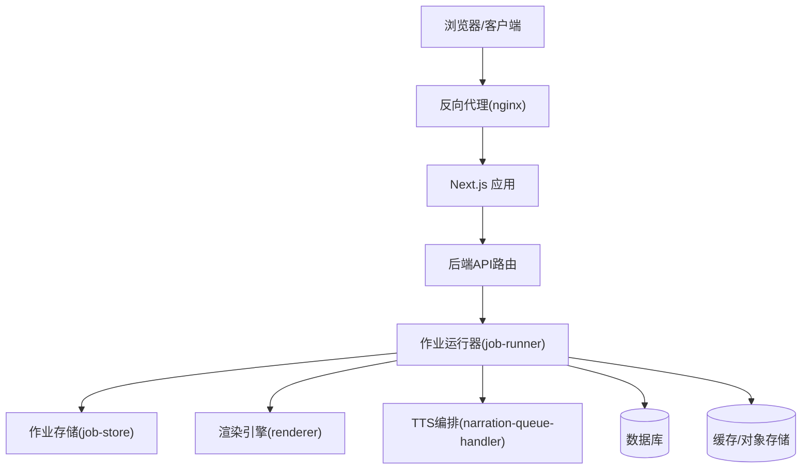
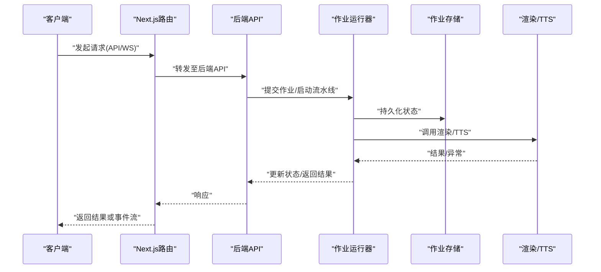
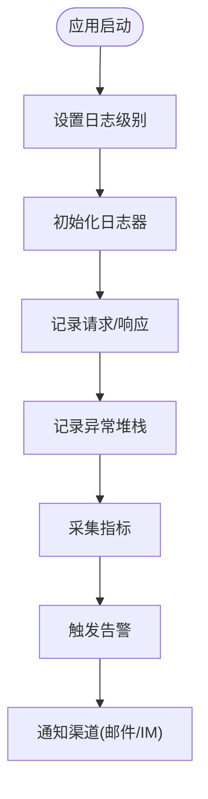
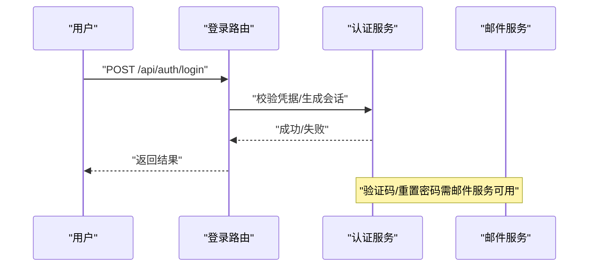
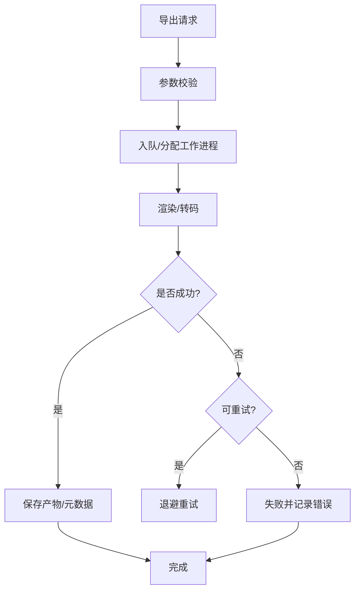
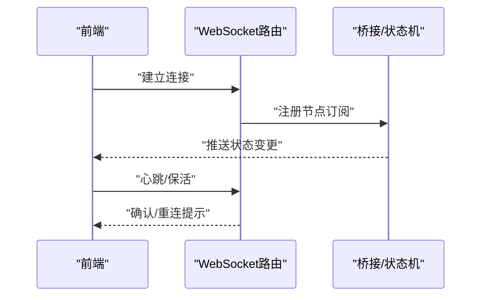
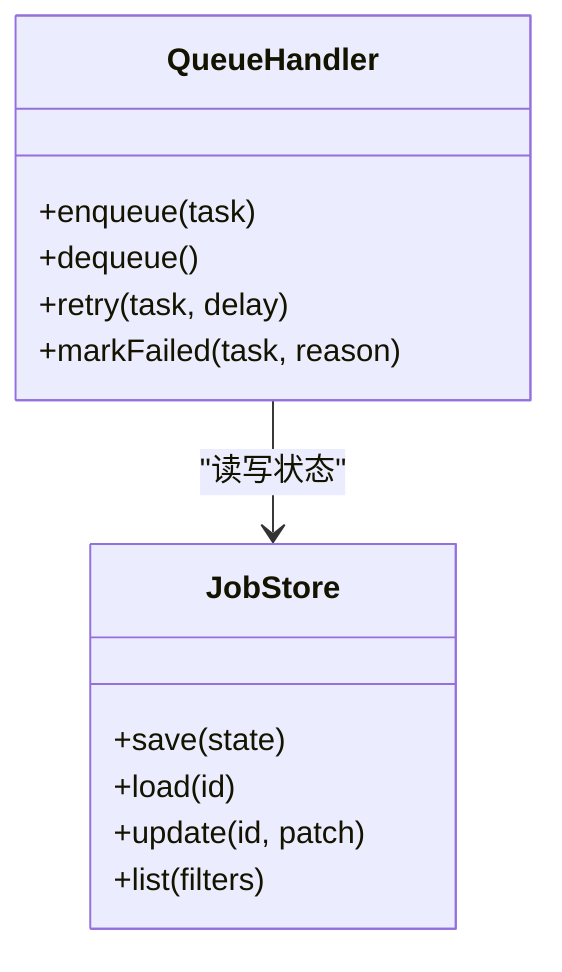
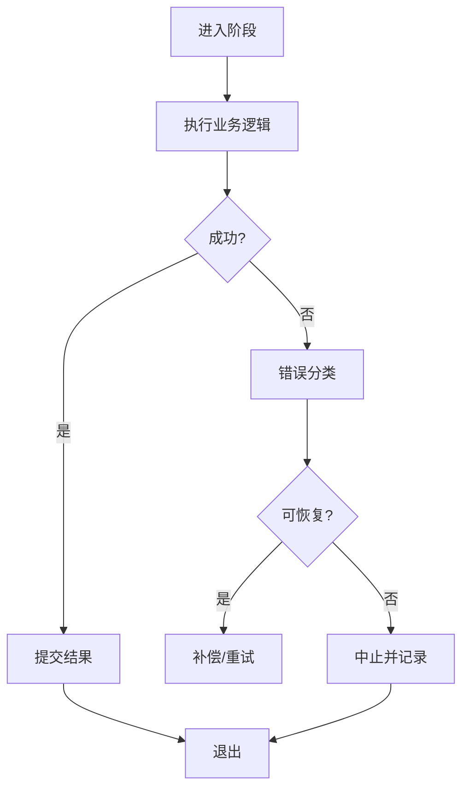
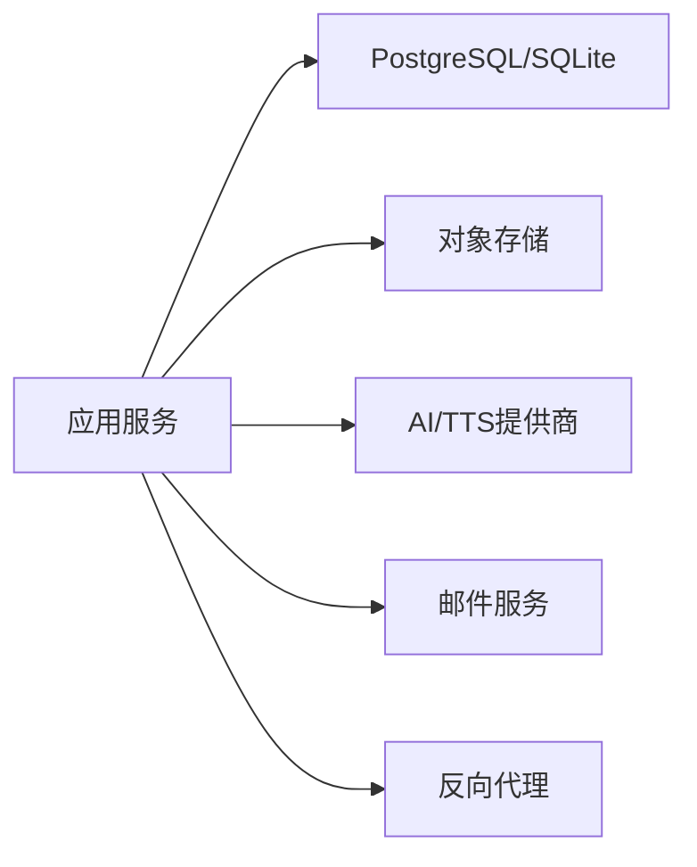

# 故障排除

<cite>
**本文引用的文件**   
- [server/src/lib/logger.ts](file://server/src/lib/logger.ts)
- [server/src/index.ts](file://server/src/index.ts)
- [server/src/server/api.ts](file://server/src/server/api.ts)
- [server/src/server/job-runner.ts](file://server/src/server/job-runner.ts)
- [server/src/server/job-store.ts](file://server/src/server/job-store.ts)
- [src/app/api/ping/route.ts](file://src/app/api/ping/route.ts)
- [src/app/api/auth/login/route.ts](file://src/app/api/auth/login/route.ts)
- [src/app/api/director/stream/[nodeId]/route.ts](file://src/app/api/director/stream/[nodeId]/route.ts)
- [src/app/api/render/export/route.ts](file://src/app/api/render/export/route.ts)
- [src/features/auth/errors.ts](file://src/features/auth/errors.ts)
- [src/features/auth/mail-failure.ts](file://src/features/auth/mail-failure.ts)
- [src/features/director/queue-handler.ts](file://src/features/director/queue-handler.ts)
- [src/features/render/export-service.ts](file://src/features/render/export-service.ts)
- [src/features/render/renderer.ts](file://src/features/render/renderer.ts)
- [src/features/audio/narration-queue-handler.ts](file://src/features/audio/narration-queue-handler.ts)
- [src/features/canvas/workflow-error.ts](file://src/features/canvas/workflow-error.ts)
- [scripts/setup/db-migrate.ts](file://scripts/setup/db-migrate.ts)
- [scripts/migration/reconcile-postgres.ts](file://scripts/migration/reconcile-postgres.ts)
- [docker-compose.dev.yml](file://docker-compose.dev.yml)
- [docker-compose.prod.yml](file://docker-compose.prod.yml)
- [deploy/reverse-proxy/Dockerfile](file://deploy/reverse-proxy/Dockerfile)
- [deploy/reverse-proxy/entrypoint.sh](file://deploy/reverse-proxy/entrypoint.sh)
- [config/tts.env.example](file://config/tts.env.example)
- [docs/deployment/runbook.md](file://docs/deployment/runbook.md)
</cite>

## 目录
1. [简介](#简介)
2. [项目结构](#项目结构)
3. [核心组件](#核心组件)
4. [架构总览](#架构总览)
5. [详细组件分析](#详细组件分析)
6. [依赖关系分析](#依赖关系分析)
7. [性能注意事项](#性能注意事项)
8. [故障排除指南](#故障排除指南)
9. [结论](#结论)
10. [附录](#附录)

## 简介
本指南面向PurpleInk平台的运维与研发人员，聚焦生产环境中的常见问题定位与修复。内容覆盖：
- 环境与依赖问题（容器、反向代理、环境变量）
- 配置问题（认证、第三方服务、TTS等）
- 日志分析与监控告警（级别设置、关键指标、告警策略）
- 性能问题排查（慢查询、内存泄漏、CPU优化）
- 网络问题诊断（API失败、WebSocket连接、第三方超时）
- 数据库问题（连接池耗尽、死锁检测、数据一致性）
- 紧急修复与回滚操作

## 项目结构
平台采用前后端分离架构：
- 前端：Next.js应用，提供Web界面与API路由
- 服务端：Node.js服务，负责作业调度、渲染、TTS编排、队列处理等
- 部署：Docker Compose管理开发/生产环境，反向代理提供HTTPS与安全头
- 脚本：迁移、初始化、验证与演练脚本

**图示来源** 
- [server/src/index.ts](file://server/src/index.ts)
- [server/src/server/api.ts](file://server/src/server/api.ts)
- [server/src/server/job-runner.ts](file://server/src/server/job-runner.ts)
- [server/src/server/job-store.ts](file://server/src/server/job-store.ts)
- [src/app/api/render/export/route.ts](file://src/app/api/render/export/route.ts)
- [src/features/render/renderer.ts](file://src/features/render/renderer.ts)
- [src/features/audio/narration-queue-handler.ts](file://src/features/audio/narration-queue-handler.ts)

**章节来源**
- [server/src/index.ts](file://server/src/index.ts)
- [server/src/server/api.ts](file://server/src/server/api.ts)
- [docker-compose.dev.yml](file://docker-compose.dev.yml)
- [docker-compose.prod.yml](file://docker-compose.prod.yml)

## 核心组件
- 日志系统：集中化日志输出，支持分级与结构化字段
- 作业运行器：负责任务生命周期、重试、状态持久化
- 渲染引擎：媒体采集、转码、合成
- TTS编排：语音合成队列与任务分发
- 认证与邮件：登录流程、验证码、邮件发送失败处理
- 反向代理：安全头、限流、健康检查

**章节来源**
- [server/src/lib/logger.ts](file://server/src/lib/logger.ts)
- [server/src/server/job-runner.ts](file://server/src/server/job-runner.ts)
- [server/src/server/job-store.ts](file://server/src/server/job-store.ts)
- [src/features/render/renderer.ts](file://src/features/render/renderer.ts)
- [src/features/audio/narration-queue-handler.ts](file://src/features/audio/narration-queue-handler.ts)
- [src/features/auth/errors.ts](file://src/features/auth/errors.ts)
- [src/features/auth/mail-failure.ts](file://src/features/auth/mail-failure.ts)

## 架构总览
下图展示从请求到作业执行的关键路径，包括错误上报与重试机制。

**图示来源** 
- [src/app/api/render/export/route.ts](file://src/app/api/render/export/route.ts)
- [server/src/server/api.ts](file://server/src/server/api.ts)
- [server/src/server/job-runner.ts](file://server/src/server/job-runner.ts)
- [server/src/server/job-store.ts](file://server/src/server/job-store.ts)
- [src/features/render/renderer.ts](file://src/features/render/renderer.ts)
- [src/features/audio/narration-queue-handler.ts](file://src/features/audio/narration-queue-handler.ts)

## 详细组件分析

### 日志与监控告警
- 日志级别：建议开发使用DEBUG/TRACE，生产使用INFO/WARN/ERROR；对敏感信息脱敏
- 结构化字段：包含traceId、userId、jobId、stage、duration、status
- 关键指标：QPS、错误率、P95/P99延迟、队列长度、作业成功率、外部依赖超时率
- 告警策略：错误率阈值、延迟阈值、队列积压、依赖不可用、磁盘/内存水位

**图示来源** 
- [server/src/lib/logger.ts](file://server/src/lib/logger.ts)

**章节来源**
- [server/src/lib/logger.ts](file://server/src/lib/logger.ts)

### 认证与授权问题
- 常见现象：登录失败、会话失效、验证码无法发送
- 排查要点：环境变量、密钥配置、邮件服务可达性、速率限制
- 错误分类：参数校验、凭据错误、第三方服务失败、内部异常

**图示来源** 
- [src/app/api/auth/login/route.ts](file://src/app/api/auth/login/route.ts)
- [src/features/auth/errors.ts](file://src/features/auth/errors.ts)
- [src/features/auth/mail-failure.ts](file://src/features/auth/mail-failure.ts)

**章节来源**
- [src/app/api/auth/login/route.ts](file://src/app/api/auth/login/route.ts)
- [src/features/auth/errors.ts](file://src/features/auth/errors.ts)
- [src/features/auth/mail-failure.ts](file://src/features/auth/mail-failure.ts)

### 渲染与导出问题
- 常见现象：导出失败、缩略图缺失、帧捕获异常
- 排查要点：FFmpeg可用性、资源路径、并发限制、磁盘空间
- 重试与降级：失败重试、部分导出、缓存命中

**图示来源** 
- [src/app/api/render/export/route.ts](file://src/app/api/render/export/route.ts)
- [src/features/render/export-service.ts](file://src/features/render/export-service.ts)
- [src/features/render/renderer.ts](file://src/features/render/renderer.ts)

**章节来源**
- [src/app/api/render/export/route.ts](file://src/app/api/render/export/route.ts)
- [src/features/render/export-service.ts](file://src/features/render/export-service.ts)
- [src/features/render/renderer.ts](file://src/features/render/renderer.ts)

### WebSocket实时流
- 常见现象：连接断开、消息丢失、节点状态不同步
- 排查要点：代理配置、心跳保活、重连策略、背压控制

**图示来源** 
- [src/app/api/director/stream/[nodeId]/route.ts](file://src/app/api/director/stream/[nodeId]/route.ts)

**章节来源**
- [src/app/api/director/stream/[nodeId]/route.ts](file://src/app/api/director/stream/[nodeId]/route.ts)

### 队列与作业调度
- 常见现象：作业堆积、重复消费、卡住
- 排查要点：消费者数量、幂等性、死信队列、超时配置

**图示来源** 
- [src/features/director/queue-handler.ts](file://src/features/director/queue-handler.ts)
- [server/src/server/job-store.ts](file://server/src/server/job-store.ts)

**章节来源**
- [src/features/director/queue-handler.ts](file://src/features/director/queue-handler.ts)
- [server/src/server/job-store.ts](file://server/src/server/job-store.ts)

### 工作流错误处理
- 常见现象：阶段失败、状态不一致、恢复困难
- 排查要点：错误分类、补偿动作、幂等写入、快照恢复

**图示来源** 
- [src/features/canvas/workflow-error.ts](file://src/features/canvas/workflow-error.ts)

**章节来源**
- [src/features/canvas/workflow-error.ts](file://src/features/canvas/workflow-error.ts)

## 依赖关系分析
- 外部依赖：数据库、对象存储、第三方AI/TTS服务、邮件服务
- 运行时依赖：Node版本、FFmpeg、系统库
- 容器依赖：镜像基础、端口映射、卷挂载、环境变量注入

**图示来源** 
- [docker-compose.dev.yml](file://docker-compose.dev.yml)
- [docker-compose.prod.yml](file://docker-compose.prod.yml)
- [deploy/reverse-proxy/Dockerfile](file://deploy/reverse-proxy/Dockerfile)
- [deploy/reverse-proxy/entrypoint.sh](file://deploy/reverse-proxy/entrypoint.sh)

**章节来源**
- [docker-compose.dev.yml](file://docker-compose.dev.yml)
- [docker-compose.prod.yml](file://docker-compose.prod.yml)
- [deploy/reverse-proxy/Dockerfile](file://deploy/reverse-proxy/Dockerfile)
- [deploy/reverse-proxy/entrypoint.sh](file://deploy/reverse-proxy/entrypoint.sh)

## 性能注意事项
- 慢查询分析：启用慢查询日志、索引优化、避免N+1查询
- 内存泄漏检测：堆快照分析、引用追踪、GC调优
- CPU优化：热点函数剖析、并行度调整、I/O阻塞规避
- 队列吞吐：消费者扩容、批处理、背压与限流

[本节为通用指导，不直接分析具体文件]

## 故障排除指南

### 环境问题
- 症状：服务无法启动、端口冲突、容器间通信失败
- 排查步骤：
  - 检查容器状态与日志
  - 验证端口占用与防火墙规则
  - 核对环境变量与密钥注入
  - 确认反向代理证书与域名解析
- 参考文件：
  - [docker-compose.dev.yml](file://docker-compose.dev.yml)
  - [docker-compose.prod.yml](file://docker-compose.prod.yml)
  - [deploy/reverse-proxy/entrypoint.sh](file://deploy/reverse-proxy/entrypoint.sh)

**章节来源**
- [docker-compose.dev.yml](file://docker-compose.dev.yml)
- [docker-compose.prod.yml](file://docker-compose.prod.yml)
- [deploy/reverse-proxy/entrypoint.sh](file://deploy/reverse-proxy/entrypoint.sh)

### 依赖问题
- 症状：第三方服务调用失败、FFmpeg不可用、模块加载失败
- 排查步骤：
  - 检查网络连通性与DNS解析
  - 验证依赖二进制与系统库版本
  - 查看依赖服务的健康检查与配额
- 参考文件：
  - [server/src/index.ts](file://server/src/index.ts)
  - [deploy/reverse-proxy/Dockerfile](file://deploy/reverse-proxy/Dockerfile)

**章节来源**
- [server/src/index.ts](file://server/src/index.ts)
- [deploy/reverse-proxy/Dockerfile](file://deploy/reverse-proxy/Dockerfile)

### 配置问题
- 症状：认证失败、TTS无输出、导出异常
- 排查步骤：
  - 核对环境变量模板与必填项
  - 检查密钥有效期与权限范围
  - 验证配置文件语法与默认值
- 参考文件：
  - [config/tts.env.example](file://config/tts.env.example)
  - [src/app/api/auth/login/route.ts](file://src/app/api/auth/login/route.ts)

**章节来源**
- [config/tts.env.example](file://config/tts.env.example)
- [src/app/api/auth/login/route.ts](file://src/app/api/auth/login/route.ts)

### 日志分析与监控告警
- 日志级别设置：按环境区分，生产关闭DEBUG
- 关键指标监控：QPS、错误率、延迟分位、队列长度、依赖超时
- 异常告警配置：阈值、去重、升级策略、通知渠道
- 参考文件：
  - [server/src/lib/logger.ts](file://server/src/lib/logger.ts)
  - [server/src/server/job-runner.ts](file://server/src/server/job-runner.ts)

**章节来源**
- [server/src/lib/logger.ts](file://server/src/lib/logger.ts)
- [server/src/server/job-runner.ts](file://server/src/server/job-runner.ts)

### 性能问题排查
- 慢查询分析：启用慢查询、分析执行计划、添加索引
- 内存泄漏检测：定期堆快照、对比差异、定位未释放引用
- CPU使用率优化：热点函数剖析、减少同步阻塞、合理并发
- 参考文件：
  - [server/src/server/job-runner.ts](file://server/src/server/job-runner.ts)
  - [src/features/render/renderer.ts](file://src/features/render/renderer.ts)

**章节来源**
- [server/src/server/job-runner.ts](file://server/src/server/job-runner.ts)
- [src/features/render/renderer.ts](file://src/features/render/renderer.ts)

### 网络问题诊断
- API调用失败：检查HTTP状态码、超时时间、重试策略
- WebSocket连接问题：代理配置、心跳间隔、重连退避
- 第三方服务超时：熔断与降级、超时上限、备用通道
- 参考文件：
  - [src/app/api/ping/route.ts](file://src/app/api/ping/route.ts)
  - [src/app/api/director/stream/[nodeId]/route.ts](file://src/app/api/director/stream/[nodeId]/route.ts)

**章节来源**
- [src/app/api/ping/route.ts](file://src/app/api/ping/route.ts)
- [src/app/api/director/stream/[nodeId]/route.ts](file://src/app/api/director/stream/[nodeId]/route.ts)

### 数据库问题解决
- 连接池耗尽：增大池大小、缩短事务、排查长事务
- 死锁检测：查看锁等待图、优化事务顺序、拆分大事务
- 数据一致性：幂等写入、校验和、审计日志
- 参考文件：
  - [scripts/setup/db-migrate.ts](file://scripts/setup/db-migrate.ts)
  - [scripts/migration/reconcile-postgres.ts](file://scripts/migration/reconcile-postgres.ts)

**章节来源**
- [scripts/setup/db-migrate.ts](file://scripts/setup/db-migrate.ts)
- [scripts/migration/reconcile-postgres.ts](file://scripts/migration/reconcile-postgres.ts)

### 紧急修复与回滚
- 快速止血：禁用功能开关、降级流量、隔离故障节点
- 数据修复：只读模式、增量修复脚本、校验与回滚
- 版本回滚：镜像回滚、配置回滚、依赖兼容检查
- 参考文件：
  - [docs/deployment/runbook.md](file://docs/deployment/runbook.md)

**章节来源**
- [docs/deployment/runbook.md](file://docs/deployment/runbook.md)

## 结论
通过系统化日志与监控、清晰的错误分类与重试策略、以及完善的回滚预案，可以显著提升PurpleInk平台的稳定性与可维护性。建议在生产环境持续完善指标与告警，定期演练故障场景，确保团队具备快速定位与恢复能力。

## 附录
- 常用命令与脚本：迁移、备份、验证
- 健康检查端点：/ping与健康探针
- 反向代理最佳实践：安全头、限流、缓存策略

[本节为通用指导，不直接分析具体文件]