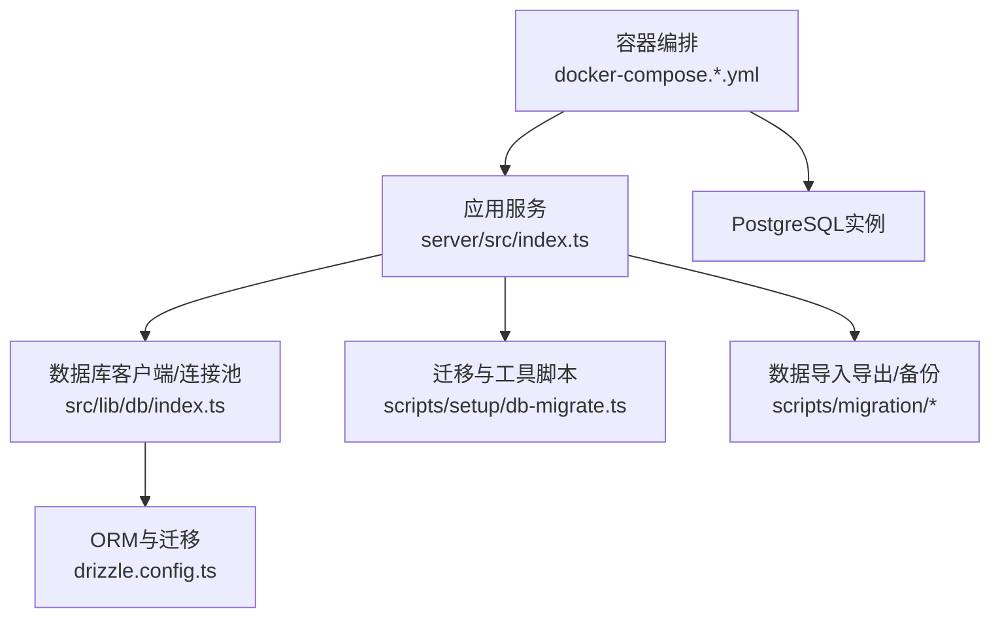
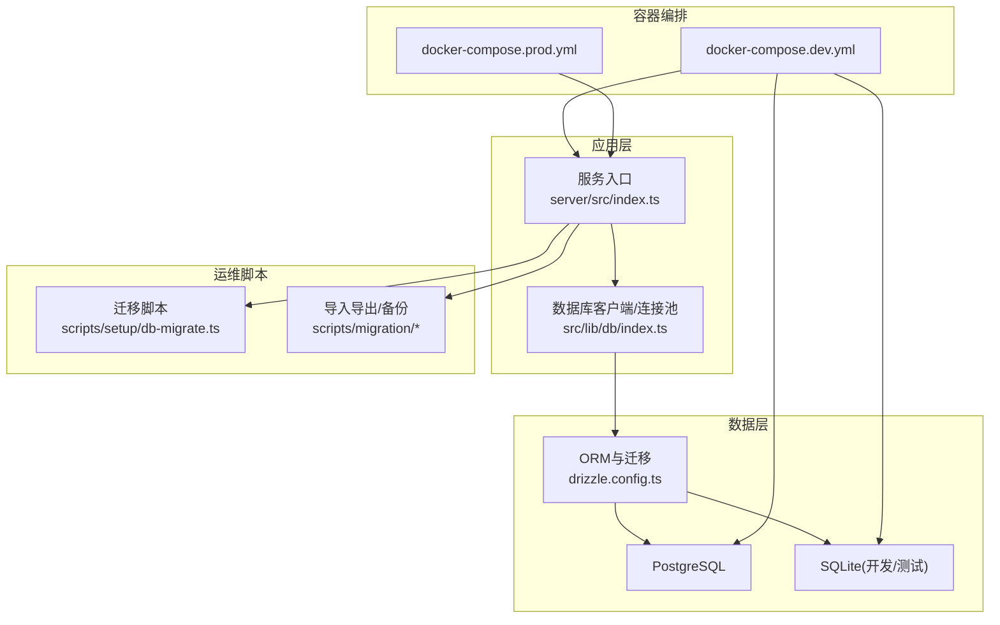
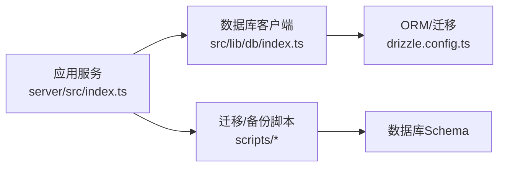
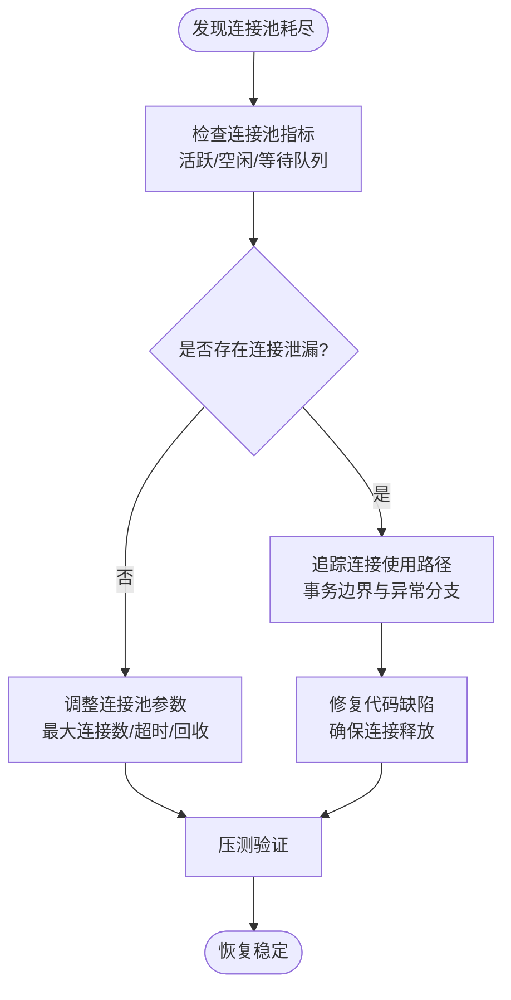
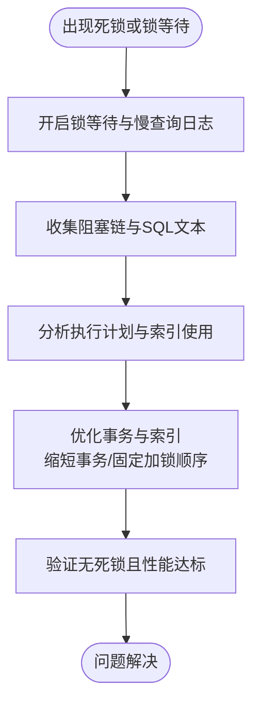
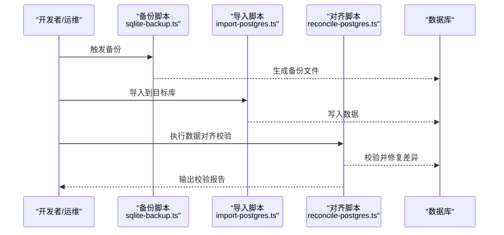

# 数据库问题

<cite>
**本文引用的文件**   
- [drizzle.config.ts](file://drizzle.config.ts)
- [docker-compose.dev.yml](file://docker-compose.dev.yml)
- [docker-compose.prod.yml](file://docker-compose.prod.yml)
- [scripts/setup/db-migrate.ts](file://scripts/setup/db-migrate.ts)
- [scripts/migration/export-sqlite.ts](file://scripts/migration/export-sqlite.ts)
- [scripts/migration/import-postgres.ts](file://scripts/migration/import-postgres.ts)
- [scripts/migration/reconcile-postgres.ts](file://scripts/migration/reconcile-postgres.ts)
- [scripts/migration/sqlite-backup.ts](file://scripts/migration/sqlite-backup.ts)
- [server/src/index.ts](file://server/src/index.ts)
- [src/lib/db/index.ts](file://src/lib/db/index.ts)
- [src/features/auth/account-service.pg.test.ts](file://src/features/auth/account-service.pg.test.ts)
- [src/features/render/cache.pg.test.ts](file://src/features/render/cache.pg.test.ts)
- [src/features/director/runtime-repository.pg.test.ts](file://src/features/director/runtime-repository.pg.test.ts)
- [src/features/audio/runtime-repository.pg.test.ts](file://src/features/audio/runtime-repository.pg.test.ts)
- [src/features/routing/media-route-repository.pg.test.ts](file://src/features/routing/media-route-repository.pg.test.ts)
- [src/features/routing/model-route-repository.pg.test.ts](file://src/features/routing/model-route-repository.pg.test.ts)
- [src/features/credentials/provider-credential-store.pg.test.ts](file://src/features/credentials/provider-credential-store.pg.test.ts)
</cite>

## 目录
1. [简介](#简介)
2. [项目结构](#项目结构)
3. [核心组件](#核心组件)
4. [架构总览](#架构总览)
5. [详细组件分析](#详细组件分析)
6. [依赖分析](#依赖分析)
7. [性能考虑](#性能考虑)
8. [故障排查指南](#故障排查指南)
9. [结论](#结论)
10. [附录](#附录)

## 简介
本指南面向PurpleInk平台的运维与研发人员，聚焦数据库问题的定位、诊断与修复。内容覆盖连接池耗尽、死锁检测与解决、数据一致性与事务回滚、性能调优（索引与查询优化、表分区）、迁移问题处理、数据损坏修复、监控与慢查询分析、备份恢复演练等。文档以仓库中的实际配置与脚本为依据，提供可操作的步骤与检查清单。

## 项目结构
本项目使用Drizzle ORM进行数据库建模与迁移，PostgreSQL为生产数据库，SQLite用于本地开发或测试。数据库连接与迁移通过环境变量与配置文件管理，迁移脚本位于scripts目录下，服务入口在server/src/index.ts中初始化运行时环境。

图表来源 
- [server/src/index.ts](file://server/src/index.ts)
- [src/lib/db/index.ts](file://src/lib/db/index.ts)
- [drizzle.config.ts](file://drizzle.config.ts)
- [scripts/setup/db-migrate.ts](file://scripts/setup/db-migrate.ts)
- [scripts/migration/export-sqlite.ts](file://scripts/migration/export-sqlite.ts)
- [scripts/migration/import-postgres.ts](file://scripts/migration/import-postgres.ts)
- [scripts/migration/reconcile-postgres.ts](file://scripts/migration/reconcile-postgres.ts)
- [scripts/migration/sqlite-backup.ts](file://scripts/migration/sqlite-backup.ts)
- [docker-compose.dev.yml](file://docker-compose.dev.yml)
- [docker-compose.prod.yml](file://docker-compose.prod.yml)

章节来源
- [drizzle.config.ts](file://drizzle.config.ts)
- [docker-compose.dev.yml](file://docker-compose.dev.yml)
- [docker-compose.prod.yml](file://docker-compose.prod.yml)
- [scripts/setup/db-migrate.ts](file://scripts/setup/db-migrate.ts)

## 核心组件
- 数据库连接与连接池：由数据库客户端模块负责创建与管理连接池，受环境变量控制（如最大连接数、超时、空闲回收等）。
- ORM与迁移：Drizzle ORM定义模型与迁移，迁移脚本在启动或部署时执行，确保Schema一致性。
- 迁移与备份工具：提供SQLite导出、PostgreSQL导入、数据对齐与备份脚本，支持开发与生产环境的数据流转。
- 服务入口：应用启动时加载配置、初始化数据库连接、执行必要迁移并启动业务逻辑。

章节来源
- [src/lib/db/index.ts](file://src/lib/db/index.ts)
- [drizzle.config.ts](file://drizzle.config.ts)
- [scripts/setup/db-migrate.ts](file://scripts/setup/db-migrate.ts)
- [scripts/migration/export-sqlite.ts](file://scripts/migration/export-sqlite.ts)
- [scripts/migration/import-postgres.ts](file://scripts/migration/import-postgres.ts)
- [scripts/migration/reconcile-postgres.ts](file://scripts/migration/reconcile-postgres.ts)
- [scripts/migration/sqlite-backup.ts](file://scripts/migration/sqlite-backup.ts)
- [server/src/index.ts](file://server/src/index.ts)

## 架构总览
下图展示应用、数据库客户端、ORM与迁移、以及容器编排之间的关系。

图表来源 
- [server/src/index.ts](file://server/src/index.ts)
- [src/lib/db/index.ts](file://src/lib/db/index.ts)
- [drizzle.config.ts](file://drizzle.config.ts)
- [scripts/setup/db-migrate.ts](file://scripts/setup/db-migrate.ts)
- [scripts/migration/export-sqlite.ts](file://scripts/migration/export-sqlite.ts)
- [scripts/migration/import-postgres.ts](file://scripts/migration/import-postgres.ts)
- [scripts/migration/reconcile-postgres.ts](file://scripts/migration/reconcile-postgres.ts)
- [scripts/migration/sqlite-backup.ts](file://scripts/migration/sqlite-backup.ts)
- [docker-compose.dev.yml](file://docker-compose.dev.yml)
- [docker-compose.prod.yml](file://docker-compose.prod.yml)

## 详细组件分析

### 连接池与连接泄漏排查
- 连接池配置要点
  - 最大连接数：根据并发请求与单事务耗时估算，避免过小导致排队、过大导致资源争用。
  - 连接超时与空闲回收：设置合理的获取连接超时、空闲连接回收时间，防止连接长期占用。
  - 重试与熔断：对瞬时错误（如连接失败）进行有限重试，避免雪崩。
- 连接泄漏检测
  - 观察连接数曲线与活跃连接时长，识别长时间未释放的连接。
  - 在关键路径增加连接生命周期日志，确认try/finally或事务边界是否正确关闭连接。
- 常见原因
  - 事务未正确提交或回滚。
  - 异常分支未释放连接。
  - 批量操作未分批，导致连接持有时间过长。
- 优化建议
  - 缩短事务范围，拆分长事务。
  - 限制并发度，使用队列或限流保护数据库。
  - 引入连接池监控指标（活跃、空闲、等待队列长度）。

章节来源
- [src/lib/db/index.ts](file://src/lib/db/index.ts)
- [docker-compose.dev.yml](file://docker-compose.dev.yml)
- [docker-compose.prod.yml](file://docker-compose.prod.yml)

### 死锁检测与解决
- 事务隔离级别
  - 选择合适的事务隔离级别，避免不必要的锁升级与宽范围扫描。
- 锁等待分析
  - 查看锁等待与阻塞链，定位持有锁的会话与SQL。
  - 关注大事务、全表扫描、缺少索引导致的锁竞争。
- 死锁预防策略
  - 固定访问顺序，避免交叉加锁。
  - 减少长事务，拆分为短事务。
  - 合理设计索引，避免锁升级。
- 快速处置
  - 终止阻塞会话，清理临时对象。
  - 回滚冲突事务，重试关键操作。

章节来源
- [src/features/auth/account-service.pg.test.ts](file://src/features/auth/account-service.pg.test.ts)
- [src/features/render/cache.pg.test.ts](file://src/features/render/cache.pg.test.ts)
- [src/features/director/runtime-repository.pg.test.ts](file://src/features/director/runtime-repository.pg.test.ts)
- [src/features/audio/runtime-repository.pg.test.ts](file://src/features/audio/runtime-repository.pg.test.ts)
- [src/features/routing/media-route-repository.pg.test.ts](file://src/features/routing/media-route-repository.pg.test.ts)
- [src/features/routing/model-route-repository.pg.test.ts](file://src/features/routing/model-route-repository.pg.test.ts)
- [src/features/credentials/provider-credential-store.pg.test.ts](file://src/features/credentials/provider-credential-store.pg.test.ts)

### 数据一致性与事务回滚
- 事务边界
  - 明确事务开始与结束点，确保异常时回滚。
- 数据校验
  - 在写入前进行约束与业务规则校验，避免脏数据进入。
- 备份恢复
  - 定期备份，验证恢复流程；迁移前后进行数据一致性校验。

章节来源
- [scripts/setup/db-migrate.ts](file://scripts/setup/db-migrate.ts)
- [scripts/migration/export-sqlite.ts](file://scripts/migration/export-sqlite.ts)
- [scripts/migration/import-postgres.ts](file://scripts/migration/import-postgres.ts)
- [scripts/migration/reconcile-postgres.ts](file://scripts/migration/reconcile-postgres.ts)
- [scripts/migration/sqlite-backup.ts](file://scripts/migration/sqlite-backup.ts)

### 性能调优（索引、查询、分区）
- 索引优化
  - 针对高频查询条件建立索引，避免选择性差的索引。
  - 复合索引顺序按查询过滤与排序字段设计。
- 查询优化
  - 避免SELECT *，只取必要字段。
  - 减少子查询与复杂JOIN，必要时物化视图或缓存。
- 表分区
  - 对大表按时间或范围分区，提升查询与维护效率。
- 监控与分析
  - 启用慢查询日志，定期分析Top SQL。
  - 使用EXPLAIN/ANALYZE评估执行计划。

章节来源
- [drizzle.config.ts](file://drizzle.config.ts)
- [src/lib/db/index.ts](file://src/lib/db/index.ts)

### 迁移问题处理
- 常见问题
  - 迁移版本不一致、依赖缺失、数据不兼容。
- 处理步骤
  - 核对迁移脚本顺序与依赖。
  - 在预生产环境先行验证。
  - 回滚策略与数据补偿脚本准备。
- 工具使用
  - 使用迁移脚本执行与校验，必要时使用导入导出工具进行数据对齐。

章节来源
- [scripts/setup/db-migrate.ts](file://scripts/setup/db-migrate.ts)
- [scripts/migration/export-sqlite.ts](file://scripts/migration/export-sqlite.ts)
- [scripts/migration/import-postgres.ts](file://scripts/migration/import-postgres.ts)
- [scripts/migration/reconcile-postgres.ts](file://scripts/migration/reconcile-postgres.ts)

### 数据损坏修复
- 检测手段
  - 运行完整性检查与校验和比对。
  - 分析错误日志与异常堆栈。
- 修复流程
  - 从最近可用备份恢复。
  - 应用增量日志或补偿脚本。
  - 验证数据一致性与业务可用性。

章节来源
- [scripts/migration/sqlite-backup.ts](file://scripts/migration/sqlite-backup.ts)
- [scripts/migration/reconcile-postgres.ts](file://scripts/migration/reconcile-postgres.ts)

## 依赖分析
- 组件耦合
  - 应用服务依赖数据库客户端，客户端依赖ORM与迁移配置。
  - 迁移与备份脚本独立于运行时，但需与Schema版本一致。
- 外部依赖
  - PostgreSQL与SQLite驱动、Drizzle ORM、容器编排工具。
- 潜在循环依赖
  - 确保迁移脚本不反向依赖运行时逻辑。

图表来源 
- [server/src/index.ts](file://server/src/index.ts)
- [src/lib/db/index.ts](file://src/lib/db/index.ts)
- [drizzle.config.ts](file://drizzle.config.ts)
- [scripts/setup/db-migrate.ts](file://scripts/setup/db-migrate.ts)
- [scripts/migration/export-sqlite.ts](file://scripts/migration/export-sqlite.ts)
- [scripts/migration/import-postgres.ts](file://scripts/migration/import-postgres.ts)
- [scripts/migration/reconcile-postgres.ts](file://scripts/migration/reconcile-postgres.ts)
- [scripts/migration/sqlite-backup.ts](file://scripts/migration/sqlite-backup.ts)

章节来源
- [server/src/index.ts](file://server/src/index.ts)
- [src/lib/db/index.ts](file://src/lib/db/index.ts)
- [drizzle.config.ts](file://drizzle.config.ts)
- [scripts/setup/db-migrate.ts](file://scripts/setup/db-migrate.ts)

## 性能考虑
- 连接池参数调优：根据负载与延迟目标调整最大连接数、超时与回收策略。
- 事务粒度控制：尽量缩小事务范围，避免长事务引发锁竞争与连接占用。
- 索引与查询：优先优化热点查询，减少全表扫描与不必要JOIN。
- 监控与告警：建立连接池、慢查询、锁等待、事务时延等指标的监控与告警。
- 容量规划：依据峰值QPS与平均响应时间预估数据库资源需求。

[本节为通用指导，不直接分析具体文件]

## 故障排查指南

### 连接池耗尽排查流程

章节来源
- [src/lib/db/index.ts](file://src/lib/db/index.ts)
- [docker-compose.dev.yml](file://docker-compose.dev.yml)
- [docker-compose.prod.yml](file://docker-compose.prod.yml)

### 死锁检测与解决流程

章节来源
- [src/features/auth/account-service.pg.test.ts](file://src/features/auth/account-service.pg.test.ts)
- [src/features/render/cache.pg.test.ts](file://src/features/render/cache.pg.test.ts)
- [src/features/director/runtime-repository.pg.test.ts](file://src/features/director/runtime-repository.pg.test.ts)
- [src/features/audio/runtime-repository.pg.test.ts](file://src/features/audio/runtime-repository.pg.test.ts)
- [src/features/routing/media-route-repository.pg.test.ts](file://src/features/routing/media-route-repository.pg.test.ts)
- [src/features/routing/model-route-repository.pg.test.ts](file://src/features/routing/model-route-repository.pg.test.ts)
- [src/features/credentials/provider-credential-store.pg.test.ts](file://src/features/credentials/provider-credential-store.pg.test.ts)

### 数据一致性与备份恢复演练

章节来源
- [scripts/migration/sqlite-backup.ts](file://scripts/migration/sqlite-backup.ts)
- [scripts/migration/import-postgres.ts](file://scripts/migration/import-postgres.ts)
- [scripts/migration/reconcile-postgres.ts](file://scripts/migration/reconcile-postgres.ts)

### 慢查询分析与优化
- 启用慢查询日志，记录超过阈值的SQL。
- 使用EXPLAIN/ANALYZE分析执行计划，识别全表扫描与低效JOIN。
- 针对性添加或调整索引，减少扫描行数。
- 拆分复杂查询，采用分页或物化结果。

章节来源
- [drizzle.config.ts](file://drizzle.config.ts)
- [src/lib/db/index.ts](file://src/lib/db/index.ts)

## 结论
通过系统化的连接池管理、死锁预防、事务与数据一致性保障、性能调优与迁移治理，PurpleInk平台能够显著提升数据库稳定性与可维护性。建议结合监控与演练，形成闭环的问题发现与处理能力。

[本节为总结，不直接分析具体文件]

## 附录
- 常用命令与脚本
  - 执行迁移：参考迁移脚本路径与用法。
  - 备份与恢复：使用备份与导入脚本进行数据流转。
- 环境变量与配置
  - 数据库连接参数、连接池大小、超时与回收策略。
- 监控指标
  - 连接池活跃/空闲/等待、慢查询数量、锁等待时长、事务时延。

章节来源
- [scripts/setup/db-migrate.ts](file://scripts/setup/db-migrate.ts)
- [scripts/migration/export-sqlite.ts](file://scripts/migration/export-sqlite.ts)
- [scripts/migration/import-postgres.ts](file://scripts/migration/import-postgres.ts)
- [scripts/migration/reconcile-postgres.ts](file://scripts/migration/reconcile-postgres.ts)
- [scripts/migration/sqlite-backup.ts](file://scripts/migration/sqlite-backup.ts)
- [drizzle.config.ts](file://drizzle.config.ts)
- [src/lib/db/index.ts](file://src/lib/db/index.ts)