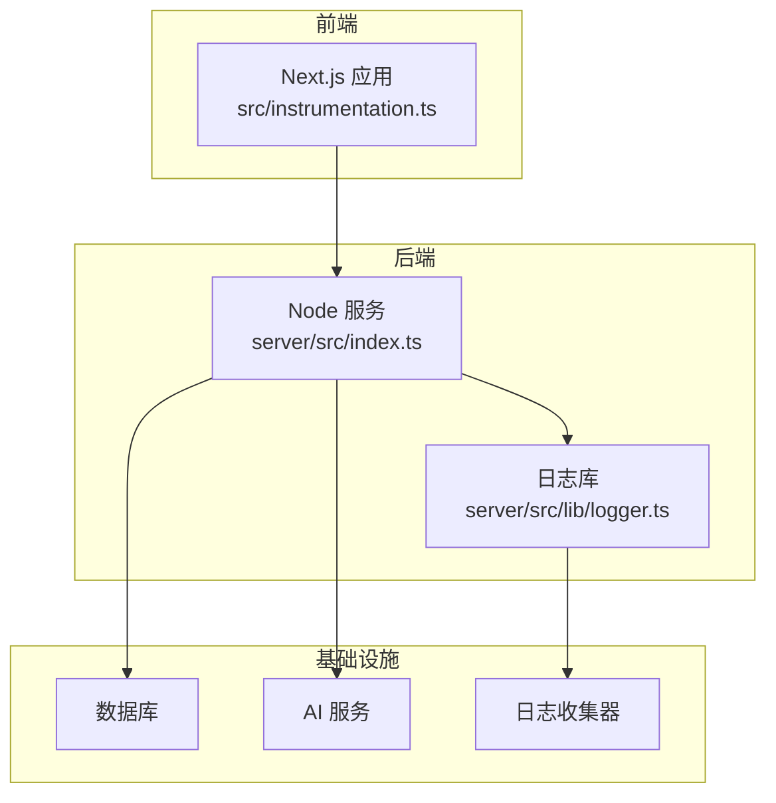
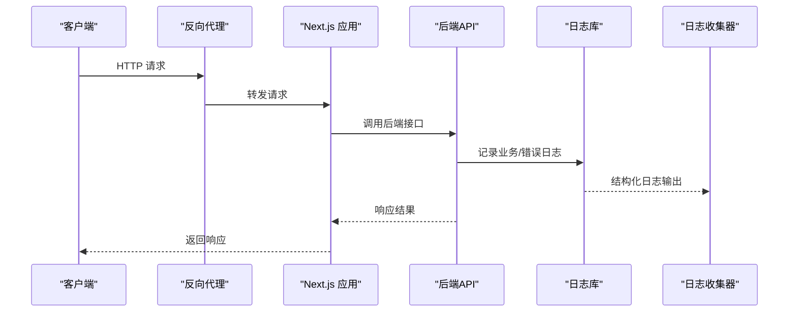
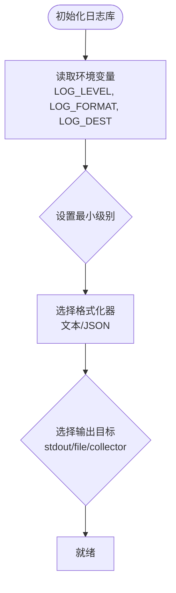
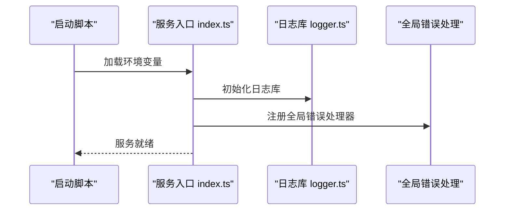
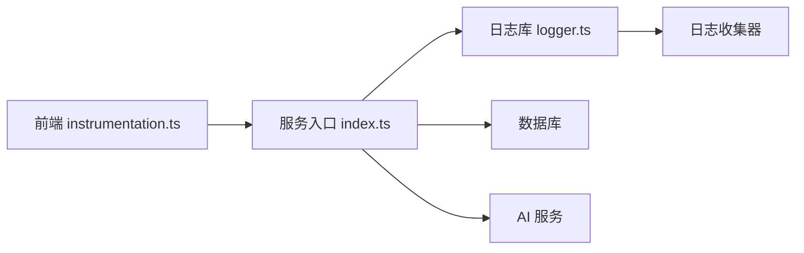

# 日志分析

<cite>
**本文引用的文件**   
- [server/src/lib/logger.ts](file://server/src/lib/logger.ts)
- [server/src/index.ts](file://server/src/index.ts)
- [server/package.json](file://server/package.json)
- [src/instrumentation.ts](file://src/instrumentation.ts)
- [next.config.ts](file://next.config.ts)
- [docker-compose.dev.yml](file://docker-compose.dev.yml)
- [docker-compose.prod.yml](file://docker-compose.prod.yml)
- [server/Dockerfile](file://server/Dockerfile)
- [deploy/reverse-proxy/entrypoint.sh](file://deploy/reverse-proxy/entrypoint.sh)
</cite>

## 目录
1. [简介](#简介)
2. [项目结构](#项目结构)
3. [核心组件](#核心组件)
4. [架构总览](#架构总览)
5. [详细组件分析](#详细组件分析)
6. [依赖关系分析](#依赖关系分析)
7. [性能考虑](#性能考虑)
8. [故障排查指南](#故障排查指南)
9. [结论](#结论)
10. [附录](#附录)

## 简介
本指南面向PurpleInk平台的运维与研发人员，系统化说明如何配置、查看与分析平台日志。内容覆盖：
- 日志级别设置（debug、info、warn、error）
- 日志格式规范与结构化字段
- 日志文件位置与输出目标（控制台、文件、外部收集器）
- 应用日志、API请求日志、数据库查询日志、AI服务调用日志的查看方法
- 关键日志模式识别、错误堆栈分析、性能瓶颈定位
- 日志轮转配置、日志收集策略与监控告警集成方案

## 项目结构
PurpleInk采用前后端分离与多进程部署：
- 前端Next.js应用（src/）
- 后端Node服务（server/）
- 反向代理与容器编排（deploy/、docker-compose.*）

日志相关的关键位置：
- 服务端日志库与初始化：server/src/lib/logger.ts、server/src/index.ts
- Next.js运行时与中间件：src/instrumentation.ts、next.config.ts
- 容器化与运行环境：server/Dockerfile、docker-compose.*、deploy/reverse-proxy/entrypoint.sh

**图表来源** 
- [src/instrumentation.ts](file://src/instrumentation.ts)
- [server/src/index.ts](file://server/src/index.ts)
- [server/src/lib/logger.ts](file://server/src/lib/logger.ts)

**章节来源**
- [server/src/lib/logger.ts](file://server/src/lib/logger.ts)
- [server/src/index.ts](file://server/src/index.ts)
- [src/instrumentation.ts](file://src/instrumentation.ts)
- [next.config.ts](file://next.config.ts)

## 核心组件
- 日志库（server/src/lib/logger.ts）：提供统一的日志接口、级别控制、格式化与输出目标管理。
- 服务入口（server/src/index.ts）：启动时加载环境变量、初始化日志库、注册全局错误处理与请求链路追踪。
- 前端观测（src/instrumentation.ts）：在Next.js生命周期中注入应用级日志与指标上报。
- 构建与运行（server/package.json、server/Dockerfile、docker-compose.*、deploy/reverse-proxy/entrypoint.sh）：定义依赖、镜像构建、容器启动参数与环境变量注入。

**章节来源**
- [server/src/lib/logger.ts](file://server/src/lib/logger.ts)
- [server/src/index.ts](file://server/src/index.ts)
- [src/instrumentation.ts](file://src/instrumentation.ts)
- [server/package.json](file://server/package.json)
- [server/Dockerfile](file://server/Dockerfile)
- [docker-compose.dev.yml](file://docker-compose.dev.yml)
- [docker-compose.prod.yml](file://docker-compose.prod.yml)
- [deploy/reverse-proxy/entrypoint.sh](file://deploy/reverse-proxy/entrypoint.sh)

## 架构总览
下图展示从请求进入反向代理到后端服务处理、日志输出与收集的完整链路。

**图表来源** 
- [deploy/reverse-proxy/entrypoint.sh](file://deploy/reverse-proxy/entrypoint.sh)
- [src/instrumentation.ts](file://src/instrumentation.ts)
- [server/src/index.ts](file://server/src/index.ts)
- [server/src/lib/logger.ts](file://server/src/lib/logger.ts)

## 详细组件分析

### 日志库与级别控制（server/src/lib/logger.ts）
- 功能要点
  - 统一日志接口：支持不同级别（debug、info、warn、error）
  - 级别开关：通过环境变量控制最小输出级别
  - 格式化：时间戳、级别、模块名、上下文键值对
  - 输出目标：控制台、文件、或外部收集器（如JSON行式输出）
- 级别设置建议
  - 开发环境：debug
  - 预发环境：info
  - 生产环境：warn 或 error（按需开启info）
- 结构化字段建议
  - level、timestamp、service、module、traceId、spanId、msg、context

**图表来源** 
- [server/src/lib/logger.ts](file://server/src/lib/logger.ts)

**章节来源**
- [server/src/lib/logger.ts](file://server/src/lib/logger.ts)

### 服务入口与全局日志（server/src/index.ts）
- 启动流程
  - 加载环境变量（包括日志级别、输出目标、采集地址等）
  - 初始化日志库并绑定全局错误处理器
  - 注册请求链路追踪（traceId/spanId）以便跨模块关联日志
- 关键行为
  - 将HTTP请求上下文注入日志（路径、方法、用户标识、耗时）
  - 捕获未处理异常并输出错误堆栈

**图表来源** 
- [server/src/index.ts](file://server/src/index.ts)
- [server/src/lib/logger.ts](file://server/src/lib/logger.ts)

**章节来源**
- [server/src/index.ts](file://server/src/index.ts)
- [server/src/lib/logger.ts](file://server/src/lib/logger.ts)

### 前端观测与日志（src/instrumentation.ts）
- 作用
  - 在Next.js生命周期中注入应用级日志（页面加载、路由切换、错误边界）
  - 可选上报前端性能指标与错误堆栈
- 使用建议
  - 仅在生产环境启用必要日志，避免过多噪声
  - 结合traceId将前端与后端日志串联

**章节来源**
- [src/instrumentation.ts](file://src/instrumentation.ts)

### 构建与运行环境（server/package.json、server/Dockerfile、docker-compose.*、deploy/reverse-proxy/entrypoint.sh）
- 依赖与脚本
  - server/package.json：声明日志相关依赖与构建脚本
- 镜像与启动
  - server/Dockerfile：安装依赖、拷贝代码、暴露端口
  - docker-compose.*：定义服务、环境变量、卷挂载（日志持久化）
  - deploy/reverse-proxy/entrypoint.sh：反向代理启动前准备（证书、环境变量）

**章节来源**
- [server/package.json](file://server/package.json)
- [server/Dockerfile](file://server/Dockerfile)
- [docker-compose.dev.yml](file://docker-compose.dev.yml)
- [docker-compose.prod.yml](file://docker-compose.prod.yml)
- [deploy/reverse-proxy/entrypoint.sh](file://deploy/reverse-proxy/entrypoint.sh)

## 依赖关系分析
- 模块耦合
  - 服务入口依赖日志库进行统一输出
  - 前端instrumentation与后端通过traceId关联
- 外部依赖
  - 数据库驱动与ORM可能自带SQL日志开关
  - AI服务SDK通常有调试日志开关
- 潜在循环依赖
  - 确保日志库不反向依赖业务模块

**图表来源** 
- [server/src/index.ts](file://server/src/index.ts)
- [server/src/lib/logger.ts](file://server/src/lib/logger.ts)
- [src/instrumentation.ts](file://src/instrumentation.ts)

**章节来源**
- [server/src/index.ts](file://server/src/index.ts)
- [server/src/lib/logger.ts](file://server/src/lib/logger.ts)
- [src/instrumentation.ts](file://src/instrumentation.ts)

## 性能考虑
- 日志级别与吞吐
  - 生产环境默认warn/error，仅在问题复现时临时提升为info/debug
- 结构化输出
  - JSON行式输出便于高效解析与索引
- I/O开销
  - 避免同步写盘；优先stdout并由收集器异步落盘
- 采样与限流
  - 高频事件（如心跳、健康检查）启用采样
- 链路追踪
  - 合理分配traceId/spanId，减少重复字段体积

[本节为通用指导，无需特定文件引用]

## 故障排查指南

### 查看应用日志
- 本地开发
  - 查看控制台输出（stdout），过滤级别与关键字
- 容器环境
  - 使用docker logs或编排工具日志面板
- 集中收集
  - 通过收集器检索JSON结构化日志

**章节来源**
- [server/src/lib/logger.ts](file://server/src/lib/logger.ts)
- [server/src/index.ts](file://server/src/index.ts)

### 查看API请求日志
- 关注字段
  - method、path、status、duration、userId、traceId
- 常见问题
  - 超时、鉴权失败、参数校验错误、上游服务不可用

**章节来源**
- [server/src/index.ts](file://server/src/index.ts)
- [server/src/lib/logger.ts](file://server/src/lib/logger.ts)

### 查看数据库查询日志
- 开关方式
  - 通过数据库驱动或ORM的环境变量启用SQL日志
- 关注点
  - 慢查询、连接池耗尽、事务回滚、锁等待

**章节来源**
- [server/src/index.ts](file://server/src/index.ts)

### 查看AI服务调用日志
- 关注字段
  - provider、model、requestId、latency、tokenUsage、errorCode
- 常见问题
  - 配额不足、模型限流、网络超时、响应格式异常

**章节来源**
- [server/src/index.ts](file://server/src/index.ts)

### 关键日志模式识别
- 错误堆栈
  - 以“Error”、“Exception”开头，包含堆栈轨迹
- 重试与熔断
  - 出现“retry”、“circuit breaker”关键词
- 资源告警
  - “OOM”、“disk full”、“connection pool exhausted”

**章节来源**
- [server/src/lib/logger.ts](file://server/src/lib/logger.ts)

### 性能瓶颈定位
- 步骤
  - 定位高耗时API（duration字段）
  - 关联traceId查看下游依赖耗时
  - 检查数据库慢查询与AI服务延迟
- 手段
  - 启用info级别并采样高频请求
  - 导出热点链路至APM系统

**章节来源**
- [server/src/index.ts](file://server/src/index.ts)
- [server/src/lib/logger.ts](file://server/src/lib/logger.ts)

### 日志轮转配置
- 推荐方案
  - 应用只输出到stdout，由收集器负责轮转与归档
- 若直接写文件
  - 按大小与时间切分，保留N天，压缩历史文件

**章节来源**
- [server/src/lib/logger.ts](file://server/src/lib/logger.ts)
- [docker-compose.prod.yml](file://docker-compose.prod.yml)

### 日志收集策略
- 统一格式
  - JSON行式，包含level、timestamp、service、module、traceId、spanId、msg、context
- 采集工具
  - Filebeat/Fluent Bit/Vector等，按服务标签聚合
- 存储与查询
  - Elasticsearch/OpenSearch + Kibana，或云原生日志服务

**章节来源**
- [server/src/lib/logger.ts](file://server/src/lib/logger.ts)
- [docker-compose.prod.yml](file://docker-compose.prod.yml)

### 监控告警集成
- 指标
  - 错误率、P95/P99延迟、队列积压、AI调用失败率
- 告警规则
  - 错误率阈值、慢查询数量、连接池使用率、磁盘空间
- 联动
  - 告警触发后自动附带最近traceId与错误堆栈摘要

**章节来源**
- [server/src/index.ts](file://server/src/index.ts)
- [server/src/lib/logger.ts](file://server/src/lib/logger.ts)

## 结论
通过统一的日志库与结构化输出，配合合理的级别控制、链路追踪与收集策略，PurpleInk平台可实现高效的日志分析与问题定位。建议在开发阶段充分使用debug信息，在生产环境保持精简且可观测的日志体系，并结合监控告警形成闭环。

[本节为总结性内容，无需特定文件引用]

## 附录

### 常用环境变量参考
- LOG_LEVEL：最小日志级别（debug、info、warn、error）
- LOG_FORMAT：输出格式（text、json）
- LOG_DEST：输出目标（stdout、file、collector）
- TRACE_ENABLED：是否启用链路追踪
- DB_LOG_LEVEL：数据库日志级别（由驱动/ORM决定）
- AI_LOG_LEVEL：AI SDK日志级别（由SDK决定）

**章节来源**
- [server/src/lib/logger.ts](file://server/src/lib/logger.ts)
- [server/src/index.ts](file://server/src/index.ts)

### 典型日志字段字典
- level：日志级别
- timestamp：时间戳（ISO 8601）
- service：服务名称
- module：模块名
- traceId：链路追踪ID
- spanId：跨度ID
- msg：消息体
- context：上下文键值对（如userId、projectId、requestId）

**章节来源**
- [server/src/lib/logger.ts](file://server/src/lib/logger.ts)