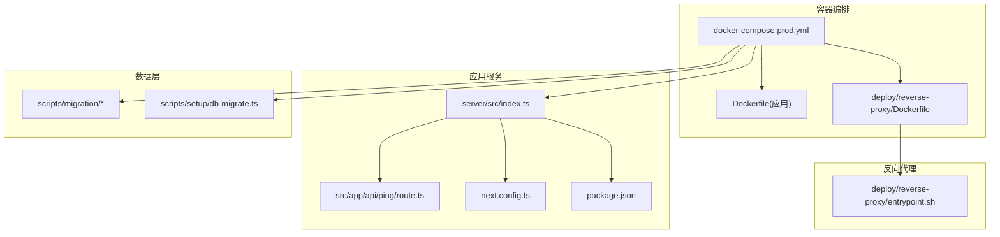
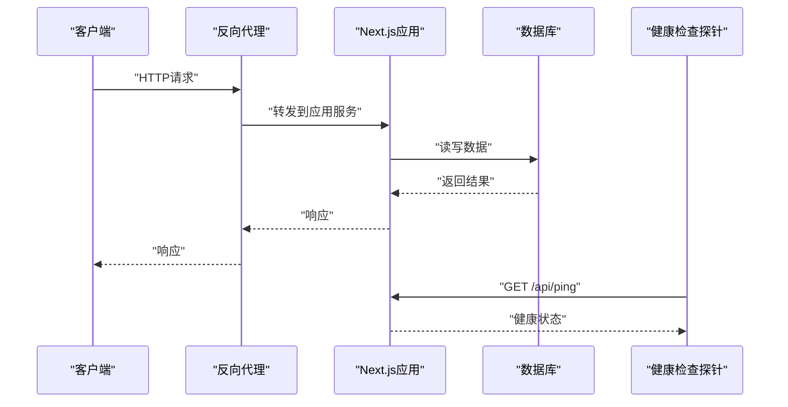
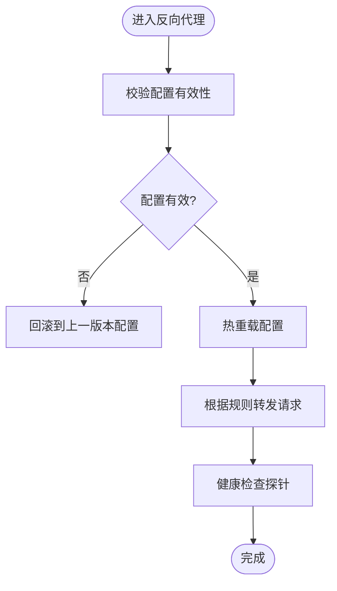
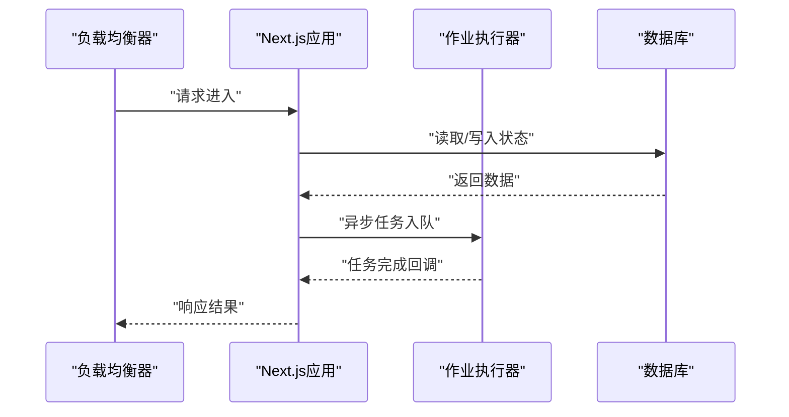
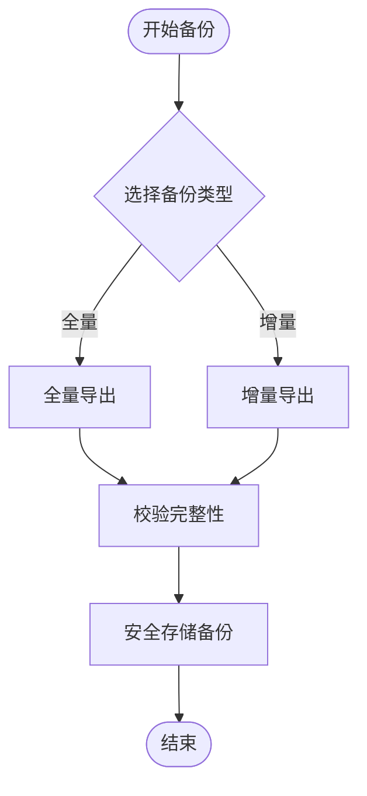
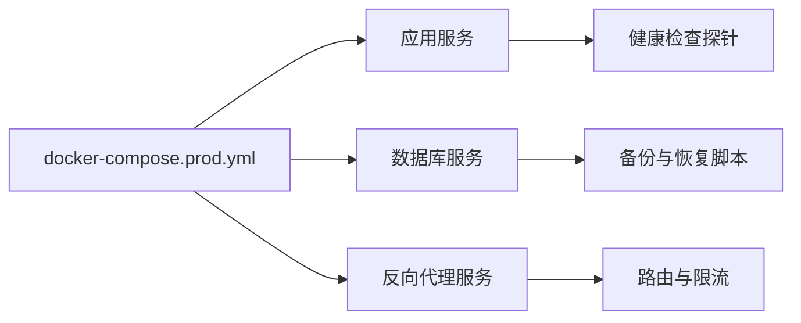
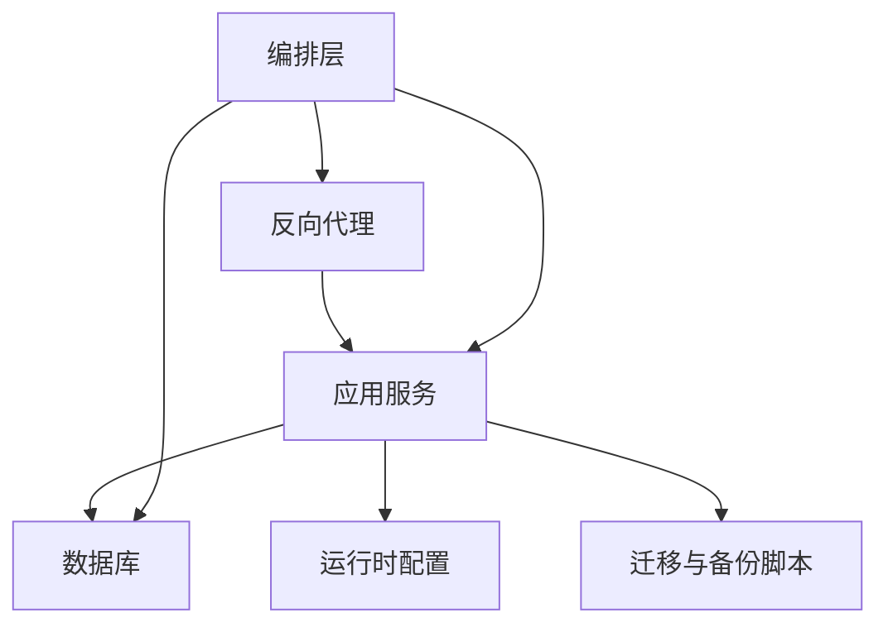

# 紧急修复与回滚

<cite>
**本文引用的文件**   
- [docker-compose.prod.yml](file://docker-compose.prod.yml)
- [Dockerfile](file://Dockerfile)
- [deploy/reverse-proxy/Dockerfile](file://deploy/reverse-proxy/Dockerfile)
- [deploy/reverse-proxy/entrypoint.sh](file://deploy/reverse-proxy/entrypoint.sh)
- [scripts/migration/sqlite-backup.ts](file://scripts/migration/sqlite-backup.ts)
- [scripts/migration/export-sqlite.ts](file://scripts/migration/export-sqlite.ts)
- [scripts/migration/import-postgres.ts](file://scripts/migration/import-postgres.ts)
- [scripts/setup/db-migrate.ts](file://scripts/setup/db-migrate.ts)
- [server/src/index.ts](file://server/src/index.ts)
- [src/app/api/ping/route.ts](file://src/app/api/ping/route.ts)
- [next.config.ts](file://next.config.ts)
- [package.json](file://package.json)
</cite>

## 目录
1. [简介](#简介)
2. [项目结构](#项目结构)
3. [核心组件](#核心组件)
4. [架构总览](#架构总览)
5. [详细组件分析](#详细组件分析)
6. [依赖分析](#依赖分析)
7. [性能考虑](#性能考虑)
8. [故障排查指南](#故障排查指南)
9. [结论](#结论)
10. [附录](#附录)

## 简介
本指南面向PurpleInk平台的生产运维与SRE团队，聚焦“紧急修复与回滚”的标准化流程。内容覆盖：
- 生产环境紧急修复：热修复、灰度发布、快速回滚
- 数据备份与恢复：全量备份、增量备份、灾难恢复
- 服务降级策略：功能开关、流量切换、熔断保护
- 容器化环境的紧急处理：镜像回滚、配置热更新、健康检查恢复
- 应急响应预案、事故复盘模板、预防措施制定

本指南基于仓库中的部署脚本、迁移工具、反向代理与Next.js应用入口等实现进行编排，确保操作可落地、可审计、可回滚。

## 项目结构
从运维视角，关键目录与文件如下：
- 容器编排与镜像构建：根级Dockerfile、docker-compose.prod.yml
- 反向代理与入口：deploy/reverse-proxy（Dockerfile、entrypoint.sh）
- 数据库迁移与备份：scripts/migration、scripts/setup
- 应用入口与健康检查：server/src/index.ts、src/app/api/ping/route.ts
- 运行时配置与依赖：next.config.ts、package.json

**图表来源** 
- [docker-compose.prod.yml](file://docker-compose.prod.yml)
- [Dockerfile](file://Dockerfile)
- [deploy/reverse-proxy/Dockerfile](file://deploy/reverse-proxy/Dockerfile)
- [deploy/reverse-proxy/entrypoint.sh](file://deploy/reverse-proxy/entrypoint.sh)
- [server/src/index.ts](file://server/src/index.ts)
- [src/app/api/ping/route.ts](file://src/app/api/ping/route.ts)
- [next.config.ts](file://next.config.ts)
- [package.json](file://package.json)

**章节来源**
- [docker-compose.prod.yml](file://docker-compose.prod.yml)
- [Dockerfile](file://Dockerfile)
- [deploy/reverse-proxy/Dockerfile](file://deploy/reverse-proxy/Dockerfile)
- [deploy/reverse-proxy/entrypoint.sh](file://deploy/reverse-proxy/entrypoint.sh)
- [server/src/index.ts](file://server/src/index.ts)
- [src/app/api/ping/route.ts](file://src/app/api/ping/route.ts)
- [next.config.ts](file://next.config.ts)
- [package.json](file://package.json)

## 核心组件
- 反向代理层：负责外部请求接入、路由转发、基础鉴权与限流能力（由反向代理镜像与入口脚本提供）。
- Next.js应用层：业务API与页面渲染，暴露健康检查端点用于探针探测。
- 数据层：SQLite/PostgreSQL双栈支持，提供迁移与备份恢复脚本。
- 编排层：通过docker-compose管理多服务生命周期、环境变量与卷挂载。

这些组件共同构成“接入—处理—存储”的闭环，为紧急修复与回滚提供基础设施支撑。

**章节来源**
- [deploy/reverse-proxy/Dockerfile](file://deploy/reverse-proxy/Dockerfile)
- [deploy/reverse-proxy/entrypoint.sh](file://deploy/reverse-proxy/entrypoint.sh)
- [server/src/index.ts](file://server/src/index.ts)
- [src/app/api/ping/route.ts](file://src/app/api/ping/route.ts)
- [scripts/migration/sqlite-backup.ts](file://scripts/migration/sqlite-backup.ts)
- [scripts/migration/export-sqlite.ts](file://scripts/migration/export-sqlite.ts)
- [scripts/migration/import-postgres.ts](file://scripts/migration/import-postgres.ts)
- [scripts/setup/db-migrate.ts](file://scripts/setup/db-migrate.ts)

## 架构总览
下图展示生产环境的关键交互路径，包括反向代理、应用服务、数据库以及健康检查探针。

**图表来源** 
- [deploy/reverse-proxy/Dockerfile](file://deploy/reverse-proxy/Dockerfile)
- [deploy/reverse-proxy/entrypoint.sh](file://deploy/reverse-proxy/entrypoint.sh)
- [server/src/index.ts](file://server/src/index.ts)
- [src/app/api/ping/route.ts](file://src/app/api/ping/route.ts)

## 详细组件分析

### 反向代理层（Nginx/自定义镜像）
- 职责：统一入口、TLS终止、静态资源缓存、基础鉴权、限流与访问控制。
- 紧急处理要点：
  - 配置热更新：通过entrypoint或配置卷挂载实现无重启更新。
  - 快速回滚：将镜像版本或配置文件回退至上一稳定版本。
  - 健康检查：结合探针对上游应用进行可用性检测。

**图表来源** 
- [deploy/reverse-proxy/Dockerfile](file://deploy/reverse-proxy/Dockerfile)
- [deploy/reverse-proxy/entrypoint.sh](file://deploy/reverse-proxy/entrypoint.sh)

**章节来源**
- [deploy/reverse-proxy/Dockerfile](file://deploy/reverse-proxy/Dockerfile)
- [deploy/reverse-proxy/entrypoint.sh](file://deploy/reverse-proxy/entrypoint.sh)

### 应用服务（Next.js）
- 职责：业务逻辑、API路由、页面渲染、队列与任务执行。
- 紧急处理要点：
  - 热修复：仅替换变更模块并重启最小影响范围（如Worker或Job Runner）。
  - 灰度发布：按用户ID或租户维度逐步放量。
  - 快速回滚：回退镜像标签或Git提交，配合滚动更新。
  - 健康检查：/api/ping作为探针端点，用于负载均衡与健康探测。

**图表来源** 
- [server/src/index.ts](file://server/src/index.ts)
- [src/app/api/ping/route.ts](file://src/app/api/ping/route.ts)

**章节来源**
- [server/src/index.ts](file://server/src/index.ts)
- [src/app/api/ping/route.ts](file://src/app/api/ping/route.ts)

### 数据层（SQLite/PostgreSQL）
- 职责：持久化存储、事务保障、迁移与备份恢复。
- 紧急处理要点：
  - 全量备份：导出完整快照，便于灾难恢复。
  - 增量备份：基于时间窗口或日志的增量捕获。
  - 灾难恢复：从快照或增量恢复至目标环境。
  - 迁移回滚：在失败时回滚至上一版本迁移。

**图表来源** 
- [scripts/migration/sqlite-backup.ts](file://scripts/migration/sqlite-backup.ts)
- [scripts/migration/export-sqlite.ts](file://scripts/migration/export-sqlite.ts)
- [scripts/migration/import-postgres.ts](file://scripts/migration/import-postgres.ts)
- [scripts/setup/db-migrate.ts](file://scripts/setup/db-migrate.ts)

**章节来源**
- [scripts/migration/sqlite-backup.ts](file://scripts/migration/sqlite-backup.ts)
- [scripts/migration/export-sqlite.ts](file://scripts/migration/export-sqlite.ts)
- [scripts/migration/import-postgres.ts](file://scripts/migration/import-postgres.ts)
- [scripts/setup/db-migrate.ts](file://scripts/setup/db-migrate.ts)

### 编排层（Docker Compose）
- 职责：服务定义、环境变量注入、卷挂载、网络与依赖顺序。
- 紧急处理要点：
  - 快速回滚：修改镜像标签或服务版本后重新部署。
  - 灰度发布：通过副本数与权重控制流量比例。
  - 健康检查：集成探针与重试策略，确保服务自愈。

**图表来源** 
- [docker-compose.prod.yml](file://docker-compose.prod.yml)

**章节来源**
- [docker-compose.prod.yml](file://docker-compose.prod.yml)

## 依赖分析
- 反向代理依赖应用服务的健康状态，需通过探针进行可用性判断。
- 应用服务依赖数据库连接与配置，迁移脚本需在部署前验证。
- 编排层统一管理环境变量与卷，确保配置一致性与可回滚性。

**图表来源** 
- [docker-compose.prod.yml](file://docker-compose.prod.yml)
- [next.config.ts](file://next.config.ts)
- [package.json](file://package.json)

**章节来源**
- [docker-compose.prod.yml](file://docker-compose.prod.yml)
- [next.config.ts](file://next.config.ts)
- [package.json](file://package.json)

## 性能考虑
- 反向代理启用静态资源缓存与压缩，减少应用负载。
- 应用服务采用异步任务队列，避免阻塞主线程。
- 数据库连接池与查询优化，降低延迟与锁竞争。
- 健康检查探针间隔合理设置，避免误判与雪崩。

[本节为通用指导，不直接分析具体文件]

## 故障排查指南
- 健康检查失败：
  - 检查/api/ping端点是否可达，确认应用启动状态。
  - 查看反向代理日志，确认路由与TLS配置正确。
- 数据库连接异常：
  - 验证迁移脚本执行成功，检查连接字符串与权限。
  - 使用备份脚本恢复至最近可用快照。
- 镜像回滚失败：
  - 确认镜像标签存在且可拉取，检查编排配置版本一致性。
  - 逐步回滚反向代理与应用服务，观察指标变化。

**章节来源**
- [src/app/api/ping/route.ts](file://src/app/api/ping/route.ts)
- [scripts/migration/sqlite-backup.ts](file://scripts/migration/sqlite-backup.ts)
- [scripts/setup/db-migrate.ts](file://scripts/setup/db-migrate.ts)

## 结论
通过标准化的紧急修复与回滚流程，PurpleInk平台能够在生产环境中快速响应故障、最小化影响范围并确保数据一致性。建议结合监控告警与演练机制，持续提升运维韧性与恢复效率。

[本节为总结性内容，不直接分析具体文件]

## 附录
- 应急响应预案模板：事件分级、通知链路、处置步骤、复盘要求。
- 事故复盘模板：时间线、根因分析、影响评估、改进措施。
- 预防措施清单：代码审查、自动化测试、混沌工程、容量规划。

[本节为通用指导，不直接分析具体文件]