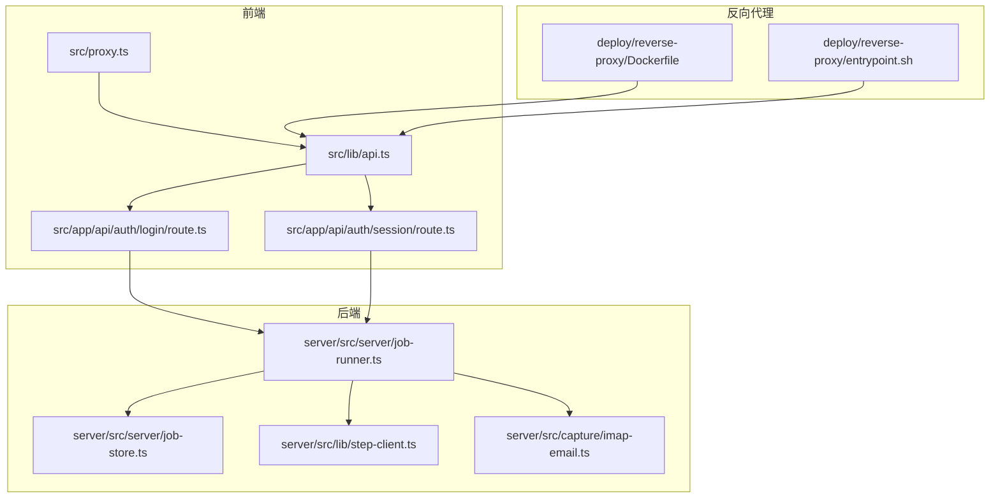
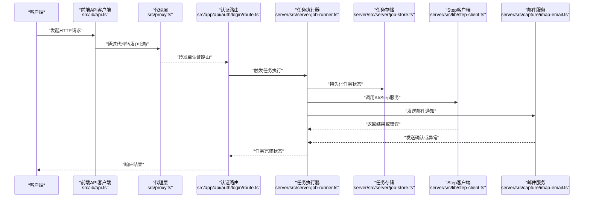
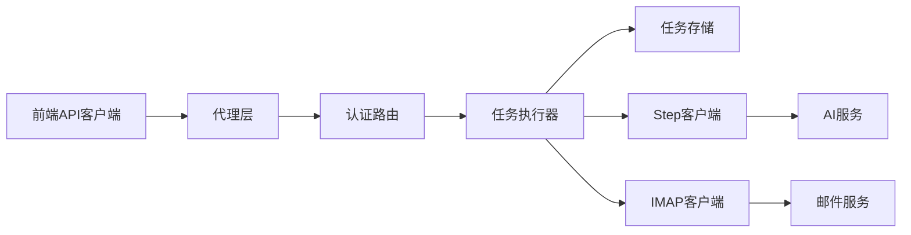

# 网络问题诊断

<cite>
**本文引用的文件**   
- [src/lib/api.ts](file://src/lib/api.ts)
- [src/proxy.ts](file://src/proxy.ts)
- [src/app/api/auth/login/route.ts](file://src/app/api/auth/login/route.ts)
- [src/app/api/auth/session/route.ts](file://src/app/api/auth/session/route.ts)
- [src/features/auth/throttle.ts](file://src/features/auth/throttle.ts)
- [src/features/director/pi-stream-bridge.ts](file://src/features/director/pi-stream-bridge.ts)
- [server/src/server/job-runner.ts](file://server/src/server/job-runner.ts)
- [server/src/server/job-store.ts](file://server/src/server/job-store.ts)
- [server/src/lib/step-client.ts](file://server/src/lib/step-client.ts)
- [server/src/capture/imap-email.ts](file://server/src/capture/imap-email.ts)
- [deploy/reverse-proxy/Dockerfile](file://deploy/reverse-proxy/Dockerfile)
- [deploy/reverse-proxy/entrypoint.sh](file://deploy/reverse-proxy/entrypoint.sh)
</cite>

## 目录
1. [简介](#简介)
2. [项目结构](#项目结构)
3. [核心组件](#核心组件)
4. [架构总览](#架构总览)
5. [详细组件分析](#详细组件分析)
6. [依赖关系分析](#依赖关系分析)
7. [性能考量](#性能考量)
8. [故障排查指南](#故障排查指南)
9. [结论](#结论)
10. [附录](#附录)

## 简介
本指南面向PurpleInk平台的运维与研发人员，聚焦网络问题的系统化诊断与修复。内容覆盖：
- API调用失败排查（超时、认证失败、限流等）
- WebSocket连接问题（连接断开、消息丢失、重连机制）
- 第三方服务超时处理（AI服务、邮件服务、存储服务等）
- 网络请求监控、连接池管理、重试策略配置、负载均衡配置
- 网络抓包工具使用、代理配置、防火墙规则设置

目标是帮助读者快速定位并解决网络相关问题，提升系统稳定性与可观测性。

## 项目结构
本项目采用前后端分离与多模块组织方式：
- 前端Next.js应用位于src目录，包含API路由、功能模块与UI组件
- 服务端逻辑位于server/src目录，包含任务执行、外部服务客户端与捕获流程
- 反向代理部署配置位于deploy/reverse-proxy目录
- 关键网络相关能力集中在lib/api.ts、proxy.ts以及各业务模块的HTTP/WebSocket客户端中

图表来源
- [src/lib/api.ts](file://src/lib/api.ts)
- [src/proxy.ts](file://src/proxy.ts)
- [src/app/api/auth/login/route.ts](file://src/app/api/auth/login/route.ts)
- [src/app/api/auth/session/route.ts](file://src/app/api/auth/session/route.ts)
- [server/src/server/job-runner.ts](file://server/src/server/job-runner.ts)
- [server/src/server/job-store.ts](file://server/src/server/job-store.ts)
- [server/src/lib/step-client.ts](file://server/src/lib/step-client.ts)
- [server/src/capture/imap-email.ts](file://server/src/capture/imap-email.ts)
- [deploy/reverse-proxy/Dockerfile](file://deploy/reverse-proxy/Dockerfile)
- [deploy/reverse-proxy/entrypoint.sh](file://deploy/reverse-proxy/entrypoint.sh)

章节来源
- [src/lib/api.ts](file://src/lib/api.ts)
- [src/proxy.ts](file://src/proxy.ts)
- [src/app/api/auth/login/route.ts](file://src/app/api/auth/login/route.ts)
- [src/app/api/auth/session/route.ts](file://src/app/api/auth/session/route.ts)
- [server/src/server/job-runner.ts](file://server/src/server/job-runner.ts)
- [server/src/server/job-store.ts](file://server/src/server/job-store.ts)
- [server/src/lib/step-client.ts](file://server/src/lib/step-client.ts)
- [server/src/capture/imap-email.ts](file://server/src/capture/imap-email.ts)
- [deploy/reverse-proxy/Dockerfile](file://deploy/reverse-proxy/Dockerfile)
- [deploy/reverse-proxy/entrypoint.sh](file://deploy/reverse-proxy/entrypoint.sh)

## 核心组件
- 统一API客户端：集中封装HTTP请求、错误处理、重试与超时控制
- 代理层：提供本地开发或生产环境的代理转发能力
- 认证路由：登录与会话校验，涉及令牌签发与验证
- 限流器：对认证接口进行频率限制，防止滥用
- 流式桥接：用于WebSocket或Server-Sent Events的实时数据推送
- 任务执行器：后台任务调度与执行，协调外部服务调用
- 任务存储：持久化任务状态与结果
- 第三方客户端：如Step函数调用、IMAP邮件收发等

章节来源
- [src/lib/api.ts](file://src/lib/api.ts)
- [src/proxy.ts](file://src/proxy.ts)
- [src/app/api/auth/login/route.ts](file://src/app/api/auth/login/route.ts)
- [src/app/api/auth/session/route.ts](file://src/app/api/auth/session/route.ts)
- [src/features/auth/throttle.ts](file://src/features/auth/throttle.ts)
- [src/features/director/pi-stream-bridge.ts](file://src/features/director/pi-stream-bridge.ts)
- [server/src/server/job-runner.ts](file://server/src/server/job-runner.ts)
- [server/src/server/job-store.ts](file://server/src/server/job-store.ts)
- [server/src/lib/step-client.ts](file://server/src/lib/step-client.ts)
- [server/src/capture/imap-email.ts](file://server/src/capture/imap-email.ts)

## 架构总览
下图展示了从前端到后端再到第三方服务的典型请求路径，包括认证、任务执行与外部调用。

图表来源
- [src/lib/api.ts](file://src/lib/api.ts)
- [src/proxy.ts](file://src/proxy.ts)
- [src/app/api/auth/login/route.ts](file://src/app/api/auth/login/route.ts)
- [server/src/server/job-runner.ts](file://server/src/server/job-runner.ts)
- [server/src/server/job-store.ts](file://server/src/server/job-store.ts)
- [server/src/lib/step-client.ts](file://server/src/lib/step-client.ts)
- [server/src/capture/imap-email.ts](file://server/src/capture/imap-email.ts)

## 详细组件分析

### API客户端与错误处理
- 职责：统一封装HTTP请求、设置超时、重试策略、解析错误码
- 关键点：
  - 超时配置应区分网络超时与服务端处理超时
  - 重试策略需考虑幂等性与退避算法
  - 错误分类：网络错误、认证错误、限流错误、服务端错误

章节来源
- [src/lib/api.ts](file://src/lib/api.ts)

### 代理层配置
- 职责：在开发与生产环境中提供请求转发、鉴权、日志记录
- 关键点：
  - 代理规则应与API路由保持一致
  - 支持HTTPS终止与证书管理
  - 可集成访问日志与错误上报

章节来源
- [src/proxy.ts](file://src/proxy.ts)
- [deploy/reverse-proxy/Dockerfile](file://deploy/reverse-proxy/Dockerfile)
- [deploy/reverse-proxy/entrypoint.sh](file://deploy/reverse-proxy/entrypoint.sh)

### 认证流程与限流
- 职责：用户登录与会话管理，防止暴力破解
- 关键点：
  - 登录接口需实现限流保护
  - 会话令牌的安全存储与刷新机制
  - 认证失败的错误信息不应泄露敏感细节

章节来源
- [src/app/api/auth/login/route.ts](file://src/app/api/auth/login/route.ts)
- [src/app/api/auth/session/route.ts](file://src/app/api/auth/session/route.ts)
- [src/features/auth/throttle.ts](file://src/features/auth/throttle.ts)

### 流式通信与WebSocket
- 职责：实现实时数据推送，如任务进度、AI生成结果
- 关键点：
  - 连接建立时的握手与鉴权
  - 心跳机制检测连接存活
  - 断线自动重连与消息队列缓冲
  - 消息顺序保证与去重

章节来源
- [src/features/director/pi-stream-bridge.ts](file://src/features/director/pi-stream-bridge.ts)

### 任务执行与外部服务调用
- 职责：协调AI服务、邮件服务、存储服务等外部依赖
- 关键点：
  - 外部服务调用的超时与重试配置
  - 错误降级与熔断机制
  - 任务状态同步与持久化

章节来源
- [server/src/server/job-runner.ts](file://server/src/server/job-runner.ts)
- [server/src/server/job-store.ts](file://server/src/server/job-store.ts)
- [server/src/lib/step-client.ts](file://server/src/lib/step-client.ts)
- [server/src/capture/imap-email.ts](file://server/src/capture/imap-email.ts)

## 依赖关系分析

图表来源
- [src/lib/api.ts](file://src/lib/api.ts)
- [src/proxy.ts](file://src/proxy.ts)
- [src/app/api/auth/login/route.ts](file://src/app/api/auth/login/route.ts)
- [server/src/server/job-runner.ts](file://server/src/server/job-runner.ts)
- [server/src/server/job-store.ts](file://server/src/server/job-store.ts)
- [server/src/lib/step-client.ts](file://server/src/lib/step-client.ts)
- [server/src/capture/imap-email.ts](file://server/src/capture/imap-email.ts)

章节来源
- [src/lib/api.ts](file://src/lib/api.ts)
- [src/proxy.ts](file://src/proxy.ts)
- [src/app/api/auth/login/route.ts](file://src/app/api/auth/login/route.ts)
- [server/src/server/job-runner.ts](file://server/src/server/job-runner.ts)
- [server/src/server/job-store.ts](file://server/src/server/job-store.ts)
- [server/src/lib/step-client.ts](file://server/src/lib/step-client.ts)
- [server/src/capture/imap-email.ts](file://server/src/capture/imap-email.ts)

## 性能考量
- 连接池管理：合理设置最大连接数、空闲超时与复用策略
- 超时配置：根据业务SLA设置合理的请求超时时间
- 重试策略：指数退避与抖动避免雪崩效应
- 缓存策略：对频繁访问的数据实施缓存减少重复请求
- 负载均衡：使用反向代理或服务网格实现流量分发

[本节为通用指导，不直接分析具体文件]

## 故障排查指南

### API调用失败排查
- 超时问题：检查网络延迟、服务端处理能力、连接池耗尽
- 认证失败：验证令牌有效性、权限配置、密钥正确性
- 限流触发：查看限流计数器、调整阈值或扩容

章节来源
- [src/lib/api.ts](file://src/lib/api.ts)
- [src/features/auth/throttle.ts](file://src/features/auth/throttle.ts)

### WebSocket连接问题
- 连接断开：检查心跳间隔、网络稳定性、代理配置
- 消息丢失：确认消息队列大小、消费者处理能力、去重逻辑
- 重连机制：实现指数退避、连接状态同步、未消费消息恢复

章节来源
- [src/features/director/pi-stream-bridge.ts](file://src/features/director/pi-stream-bridge.ts)

### 第三方服务超时处理
- AI服务：设置合理超时、启用降级模式、缓存历史结果
- 邮件服务：异步发送、失败重试、死信队列
- 存储服务：分块上传、断点续传、错误补偿

章节来源
- [server/src/lib/step-client.ts](file://server/src/lib/step-client.ts)
- [server/src/capture/imap-email.ts](file://server/src/capture/imap-email.ts)

### 网络调试方法
- 抓包工具：使用Wireshark、tcpdump捕获网络流量
- 代理配置：设置HTTP_PROXY、HTTPS_PROXY环境变量
- 防火墙规则：检查端口开放、IP白名单、安全组配置

[本节为通用指导，不直接分析具体文件]

## 结论
通过系统化的网络问题诊断方法，结合代码级的监控与错误处理，可以有效提升PurpleInk平台的稳定性与用户体验。建议在生产环境部署完善的日志收集、指标监控与告警机制，以便快速定位和解决问题。

[本节为总结性内容，不直接分析具体文件]

## 附录
- 常用命令参考
- 配置文件示例
- 监控指标定义
- 故障演练脚本

[本节为补充材料，不直接分析具体文件]