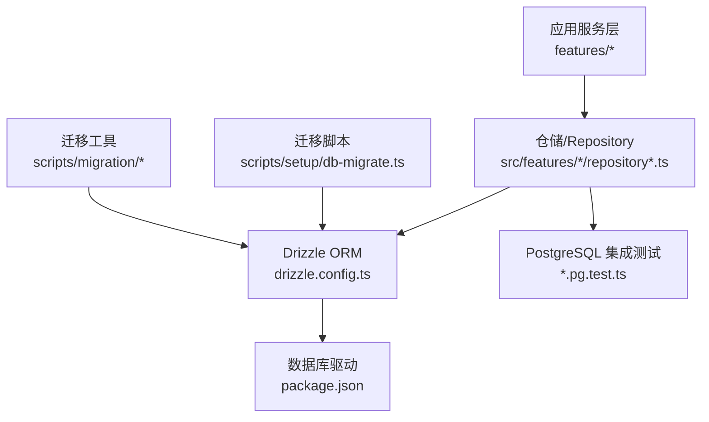
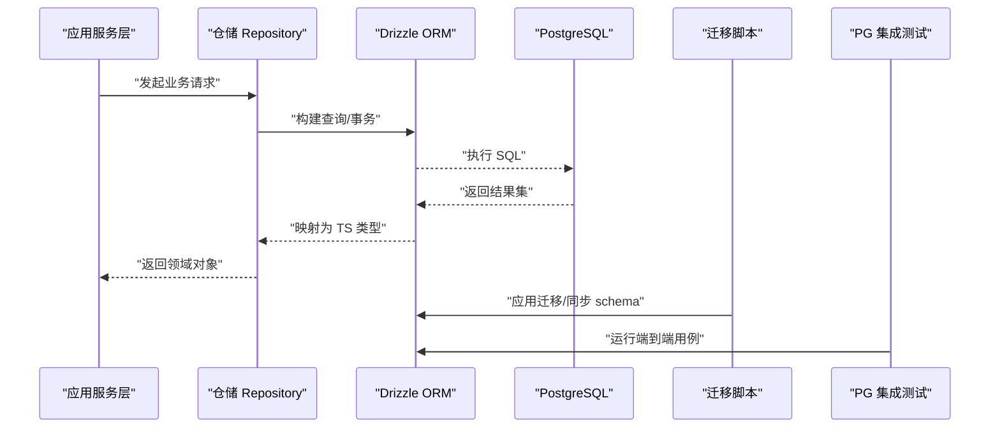
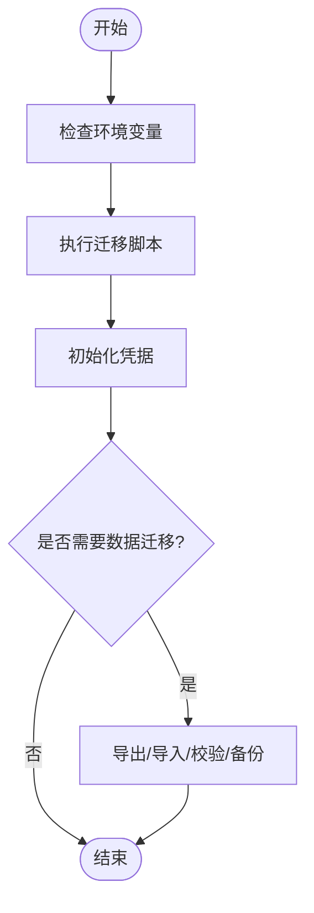
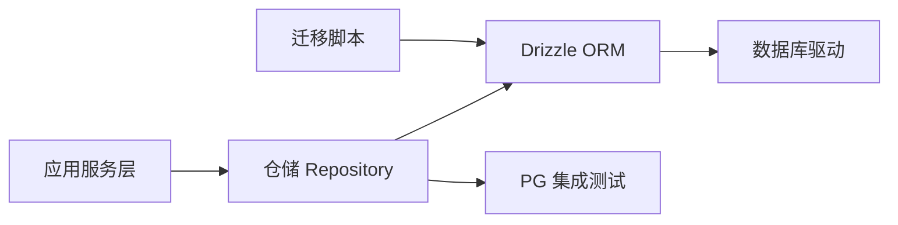

# ORM 使用

<cite>
**本文引用的文件**   
- [drizzle.config.ts](file://drizzle.config.ts)
- [package.json](file://package.json)
- [tsconfig.json](file://tsconfig.json)
- [db-migrate.ts](file://scripts/setup/db-migrate.ts)
- [bootstrap-credentials.ts](file://scripts/setup/bootstrap-credentials.ts)
- [export-sqlite.ts](file://scripts/migration/export-sqlite.ts)
- [import-postgres.ts](file://scripts/migration/import-postgres.ts)
- [reconcile-postgres.ts](file://scripts/migration/reconcile-postgres.ts)
- [sqlite-backup.ts](file://scripts/migration/sqlite-backup.ts)
- [runtime-repository.pg.test.ts](file://src/features/audio/runtime-repository.pg.test.ts)
- [provider-credential-store.pg.test.ts](file://src/features/credentials/provider-credential-store.pg.test.ts)
- [cache.pg.test.ts](file://src/features/render/cache.pg.test.ts)
- [repository.pg.test.ts](file://src/features/render/repository.pg.test.ts)
- [media-route-repository.pg.test.ts](file://src/features/routing/media-route-repository.pg.test.ts)
- [model-route-repository.pg.test.ts](file://src/features/routing/model-route-repository.pg.test.ts)
</cite>

## 目录
1. [简介](#简介)
2. [项目结构](#项目结构)
3. [核心组件](#核心组件)
4. [架构总览](#架构总览)
5. [详细组件分析](#详细组件分析)
6. [依赖关系分析](#依赖关系分析)
7. [性能考量](#性能考量)
8. [故障排查指南](#故障排查指南)
9. [结论](#结论)
10. [附录](#附录)

## 简介
本文件面向在 PurpleInk 项目中基于 Drizzle ORM 进行数据库访问的开发者，系统性阐述配置、类型定义、查询构建模式、CRUD 最佳实践、复杂查询技巧、事务处理、连接池与缓存策略、性能监控、错误处理、数据验证、迁移脚本规范、批量操作与并发控制，以及与 TypeScript 的类型系统集成和开发体验优化。文档以仓库中的实际实现为依据，提供可追溯的文件来源与图示，帮助读者快速上手并高效扩展。

## 项目结构
本项目采用“按功能域组织”的结构，Drizzle 相关代码主要分布在以下位置：
- 根级配置文件：drizzle.config.ts（ORM 配置）、package.json（依赖声明）、tsconfig.json（TS 编译选项）
- 迁移与初始化脚本：scripts/setup/db-migrate.ts、scripts/setup/bootstrap-credentials.ts
- 数据迁移工具：scripts/migration/*（导出/导入/校验/备份等）
- 领域层仓储与测试：src/features/*/repository*.ts 及 *.pg.test.ts（PostgreSQL 集成测试）

图表来源
- [drizzle.config.ts](file://drizzle.config.ts)
- [package.json](file://package.json)
- [db-migrate.ts](file://scripts/setup/db-migrate.ts)

章节来源
- [drizzle.config.ts](file://drizzle.config.ts)
- [package.json](file://package.json)
- [tsconfig.json](file://tsconfig.json)
- [db-migrate.ts](file://scripts/setup/db-migrate.ts)

## 核心组件
- 配置中心
  - drizzle.config.ts：集中管理数据库连接、迁移路径、生成器选项等。
  - package.json：声明 drizzle-orm 及其驱动依赖（如 PostgreSQL）。
  - tsconfig.json：确保 TS 编译目标与模块解析与 Drizzle 类型推断兼容。
- 迁移与初始化
  - scripts/setup/db-migrate.ts：执行 Drizzle 迁移命令，保障 schema 一致性。
  - scripts/setup/bootstrap-credentials.ts：初始化或注入必要凭据，便于本地/CI 环境运行。
- 领域仓储与测试
  - src/features/*/repository*.ts：封装 CRUD、事务、分页、排序、过滤等能力。
  - src/features/*/*.pg.test.ts：针对 PostgreSQL 的端到端测试，覆盖关键路径与边界条件。

章节来源
- [drizzle.config.ts](file://drizzle.config.ts)
- [package.json](file://package.json)
- [tsconfig.json](file://tsconfig.json)
- [db-migrate.ts](file://scripts/setup/db-migrate.ts)
- [bootstrap-credentials.ts](file://scripts/setup/bootstrap-credentials.ts)

## 架构总览
下图展示从业务层到数据库的调用链路，以及迁移与测试如何参与该链路。

图表来源
- [db-migrate.ts](file://scripts/setup/db-migrate.ts)
- [runtime-repository.pg.test.ts](file://src/features/audio/runtime-repository.pg.test.ts)
- [provider-credential-store.pg.test.ts](file://src/features/credentials/provider-credential-store.pg.test.ts)
- [cache.pg.test.ts](file://src/features/render/cache.pg.test.ts)
- [repository.pg.test.ts](file://src/features/render/repository.pg.test.ts)
- [media-route-repository.pg.test.ts](file://src/features/routing/media-route-repository.pg.test.ts)
- [model-route-repository.pg.test.ts](file://src/features/routing/model-route-repository.pg.test.ts)

## 详细组件分析

### Drizzle 配置与类型系统
- 配置要点
  - 数据库连接参数：主机、端口、用户名、密码、数据库名、SSL 等。
  - 迁移与生成：schema 路径、输出目录、驱动选择、严格模式开关。
  - 环境变量注入：通过 .env 或 CI 变量注入敏感信息。
- 类型集成
  - 使用 Drizzle 生成的表类型与列类型，保证 TS 强类型推断。
  - 结合 zod 或自定义校验器对输入数据进行运行时校验，再写入数据库。
  - 在仓储层统一返回领域模型，避免将数据库细节泄露到上层。

章节来源
- [drizzle.config.ts](file://drizzle.config.ts)
- [package.json](file://package.json)
- [tsconfig.json](file://tsconfig.json)

### 迁移与初始化流程
- 迁移执行
  - 使用 db-migrate.ts 触发 Drizzle 迁移，确保开发与生产环境一致。
  - 支持回滚与增量更新，建议配合版本化 schema 管理。
- 凭据引导
  - bootstrap-credentials.ts 用于初始化必要的密钥或默认配置，减少手动步骤。
- 数据迁移工具
  - export-sqlite.ts / import-postgres.ts：跨库迁移与数据对齐。
  - reconcile-postgres.ts：校验与修复数据一致性。
  - sqlite-backup.ts：定期备份 SQLite 快照，便于调试与恢复。

图表来源
- [db-migrate.ts](file://scripts/setup/db-migrate.ts)
- [bootstrap-credentials.ts](file://scripts/setup/bootstrap-credentials.ts)
- [export-sqlite.ts](file://scripts/migration/export-sqlite.ts)
- [import-postgres.ts](file://scripts/migration/import-postgres.ts)
- [reconcile-postgres.ts](file://scripts/migration/reconcile-postgres.ts)
- [sqlite-backup.ts](file://scripts/migration/sqlite-backup.ts)

章节来源
- [db-migrate.ts](file://scripts/setup/db-migrate.ts)
- [bootstrap-credentials.ts](file://scripts/setup/bootstrap-credentials.ts)
- [export-sqlite.ts](file://scripts/migration/export-sqlite.ts)
- [import-postgres.ts](file://scripts/migration/import-postgres.ts)
- [reconcile-postgres.ts](file://scripts/migration/reconcile-postgres.ts)
- [sqlite-backup.ts](file://scripts/migration/sqlite-backup.ts)

### 仓储层与 CRUD 最佳实践
- 设计原则
  - 单一职责：每个仓储负责一个聚合根的读写。
  - 类型安全：所有入参出参均使用 Drizzle 生成的类型与领域模型。
  - 可测试性：通过 pg.test.ts 覆盖关键路径，确保行为稳定。
- 常见模式
  - 创建：insert + 唯一约束校验 + 失败重试。
  - 读取：select + where + orderBy + limit/offset 分页。
  - 更新：update + where + returning，确保原子性。
  - 删除：delete + where + returning，记录审计日志。
  - 批量：批量 insert/update/delete，减少往返次数。
  - 事务：多步写操作包裹在事务中，失败回滚。

章节来源
- [runtime-repository.pg.test.ts](file://src/features/audio/runtime-repository.pg.test.ts)
- [provider-credential-store.pg.test.ts](file://src/features/credentials/provider-credential-store.pg.test.ts)
- [cache.pg.test.ts](file://src/features/render/cache.pg.test.ts)
- [repository.pg.test.ts](file://src/features/render/repository.pg.test.ts)
- [media-route-repository.pg.test.ts](file://src/features/routing/media-route-repository.pg.test.ts)
- [model-route-repository.pg.test.ts](file://src/features/routing/model-route-repository.pg.test.ts)

### 复杂查询与事务处理
- 复杂查询
  - 多表关联：使用 join 与 select 组合，注意字段命名冲突。
  - 条件过滤：动态拼接 where 条件，避免 SQL 注入。
  - 聚合统计：group by + having + sum/count/avg，必要时拆分为视图。
- 事务处理
  - 单连接事务：确保同一事务内的读已提交与写隔离。
  - 嵌套事务：谨慎使用 savepoint，避免锁竞争。
  - 超时与重试：设置合理超时，捕获死锁与超时异常并重试。

章节来源
- [runtime-repository.pg.test.ts](file://src/features/audio/runtime-repository.pg.test.ts)
- [provider-credential-store.pg.test.ts](file://src/features/credentials/provider-credential-store.pg.test.ts)
- [cache.pg.test.ts](file://src/features/render/cache.pg.test.ts)
- [repository.pg.test.ts](file://src/features/render/repository.pg.test.ts)
- [media-route-repository.pg.test.ts](file://src/features/routing/media-route-repository.pg.test.ts)
- [model-route-repository.pg.test.ts](file://src/features/routing/model-route-repository.pg.test.ts)

### 连接池、缓存与性能监控
- 连接池
  - 最小/最大连接数：根据负载与数据库容量调优。
  - 空闲超时：释放闲置连接，降低资源占用。
  - 健康检查：周期性 ping 数据库，快速发现连接问题。
- 缓存策略
  - 查询缓存：热点数据使用内存缓存（如 Redis），缩短响应时间。
  - 失效策略：TTL 与事件驱动失效相结合，保证一致性。
- 性能监控
  - 慢查询日志：记录超过阈值的 SQL 与执行计划。
  - 指标采集：QPS、延迟分布、错误率、连接池利用率。

章节来源
- [package.json](file://package.json)
- [drizzle.config.ts](file://drizzle.config.ts)

### 错误处理与数据验证
- 错误分类
  - 网络/连接错误：重试与降级策略。
  - 约束冲突：唯一键冲突、外键约束失败的处理。
  - 业务异常：参数校验失败、权限不足等。
- 数据验证
  - 运行时校验：zod 或自定义校验器，确保入参合法。
  - 数据库约束：NOT NULL、UNIQUE、CHECK 等，作为最后防线。
- 日志与追踪
  - 结构化日志：包含请求 ID、用户 ID、上下文。
  - 分布式追踪：跨服务链路追踪，定位瓶颈。

章节来源
- [runtime-repository.pg.test.ts](file://src/features/audio/runtime-repository.pg.test.ts)
- [provider-credential-store.pg.test.ts](file://src/features/credentials/provider-credential-store.pg.test.ts)
- [cache.pg.test.ts](file://src/features/render/cache.pg.test.ts)
- [repository.pg.test.ts](file://src/features/render/repository.pg.test.ts)
- [media-route-repository.pg.test.ts](file://src/features/routing/media-route-repository.pg.test.ts)
- [model-route-repository.pg.test.ts](file://src/features/routing/model-route-repository.pg.test.ts)

### 常用查询示例与批量操作
- 常用查询
  - 分页列表：where + orderBy + limit/offset。
  - 精确查找：id 或唯一键查询。
  - 模糊搜索：like/ilike + 索引优化。
  - 关联查询：join + select + 去重。
- 批量操作
  - 批量插入：insert into values(...)，分批提交。
  - 批量更新：update set ... where id in (...)。
  - 批量删除：delete from ... where id in (...)。

章节来源
- [runtime-repository.pg.test.ts](file://src/features/audio/runtime-repository.pg.test.ts)
- [provider-credential-store.pg.test.ts](file://src/features/credentials/provider-credential-store.pg.test.ts)
- [cache.pg.test.ts](file://src/features/render/cache.pg.test.ts)
- [repository.pg.test.ts](file://src/features/render/repository.pg.test.ts)
- [media-route-repository.pg.test.ts](file://src/features/routing/media-route-repository.pg.test.ts)
- [model-route-repository.pg.test.ts](file://src/features/routing/model-route-repository.pg.test.ts)

### 并发访问控制
- 行级锁：使用 for update 防止并发写冲突。
- 乐观锁：版本号字段，冲突时重试。
- 队列与限流：高并发场景下削峰填谷。
- 幂等性：重复请求不产生副作用。

章节来源
- [runtime-repository.pg.test.ts](file://src/features/audio/runtime-repository.pg.test.ts)
- [provider-credential-store.pg.test.ts](file://src/features/credentials/provider-credential-store.pg.test.ts)
- [cache.pg.test.ts](file://src/features/render/cache.pg.test.ts)
- [repository.pg.test.ts](file://src/features/render/repository.pg.test.ts)
- [media-route-repository.pg.test.ts](file://src/features/routing/media-route-repository.pg.test.ts)
- [model-route-repository.pg.test.ts](file://src/features/routing/model-route-repository.pg.test.ts)

### 与 TypeScript 的类型系统集成与开发体验
- 类型生成
  - 使用 Drizzle 生成表类型，确保 TS 与 schema 同步。
  - 启用 strict 模式，提升类型安全性。
- IDE 支持
  - 自动补全、跳转、重构提示。
  - ESLint 规则：禁止 any、强制类型断言检查。
- 单元测试
  - 使用 pg.test.ts 编写端到端用例，模拟真实数据库行为。
  - Mock 外部依赖，聚焦仓储逻辑。

章节来源
- [tsconfig.json](file://tsconfig.json)
- [package.json](file://package.json)
- [runtime-repository.pg.test.ts](file://src/features/audio/runtime-repository.pg.test.ts)
- [provider-credential-store.pg.test.ts](file://src/features/credentials/provider-credential-store.pg.test.ts)
- [cache.pg.test.ts](file://src/features/render/cache.pg.test.ts)
- [repository.pg.test.ts](file://src/features/render/repository.pg.test.ts)
- [media-route-repository.pg.test.ts](file://src/features/routing/media-route-repository.pg.test.ts)
- [model-route-repository.pg.test.ts](file://src/features/routing/model-route-repository.pg.test.ts)

## 依赖关系分析
- 直接依赖
  - drizzle-orm：核心 ORM 库。
  - 数据库驱动：如 pg（PostgreSQL）。
- 间接依赖
  - 类型生成器：drizzle-kit。
  - 测试框架：vitest/pg。
- 耦合与内聚
  - 仓储层与 Drizzle 解耦，通过接口抽象。
  - 迁移脚本与配置分离，便于独立维护。

图表来源
- [package.json](file://package.json)
- [drizzle.config.ts](file://drizzle.config.ts)
- [db-migrate.ts](file://scripts/setup/db-migrate.ts)

章节来源
- [package.json](file://package.json)
- [drizzle.config.ts](file://drizzle.config.ts)
- [db-migrate.ts](file://scripts/setup/db-migrate.ts)

## 性能考量
- 查询优化
  - 避免 N+1 查询，使用 join 或批量加载。
  - 合理使用索引，避免全表扫描。
  - 限制返回字段，减少数据传输。
- 连接池调优
  - 根据 CPU 与内存调整最大连接数。
  - 监控连接等待时间与超时。
- 缓存与异步
  - 热点数据缓存，降低数据库压力。
  - 异步任务处理耗时操作，提升响应速度。

[本节为通用指导，无需特定文件来源]

## 故障排查指南
- 常见问题
  - 连接失败：检查环境变量、网络连通性、防火墙。
  - 迁移失败：查看迁移日志，确认 schema 版本。
  - 查询缓慢：分析执行计划，添加索引或改写 SQL。
- 调试技巧
  - 开启慢查询日志与 SQL 打印。
  - 使用 EXPLAIN ANALYZE 分析执行计划。
  - 在测试环境中复现问题，逐步缩小范围。

章节来源
- [runtime-repository.pg.test.ts](file://src/features/audio/runtime-repository.pg.test.ts)
- [provider-credential-store.pg.test.ts](file://src/features/credentials/provider-credential-store.pg.test.ts)
- [cache.pg.test.ts](file://src/features/render/cache.pg.test.ts)
- [repository.pg.test.ts](file://src/features/render/repository.pg.test.ts)
- [media-route-repository.pg.test.ts](file://src/features/routing/media-route-repository.pg.test.ts)
- [model-route-repository.pg.test.ts](file://src/features/routing/model-route-repository.pg.test.ts)

## 结论
通过统一的 Drizzle 配置、严格的类型系统与完善的迁移体系，PurpleInk 实现了高内聚、低耦合的数据访问层。仓储层封装了 CRUD、事务、分页、排序、过滤等常见模式，并通过 pg.test.ts 保障稳定性。在生产环境中，应重点关注连接池、缓存与慢查询优化，结合结构化日志与分布式追踪，持续提升系统性能与可观测性。

[本节为总结性内容，无需特定文件来源]

## 附录
- 术语表
  - ORM：对象关系映射，用于简化数据库操作。
  - 迁移：数据库 schema 的版本化管理。
  - 仓储：封装数据访问逻辑的抽象层。
- 参考链接
  - Drizzle 官方文档：https://orm.drizzle.team
  - PostgreSQL 官方文档：https://www.postgresql.org/docs

[本节为补充信息，无需特定文件来源]