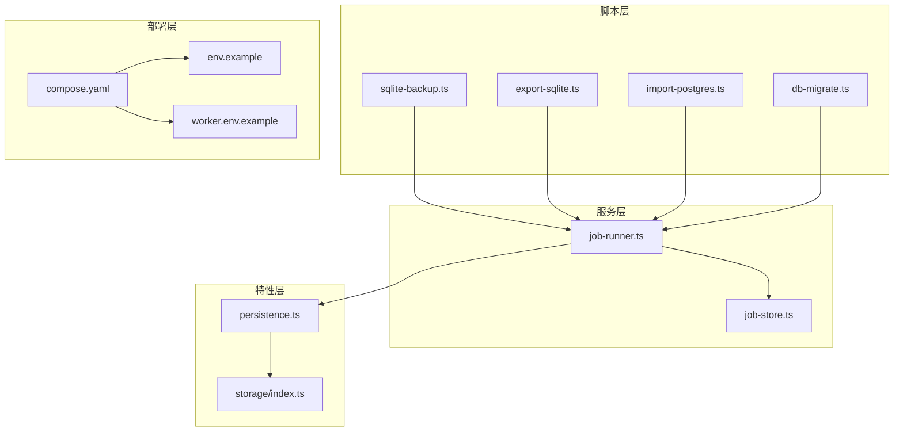
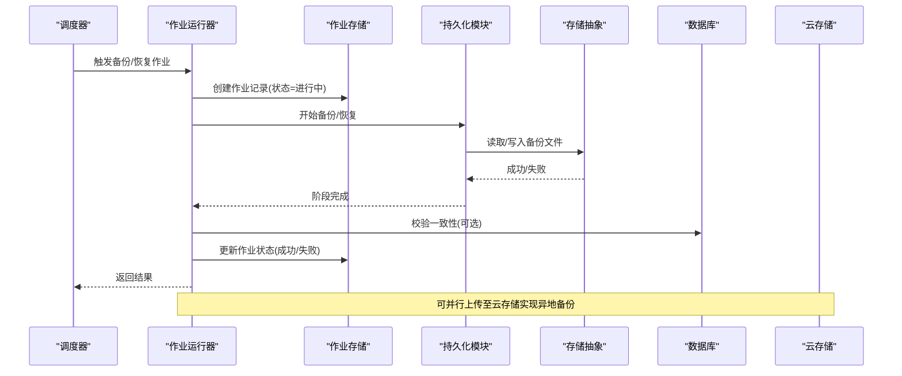
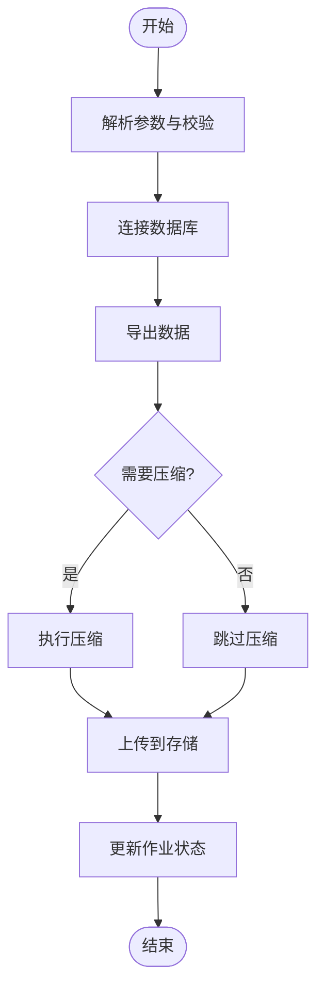
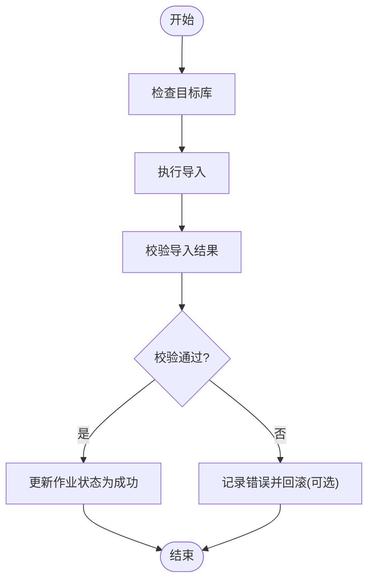
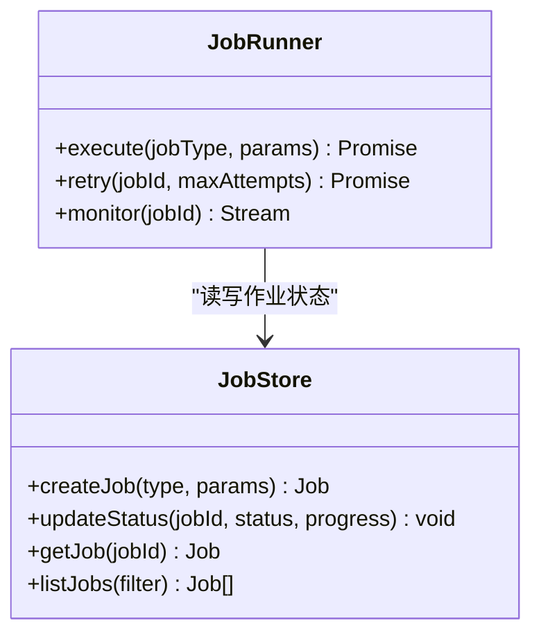
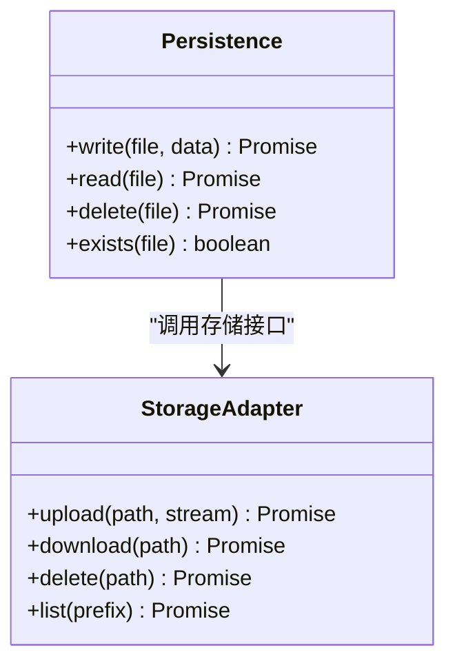
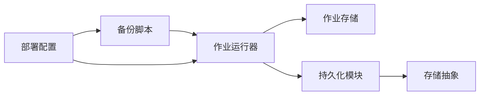

# 备份恢复

<cite>
**本文引用的文件**   
- [scripts/migration/sqlite-backup.ts](file://scripts/migration/sqlite-backup.ts)
- [scripts/migration/export-sqlite.ts](file://scripts/migration/export-sqlite.ts)
- [scripts/migration/import-postgres.ts](file://scripts/migration/import-postgres.ts)
- [scripts/setup/db-migrate.ts](file://scripts/setup/db-migrate.ts)
- [server/src/server/job-runner.ts](file://server/src/server/job-runner.ts)
- [server/src/server/job-store.ts](file://server/src/server/job-store.ts)
- [src/features/render/persistence.ts](file://src/features/render/persistence.ts)
- [src/lib/storage/index.ts](file://src/lib/storage/index.ts)
- [deploy/compose.yaml](file://deploy/compose.yaml)
- [deploy/env.example](file://deploy/env.example)
- [deploy/worker.env.example](file://deploy/worker.env.example)
</cite>

## 目录
1. [简介](#简介)
2. [项目结构](#项目结构)
3. [核心组件](#核心组件)
4. [架构总览](#架构总览)
5. [详细组件分析](#详细组件分析)
6. [依赖关系分析](#依赖关系分析)
7. [性能考量](#性能考量)
8. [故障排查指南](#故障排查指南)
9. [结论](#结论)
10. [附录](#附录)

## 简介
本文件面向数据备份与恢复系统，围绕自动备份策略、增量与全量备份机制、备份文件格式与压缩、存储位置管理、恢复流程与一致性校验、灾难恢复预案、调度监控告警与验证测试等主题进行系统化说明。文档同时提供脚本示例路径、恢复操作指南与故障排查方法，并涵盖云存储集成、异地备份与高可用架构设计建议。

## 项目结构
本项目在 scripts 目录下提供了数据库迁移与备份相关的脚本，server 层包含作业运行器与持久化逻辑，前端 features 层包含渲染产物持久化与存储抽象，deploy 目录提供容器编排与环境变量模板。整体结构与备份恢复相关的关键点如下：
- 脚本层：sqlite 备份导出、PostgreSQL 导入导出、数据库迁移初始化
- 服务层：作业运行器与作业存储（用于调度与状态跟踪）
- 特性层：渲染产物持久化与存储抽象（可用于对象存储或本地磁盘）
- 部署层：Compose 编排与环境变量配置（便于多环境与异地备份）

图表来源
- [scripts/migration/sqlite-backup.ts](file://scripts/migration/sqlite-backup.ts)
- [scripts/migration/export-sqlite.ts](file://scripts/migration/export-sqlite.ts)
- [scripts/migration/import-postgres.ts](file://scripts/migration/import-postgres.ts)
- [scripts/setup/db-migrate.ts](file://scripts/setup/db-migrate.ts)
- [server/src/server/job-runner.ts](file://server/src/server/job-runner.ts)
- [server/src/server/job-store.ts](file://server/src/server/job-store.ts)
- [src/features/render/persistence.ts](file://src/features/render/persistence.ts)
- [src/lib/storage/index.ts](file://src/lib/storage/index.ts)
- [deploy/compose.yaml](file://deploy/compose.yaml)
- [deploy/env.example](file://deploy/env.example)
- [deploy/worker.env.example](file://deploy/worker.env.example)

章节来源
- [scripts/migration/sqlite-backup.ts](file://scripts/migration/sqlite-backup.ts)
- [scripts/migration/export-sqlite.ts](file://scripts/migration/export-sqlite.ts)
- [scripts/migration/import-postgres.ts](file://scripts/migration/import-postgres.ts)
- [scripts/setup/db-migrate.ts](file://scripts/setup/db-migrate.ts)
- [server/src/server/job-runner.ts](file://server/src/server/job-runner.ts)
- [server/src/server/job-store.ts](file://server/src/server/job-store.ts)
- [src/features/render/persistence.ts](file://src/features/render/persistence.ts)
- [src/lib/storage/index.ts](file://src/lib/storage/index.ts)
- [deploy/compose.yaml](file://deploy/compose.yaml)
- [deploy/env.example](file://deploy/env.example)
- [deploy/worker.env.example](file://deploy/worker.env.example)

## 核心组件
- 备份脚本
  - SQLite 备份导出：提供对 SQLite 数据的快照与导出能力，适合作为全量或增量备份的基础。
  - PostgreSQL 导入导出：支持从外部源导入数据到 Postgres，常用于跨库迁移或恢复。
  - 数据库迁移初始化：确保目标库结构就绪，是恢复前的重要前置步骤。
- 作业运行器与作业存储
  - 作业运行器：负责执行备份/恢复任务，协调 I/O、日志记录与错误处理。
  - 作业存储：持久化作业状态、进度与结果，便于监控与重试。
- 渲染产物持久化与存储抽象
  - 持久化模块：定义备份文件的写入、读取与生命周期管理。
  - 存储抽象：统一不同后端（本地磁盘、对象存储）的访问接口，便于扩展云存储。

章节来源
- [scripts/migration/sqlite-backup.ts](file://scripts/migration/sqlite-backup.ts)
- [scripts/migration/export-sqlite.ts](file://scripts/migration/export-sqlite.ts)
- [scripts/migration/import-postgres.ts](file://scripts/migration/import-postgres.ts)
- [scripts/setup/db-migrate.ts](file://scripts/setup/db-migrate.ts)
- [server/src/server/job-runner.ts](file://server/src/server/job-runner.ts)
- [server/src/server/job-store.ts](file://server/src/server/job-store.ts)
- [src/features/render/persistence.ts](file://src/features/render/persistence.ts)
- [src/lib/storage/index.ts](file://src/lib/storage/index.ts)

## 架构总览
下图展示备份与恢复的整体流程：调度器触发作业，作业运行器协调备份/恢复任务，读写持久化层并通过存储抽象对接不同后端；元数据与状态由作业存储维护，部署层提供环境变量与编排支撑。

图表来源
- [server/src/server/job-runner.ts](file://server/src/server/job-runner.ts)
- [server/src/server/job-store.ts](file://server/src/server/job-store.ts)
- [src/features/render/persistence.ts](file://src/features/render/persistence.ts)
- [src/lib/storage/index.ts](file://src/lib/storage/index.ts)

## 详细组件分析

### 备份脚本：SQLite 备份导出
- 功能要点
  - 生成时间戳命名备份文件，便于版本管理与清理策略。
  - 可选择压缩输出以节省存储空间。
  - 支持将备份文件写入本地目录或对象存储（通过存储抽象）。
- 关键流程
  - 参数解析与校验
  - 连接数据库并执行导出
  - 压缩与上传（可选）
  - 记录作业状态与结果

图表来源
- [scripts/migration/sqlite-backup.ts](file://scripts/migration/sqlite-backup.ts)
- [src/lib/storage/index.ts](file://src/lib/storage/index.ts)

章节来源
- [scripts/migration/sqlite-backup.ts](file://scripts/migration/sqlite-backup.ts)
- [src/lib/storage/index.ts](file://src/lib/storage/index.ts)

### 备份脚本：PostgreSQL 导入导出
- 功能要点
  - 支持从外部源导入数据到 Postgres，适用于恢复场景。
  - 可与迁移脚本配合，确保表结构与约束一致。
- 关键流程
  - 校验目标库可用性
  - 执行导入命令或流式传输
  - 校验导入结果（行数、校验和）
  - 更新作业状态

图表来源
- [scripts/migration/import-postgres.ts](file://scripts/migration/import-postgres.ts)
- [scripts/setup/db-migrate.ts](file://scripts/setup/db-migrate.ts)

章节来源
- [scripts/migration/import-postgres.ts](file://scripts/migration/import-postgres.ts)
- [scripts/setup/db-migrate.ts](file://scripts/setup/db-migrate.ts)

### 作业运行器与作业存储
- 作业运行器
  - 负责调度备份/恢复任务，管理并发与超时。
  - 统一错误处理与重试策略。
- 作业存储
  - 持久化作业 ID、类型、状态、进度、错误信息。
  - 提供查询接口用于监控与告警。

图表来源
- [server/src/server/job-runner.ts](file://server/src/server/job-runner.ts)
- [server/src/server/job-store.ts](file://server/src/server/job-store.ts)

章节来源
- [server/src/server/job-runner.ts](file://server/src/server/job-runner.ts)
- [server/src/server/job-store.ts](file://server/src/server/job-store.ts)

### 渲染产物持久化与存储抽象
- 持久化模块
  - 定义备份文件的写入、读取、删除与生命周期管理。
  - 支持分片与断点续传（当存储后端支持时）。
- 存储抽象
  - 统一接口适配本地磁盘与对象存储（如 S3、OSS）。
  - 提供加密、压缩与校验选项。

图表来源
- [src/features/render/persistence.ts](file://src/features/render/persistence.ts)
- [src/lib/storage/index.ts](file://src/lib/storage/index.ts)

章节来源
- [src/features/render/persistence.ts](file://src/features/render/persistence.ts)
- [src/lib/storage/index.ts](file://src/lib/storage/index.ts)

## 依赖关系分析
- 脚本层依赖作业运行器与存储抽象，以实现统一的备份/恢复执行与后端接入。
- 作业运行器依赖作业存储，用于状态追踪与监控。
- 持久化模块依赖存储抽象，屏蔽不同后端的差异。
- 部署层通过环境变量与编排文件，为各组件提供运行时配置。

图表来源
- [scripts/migration/sqlite-backup.ts](file://scripts/migration/sqlite-backup.ts)
- [scripts/migration/export-sqlite.ts](file://scripts/migration/export-sqlite.ts)
- [scripts/migration/import-postgres.ts](file://scripts/migration/import-postgres.ts)
- [server/src/server/job-runner.ts](file://server/src/server/job-runner.ts)
- [server/src/server/job-store.ts](file://server/src/server/job-store.ts)
- [src/features/render/persistence.ts](file://src/features/render/persistence.ts)
- [src/lib/storage/index.ts](file://src/lib/storage/index.ts)
- [deploy/compose.yaml](file://deploy/compose.yaml)

章节来源
- [scripts/migration/sqlite-backup.ts](file://scripts/migration/sqlite-backup.ts)
- [scripts/migration/export-sqlite.ts](file://scripts/migration/export-sqlite.ts)
- [scripts/migration/import-postgres.ts](file://scripts/migration/import-postgres.ts)
- [server/src/server/job-runner.ts](file://server/src/server/job-runner.ts)
- [server/src/server/job-store.ts](file://server/src/server/job-store.ts)
- [src/features/render/persistence.ts](file://src/features/render/persistence.ts)
- [src/lib/storage/index.ts](file://src/lib/storage/index.ts)
- [deploy/compose.yaml](file://deploy/compose.yaml)

## 性能考量
- 备份策略
  - 全量备份：适合定期归档与灾难恢复基线，占用空间较大但恢复简单。
  - 增量备份：基于上次备份的差异，减少 I/O 与网络开销，恢复时需按顺序应用增量。
- 压缩与传输
  - 使用高效压缩算法（如 gzip/zstd）降低存储成本与带宽消耗。
  - 分块上传与并行传输提升大文件备份效率。
- 一致性保障
  - 数据库级快照或事务一致性导出，避免部分写入导致的不一致。
  - 校验和（MD5/SHA）验证备份完整性。
- 资源隔离
  - 通过作业运行器限制并发度，避免影响主业务。
  - 设置超时与重试上限，防止长时间阻塞。

[本节为通用指导，不直接分析具体文件]

## 故障排查指南
- 常见问题
  - 备份失败：检查网络连接、权限与存储配额。
  - 恢复失败：确认目标库结构已迁移，校验备份文件完整性。
  - 作业卡住：查看作业存储中的状态与日志，必要时手动重试。
- 诊断步骤
  - 查看作业运行器的日志与错误堆栈。
  - 检查持久化模块的 I/O 错误与超时。
  - 验证存储抽象的后端配置（密钥、端点、桶名）。
- 恢复演练
  - 在预生产环境执行恢复流程，验证数据一致性与业务可用性。
  - 记录恢复耗时与问题点，优化备份策略与资源配置。

章节来源
- [server/src/server/job-runner.ts](file://server/src/server/job-runner.ts)
- [server/src/server/job-store.ts](file://server/src/server/job-store.ts)
- [src/features/render/persistence.ts](file://src/features/render/persistence.ts)
- [src/lib/storage/index.ts](file://src/lib/storage/index.ts)

## 结论
本备份恢复系统通过脚本层、作业运行器、持久化与存储抽象的组合，实现了可扩展、可监控、可验证的数据保护方案。结合调度与告警、异地备份与高可用设计，可满足生产环境的可靠性要求。建议在现有基础上完善增量备份策略、自动化验证测试与灾难恢复演练，进一步提升系统的韧性与运维效率。

[本节为总结性内容，不直接分析具体文件]

## 附录

### 备份策略与调度
- 全量备份：每日或每周定时执行，保留固定周期（如 30 天）。
- 增量备份：每小时或每半小时执行，仅保存变更数据。
- 调度工具：可使用系统 cron 或容器编排的定时任务，结合作业运行器统一管理。

章节来源
- [deploy/compose.yaml](file://deploy/compose.yaml)
- [deploy/env.example](file://deploy/env.example)
- [deploy/worker.env.example](file://deploy/worker.env.example)

### 恢复流程与一致性检查
- 恢复步骤
  - 准备目标环境（迁移结构、配置存储）。
  - 选择合适的全量与增量备份集。
  - 按顺序应用备份，执行一致性校验。
  - 启动业务并验证关键数据与功能。
- 一致性检查
  - 校验和比对、行数统计、抽样对比。
  - 业务级冒烟测试确保可用性。

章节来源
- [scripts/migration/import-postgres.ts](file://scripts/migration/import-postgres.ts)
- [scripts/setup/db-migrate.ts](file://scripts/setup/db-migrate.ts)
- [src/features/render/persistence.ts](file://src/features/render/persistence.ts)

### 云存储集成与异地备份
- 存储抽象支持多种后端，便于切换与扩展。
- 异地备份建议：
  - 多区域复制与版本控制。
  - 加密传输与静态加密。
  - 访问审计与合规性检查。

章节来源
- [src/lib/storage/index.ts](file://src/lib/storage/index.ts)
- [deploy/compose.yaml](file://deploy/compose.yaml)

### 高可用架构设计
- 多实例作业运行器与分布式作业存储，避免单点故障。
- 存储后端多副本与跨区域同步。
- 监控告警覆盖备份成功率、延迟与容量阈值。

[本节为通用指导，不直接分析具体文件]