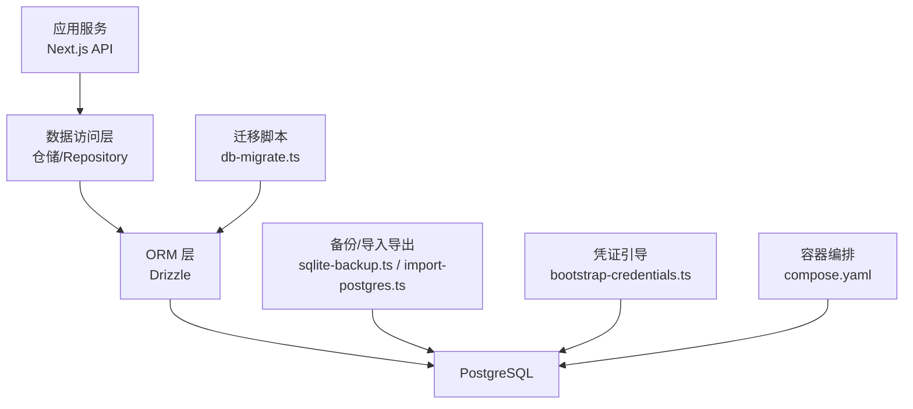
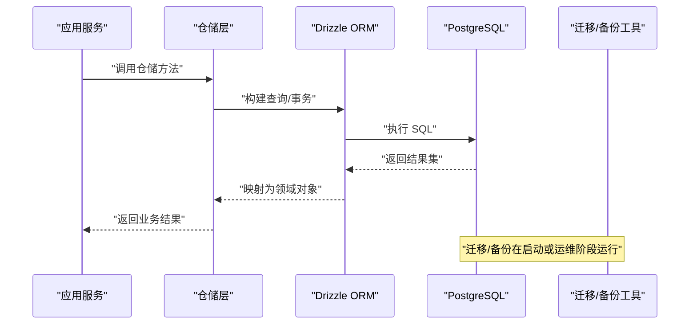
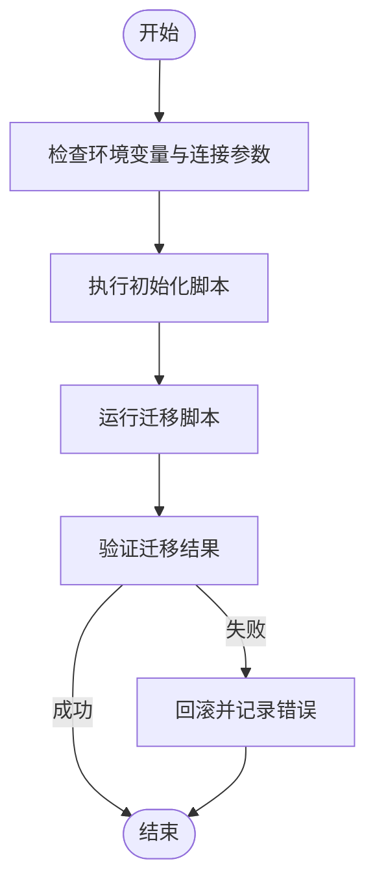
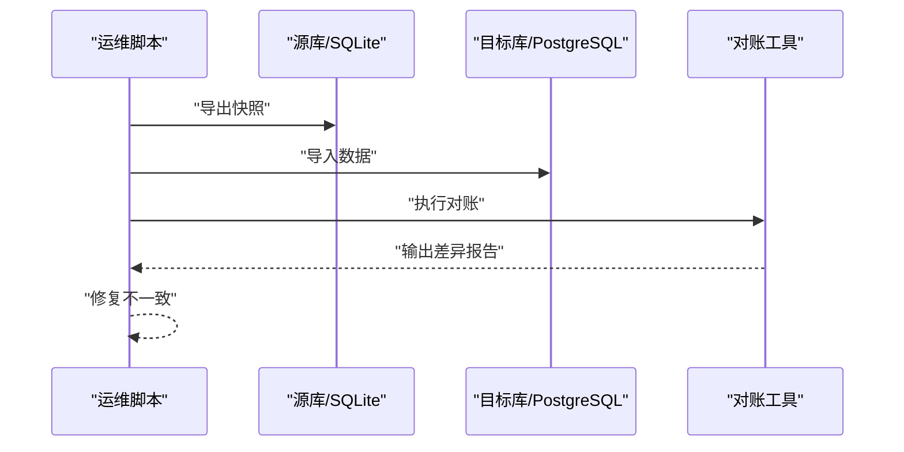
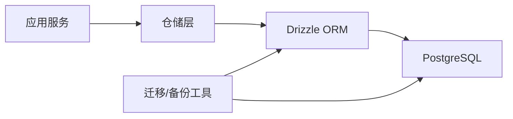

# 数据存储

<cite>
**本文引用的文件**   
- [drizzle.config.ts](file://drizzle.config.ts)
- [db-migrate.ts](file://scripts/setup/db-migrate.ts)
- [postgres-init.sql](file://scripts/setup/postgres-init.sql)
- [bootstrap-credentials.ts](file://scripts/setup/bootstrap-credentials.ts)
- [provision-master-key.ts](file://scripts/migration/provision-master-key.ts)
- [sqlite-backup.ts](file://scripts/migration/sqlite-backup.ts)
- [export-sqlite.ts](file://scripts/migration/export-sqlite.ts)
- [import-postgres.ts](file://scripts/migration/import-postgres.ts)
- [reconcile-postgres.ts](file://scripts/migration/reconcile-postgres.ts)
- [runtime-repository.pg.test.ts](file://src/features/audio/runtime-repository.pg.test.ts)
- [provider-credential-store.pg.test.ts](file://src/features/credentials/provider-credential-store.pg.test.ts)
- [render.pg-fixture.ts](file://src/features/render/render.pg-fixture.ts)
- [cache.pg.test.ts](file://src/features/render/cache.pg.test.ts)
- [repository.pg.test.ts](file://src/features/render/repository.pg.test.ts)
- [media-route-repository.pg.test.ts](file://src/features/routing/media-route-repository.pg.test.ts)
- [model-route-repository.pg.test.ts](file://src/features/routing/model-route-repository.pg.test.ts)
- [compose.yaml](file://deploy/compose.yaml)
- [env.example](file://deploy/env.example)
- [worker.env.example](file://deploy/worker.env.example)
</cite>

## 目录
1. [简介](#简介)
2. [项目结构](#项目结构)
3. [核心组件](#核心组件)
4. [架构总览](#架构总览)
5. [详细组件分析](#详细组件分析)
6. [依赖分析](#依赖分析)
7. [性能考虑](#性能考虑)
8. [故障排查指南](#故障排查指南)
9. [结论](#结论)
10. [附录](#附录)

## 简介
本技术文档聚焦 PurpleInk 的数据存储系统，围绕数据库设计模式、ORM 使用策略与查询优化展开。内容涵盖实体关系建模、索引设计与约束规则；数据迁移机制、备份恢复策略与版本管理；连接池配置、事务处理与并发控制；数据访问层抽象、仓储模式实现与缓存策略；以及数据安全、加密存储与访问控制机制。文档面向不同技术背景的读者，提供从概览到代码级细节的渐进式说明，并辅以架构图、流程图和时序图帮助理解。

## 项目结构
PurpleInk 的数据相关能力主要分布在以下位置：
- ORM 与迁移配置：根目录 drizzle.config.ts，脚本 scripts/setup 与 scripts/migration
- 数据库初始化与凭证引导：scripts/setup/postgres-init.sql、bootstrap-credentials.ts
- 迁移与备份工具：scripts/migration 下的导出/导入/对账/备份脚本
- 功能域仓储与测试：src/features 下各模块的 repository 与 .pg.test.ts 集成测试
- 部署与环境：deploy/compose.yaml、env.example、worker.env.example

图表来源
- [drizzle.config.ts](file://drizzle.config.ts)
- [db-migrate.ts](file://scripts/setup/db-migrate.ts)
- [postgres-init.sql](file://scripts/setup/postgres-init.sql)
- [bootstrap-credentials.ts](file://scripts/setup/bootstrap-credentials.ts)
- [sqlite-backup.ts](file://scripts/migration/sqlite-backup.ts)
- [import-postgres.ts](file://scripts/migration/import-postgres.ts)
- [compose.yaml](file://deploy/compose.yaml)

章节来源
- [drizzle.config.ts](file://drizzle.config.ts)
- [db-migrate.ts](file://scripts/setup/db-migrate.ts)
- [postgres-init.sql](file://scripts/setup/postgres-init.sql)
- [bootstrap-credentials.ts](file://scripts/setup/bootstrap-credentials.ts)
- [sqlite-backup.ts](file://scripts/migration/sqlite-backup.ts)
- [import-postgres.ts](file://scripts/migration/import-postgres.ts)
- [compose.yaml](file://deploy/compose.yaml)

## 核心组件
- ORM 与迁移配置：通过 Drizzle 进行表结构定义与迁移，配合脚本完成环境初始化与版本演进。
- 数据访问层（仓储）：在各业务域中封装 CRUD 与复杂查询，统一对外接口，屏蔽底层 SQL 差异。
- 凭证与密钥管理：通过引导脚本生成或注入主密钥，结合环境变量与容器编排完成安全加载。
- 备份与迁移工具：提供 SQLite 备份、PostgreSQL 导入/导出与一致性对账工具，支持跨库迁移与校验。
- 集成测试与夹具：以 PostgreSQL 为目标的单测与夹具，确保仓储逻辑与迁移脚本的正确性。

章节来源
- [drizzle.config.ts](file://drizzle.config.ts)
- [db-migrate.ts](file://scripts/setup/db-migrate.ts)
- [bootstrap-credentials.ts](file://scripts/setup/bootstrap-credentials.ts)
- [sqlite-backup.ts](file://scripts/migration/sqlite-backup.ts)
- [import-postgres.ts](file://scripts/migration/import-postgres.ts)
- [reconcile-postgres.ts](file://scripts/migration/reconcile-postgres.ts)

## 架构总览
PurpleInk 的数据流遵循“应用服务 → 仓储 → ORM → 数据库”的分层架构。迁移与备份作为横切能力，贯穿开发、测试与生产环境。

图表来源
- [drizzle.config.ts](file://drizzle.config.ts)
- [db-migrate.ts](file://scripts/setup/db-migrate.ts)
- [sqlite-backup.ts](file://scripts/migration/sqlite-backup.ts)
- [import-postgres.ts](file://scripts/migration/import-postgres.ts)

## 详细组件分析

### 数据库设计与 ORM 策略
- 设计目标：以 Drizzle 为核心 ORM，强调类型安全、可维护性与可移植性。表结构变更通过迁移脚本管理，避免手写 SQL 漂移。
- 实体关系建模：仓储层按领域划分，每个仓储负责一组实体的读写与关联查询，保持高内聚低耦合。
- 索引与约束：在高频查询字段建立索引，使用唯一约束保证关键数据的完整性，外键用于维护引用一致性（视具体表而定）。
- 查询优化：优先使用投影减少列读取，分页与排序结合索引，避免 N+1 查询，必要时使用物化视图或聚合表。

章节来源
- [drizzle.config.ts](file://drizzle.config.ts)
- [repository.pg.test.ts](file://src/features/render/repository.pg.test.ts)
- [media-route-repository.pg.test.ts](file://src/features/routing/media-route-repository.pg.test.ts)
- [model-route-repository.pg.test.ts](file://src/features/routing/model-route-repository.pg.test.ts)

### 数据迁移机制与版本管理
- 迁移入口：通过 db-migrate.ts 驱动 Drizzle 迁移流程，确保本地、CI 与生产环境一致。
- 初始化脚本：postgres-init.sql 提供数据库初始结构与权限设置，配合 bootstrap-credentials.ts 完成凭证准备。
- 版本管理：迁移脚本命名与顺序决定版本演进路径，回滚策略由迁移框架与脚本共同保障。

图表来源
- [db-migrate.ts](file://scripts/setup/db-migrate.ts)
- [postgres-init.sql](file://scripts/setup/postgres-init.sql)
- [bootstrap-credentials.ts](file://scripts/setup/bootstrap-credentials.ts)

章节来源
- [db-migrate.ts](file://scripts/setup/db-migrate.ts)
- [postgres-init.sql](file://scripts/setup/postgres-init.sql)
- [bootstrap-credentials.ts](file://scripts/setup/bootstrap-credentials.ts)

### 备份恢复策略与跨库迁移
- SQLite 备份：sqlite-backup.ts 提供快照与导出能力，便于快速恢复与离线分析。
- 导入/导出：import-postgres.ts 与 export-sqlite.ts 支持跨库数据转换，满足迁移与归档需求。
- 一致性对账：reconcile-postgres.ts 用于比对源与目标库的一致性，确保迁移质量。

图表来源
- [sqlite-backup.ts](file://scripts/migration/sqlite-backup.ts)
- [import-postgres.ts](file://scripts/migration/import-postgres.ts)
- [export-sqlite.ts](file://scripts/migration/export-sqlite.ts)
- [reconcile-postgres.ts](file://scripts/migration/reconcile-postgres.ts)

章节来源
- [sqlite-backup.ts](file://scripts/migration/sqlite-backup.ts)
- [import-postgres.ts](file://scripts/migration/import-postgres.ts)
- [export-sqlite.ts](file://scripts/migration/export-sqlite.ts)
- [reconcile-postgres.ts](file://scripts/migration/reconcile-postgres.ts)

### 连接池配置、事务处理与并发控制
- 连接池：通过 ORM 客户端配置连接池大小、超时与重试策略，平衡吞吐与资源占用。
- 事务：仓储层封装事务边界，确保多步操作的原子性；长事务需拆分以避免锁竞争。
- 并发：使用行级锁与乐观锁策略解决写冲突，读多写少场景采用只读副本或缓存降低压力。

章节来源
- [runtime-repository.pg.test.ts](file://src/features/audio/runtime-repository.pg.test.ts)
- [provider-credential-store.pg.test.ts](file://src/features/credentials/provider-credential-store.pg.test.ts)
- [cache.pg.test.ts](file://src/features/render/cache.pg.test.ts)

### 数据访问层抽象与仓储模式实现
- 仓储抽象：每个领域仓储暴露统一的增删改查与领域操作接口，屏蔽 SQL 细节。
- 实现要点：参数校验、错误分类、日志埋点、分页与排序、批量操作与事务组合。
- 测试覆盖：以 PostgreSQL 为目标编写集成测试，确保仓储行为符合预期。

章节来源
- [repository.pg.test.ts](file://src/features/render/repository.pg.test.ts)
- [media-route-repository.pg.test.ts](file://src/features/routing/media-route-repository.pg.test.ts)
- [model-route-repository.pg.test.ts](file://src/features/routing/model-route-repository.pg.test.ts)

### 缓存策略
- 缓存层级：热点数据采用内存缓存，跨进程共享使用 Redis（如引入），读写分离提升吞吐。
- 失效策略：基于版本号或时间窗口的失效策略，避免脏读；写后更新或延迟双删保证一致性。
- 测试与夹具：通过 cache.pg.test.ts 与 render.pg-fixture.ts 模拟缓存命中与失效场景。

章节来源
- [cache.pg.test.ts](file://src/features/render/cache.pg.test.ts)
- [render.pg-fixture.ts](file://src/features/render/render.pg-fixture.ts)

### 数据安全、加密存储与访问控制
- 主密钥：provision-master-key.ts 用于生成或注入主密钥，支撑敏感数据加密。
- 凭证引导：bootstrap-credentials.ts 将凭据安全注入运行时，避免硬编码。
- 访问控制：数据库用户最小权限原则，结合应用层鉴权与审计日志。

章节来源
- [provision-master-key.ts](file://scripts/migration/provision-master-key.ts)
- [bootstrap-credentials.ts](file://scripts/setup/bootstrap-credentials.ts)

## 依赖分析
数据层依赖关系如下：应用服务依赖仓储，仓储依赖 ORM，ORM 依赖数据库；迁移与备份工具独立于运行时，但在部署与运维阶段紧密耦合。

图表来源
- [drizzle.config.ts](file://drizzle.config.ts)
- [db-migrate.ts](file://scripts/setup/db-migrate.ts)
- [sqlite-backup.ts](file://scripts/migration/sqlite-backup.ts)
- [import-postgres.ts](file://scripts/migration/import-postgres.ts)

章节来源
- [drizzle.config.ts](file://drizzle.config.ts)
- [db-migrate.ts](file://scripts/setup/db-migrate.ts)
- [sqlite-backup.ts](file://scripts/migration/sqlite-backup.ts)
- [import-postgres.ts](file://scripts/migration/import-postgres.ts)

## 性能考虑
- 查询优化：合理选择索引、避免全表扫描；使用 EXPLAIN 分析执行计划，关注扫描行数与临时表。
- 连接池调优：根据 CPU 与 I/O 能力调整最大连接数与空闲超时，避免连接风暴。
- 事务粒度：缩短事务范围，减少锁持有时间；批量写入合并提交。
- 缓存命中率：监控缓存命中与失效比例，动态调整 TTL 与容量。
- 分库分表：当单表过大时考虑水平扩展，按业务维度拆分。

[本节为通用指导，不直接分析具体文件]

## 故障排查指南
- 迁移失败：检查环境变量与连接参数，确认 postgres-init.sql 执行成功；查看迁移日志定位错误语句。
- 连接池耗尽：监控活跃连接与等待队列，调整池大小与超时；排查未关闭的连接与长事务。
- 数据不一致：使用 reconcile-postgres.ts 对比源与目标，定位差异字段与记录；必要时回滚并重新迁移。
- 缓存异常：检查缓存键空间与 TTL，验证写后一致性策略；观察命中率与延迟指标。

章节来源
- [db-migrate.ts](file://scripts/setup/db-migrate.ts)
- [postgres-init.sql](file://scripts/setup/postgres-init.sql)
- [reconcile-postgres.ts](file://scripts/migration/reconcile-postgres.ts)

## 结论
PurpleInk 的数据存储系统以 Drizzle ORM 为核心，结合完善的迁移、备份与测试体系，形成稳定可靠的数据层。通过仓储模式抽象、合理的索引与事务策略，以及安全可控的凭证与密钥管理，系统在可扩展性、可维护性与安全性方面具备良好基础。后续可在缓存层、读写分离与分库分表方向持续优化，以应对更高并发与更大规模数据。

[本节为总结性内容，不直接分析具体文件]

## 附录
- 部署与环境变量：参考 deploy/compose.yaml、deploy/env.example、deploy/worker.env.example，了解数据库连接与服务编排。
- 集成测试：通过 src/features 下的 *.pg.test.ts 与 fixtures，学习仓储与缓存的测试范式。

章节来源
- [compose.yaml](file://deploy/compose.yaml)
- [env.example](file://deploy/env.example)
- [worker.env.example](file://deploy/worker.env.example)
- [runtime-repository.pg.test.ts](file://src/features/audio/runtime-repository.pg.test.ts)
- [provider-credential-store.pg.test.ts](file://src/features/credentials/provider-credential-store.pg.test.ts)
- [cache.pg.test.ts](file://src/features/render/cache.pg.test.ts)
- [render.pg-fixture.ts](file://src/features/render/render.pg-fixture.ts)