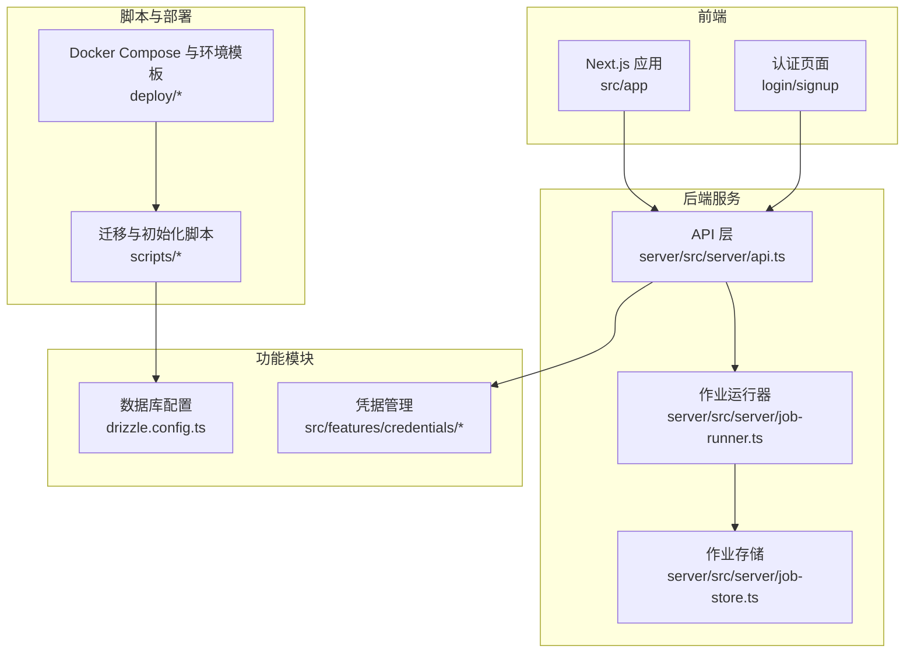
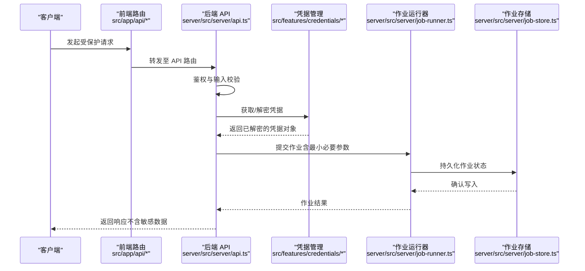
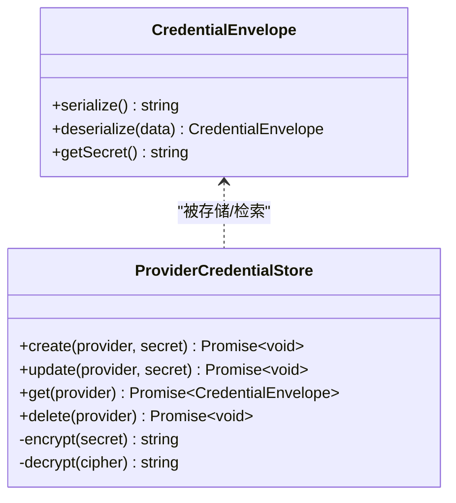
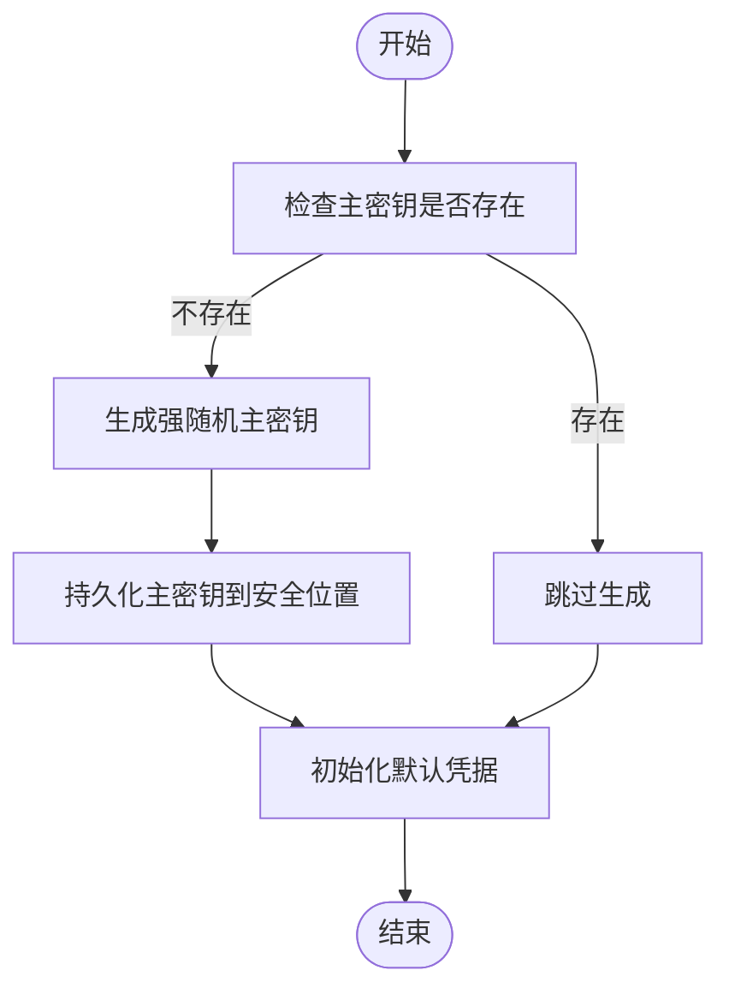
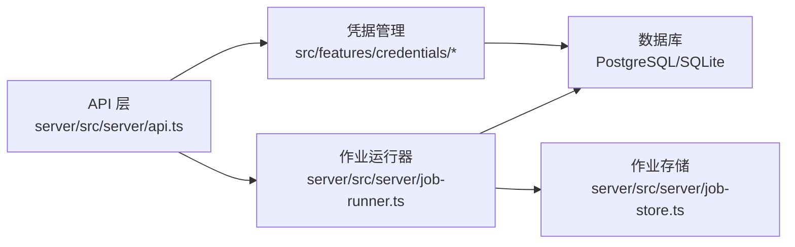

# 数据安全

<cite>
**本文引用的文件**   
- [provision-master-key.ts](file://scripts/migration/provision-master-key.ts)
- [bootstrap-credentials.ts](file://scripts/setup/bootstrap-credentials.ts)
- [credential-envelope.ts](file://src/features/credentials/credential-envelope.ts)
- [provider-credential-store.pg.test.ts](file://src/features/credentials/provider-credential-store.pg.test.ts)
- [provider-credential-store.ts](file://src/features/credentials/provider-credential-store.ts)
- [index.ts](file://src/features/credentials/index.ts)
- [load-env.ts](file://server/src/lib/load-env.ts)
- [logger.ts](file://server/src/lib/logger.ts)
- [error-message.ts](file://server/src/lib/error-message.ts)
- [api.ts](file://server/src/server/api.ts)
- [job-runner.ts](file://server/src/server/job-runner.ts)
- [job-store.ts](file://server/src/server/job-store.ts)
- [env.example](file://deploy/env.example)
- [tts.env.example](file://config/tts.env.example)
- [worker.env.example](file://deploy/worker.env.example)
- [compose.yaml](file://deploy/compose.yaml)
- [route.ts](file://src/app/api/settings/route.ts)
- [route.ts](file://src/app/api/artifacts/[id]/route.ts)
- [route.ts](file://src/app/api/director/pipeline/route.ts)
- [route.ts](file://src/app/api/render/export/route.ts)
- [route.ts](file://src/app/api/jobs/[id]/route.ts)
- [route.ts](file://src/app/api/projects/[id]/route.ts)
- [route.ts](file://src/app/(auth)/login/page.tsx)
- [route.ts](file://src/app/(auth)/signup/page.tsx)
- [auth-shell-form.tsx](file://src/app/(auth)/_components/auth-shell-form.tsx)
- [drizzle.config.ts](file://drizzle.config.ts)
- [postgres-init.sql](file://scripts/setup/postgres-init.sql)
- [export-sqlite.ts](file://scripts/migration/export-sqlite.ts)
- [import-postgres.ts](file://scripts/migration/import-postgres.ts)
- [sqlite-backup.ts](file://scripts/migration/sqlite-backup.ts)
</cite>

## 目录
1. [简介](#简介)
2. [项目结构](#项目结构)
3. [核心组件](#核心组件)
4. [架构总览](#架构总览)
5. [详细组件分析](#详细组件分析)
6. [依赖关系分析](#依赖关系分析)
7. [性能考虑](#性能考虑)
8. [故障排查指南](#故障排查指南)
9. [结论](#结论)
10. [附录](#附录)

## 简介
本技术文档聚焦于紫墨水（PurpleInk）项目的数据安全存储与访问控制，覆盖敏感数据加密策略、密钥管理、用户密码哈希、会话令牌安全、API 密钥保护、数据脱敏、审计日志与合规性要求。同时给出 SQL 注入防护、XSS 防御与输入验证机制的实践建议，并提供安全配置示例、漏洞扫描方法与审计流程，以及 GDPR 合规、数据保留策略和用户隐私保护措施。

## 项目结构
本项目采用前后端分离与多进程部署模式：
- 前端 Next.js 应用位于 src/app，提供认证页面与 API 路由。
- 服务端逻辑位于 server/src，包含 API、作业调度与持久化。
- 功能模块位于 src/features，其中 credentials 子模块负责凭据封装与存储。
- 脚本位于 scripts，涵盖数据库迁移、凭据初始化与备份导出。
- 部署配置位于 deploy，包含 Docker Compose 与环境变量模板。

**图表来源** 
- [api.ts](file://server/src/server/api.ts)
- [job-runner.ts](file://server/src/server/job-runner.ts)
- [job-store.ts](file://server/src/server/job-store.ts)
- [index.ts](file://src/features/credentials/index.ts)
- [drizzle.config.ts](file://drizzle.config.ts)
- [compose.yaml](file://deploy/compose.yaml)

**章节来源**
- [compose.yaml](file://deploy/compose.yaml)
- [drizzle.config.ts](file://drizzle.config.ts)

## 核心组件
- 凭据信封与提供者存储：用于对第三方凭据进行封装、加密与持久化，确保密钥不落地明文。
- 主密钥供应：通过迁移脚本生成并注入主密钥，作为所有凭据加密的根密钥。
- 环境变量加载与日志：统一加载敏感配置，记录审计日志但不输出敏感信息。
- API 路由与作业执行：在请求入口进行鉴权与输入校验，作业执行中避免泄露敏感数据。

**章节来源**
- [credential-envelope.ts](file://src/features/credentials/credential-envelope.ts)
- [provider-credential-store.ts](file://src/features/credentials/provider-credential-store.ts)
- [provision-master-key.ts](file://scripts/migration/provision-master-key.ts)
- [bootstrap-credentials.ts](file://scripts/setup/bootstrap-credentials.ts)
- [load-env.ts](file://server/src/lib/load-env.ts)
- [logger.ts](file://server/src/lib/logger.ts)
- [api.ts](file://server/src/server/api.ts)
- [job-runner.ts](file://server/src/server/job-runner.ts)

## 架构总览
下图展示了从前端到后端的请求流，以及凭据加密、作业执行与数据存储的关键路径。

**图表来源** 
- [api.ts](file://server/src/server/api.ts)
- [credential-envelope.ts](file://src/features/credentials/credential-envelope.ts)
- [provider-credential-store.ts](file://src/features/credentials/provider-credential-store.ts)
- [job-runner.ts](file://server/src/server/job-runner.ts)
- [job-store.ts](file://server/src/server/job-store.ts)

## 详细组件分析

### 凭据信封与提供者存储
- 凭据信封：将第三方服务的密钥以结构化方式封装，支持序列化与反序列化，便于安全传输与存储。
- 提供者存储：对接数据库，实现凭据的增删改查；在写入前使用主密钥进行加密，读取时按需解密。
- 设计要点：
  - 最小权限原则：仅允许必要的服务角色访问凭据表。
  - 字段级加密：对敏感字段单独加密，降低批量泄露风险。
  - 审计追踪：记录凭据访问与变更操作，便于溯源。

**图表来源** 
- [credential-envelope.ts](file://src/features/credentials/credential-envelope.ts)
- [provider-credential-store.ts](file://src/features/credentials/provider-credential-store.ts)

**章节来源**
- [credential-envelope.ts](file://src/features/credentials/credential-envelope.ts)
- [provider-credential-store.ts](file://src/features/credentials/provider-credential-store.ts)
- [provider-credential-store.pg.test.ts](file://src/features/credentials/provider-credential-store.pg.test.ts)

### 主密钥供应与凭据初始化
- 主密钥供应：通过迁移脚本生成强随机主密钥，并写入环境变量或密钥管理服务。
- 凭据初始化：在首次启动时检查并填充默认凭据，确保系统可用且安全。
- 关键实践：
  - 主密钥长度与熵值满足现代加密标准。
  - 禁止在主密钥生成过程中输出任何日志或调试信息。
  - 提供幂等初始化脚本，支持重复执行而不破坏现有数据。

**图表来源** 
- [provision-master-key.ts](file://scripts/migration/provision-master-key.ts)
- [bootstrap-credentials.ts](file://scripts/setup/bootstrap-credentials.ts)

**章节来源**
- [provision-master-key.ts](file://scripts/migration/provision-master-key.ts)
- [bootstrap-credentials.ts](file://scripts/setup/bootstrap-credentials.ts)

### 环境变量加载与日志审计
- 环境变量加载：集中式加载敏感配置，提供类型校验与默认值回退。
- 日志审计：统一日志格式，记录请求上下文与操作结果，但严格过滤敏感字段。
- 最佳实践：
  - 使用只读权限加载环境变量，避免运行时修改。
  - 日志中禁用堆栈跟踪中的敏感路径与内容。
  - 对异常信息进行脱敏后再记录。

**章节来源**
- [load-env.ts](file://server/src/lib/load-env.ts)
- [logger.ts](file://server/src/lib/logger.ts)
- [error-message.ts](file://server/src/lib/error-message.ts)

### API 路由与作业执行的安全边界
- API 路由：在入口处进行身份验证、授权与输入校验，拒绝非法请求。
- 作业执行：作业运行器仅接收最小必要参数，避免传递完整凭据；作业存储仅保存非敏感状态。
- 安全要点：
  - 对所有外部输入进行白名单校验。
  - 限制作业并发度与资源配额，防止滥用。
  - 作业失败时清理临时敏感数据。

**章节来源**
- [api.ts](file://server/src/server/api.ts)
- [job-runner.ts](file://server/src/server/job-runner.ts)
- [job-store.ts](file://server/src/server/job-store.ts)

### 前端认证与安全交互
- 认证页面：登录与注册页面处理用户凭据，建议使用 HTTPS 与安全的 Cookie 设置。
- 表单组件：统一封装认证表单，避免直接暴露敏感字段到全局状态。
- 安全建议：
  - 前端不缓存敏感数据。
  - 使用短生命周期令牌，配合刷新机制。
  - 对用户输入进行前端校验，减少无效请求。

**章节来源**
- [page.tsx](file://src/app/(auth)/login/page.tsx)
- [page.tsx](file://src/app/(auth)/signup/page.tsx)
- [auth-shell-form.tsx](file://src/app/(auth)/_components/auth-shell-form.tsx)

### 数据库配置与初始化
- Drizzle 配置：定义数据库连接与迁移策略，确保生产环境使用强密码与 TLS。
- PostgreSQL 初始化：提供初始化脚本，创建必要的用户与权限，遵循最小权限原则。
- 迁移与备份：提供 SQLite 导出与导入脚本，支持跨库迁移与灾难恢复。

**章节来源**
- [drizzle.config.ts](file://drizzle.config.ts)
- [postgres-init.sql](file://scripts/setup/postgres-init.sql)
- [export-sqlite.ts](file://scripts/migration/export-sqlite.ts)
- [import-postgres.ts](file://scripts/migration/import-postgres.ts)
- [sqlite-backup.ts](file://scripts/migration/sqlite-backup.ts)

## 依赖关系分析
下图展示关键模块之间的依赖关系，突出凭据管理与作业执行的耦合点。

**图表来源** 
- [api.ts](file://server/src/server/api.ts)
- [index.ts](file://src/features/credentials/index.ts)
- [job-runner.ts](file://server/src/server/job-runner.ts)
- [job-store.ts](file://server/src/server/job-store.ts)

**章节来源**
- [api.ts](file://server/src/server/api.ts)
- [index.ts](file://src/features/credentials/index.ts)
- [job-runner.ts](file://server/src/server/job-runner.ts)
- [job-store.ts](file://server/src/server/job-store.ts)

## 性能考虑
- 加密开销：凭据加解密应在内存中进行，避免频繁磁盘 I/O；可引入短期缓存以减少重复解密。
- 作业调度：合理设置并发度与队列长度，避免阻塞与内存泄漏。
- 数据库连接池：根据负载调整连接数，使用连接复用与超时重试。
- 日志轮转：定期归档与压缩日志，避免磁盘占满影响性能。

[本节为通用指导，无需特定文件引用]

## 故障排查指南
- 常见问题：
  - 主密钥缺失或损坏：检查迁移脚本执行结果与环境变量配置。
  - 凭据解密失败：核对加密算法与密钥版本一致性。
  - 作业执行失败：查看作业日志与错误消息，确认输入参数与权限。
- 诊断步骤：
  - 启用详细日志级别，定位异常调用链。
  - 使用测试套件验证凭据存储与解密流程。
  - 检查数据库连接与权限配置。

**章节来源**
- [logger.ts](file://server/src/lib/logger.ts)
- [error-message.ts](file://server/src/lib/error-message.ts)
- [provider-credential-store.pg.test.ts](file://src/features/credentials/provider-credential-store.pg.test.ts)

## 结论
本项目在敏感数据加密、密钥管理与访问控制方面具备良好基础，但仍需持续完善输入验证、审计日志与合规性措施。建议在生产环境中引入密钥管理服务、实施严格的网络隔离与监控告警，并定期进行安全审计与渗透测试。

[本节为总结性内容，无需特定文件引用]

## 附录

### 安全配置示例
- 环境变量模板：
  - [env.example](file://deploy/env.example)
  - [tts.env.example](file://config/tts.env.example)
  - [worker.env.example](file://deploy/worker.env.example)
- 部署配置：
  - [compose.yaml](file://deploy/compose.yaml)

**章节来源**
- [env.example](file://deploy/env.example)
- [tts.env.example](file://config/tts.env.example)
- [worker.env.example](file://deploy/worker.env.example)
- [compose.yaml](file://deploy/compose.yaml)

### 漏洞扫描方法与审计流程
- 静态代码分析：集成 ESLint 与 TypeScript 类型检查，发现潜在安全问题。
- 依赖漏洞扫描：使用 pnpm audit 与第三方工具扫描已知漏洞。
- 动态测试：对 API 路由进行模糊测试与渗透测试，验证输入校验与鉴权逻辑。
- 审计流程：定期审查日志与访问记录，确保无敏感数据泄露与未授权访问。

[本节为通用指导，无需特定文件引用]

### 合规性与隐私保护
- GDPR 合规：
  - 数据最小化：仅收集与处理必要数据。
  - 用户权利：支持数据删除、导出与更正请求。
  - 数据保留：制定明确的保留策略与自动清理机制。
- 隐私保护：
  - 数据脱敏：在日志与报告中隐藏敏感字段。
  - 访问控制：基于角色的权限模型，限制数据访问范围。
  - 审计追踪：记录所有敏感操作，便于追溯与问责。

[本节为通用指导，无需特定文件引用]