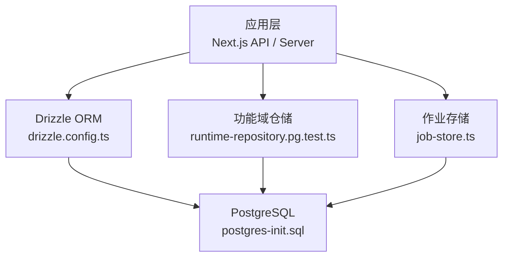
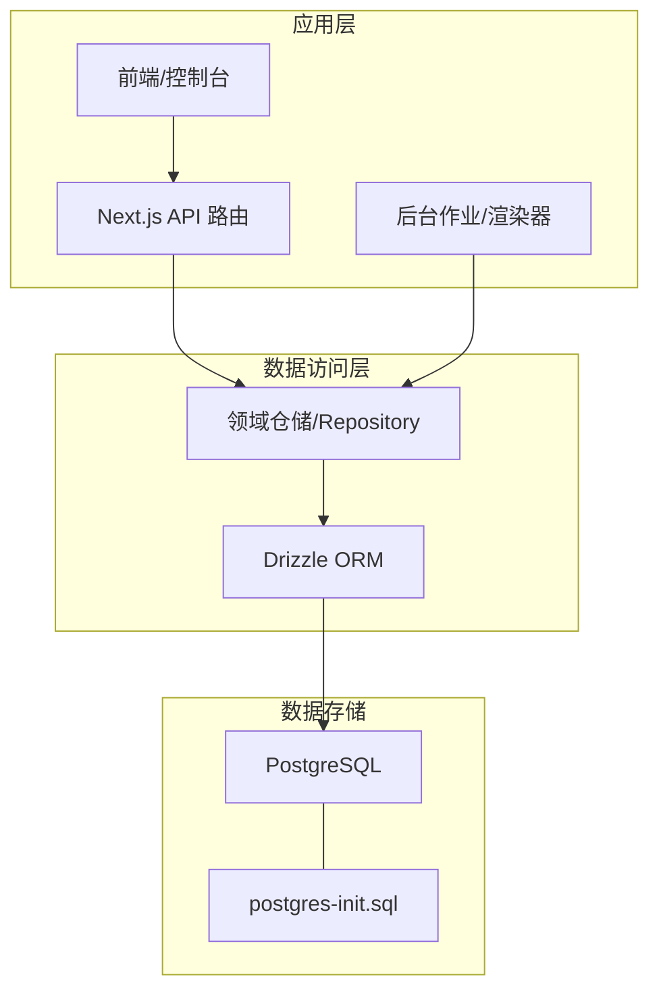
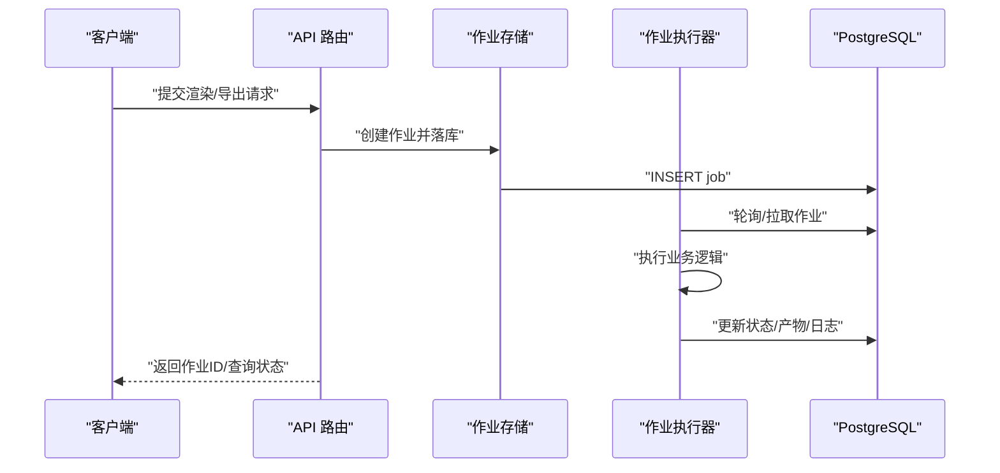
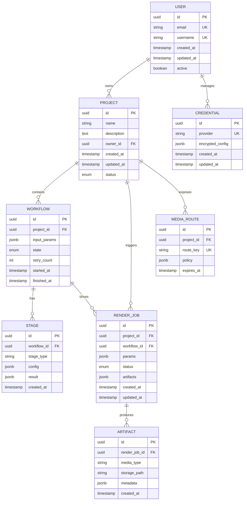
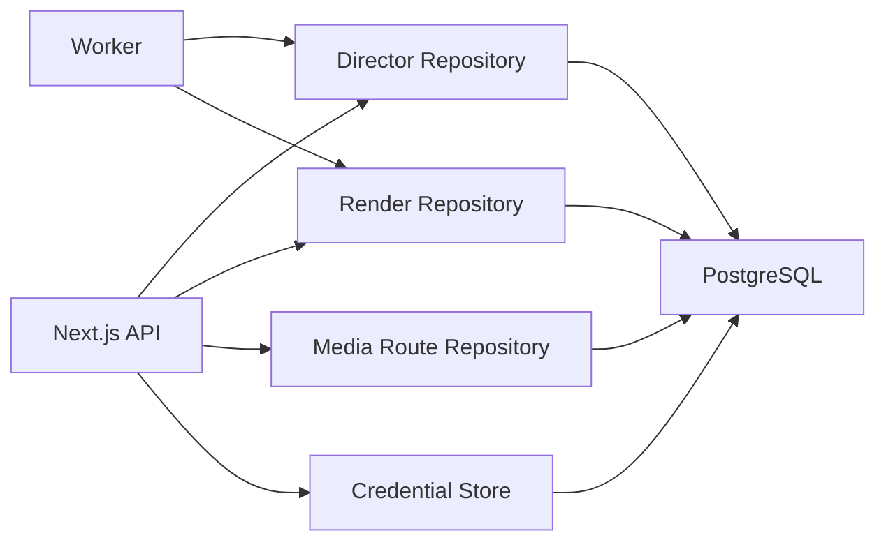

# 数据库设计

<cite>
**本文引用的文件**   
- [drizzle.config.ts](file://drizzle.config.ts)
- [scripts/setup/db-migrate.ts](file://scripts/setup/db-migrate.ts)
- [scripts/setup/postgres-init.sql](file://scripts/setup/postgres-init.sql)
- [server/src/server/job-store.ts](file://server/src/server/job-store.ts)
- [src/features/director/runtime-repository.pg.test.ts](file://src/features/director/runtime-repository.pg.test.ts)
- [src/features/audio/runtime-repository.pg.test.ts](file://src/features/audio/runtime-repository.pg.test.ts)
- [src/features/render/repository.pg.test.ts](file://src/features/render/repository.pg.test.ts)
- [src/features/routing/media-route-repository.pg.test.ts](file://src/features/routing/media-route-repository.pg.test.ts)
- [src/features/credentials/provider-credential-store.pg.test.ts](file://src/features/credentials/provider-credential-store.pg.test.ts)
</cite>

## 目录
1. [简介](#简介)
2. [项目结构](#项目结构)
3. [核心组件](#核心组件)
4. [架构总览](#架构总览)
5. [详细组件分析](#详细组件分析)
6. [依赖关系分析](#依赖关系分析)
7. [性能考虑](#性能考虑)
8. [故障排查指南](#故障排查指南)
9. [结论](#结论)
10. [附录](#附录)

## 简介
本文件面向 PurpleInk 的 PostgreSQL 数据库设计与实现，聚焦于：
- 数据库架构与表结构设计模式
- 核心数据模型（用户、项目、工作流、渲染任务等）字段定义、数据类型与约束
- 主键策略、外键关系与索引设计原则
- 数据规范化考量、查询优化策略与性能调优建议
- 架构图与数据流向图，展示表间关联与业务逻辑映射

说明：当前仓库未提供显式的 schema 定义文件。以下文档基于 drizzle 配置、迁移脚本、初始化 SQL 以及各功能模块的 PostgreSQL 测试夹具进行归纳与推断，旨在为后续落地 schema 与迁移提供权威参考。

## 项目结构
与数据库相关的关键位置：
- 驱动与迁移配置：drizzle.config.ts
- 迁移执行入口：scripts/setup/db-migrate.ts
- 数据库初始化脚本：scripts/setup/postgres-init.sql
- 作业持久化：server/src/server/job-store.ts
- 各功能域对 PG 的集成与验证：src/features/*/runtime-repository.pg.test.ts 或 repository.pg.test.ts

图表来源
- [drizzle.config.ts](file://drizzle.config.ts)
- [scripts/setup/postgres-init.sql](file://scripts/setup/postgres-init.sql)
- [server/src/server/job-store.ts](file://server/src/server/job-store.ts)
- [src/features/director/runtime-repository.pg.test.ts](file://src/features/director/runtime-repository.pg.test.ts)

章节来源
- [drizzle.config.ts](file://drizzle.config.ts)
- [scripts/setup/db-migrate.ts](file://scripts/setup/db-migrate.ts)
- [scripts/setup/postgres-init.sql](file://scripts/setup/postgres-init.sql)
- [server/src/server/job-store.ts](file://server/src/server/job-store.ts)

## 核心组件
- Drizzle 配置与迁移：通过 drizzle.config.ts 指定连接与迁移路径；db-migrate.ts 负责执行迁移与版本管理。
- 数据库初始化：postgres-init.sql 用于创建角色、权限、扩展与初始对象。
- 作业系统：job-store.ts 将导演/渲染/导出等作业状态持久化到 PG，保障可恢复性与可观测性。
- 领域仓储：director、audio、render、routing、credentials 等模块通过 pg 测试夹具验证读写行为，体现领域实体在 PG 中的落库形态。

章节来源
- [drizzle.config.ts](file://drizzle.config.ts)
- [scripts/setup/db-migrate.ts](file://scripts/setup/db-migrate.ts)
- [scripts/setup/postgres-init.sql](file://scripts/setup/postgres-init.sql)
- [server/src/server/job-store.ts](file://server/src/server/job-store.ts)
- [src/features/director/runtime-repository.pg.test.ts](file://src/features/director/runtime-repository.pg.test.ts)
- [src/features/audio/runtime-repository.pg.test.ts](file://src/features/audio/runtime-repository.pg.test.ts)
- [src/features/render/repository.pg.test.ts](file://src/features/render/repository.pg.test.ts)
- [src/features/routing/media-route-repository.pg.test.ts](file://src/features/routing/media-route-repository.pg.test.ts)
- [src/features/credentials/provider-credential-store.pg.test.ts](file://src/features/credentials/provider-credential-store.pg.test.ts)

## 架构总览
PurpleInk 的数据库层以 PostgreSQL 为核心，采用 Drizzle ORM 作为类型安全的访问层。上层 Next.js API 与服务进程通过仓储/服务调用数据库，完成用户、项目、工作流、渲染任务、媒体路由与凭据等数据的增删改查。

图表来源
- [drizzle.config.ts](file://drizzle.config.ts)
- [scripts/setup/postgres-init.sql](file://scripts/setup/postgres-init.sql)
- [server/src/server/job-store.ts](file://server/src/server/job-store.ts)

## 详细组件分析

### 用户与项目
- 用户实体：通常包含唯一标识、邮箱/用户名、认证信息、角色与权限、时间戳等。建议使用 UUID 作为主键，邮箱唯一索引，软删除标记与审计字段。
- 项目实体：包含项目元数据、所有者（外键至用户）、可见性、模板引用、统计指标、时间戳等。项目与用户一对多，项目内再组织工作流与渲染任务。

章节来源
- [scripts/setup/postgres-init.sql](file://scripts/setup/postgres-init.sql)

### 工作流与阶段
- 工作流（Pipeline/Session）：描述一次编排的执行上下文，包括输入参数、阶段列表、状态机流转、错误信息与重试计数。
- 阶段（Stage）：每个阶段的输入输出契约、提示词/工具调用记录、产物引用、耗时与结果摘要。

章节来源
- [src/features/director/runtime-repository.pg.test.ts](file://src/features/director/runtime-repository.pg.test.ts)

### 渲染任务与产物
- 渲染任务：绑定项目与工作流，包含帧序列、编码参数、队列优先级、状态、进度、错误日志、产物路径等。
- 产物（Artifact）：视频、音频、图片、字幕等资源的元数据与校验信息，支持版本化与溯源。

章节来源
- [src/features/render/repository.pg.test.ts](file://src/features/render/repository.pg.test.ts)

### 媒体路由与凭据
- 媒体路由：对外暴露的媒体访问地址与鉴权策略，支持 CDN 回源、签名 URL、缓存策略。
- 凭据：第三方服务（如 TTS、AI 模型）的密钥与配置，采用加密存储与最小权限原则。

章节来源
- [src/features/routing/media-route-repository.pg.test.ts](file://src/features/routing/media-route-repository.pg.test.ts)
- [src/features/credentials/provider-credential-store.pg.test.ts](file://src/features/credentials/provider-credential-store.pg.test.ts)

### 作业系统（Job Store）
- 作业类型：导演编排、渲染、导出、TTS 合成等。
- 状态机：待处理、运行中、成功、失败、重试、取消等。
- 幂等与可恢复：通过唯一作业 ID、去重键、检查点与断点续跑保证可靠性。

图表来源
- [server/src/server/job-store.ts](file://server/src/server/job-store.ts)

章节来源
- [server/src/server/job-store.ts](file://server/src/server/job-store.ts)

### 数据模型关系图（概念级）
以下为概念性 ER 图，便于理解实体间的关联与职责边界。实际字段与约束需结合迁移与测试夹具最终确定。

图表来源
- [scripts/setup/postgres-init.sql](file://scripts/setup/postgres-init.sql)
- [src/features/director/runtime-repository.pg.test.ts](file://src/features/director/runtime-repository.pg.test.ts)
- [src/features/render/repository.pg.test.ts](file://src/features/render/repository.pg.test.ts)
- [src/features/routing/media-route-repository.pg.test.ts](file://src/features/routing/media-route-repository.pg.test.ts)
- [src/features/credentials/provider-credential-store.pg.test.ts](file://src/features/credentials/provider-credential-store.pg.test.ts)

## 依赖关系分析
- 应用层依赖 Drizzle ORM 进行类型安全的数据访问，避免手写 SQL 带来的不一致。
- 各功能仓储通过统一的 PG 连接池访问数据库，确保事务一致性与资源复用。
- 作业系统与仓储解耦，通过状态机与持久化保证跨进程/容器的可靠性。

图表来源
- [src/features/director/runtime-repository.pg.test.ts](file://src/features/director/runtime-repository.pg.test.ts)
- [src/features/render/repository.pg.test.ts](file://src/features/render/repository.pg.test.ts)
- [src/features/routing/media-route-repository.pg.test.ts](file://src/features/routing/media-route-repository.pg.test.ts)
- [src/features/credentials/provider-credential-store.pg.test.ts](file://src/features/credentials/provider-credential-store.pg.test.ts)

章节来源
- [src/features/director/runtime-repository.pg.test.ts](file://src/features/director/runtime-repository.pg.test.ts)
- [src/features/render/repository.pg.test.ts](file://src/features/render/repository.pg.test.ts)
- [src/features/routing/media-route-repository.pg.test.ts](file://src/features/routing/media-route-repository.pg.test.ts)
- [src/features/credentials/provider-credential-store.pg.test.ts](file://src/features/credentials/provider-credential-store.pg.test.ts)

## 性能考虑
- 主键策略
  - 使用 UUID v4/v7 作为主键，避免自增 ID 泄露业务规模，提升分布式写入均匀性。
  - 对高频查询列建立复合索引，如 (project_id, status)、(workflow_id, stage_type)。
- 外键与一致性
  - 关键关联使用外键约束，保证数据完整性；对历史归档表可采用无外键以提升写入吞吐。
- 索引设计
  - 针对过滤、排序与连接列建立合适索引；避免过度索引导致写放大。
  - 对 JSONB 字段使用 GIN 索引以加速条件查询。
- 规范化与反规范化
  - 基础实体保持第三范式；热点聚合数据（如项目统计）采用冗余字段或物化视图。
- 查询优化
  - 使用覆盖索引减少回表；分页采用游标或 keyset 分页替代 offset。
  - 批量写入与 UPSERT 降低锁竞争。
- 连接与并发
  - 合理设置连接池大小与超时；长事务拆分为短事务。
- 存储与 I/O
  - 大对象（媒体文件）走对象存储，数据库仅存元数据与路径。
  - 启用 WAL 压缩与定期归档，控制磁盘增长。

[本节为通用性能指导，不直接分析具体文件]

## 故障排查指南
- 迁移与初始化
  - 确认 postgres-init.sql 已正确执行，扩展与角色权限完备。
  - 使用 db-migrate.ts 检查迁移版本与回滚策略。
- 作业失败
  - 检查作业状态机与重试计数；查看错误日志与产物缺失情况。
  - 核对幂等键与去重逻辑，避免重复消费。
- 连接与性能
  - 监控连接数、慢查询与锁等待；调整连接池与索引。
- 凭据与路由
  - 校验凭据加密与解密流程；检查媒体路由过期策略与签名有效性。

章节来源
- [scripts/setup/db-migrate.ts](file://scripts/setup/db-migrate.ts)
- [scripts/setup/postgres-init.sql](file://scripts/setup/postgres-init.sql)
- [server/src/server/job-store.ts](file://server/src/server/job-store.ts)

## 结论
PurpleInk 的数据库设计围绕“用户-项目-工作流-渲染任务-产物”的核心链路展开，借助 Drizzle ORM 与 PostgreSQL 构建类型安全、可扩展且高可靠的数据层。通过合理的索引与规范化策略、严格的作业状态机与幂等设计，支撑复杂的多阶段流水线与高并发渲染场景。后续应持续完善 schema 迁移与测试夹具，确保数据模型与业务演进保持一致。

[本节为总结性内容，不直接分析具体文件]

## 附录
- 术语
  - 工作流：一次编排执行的上下文与阶段集合
  - 产物：渲染过程中产生的音视频、图片、字幕等资源
  - 媒体路由：对外暴露的媒体访问策略与鉴权规则
  - 凭据：第三方服务的密钥与配置信息
- 建议
  - 尽快补齐显式 schema 定义与迁移脚本，统一由 Drizzle 管理
  - 完善 pg 测试夹具，覆盖关键 CRUD 与异常分支
  - 引入审计表与软删除，满足合规与回溯需求

[本节为补充信息，不直接分析具体文件]