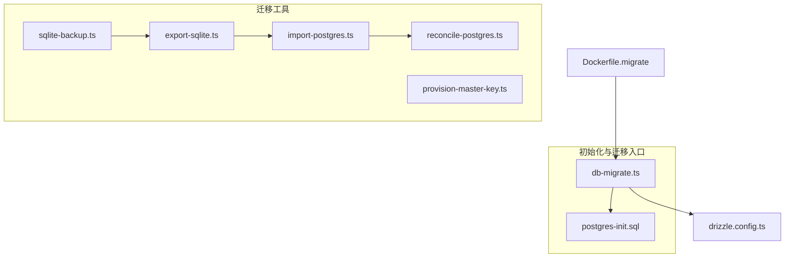
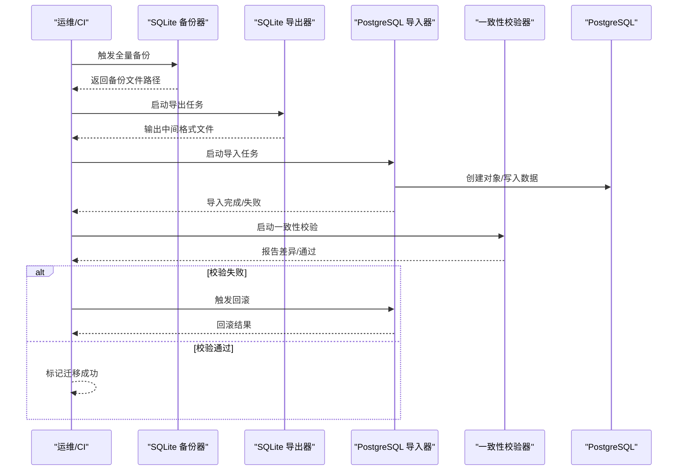
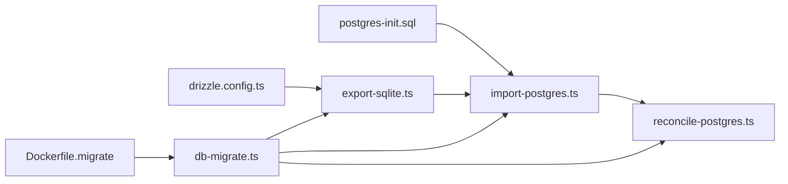

# 数据迁移

<cite>
**本文引用的文件**   
- [scripts/migration/export-sqlite.ts](file://scripts/migration/export-sqlite.ts)
- [scripts/migration/import-postgres.ts](file://scripts/migration/import-postgres.ts)
- [scripts/migration/provision-master-key.ts](file://scripts/migration/provision-master-key.ts)
- [scripts/migration/reconcile-postgres.ts](file://scripts/migration/reconcile-postgres.ts)
- [scripts/migration/sqlite-backup.ts](file://scripts/migration/sqlite-backup.ts)
- [scripts/setup/db-migrate.ts](file://scripts/setup/db-migrate.ts)
- [scripts/setup/postgres-init.sql](file://scripts/setup/postgres-init.sql)
- [drizzle.config.ts](file://drizzle.config.ts)
- [Dockerfile.migrate](file://Dockerfile.migrate)
</cite>

## 目录
1. [简介](#简介)
2. [项目结构](#项目结构)
3. [核心组件](#核心组件)
4. [架构总览](#架构总览)
5. [详细组件分析](#详细组件分析)
6. [依赖关系分析](#依赖关系分析)
7. [性能考虑](#性能考虑)
8. [故障排查指南](#故障排查指南)
9. [结论](#结论)
10. [附录](#附录)

## 简介
本文件面向紫墨水项目的数据迁移系统，系统性阐述迁移脚本编写规范、版本管理与回滚策略，增量迁移与数据转换机制、兼容性处理、执行流程、错误恢复与状态跟踪。同时覆盖生产环境部署注意事项、数据备份要求、迁移验证方法，并提供迁移脚本模板、常见迁移场景与最佳实践，以及分布式环境下的迁移协调与零停机部署策略。

## 项目结构
迁移相关代码主要分布在以下位置：
- 迁移工具脚本：scripts/migration/*（导出/导入、主密钥配置、一致性校验、SQLite 备份）
- 数据库初始化与迁移入口：scripts/setup/*（PostgreSQL 初始化 SQL、迁移执行脚本）
- ORM 配置：drizzle.config.ts（驱动与连接参数）
- 迁移专用镜像：Dockerfile.migrate（隔离运行迁移任务）

图表来源
- [scripts/migration/export-sqlite.ts](file://scripts/migration/export-sqlite.ts)
- [scripts/migration/import-postgres.ts](file://scripts/migration/import-postgres.ts)
- [scripts/migration/provision-master-key.ts](file://scripts/migration/provision-master-key.ts)
- [scripts/migration/reconcile-postgres.ts](file://scripts/migration/reconcile-postgres.ts)
- [scripts/migration/sqlite-backup.ts](file://scripts/migration/sqlite-backup.ts)
- [scripts/setup/db-migrate.ts](file://scripts/setup/db-migrate.ts)
- [scripts/setup/postgres-init.sql](file://scripts/setup/postgres-init.sql)
- [drizzle.config.ts](file://drizzle.config.ts)
- [Dockerfile.migrate](file://Dockerfile.migrate)

章节来源
- [scripts/migration/export-sqlite.ts](file://scripts/migration/export-sqlite.ts)
- [scripts/migration/import-postgres.ts](file://scripts/migration/import-postgres.ts)
- [scripts/migration/provision-master-key.ts](file://scripts/migration/provision-master-key.ts)
- [scripts/migration/reconcile-postgres.ts](file://scripts/migration/reconcile-postgres.ts)
- [scripts/migration/sqlite-backup.ts](file://scripts/migration/sqlite-backup.ts)
- [scripts/setup/db-migrate.ts](file://scripts/setup/db-migrate.ts)
- [scripts/setup/postgres-init.sql](file://scripts/setup/postgres-init.sql)
- [drizzle.config.ts](file://drizzle.config.ts)
- [Dockerfile.migrate](file://Dockerfile.migrate)

## 核心组件
- SQLite 导出器：将 SQLite 数据导出为可传输的中间格式，便于后续导入目标库。
- PostgreSQL 导入器：读取中间格式并写入目标 Postgres，支持批量写入与事务控制。
- 主密钥供应器：生成或注入加密所需的主密钥，确保敏感字段在迁移过程中的安全。
- 一致性校验器：对比源端与目标端的关键指标（行数、哈希、抽样记录），保障迁移质量。
- SQLite 备份器：在执行迁移前对 SQLite 进行快照备份，提供快速回退能力。
- 迁移编排器：统一入口，按顺序执行初始化、导入、校验等步骤，并输出结构化日志。
- 初始化 SQL：定义目标库的基础对象（用户、角色、表、索引、约束）。
- Drizzle 配置：集中管理数据库连接参数与驱动选项，保证迁移与运行时一致。
- 迁移镜像：提供隔离的运行环境，避免依赖冲突与权限问题。

章节来源
- [scripts/migration/export-sqlite.ts](file://scripts/migration/export-sqlite.ts)
- [scripts/migration/import-postgres.ts](file://scripts/migration/import-postgres.ts)
- [scripts/migration/provision-master-key.ts](file://scripts/migration/provision-master-key.ts)
- [scripts/migration/reconcile-postgres.ts](file://scripts/migration/reconcile-postgres.ts)
- [scripts/migration/sqlite-backup.ts](file://scripts/migration/sqlite-backup.ts)
- [scripts/setup/db-migrate.ts](file://scripts/setup/db-migrate.ts)
- [scripts/setup/postgres-init.sql](file://scripts/setup/postgres-init.sql)
- [drizzle.config.ts](file://drizzle.config.ts)
- [Dockerfile.migrate](file://Dockerfile.migrate)

## 架构总览
下图展示了从 SQLite 到 PostgreSQL 的端到端迁移流程，包括备份、导出、导入、校验与回滚路径。

图表来源
- [scripts/migration/sqlite-backup.ts](file://scripts/migration/sqlite-backup.ts)
- [scripts/migration/export-sqlite.ts](file://scripts/migration/export-sqlite.ts)
- [scripts/migration/import-postgres.ts](file://scripts/migration/import-postgres.ts)
- [scripts/migration/reconcile-postgres.ts](file://scripts/migration/reconcile-postgres.ts)

## 详细组件分析

### SQLite 备份器
- 职责：在执行任何变更之前，对 SQLite 数据库进行快照备份，确保可快速回退。
- 关键行为：
  - 检查源库可用性
  - 生成带时间戳的备份文件
  - 校验备份文件大小与完整性
  - 输出结构化日志与退出码
- 错误处理：
  - 源库不可用：立即失败并提示修复
  - 磁盘空间不足：中止并告警
  - 校验失败：重试一次后失败
- 回滚策略：
  - 使用备份文件直接替换原库，实现秒级回滚

章节来源
- [scripts/migration/sqlite-backup.ts](file://scripts/migration/sqlite-backup.ts)

### SQLite 导出器
- 职责：将 SQLite 数据转换为中间格式（如 JSON/CSV/Parquet），供导入器消费。
- 关键行为：
  - 解析 drizzle 配置获取连接信息
  - 遍历表结构并导出数据
  - 支持分页与批大小控制
  - 输出进度与统计信息
- 数据转换：
  - 类型映射（日期、布尔、二进制）
  - 空值与默认值规范化
  - 大字段分块处理
- 错误处理：
  - 表不存在：跳过并记录
  - 数据类型不匹配：抛出异常并中断
  - 内存溢出：降低批大小重试

章节来源
- [scripts/migration/export-sqlite.ts](file://scripts/migration/export-sqlite.ts)
- [drizzle.config.ts](file://drizzle.config.ts)

### PostgreSQL 导入器
- 职责：读取中间格式并写入目标 Postgres，支持批量写入与事务控制。
- 关键行为：
  - 连接目标库并校验权限
  - 创建必要对象（若未存在）
  - 分批插入数据，提交事务
  - 构建索引与约束
- 数据转换：
  - 反向类型映射
  - 字符集与排序规则适配
  - 外键与引用完整性检查
- 错误处理：
  - 唯一约束冲突：去重或报错
  - 外键违反：记录并中止
  - 网络中断：断点续传（基于中间文件偏移）

章节来源
- [scripts/migration/import-postgres.ts](file://scripts/migration/import-postgres.ts)
- [scripts/setup/postgres-init.sql](file://scripts/setup/postgres-init.sql)

### 一致性校验器
- 职责：对比源端与目标端的数据一致性，确保迁移质量。
- 关键行为：
  - 统计行数、聚合值、抽样哈希
  - 比较关键字段分布
  - 输出差异报告
- 判定标准：
  - 行数误差阈值
  - 哈希一致性
  - 抽样记录比对通过率
- 错误处理：
  - 无法连接源库：降级为仅目标端自检
  - 差异超出阈值：标记失败并建议回滚

章节来源
- [scripts/migration/reconcile-postgres.ts](file://scripts/migration/reconcile-postgres.ts)

### 主密钥供应器
- 职责：生成或注入用于敏感字段加密的主密钥，确保迁移过程安全。
- 关键行为：
  - 检测是否已存在主密钥
  - 生成强随机主密钥
  - 写入环境变量或密钥管理服务
  - 验证密钥可用性
- 错误处理：
  - 密钥服务不可用：失败并告警
  - 权限不足：提示修复

章节来源
- [scripts/migration/provision-master-key.ts](file://scripts/migration/provision-master-key.ts)

### 迁移编排器
- 职责：统一入口，按顺序执行初始化、导入、校验等步骤，并输出结构化日志。
- 关键行为：
  - 加载配置与环境变量
  - 调用备份、导出、导入、校验等子任务
  - 捕获异常并记录上下文
  - 输出最终状态码与摘要
- 错误处理：
  - 任一阶段失败：终止并记录
  - 部分成功：提供回滚指引

章节来源
- [scripts/setup/db-migrate.ts](file://scripts/setup/db-migrate.ts)

### 初始化 SQL
- 职责：定义目标库的基础对象（用户、角色、表、索引、约束）。
- 关键行为：
  - 创建数据库与用户
  - 设置权限与默认值
  - 创建基础表结构与索引
- 错误处理：
  - 对象已存在：忽略或升级
  - 语法错误：中止并提示

章节来源
- [scripts/setup/postgres-init.sql](file://scripts/setup/postgres-init.sql)

### Drizzle 配置
- 职责：集中管理数据库连接参数与驱动选项，保证迁移与运行时一致。
- 关键行为：
  - 指定驱动与连接字符串
  - 配置 SSL、超时、池大小
  - 暴露给各迁移脚本使用
- 错误处理：
  - 连接失败：重试与告警

章节来源
- [drizzle.config.ts](file://drizzle.config.ts)

### 迁移镜像
- 职责：提供隔离的运行环境，避免依赖冲突与权限问题。
- 关键行为：
  - 安装 Node.js 与依赖
  - 复制迁移脚本与配置
  - 执行迁移命令
- 错误处理：
  - 构建失败：输出构建日志
  - 运行失败：输出容器日志

章节来源
- [Dockerfile.migrate](file://Dockerfile.migrate)

## 依赖关系分析
迁移子系统内部依赖如下：
- 导出器依赖 Drizzle 配置以获取源库连接
- 导入器依赖初始化 SQL 以确保目标库就绪
- 校验器依赖导出器与导入器的产物与状态
- 编排器串联所有子任务，负责错误传播与状态汇总

图表来源
- [drizzle.config.ts](file://drizzle.config.ts)
- [scripts/migration/export-sqlite.ts](file://scripts/migration/export-sqlite.ts)
- [scripts/migration/import-postgres.ts](file://scripts/migration/import-postgres.ts)
- [scripts/migration/reconcile-postgres.ts](file://scripts/migration/reconcile-postgres.ts)
- [scripts/setup/db-migrate.ts](file://scripts/setup/db-migrate.ts)
- [scripts/setup/postgres-init.sql](file://scripts/setup/postgres-init.sql)
- [Dockerfile.migrate](file://Dockerfile.migrate)

章节来源
- [drizzle.config.ts](file://drizzle.config.ts)
- [scripts/migration/export-sqlite.ts](file://scripts/migration/export-sqlite.ts)
- [scripts/migration/import-postgres.ts](file://scripts/migration/import-postgres.ts)
- [scripts/migration/reconcile-postgres.ts](file://scripts/migration/reconcile-postgres.ts)
- [scripts/setup/db-migrate.ts](file://scripts/setup/db-migrate.ts)
- [scripts/setup/postgres-init.sql](file://scripts/setup/postgres-init.sql)
- [Dockerfile.migrate](file://Dockerfile.migrate)

## 性能考虑
- 批大小调优：根据内存与网络状况调整导出/导入批大小，平衡吞吐与稳定性。
- 并行度控制：对无依赖的表可并行导出/导入，但需限制并发以避免资源争用。
- 索引延迟构建：先导入数据再构建索引，减少写入放大。
- 连接池优化：合理设置最大连接数与超时，避免连接耗尽。
- 大字段处理：分块读写，避免一次性加载至内存。
- 监控与度量：记录每个阶段的耗时、吞吐量与错误率，便于定位瓶颈。

[本节为通用指导，无需特定文件引用]

## 故障排查指南
- 常见问题与定位：
  - 连接失败：检查 Drizzle 配置与网络连通性
  - 权限不足：确认目标库用户具备必要权限
  - 数据类型不匹配：核对类型映射与转换逻辑
  - 唯一约束冲突：检查去重策略与数据清洗
  - 外键违反：确认引用完整性与导入顺序
- 日志与诊断：
  - 启用结构化日志，记录阶段、行号、错误堆栈
  - 保留中间文件以便复现问题
  - 输出性能指标（QPS、延迟、内存占用）
- 回滚策略：
  - 使用 SQLite 备份文件快速回退
  - 导入器支持事务回滚，确保原子性
  - 校验失败时自动触发回滚流程

章节来源
- [scripts/migration/sqlite-backup.ts](file://scripts/migration/sqlite-backup.ts)
- [scripts/migration/import-postgres.ts](file://scripts/migration/import-postgres.ts)
- [scripts/migration/reconcile-postgres.ts](file://scripts/migration/reconcile-postgres.ts)
- [scripts/setup/db-migrate.ts](file://scripts/setup/db-migrate.ts)

## 结论
本迁移系统通过模块化设计实现了从 SQLite 到 PostgreSQL 的安全、可靠、可观测的数据迁移。借助备份、导出、导入、校验与回滚机制，能够在生产环境中实现低风险的版本演进。配合严格的脚本规范与最佳实践，可有效降低迁移风险并提升交付效率。

[本节为总结性内容，无需特定文件引用]

## 附录

### 迁移脚本编写规范
- 命名约定：动词+名词（如 export-sqlite、import-postgres）
- 输入输出：明确参数、配置文件与产物路径
- 错误处理：尽早失败，记录上下文，提供可操作提示
- 幂等性：支持重复执行而不产生副作用
- 可观测性：结构化日志、指标与审计事件

[本节为通用规范，无需特定文件引用]

### 版本管理与回滚策略
- 版本号：采用语义化版本（主.次.修订）
- 元数据：记录迁移脚本哈希、执行时间、状态
- 回滚脚本：每个正向迁移对应反向脚本
- 灰度发布：小流量验证后再全量推进

[本节为通用策略，无需特定文件引用]

### 增量迁移与数据转换
- 增量策略：基于时间戳或版本号增量同步
- 数据转换：类型映射、格式标准化、空值处理
- 兼容性：向后兼容旧版本客户端与接口

[本节为通用机制，无需特定文件引用]

### 迁移执行流程
- 准备：备份、环境检查、依赖安装
- 执行：初始化、导入、校验
- 收尾：清理临时文件、更新元数据、通知

[本节为通用流程，无需特定文件引用]

### 生产环境部署注意事项
- 资源预留：CPU、内存、磁盘、网络带宽
- 权限最小化：仅授予必要权限
- 监控告警：关键指标与阈值告警
- 演练与演练复盘：定期演练并改进预案

[本节为通用注意事项，无需特定文件引用]

### 数据备份要求
- 全量备份：迁移前必须执行
- 增量备份：长耗时迁移期间周期性备份
- 备份验证：校验备份可用性与完整性
- 保留策略：按合规要求保留历史备份

[本节为通用要求，无需特定文件引用]

### 迁移验证方法
- 行数与聚合校验：对比关键统计指标
- 抽样比对：随机抽样记录逐字段比对
- 业务验证：关键业务流程端到端测试
- 性能回归：对比迁移前后性能基线

[本节为通用方法，无需特定文件引用]

### 迁移脚本模板
- 模板结构：参数解析、连接建立、数据处理、错误处理、日志输出
- 示例路径：参考现有脚本结构与注释

章节来源
- [scripts/migration/export-sqlite.ts](file://scripts/migration/export-sqlite.ts)
- [scripts/migration/import-postgres.ts](file://scripts/migration/import-postgres.ts)
- [scripts/migration/provision-master-key.ts](file://scripts/migration/provision-master-key.ts)
- [scripts/migration/reconcile-postgres.ts](file://scripts/migration/reconcile-postgres.ts)
- [scripts/migration/sqlite-backup.ts](file://scripts/migration/sqlite-backup.ts)
- [scripts/setup/db-migrate.ts](file://scripts/setup/db-migrate.ts)

### 常见迁移场景
- 表结构变更：新增列、修改类型、添加索引
- 数据清洗：去重、格式化、补全缺失值
- 跨库迁移：SQLite 到 Postgres、不同版本间迁移
- 分库分表：拆分大表、合并小表、重建索引

[本节为通用场景，无需特定文件引用]

### 最佳实践指南
- 小步快跑：每次变更尽量小，降低风险
- 自动化：CI/CD 流水线集成迁移与验证
- 文档化：变更记录、影响面评估、回滚预案
- 协作：开发、测试、运维协同评审与演练

[本节为通用实践，无需特定文件引用]

### 分布式环境下的迁移协调
- 协调器：统一调度多节点迁移任务
- 锁机制：防止重复执行与冲突
- 状态同步：共享迁移状态与进度
- 容错：节点失败自动重试与切换

[本节为通用策略，无需特定文件引用]

### 零停机部署策略
- 双写与回放：新库双写，老库回放增量
- 灰度切流：逐步将流量切换到新库
- 回切预案：发现问题快速切回老库
- 监控与告警：实时监控关键指标

[本节为通用策略，无需特定文件引用]