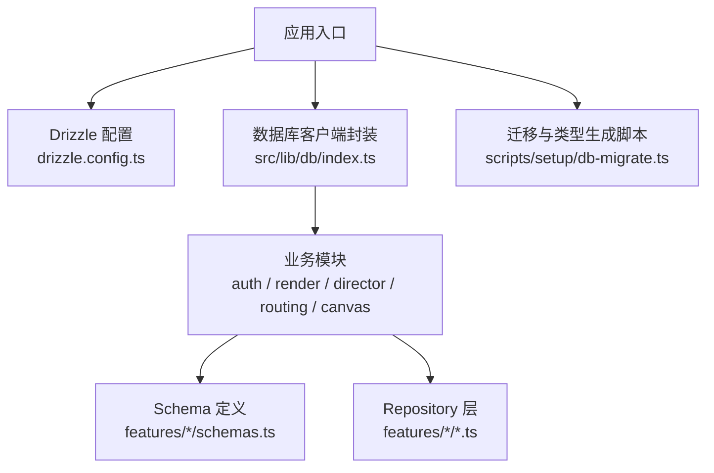
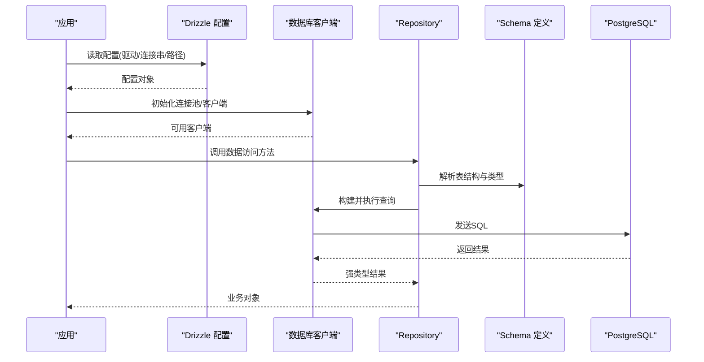
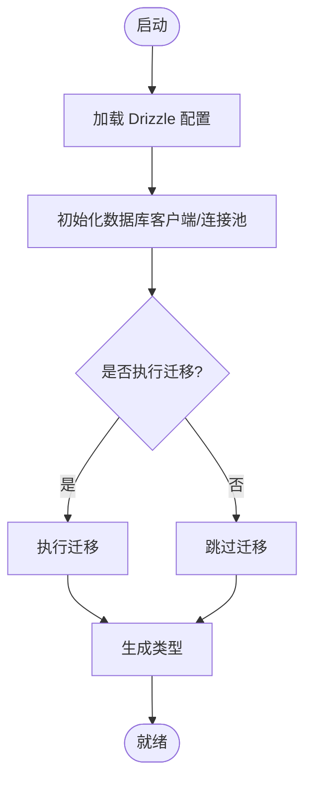
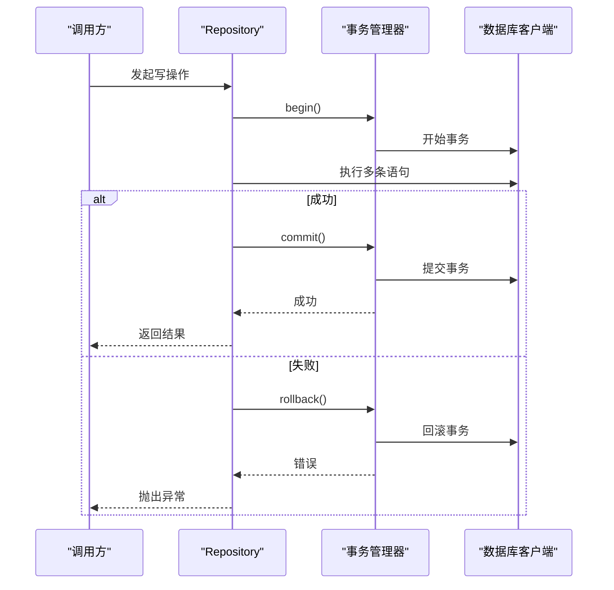
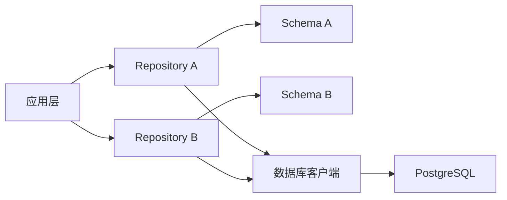

# ORM使用指南

<cite>
**本文引用的文件**   
- [drizzle.config.ts](file://drizzle.config.ts)
- [package.json](file://package.json)
- [tsconfig.json](file://tsconfig.json)
- [scripts/setup/db-migrate.ts](file://scripts/setup/db-migrate.ts)
- [src/lib/db/index.ts](file://src/lib/db/index.ts)
- [src/features/auth/account-service.pg.test.ts](file://src/features/auth/account-service.pg.test.ts)
- [src/features/auth/verification-repository.ts](file://src/features/auth/verification-repository.ts)
- [src/features/render/repository.ts](file://src/features/render/repository.ts)
- [src/features/director/runtime-repository.pg.test.ts](file://src/features/director/runtime-repository.pg.test.ts)
- [src/features/routing/media-route-repository.ts](file://src/features/routing/media-route-repository.ts)
- [src/features/canvas/schemas.ts](file://src/features/canvas/schemas.ts)
- [src/features/auth/schemas.ts](file://src/features/auth/schemas.ts)
</cite>

## 目录
1. [简介](#简介)
2. [项目结构](#项目结构)
3. [核心组件](#核心组件)
4. [架构总览](#架构总览)
5. [详细组件分析](#详细组件分析)
6. [依赖关系分析](#依赖关系分析)
7. [性能考虑](#性能考虑)
8. [故障排查指南](#故障排查指南)
9. [结论](#结论)
10. [附录](#附录)

## 简介
本指南面向在项目中集成与使用 Drizzle ORM 的开发者，围绕配置初始化、Schema 定义、查询构建、事务处理、性能优化与最佳实践进行系统化说明。文档基于仓库中现有代码与脚本进行分析，帮助读者快速上手并高效使用 Drizzle。

## 项目结构
本项目采用“功能域 + 共享库”的组织方式：
- 根级 drizzle 配置文件集中管理迁移与类型生成。
- 数据库连接与客户端封装位于共享库 src/lib/db。
- 各业务域（如 auth、render、director、routing、canvas）内维护各自的 Schema 与 Repository。
- 迁移与种子脚本集中在 scripts 目录。

图表来源
- [drizzle.config.ts](file://drizzle.config.ts)
- [src/lib/db/index.ts](file://src/lib/db/index.ts)
- [scripts/setup/db-migrate.ts](file://scripts/setup/db-migrate.ts)

章节来源
- [drizzle.config.ts](file://drizzle.config.ts)
- [package.json](file://package.json)
- [tsconfig.json](file://tsconfig.json)

## 核心组件
- Drizzle 配置与类型生成
  - 通过根级配置文件指定数据库驱动、模式路径、输出目录等，配合 CLI 命令完成 SQL 迁移与 TypeScript 类型生成。
- 数据库连接与客户端
  - 在共享库中统一创建连接池与客户端实例，供各业务模块复用。
- Schema 定义
  - 在各功能域内以独立文件声明表结构与列约束，确保类型安全与可维护性。
- Repository 层
  - 将数据访问逻辑封装为领域服务或仓储，屏蔽底层 SQL 细节，便于测试与扩展。

章节来源
- [drizzle.config.ts](file://drizzle.config.ts)
- [src/lib/db/index.ts](file://src/lib/db/index.ts)
- [scripts/setup/db-migrate.ts](file://scripts/setup/db-migrate.ts)

## 架构总览
下图展示了从应用调用到数据库交互的整体流程，包括配置加载、客户端获取、Schema 解析与查询执行。

图表来源
- [drizzle.config.ts](file://drizzle.config.ts)
- [src/lib/db/index.ts](file://src/lib/db/index.ts)
- [src/features/canvas/schemas.ts](file://src/features/canvas/schemas.ts)
- [src/features/auth/schemas.ts](file://src/features/auth/schemas.ts)

## 详细组件分析

### 配置与初始化
- 配置文件职责
  - 指定数据库驱动、连接参数、Schema 源路径、生成输出目录等。
  - 提供迁移与类型生成的命令行入口。
- 初始化流程
  - 应用启动时加载配置，创建数据库客户端与连接池。
  - 按需执行迁移与类型生成，确保类型与数据库一致。

图表来源
- [drizzle.config.ts](file://drizzle.config.ts)
- [scripts/setup/db-migrate.ts](file://scripts/setup/db-migrate.ts)

章节来源
- [drizzle.config.ts](file://drizzle.config.ts)
- [scripts/setup/db-migrate.ts](file://scripts/setup/db-migrate.ts)

### Schema 定义语法
- 表结构
  - 使用函数式 API 声明表名与列集合，支持主键、唯一、非空、默认值等约束。
- 列类型
  - 覆盖常见标量类型、时间戳、JSON、枚举等；推荐结合 TypeScript 类型推导以获得完整类型提示。
- 约束与索引
  - 可在列级别或表级别定义唯一、外键、检查约束与索引，提升数据完整性与查询性能。
- 组织方式
  - 按功能域拆分 schema 文件，避免耦合；在模块内导出表对象供查询使用。

章节来源
- [src/features/canvas/schemas.ts](file://src/features/canvas/schemas.ts)
- [src/features/auth/schemas.ts](file://src/features/auth/schemas.ts)

### 查询构建器使用
- SELECT
  - 使用 select 构建选择查询，支持 where、orderBy、limit、offset、join、groupBy、having 等。
- INSERT
  - 使用 insert 插入单条或多条记录，支持 onConflict 策略。
- UPDATE
  - 使用 update 更新记录，结合 where 条件精准定位。
- DELETE
  - 使用 deleteFrom 删除记录，建议配合事务与幂等键。
- 复杂查询与联表
  - 通过 join 实现多表关联，注意字段命名冲突与类型推断；对大表查询应添加必要索引与分页。

章节来源
- [src/features/auth/verification-repository.ts](file://src/features/auth/verification-repository.ts)
- [src/features/render/repository.ts](file://src/features/render/repository.ts)
- [src/features/routing/media-route-repository.ts](file://src/features/routing/media-route-repository.ts)

### 事务处理机制
- 事务边界
  - 在 Repository 层开启事务，包裹一组原子操作，保证一致性。
- 错误处理与回滚
  - 捕获异常后显式回滚，确保资源释放与状态回退。
- 嵌套与传播
  - 谨慎使用嵌套事务；必要时使用保存点模拟子事务。
- 并发控制
  - 在高并发场景下使用行级锁或乐观锁避免竞态条件。

图表来源
- [src/features/auth/account-service.pg.test.ts](file://src/features/auth/account-service.pg.test.ts)
- [src/features/director/runtime-repository.pg.test.ts](file://src/features/director/runtime-repository.pg.test.ts)

章节来源
- [src/features/auth/account-service.pg.test.ts](file://src/features/auth/account-service.pg.test.ts)
- [src/features/director/runtime-repository.pg.test.ts](file://src/features/director/runtime-repository.pg.test.ts)

### 连接池与客户端封装
- 连接池配置
  - 设置最大连接数、超时、空闲回收等参数，平衡吞吐与资源占用。
- 客户端复用
  - 全局单例或作用域内共享客户端，避免重复建立连接。
- 健康检查
  - 定期探测连接可用性，失败时自动重建。

章节来源
- [src/lib/db/index.ts](file://src/lib/db/index.ts)

## 依赖关系分析
- 模块耦合
  - Repository 依赖 Schema 与数据库客户端；业务服务依赖 Repository。
- 外部依赖
  - Drizzle 运行时、数据库驱动（如 PostgreSQL）、TypeScript 类型生成工具。
- 潜在循环依赖
  - 通过分层与接口隔离避免循环引用。

图表来源
- [src/lib/db/index.ts](file://src/lib/db/index.ts)
- [src/features/canvas/schemas.ts](file://src/features/canvas/schemas.ts)
- [src/features/auth/schemas.ts](file://src/features/auth/schemas.ts)

章节来源
- [package.json](file://package.json)
- [tsconfig.json](file://tsconfig.json)

## 性能考虑
- 查询优化
  - 仅选择必要字段，避免 SELECT *；合理使用索引与覆盖索引；分页与限制返回行数。
- 批量操作
  - 使用批量插入/更新减少往返次数；注意事务大小与内存占用。
- 连接池配置
  - 根据并发与延迟目标调整最大连接数与超时；监控连接使用率与等待队列。
- 缓存与读写分离
  - 热点数据引入缓存层；读多写少场景考虑只读副本。
- 慢查询治理
  - 启用查询日志与 EXPLAIN 分析，持续优化 SQL 与索引。

[本节为通用指导，不直接分析具体文件]

## 故障排查指南
- 常见问题
  - 连接失败：检查连接串、网络、权限与防火墙。
  - 类型不一致：重新运行类型生成，确保 Schema 变更已同步。
  - 事务未提交：确认异常分支包含回滚逻辑。
  - 性能退化：查看慢查询日志与索引命中情况。
- 调试技巧
  - 打印执行的 SQL 与参数；使用数据库客户端直连验证。
  - 在测试中构造最小复现用例，隔离问题范围。

章节来源
- [scripts/setup/db-migrate.ts](file://scripts/setup/db-migrate.ts)
- [src/features/auth/account-service.pg.test.ts](file://src/features/auth/account-service.pg.test.ts)

## 结论
通过统一的配置与客户端封装、清晰的 Schema 分层与 Repository 抽象，项目实现了类型安全、可维护且高性能的数据访问层。遵循本文的最佳实践与性能建议，可进一步提升稳定性与可扩展性。

[本节为总结，不直接分析具体文件]

## 附录
- 常用命令
  - 迁移：执行迁移脚本，确保数据库结构与 Schema 一致。
  - 类型生成：根据 Schema 生成 TypeScript 类型，保障编译期校验。
- 参考文件
  - 配置与脚本：见根级配置文件与迁移脚本。
  - 示例仓库：参考各功能域的 repository 与 schema 文件。

[本节为补充信息，不直接分析具体文件]