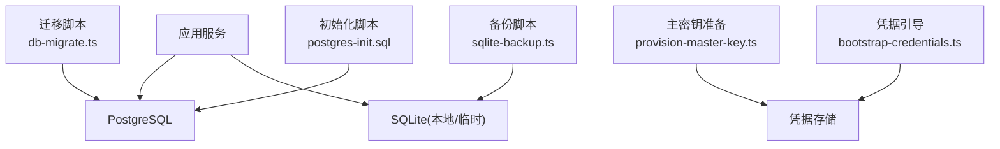
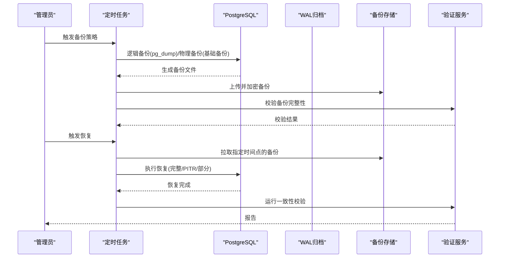
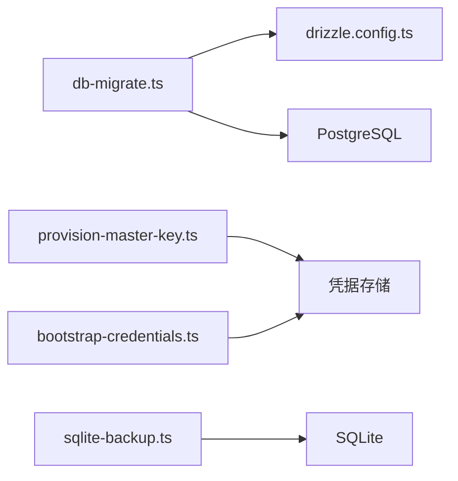

# 备份恢复

<cite>
**本文引用的文件**   
- [sqlite-backup.ts](file://scripts/migration/sqlite-backup.ts)
- [postgres-init.sql](file://scripts/setup/postgres-init.sql)
- [provision-master-key.ts](file://scripts/migration/provision-master-key.ts)
- [bootstrap-credentials.ts](file://scripts/setup/bootstrap-credentials.ts)
- [db-migrate.ts](file://scripts/setup/db-migrate.ts)
- [reconcile-postgres.ts](file://scripts/migration/reconcile-postgres.ts)
- [docker-compose.dev.yml](file://docker-compose.dev.yml)
- [docker-compose.prod.yml](file://docker-compose.prod.yml)
- [drizzle.config.ts](file://drizzle.config.ts)
</cite>

## 目录
1. [简介](#简介)
2. [项目结构](#项目结构)
3. [核心组件](#核心组件)
4. [架构总览](#架构总览)
5. [详细组件分析](#详细组件分析)
6. [依赖关系分析](#依赖关系分析)
7. [性能考虑](#性能考虑)
8. [故障排查指南](#故障排查指南)
9. [结论](#结论)
10. [附录](#附录)

## 简介
本文件面向本项目的数据库备份与恢复，覆盖以下主题：
- 备份策略：全量、增量、差异的适用场景与选择建议
- PostgreSQL 备份方法：逻辑备份（pg_dump）、物理备份（基础备份+WAL归档）
- 恢复流程：完整恢复、时间点恢复（PITR）、部分恢复
- 自动化脚本配置与执行
- 灾难恢复计划与演练流程
- 备份数据存储策略与加密方案
- 备份验证与完整性检查

说明：仓库中未包含现成的 pg_dump/物理备份自动化脚本，但提供了 SQLite 备份脚本、PostgreSQL 初始化与主密钥管理脚本。本文基于仓库现有实现进行扩展性设计，并给出可直接落地的操作指引。

## 项目结构
与备份恢复相关的代码与配置主要位于 scripts 与根级编排文件中：
- scripts/migration：迁移与数据工具，含 SQLite 备份脚本、主密钥准备等
- scripts/setup：环境初始化与数据库迁移入口，含 PostgreSQL 初始化 SQL、凭据引导、迁移执行
- docker-compose.*：开发/生产容器编排，通常用于运行 PostgreSQL 及辅助服务
- drizzle.config.ts：ORM 配置，影响迁移与导出/导入行为

图表来源
- [sqlite-backup.ts](file://scripts/migration/sqlite-backup.ts)
- [postgres-init.sql](file://scripts/setup/postgres-init.sql)
- [provision-master-key.ts](file://scripts/migration/provision-master-key.ts)
- [bootstrap-credentials.ts](file://scripts/setup/bootstrap-credentials.ts)
- [db-migrate.ts](file://scripts/setup/db-migrate.ts)

章节来源
- [sqlite-backup.ts](file://scripts/migration/sqlite-backup.ts)
- [postgres-init.sql](file://scripts/setup/postgres-init.sql)
- [provision-master-key.ts](file://scripts/migration/provision-master-key.ts)
- [bootstrap-credentials.ts](file://scripts/setup/bootstrap-credentials.ts)
- [db-migrate.ts](file://scripts/setup/db-migrate.ts)

## 核心组件
- SQLite 备份脚本：提供对 SQLite 数据的快照能力，便于快速回滚或迁移
- PostgreSQL 初始化脚本：定义初始对象、权限与基线数据
- 主密钥与凭据管理：为敏感信息（如加密密钥、连接串）提供安全注入与生命周期管理
- 迁移执行器：确保数据库结构与版本一致，是恢复后一致性校验的关键环节

章节来源
- [sqlite-backup.ts](file://scripts/migration/sqlite-backup.ts)
- [postgres-init.sql](file://scripts/setup/postgres-init.sql)
- [provision-master-key.ts](file://scripts/migration/provision-master-key.ts)
- [bootstrap-credentials.ts](file://scripts/setup/bootstrap-credentials.ts)
- [db-migrate.ts](file://scripts/setup/db-migrate.ts)

## 架构总览
下图展示备份与恢复的整体流程，涵盖逻辑备份、物理备份、恢复与验证的关键步骤。

图表来源
- [postgres-init.sql](file://scripts/setup/postgres-init.sql)
- [db-migrate.ts](file://scripts/setup/db-migrate.ts)
- [provision-master-key.ts](file://scripts/migration/provision-master-key.ts)
- [bootstrap-credentials.ts](file://scripts/setup/bootstrap-credentials.ts)

## 详细组件分析

### 备份策略选择与配置
- 全量备份
  - 适用：首次备份、定期基线、小规模库
  - 优点：恢复简单；缺点：体积大、周期长
- 增量备份
  - 适用：频繁写入、需最小化备份窗口
  - 优点：体积小、频率高；缺点：恢复链复杂
- 差异备份
  - 适用：平衡恢复复杂度与备份成本
  - 优点：恢复仅需基线+最新差异；缺点：差异文件随时间增长

实践建议：
- 每日一次全量 + 每小时一次差异（或增量），结合 WAL 归档实现 PITR
- 将备份保留策略与 RPO/RTO 对齐，按天/周/月分层保留

章节来源
- [postgres-init.sql](file://scripts/setup/postgres-init.sql)
- [db-migrate.ts](file://scripts/setup/db-migrate.ts)

### PostgreSQL 备份方法
- 逻辑备份（pg_dump）
  - 适合跨版本迁移、选择性导出、结构化恢复
  - 可配合压缩与并行选项提升吞吐
- 物理备份（基础备份 + WAL 归档）
  - 适合大规模库、快速恢复与 PITR
  - 需要启用 wal_level=replica、archive_mode=on、archive_command

注意：仓库未包含 pg_dump/物理备份脚本，建议在 CI/CD 或系统 crontab 中集成外部工具，并通过环境变量注入连接参数与加密密钥。

章节来源
- [postgres-init.sql](file://scripts/setup/postgres-init.sql)
- [docker-compose.dev.yml](file://docker-compose.dev.yml)
- [docker-compose.prod.yml](file://docker-compose.prod.yml)

### 恢复流程
- 完整恢复
  - 使用最近一次全量备份恢复，必要时追加差异/增量
- 时间点恢复（PITR）
  - 在全量基础上回放 WAL 至目标时间点
- 部分恢复
  - 从逻辑备份中抽取特定表/模式，导入到目标库

关键校验：
- 恢复后执行迁移脚本以确保结构一致
- 运行数据一致性校验（行数、哈希、抽样比对）

章节来源
- [db-migrate.ts](file://scripts/setup/db-migrate.ts)
- [postgres-init.sql](file://scripts/setup/postgres-init.sql)

### 自动化备份脚本配置与执行
- 推荐方式
  - 系统级 cron 或容器内 sidecar 定时任务
  - 通过环境变量注入 PG 连接串、备份路径、加密密钥
- 输出规范
  - 文件名包含时间戳与类型标识（full/diff/inc）
  - 生成校验文件（如 sha256sum）
- 失败重试与告警
  - 指数退避重试，失败邮件/消息通知

章节来源
- [provision-master-key.ts](file://scripts/migration/provision-master-key.ts)
- [bootstrap-credentials.ts](file://scripts/setup/bootstrap-credentials.ts)
- [docker-compose.dev.yml](file://docker-compose.dev.yml)
- [docker-compose.prod.yml](file://docker-compose.prod.yml)

### 灾难恢复计划与演练流程
- 制定 RPO/RTO 目标，明确不同故障场景的恢复顺序
- 演练清单
  - 拉取备份 → 解密 → 恢复 → 迁移 → 校验 → 切换流量
- 演练频率
  - 季度至少一次，变更后立即复测
- 回滚预案
  - 保留旧实例与网络切回策略

章节来源
- [db-migrate.ts](file://scripts/setup/db-migrate.ts)
- [postgres-init.sql](file://scripts/setup/postgres-init.sql)

### 备份数据存储策略与加密方案
- 存储位置
  - 多地域对象存储（S3/OSS/COS），开启版本控制与生命周期策略
- 加密
  - 传输层 TLS；静态加密 KMS 托管密钥
  - 客户端加密（可选）：以主密钥派生数据密钥，对备份流加密
- 访问控制
  - 最小权限 IAM 角色，审计日志开启

章节来源
- [provision-master-key.ts](file://scripts/migration/provision-master-key.ts)
- [bootstrap-credentials.ts](file://scripts/setup/bootstrap-credentials.ts)

### 备份验证与完整性检查
- 完整性
  - 计算并校验 sha256/md5
  - 解压/还原测试（脱机）
- 一致性
  - 抽样表行数对比、关键字段哈希比对
  - 业务冒烟用例（登录、查询、导出）
- 可恢复性
  - 在隔离环境执行完整恢复演练

章节来源
- [sqlite-backup.ts](file://scripts/migration/sqlite-backup.ts)
- [db-migrate.ts](file://scripts/setup/db-migrate.ts)

## 依赖关系分析
备份与恢复涉及的模块依赖如下：
- 迁移执行器依赖数据库连接与 ORM 配置
- 主密钥与凭据管理为加密与连接注入提供支撑
- 容器编排决定运行时环境与变量注入方式

图表来源
- [db-migrate.ts](file://scripts/setup/db-migrate.ts)
- [drizzle.config.ts](file://drizzle.config.ts)
- [provision-master-key.ts](file://scripts/migration/provision-master-key.ts)
- [bootstrap-credentials.ts](file://scripts/setup/bootstrap-credentials.ts)
- [sqlite-backup.ts](file://scripts/migration/sqlite-backup.ts)

章节来源
- [db-migrate.ts](file://scripts/setup/db-migrate.ts)
- [drizzle.config.ts](file://drizzle.config.ts)
- [provision-master-key.ts](file://scripts/migration/provision-master-key.ts)
- [bootstrap-credentials.ts](file://scripts/setup/bootstrap-credentials.ts)
- [sqlite-backup.ts](file://scripts/migration/sqlite-backup.ts)

## 性能考虑
- 备份阶段
  - 逻辑备份：合理设置并发与缓冲，避免锁竞争
  - 物理备份：使用专用 I/O 通道，避开业务高峰
- 恢复阶段
  - 预分配空间、关闭索引重建、批量提交
  - 分阶段恢复（先结构、再数据、再索引）
- 资源隔离
  - 独立备份节点/容器，限制 CPU/内存上限

[本节为通用指导，不直接分析具体文件]

## 故障排查指南
常见问题与定位要点：
- 连接失败
  - 检查环境变量、网络策略、端口与安全组
- 权限不足
  - 确认备份用户具备足够权限（pg_dump 需只读，物理备份需归档权限）
- 磁盘/存储异常
  - 监控磁盘使用率、IOPS、对象存储可用性
- 校验失败
  - 核对校验和、恢复环境版本一致性、迁移脚本版本

章节来源
- [postgres-init.sql](file://scripts/setup/postgres-init.sql)
- [bootstrap-credentials.ts](file://scripts/setup/bootstrap-credentials.ts)

## 结论
本项目已具备 SQLite 备份与 PostgreSQL 初始化/迁移的基础能力。建议尽快补齐 pg_dump/物理备份与 PITR 的自动化流程，完善加密、存储与验证闭环，并通过定期演练确保 RPO/RTO 达标。

[本节为总结性内容，不直接分析具体文件]

## 附录
- 术语
  - 全量备份：完整数据库快照
  - 增量备份：仅记录自上次备份以来的变化
  - 差异备份：记录自上次全量以来的变化
  - PITR：时间点恢复
- 参考命令（示例思路，非仓库代码）
  - pg_dump：逻辑备份
  - pg_basebackup：物理基础备份
  - WAL 归档：archive_command 配置
  - 校验：sha256sum 校验备份文件

[本节为补充信息，不直接分析具体文件]