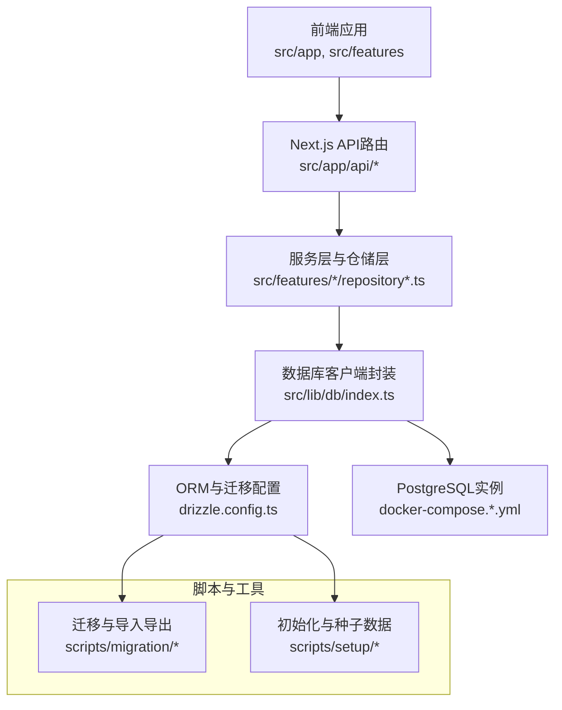
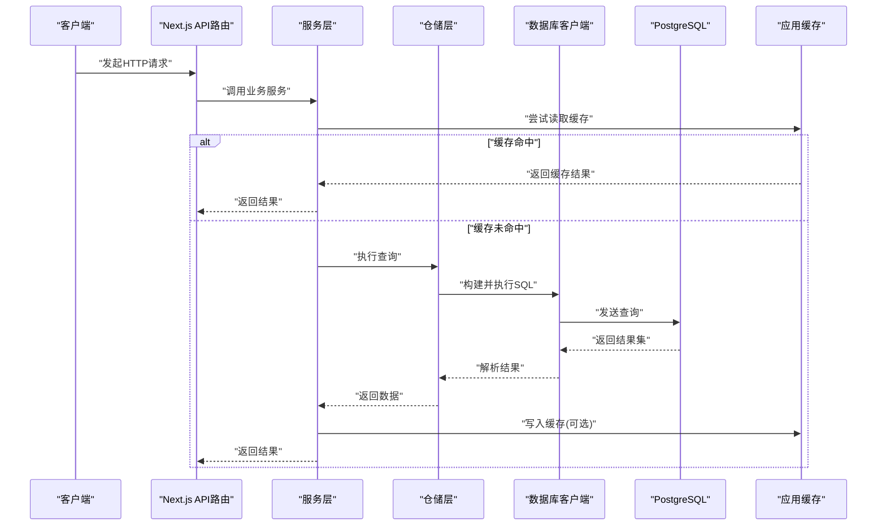
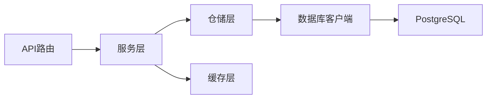

# 性能优化

<cite>
**本文引用的文件**   
- [drizzle.config.ts](file://drizzle.config.ts)
- [docker-compose.dev.yml](file://docker-compose.dev.yml)
- [docker-compose.prod.yml](file://docker-compose.prod.yml)
- [server/src/index.ts](file://server/src/index.ts)
- [src/features/render/cache.ts](file://src/features/render/cache.ts)
- [src/lib/db/index.ts](file://src/lib/db/index.ts)
- [scripts/setup/db-migrate.ts](file://scripts/setup/db-migrate.ts)
- [scripts/migration/reconcile-postgres.ts](file://scripts/migration/reconcile-postgres.ts)
- [scripts/migration/import-postgres.ts](file://scripts/migration/import-postgres.ts)
- [scripts/migration/sqlite-backup.ts](file://scripts/migration/sqlite-backup.ts)
- [scripts/migration/export-sqlite.ts](file://scripts/migration/export-sqlite.ts)
- [src/features/auth/account-service.pg.test.ts](file://src/features/auth/account-service.pg.test.ts)
- [src/features/auth/verification-repository.ts](file://src/features/auth/verification-repository.ts)
- [src/features/canvas/queries.ts](file://src/features/canvas/queries.ts)
- [src/features/director/runtime-repository.pg.test.ts](file://src/features/director/runtime-repository.pg.test.ts)
- [src/features/routing/media-route-repository.pg.test.ts](file://src/features/routing/media-route-repository.pg.test.ts)
- [src/features/render/repository.pg.test.ts](file://src/features/render/repository.pg.test.ts)
</cite>

## 目录
1. [简介](#简介)
2. [项目结构](#项目结构)
3. [核心组件](#核心组件)
4. [架构总览](#架构总览)
5. [详细组件分析](#详细组件分析)
6. [依赖关系分析](#依赖关系分析)
7. [性能考虑](#性能考虑)
8. [故障排查指南](#故障排查指南)
9. [结论](#结论)
10. [附录](#附录)

## 简介
本文件面向数据库性能优化，围绕索引设计与优化、查询优化、连接池配置与调优、缓存策略、分库分表方案以及监控诊断工具使用等方面，结合仓库中的实际代码与配置进行系统性说明。文档既适合有一定技术基础的读者快速定位问题，也适合初学者循序渐进理解优化思路与实践方法。

## 项目结构
本项目采用前后端分离与多模块组织方式：
- 前端应用位于 src/app、src/components、src/features 等目录，业务逻辑按功能域划分。
- 服务端入口与脚本位于 server/src 与 scripts 目录。
- 数据库相关配置与迁移脚本集中在 drizzle.config.ts、scripts/setup 与 scripts/migration。
- Docker Compose 用于本地与生产环境编排。

图表来源
- [drizzle.config.ts](file://drizzle.config.ts)
- [docker-compose.dev.yml](file://docker-compose.dev.yml)
- [docker-compose.prod.yml](file://docker-compose.prod.yml)
- [server/src/index.ts](file://server/src/index.ts)
- [src/lib/db/index.ts](file://src/lib/db/index.ts)

章节来源
- [drizzle.config.ts](file://drizzle.config.ts)
- [docker-compose.dev.yml](file://docker-compose.dev.yml)
- [docker-compose.prod.yml](file://docker-compose.prod.yml)
- [server/src/index.ts](file://server/src/index.ts)

## 核心组件
- 数据库客户端与连接管理：通过统一的数据库客户端封装集中管理连接、事务与查询执行，便于统一接入连接池与健康检查。
- ORM与迁移：基于 Drizzle ORM 的 schema 定义与迁移脚本，确保数据结构一致性与可演进性。
- 仓储与服务层：各业务域（认证、渲染、导演、路由等）通过 repository 模式访问数据，屏蔽底层 SQL 细节。
- 缓存层：在渲染等热点路径引入缓存，降低数据库压力。
- 迁移与数据同步：提供 Postgres/SQLite 之间的导入导出与一致性校验工具。

章节来源
- [src/lib/db/index.ts](file://src/lib/db/index.ts)
- [drizzle.config.ts](file://drizzle.config.ts)
- [src/features/render/cache.ts](file://src/features/render/cache.ts)
- [scripts/migration/reconcile-postgres.ts](file://scripts/migration/reconcile-postgres.ts)

## 架构总览
下图展示了从请求到数据库访问的关键链路，以及缓存与迁移工具的集成点。

图表来源
- [src/lib/db/index.ts](file://src/lib/db/index.ts)
- [src/features/render/cache.ts](file://src/features/render/cache.ts)
- [src/features/auth/account-service.pg.test.ts](file://src/features/auth/account-service.pg.test.ts)
- [src/features/canvas/queries.ts](file://src/features/canvas/queries.ts)

## 详细组件分析

### 索引设计与优化策略
- 单列索引
  - 适用场景：高频等值查询、排序字段、外键关联字段。
  - 设计要点：选择区分度高的列；避免过度索引导致写放大。
  - 实践建议：对 account、verification 等常见过滤条件列建立索引，并通过 EXPLAIN 验证扫描方式。
- 复合索引
  - 适用场景：多列联合过滤、排序或分组。
  - 设计要点：遵循最左前缀原则；将选择性高的列放在前面；减少覆盖索引数量。
  - 实践建议：对 canvas 查询中常见的组合条件（如 project_id + status + created_at）建立复合索引，提升范围查询与排序效率。
- 部分索引
  - 适用场景：仅对满足特定条件的子集加速（如只索引活跃记录）。
  - 设计要点：明确谓词条件；定期评估选择性变化。
  - 实践建议：为“已完成”或“已归档”状态的数据建立部分索引，减少索引体积与更新开销。

章节来源
- [src/features/auth/account-service.pg.test.ts](file://src/features/auth/account-service.pg.test.ts)
- [src/features/auth/verification-repository.ts](file://src/features/auth/verification-repository.ts)
- [src/features/canvas/queries.ts](file://src/features/canvas/queries.ts)

### 查询优化技巧
- EXPLAIN 分析
  - 目标：识别全表扫描、低效连接、临时表与文件排序。
  - 方法：对慢查询执行 EXPLAIN ANALYZE，关注 Seq Scan、Nested Loop、Sort 成本。
  - 优化：根据执行计划调整索引、改写 JOIN 顺序、增加必要投影。
- 慢查询识别
  - 指标：长耗时查询、高锁等待、频繁回滚。
  - 手段：开启慢查询日志、聚合 Top N 慢查询、结合业务峰值时段分析。
- 查询重写
  - 技巧：避免 SELECT *；使用 EXISTS 替代 IN；拆分复杂子查询；利用窗口函数简化统计。
  - 示例：将多次聚合合并为一次扫描，减少中间结果集大小。

章节来源
- [src/features/canvas/queries.ts](file://src/features/canvas/queries.ts)
- [src/features/render/repository.pg.test.ts](file://src/features/render/repository.pg.test.ts)

### 连接池配置与调优参数
- 最大连接数
  - 依据：并发请求量、平均响应时间、数据库资源上限。
  - 建议：设置 pool.maxConnections 略高于峰值并发，避免耗尽数据库连接。
- 超时设置
  - 连接超时：防止长时间无法获取连接导致请求堆积。
  - 查询超时：限制长事务与慢查询占用连接。
- 健康检查
  - 空闲探测：周期性 ping 检测连接可用性。
  - 失效回收：自动剔除不可用连接，保证池内连接质量。
- 调优步骤
  - 基准测试：在不同负载下观察连接池利用率与延迟分布。
  - 动态调整：根据监控指标逐步增大或缩小池大小，避免抖动。

章节来源
- [src/lib/db/index.ts](file://src/lib/db/index.ts)
- [docker-compose.dev.yml](file://docker-compose.dev.yml)
- [docker-compose.prod.yml](file://docker-compose.prod.yml)

### 缓存策略
- 应用层缓存
  - 用途：热点配置、字典数据、用户会话信息。
  - 实现：内存缓存或外部缓存（Redis），注意过期策略与一致性。
- 查询结果缓存
  - 适用：读多写少、结果稳定的报表与列表。
  - 关键：缓存键设计需包含查询条件与版本信息，避免脏读。
- 热点数据缓存
  - 场景：热门项目、常用模板、媒体缩略图。
  - 优化：预加载与懒加载结合，控制缓存容量与淘汰策略。

章节来源
- [src/features/render/cache.ts](file://src/features/render/cache.ts)

### 分库分表的设计与实现方案
- 分库策略
  - 按租户/项目分库：隔离数据与负载，便于扩容与备份。
  - 读写分离：主库写、从库读，提升吞吐。
- 分表策略
  - 按时间分表：日志、事件流等时序数据。
  - 按哈希分表：均匀分布热点键，避免倾斜。
- 实现要点
  - 路由层：根据键计算目标库/表，透明化访问。
  - 迁移与一致性：跨库事务补偿、数据校验与修复工具。
  - 监控与告警：分片健康、热点与倾斜检测。

章节来源
- [scripts/migration/reconcile-postgres.ts](file://scripts/migration/reconcile-postgres.ts)
- [scripts/migration/import-postgres.ts](file://scripts/migration/import-postgres.ts)
- [scripts/migration/sqlite-backup.ts](file://scripts/migration/sqlite-backup.ts)
- [scripts/migration/export-sqlite.ts](file://scripts/migration/export-sqlite.ts)

### 性能监控与诊断工具使用方法
- 数据库层面
  - 启用慢查询日志与统计扩展，收集 Top 慢查询与锁等待。
  - 使用 EXPLAIN/EXPLAIN ANALYZE 分析执行计划。
- 应用层面
  - 埋点记录数据库调用耗时、错误率与连接池状态。
  - 聚合慢查询与热点键，形成优化清单。
- 运维层面
  - 监控 CPU、I/O、连接数、缓冲命中率等关键指标。
  - 定期生成基线与对比报告，评估优化效果。

章节来源
- [scripts/setup/db-migrate.ts](file://scripts/setup/db-migrate.ts)
- [scripts/migration/reconcile-postgres.ts](file://scripts/migration/reconcile-postgres.ts)

## 依赖关系分析
- 模块耦合
  - 仓储层依赖数据库客户端，服务层依赖仓储层，API路由依赖服务层。
  - 缓存层与仓储层解耦，通过服务层注入。
- 外部依赖
  - PostgreSQL 作为主数据存储，Drizzle ORM 负责 schema 与迁移。
  - Docker Compose 编排数据库与服务，便于开发与生产一致性。
- 潜在循环依赖
  - 仓储与服务层应保持单向依赖，避免反向引用。
  - 缓存层不应直接依赖仓储层，应通过服务层协调。

图表来源
- [src/lib/db/index.ts](file://src/lib/db/index.ts)
- [src/features/render/cache.ts](file://src/features/render/cache.ts)
- [src/features/auth/account-service.pg.test.ts](file://src/features/auth/account-service.pg.test.ts)

章节来源
- [src/lib/db/index.ts](file://src/lib/db/index.ts)
- [src/features/render/cache.ts](file://src/features/render/cache.ts)

## 性能考虑
- 索引维护
  - 定期重建与统计信息更新，避免索引碎片与统计偏差。
  - 删除无用索引，减少写放大与存储开销。
- 查询优化
  - 优先使用覆盖索引与投影裁剪，减少数据传输。
  - 避免在 WHERE 中对列进行函数运算，保持索引可用。
- 连接池调优
  - 根据压测结果确定最佳池大小与超时阈值。
  - 在高并发场景下启用连接复用与批量提交。
- 缓存治理
  - 设定合理的 TTL 与失效策略，避免雪崩与穿透。
  - 对热点键进行限流与降级保护。

[本节为通用指导，不直接分析具体文件]

## 故障排查指南
- 常见问题
  - 连接池耗尽：检查最大连接数与超时设置，确认是否存在长事务或未释放连接。
  - 慢查询增多：通过 EXPLAIN 分析执行计划，补充缺失索引或改写查询。
  - 缓存不一致：核对缓存键与失效时机，必要时清理热点缓存。
- 诊断步骤
  - 查看数据库日志与慢查询报告，定位瓶颈。
  - 检查应用监控指标，确认连接池与缓存命中率。
  - 复现问题并采集快照，对比优化前后差异。

章节来源
- [src/lib/db/index.ts](file://src/lib/db/index.ts)
- [src/features/render/cache.ts](file://src/features/render/cache.ts)

## 结论
通过系统化的索引设计、查询优化、连接池调优与缓存策略，可以显著提升数据库性能与稳定性。结合监控与诊断工具，持续跟踪与迭代优化，确保在高负载场景下的用户体验与系统可靠性。

[本节为总结性内容，不直接分析具体文件]

## 附录
- 参考配置与脚本
  - 数据库迁移与初始化脚本位于 scripts/setup 与 scripts/migration。
  - ORM 配置与 schema 定义位于 drizzle.config.ts。
  - 容器编排与环境变量位于 docker-compose.*.yml。

章节来源
- [scripts/setup/db-migrate.ts](file://scripts/setup/db-migrate.ts)
- [scripts/migration/reconcile-postgres.ts](file://scripts/migration/reconcile-postgres.ts)
- [scripts/migration/import-postgres.ts](file://scripts/migration/import-postgres.ts)
- [scripts/migration/sqlite-backup.ts](file://scripts/migration/sqlite-backup.ts)
- [scripts/migration/export-sqlite.ts](file://scripts/migration/export-sqlite.ts)
- [drizzle.config.ts](file://drizzle.config.ts)
- [docker-compose.dev.yml](file://docker-compose.dev.yml)
- [docker-compose.prod.yml](file://docker-compose.prod.yml)