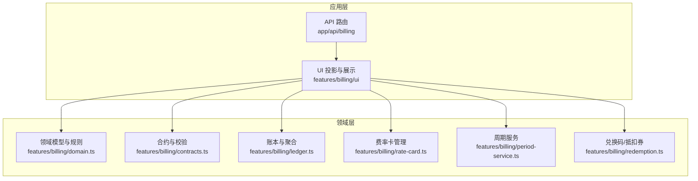
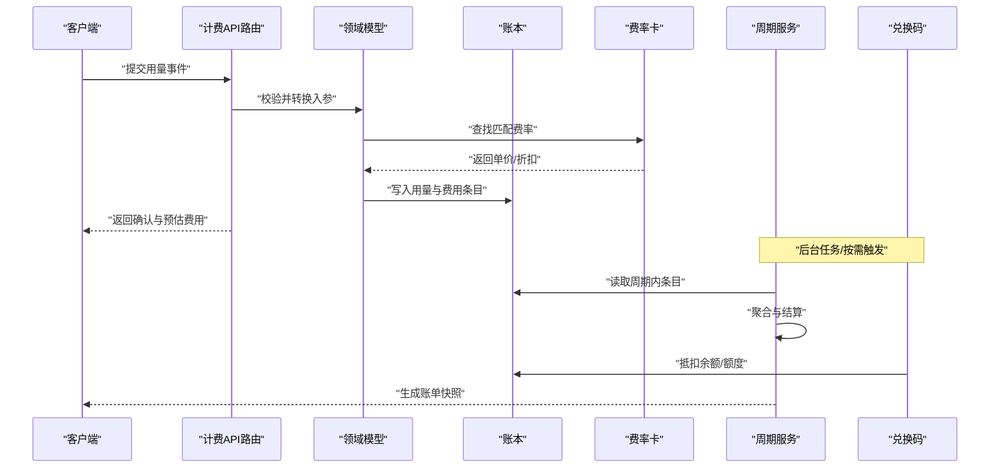
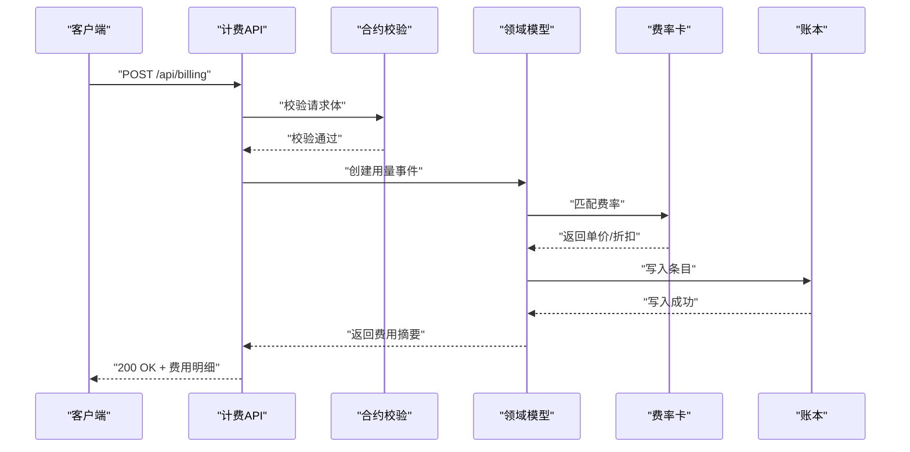
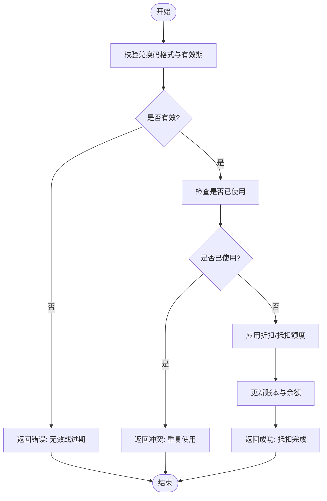
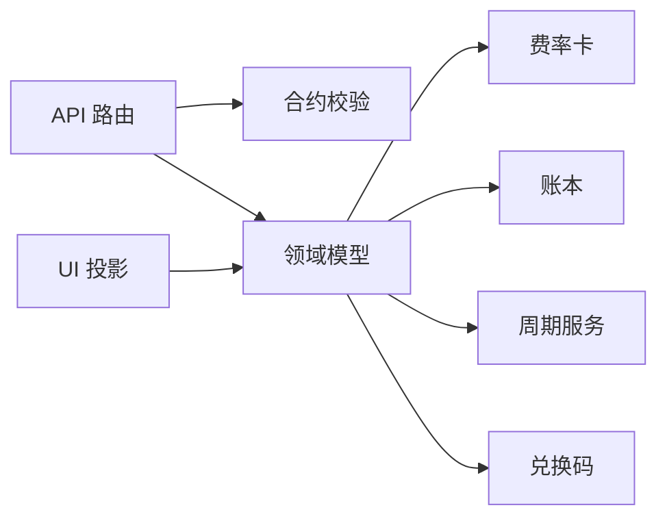

# 数据库计费模式设计

<cite>
**本文引用的文件**   
- [billing.md](file://docs/configuration/billing.md)
- [contracts.ts](file://src/features/billing/contracts.ts)
- [domain.ts](file://src/features/billing/domain.ts)
- [ledger.ts](file://src/features/billing/ledger.ts)
- [rate-card.ts](file://src/features/billing/rate-card.ts)
- [redemption.ts](file://src/features/billing/redemption.ts)
- [period-service.ts](file://src/features/billing/period-service.ts)
- [schema.test.ts](file://src/features/billing/schema.test.ts)
- [billing-display.ts](file://src/features/billing/ui/billing-display.ts)
- [use-billing-projection.ts](file://src/features/billing/ui/use-billing-projection.ts)
- [route.ts](file://src/app/api/billing/route.ts)
- [redemptions/route.ts](file://src/app/api/billing/redemptions/route.ts)
</cite>

## 目录
1. [引言](#引言)
2. [项目结构](#项目结构)
3. [核心组件](#核心组件)
4. [架构总览](#架构总览)
5. [详细组件分析](#详细组件分析)
6. [依赖关系分析](#依赖关系分析)
7. [性能考量](#性能考量)
8. [故障排查指南](#故障排查指南)
9. [结论](#结论)
10. [附录](#附录)

## 引言
本文件面向“数据库计费模式”的设计与实现，聚焦于用量计量、费率计算、周期结算、抵扣券（兑换码）核销以及对外 API 的契约。目标是为产品、研发与运维提供统一的理解框架，帮助快速定位问题、评估变更影响并指导后续扩展。

## 项目结构
计费模块采用分层组织：领域模型与规则位于 features/billing，UI 展示与数据投影位于 features/billing/ui，API 路由位于 app/api/billing。配置与说明文档位于 docs/configuration/billing.md。

图表来源 
- [route.ts](file://src/app/api/billing/route.ts)
- [use-billing-projection.ts](file://src/features/billing/ui/use-billing-projection.ts)
- [billing-display.ts](file://src/features/billing/ui/billing-display.ts)
- [domain.ts](file://src/features/billing/domain.ts)
- [contracts.ts](file://src/features/billing/contracts.ts)
- [ledger.ts](file://src/features/billing/ledger.ts)
- [rate-card.ts](file://src/features/billing/rate-card.ts)
- [period-service.ts](file://src/features/billing/period-service.ts)
- [redemption.ts](file://src/features/billing/redemption.ts)

章节来源
- [billing.md](file://docs/configuration/billing.md)

## 核心组件
- 领域模型与规则：定义计费实体、事件与不变量，确保业务语义一致。
- 合约与校验：约束输入输出结构，保障前后端契约稳定。
- 账本与聚合：记录用量与费用，支持累计、分摊与对账。
- 费率卡：按资源维度（如模型、时长、并发等）维护价格策略。
- 周期服务：按时间窗口（日/周/月）切分账单，生成结算快照。
- 兑换码/抵扣券：发放、核销与余额扣减，支持幂等与防重放。
- UI 投影：将领域状态映射为前端可渲染的数据结构。
- API 路由：暴露查询与操作接口，承载鉴权、限流与审计。

章节来源
- [domain.ts](file://src/features/billing/domain.ts)
- [contracts.ts](file://src/features/billing/contracts.ts)
- [ledger.ts](file://src/features/billing/ledger.ts)
- [rate-card.ts](file://src/features/billing/rate-card.ts)
- [period-service.ts](file://src/features/billing/period-service.ts)
- [redemption.ts](file://src/features/billing/redemption.ts)
- [billing-display.ts](file://src/features/billing/ui/billing-display.ts)
- [use-billing-projection.ts](file://src/features/billing/ui/use-billing-projection.ts)

## 架构总览
计费系统以“事件驱动 + 不可变账本”为核心思想：每次用量产生事件，经领域规则处理后写入账本；周期服务定时或按需生成结算快照；兑换码作为独立资源参与费用抵扣；API 层负责请求编排与响应序列化。

图表来源 
- [route.ts](file://src/app/api/billing/route.ts)
- [domain.ts](file://src/features/billing/domain.ts)
- [ledger.ts](file://src/features/billing/ledger.ts)
- [rate-card.ts](file://src/features/billing/rate-card.ts)
- [period-service.ts](file://src/features/billing/period-service.ts)
- [redemption.ts](file://src/features/billing/redemption.ts)

## 详细组件分析

### 领域模型与规则（domain.ts）
- 职责：定义计费实体（用量、费用、账户、套餐）、事件类型与不变量（如费用非负、额度不超支）。
- 复杂度：事件处理通常为 O(1) 单条写入；聚合计算按窗口规模线性增长。
- 优化点：批量写入、延迟聚合、缓存热点费率。
- 错误处理：参数校验失败抛出明确错误；越界与冲突通过领域异常表达。

章节来源
- [domain.ts](file://src/features/billing/domain.ts)

### 合约与校验（contracts.ts）
- 职责：定义 API 请求/响应结构与字段约束，保证前后端一致性。
- 复杂度：校验为 O(n) 字段遍历。
- 优化点：结构化校验复用、错误消息聚合。
- 错误处理：非法输入返回 422，附带字段级错误信息。

章节来源
- [contracts.ts](file://src/features/billing/contracts.ts)

### 账本与聚合（ledger.ts）
- 职责：记录用量与费用条目，支持查询、累计、分摊与对账。
- 复杂度：追加条目 O(1)，区间聚合 O(k)。
- 优化点：分区表/索引按时间、租户、资源维度；读写分离。
- 错误处理：并发写入使用乐观锁或事务；重复写入去重。

章节来源
- [ledger.ts](file://src/features/billing/ledger.ts)

### 费率卡管理（rate-card.ts）
- 职责：维护不同资源维度的价格策略，支持阶梯价、折扣与配额。
- 复杂度：匹配策略 O(m) 或借助索引 O(log m)。
- 优化点：热路径缓存、灰度发布与回滚。
- 错误处理：未命中费率返回明确错误；版本冲突提示。

章节来源
- [rate-card.ts](file://src/features/billing/rate-card.ts)

### 周期服务（period-service.ts）
- 职责：按时间窗口切分用量，生成结算快照与报表。
- 复杂度：窗口聚合 O(n)，报表生成 O(p)。
- 优化点：增量聚合、并行化窗口处理。
- 错误处理：部分失败重试与补偿；数据不一致告警。

章节来源
- [period-service.ts](file://src/features/billing/period-service.ts)

### 兑换码/抵扣券（redemption.ts）
- 职责：发放、查询、核销与余额扣减，支持幂等与防重放。
- 复杂度：核销 O(1)，查询 O(log n) 或 O(1) 带索引。
- 优化点：分布式锁/原子更新；过期清理任务。
- 错误处理：重复核销拒绝；余额不足提示。

章节来源
- [redemption.ts](file://src/features/billing/redemption.ts)

### UI 投影与展示（billing-display.ts, use-billing-projection.ts）
- 职责：将领域状态映射为前端友好的数据结构，支撑页面渲染与交互。
- 复杂度：投影转换 O(n)，缓存命中后 O(1)。
- 优化点：分页加载、增量更新、服务端缓存。
- 错误处理：空态与错误态展示；网络异常重试。

章节来源
- [billing-display.ts](file://src/features/billing/ui/billing-display.ts)
- [use-billing-projection.ts](file://src/features/billing/ui/use-billing-projection.ts)

### API 路由（route.ts, redemptions/route.ts）
- 职责：接收请求、鉴权、调用领域服务、返回结果。
- 复杂度：路由处理 O(1)，依赖下游服务。
- 优化点：限流、熔断、超时控制。
- 错误处理：统一错误码与消息；审计日志。

章节来源
- [route.ts](file://src/app/api/billing/route.ts)
- [redemptions/route.ts](file://src/app/api/billing/redemptions/route.ts)

#### 序列图：用量上报与计费

图表来源 
- [route.ts](file://src/app/api/billing/route.ts)
- [contracts.ts](file://src/features/billing/contracts.ts)
- [domain.ts](file://src/features/billing/domain.ts)
- [rate-card.ts](file://src/features/billing/rate-card.ts)
- [ledger.ts](file://src/features/billing/ledger.ts)

#### 流程图：兑换码核销

图表来源 
- [redemption.ts](file://src/features/billing/redemption.ts)

## 依赖关系分析
- 低耦合：API 仅依赖合约与领域服务；领域服务依赖费率卡与账本；UI 投影仅依赖领域数据。
- 无环依赖：UI → 领域 → 账本/费率卡/周期服务/兑换码，单向依赖清晰。
- 外部集成：数据库访问由账本与周期服务封装，便于替换存储后端。

图表来源 
- [route.ts](file://src/app/api/billing/route.ts)
- [contracts.ts](file://src/features/billing/contracts.ts)
- [domain.ts](file://src/features/billing/domain.ts)
- [rate-card.ts](file://src/features/billing/rate-card.ts)
- [ledger.ts](file://src/features/billing/ledger.ts)
- [period-service.ts](file://src/features/billing/period-service.ts)
- [redemption.ts](file://src/features/billing/redemption.ts)
- [billing-display.ts](file://src/features/billing/ui/billing-display.ts)
- [use-billing-projection.ts](file://src/features/billing/ui/use-billing-projection.ts)

章节来源
- [schema.test.ts](file://src/features/billing/schema.test.ts)

## 性能考量
- 写入路径：用量事件建议批量合并与异步落库，降低主链路延迟。
- 查询路径：常用视图建立索引（时间、租户、资源），避免全表扫描。
- 聚合计算：窗口聚合采用增量方式，减少重复计算。
- 缓存策略：费率卡与热点投影使用内存缓存，设置合理 TTL。
- 并发控制：账本写入使用事务与乐观锁，避免覆盖更新。

## 故障排查指南
- 常见错误
  - 合约校验失败：检查请求字段类型与必填项。
  - 费率未命中：确认资源维度与版本匹配。
  - 重复核销：检查兑换码状态与幂等键。
  - 周期结算异常：核对时间窗口与数据完整性。
- 诊断步骤
  - 查看 API 错误码与消息。
  - 检查账本条目是否完整与有序。
  - 验证费率卡生效范围与优先级。
  - 核对周期服务的快照生成日志。
- 恢复策略
  - 重试机制：对瞬时错误进行指数退避重试。
  - 补偿任务：对失败结算重新执行并比对差异。
  - 数据修复：基于对账脚本修正不一致条目。

章节来源
- [schema.test.ts](file://src/features/billing/schema.test.ts)

## 结论
本计费模式以清晰的领域边界、稳定的合约与可扩展的费率体系为基础，结合不可变账本与周期结算，形成高内聚、低耦合的可维护架构。建议在后续迭代中持续完善监控、审计与自动化测试，提升系统的可靠性与可观测性。

## 附录
- 配置参考：详见 billing.md，包含环境变量、开关与默认值说明。
- 测试用例：关注 schema.test.ts 中的结构校验与边界条件。

章节来源
- [billing.md](file://docs/configuration/billing.md)
- [schema.test.ts](file://src/features/billing/schema.test.ts)