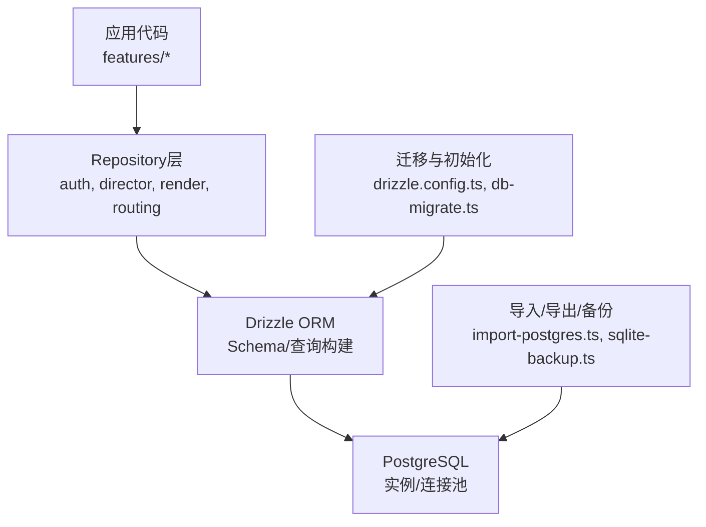
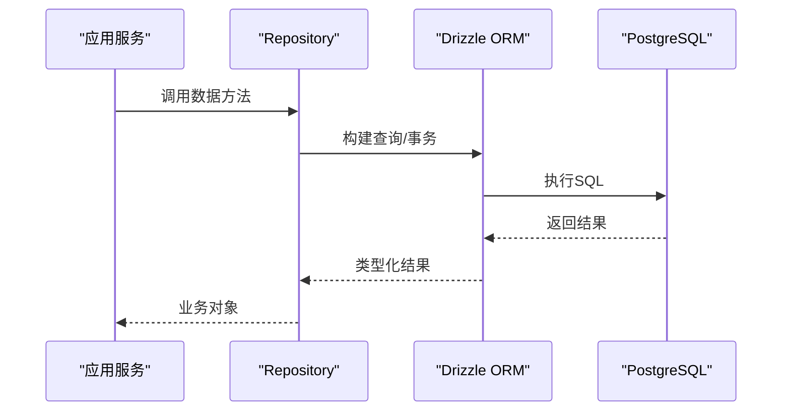
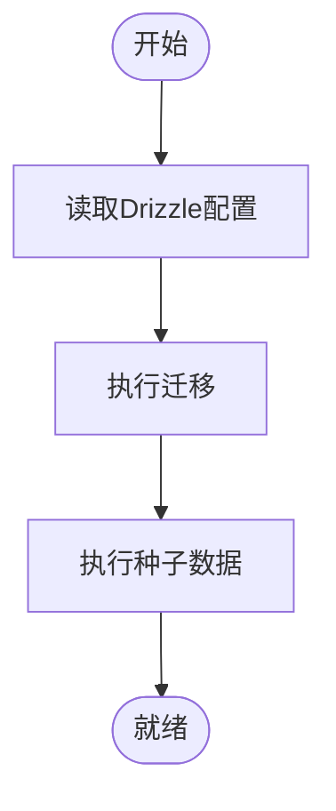
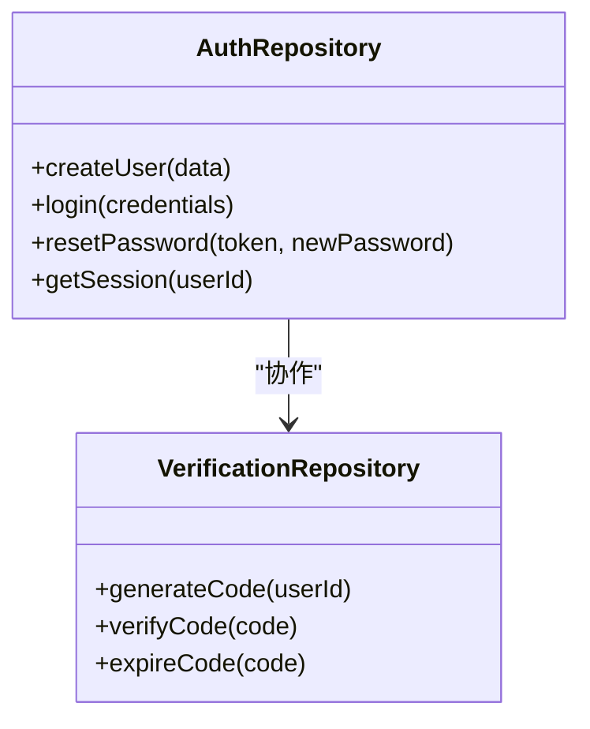
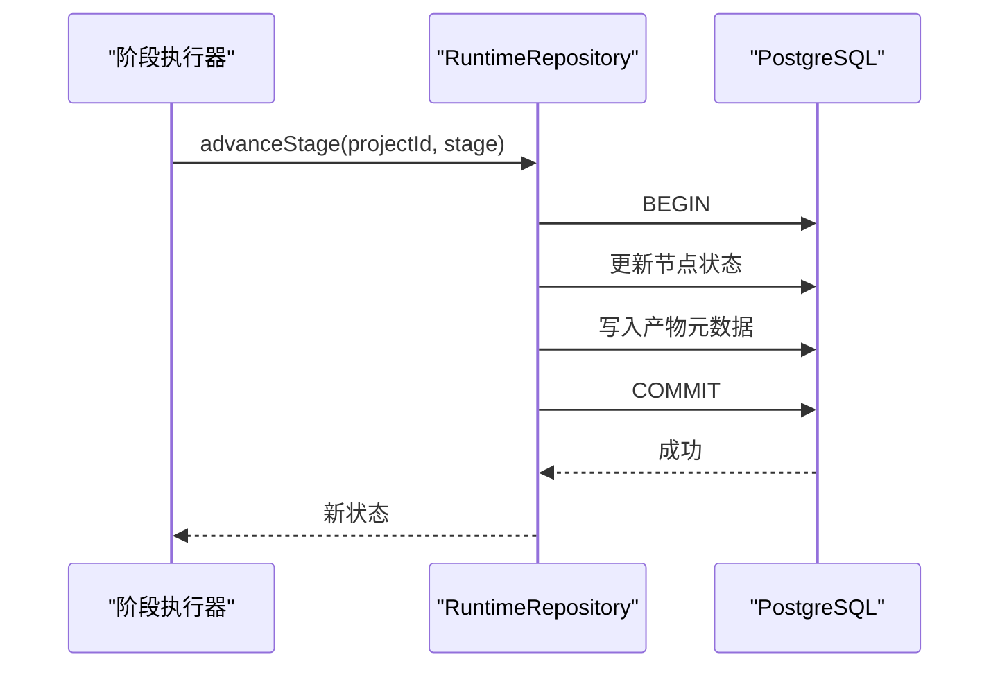
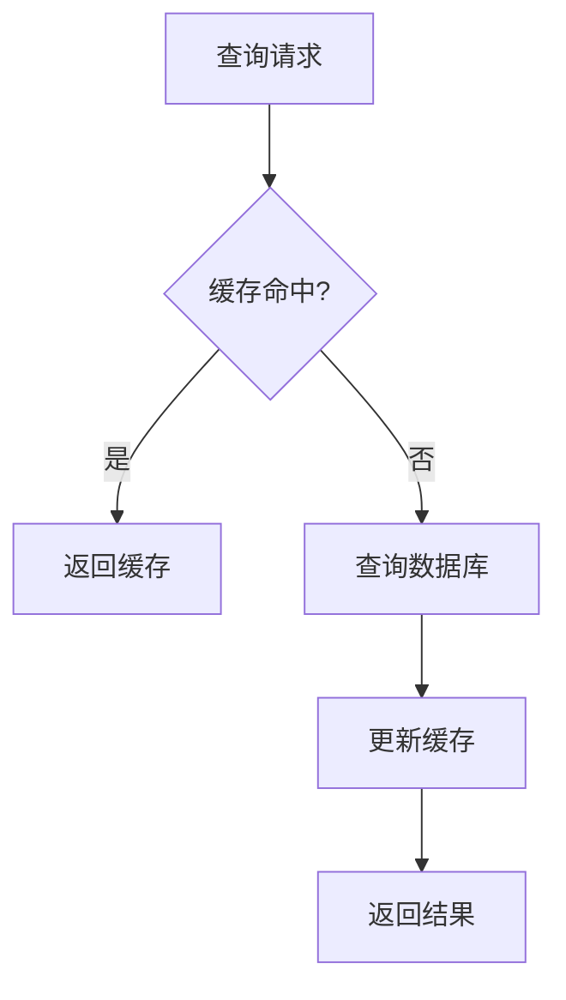
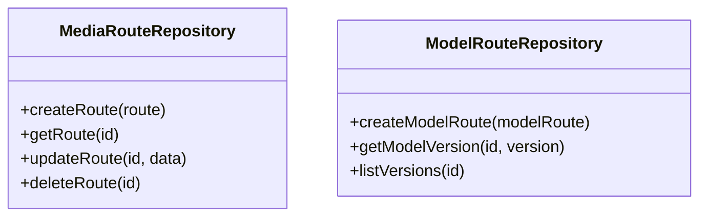
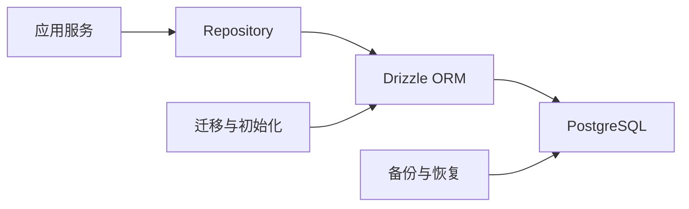
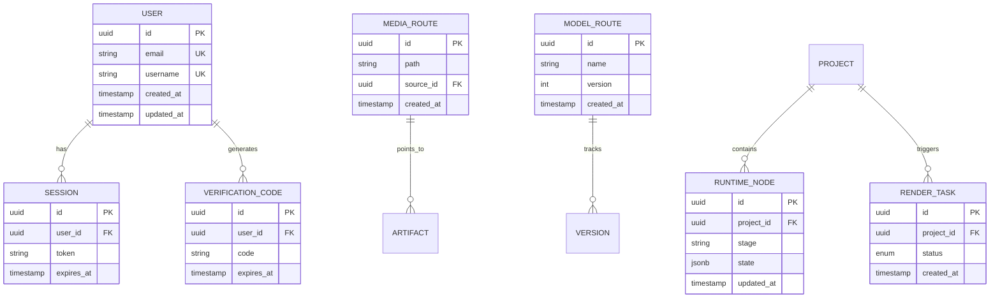

# 数据库设计

<cite>
**本文引用的文件**   
- [drizzle.config.ts](file://drizzle.config.ts)
- [scripts/migration/export-sqlite.ts](file://scripts/migration/export-sqlite.ts)
- [scripts/migration/import-postgres.ts](file://scripts/migration/import-postgres.ts)
- [scripts/migration/provision-master-key.ts](file://scripts/migration/provision-master-key.ts)
- [scripts/migration/reconcile-postgres.ts](file://scripts/migration/reconcile-postgres.ts)
- [scripts/migration/sqlite-backup.ts](file://scripts/migration/sqlite-backup.ts)
- [scripts/setup/db-migrate.ts](file://scripts/setup/db-migrate.ts)
- [scripts/setup/postgres-init.sql](file://scripts/setup/postgres-init.sql)
- [scripts/setup/seed-owner-account.ts](file://scripts/setup/seed-owner-account.ts)
- [src/features/auth/account-service.pg.test.ts](file://src/features/auth/account-service.pg.test.ts)
- [src/features/auth/auth-repository.ts](file://src/features/auth/auth-repository.ts)
- [src/features/auth/verification-repository.ts](file://src/features/auth/verification-repository.ts)
- [src/features/canvas/queries.ts](file://src/features/canvas/queries.ts)
- [src/features/director/runtime-repository.pg.test.ts](file://src/features/director/runtime-repository.pg.test.ts)
- [src/features/director/runtime-repository.ts](file://src/features/director/runtime-repository.ts)
- [src/features/render/cache.pg.test.ts](file://src/features/render/cache.pg.test.ts)
- [src/features/render/repository.pg.test.ts](file://src/features/render/repository.pg.test.ts)
- [src/features/routing/media-route-repository.pg.test.ts](file://src/features/routing/media-route-repository.pg.test.ts)
- [src/features/routing/model-route-repository.pg.test.ts](file://src/features/routing/model-route-repository.pg.test.ts)
</cite>

## 目录
1. [简介](#简介)
2. [项目结构](#项目结构)
3. [核心组件](#核心组件)
4. [架构总览](#架构总览)
5. [详细组件分析](#详细组件分析)
6. [依赖关系分析](#依赖关系分析)
7. [性能考虑](#性能考虑)
8. [故障排查指南](#故障排查指南)
9. [结论](#结论)
10. [附录](#附录)

## 简介
本文件面向PurpleInk项目的数据库设计与数据访问层，聚焦PostgreSQL作为持久化存储，结合Drizzle ORM进行Schema定义、迁移与查询构建。文档涵盖实体关系图、表结构与索引策略、Repository模式与连接池管理、事务处理、数据完整性约束、性能优化（查询优化、索引设计、分库分表）、以及备份恢复与灾难恢复方案。内容基于仓库中现有脚本与测试用例所体现的数据库使用方式进行分析与总结，帮助读者快速理解并扩展系统的数据层能力。

## 项目结构
与数据库相关的关键位置包括：
- Drizzle配置与迁移脚本位于根目录与scripts目录下
- PostgreSQL初始化SQL位于scripts/setup/postgres-init.sql
- 数据导入导出与备份脚本位于scripts/migration
- 各业务模块通过Repository访问数据库，并在pg测试中验证行为

图表来源
- [drizzle.config.ts](file://drizzle.config.ts)
- [scripts/setup/db-migrate.ts](file://scripts/setup/db-migrate.ts)
- [scripts/migration/import-postgres.ts](file://scripts/migration/import-postgres.ts)
- [scripts/migration/sqlite-backup.ts](file://scripts/migration/sqlite-backup.ts)

章节来源
- [drizzle.config.ts](file://drizzle.config.ts)
- [scripts/setup/db-migrate.ts](file://scripts/setup/db-migrate.ts)
- [scripts/setup/postgres-init.sql](file://scripts/setup/postgres-init.sql)
- [scripts/migration/import-postgres.ts](file://scripts/migration/import-postgres.ts)
- [scripts/migration/sqlite-backup.ts](file://scripts/migration/sqlite-backup.ts)

## 核心组件
- Drizzle ORM配置与迁移入口
  - drizzle.config.ts：集中配置数据库连接、驱动、迁移与生成规则
  - scripts/setup/db-migrate.ts：执行迁移与种子数据的统一入口
- 数据访问层（Repository）
  - auth-repository.ts、verification-repository.ts：认证与验证码相关数据访问
  - runtime-repository.ts：导演运行时状态持久化
  - render相关repository：渲染任务、缓存、缩略图等
  - routing相关repository：媒体路由与模型路由
- 迁移与数据工具
  - import-postgres.ts：从外部源导入到PostgreSQL
  - export-sqlite.ts：导出SQLite用于离线或轻量场景
  - sqlite-backup.ts：SQLite备份脚本
  - provision-master-key.ts：主密钥准备（安全敏感数据）
  - reconcile-postgres.ts：PostgreSQL一致性校验与修复
- 初始化脚本
  - postgres-init.sql：数据库对象初始化（用户、权限、扩展等）
  - seed-owner-account.ts：初始账户种子数据

章节来源
- [drizzle.config.ts](file://drizzle.config.ts)
- [scripts/setup/db-migrate.ts](file://scripts/setup/db-migrate.ts)
- [scripts/setup/postgres-init.sql](file://scripts/setup/postgres-init.sql)
- [scripts/setup/seed-owner-account.ts](file://scripts/setup/seed-owner-account.ts)
- [scripts/migration/import-postgres.ts](file://scripts/migration/import-postgres.ts)
- [scripts/migration/export-sqlite.ts](file://scripts/migration/export-sqlite.ts)
- [scripts/migration/sqlite-backup.ts](file://scripts/migration/sqlite-backup.ts)
- [scripts/migration/provision-master-key.ts](file://scripts/migration/provision-master-key.ts)
- [scripts/migration/reconcile-postgres.ts](file://scripts/migration/reconcile-postgres.ts)
- [src/features/auth/auth-repository.ts](file://src/features/auth/auth-repository.ts)
- [src/features/auth/verification-repository.ts](file://src/features/auth/verification-repository.ts)
- [src/features/director/runtime-repository.ts](file://src/features/director/runtime-repository.ts)

## 架构总览
整体数据流遵循“应用层 → Repository → Drizzle ORM → PostgreSQL”的分层结构。迁移与初始化在部署阶段执行，确保Schema与数据一致；运行期通过连接池复用连接，提升并发性能；关键路径采用事务保证一致性。

图表来源
- [src/features/auth/auth-repository.ts](file://src/features/auth/auth-repository.ts)
- [src/features/director/runtime-repository.ts](file://src/features/director/runtime-repository.ts)
- [drizzle.config.ts](file://drizzle.config.ts)

## 详细组件分析

### Drizzle ORM与迁移管理
- 配置与驱动
  - drizzle.config.ts定义了数据库连接参数、驱动选择与迁移输出目录
- 迁移执行
  - scripts/setup/db-migrate.ts负责执行迁移与种子数据，确保环境一致性
- Schema与查询
  - 各Repository通过Drizzle API定义表结构与查询条件，避免手写SQL带来的不一致风险

图表来源
- [drizzle.config.ts](file://drizzle.config.ts)
- [scripts/setup/db-migrate.ts](file://scripts/setup/db-migrate.ts)

章节来源
- [drizzle.config.ts](file://drizzle.config.ts)
- [scripts/setup/db-migrate.ts](file://scripts/setup/db-migrate.ts)

### 认证与账号数据访问
- 认证Repository
  - auth-repository.ts封装用户、会话、密码重置等数据操作
  - verification-repository.ts管理验证码生命周期与校验
- 事务与一致性
  - 登录、注册、密码重置等流程通常涉及多表更新，需使用事务保障一致性
- 索引与约束
  - 用户名、邮箱等字段应建立唯一索引，防止重复注册
  - 外键约束确保会话与用户关联的一致性

图表来源
- [src/features/auth/auth-repository.ts](file://src/features/auth/auth-repository.ts)
- [src/features/auth/verification-repository.ts](file://src/features/auth/verification-repository.ts)

章节来源
- [src/features/auth/auth-repository.ts](file://src/features/auth/auth-repository.ts)
- [src/features/auth/verification-repository.ts](file://src/features/auth/verification-repository.ts)
- [src/features/auth/account-service.pg.test.ts](file://src/features/auth/account-service.pg.test.ts)

### 导演运行时数据访问
- 运行时Repository
  - runtime-repository.ts维护管道节点状态、产物元数据、阶段推进记录
- 状态机与事务
  - 阶段推进需要原子性更新，避免中间态导致的不一致
- 查询优化
  - 针对高频查询（如按项目、阶段筛选）建立复合索引

图表来源
- [src/features/director/runtime-repository.ts](file://src/features/director/runtime-repository.ts)
- [src/features/director/runtime-repository.pg.test.ts](file://src/features/director/runtime-repository.pg.test.ts)

章节来源
- [src/features/director/runtime-repository.ts](file://src/features/director/runtime-repository.ts)
- [src/features/director/runtime-repository.pg.test.ts](file://src/features/director/runtime-repository.pg.test.ts)

### 渲染与缓存数据访问
- 渲染Repository
  - 管理渲染任务、帧序列、缩略图、媒体组装等
- 缓存Repository
  - cache.pg.test.ts体现缓存命中与失效策略
- 索引策略
  - 针对任务状态、项目ID、时间戳建立索引以加速查询

图表来源
- [src/features/render/cache.pg.test.ts](file://src/features/render/cache.pg.test.ts)
- [src/features/render/repository.pg.test.ts](file://src/features/render/repository.pg.test.ts)

章节来源
- [src/features/render/cache.pg.test.ts](file://src/features/render/cache.pg.test.ts)
- [src/features/render/repository.pg.test.ts](file://src/features/render/repository.pg.test.ts)

### 路由与媒体数据访问
- 媒体路由Repository
  - media-route-repository.pg.test.ts体现媒体路由表的CRUD与查询
- 模型路由Repository
  - model-route-repository.pg.test.ts体现模型路由与版本管理
- 约束与索引
  - 路由唯一性、外键关联、时间戳索引

图表来源
- [src/features/routing/media-route-repository.pg.test.ts](file://src/features/routing/media-route-repository.pg.test.ts)
- [src/features/routing/model-route-repository.pg.test.ts](file://src/features/routing/model-route-repository.pg.test.ts)

章节来源
- [src/features/routing/media-route-repository.pg.test.ts](file://src/features/routing/media-route-repository.pg.test.ts)
- [src/features/routing/model-route-repository.pg.test.ts](file://src/features/routing/model-route-repository.pg.test.ts)

### 画布查询与视图
- 画布查询
  - canvas/queries.ts提供复杂查询与聚合逻辑，支撑前端展示与分析
- 性能考量
  - 大对象查询分页、延迟加载、只读副本

章节来源
- [src/features/canvas/queries.ts](file://src/features/canvas/queries.ts)

## 依赖关系分析
数据层依赖关系清晰：应用服务依赖Repository，Repository依赖Drizzle ORM，ORM依赖PostgreSQL。迁移与初始化脚本独立于运行期，确保环境一致性。

图表来源
- [drizzle.config.ts](file://drizzle.config.ts)
- [scripts/setup/db-migrate.ts](file://scripts/setup/db-migrate.ts)
- [scripts/migration/import-postgres.ts](file://scripts/migration/import-postgres.ts)
- [scripts/migration/sqlite-backup.ts](file://scripts/migration/sqlite-backup.ts)

章节来源
- [drizzle.config.ts](file://drizzle.config.ts)
- [scripts/setup/db-migrate.ts](file://scripts/setup/db-migrate.ts)
- [scripts/migration/import-postgres.ts](file://scripts/migration/import-postgres.ts)
- [scripts/migration/sqlite-backup.ts](file://scripts/migration/sqlite-backup.ts)

## 性能考虑
- 查询优化
  - 使用EXPLAIN ANALYZE分析慢查询，避免SELECT *，仅选择必要字段
  - 合理使用JOIN与子查询，必要时物化视图
- 索引设计
  - 为高频过滤字段（如project_id、status、created_at）建立B-tree索引
  - 复合索引覆盖常见查询组合，避免回表
- 连接池管理
  - 合理设置max connections与idle timeout，避免连接泄漏
- 分库分表
  - 按项目或时间维度拆分大表，读写分离与归档策略
- 缓存策略
  - 热点数据Redis缓存，失效策略与一致性保证

[本节为通用指导，不直接分析具体文件]

## 故障排查指南
- 迁移失败
  - 检查drizzle.config.ts配置与数据库连通性
  - 查看db-migrate.ts日志定位错误
- 数据不一致
  - 使用reconcile-postgres.ts进行一致性校验与修复
- 备份恢复
  - 使用sqlite-backup.ts进行本地备份，import-postgres.ts进行恢复
- 主密钥问题
  - 使用provision-master-key.ts重新生成或导入密钥

章节来源
- [drizzle.config.ts](file://drizzle.config.ts)
- [scripts/setup/db-migrate.ts](file://scripts/setup/db-migrate.ts)
- [scripts/migration/reconcile-postgres.ts](file://scripts/migration/reconcile-postgres.ts)
- [scripts/migration/sqlite-backup.ts](file://scripts/migration/sqlite-backup.ts)
- [scripts/migration/import-postgres.ts](file://scripts/migration/import-postgres.ts)
- [scripts/migration/provision-master-key.ts](file://scripts/migration/provision-master-key.ts)

## 结论
PurpleInk的数据库设计以PostgreSQL为核心，结合Drizzle ORM实现类型安全的Schema与查询。Repository模式隔离了数据访问细节，便于测试与维护。通过合理的索引、事务与连接池管理，系统在性能与一致性之间取得平衡。备份与恢复脚本提供了可靠的运维能力。未来可进一步引入缓存、读写分离与分库分表以提升扩展性。

[本节为总结，不直接分析具体文件]

## 附录
- 实体关系图（概念）

[此图为概念性ER图，未映射到具体源码文件]