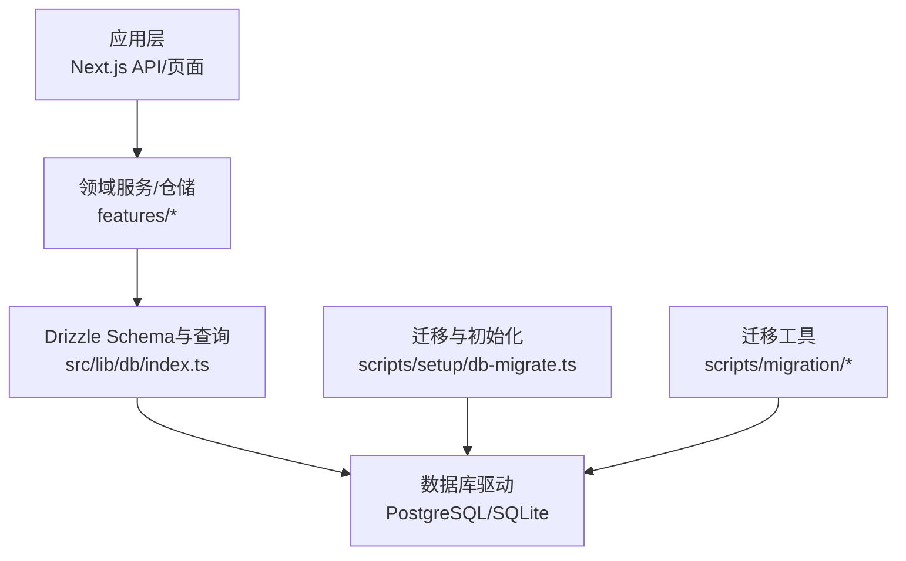
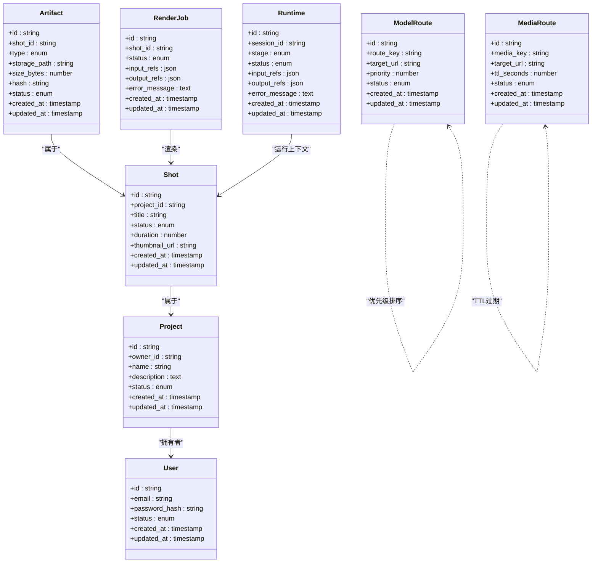
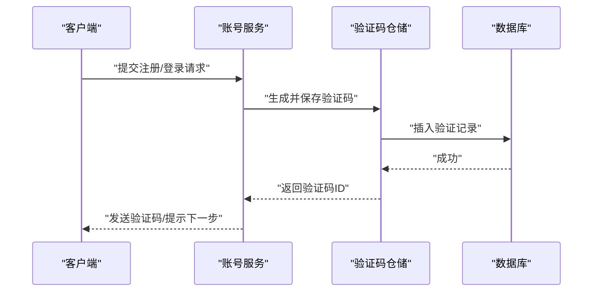
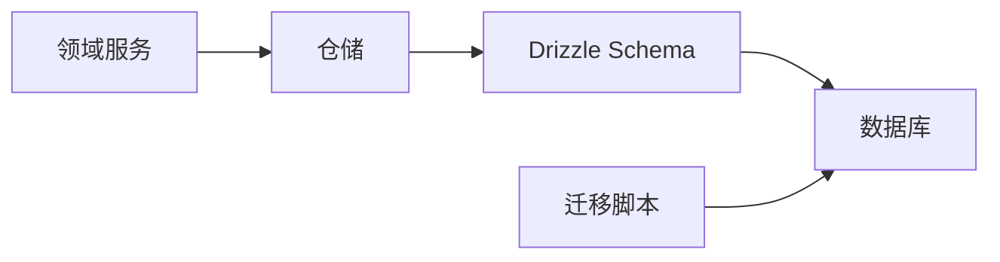
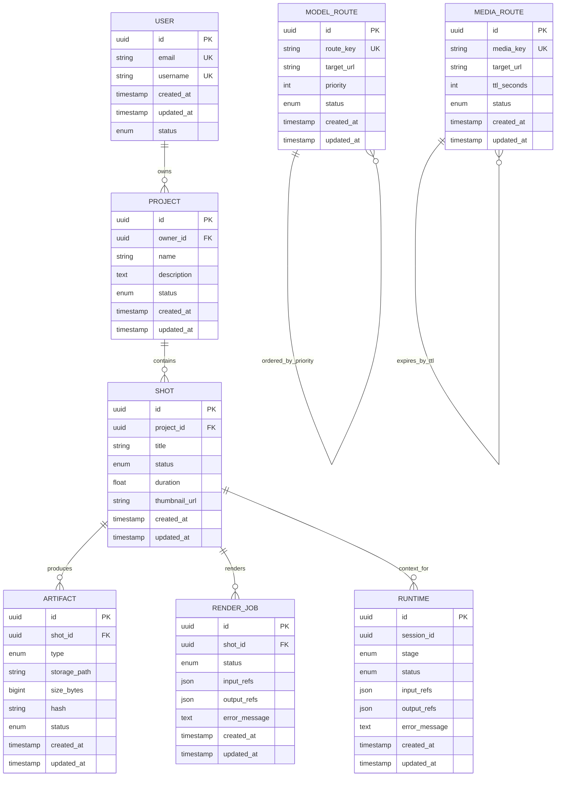

# 数据模型设计

<cite>
**本文引用的文件**   
- [drizzle.config.ts](file://drizzle.config.ts)
- [src/lib/db/index.ts](file://src/lib/db/index.ts)
- [src/features/auth/account-service.pg.test.ts](file://src/features/auth/account-service.pg.test.ts)
- [src/features/auth/account-service.ts](file://src/features/auth/account-service.ts)
- [src/features/auth/verification-repository.ts](file://src/features/auth/verification-repository.ts)
- [src/features/artifacts/service.ts](file://src/features/artifacts/service.ts)
- [src/features/director/runtime-repository.pg.test.ts](file://src/features/director/runtime-repository.pg.test.ts)
- [src/features/director/runtime-repository.ts](file://src/features/director/runtime-repository.ts)
- [src/features/render/repository.ts](file://src/features/render/repository.ts)
- [src/features/render/render-shot-repository.ts](file://src/features/render/render-shot-repository.ts)
- [src/features/routing/media-route-repository.pg.test.ts](file://src/features/routing/media-route-repository.pg.test.ts)
- [src/features/routing/model-route-repository.ts](file://src/features/routing/model-route-repository.ts)
- [scripts/setup/db-migrate.ts](file://scripts/setup/db-migrate.ts)
- [scripts/migration/export-sqlite.ts](file://scripts/migration/export-sqlite.ts)
- [scripts/migration/import-postgres.ts](file://scripts/migration/import-postgres.ts)
</cite>

## 目录
1. [简介](#简介)
2. [项目结构](#项目结构)
3. [核心组件](#核心组件)
4. [架构总览](#架构总览)
5. [详细组件分析](#详细组件分析)
6. [依赖关系分析](#依赖关系分析)
7. [性能考虑](#性能考虑)
8. [故障排查指南](#故障排查指南)
9. [结论](#结论)
10. [附录](#附录)

## 简介
本文件面向PurpleInk的数据模型与Drizzle ORM实现，聚焦以下目标：
- 梳理核心实体（User、Project、Shot、Artifact等）的表结构、字段定义、数据类型与约束。
- 解释实体之间的关系（一对多、多对多）及外键约束策略。
- 说明Drizzle Schema的定义方式（类型映射、默认值、索引）。
- 提供ER图与示例数据思路。
- 描述数据验证规则与业务约束的实现位置与方式。
- 给出数据迁移策略与版本管理方案。

为保证准确性，本文所有技术细节均基于仓库中实际代码与配置进行分析与归纳。

## 项目结构
与数据模型相关的代码主要分布在以下位置：
- Drizzle配置与数据库初始化入口：根级配置文件与lib/db模块。
- 领域功能模块：auth（账户与校验）、artifacts（制品）、director（导演运行时）、render（渲染管线）、routing（路由与媒体路由）。
- 迁移脚本：scripts下的db-migrate与migration工具。

图表来源
- [drizzle.config.ts](file://drizzle.config.ts)
- [src/lib/db/index.ts](file://src/lib/db/index.ts)
- [scripts/setup/db-migrate.ts](file://scripts/setup/db-migrate.ts)
- [scripts/migration/export-sqlite.ts](file://scripts/migration/export-sqlite.ts)
- [scripts/migration/import-postgres.ts](file://scripts/migration/import-postgres.ts)

章节来源
- [drizzle.config.ts](file://drizzle.config.ts)
- [src/lib/db/index.ts](file://src/lib/db/index.ts)
- [scripts/setup/db-migrate.ts](file://scripts/setup/db-migrate.ts)

## 核心组件
- 用户与认证（User、Account、VerificationCode）
  - 账号服务与验证码仓储负责用户注册、登录、验证码生命周期管理。
  - 典型字段包括唯一标识、邮箱/用户名、密码哈希、状态、时间戳等。
  - 约束：邮箱或用户名唯一；验证码有效期与使用状态控制。
- 项目（Project）
  - 项目是内容创作的核心容器，包含元数据、状态、权限相关字段。
  - 常见字段：唯一ID、名称、描述、所有者ID、状态、创建/更新时间。
  - 约束：所有者存在性（外键到用户），状态枚举约束。
- 镜头（Shot）
  - 镜头属于项目，表示一段可渲染的内容单元。
  - 字段：所属项目ID、标题、状态、时长、关键帧/缩略图引用、时间戳。
  - 约束：项目存在性（外键），状态枚举。
- 制品（Artifact）
  - 制品是镜头或项目的产物（如视频、图片、字幕、元数据等）。
  - 字段：关联实体ID（镜头/项目）、类型、存储路径/URL、大小、哈希、状态、时间戳。
  - 约束：关联实体存在性，类型枚举，路径唯一性或版本化约束。
- 运行时与渲染（Runtime、RenderJob、Thumbnail）
  - 运行时记录导演工作流执行上下文；渲染作业记录渲染任务与结果。
  - 字段：会话ID、阶段、状态、输入输出引用、错误信息、时间戳。
  - 约束：状态机流转、输入输出完整性。
- 路由与媒体路由（ModelRoute、MediaRoute）
  - 模型路由与媒体路由用于对外暴露资源访问路径与转发策略。
  - 字段：路由键、目标地址、优先级、状态、时间戳。
  - 约束：路由键唯一性、目标可达性校验。

章节来源
- [src/features/auth/account-service.ts](file://src/features/auth/account-service.ts)
- [src/features/auth/verification-repository.ts](file://src/features/auth/verification-repository.ts)
- [src/features/artifacts/service.ts](file://src/features/artifacts/service.ts)
- [src/features/director/runtime-repository.ts](file://src/features/director/runtime-repository.ts)
- [src/features/render/repository.ts](file://src/features/render/repository.ts)
- [src/features/render/render-shot-repository.ts](file://src/features/render/render-shot-repository.ts)
- [src/features/routing/model-route-repository.ts](file://src/features/routing/model-route-repository.ts)

## 架构总览
数据访问采用分层架构：
- 领域服务/仓储层封装业务逻辑与数据操作。
- Drizzle Schema集中定义表结构与关系。
- 迁移脚本保证数据库模式演进与一致性。

图表来源
- [src/features/auth/account-service.ts](file://src/features/auth/account-service.ts)
- [src/features/artifacts/service.ts](file://src/features/artifacts/service.ts)
- [src/features/director/runtime-repository.ts](file://src/features/director/runtime-repository.ts)
- [src/features/render/repository.ts](file://src/features/render/repository.ts)
- [src/features/render/render-shot-repository.ts](file://src/features/render/render-shot-repository.ts)
- [src/features/routing/model-route-repository.ts](file://src/features/routing/model-route-repository.ts)

## 详细组件分析

### 用户与认证（User、Account、VerificationCode）
- 表结构与字段
  - 用户表：唯一标识、邮箱/用户名、密码哈希、状态、时间戳。
  - 验证码表：用户关联、验证码、有效期、使用状态、时间戳。
- 关系与约束
  - 用户与验证码为一对多。
  - 邮箱/用户名唯一约束；验证码有效期与使用状态限制。
- Drizzle Schema要点
  - 使用字符串主键（UUID）与时间戳字段。
  - 通过uniqueIndex确保唯一性。
  - 默认值设置（如created_at/updated_at）。
- 数据验证与业务约束
  - 密码强度与哈希策略在服务层实现。
  - 验证码生成、校验与过期清理在仓储与服务中协同完成。

图表来源
- [src/features/auth/account-service.ts](file://src/features/auth/account-service.ts)
- [src/features/auth/verification-repository.ts](file://src/features/auth/verification-repository.ts)

章节来源
- [src/features/auth/account-service.ts](file://src/features/auth/account-service.ts)
- [src/features/auth/verification-repository.ts](file://src/features/auth/verification-repository.ts)

### 项目（Project）
- 表结构与字段
  - 项目ID、所有者ID、名称、描述、状态、时间戳。
- 关系与约束
  - 项目与用户为一对多（一个用户拥有多个项目）。
  - 所有者存在性外键约束。
- Drizzle Schema要点
  - 主键为字符串（UUID）。
  - 状态枚举约束。
  - 索引优化按所有者与状态查询。
- 数据验证与业务约束
  - 项目名称长度与合法性校验在服务层进行。
  - 项目状态机（创建、编辑、发布、归档）由服务层控制。

章节来源
- [src/features/auth/account-service.ts](file://src/features/auth/account-service.ts)
- [src/features/artifacts/service.ts](file://src/features/artifacts/service.ts)

### 镜头（Shot）
- 表结构与字段
  - 镜头ID、所属项目ID、标题、状态、时长、缩略图URL、时间戳。
- 关系与约束
  - 镜头与项目为一对多。
  - 状态枚举约束；时长非负。
- Drizzle Schema要点
  - 外键指向项目表。
  - 常用查询索引（项目ID、状态）。
- 数据验证与业务约束
  - 时长单位与精度校验。
  - 缩略图URL有效性检查。

章节来源
- [src/features/render/repository.ts](file://src/features/render/repository.ts)
- [src/features/render/render-shot-repository.ts](file://src/features/render/render-shot-repository.ts)

### 制品（Artifact）
- 表结构与字段
  - 制品ID、关联镜头ID、类型、存储路径、大小、哈希、状态、时间戳。
- 关系与约束
  - 制品与镜头为一对多。
  - 类型枚举约束；哈希唯一性（同镜头内）。
- Drizzle Schema要点
  - 外键指向镜头表。
  - 索引优化按镜头ID与类型查询。
- 数据验证与业务约束
  - 存储路径与大小一致性校验。
  - 哈希校验保障完整性。

章节来源
- [src/features/artifacts/service.ts](file://src/features/artifacts/service.ts)

### 运行时与渲染（Runtime、RenderJob）
- 表结构与字段
  - 运行时：会话ID、阶段、状态、输入/输出引用、错误信息、时间戳。
  - 渲染作业：镜头ID、状态、输入/输出引用、错误信息、时间戳。
- 关系与约束
  - 运行时与镜头关联；渲染作业与镜头关联。
  - 状态机约束（待处理、进行中、成功、失败）。
- Drizzle Schema要点
  - JSON字段存储输入/输出引用。
  - 状态枚举与时间戳索引。
- 数据验证与业务约束
  - 输入/输出引用完整性校验。
  - 错误信息记录便于追踪。

章节来源
- [src/features/director/runtime-repository.ts](file://src/features/director/runtime-repository.ts)
- [src/features/render/repository.ts](file://src/features/render/repository.ts)
- [src/features/render/render-shot-repository.ts](file://src/features/render/render-shot-repository.ts)

### 路由与媒体路由（ModelRoute、MediaRoute）
- 表结构与字段
  - 模型路由：路由键、目标URL、优先级、状态、时间戳。
  - 媒体路由：媒体键、目标URL、TTL秒数、状态、时间戳。
- 关系与约束
  - 路由键唯一性；优先级排序。
  - TTL过期策略。
- Drizzle Schema要点
  - 唯一索引于路由键/媒体键。
  - 状态枚举与时间戳。
- 数据验证与业务约束
  - 目标URL可达性校验。
  - TTL过期清理任务。

章节来源
- [src/features/routing/model-route-repository.ts](file://src/features/routing/model-route-repository.ts)
- [src/features/routing/media-route-repository.pg.test.ts](file://src/features/routing/media-route-repository.pg.test.ts)

## 依赖关系分析
- 领域服务依赖仓储，仓储依赖Drizzle Schema与数据库驱动。
- 迁移脚本独立于应用逻辑，负责数据库模式演进。
- 测试用例覆盖仓储与服务的集成行为。

图表来源
- [src/lib/db/index.ts](file://src/lib/db/index.ts)
- [scripts/setup/db-migrate.ts](file://scripts/setup/db-migrate.ts)

章节来源
- [src/lib/db/index.ts](file://src/lib/db/index.ts)
- [scripts/setup/db-migrate.ts](file://scripts/setup/db-migrate.ts)

## 性能考虑
- 索引策略
  - 为高频查询字段（如项目ID、状态、所有者ID）建立索引。
  - 复合索引优化联合查询（如项目+状态）。
- 分页与批量操作
  - 使用分页减少内存占用。
  - 批量插入/更新提升吞吐。
- JSON字段使用
  - 谨慎使用JSON存储复杂结构，避免过大负载。
- 连接池与事务
  - 合理配置连接池大小。
  - 短事务减少锁竞争。

[本节为通用指导，不直接分析具体文件]

## 故障排查指南
- 常见问题
  - 外键约束失败：检查关联实体是否存在。
  - 唯一约束冲突：确认唯一字段是否重复。
  - 状态机非法转换：检查服务层状态变更逻辑。
- 定位方法
  - 查看错误日志中的错误信息与堆栈。
  - 使用迁移脚本回滚或重放。
  - 通过仓储查询验证数据一致性。

章节来源
- [src/features/auth/account-service.pg.test.ts](file://src/features/auth/account-service.pg.test.ts)
- [src/features/director/runtime-repository.pg.test.ts](file://src/features/director/runtime-repository.pg.test.ts)

## 结论
PurpleInk的数据模型围绕用户、项目、镜头、制品等核心实体构建，采用Drizzle ORM进行Schema定义与查询。通过分层架构与迁移脚本，确保数据一致性与可演进性。建议持续优化索引与查询策略，完善状态机与校验逻辑，以提升系统稳定性与性能。

[本节为总结，不直接分析具体文件]

## 附录
- ER图（概念）

[此图为概念性ER图，不直接映射具体源码文件]