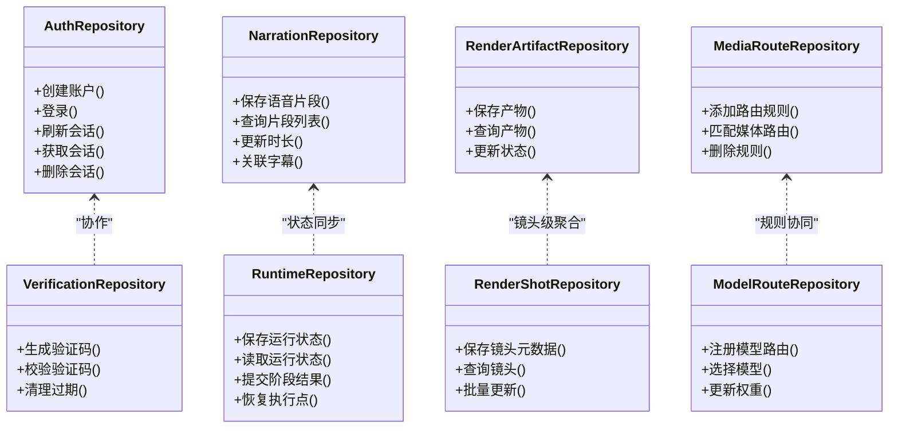
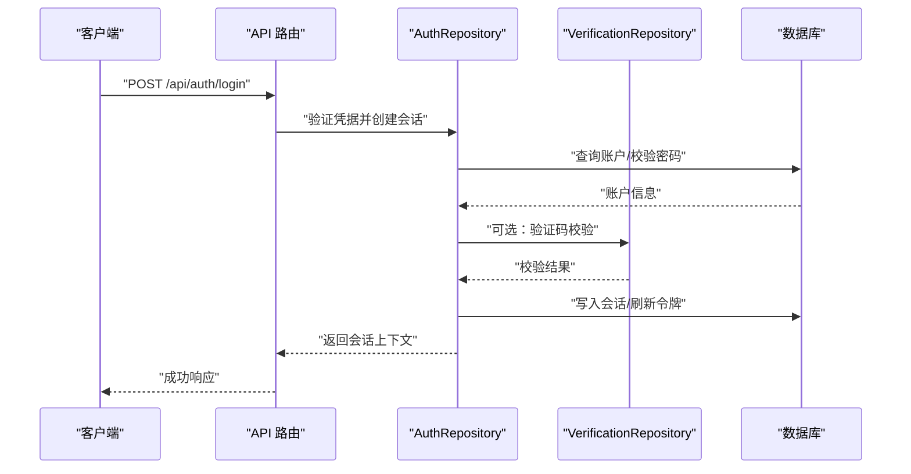
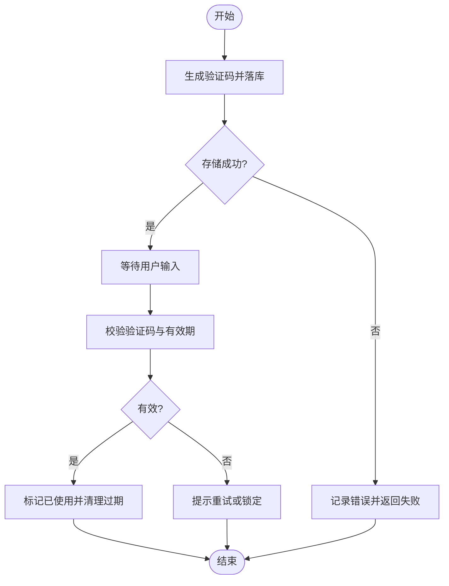
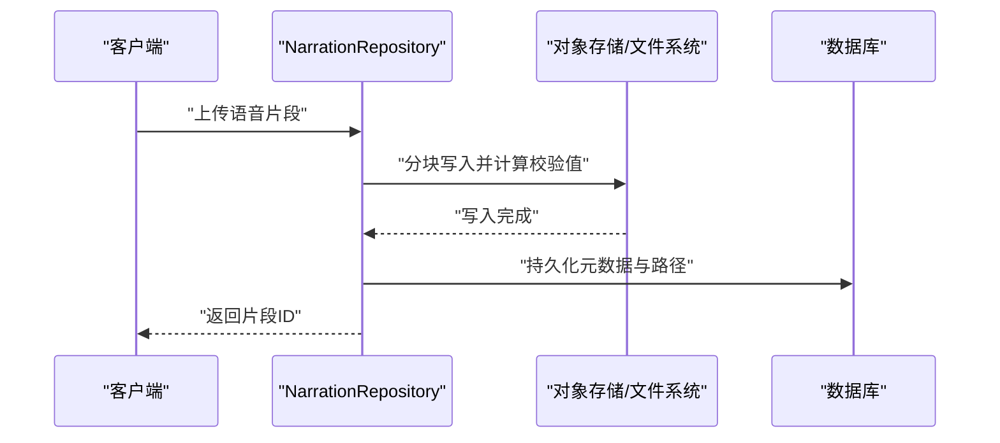
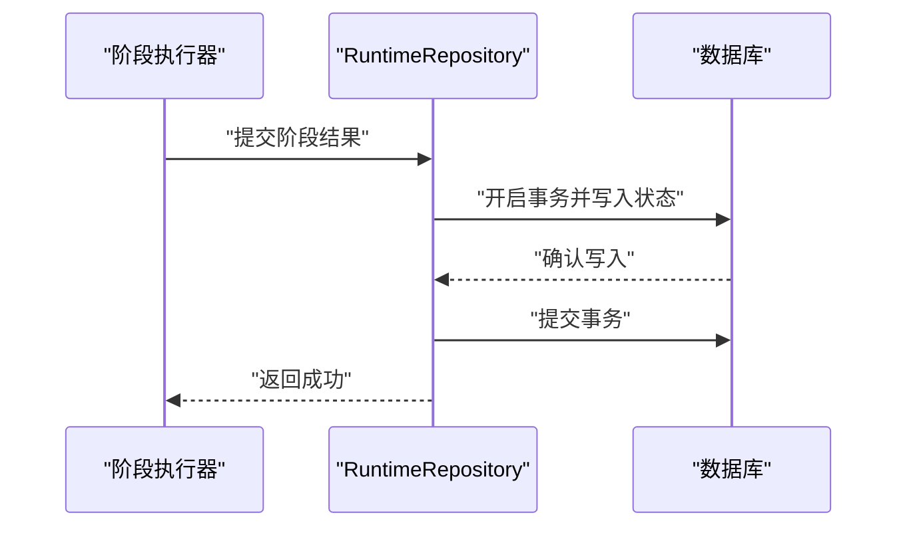
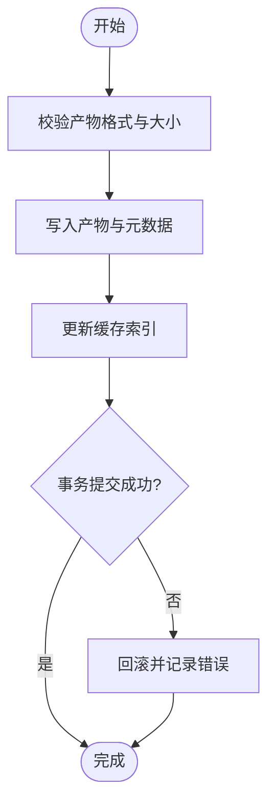
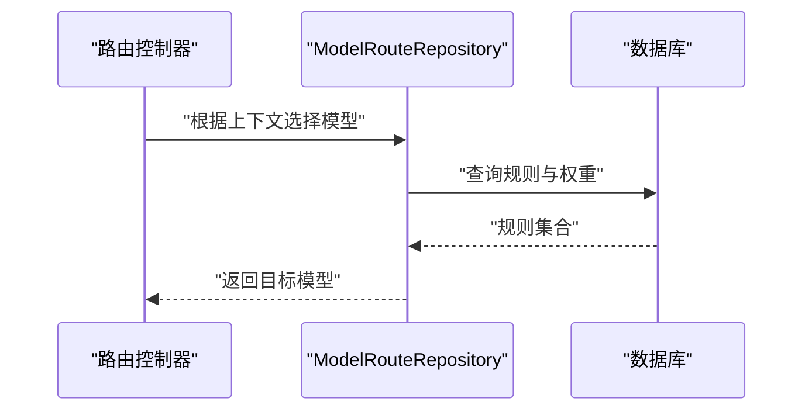
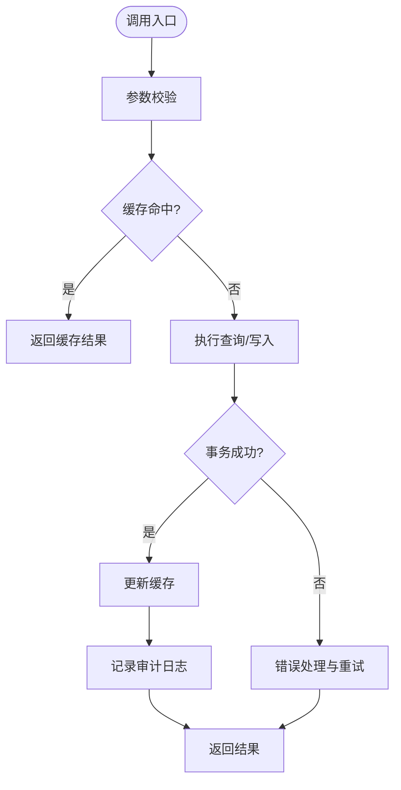
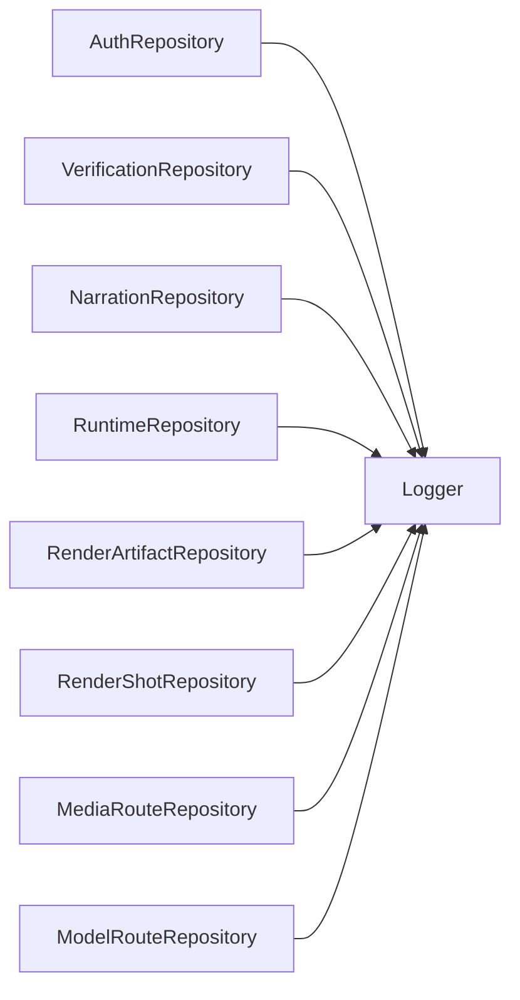

# 数据访问层

<cite>
**本文引用的文件**   
- [auth-repository.ts](file://src/features/auth/auth-repository.ts)
- [verification-repository.ts](file://src/features/auth/verification-repository.ts)
- [narration-repository.ts](file://src/features/audio/narration-repository.ts)
- [repository.ts](file://src/features/audio/repository.ts)
- [runtime-repository.ts](file://src/features/audio/runtime-repository.ts)
- [runtime-repository.ts](file://src/features/director/runtime-repository.ts)
- [render-artifact-repository.ts](file://src/features/render/render-artifact-repository.ts)
- [render-shot-repository.ts](file://src/features/render/render-shot-repository.ts)
- [repository.ts](file://src/features/render/repository.ts)
- [media-route-repository.ts](file://src/features/routing/media-route-repository.ts)
- [model-route-repository.ts](file://src/features/routing/model-route-repository.ts)
- [logger.ts](file://server/src/lib/logger.ts)
- [db-migrate.ts](file://scripts/setup/db-migrate.ts)
- [bootstrap-credentials.ts](file://scripts/setup/bootstrap-credentials.ts)
- [seed-owner-account.ts](file://scripts/setup/seed-owner-account.ts)
- [export-sqlite.ts](file://scripts/migration/export-sqlite.ts)
- [import-postgres.ts](file://scripts/migration/import-postgres.ts)
- [reconcile-postgres.ts](file://scripts/migration/reconcile-postgres.ts)
- [sqlite-backup.ts](file://scripts/migration/sqlite-backup.ts)
</cite>

## 目录
1. [简介](#简介)
2. [项目结构](#项目结构)
3. [核心组件](#核心组件)
4. [架构总览](#架构总览)
5. [详细组件分析](#详细组件分析)
6. [依赖关系分析](#依赖关系分析)
7. [性能考量](#性能考量)
8. [故障排查指南](#故障排查指南)
9. [结论](#结论)
10. [附录](#附录)

## 简介
本文件面向数据访问层的 Repository 模式，系统性阐述设计理念、接口与抽象层设计，并深入解析各领域 Repository 的实现（AuthRepository、RuntimeRepository、AudioRepository 等）。文档同时覆盖错误处理、日志记录、缓存策略、连接池管理与资源释放、单元测试与数据模拟方法，以及扩展新 Repository 的指导原则与模板代码。目标是帮助读者在不深入源码细节的情况下，也能正确理解、使用与扩展数据访问层。

## 项目结构
仓库采用按功能域划分的模块组织方式，数据访问相关代码主要分布在 features 下的子域中：
- 认证域：auth-repository.ts、verification-repository.ts
- 音频域：narration-repository.ts、repository.ts、runtime-repository.ts
- 渲染域：render-artifact-repository.ts、render-shot-repository.ts、repository.ts
- 路由域：media-route-repository.ts、model-route-repository.ts
- 共享基础设施：logger.ts（日志）、setup/migration 脚本（数据库初始化、迁移、备份）

```mermaid
graph TB
subgraph "认证域"
A["auth-repository.ts"]
B["verification-repository.ts"]
end
subgraph "音频域"
C["narration-repository.ts"]
D["repository.ts"]
E["runtime-repository.ts"]
end
subgraph "渲染域"
F["render-artifact-repository.ts"]
G["render-shot-repository.ts"]
H["repository.ts"]
end
subgraph "路由域"
I["media-route-repository.ts"]
J["model-route-repository.ts"]
end
subgraph "基础设施"
K["logger.ts"]
L["db-migrate.ts"]
M["bootstrap-credentials.ts"]
N["seed-owner-account.ts"]
O["export-sqlite.ts"]
P["import-postgres.ts"]
Q["reconcile-postgres.ts"]
R["sqlite-backup.ts"]
end
A --> K
B --> K
C --> K
D --> K
E --> K
F --> K
G --> K
H --> K
I --> K
J --> K
L --> K
M --> K
N --> K
O --> K
P --> K
Q --> K
R --> K
```

图表来源
- [auth-repository.ts](file://src/features/auth/auth-repository.ts)
- [verification-repository.ts](file://src/features/auth/verification-repository.ts)
- [narration-repository.ts](file://src/features/audio/narration-repository.ts)
- [repository.ts](file://src/features/audio/repository.ts)
- [runtime-repository.ts](file://src/features/audio/runtime-repository.ts)
- [render-artifact-repository.ts](file://src/features/render/render-artifact-repository.ts)
- [render-shot-repository.ts](file://src/features/render/render-shot-repository.ts)
- [repository.ts](file://src/features/render/repository.ts)
- [media-route-repository.ts](file://src/features/routing/media-route-repository.ts)
- [model-route-repository.ts](file://src/features/routing/model-route-repository.ts)
- [logger.ts](file://server/src/lib/logger.ts)
- [db-migrate.ts](file://scripts/setup/db-migrate.ts)
- [bootstrap-credentials.ts](file://scripts/setup/bootstrap-credentials.ts)
- [seed-owner-account.ts](file://scripts/setup/seed-owner-account.ts)
- [export-sqlite.ts](file://scripts/migration/export-sqlite.ts)
- [import-postgres.ts](file://scripts/migration/import-postgres.ts)
- [reconcile-postgres.ts](file://scripts/migration/reconcile-postgres.ts)
- [sqlite-backup.ts](file://scripts/migration/sqlite-backup.ts)

章节来源
- [auth-repository.ts](file://src/features/auth/auth-repository.ts)
- [verification-repository.ts](file://src/features/auth/verification-repository.ts)
- [narration-repository.ts](file://src/features/audio/narration-repository.ts)
- [repository.ts](file://src/features/audio/repository.ts)
- [runtime-repository.ts](file://src/features/audio/runtime-repository.ts)
- [render-artifact-repository.ts](file://src/features/render/render-artifact-repository.ts)
- [render-shot-repository.ts](file://src/features/render/render-shot-repository.ts)
- [repository.ts](file://src/features/render/repository.ts)
- [media-route-repository.ts](file://src/features/routing/media-route-repository.ts)
- [model-route-repository.ts](file://src/features/routing/model-route-repository.ts)
- [logger.ts](file://server/src/lib/logger.ts)
- [db-migrate.ts](file://scripts/setup/db-migrate.ts)
- [bootstrap-credentials.ts](file://scripts/setup/bootstrap-credentials.ts)
- [seed-owner-account.ts](file://scripts/setup/seed-owner-account.ts)
- [export-sqlite.ts](file://scripts/migration/export-sqlite.ts)
- [import-postgres.ts](file://scripts/migration/import-postgres.ts)
- [reconcile-postgres.ts](file://scripts/migration/reconcile-postgres.ts)
- [sqlite-backup.ts](file://scripts/migration/sqlite-backup.ts)

## 核心组件
- 认证数据访问（AuthRepository）
  - 职责：封装用户账户、会话、验证码等持久化操作，统一对外暴露查询与写入接口。
  - 关注点：密码安全、会话一致性、验证码生命周期管理、幂等性保障。
- 验证数据访问（VerificationRepository）
  - 职责：验证码的生成、校验、过期清理与重试控制。
  - 关注点：防重放、速率限制、存储一致性。
- 音频数据访问（AudioRepository / NarrationRepository）
  - 职责：语音合成结果、时长测量、字幕、SFX 元数据与媒体路径的存取。
  - 关注点：大对象分片、流式写入、元数据与文件一致性。
- 运行时数据访问（RuntimeRepository）
  - 职责：编排运行状态、阶段产物、节点数据、恢复点等。
  - 关注点：并发写保护、事务边界、快照与回滚。
- 渲染数据访问（RenderArtifactRepository / RenderShotRepository）
  - 职责：渲染产物、缩略图、帧序列、导出任务的状态与元数据。
  - 关注点：I/O 吞吐、缓存命中、失败重试与幂等提交。
- 路由数据访问（MediaRouteRepository / ModelRouteRepository）
  - 职责：媒体路由规则、模型路由配置与映射表维护。
  - 关注点：规则优先级、热更新、一致性校验。

章节来源
- [auth-repository.ts](file://src/features/auth/auth-repository.ts)
- [verification-repository.ts](file://src/features/auth/verification-repository.ts)
- [narration-repository.ts](file://src/features/audio/narration-repository.ts)
- [repository.ts](file://src/features/audio/repository.ts)
- [runtime-repository.ts](file://src/features/audio/runtime-repository.ts)
- [runtime-repository.ts](file://src/features/director/runtime-repository.ts)
- [render-artifact-repository.ts](file://src/features/render/render-artifact-repository.ts)
- [render-shot-repository.ts](file://src/features/render/render-shot-repository.ts)
- [repository.ts](file://src/features/render/repository.ts)
- [media-route-repository.ts](file://src/features/routing/media-route-repository.ts)
- [model-route-repository.ts](file://src/features/routing/model-route-repository.ts)

## 架构总览
Repository 模式在本项目中体现为“领域驱动的数据访问抽象”。每个业务域定义清晰的接口契约，具体实现屏蔽底层存储差异（如 SQLite/PostgreSQL），并通过统一的日志与错误处理机制保证可观测性与稳定性。

图表来源
- [auth-repository.ts](file://src/features/auth/auth-repository.ts)
- [verification-repository.ts](file://src/features/auth/verification-repository.ts)
- [narration-repository.ts](file://src/features/audio/narration-repository.ts)
- [runtime-repository.ts](file://src/features/audio/runtime-repository.ts)
- [runtime-repository.ts](file://src/features/director/runtime-repository.ts)
- [render-artifact-repository.ts](file://src/features/render/render-artifact-repository.ts)
- [render-shot-repository.ts](file://src/features/render/render-shot-repository.ts)
- [media-route-repository.ts](file://src/features/routing/media-route-repository.ts)
- [model-route-repository.ts](file://src/features/routing/model-route-repository.ts)

## 详细组件分析

### 认证数据访问（AuthRepository）
- 设计要点
  - 以账户与会话为核心实体，提供幂等的登录、刷新与登出流程。
  - 与验证码服务协作完成二次校验与安全增强。
  - 通过事务确保账户状态与会话一致。
- 关键流程（登录）

图表来源
- [auth-repository.ts](file://src/features/auth/auth-repository.ts)
- [verification-repository.ts](file://src/features/auth/verification-repository.ts)

章节来源
- [auth-repository.ts](file://src/features/auth/auth-repository.ts)
- [verification-repository.ts](file://src/features/auth/verification-repository.ts)

### 验证数据访问（VerificationRepository）
- 设计要点
  - 验证码生成需具备唯一性与时间窗口；校验需支持多次尝试上限。
  - 定期清理过期记录，避免存储膨胀。
- 关键流程（验证码校验）

图表来源
- [verification-repository.ts](file://src/features/auth/verification-repository.ts)

章节来源
- [verification-repository.ts](file://src/features/auth/verification-repository.ts)

### 音频数据访问（NarrationRepository / AudioRepository）
- 设计要点
  - 语音片段、时长测量、字幕与 SFX 元数据分离存储，便于独立扩展。
  - 对大体积媒体采用分块写入与校验，保证完整性。
- 关键流程（保存语音片段）

图表来源
- [narration-repository.ts](file://src/features/audio/narration-repository.ts)
- [repository.ts](file://src/features/audio/repository.ts)

章节来源
- [narration-repository.ts](file://src/features/audio/narration-repository.ts)
- [repository.ts](file://src/features/audio/repository.ts)

### 运行时数据访问（RuntimeRepository）
- 设计要点
  - 运行状态与阶段结果需要强一致与并发安全，通常借助事务与锁。
  - 支持断点续跑与恢复点快照，提升容错能力。
- 关键流程（提交阶段结果）

图表来源
- [runtime-repository.ts](file://src/features/audio/runtime-repository.ts)
- [runtime-repository.ts](file://src/features/director/runtime-repository.ts)

章节来源
- [runtime-repository.ts](file://src/features/audio/runtime-repository.ts)
- [runtime-repository.ts](file://src/features/director/runtime-repository.ts)

### 渲染数据访问（RenderArtifactRepository / RenderShotRepository）
- 设计要点
  - 产物与镜头元数据分层管理，支持批量更新与状态机流转。
  - 缩略图与帧序列作为辅助数据，优先缓存命中。
- 关键流程（保存产物）

图表来源
- [render-artifact-repository.ts](file://src/features/render/render-artifact-repository.ts)
- [render-shot-repository.ts](file://src/features/render/render-shot-repository.ts)
- [repository.ts](file://src/features/render/repository.ts)

章节来源
- [render-artifact-repository.ts](file://src/features/render/render-artifact-repository.ts)
- [render-shot-repository.ts](file://src/features/render/render-shot-repository.ts)
- [repository.ts](file://src/features/render/repository.ts)

### 路由数据访问（MediaRouteRepository / ModelRouteRepository）
- 设计要点
  - 媒体路由与模型路由解耦，但共享规则优先级与匹配算法。
  - 支持动态更新与热加载，保证高可用。
- 关键流程（模型选择）

图表来源
- [media-route-repository.ts](file://src/features/routing/media-route-repository.ts)
- [model-route-repository.ts](file://src/features/routing/model-route-repository.ts)

章节来源
- [media-route-repository.ts](file://src/features/routing/media-route-repository.ts)
- [model-route-repository.ts](file://src/features/routing/model-route-repository.ts)

### 概念总览
以下流程图展示 Repository 模式的通用工作流，适用于所有数据访问组件：

[本图为概念性说明，不直接映射到具体源文件]

## 依赖关系分析
- 内部依赖
  - 各 Repository 均依赖统一的日志组件进行审计与排障。
  - 认证域与验证域存在协作关系，确保登录流程的安全性与一致性。
  - 音频与运行时域在状态同步上存在耦合，需保证事件顺序与幂等。
- 外部依赖
  - 数据库驱动（SQLite/PostgreSQL）通过迁移与初始化脚本管理。
  - 对象存储用于大体积媒体文件的持久化。
- 潜在循环依赖
  - 通过接口抽象与依赖注入避免循环引用，保持模块内聚。

图表来源
- [logger.ts](file://server/src/lib/logger.ts)
- [auth-repository.ts](file://src/features/auth/auth-repository.ts)
- [verification-repository.ts](file://src/features/auth/verification-repository.ts)
- [narration-repository.ts](file://src/features/audio/narration-repository.ts)
- [runtime-repository.ts](file://src/features/audio/runtime-repository.ts)
- [render-artifact-repository.ts](file://src/features/render/render-artifact-repository.ts)
- [render-shot-repository.ts](file://src/features/render/render-shot-repository.ts)
- [media-route-repository.ts](file://src/features/routing/media-route-repository.ts)
- [model-route-repository.ts](file://src/features/routing/model-route-repository.ts)

章节来源
- [logger.ts](file://server/src/lib/logger.ts)
- [auth-repository.ts](file://src/features/auth/auth-repository.ts)
- [verification-repository.ts](file://src/features/auth/verification-repository.ts)
- [narration-repository.ts](file://src/features/audio/narration-repository.ts)
- [runtime-repository.ts](file://src/features/audio/runtime-repository.ts)
- [render-artifact-repository.ts](file://src/features/render/render-artifact-repository.ts)
- [render-shot-repository.ts](file://src/features/render/render-shot-repository.ts)
- [media-route-repository.ts](file://src/features/routing/media-route-repository.ts)
- [model-route-repository.ts](file://src/features/routing/model-route-repository.ts)

## 性能考量
- 连接池管理
  - 数据库连接应复用与限流，避免频繁创建销毁导致开销。
  - 针对高并发读场景启用只读副本或缓存层。
- 缓存策略
  - 热点数据（如会话、路由规则）采用内存缓存，设置合理 TTL。
  - 大对象（媒体文件）走对象存储，数据库仅存元数据与路径。
- I/O 优化
  - 批量写入与合并提交减少事务次数。
  - 分块上传与断点续传提升大文件稳定性。
- 事务与锁
  - 严格界定事务边界，避免长事务阻塞。
  - 使用行级锁或乐观锁防止竞态条件。

[本节为通用指导，不直接分析具体文件]

## 故障排查指南
- 日志定位
  - 使用统一日志组件记录关键步骤与异常堆栈，便于快速定位问题。
- 常见错误
  - 数据库连接超时：检查连接池配置与网络连通性。
  - 事务冲突：分析锁竞争与重试策略。
  - 缓存不一致：核对失效策略与更新顺序。
- 调试工具
  - 利用迁移与初始化脚本重建环境，复现问题。
  - 通过备份与导入脚本对比数据差异。

章节来源
- [logger.ts](file://server/src/lib/logger.ts)
- [db-migrate.ts](file://scripts/setup/db-migrate.ts)
- [bootstrap-credentials.ts](file://scripts/setup/bootstrap-credentials.ts)
- [seed-owner-account.ts](file://scripts/setup/seed-owner-account.ts)
- [export-sqlite.ts](file://scripts/migration/export-sqlite.ts)
- [import-postgres.ts](file://scripts/migration/import-postgres.ts)
- [reconcile-postgres.ts](file://scripts/migration/reconcile-postgres.ts)
- [sqlite-backup.ts](file://scripts/migration/sqlite-backup.ts)

## 结论
本项目通过清晰的 Repository 抽象将数据访问与业务逻辑解耦，提升了可测试性与可维护性。结合统一的日志、错误处理与缓存策略，系统在稳定性与性能方面具备良好基础。未来可扩展更多领域 Repository，遵循本文档的设计原则与模板，确保一致性与质量。

[本节为总结性内容，不直接分析具体文件]

## 附录
- 扩展新 Repository 的指导原则
  - 明确领域实体与操作契约，定义最小必要接口。
  - 实现幂等性与事务边界，确保数据一致性。
  - 集成统一日志与错误处理，便于监控与排障。
  - 编写单元测试与数据模拟，覆盖正常与异常路径。
- 模板代码建议
  - 接口定义：包含 CRUD 与领域特定操作。
  - 实现类：封装存储细节，暴露稳定 API。
  - 测试用例：Mock 依赖，验证边界条件与错误分支。

[本节为通用指导，不直接分析具体文件]