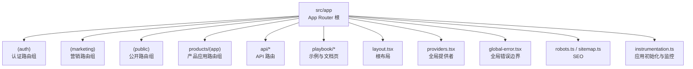
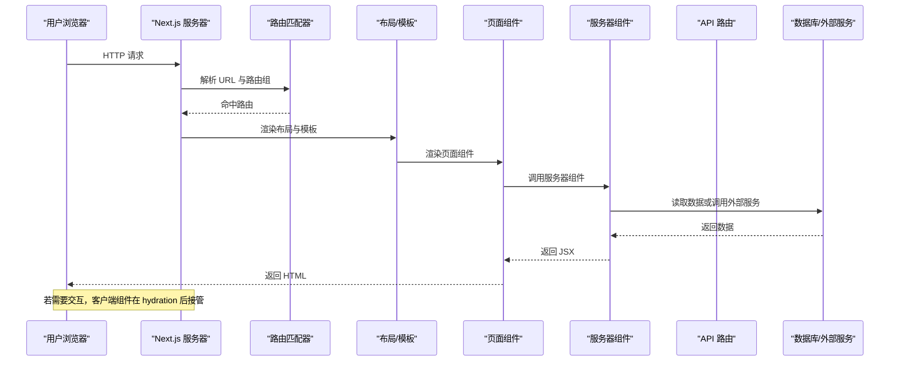
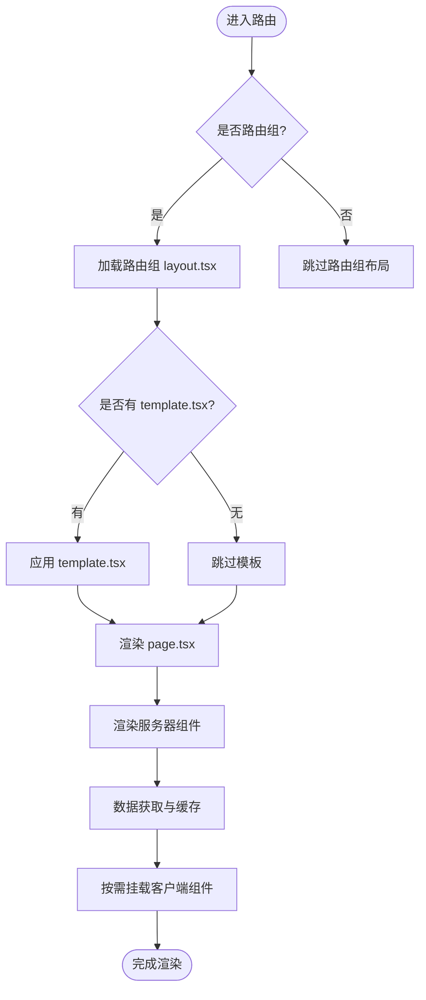
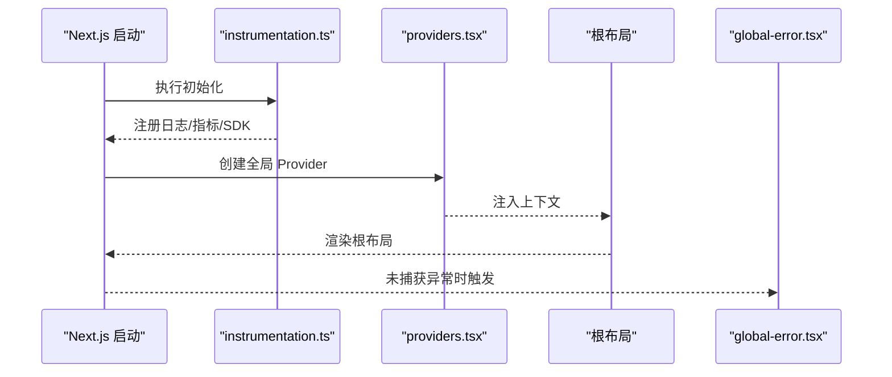
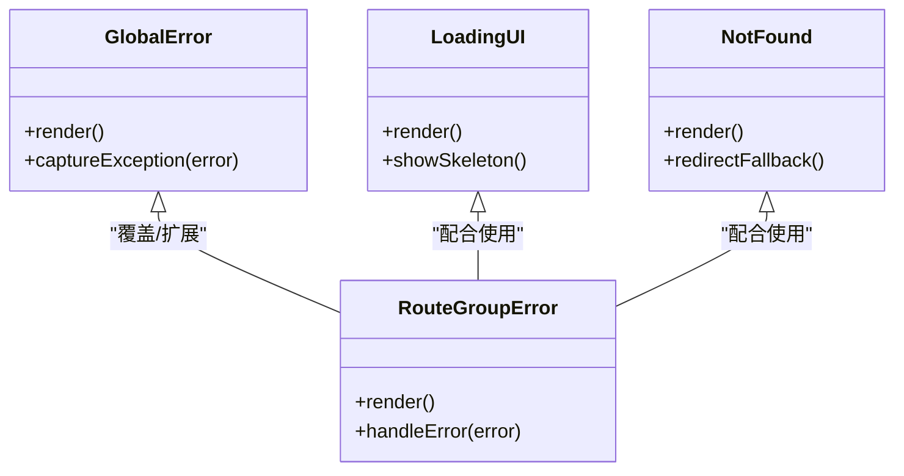
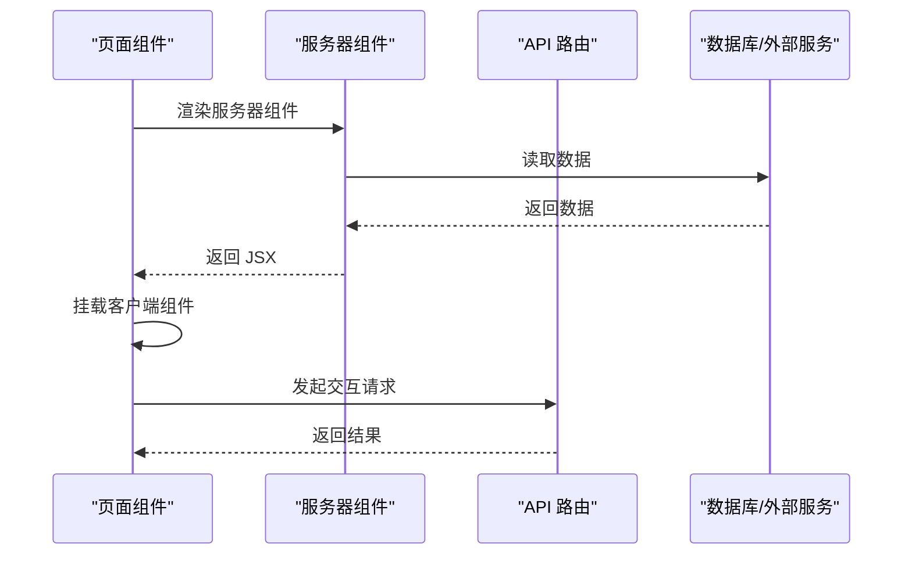
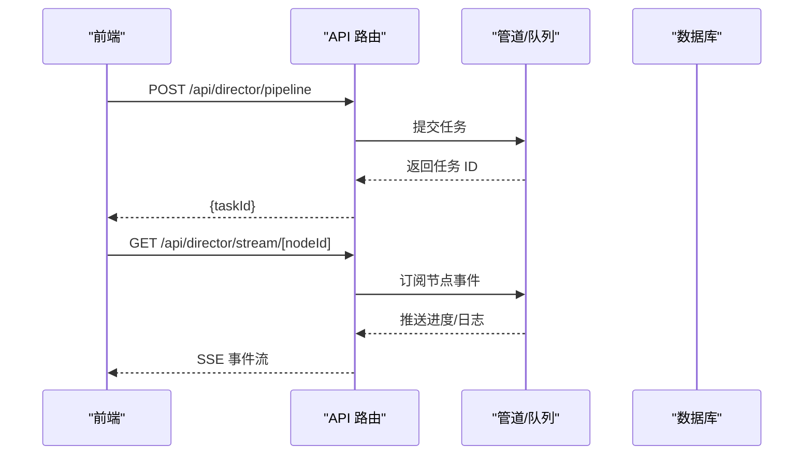
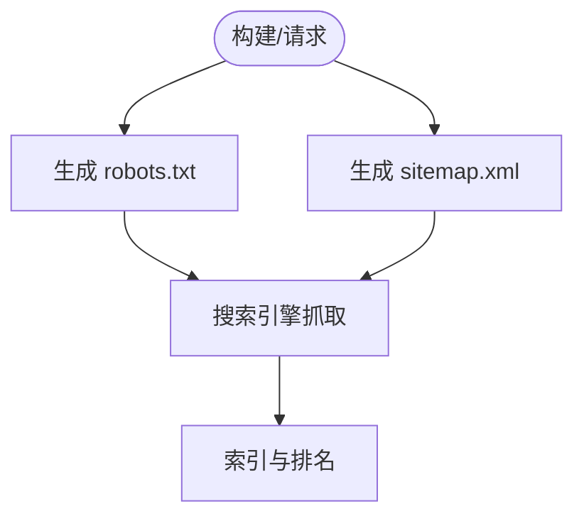
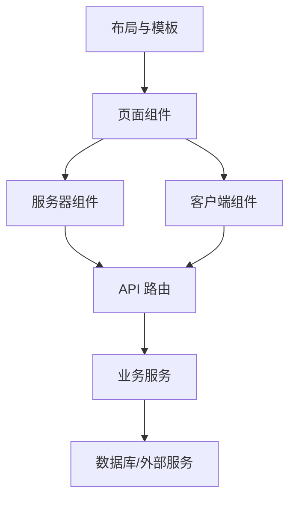

# Next.js 应用架构

<cite>
**本文引用的文件**   
- [next.config.ts](file://next.config.ts)
- [src/app/layout.tsx](file://src/app/layout.tsx)
- [src/app/providers.tsx](file://src/app/providers.tsx)
- [src/app/global-error.tsx](file://src/app/global-error.tsx)
- [src/app/not-found.tsx](file://src/app/not-found.tsx)
- [src/app/robots.ts](file://src/app/robots.ts)
- [src/app/sitemap.ts](file://src/app/sitemap.ts)
- [src/instrumentation.ts](file://src/instrumentation.ts)
- [src/app/(auth)/layout.tsx](file://src/app/(auth)/layout.tsx)
- [src/app/(marketing)/layout.tsx](file://src/app/(marketing)/layout.tsx)
- [src/app/(public)/release/layout.tsx](file://src/app/(public)/release/layout.tsx)
- [src/app/products/(app)/layout.tsx](file://src/app/products/(app)/layout.tsx)
- [src/app/products/(app)/template.tsx](file://src/app/products/(app)/template.tsx)
- [src/app/products/(app)/error.tsx](file://src/app/products/(app)/error.tsx)
- [src/app/products/(app)/loading.tsx](file://src/app/products/(app)/loading.tsx)
- [src/app/products/(app)/not-found.tsx](file://src/app/products/(app)/not-found.tsx)
- [src/app/api/ping/route.ts](file://src/app/api/ping/route.ts)
- [src/app/api/projects/route.ts](file://src/app/api/projects/route.ts)
- [src/app/api/render/route.ts](file://src/app/api/render/route.ts)
- [src/app/api/director/pipeline/route.ts](file://src/app/api/director/pipeline/route.ts)
- [src/app/api/director/stage/route.ts](file://src/app/api/director/stage/route.ts)
- [src/app/api/director/stream/[nodeId]/route.ts](file://src/app/api/director/stream/[nodeId]/route.ts)
- [src/app/api/artifacts/[id]/route.ts](file://src/app/api/artifacts/[id]/route.ts)
- [src/app/api/jobs/[id]/route.ts](file://src/app/api/jobs/[id]/route.ts)
- [src/app/api/settings/route.ts](file://src/app/api/settings/route.ts)
- [src/app/products/(app)/canvas/[projectId]/page.tsx](file://src/app/products/(app)/canvas/[projectId]/page.tsx)
- [src/app/products/(app)/dashboard/page.tsx](file://src/app/products/(app)/dashboard/page.tsx)
- [src/app/products/(app)/export/[projectId]/page.tsx](file://src/app/products/(app)/export/[projectId]/page.tsx)
- [src/app/products/(app)/projects/page.tsx](file://src/app/products/(app)/projects/page.tsx)
- [src/app/products/(app)/settings/page.tsx](file://src/app/products/(app)/settings/page.tsx)
- [src/app/products/(app)/shots/[shotId]/page.tsx](file://src/app/products/(app)/shots/[shotId]/page.tsx)
- [src/app/playbook/page.tsx](file://src/app/playbook/page.tsx)
- [src/app/marketing/page.tsx](file://src/app/marketing/page.tsx)
- [src/app/(auth)/login/page.tsx](file://src/app/(auth)/login/page.tsx)
- [src/app/(auth)/signup/page.tsx](file://src/app/(auth)/signup/page.tsx)
- [src/app/(marketing)/community/page.tsx](file://src/app/(marketing)/community/page.tsx)
- [deploy/compose.yaml](file://deploy/compose.yaml)
- [Dockerfile.web](file://Dockerfile.web)
- [package.json](file://package.json)
</cite>

## 目录
1. [简介](#简介)
2. [项目结构](#项目结构)
3. [核心组件](#核心组件)
4. [架构总览](#架构总览)
5. [详细组件分析](#详细组件分析)
6. [依赖关系分析](#依赖关系分析)
7. [性能考量](#性能考量)
8. [故障排查指南](#故障排查指南)
9. [结论](#结论)
10. [附录](#附录)

## 简介
本文件为 PurpleInk 平台的 Next.js 应用架构文档，聚焦 App Router 路由系统、布局与页面组件的职责划分、服务器组件与客户端组件的协作方式、应用初始化流程、全局提供者配置、错误边界处理、中间件使用场景、性能监控集成、SEO 优化策略、环境变量与构建部署最佳实践，以及数据获取模式的实现细节。文档面向不同技术背景的读者，提供从高层概览到代码级映射的渐进式说明，并附带可视化图示帮助理解。

## 项目结构
PurpleInk 采用 Next.js App Router 组织路由与页面：
- src/app 下按功能域与权限域划分路由组（如 (auth)、(marketing)、(public)、products/(app)），每个路由组可包含独立的 layout.tsx 与 template.tsx，用于共享 UI 与状态。
- API 路由位于 src/app/api，以 RESTful 风格暴露服务端能力，支持流式响应与 SSE。
- 全局样式与主题在 src/app/globals.css 中定义，站点元信息与 SEO 通过 robots.ts、sitemap.ts 管理。
- 应用初始化与监控通过 instrumentation.ts 注入。
- 部署相关配置集中在 deploy 目录与 Dockerfile.web。

图表来源
- [src/app/layout.tsx](file://src/app/layout.tsx)
- [src/app/providers.tsx](file://src/app/providers.tsx)
- [src/app/global-error.tsx](file://src/app/global-error.tsx)
- [src/app/robots.ts](file://src/app/robots.ts)
- [src/app/sitemap.ts](file://src/app/sitemap.ts)
- [src/instrumentation.ts](file://src/instrumentation.ts)

章节来源
- [src/app/layout.tsx](file://src/app/layout.tsx)
- [src/app/providers.tsx](file://src/app/providers.tsx)
- [src/app/global-error.tsx](file://src/app/global-error.tsx)
- [src/app/robots.ts](file://src/app/robots.ts)
- [src/app/sitemap.ts](file://src/app/sitemap.ts)
- [src/instrumentation.ts](file://src/instrumentation.ts)

## 核心组件
- 根布局与路由组布局：根 layout.tsx 负责全局 HTML 骨架、主题与基础 Provider；各路由组 layout.tsx 负责特定域的导航、侧边栏与权限控制。
- 模板与加载态：products/(app)/template.tsx 提供跨页面的过渡与状态恢复；loading.tsx 提供 Suspense 友好的加载 UI。
- 错误边界：global-error.tsx 捕获未处理异常；products/(app)/error.tsx 捕获该路由组的错误。
- 全局提供者：providers.tsx 集中注册 React Context、UI 库 Provider、主题与国际化等。
- SEO：robots.ts 与 sitemap.ts 生成站点爬虫规则与站点地图。
- 初始化与监控：instrumentation.ts 在 Next.js 启动时执行，用于注册日志、指标与外部服务 SDK。

章节来源
- [src/app/layout.tsx](file://src/app/layout.tsx)
- [src/app/(auth)/layout.tsx](file://src/app/(auth)/layout.tsx)
- [src/app/(marketing)/layout.tsx](file://src/app/(marketing)/layout.tsx)
- [src/app/(public)/release/layout.tsx](file://src/app/(public)/release/layout.tsx)
- [src/app/products/(app)/layout.tsx](file://src/app/products/(app)/layout.tsx)
- [src/app/products/(app)/template.tsx](file://src/app/products/(app)/template.tsx)
- [src/app/products/(app)/loading.tsx](file://src/app/products/(app)/loading.tsx)
- [src/app/products/(app)/error.tsx](file://src/app/products/(app)/error.tsx)
- [src/app/global-error.tsx](file://src/app/global-error.tsx)
- [src/app/providers.tsx](file://src/app/providers.tsx)
- [src/app/robots.ts](file://src/app/robots.ts)
- [src/app/sitemap.ts](file://src/app/sitemap.ts)
- [src/instrumentation.ts](file://src/instrumentation.ts)

## 架构总览
Next.js App Router 将“路由即文件系统”的理念落地，结合 Server Components 与 Client Components 的优势，形成清晰的职责分层：
- 服务器组件：默认渲染，负责数据获取、SEO、首屏内容生成与缓存。
- 客户端组件：按需启用交互，处理用户事件、状态管理与浏览器 API。
- 布局与模板：复用 UI 与状态，隔离不同路由组的上下文。
- API 路由：统一后端接口入口，支持流式输出与 SSE。
- 初始化与监控：在应用启动阶段完成 SDK 注册、指标上报与资源预热。

图表来源
- [src/app/layout.tsx](file://src/app/layout.tsx)
- [src/app/products/(app)/layout.tsx](file://src/app/products/(app)/layout.tsx)
- [src/app/products/(app)/template.tsx](file://src/app/products/(app)/template.tsx)
- [src/app/products/(app)/canvas/[projectId]/page.tsx](file://src/app/products/(app)/canvas/[projectId]/page.tsx)
- [src/app/api/director/stream/[nodeId]/route.ts](file://src/app/api/director/stream/[nodeId]/route.ts)

## 详细组件分析

### App Router 路由系统与布局分工
- 路由组设计：
  - (auth)：登录与注册，独立布局与表单壳组件。
  - (marketing)：营销与社区页面，公共头部与底部。
  - (public)：公开发布页，轻量布局。
  - products/(app)：产品主应用，包含画布、导出、设置、项目列表与分镜详情等子路由。
- 布局与模板：
  - 根 layout.tsx 提供 HTML 骨架与全局 Provider。
  - 各路由组 layout.tsx 提供领域内导航、侧边栏与权限校验。
  - products/(app)/template.tsx 提供页面切换动画与状态恢复。
- 页面组件：
  - 各 page.tsx 作为路由终点，组合服务器组件与客户端组件，完成数据获取与交互。

图表来源
- [src/app/(auth)/layout.tsx](file://src/app/(auth)/layout.tsx)
- [src/app/(marketing)/layout.tsx](file://src/app/(marketing)/layout.tsx)
- [src/app/(public)/release/layout.tsx](file://src/app/(public)/release/layout.tsx)
- [src/app/products/(app)/layout.tsx](file://src/app/products/(app)/layout.tsx)
- [src/app/products/(app)/template.tsx](file://src/app/products/(app)/template.tsx)
- [src/app/products/(app)/canvas/[projectId]/page.tsx](file://src/app/products/(app)/canvas/[projectId]/page.tsx)

章节来源
- [src/app/(auth)/layout.tsx](file://src/app/(auth)/layout.tsx)
- [src/app/(marketing)/layout.tsx](file://src/app/(marketing)/layout.tsx)
- [src/app/(public)/release/layout.tsx](file://src/app/(public)/release/layout.tsx)
- [src/app/products/(app)/layout.tsx](file://src/app/products/(app)/layout.tsx)
- [src/app/products/(app)/template.tsx](file://src/app/products/(app)/template.tsx)
- [src/app/products/(app)/canvas/[projectId]/page.tsx](file://src/app/products/(app)/canvas/[projectId]/page.tsx)

### 应用初始化流程与监控集成
- instrumentation.ts：在 Next.js 启动时执行，用于注册日志、指标、追踪与第三方 SDK。
- providers.tsx：集中注册 React Context、UI 库 Provider、主题与国际化等，确保全应用可用。
- global-error.tsx：捕获未处理异常，统一错误展示与上报。

图表来源
- [src/instrumentation.ts](file://src/instrumentation.ts)
- [src/app/providers.tsx](file://src/app/providers.tsx)
- [src/app/layout.tsx](file://src/app/layout.tsx)
- [src/app/global-error.tsx](file://src/app/global-error.tsx)

章节来源
- [src/instrumentation.ts](file://src/instrumentation.ts)
- [src/app/providers.tsx](file://src/app/providers.tsx)
- [src/app/layout.tsx](file://src/app/layout.tsx)
- [src/app/global-error.tsx](file://src/app/global-error.tsx)

### 错误边界与加载态
- 全局错误边界：global-error.tsx 捕获所有未处理异常，提供统一错误页面与上报。
- 路由组错误边界：products/(app)/error.tsx 捕获该路由组内的错误，提供更细粒度的错误处理。
- 加载态：products/(app)/loading.tsx 提供 Suspense 友好的加载 UI，提升用户体验。
- 未找到页面：not-found.tsx 与 products/(app)/not-found.tsx 处理 404 场景。

图表来源
- [src/app/global-error.tsx](file://src/app/global-error.tsx)
- [src/app/products/(app)/error.tsx](file://src/app/products/(app)/error.tsx)
- [src/app/products/(app)/loading.tsx](file://src/app/products/(app)/loading.tsx)
- [src/app/not-found.tsx](file://src/app/not-found.tsx)
- [src/app/products/(app)/not-found.tsx](file://src/app/products/(app)/not-found.tsx)

章节来源
- [src/app/global-error.tsx](file://src/app/global-error.tsx)
- [src/app/products/(app)/error.tsx](file://src/app/products/(app)/error.tsx)
- [src/app/products/(app)/loading.tsx](file://src/app/products/(app)/loading.tsx)
- [src/app/not-found.tsx](file://src/app/not-found.tsx)
- [src/app/products/(app)/not-found.tsx](file://src/app/products/(app)/not-found.tsx)

### 服务器组件与客户端组件协作
- 服务器组件：默认渲染，适合数据获取、SEO、首屏内容生成与缓存。
- 客户端组件：通过 'use client' 声明，处理交互、状态与浏览器 API。
- 数据获取模式：
  - 在服务器组件中直接读取环境变量与数据库，避免暴露敏感信息。
  - 使用 Next.js 内置缓存与 revalidate 策略控制数据更新频率。
  - 对长耗时任务使用 API 路由与流式响应（SSE）。

图表来源
- [src/app/products/(app)/canvas/[projectId]/page.tsx](file://src/app/products/(app)/canvas/[projectId]/page.tsx)
- [src/app/api/director/stream/[nodeId]/route.ts](file://src/app/api/director/stream/[nodeId]/route.ts)

章节来源
- [src/app/products/(app)/canvas/[projectId]/page.tsx](file://src/app/products/(app)/canvas/[projectId]/page.tsx)
- [src/app/api/director/stream/[nodeId]/route.ts](file://src/app/api/director/stream/[nodeId]/route.ts)

### API 路由与流式响应
- RESTful 接口：projects、render、director、artifacts、jobs、settings 等模块提供统一 API。
- 流式响应：director/stream/[nodeId] 支持 SSE，实时推送节点运行日志与进度。
- 错误处理：统一错误码与消息格式，便于前端消费与调试。

图表来源
- [src/app/api/director/pipeline/route.ts](file://src/app/api/director/pipeline/route.ts)
- [src/app/api/director/stage/route.ts](file://src/app/api/director/stage/route.ts)
- [src/app/api/director/stream/[nodeId]/route.ts](file://src/app/api/director/stream/[nodeId]/route.ts)

章节来源
- [src/app/api/director/pipeline/route.ts](file://src/app/api/director/pipeline/route.ts)
- [src/app/api/director/stage/route.ts](file://src/app/api/director/stage/route.ts)
- [src/app/api/director/stream/[nodeId]/route.ts](file://src/app/api/director/stream/[nodeId]/route.ts)

### SEO 优化策略
- robots.ts：定义爬虫规则，控制索引与抓取行为。
- sitemap.ts：动态生成站点地图，提升搜索引擎收录效率。
- 元数据：在各页面组件中设置 title、description、openGraph 等元信息。

图表来源
- [src/app/robots.ts](file://src/app/robots.ts)
- [src/app/sitemap.ts](file://src/app/sitemap.ts)

章节来源
- [src/app/robots.ts](file://src/app/robots.ts)
- [src/app/sitemap.ts](file://src/app/sitemap.ts)

### 环境变量配置与构建优化
- 环境变量：通过 .env.local 与部署环境变量注入，区分开发、测试与生产环境。
- next.config.ts：配置路径别名、压缩、图片优化、CDN 与插件。
- Dockerfile.web：容器化构建与运行，确保一致性与可移植性。
- package.json：脚本与依赖管理，包括构建、预览与测试命令。

章节来源
- [next.config.ts](file://next.config.ts)
- [Dockerfile.web](file://Dockerfile.web)
- [package.json](file://package.json)

### 部署配置最佳实践
- compose.yaml：编排 Web、Worker 与数据库服务，简化本地与生产部署。
- 环境变量：分离敏感配置，使用密钥管理服务。
- 健康检查：ping 路由与健康探针，确保服务可用性。

章节来源
- [deploy/compose.yaml](file://deploy/compose.yaml)
- [src/app/api/ping/route.ts](file://src/app/api/ping/route.ts)

## 依赖关系分析
- 组件耦合：
  - 布局与模板强耦合于路由组，保证领域内 UI 一致性。
  - 服务器组件与客户端组件通过 props 与事件通信，保持低耦合。
- API 依赖：
  - API 路由依赖业务逻辑层与数据访问层，避免在路由中写复杂逻辑。
  - 流式响应依赖队列与事件总线，确保高吞吐与低延迟。
- 外部依赖：
  - 数据库、对象存储、AI 模型服务等通过适配器与配置注入，便于替换与测试。

图表来源
- [src/app/layout.tsx](file://src/app/layout.tsx)
- [src/app/products/(app)/layout.tsx](file://src/app/products/(app)/layout.tsx)
- [src/app/products/(app)/canvas/[projectId]/page.tsx](file://src/app/products/(app)/canvas/[projectId]/page.tsx)
- [src/app/api/director/pipeline/route.ts](file://src/app/api/director/pipeline/route.ts)

章节来源
- [src/app/layout.tsx](file://src/app/layout.tsx)
- [src/app/products/(app)/layout.tsx](file://src/app/products/(app)/layout.tsx)
- [src/app/products/(app)/canvas/[projectId]/page.tsx](file://src/app/products/(app)/canvas/[projectId]/page.tsx)
- [src/app/api/director/pipeline/route.ts](file://src/app/api/director/pipeline/route.ts)

## 性能考量
- 服务器组件优先：默认使用服务器组件减少客户端包体积，提升首屏速度。
- 数据缓存：利用 Next.js 内置缓存与 revalidate 策略，减少重复请求。
- 流式响应：对长耗时任务使用 SSE，提升用户体验。
- 资源优化：图片懒加载、代码分割与按需引入，降低带宽占用。
- 监控与指标：在 instrumentation.ts 中集成性能监控，定位瓶颈。

[本节为通用指导，不直接分析具体文件]

## 故障排查指南
- 全局错误：查看 global-error.tsx 的错误捕获与上报逻辑，确认异常类型与堆栈。
- 路由组错误：检查 products/(app)/error.tsx 的错误处理与降级策略。
- 加载态问题：确认 loading.tsx 的 Suspense 边界与 fallback 组件。
- API 错误：检查路由中的错误码与消息格式，确保前端正确消费。
- 监控日志：通过 instrumentation.ts 注册的日志与指标，定位问题根因。

章节来源
- [src/app/global-error.tsx](file://src/app/global-error.tsx)
- [src/app/products/(app)/error.tsx](file://src/app/products/(app)/error.tsx)
- [src/app/products/(app)/loading.tsx](file://src/app/products/(app)/loading.tsx)
- [src/instrumentation.ts](file://src/instrumentation.ts)

## 结论
PurpleInk 平台基于 Next.js App Router 构建了清晰、可扩展的前端架构。通过布局与模板复用、服务器组件与客户端组件协作、统一的 API 路由与流式响应、完善的错误边界与监控机制，实现了高性能、易维护与良好的用户体验。建议持续优化数据缓存、资源加载与监控指标，进一步提升系统稳定性与可观测性。

[本节为总结，不直接分析具体文件]

## 附录
- 环境变量示例：参考 config/tts.env.example 与 deploy/env.example。
- 部署脚本：参考 scripts/setup 与 scripts/migration。
- 测试用例：参考 tests 目录下的契约与集成测试。

[本节为补充信息，不直接分析具体文件]