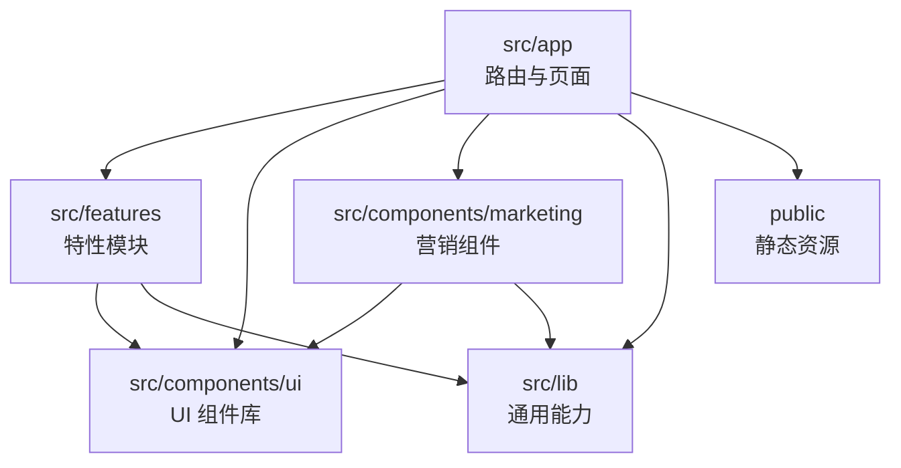
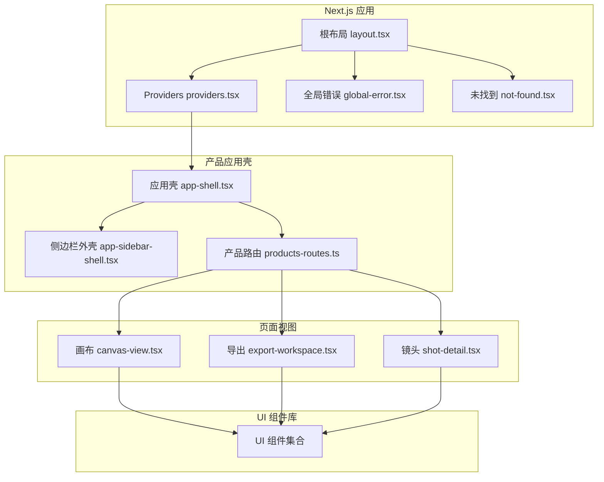
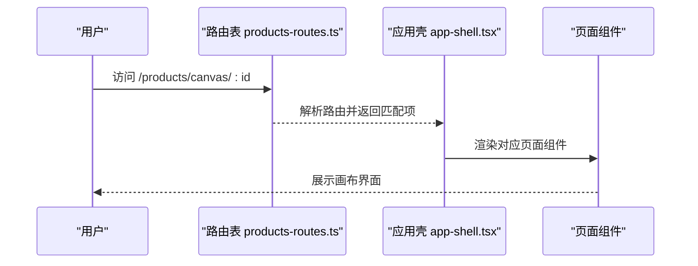
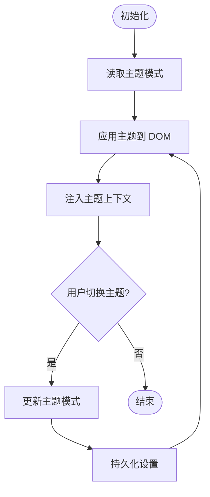
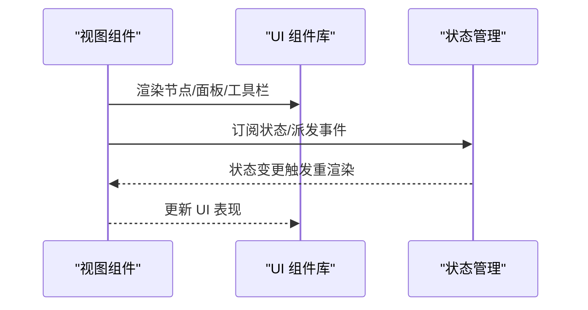
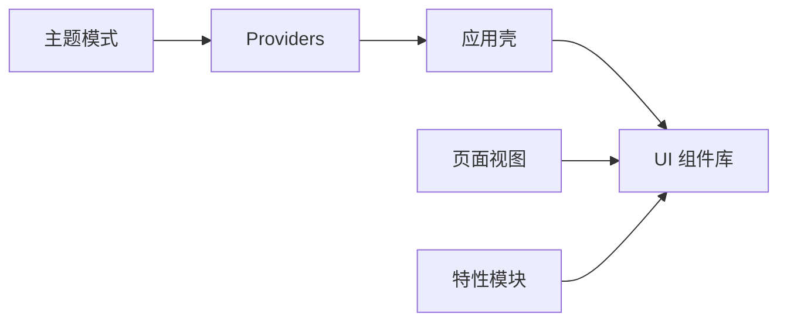

# 前端架构设计

<cite>
**本文引用的文件**   
- [layout.tsx](file://src/app/layout.tsx)
- [providers.tsx](file://src/app/providers.tsx)
- [global-error.tsx](file://src/app/global-error.tsx)
- [not-found.tsx](file://src/app/not-found.tsx)
- [design-system.css](file://src/app/design-system.css)
- [globals.css](file://src/app/globals.css)
- [app-shell.tsx](file://src/features/navigation/app-shell.tsx)
- [app-sidebar-shell.tsx](file://src/features/navigation/app-sidebar-shell.tsx)
- [products-routes.ts](file://src/features/navigation/products-routes.ts)
- [theme-mode.ts](file://src/lib/theme-mode.ts)
- [theme-control.tsx](file://src/app/products/(app)/settings/theme-control.tsx)
- [canvas-view.tsx](file://src/app/products/(app)/canvas/[projectId]/canvas-view.tsx)
- [export-workspace.tsx](file://src/app/products/(app)/export/[projectId]/export-workspace.tsx)
- [shot-detail.tsx](file://src/app/products/(app)/shots/[shotId]/shot-detail.tsx)
- [button.tsx](file://src/components/ui/button.tsx)
- [card.tsx](file://src/components/ui/card.tsx)
- [dialog.tsx](file://src/components/ui/dialog.tsx)
- [sidebar.tsx](file://src/components/ui/sidebar.tsx)
- [top-bar.tsx](file://src/components/ui/top-bar.tsx)
- [skeleton.tsx](file://src/components/ui/skeleton.tsx)
- [toast.tsx](file://src/components/ui/toast.tsx)
- [pipeline-node.tsx](file://src/components/ui/pipeline-node.tsx)
- [artifact-chip.tsx](file://src/components/ui/artifact-chip.tsx)
- [queue-status-bar.tsx](file://src/components/ui/queue-status-bar.tsx)
- [status-pill.tsx](file://src/components/ui/status-pill.tsx)
- [text-field.tsx](file://src/components/ui/text-field.tsx)
- [text-area.tsx](file://src/components/ui/text-area.tsx)
- [toggle.tsx](file://src/components/ui/toggle.tsx)
- [tooltip.tsx](file://src/components/ui/tooltip.tsx)
- [nav-item.tsx](file://src/components/ui/nav-item.tsx)
- [search-field.tsx](file://src/components/ui/search-field.tsx)
- [segmented-control.tsx](file://src/components/ui/segmented-control.tsx)
- [settings-panel.tsx](file://src/components/ui/settings-panel.tsx)
- [settings-row.tsx](file://src/components/ui/settings-row.tsx)
- [timeline-track.tsx](file://src/components/ui/timeline-track.tsx)
- [resize-handle.tsx](file://src/components/ui/resize-handle.tsx)
- [empty-state.tsx](file://src/components/ui/empty-state.tsx)
- [project-card.tsx](file://src/components/ui/project-card.tsx)
- [contact-sheet-thumb.tsx](file://src/components/ui/contact-sheet-thumb.tsx)
- [progress-bar.tsx](file://src/components/ui/progress-bar.tsx)
- [purple-ink-logo.tsx](file://src/components/ui/purple-ink-logo.tsx)
- [icon-button.tsx](file://src/components/ui/icon-button.tsx)
- [collapsible-card.tsx](file://src/components/ui/collapsible-card.tsx)
- [audio-node.tsx](file://src/components/ui/node/audio-node.tsx)
- [export-node.tsx](file://src/components/ui/node/export-node.tsx)
- [stage-node.tsx](file://src/components/ui/node/stage-node.tsx)
- [shot-node.tsx](file://src/components/ui/node/shot-node.tsx)
- [stage-colors.ts](file://src/components/ui/node/stage-colors.ts)
- [new-project-dialog.tsx](file://src/app/_components/new-project-dialog.tsx)
- [route-shell-page.tsx](file://src/app/_components/route-shell-page.tsx)
- [route-status.tsx](file://src/app/_components/route-status.tsx)
- [unwired-panel.tsx](file://src/app/_components/unwired-panel.tsx)
- [playbook/page.tsx](file://src/app/playbook/page.tsx)
- [playbook/registry.ts](file://src/app/playbook/registry.ts)
- [marketing/header.tsx](file://src/components/marketing/header.tsx)
- [marketing/footer.tsx](file://src/components/marketing/footer.tsx)
- [marketing/theme-switch.tsx](file://src/components/marketing/theme-switch.tsx)
- [next.config.ts](file://next.config.ts)
- [package.json](file://package.json)
</cite>

## 目录
1. [简介](#简介)
2. [项目结构](#项目结构)
3. [核心组件](#核心组件)
4. [架构总览](#架构总览)
5. [详细组件分析](#详细组件分析)
6. [依赖关系分析](#依赖关系分析)
7. [性能考虑](#性能考虑)
8. [故障排查指南](#故障排查指南)
9. [结论](#结论)
10. [附录](#附录)

## 简介
本文件面向 PurpleInk 平台的前端架构设计与实现，聚焦基于 Next.js 的现代化架构：App Router 路由系统、服务器组件与客户端组件的职责划分、React 组件分层、状态管理策略与自定义 Hooks、Feature-based 模块化组织、UI 组件库与主题系统、响应式设计与可访问性支持、错误边界与加载状态管理等。文档通过架构图、流程图与类图帮助读者快速理解并落地最佳实践。

## 项目结构
PurpleInk 采用 Next.js App Router 的组织方式，结合 Feature-based 模块拆分与共享 UI 组件库，形成清晰的分层与职责边界：
- src/app：应用路由与页面（含分组路由 (auth)、(marketing)、(public)、(app)），全局布局、错误页、站点元数据等
- src/features：按业务域划分的特性模块（导航、画布、导出、镜头、渲染、AI、音频、项目、凭证、路由等）
- src/components/ui：通用 UI 原子组件与节点组件
- src/components/marketing：营销页专用组件
- src/lib：跨领域工具与能力（主题模式、API、队列、流、存储等）
- public：静态资源
- server：服务端逻辑（采集、编排、TTS、作业运行器等）

图表来源
- [layout.tsx:1-200](file://src/app/layout.tsx#L1-L200)
- [providers.tsx:1-200](file://src/app/providers.tsx#L1-L200)
- [app-shell.tsx:1-200](file://src/features/navigation/app-shell.tsx#L1-L200)
- [products-routes.ts:1-200](file://src/features/navigation/products-routes.ts#L1-L200)

章节来源
- [layout.tsx:1-200](file://src/app/layout.tsx#L1-L200)
- [providers.tsx:1-200](file://src/app/providers.tsx#L1-L200)
- [app-shell.tsx:1-200](file://src/features/navigation/app-shell.tsx#L1-L200)
- [products-routes.ts:1-200](file://src/features/navigation/products-routes.ts#L1-L200)

## 核心组件
- 应用壳与路由
  - 根布局与提供者：负责全局样式、主题、国际化、错误边界、Providers 注入
  - 产品应用壳：统一侧边栏、顶部栏、内容区与路由切换
- 页面与视图
  - 画布视图、导出工作区、镜头详情等以功能为维度的页面组合
- UI 组件库
  - 基础控件（按钮、卡片、对话框、输入、进度、提示、状态标签等）
  - 节点组件（音频节点、导出节点、阶段节点、镜头节点等）
- 导航与路由
  - 产品路由表、侧边栏外壳、可折叠面板、导航上下文

章节来源
- [layout.tsx:1-200](file://src/app/layout.tsx#L1-L200)
- [providers.tsx:1-200](file://src/app/providers.tsx#L1-L200)
- [app-shell.tsx:1-200](file://src/features/navigation/app-shell.tsx#L1-L200)
- [app-sidebar-shell.tsx:1-200](file://src/features/navigation/app-sidebar-shell.tsx#L1-L200)
- [products-routes.ts:1-200](file://src/features/navigation/products-routes.ts#L1-L200)
- [canvas-view.tsx:1-200](file://src/app/products/(app)/canvas/[projectId]/canvas-view.tsx#L1-L200)
- [export-workspace.tsx:1-200](file://src/app/products/(app)/export/[projectId]/export-workspace.tsx#L1-L200)
- [shot-detail.tsx:1-200](file://src/app/products/(app)/shots/[shotId]/shot-detail.tsx#L1-L200)

## 架构总览
下图展示 Next.js App Router 下的整体架构：根布局与 Providers 提供全局上下文；产品应用壳承载侧边栏与内容区；各功能页面按需加载；UI 组件库被复用；主题系统贯穿全局。

图表来源
- [layout.tsx:1-200](file://src/app/layout.tsx#L1-L200)
- [providers.tsx:1-200](file://src/app/providers.tsx#L1-L200)
- [global-error.tsx:1-200](file://src/app/global-error.tsx#L1-L200)
- [not-found.tsx:1-200](file://src/app/not-found.tsx#L1-L200)
- [app-shell.tsx:1-200](file://src/features/navigation/app-shell.tsx#L1-L200)
- [app-sidebar-shell.tsx:1-200](file://src/features/navigation/app-sidebar-shell.tsx#L1-L200)
- [products-routes.ts:1-200](file://src/features/navigation/products-routes.ts#L1-L200)
- [canvas-view.tsx:1-200](file://src/app/products/(app)/canvas/[projectId]/canvas-view.tsx#L1-L200)
- [export-workspace.tsx:1-200](file://src/app/products/(app)/export/[projectId]/export-workspace.tsx#L1-L200)
- [shot-detail.tsx:1-200](file://src/app/products/(app)/shots/[shotId]/shot-detail.tsx#L1-L200)

## 详细组件分析

### 应用壳与路由系统
- 根布局与提供者
  - 根布局负责全局 HTML/CSS 注入、字体、SEO、错误边界与 Providers 包裹
  - Providers 集中注入主题、查询、通知、国际化等上下文
- 产品应用壳
  - 统一侧边栏、顶部栏、内容区域与路由切换
  - 根据当前路由动态显示不同面板与操作区
- 产品路由表
  - 集中定义产品子应用的路由映射与权限控制
  - 支持嵌套路由与懒加载

图表来源
- [products-routes.ts:1-200](file://src/features/navigation/products-routes.ts#L1-L200)
- [app-shell.tsx:1-200](file://src/features/navigation/app-shell.tsx#L1-L200)
- [canvas-view.tsx:1-200](file://src/app/products/(app)/canvas/[projectId]/canvas-view.tsx#L1-L200)

章节来源
- [layout.tsx:1-200](file://src/app/layout.tsx#L1-L200)
- [providers.tsx:1-200](file://src/app/providers.tsx#L1-L200)
- [app-shell.tsx:1-200](file://src/features/navigation/app-shell.tsx#L1-L200)
- [app-sidebar-shell.tsx:1-200](file://src/features/navigation/app-sidebar-shell.tsx#L1-L200)
- [products-routes.ts:1-200](file://src/features/navigation/products-routes.ts#L1-L200)

### 主题系统与颜色
- 主题模式
  - 通过 theme-mode 管理明暗模式与持久化
  - 在 Providers 中注入主题上下文，供全应用使用
- 主题控制面板
  - settings/theme-control 提供主题切换与预览
- 节点颜色体系
  - stage-colors 定义阶段节点的颜色语义，保证一致性

图表来源
- [theme-mode.ts:1-200](file://src/lib/theme-mode.ts#L1-L200)
- [theme-control.tsx:1-200](file://src/app/products/(app)/settings/theme-control.tsx#L1-L200)
- [stage-colors.ts:1-200](file://src/components/ui/node/stage-colors.ts#L1-L200)

章节来源
- [theme-mode.ts:1-200](file://src/lib/theme-mode.ts#L1-L200)
- [theme-control.tsx:1-200](file://src/app/products/(app)/settings/theme-control.tsx#L1-L200)
- [stage-colors.ts:1-200](file://src/components/ui/node/stage-colors.ts#L1-L200)

### UI 组件库与节点组件
- 基础控件
  - 按钮、卡片、对话框、输入、进度、提示、状态标签、空状态、骨架屏等
- 节点组件
  - 音频节点、导出节点、阶段节点、镜头节点等，用于画布与管线可视化
- 交互增强
  - 工具提示、开关、分段控制器、搜索框、导航项、设置面板与行、时间线轨道、拖拽手柄等

```mermaid
classDiagram
class Button { +onClick() +variant() }
class Card { +title() +content() }
class Dialog { +open() +close() }
class TextField { +value() +onChange() }
class TextArea { +value() +onChange() }
class Toggle { +checked() +onToggle() }
class Tooltip { +content() +position() }
class ProgressBar { +percent() +status() }
class StatusPill { +label() +color() }
class Skeleton { +shape() +size() }
class Toast { +show() +hide() }
class Sidebar { +items() +collapsed() }
class TopBar { +actions() +title() }
class PipelineNode { +type() +data() }
class ArtifactChip { +name() +meta() }
class QueueStatusBar { +status() +count() }
class SettingsPanel { +sections() }
class SettingsRow { +label() +control() }
class TimelineTrack { +tracks() }
class ResizeHandle { +drag() }
class EmptyState { +message() +action() }
class ProjectCard { +info() }
class ContactSheetThumb { +image() }
class IconButton { +icon() +onClick() }
class CollapsibleCard { +header() +body() }
class AudioNode { +duration() +waveform() }
class ExportNode { +format() +quality() }
class StageNode { +stage() +status() }
class ShotNode { +shotId() +thumbnail() }
```

图表来源
- [button.tsx:1-200](file://src/components/ui/button.tsx#L1-L200)
- [card.tsx:1-200](file://src/components/ui/card.tsx#L1-L200)
- [dialog.tsx:1-200](file://src/components/ui/dialog.tsx#L1-L200)
- [text-field.tsx:1-200](file://src/components/ui/text-field.tsx#L1-L200)
- [text-area.tsx:1-200](file://src/components/ui/text-area.tsx#L1-L200)
- [toggle.tsx:1-200](file://src/components/ui/toggle.tsx#L1-L200)
- [tooltip.tsx:1-200](file://src/components/ui/tooltip.tsx#L1-L200)
- [progress-bar.tsx:1-200](file://src/components/ui/progress-bar.tsx#L1-L200)
- [status-pill.tsx:1-200](file://src/components/ui/status-pill.tsx#L1-L200)
- [skeleton.tsx:1-200](file://src/components/ui/skeleton.tsx#L1-L200)
- [toast.tsx:1-200](file://src/components/ui/toast.tsx#L1-L200)
- [sidebar.tsx:1-200](file://src/components/ui/sidebar.tsx#L1-L200)
- [top-bar.tsx:1-200](file://src/components/ui/top-bar.tsx#L1-L200)
- [pipeline-node.tsx:1-200](file://src/components/ui/pipeline-node.tsx#L1-L200)
- [artifact-chip.tsx:1-200](file://src/components/ui/artifact-chip.tsx#L1-L200)
- [queue-status-bar.tsx:1-200](file://src/components/ui/queue-status-bar.tsx#L1-L200)
- [settings-panel.tsx:1-200](file://src/components/ui/settings-panel.tsx#L1-L200)
- [settings-row.tsx:1-200](file://src/components/ui/settings-row.tsx#L1-L200)
- [timeline-track.tsx:1-200](file://src/components/ui/timeline-track.tsx#L1-L200)
- [resize-handle.tsx:1-200](file://src/components/ui/resize-handle.tsx#L1-L200)
- [empty-state.tsx:1-200](file://src/components/ui/empty-state.tsx#L1-L200)
- [project-card.tsx:1-200](file://src/components/ui/project-card.tsx#L1-L200)
- [contact-sheet-thumb.tsx:1-200](file://src/components/ui/contact-sheet-thumb.tsx#L1-L200)
- [icon-button.tsx:1-200](file://src/components/ui/icon-button.tsx#L1-L200)
- [collapsible-card.tsx:1-200](file://src/components/ui/collapsible-card.tsx#L1-L200)
- [audio-node.tsx:1-200](file://src/components/ui/node/audio-node.tsx#L1-L200)
- [export-node.tsx:1-200](file://src/components/ui/node/export-node.tsx#L1-L200)
- [stage-node.tsx:1-200](file://src/components/ui/node/stage-node.tsx#L1-L200)
- [shot-node.tsx:1-200](file://src/components/ui/node/shot-node.tsx#L1-L200)

章节来源
- [button.tsx:1-200](file://src/components/ui/button.tsx#L1-L200)
- [card.tsx:1-200](file://src/components/ui/card.tsx#L1-L200)
- [dialog.tsx:1-200](file://src/components/ui/dialog.tsx#L1-L200)
- [sidebar.tsx:1-200](file://src/components/ui/sidebar.tsx#L1-L200)
- [top-bar.tsx:1-200](file://src/components/ui/top-bar.tsx#L1-L200)
- [pipeline-node.tsx:1-200](file://src/components/ui/pipeline-node.tsx#L1-L200)
- [artifact-chip.tsx:1-200](file://src/components/ui/artifact-chip.tsx#L1-L200)
- [queue-status-bar.tsx:1-200](file://src/components/ui/queue-status-bar.tsx#L1-L200)
- [status-pill.tsx:1-200](file://src/components/ui/status-pill.tsx#L1-L200)
- [text-field.tsx:1-200](file://src/components/ui/text-field.tsx#L1-L200)
- [text-area.tsx:1-200](file://src/components/ui/text-area.tsx#L1-L200)
- [toggle.tsx:1-200](file://src/components/ui/toggle.tsx#L1-L200)
- [tooltip.tsx:1-200](file://src/components/ui/tooltip.tsx#L1-L200)
- [nav-item.tsx:1-200](file://src/components/ui/nav-item.tsx#L1-L200)
- [search-field.tsx:1-200](file://src/components/ui/search-field.tsx#L1-L200)
- [segmented-control.tsx:1-200](file://src/components/ui/segmented-control.tsx#L1-L200)
- [settings-panel.tsx:1-200](file://src/components/ui/settings-panel.tsx#L1-L200)
- [settings-row.tsx:1-200](file://src/components/ui/settings-row.tsx#L1-L200)
- [timeline-track.tsx:1-200](file://src/components/ui/timeline-track.tsx#L1-L200)
- [resize-handle.tsx:1-200](file://src/components/ui/resize-handle.tsx#L1-L200)
- [empty-state.tsx:1-200](file://src/components/ui/empty-state.tsx#L1-L200)
- [project-card.tsx:1-200](file://src/components/ui/project-card.tsx#L1-L200)
- [contact-sheet-thumb.tsx:1-200](file://src/components/ui/contact-sheet-thumb.tsx#L1-L200)
- [progress-bar.tsx:1-200](file://src/components/ui/progress-bar.tsx#L1-L200)
- [purple-ink-logo.tsx:1-200](file://src/components/ui/purple-ink-logo.tsx#L1-L200)
- [icon-button.tsx:1-200](file://src/components/ui/icon-button.tsx#L1-L200)
- [collapsible-card.tsx:1-200](file://src/components/ui/collapsible-card.tsx#L1-L200)
- [audio-node.tsx:1-200](file://src/components/ui/node/audio-node.tsx#L1-L200)
- [export-node.tsx:1-200](file://src/components/ui/node/export-node.tsx#L1-L200)
- [stage-node.tsx:1-200](file://src/components/ui/node/stage-node.tsx#L1-L200)
- [shot-node.tsx:1-200](file://src/components/ui/node/shot-node.tsx#L1-L200)
- [stage-colors.ts:1-200](file://src/components/ui/node/stage-colors.ts#L1-L200)

### 页面与视图组合
- 画布视图：组合节点、工具栏、状态栏与反馈面板
- 导出工作区：选择导出参数、查看任务状态与结果
- 镜头详情：播放、编辑与面板切换

图表来源
- [canvas-view.tsx:1-200](file://src/app/products/(app)/canvas/[projectId]/canvas-view.tsx#L1-L200)
- [export-workspace.tsx:1-200](file://src/app/products/(app)/export/[projectId]/export-workspace.tsx#L1-L200)
- [shot-detail.tsx:1-200](file://src/app/products/(app)/shots/[shotId]/shot-detail.tsx#L1-L200)

章节来源
- [canvas-view.tsx:1-200](file://src/app/products/(app)/canvas/[projectId]/canvas-view.tsx#L1-L200)
- [export-workspace.tsx:1-200](file://src/app/products/(app)/export/[projectId]/export-workspace.tsx#L1-L200)
- [shot-detail.tsx:1-200](file://src/app/products/(app)/shots/[shotId]/shot-detail.tsx#L1-L200)

### 营销与品牌组件
- 头部与底部：品牌标识、导航、CTA
- 主题切换：营销页独立的主题开关
- Logo：品牌图标组件

章节来源
- [marketing/header.tsx:1-200](file://src/components/marketing/header.tsx#L1-L200)
- [marketing/footer.tsx:1-200](file://src/components/marketing/footer.tsx#L1-L200)
- [marketing/theme-switch.tsx:1-200](file://src/components/marketing/theme-switch.tsx#L1-L200)
- [purple-ink-logo.tsx:1-200](file://src/components/ui/purple-ink-logo.tsx#L1-L200)

### 辅助组件与页面容器
- 新工程对话框：创建项目的表单与校验
- 路由壳页面：统一路由包装与状态展示
- 未连接面板：网络或服务不可用时的降级展示

章节来源
- [new-project-dialog.tsx:1-200](file://src/app/_components/new-project-dialog.tsx#L1-L200)
- [route-shell-page.tsx:1-200](file://src/app/_components/route-shell-page.tsx#L1-L200)
- [route-status.tsx:1-200](file://src/app/_components/route-status.tsx#L1-L200)
- [unwired-panel.tsx:1-200](file://src/app/_components/unwired-panel.tsx#L1-L200)

### Playbook 与设计系统入口
- playbook 页面作为设计系统演示与注册中心，便于开发者查阅与复用

章节来源
- [playbook/page.tsx:1-200](file://src/app/playbook/page.tsx#L1-L200)
- [playbook/registry.ts:1-200](file://src/app/playbook/registry.ts#L1-L200)

## 依赖关系分析
- 组件耦合与内聚
  - UI 组件库保持高内聚、低耦合，页面与特性模块仅依赖其公开接口
  - 主题模式与 Providers 解耦，避免循环依赖
- 外部依赖
  - Next.js App Router、React、CSS 变量与 Tailwind（如配置）
  - 第三方 UI 库（若存在）通过 shadcn 或类似方案集成

图表来源
- [app-shell.tsx:1-200](file://src/features/navigation/app-shell.tsx#L1-L200)
- [providers.tsx:1-200](file://src/app/providers.tsx#L1-L200)
- [theme-mode.ts:1-200](file://src/lib/theme-mode.ts#L1-L200)
- [button.tsx:1-200](file://src/components/ui/button.tsx#L1-L200)
- [card.tsx:1-200](file://src/components/ui/card.tsx#L1-L200)

章节来源
- [app-shell.tsx:1-200](file://src/features/navigation/app-shell.tsx#L1-L200)
- [providers.tsx:1-200](file://src/app/providers.tsx#L1-L200)
- [theme-mode.ts:1-200](file://src/lib/theme-mode.ts#L1-L200)

## 性能考虑
- 路由与代码分割
  - 使用 App Router 的懒加载与并行渲染，减少首屏体积
- 组件优化
  - 合理拆分组件，避免不必要的重渲染
  - 使用 React.memo、useMemo、useCallback 优化计算与回调
- 资源与图片
  - 静态资源放入 public，按需加载大图与媒体
- 主题与样式
  - 使用 CSS 变量与 Tailwind 原子类，减少运行时样式计算
- 构建与打包
  - 通过 next.config.ts 优化输出与缓存策略

章节来源
- [next.config.ts:1-200](file://next.config.ts#L1-L200)
- [package.json:1-200](file://package.json#L1-L200)

## 故障排查指南
- 全局错误处理
  - global-error 捕获未处理异常并提供友好降级
- 未找到页面
  - not-found 处理 404 场景
- 路由状态与未连接面板
  - route-status 与 unwired-panel 用于诊断网络与服务状态

章节来源
- [global-error.tsx:1-200](file://src/app/global-error.tsx#L1-L200)
- [not-found.tsx:1-200](file://src/app/not-found.tsx#L1-L200)
- [route-status.tsx:1-200](file://src/app/_components/route-status.tsx#L1-L200)
- [unwired-panel.tsx:1-200](file://src/app/_components/unwired-panel.tsx#L1-L200)

## 结论
PurpleInk 前端采用 Next.js App Router 与 Feature-based 组织，结合清晰的 UI 组件库与主题系统，实现了高内聚、低耦合的可扩展架构。通过合理的组件分层、状态管理与错误边界，保证了良好的用户体验与可维护性。建议持续完善自定义 Hooks、测试覆盖与性能监控，进一步提升开发效率与稳定性。

## 附录
- 设计系统样式
  - design-system.css 与 globals.css 定义全局样式与变量
- 营销组件
  - marketing 目录下包含营销页专用组件

章节来源
- [design-system.css:1-200](file://src/app/design-system.css#L1-L200)
- [globals.css:1-200](file://src/app/globals.css#L1-L200)
- [marketing/header.tsx:1-200](file://src/components/marketing/header.tsx#L1-L200)
- [marketing/footer.tsx:1-200](file://src/components/marketing/footer.tsx#L1-L200)
- [marketing/theme-switch.tsx:1-200](file://src/components/marketing/theme-switch.tsx#L1-L200)