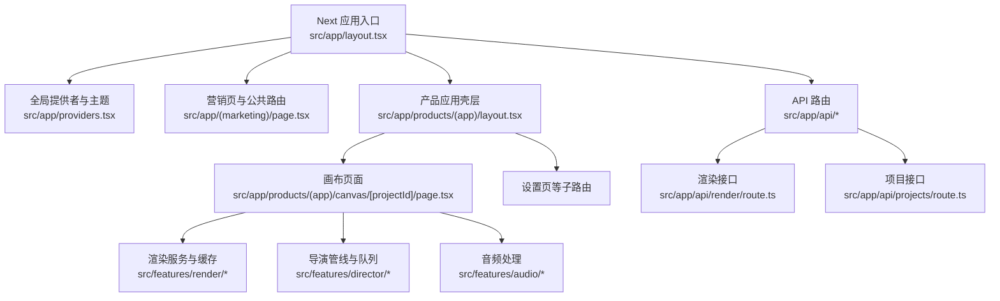
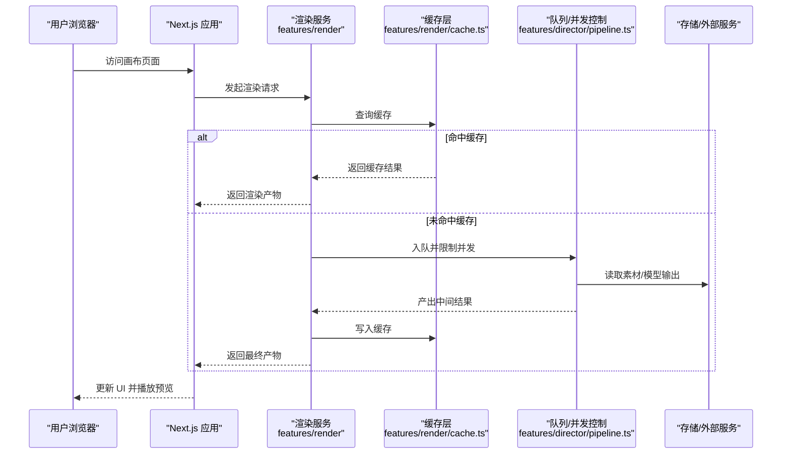
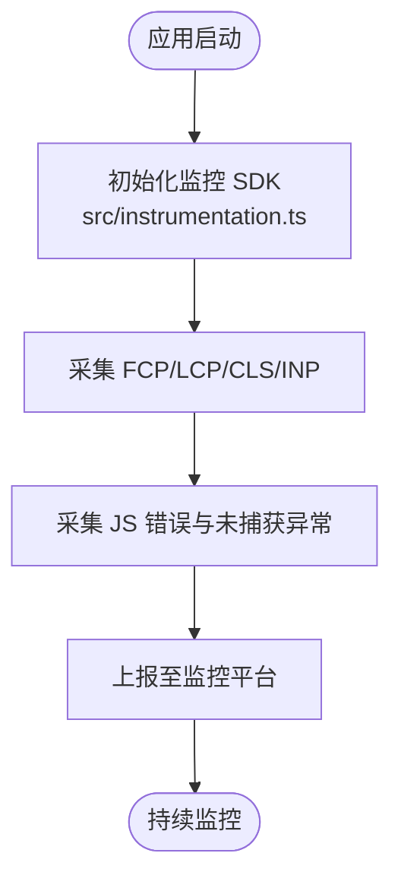
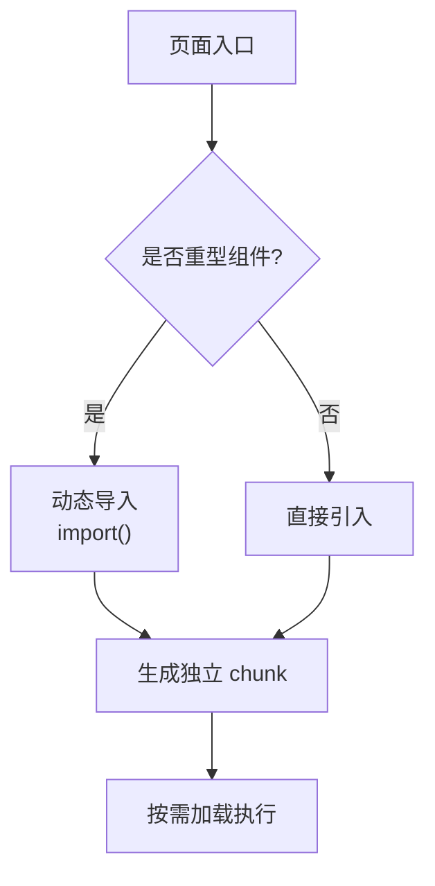
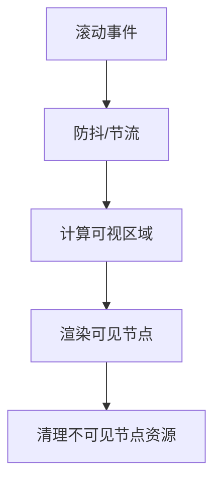
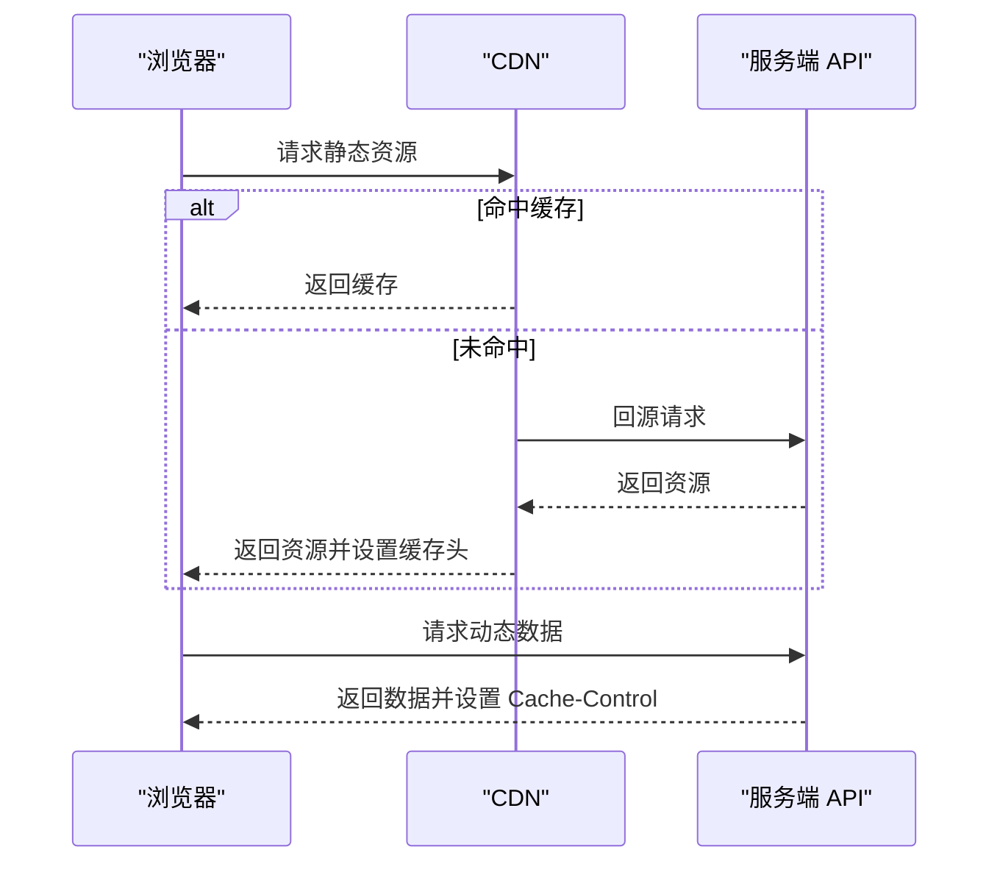
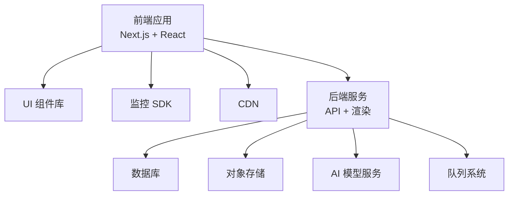

# 性能优化策略

<cite>
**本文引用的文件**
- [next.config.ts](file://next.config.ts)
- [package.json](file://package.json)
- [src/app/layout.tsx](file://src/app/layout.tsx)
- [src/app/providers.tsx](file://src/app/providers.tsx)
- [src/instrumentation.ts](file://src/instrumentation.ts)
- [src/lib/utils.ts](file://src/lib/utils.ts)
- [src/features/navigation/app-shell.tsx](file://src/features/navigation/app-shell.tsx)
- [src/features/navigation/app-sidebar.tsx](file://src/features/navigation/app-sidebar.tsx)
- [src/components/ui/skeleton.tsx](file://src/components/ui/skeleton.tsx)
- [src/components/ui/progress-bar.tsx](file://src/components/ui/progress-bar.tsx)
- [src/components/ui/toast.tsx](file://src/components/ui/dialog.tsx)
- [src/app/(marketing)/page.tsx](file://src/app/(marketing)/page.tsx)
- [src/app/products/(app)/layout.tsx](file://src/app/products/(app)/layout.tsx)
- [src/app/products/(app)/canvas/[projectId]/page.tsx](file://src/app/products/(app)/canvas/[projectId]/page.tsx)
- [src/app/api/render/route.ts](file://src/app/api/render/route.ts)
- [src/app/api/projects/route.ts](file://src/app/api/projects/route.ts)
- [src/features/render/renderer.ts](file://src/features/render/renderer.ts)
- [src/features/render/cache.ts](file://src/features/render/cache.ts)
- [src/features/render/export-service.ts](file://src/features/render/export-service.ts)
- [src/features/director/pipeline.ts](file://src/features/director/pipeline.ts)
- [src/features/audio/narration.ts](file://src/features/audio/narration.ts)
</cite>

## 目录
1. [简介](#简介)
2. [项目结构](#项目结构)
3. [核心组件](#核心组件)
4. [架构总览](#架构总览)
5. [详细组件分析](#详细组件分析)
6. [依赖分析](#依赖分析)
7. [性能考量](#性能考量)
8. [故障排查指南](#故障排查指南)
9. [结论](#结论)
10. [附录](#附录)

## 简介
本文件为 PurpleInK 平台制定全面的性能优化策略，覆盖前端性能监控、指标采集与分析工具使用；代码分割与懒加载；资源优化（图片、字体、脚本）；渲染性能优化（虚拟滚动、防抖节流、内存管理）；网络请求优化（缓存、并发控制、CDN）；移动端与首屏加载优化；以及用户体验提升的最佳实践。文档同时结合仓库中的 Next.js 应用结构、API 路由与渲染管线，给出可落地的优化方案与示例路径引用。

## 项目结构
PurpleInK 基于 Next.js App Router 构建，前后端一体化：
- 前端页面与组件位于 src/app 与 src/components
- 功能模块按领域划分在 src/features
- API 路由位于 src/app/api
- 服务端渲染与导出能力集中在 src/features/render 与 server/src
- 配置与入口包括 next.config.ts、package.json、src/app/layout.tsx、src/app/providers.tsx

图表来源
- [src/app/layout.tsx](file://src/app/layout.tsx)
- [src/app/providers.tsx](file://src/app/providers.tsx)
- [src/app/(marketing)/page.tsx](file://src/app/(marketing)/page.tsx)
- [src/app/products/(app)/layout.tsx](file://src/app/products/(app)/layout.tsx)
- [src/app/products/(app)/canvas/[projectId]/page.tsx](file://src/app/products/(app)/canvas/[projectId]/page.tsx)
- [src/features/render/renderer.ts](file://src/features/render/renderer.ts)
- [src/features/director/pipeline.ts](file://src/features/director/pipeline.ts)
- [src/app/api/render/route.ts](file://src/app/api/render/route.ts)
- [src/app/api/projects/route.ts](file://src/app/api/projects/route.ts)

章节来源
- [next.config.ts](file://next.config.ts)
- [package.json](file://package.json)
- [src/app/layout.tsx](file://src/app/layout.tsx)
- [src/app/providers.tsx](file://src/app/providers.tsx)

## 核心组件
- 应用壳层与提供者：负责全局样式、主题、国际化与性能相关的全局状态初始化
- 营销首页：静态优先，强调首屏快速展示与 SEO
- 产品应用壳层：承载复杂交互的画布与导出流程
- 渲染服务：帧捕获、编码、缩略图生成与缓存
- 导演管线：编排多阶段任务，支持队列与并发控制
- API 路由：提供渲染、项目、流式日志等后端能力

章节来源
- [src/app/layout.tsx](file://src/app/layout.tsx)
- [src/app/providers.tsx](file://src/app/providers.tsx)
- [src/app/(marketing)/page.tsx](file://src/app/(marketing)/page.tsx)
- [src/app/products/(app)/layout.tsx](file://src/app/products/(app)/layout.tsx)
- [src/features/render/renderer.ts](file://src/features/render/renderer.ts)
- [src/features/director/pipeline.ts](file://src/features/director/pipeline.ts)
- [src/app/api/render/route.ts](file://src/app/api/render/route.ts)
- [src/app/api/projects/route.ts](file://src/app/api/projects/route.ts)

## 架构总览
下图展示了从用户访问到渲染结果返回的关键链路，包含前端路由、API 调用、渲染服务与缓存机制。

图表来源
- [src/app/products/(app)/canvas/[projectId]/page.tsx](file://src/app/products/(app)/canvas/[projectId]/page.tsx)
- [src/app/api/render/route.ts](file://src/app/api/render/route.ts)
- [src/features/render/renderer.ts](file://src/features/render/renderer.ts)
- [src/features/render/cache.ts](file://src/features/render/cache.ts)
- [src/features/director/pipeline.ts](file://src/features/director/pipeline.ts)

## 详细组件分析

### 前端性能监控与指标采集
- 建议启用 Next.js 内置性能指标与 Web Vitals，结合自定义 instrumentation 上报关键指标（FCP、LCP、CLS、INP）
- 在应用提供者中初始化监控 SDK，统一埋点与错误上报
- 对长任务进行分片，避免阻塞主线程

图表来源
- [src/instrumentation.ts](file://src/instrumentation.ts)
- [src/app/providers.tsx](file://src/app/providers.tsx)

章节来源
- [src/instrumentation.ts](file://src/instrumentation.ts)
- [src/app/providers.tsx](file://src/app/providers.tsx)

### 代码分割与懒加载
- 利用 Next.js 动态导入实现按需加载，减少初始包体积
- 将重型组件（如视频播放器、编辑器）与第三方库延迟加载
- 对路由级组件使用 App Router 的分块能力，确保首屏最小化

章节来源
- [src/app/(marketing)/page.tsx](file://src/app/(marketing)/page.tsx)
- [src/app/products/(app)/layout.tsx](file://src/app/products/(app)/layout.tsx)
- [src/app/products/(app)/canvas/[projectId]/page.tsx](file://src/app/products/(app)/canvas/[projectId]/page.tsx)

### 资源优化技术
- 图片优化：使用 Next Image 自动压缩、格式转换与懒加载
- 字体优化：预加载关键字体，非关键字体延迟加载
- 脚本优化：移除无用依赖，拆分第三方脚本，避免阻塞渲染

章节来源
- [next.config.ts](file://next.config.ts)
- [package.json](file://package.json)

### 渲染性能优化
- 虚拟滚动：对长列表采用窗口化渲染，仅渲染可视区域节点
- 防抖节流：搜索、输入、滚动事件使用防抖/节流降低重排频率
- 内存管理：及时释放监听器、取消未完成的请求、清理定时器

章节来源
- [src/lib/utils.ts](file://src/lib/utils.ts)
- [src/components/ui/skeleton.tsx](file://src/components/ui/skeleton.tsx)
- [src/components/ui/progress-bar.tsx](file://src/components/ui/progress-bar.tsx)

### 网络请求优化与缓存策略
- 合理设置 HTTP 缓存头，对静态资源启用强缓存，对动态数据使用协商缓存
- 使用 CDN 加速静态资源与媒体文件分发
- 对重复请求进行去重与合并，减少不必要的往返

章节来源
- [src/app/api/render/route.ts](file://src/app/api/render/route.ts)
- [src/app/api/projects/route.ts](file://src/app/api/projects/route.ts)
- [src/features/render/cache.ts](file://src/features/render/cache.ts)

### 移动端性能优化与首屏加载优化
- 首屏最小化：仅加载必要 CSS/JS，延迟加载非必要脚本
- 移动端适配：减少动画与重绘，使用 GPU 加速
- 骨架屏与进度条：提升感知速度，改善用户体验

章节来源
- [src/components/ui/skeleton.tsx](file://src/components/ui/skeleton.tsx)
- [src/components/ui/progress-bar.tsx](file://src/components/ui/progress-bar.tsx)
- [src/app/(marketing)/page.tsx](file://src/app/(marketing)/page.tsx)

### 用户体验提升最佳实践
- 反馈机制：使用 Toast、Dialog 提供即时反馈
- 导航优化：侧边栏与路由切换平滑过渡
- 错误边界：捕获渲染错误并提供降级体验

章节来源
- [src/components/ui/toast.tsx](file://src/components/ui/toast.tsx)
- [src/components/ui/dialog.tsx](file://src/components/ui/dialog.tsx)
- [src/features/navigation/app-shell.tsx](file://src/features/navigation/app-shell.tsx)
- [src/features/navigation/app-sidebar.tsx](file://src/features/navigation/app-sidebar.tsx)

## 依赖分析
- 前端依赖：Next.js、React、UI 组件库、动画库、监控 SDK
- 后端依赖：数据库驱动、对象存储、AI 模型服务、队列系统
- 渲染依赖：编码器、帧捕获、缩略图生成

章节来源
- [package.json](file://package.json)
- [src/app/api/render/route.ts](file://src/app/api/render/route.ts)
- [src/features/render/renderer.ts](file://src/features/render/renderer.ts)
- [src/features/director/pipeline.ts](file://src/features/director/pipeline.ts)

## 性能考量
- 首屏时间：通过代码分割、资源优化与 CDN 加速降低 TTFB 与 FCP
- 交互响应：使用防抖节流与虚拟滚动保证 INP 达标
- 内存占用：定期清理监听器与未完成任务，避免内存泄漏
- 网络开销：合理使用缓存与并发控制，减少带宽占用
- 移动端：减少重排重绘，优化动画与图片尺寸

## 故障排查指南
- 监控告警：关注 FCP/LCP/CLS/INP 异常波动
- 错误追踪：收集 JS 错误与未捕获异常，定位崩溃点
- 性能分析：使用浏览器性能面板与 Network 面板分析瓶颈
- 缓存问题：检查缓存头与 CDN 缓存命中率
- 渲染卡顿：分析长任务与主线程阻塞点

章节来源
- [src/instrumentation.ts](file://src/instrumentation.ts)
- [src/app/providers.tsx](file://src/app/providers.tsx)
- [src/features/render/cache.ts](file://src/features/render/cache.ts)

## 结论
通过系统化的性能优化策略，PurpleInK 可在首屏加载、交互响应、内存管理与网络开销等方面显著提升用户体验。建议持续监控关键指标，结合具体业务场景迭代优化方案，确保在不同设备与网络环境下均能提供流畅稳定的使用体验。

## 附录
- 常用性能指标定义与阈值参考
- 浏览器性能分析工具使用指南
- CDN 配置与缓存策略最佳实践
- 移动端性能优化清单