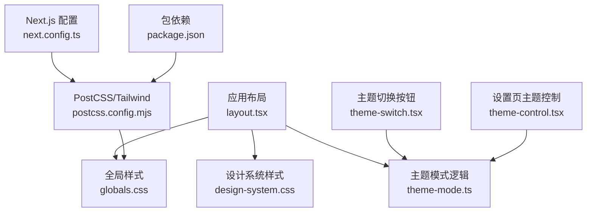
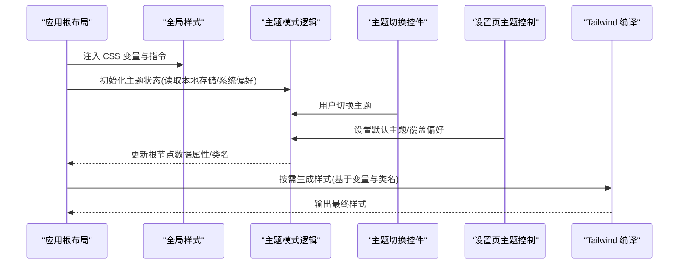
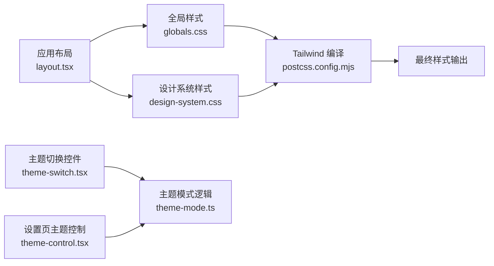

# 样式主题系统

<cite>
**本文档引用的文件**
- [src/app/globals.css](file://src/app/globals.css)
- [src/app/design-system.css](file://src/app/design-system.css)
- [src/lib/theme-mode.ts](file://src/lib/theme-mode.ts)
- [src/components/marketing/theme-switch.tsx](file://src/components/marketing/theme-switch.tsx)
- [src/app/(products)/(app)/settings/theme-control.tsx](file://src/app/(products)/(app)/settings/theme-control.tsx)
- [postcss.config.mjs](file://postcss.config.mjs)
- [next.config.ts](file://next.config.ts)
- [package.json](file://package.json)
- [src/app/providers.tsx](file://src/app/providers.tsx)
- [src/app/layout.tsx](file://src/app/layout.tsx)
</cite>

## 目录
1. [简介](#简介)
2. [项目结构](#项目结构)
3. [核心组件](#核心组件)
4. [架构总览](#架构总览)
5. [详细组件分析](#详细组件分析)
6. [依赖关系分析](#依赖关系分析)
7. [性能考量](#性能考量)
8. [故障排查指南](#故障排查指南)
9. [结论](#结论)
10. [附录](#附录)

## 简介
本文件为 PurpleInK 平台的样式主题系统提供系统化文档，聚焦基于 Tailwind CSS 的样式架构、设计令牌与颜色体系、字体规范、主题切换机制（含暗色模式）、响应式断点管理、样式模块化组织、CSS-in-JS 使用方式、性能优化策略、组件样式封装与继承、冲突解决方案、品牌定制扩展、调试工具、浏览器兼容性与无障碍访问最佳实践。内容面向开发者与设计工程师，兼顾可读性与可执行性。

## 项目结构
样式相关的关键位置与职责如下：
- 全局样式入口：应用级 CSS 变量、基础重置、Tailwind 指令与主题根节点配置
- 设计系统样式：设计令牌、颜色语义、排版与间距等集中定义
- 主题模式逻辑：运行时主题状态、持久化与媒体查询联动
- UI 主题控件：主题切换开关与设置页主题控制面板
- 构建与工具链：PostCSS/Tailwind 配置、Next.js 集成与包依赖

图表来源
- [src/app/layout.tsx](file://src/app/layout.tsx)
- [src/app/globals.css](file://src/app/globals.css)
- [src/app/design-system.css](file://src/app/design-system.css)
- [src/lib/theme-mode.ts](file://src/lib/theme-mode.ts)
- [src/components/marketing/theme-switch.tsx](file://src/components/marketing/theme-switch.tsx)
- [src/app/(products)/(app)/settings/theme-control.tsx](file://src/app/(products)/(app)/settings/theme-control.tsx)
- [postcss.config.mjs](file://postcss.config.mjs)
- [next.config.ts](file://next.config.ts)
- [package.json](file://package.json)

章节来源
- [src/app/globals.css](file://src/app/globals.css)
- [src/app/design-system.css](file://src/app/design-system.css)
- [src/lib/theme-mode.ts](file://src/lib/theme-mode.ts)
- [src/components/marketing/theme-switch.tsx](file://src/components/marketing/theme-switch.tsx)
- [src/app/(products)/(app)/settings/theme-control.tsx](file://src/app/(products)/(app)/settings/theme-control.tsx)
- [postcss.config.mjs](file://postcss.config.mjs)
- [next.config.ts](file://next.config.ts)
- [package.json](file://package.json)

## 核心组件
- 全局样式与主题根节点：在应用根节点注入 CSS 变量，统一颜色、字号、圆角、阴影等设计令牌，并通过 Tailwind 指令启用暗色模式与自定义主题扩展
- 设计系统样式：以语义化命名组织颜色、字体、间距、动效等，确保跨组件一致性
- 主题模式逻辑：维护当前主题状态（亮/暗/跟随系统），处理本地存储持久化与媒体查询监听，暴露统一的 API 供组件消费
- 主题切换控件：提供用户交互入口，触发主题状态变更并同步到持久化层
- 设置页主题控制：在产品设置中提供主题偏好管理界面，支持默认值与回退策略

章节来源
- [src/app/globals.css](file://src/app/globals.css)
- [src/app/design-system.css](file://src/app/design-system.css)
- [src/lib/theme-mode.ts](file://src/lib/theme-mode.ts)
- [src/components/marketing/theme-switch.tsx](file://src/components/marketing/theme-switch.tsx)
- [src/app/(products)/(app)/settings/theme-control.tsx](file://src/app/(products)/(app)/settings/theme-control.tsx)

## 架构总览
下图展示主题系统在 Next.js 应用中的运行流程：布局加载全局样式与设计系统，主题模式逻辑初始化并订阅系统偏好，UI 控件通过逻辑层更新主题状态，Tailwind 根据 CSS 变量与类名生成最终样式。

图表来源
- [src/app/layout.tsx](file://src/app/layout.tsx)
- [src/app/globals.css](file://src/app/globals.css)
- [src/lib/theme-mode.ts](file://src/lib/theme-mode.ts)
- [src/components/marketing/theme-switch.tsx](file://src/components/marketing/theme-switch.tsx)
- [src/app/(products)/(app)/settings/theme-control.tsx](file://src/app/(products)/(app)/settings/theme-control.tsx)
- [postcss.config.mjs](file://postcss.config.mjs)

## 详细组件分析

### 全局样式与主题根节点
- 职责：定义 CSS 变量（颜色、字体、间距、圆角、阴影等），引入 Tailwind 指令，设置根节点的数据属性或类名以驱动暗色模式
- 关键点：
  - 使用语义化变量名（如“主色”“背景”“文本”）便于设计与开发对齐
  - 通过 Tailwind 的暗色模式选择器或数据属性切换主题
  - 将设计令牌集中管理，避免硬编码

章节来源
- [src/app/globals.css](file://src/app/globals.css)

### 设计系统样式
- 职责：沉淀设计令牌与通用样式规则，包括颜色语义、字体族、字号阶梯、行高、间距、边框、阴影、过渡与动画
- 关键点：
  - 使用语义化命名（如“表面”“描边”“强调”）提升可维护性
  - 与 Tailwind 自定义主题扩展结合，形成一致的原子化样式
  - 提供组件基线样式，减少重复代码

章节来源
- [src/app/design-system.css](file://src/app/design-system.css)

### 主题模式逻辑
- 职责：维护主题状态（亮/暗/跟随系统），处理本地存储持久化，监听系统偏好变化，暴露统一 API
- 关键点：
  - 优先读取用户偏好，其次回退到系统偏好，最后使用默认值
  - 通过根节点数据属性或类名驱动 Tailwind 暗色模式
  - 提供订阅/通知机制，确保 UI 即时响应

章节来源
- [src/lib/theme-mode.ts](file://src/lib/theme-mode.ts)

### 主题切换控件
- 职责：提供用户可见的主题切换入口，调用主题模式逻辑更新状态
- 关键点：
  - 无障碍标签与键盘操作支持
  - 切换时触发必要的动画或过渡效果
  - 与设置页保持一致的行为与状态同步

章节来源
- [src/components/marketing/theme-switch.tsx](file://src/components/marketing/theme-switch.tsx)

### 设置页主题控制
- 职责：在产品设置中管理主题偏好，支持默认值、覆盖与恢复
- 关键点：
  - 与主题模式逻辑双向绑定
  - 提供清晰的选项说明与帮助文案
  - 保存后即时生效，必要时提示刷新

章节来源
- [src/app/(products)/(app)/settings/theme-control.tsx](file://src/app/(products)/(app)/settings/theme-control.tsx)

### 构建与工具链
- PostCSS/Tailwind：启用暗色模式、自定义主题扩展、按需生成样式
- Next.js：集成 Tailwind，确保 SSR/CSR 一致的主题渲染
- 包依赖：锁定 Tailwind 版本与插件，保证构建稳定性

章节来源
- [postcss.config.mjs](file://postcss.config.mjs)
- [next.config.ts](file://next.config.ts)
- [package.json](file://package.json)

## 依赖关系分析
主题系统的依赖关系如下：布局加载全局样式与设计系统；主题模式逻辑被 UI 控件与设置页共同依赖；Tailwind 根据 CSS 变量与类名生成样式。

图表来源
- [src/app/layout.tsx](file://src/app/layout.tsx)
- [src/app/globals.css](file://src/app/globals.css)
- [src/app/design-system.css](file://src/app/design-system.css)
- [src/lib/theme-mode.ts](file://src/lib/theme-mode.ts)
- [src/components/marketing/theme-switch.tsx](file://src/components/marketing/theme-switch.tsx)
- [src/app/(products)/(app)/settings/theme-control.tsx](file://src/app/(products)/(app)/settings/theme-control.tsx)
- [postcss.config.mjs](file://postcss.config.mjs)

章节来源
- [src/app/layout.tsx](file://src/app/layout.tsx)
- [src/app/globals.css](file://src/app/globals.css)
- [src/app/design-system.css](file://src/app/design-system.css)
- [src/lib/theme-mode.ts](file://src/lib/theme-mode.ts)
- [src/components/marketing/theme-switch.tsx](file://src/components/marketing/theme-switch.tsx)
- [src/app/(products)/(app)/settings/theme-control.tsx](file://src/app/(products)/(app)/settings/theme-control.tsx)
- [postcss.config.mjs](file://postcss.config.mjs)

## 性能考量
- 按需生成样式：利用 Tailwind 的 Purge 策略，仅包含实际使用的类名，减小 CSS 体积
- 变量与类名分离：CSS 变量用于主题切换，类名用于原子化样式，避免重复计算
- 懒加载与延迟渲染：非关键主题控件可延迟加载，降低首屏负担
- 缓存与持久化：主题偏好写入本地存储，减少重复读取与计算
- 动画与过渡：使用 GPU 加速属性，避免重排重绘

[本节为通用指导，不直接分析具体文件]

## 故障排查指南
- 主题未生效：检查根节点数据属性或类名是否正确设置；确认 Tailwind 暗色模式选择器是否匹配
- 颜色不一致：核对设计系统样式中的语义化变量是否被正确引用；避免硬编码颜色
- 切换闪烁：确保 SSR/CSR 主题状态一致，必要时在服务端预渲染主题
- 构建失败：检查 Tailwind 配置与依赖版本；确认 postcss 插件顺序
- 无障碍问题：为切换控件添加 aria-label 与键盘事件；确保对比度符合 WCAG 标准

章节来源
- [src/lib/theme-mode.ts](file://src/lib/theme-mode.ts)
- [src/components/marketing/theme-switch.tsx](file://src/components/marketing/theme-switch.tsx)
- [src/app/(products)/(app)/settings/theme-control.tsx](file://src/app/(products)/(app)/settings/theme-control.tsx)
- [postcss.config.mjs](file://postcss.config.mjs)

## 结论
PurpleInK 的样式主题系统以 Tailwind CSS 为核心，结合 CSS 变量与设计系统样式，实现了灵活、可扩展且高性能的主题架构。通过主题模式逻辑与 UI 控件的解耦，确保了用户体验的一致性与可维护性。建议持续完善设计令牌、强化无障碍支持与性能监控，以支撑品牌定制与规模化发展。

[本节为总结性内容，不直接分析具体文件]

## 附录
- 主题配置示例（概念性）
  - 定义颜色令牌：主色、辅助色、中性色、语义色（成功、警告、错误）
  - 字体规范：字体族、字号阶梯、行高、字重
  - 间距与圆角：统一间距比例与圆角半径
  - 阴影与动效：层级阴影、过渡时长与缓动函数
- 品牌定制扩展
  - 在 Tailwind 自定义主题中扩展颜色与字体
  - 在设计系统样式中新增语义化变量
  - 通过设置页提供品牌主题切换能力
- 调试工具
  - 浏览器开发者工具查看 CSS 变量与 computed 样式
  - Tailwind 插件可视化类名使用情况
  - 控制台打印主题状态与偏好来源
- 浏览器兼容性
  - 使用现代 CSS 特性时需考虑降级方案
  - 暗色模式在不同浏览器的行为差异测试
- 无障碍访问
  - 遵循 WCAG 对比度与键盘导航要求
  - 为交互控件提供语义化标签与提示

[本节为概念性内容，不直接分析具体文件]