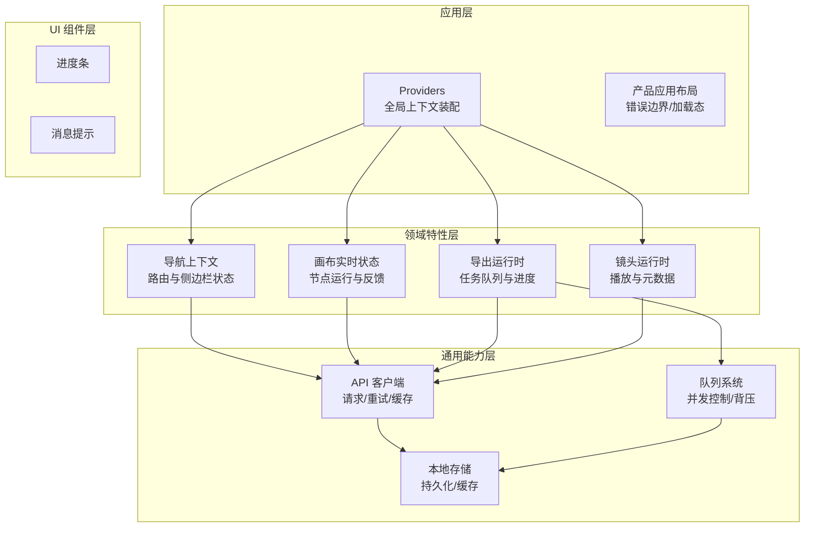
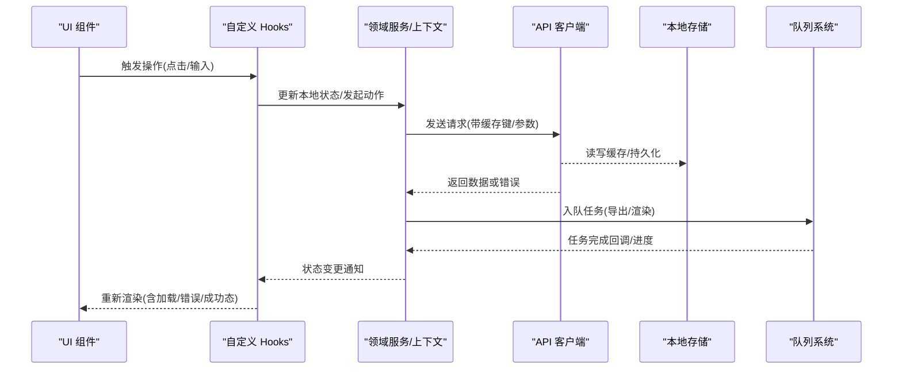
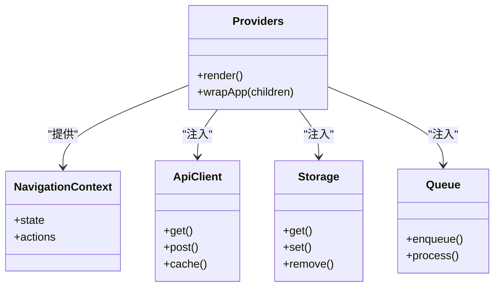
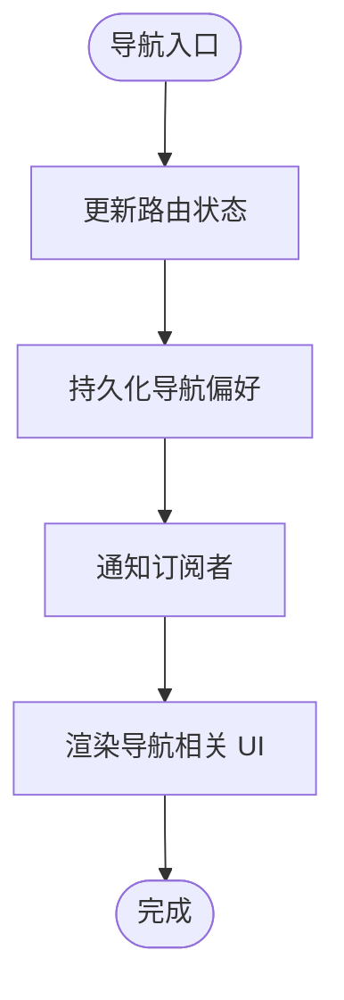
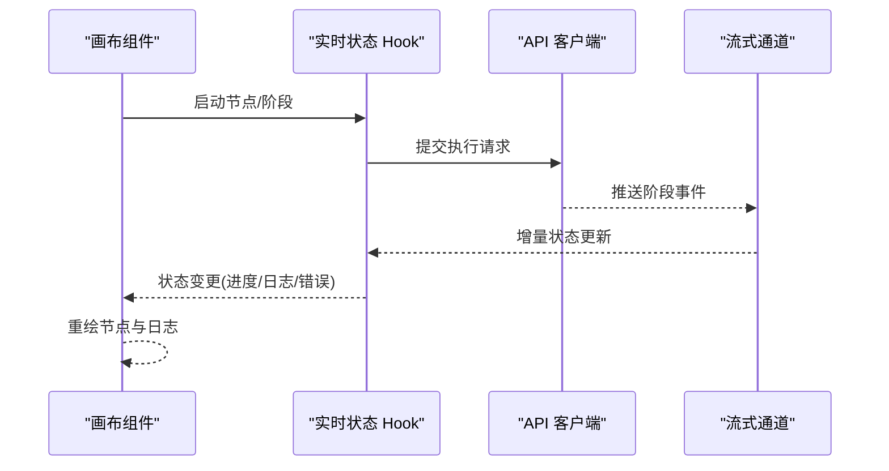
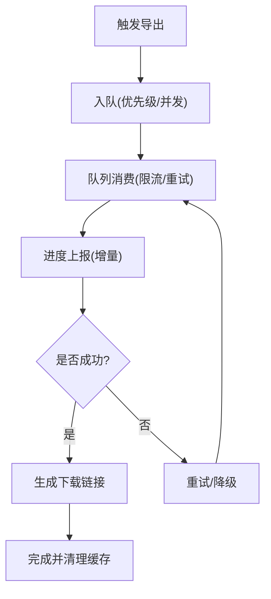
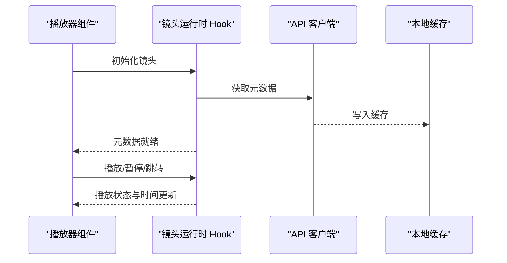
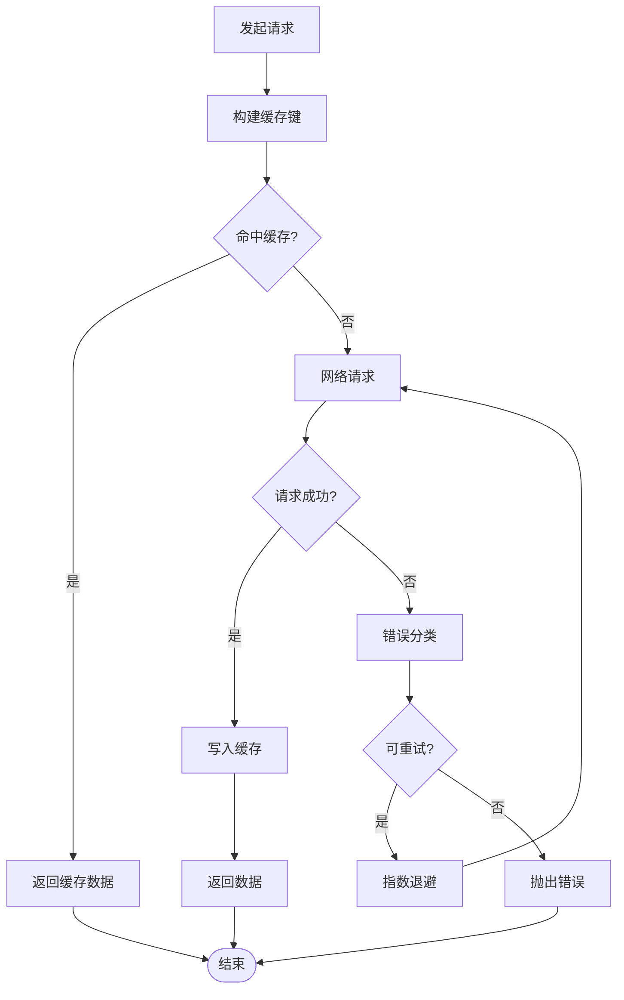
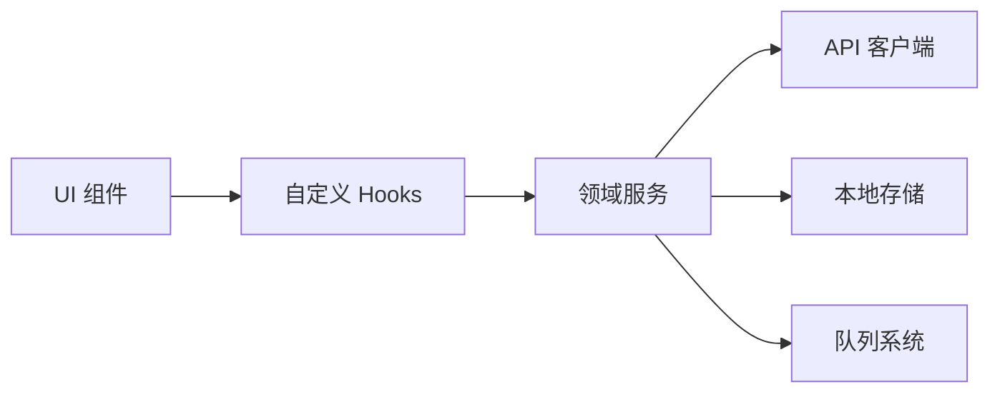
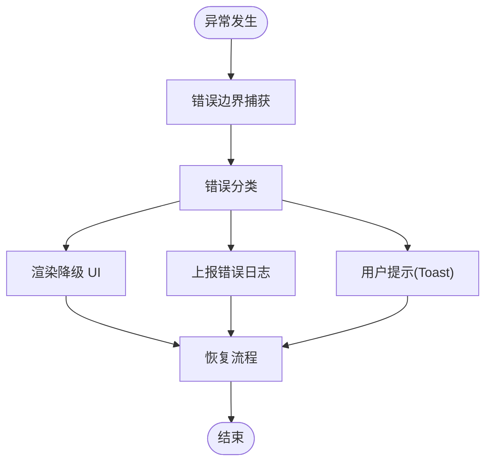

# 状态管理模式

<cite>
**本文档引用的文件**   
- [src/app/providers.tsx](file://src/app/providers.tsx)
- [src/lib/hooks/index.ts](file://src/lib/hooks/index.ts)
- [src/features/navigation/nav-context.tsx](file://src/features/navigation/nav-context.tsx)
- [src/app/products/(app)/canvas/[projectId]/live-status.ts](file://src/app/products/(app)/canvas/[projectId]/live-status.ts)
- [src/app/products/(app)/export/[projectId]/use-export-runtime.ts](file://src/app/products/(app)/export/[projectId]/use-export-runtime.ts)
- [src/app/products/(app)/shots/[shotId]/use-shot-runtime.ts](file://src/app/products/(app)/shots/[shotId]/use-shot-runtime.ts)
- [src/lib/api.ts](file://src/lib/api.ts)
- [src/lib/storage/index.ts](file://src/lib/storage/index.ts)
- [src/lib/queue/index.ts](file://src/lib/queue/index.ts)
- [src/app/global-error.tsx](file://src/app/global-error.tsx)
- [src/app/products/(app)/layout.tsx](file://src/app/products/(app)/layout.tsx)
- [src/app/products/(app)/loading.tsx](file://src/app/products/(app)/loading.tsx)
- [src/components/ui/progress-bar.tsx](file://src/components/ui/progress-bar.tsx)
- [src/components/ui/toast.tsx](file://src/components/ui/toast.tsx)
</cite>

## 目录
1. [简介](#简介)
2. [项目结构](#项目结构)
3. [核心组件](#核心组件)
4. [架构总览](#架构总览)
5. [详细组件分析](#详细组件分析)
6. [依赖关系分析](#依赖关系分析)
7. [性能考量](#性能考量)
8. [故障排查指南](#故障排查指南)
9. [结论](#结论)
10. [附录](#附录)

## 简介
本文件面向 PurpleInk 平台的前端状态管理，系统性阐述基于 React Context 与自定义 Hooks 的状态策略。内容覆盖：
- 全局状态、局部状态与服务器状态的分离设计
- 状态持久化方案、缓存策略与数据同步机制
- 异步状态处理、错误边界与加载状态管理
- 状态调试工具、性能监控与优化技术
- 复杂业务逻辑的状态流转与组件间通信模式
- 与后端 API 的数据同步策略与离线支持实现

## 项目结构
PurpleInk 采用“按功能域 + 分层”的组织方式：
- app 层负责页面路由、布局与 Provider 装配
- features 层按领域划分（导航、画布、导出、镜头等），封装领域状态与行为
- lib 层提供通用能力（API、存储、队列、流式处理等）
- components 层为 UI 原子组件（进度条、Toast、骨架屏等）

**图表来源** 
- [src/app/providers.tsx](file://src/app/providers.tsx)
- [src/features/navigation/nav-context.tsx](file://src/features/navigation/nav-context.tsx)
- [src/app/products/(app)/canvas/[projectId]/live-status.ts](file://src/app/products/(app)/canvas/[projectId]/live-status.ts)
- [src/app/products/(app)/export/[projectId]/use-export-runtime.ts](file://src/app/products/(app)/export/[projectId]/use-export-runtime.ts)
- [src/app/products/(app)/shots/[shotId]/use-shot-runtime.ts](file://src/app/products/(app)/shots/[shotId]/use-shot-runtime.ts)
- [src/lib/api.ts](file://src/lib/api.ts)
- [src/lib/storage/index.ts](file://src/lib/storage/index.ts)
- [src/lib/queue/index.ts](file://src/lib/queue/index.ts)
- [src/components/ui/progress-bar.tsx](file://src/components/ui/progress-bar.tsx)
- [src/components/ui/toast.tsx](file://src/components/ui/toast.tsx)

**章节来源**
- [src/app/providers.tsx](file://src/app/providers.tsx)
- [src/features/navigation/nav-context.tsx](file://src/features/navigation/nav-context.tsx)
- [src/lib/api.ts](file://src/lib/api.ts)
- [src/lib/storage/index.ts](file://src/lib/storage/index.ts)
- [src/lib/queue/index.ts](file://src/lib/queue/index.ts)

## 核心组件
- 全局 Provider 装配：集中挂载 Context，确保跨组件共享状态与副作用的统一生命周期管理
- 导航上下文：维护路由、侧边栏折叠、面板切换等全局导航状态
- 画布实时状态：驱动节点运行、阶段推进、日志流式输出与错误回显
- 导出运行时：编排导出任务、进度跟踪、失败重试与结果下载
- 镜头运行时：管理镜头播放、时间轴、媒体资源与播放状态
- API 客户端：统一网络请求、错误处理、缓存与重试
- 本地存储：键值持久化、缓存过期与版本迁移
- 队列系统：任务入队、并发限制、优先级与背压

**章节来源**
- [src/app/providers.tsx](file://src/app/providers.tsx)
- [src/features/navigation/nav-context.tsx](file://src/features/navigation/nav-context.tsx)
- [src/app/products/(app)/canvas/[projectId]/live-status.ts](file://src/app/products/(app)/canvas/[projectId]/live-status.ts)
- [src/app/products/(app)/export/[projectId]/use-export-runtime.ts](file://src/app/products/(app)/export/[projectId]/use-export-runtime.ts)
- [src/app/products/(app)/shots/[shotId]/use-shot-runtime.ts](file://src/app/products/(app)/shots/[shotId]/use-shot-runtime.ts)
- [src/lib/api.ts](file://src/lib/api.ts)
- [src/lib/storage/index.ts](file://src/lib/storage/index.ts)
- [src/lib/queue/index.ts](file://src/lib/queue/index.ts)

## 架构总览
下图展示从 UI 到领域服务再到基础设施的调用链路与数据流向，强调“状态即单一事实源”的原则。

**图表来源** 
- [src/lib/api.ts](file://src/lib/api.ts)
- [src/lib/storage/index.ts](file://src/lib/storage/index.ts)
- [src/lib/queue/index.ts](file://src/lib/queue/index.ts)
- [src/app/products/(app)/export/[projectId]/use-export-runtime.ts](file://src/app/products/(app)/export/[projectId]/use-export-runtime.ts)
- [src/app/products/(app)/canvas/[projectId]/live-status.ts](file://src/app/products/(app)/canvas/[projectId]/live-status.ts)

## 详细组件分析

### 全局 Provider 与上下文装配
- 职责：集中注册所有 Context，定义默认值，注入 API/存储/队列实例
- 设计要点：
  - 将易变的全局状态（主题、语言、用户信息）放入独立 Context
  - 通过组合多个 Provider 避免“巨型 Context”
  - 在根布局中包裹错误边界与加载态容器

**图表来源** 
- [src/app/providers.tsx](file://src/app/providers.tsx)
- [src/features/navigation/nav-context.tsx](file://src/features/navigation/nav-context.tsx)
- [src/lib/api.ts](file://src/lib/api.ts)
- [src/lib/storage/index.ts](file://src/lib/storage/index.ts)
- [src/lib/queue/index.ts](file://src/lib/queue/index.ts)

**章节来源**
- [src/app/providers.tsx](file://src/app/providers.tsx)
- [src/features/navigation/nav-context.tsx](file://src/features/navigation/nav-context.tsx)

### 导航上下文（路由与侧边栏状态）
- 职责：维护当前路由、侧边栏展开/收起、面板切换、面包屑等
- 状态类型：
  - 全局导航状态（路由、面板）
  - 局部视图状态（搜索、筛选）
- 数据流：
  - 路由变化触发上下文更新
  - 组件订阅上下文并响应式渲染

**图表来源** 
- [src/features/navigation/nav-context.tsx](file://src/features/navigation/nav-context.tsx)

**章节来源**
- [src/features/navigation/nav-context.tsx](file://src/features/navigation/nav-context.tsx)

### 画布实时状态（节点运行与反馈）
- 职责：驱动节点执行、阶段推进、日志流式输出、错误回显
- 关键状态：
  - 节点运行状态（待执行/运行中/成功/失败）
  - 阶段进度与累计耗时
  - 流式日志与错误堆栈
- 数据流：
  - 前端调度节点执行
  - 服务端推送阶段事件
  - 前端合并增量状态并渲染

**图表来源** 
- [src/app/products/(app)/canvas/[projectId]/live-status.ts](file://src/app/products/(app)/canvas/[projectId]/live-status.ts)
- [src/lib/api.ts](file://src/lib/api.ts)

**章节来源**
- [src/app/products/(app)/canvas/[projectId]/live-status.ts](file://src/app/products/(app)/canvas/[projectId]/live-status.ts)

### 导出运行时（任务队列与进度）
- 职责：编排导出任务、进度跟踪、失败重试、结果下载
- 关键状态：
  - 任务列表与状态机（排队/进行中/完成/失败）
  - 进度百分比与剩余时间估算
  - 错误信息与重试次数
- 数据流：
  - 用户触发导出 -> 入队 -> 后台消费 -> 回调更新 -> 下载

**图表来源** 
- [src/app/products/(app)/export/[projectId]/use-export-runtime.ts](file://src/app/products/(app)/export/[projectId]/use-export-runtime.ts)
- [src/lib/queue/index.ts](file://src/lib/queue/index.ts)
- [src/lib/api.ts](file://src/lib/api.ts)

**章节来源**
- [src/app/products/(app)/export/[projectId]/use-export-runtime.ts](file://src/app/products/(app)/export/[projectId]/use-export-runtime.ts)
- [src/lib/queue/index.ts](file://src/lib/queue/index.ts)

### 镜头运行时（播放与元数据）
- 职责：管理镜头播放、时间轴、媒体资源与播放状态
- 关键状态：
  - 播放状态（暂停/播放/缓冲）
  - 当前时间点与时长
  - 字幕/音轨选择
- 数据流：
  - 初始化元数据 -> 预加载媒体 -> 播放控制 -> 事件回调

**图表来源** 
- [src/app/products/(app)/shots/[shotId]/use-shot-runtime.ts](file://src/app/products/(app)/shots/[shotId]/use-shot-runtime.ts)
- [src/lib/api.ts](file://src/lib/api.ts)
- [src/lib/storage/index.ts](file://src/lib/storage/index.ts)

**章节来源**
- [src/app/products/(app)/shots/[shotId]/use-shot-runtime.ts](file://src/app/products/(app)/shots/[shotId]/use-shot-runtime.ts)

### API 客户端（请求/重试/缓存）
- 职责：统一网络请求、错误处理、缓存与重试
- 关键能力：
  - GET/POST 封装
  - 缓存键生成与失效策略
  - 指数退避重试与熔断
  - 错误分类与用户提示

**图表来源** 
- [src/lib/api.ts](file://src/lib/api.ts)
- [src/lib/storage/index.ts](file://src/lib/storage/index.ts)

**章节来源**
- [src/lib/api.ts](file://src/lib/api.ts)
- [src/lib/storage/index.ts](file://src/lib/storage/index.ts)

### 本地存储（持久化/缓存）
- 职责：键值持久化、缓存过期、版本迁移
- 关键能力：
  - 序列化/反序列化
  - TTL 与空间回收
  - 多环境适配（浏览器/Node）

**章节来源**
- [src/lib/storage/index.ts](file://src/lib/storage/index.ts)

### 队列系统（并发控制/背压）
- 职责：任务入队、并发限制、优先级与背压
- 关键能力：
  - 任务描述与回调
  - 并发槽位管理
  - 失败重试与死信队列

**章节来源**
- [src/lib/queue/index.ts](file://src/lib/queue/index.ts)

## 依赖关系分析
- 低耦合高内聚：领域服务仅依赖 API/存储/队列抽象，不直接耦合 UI
- 单向数据流：UI -> Hooks -> 领域服务 -> API/存储/队列 -> 状态更新 -> UI
- 避免循环依赖：通过接口与工厂解耦

**图表来源** 
- [src/app/providers.tsx](file://src/app/providers.tsx)
- [src/lib/api.ts](file://src/lib/api.ts)
- [src/lib/storage/index.ts](file://src/lib/storage/index.ts)
- [src/lib/queue/index.ts](file://src/lib/queue/index.ts)

**章节来源**
- [src/app/providers.tsx](file://src/app/providers.tsx)
- [src/lib/api.ts](file://src/lib/api.ts)
- [src/lib/storage/index.ts](file://src/lib/storage/index.ts)
- [src/lib/queue/index.ts](file://src/lib/queue/index.ts)

## 性能考量
- 状态粒度拆分：避免大对象频繁重渲染，使用选择器与 memo
- 缓存策略：合理设置 TTL、LRU 与内存上限，减少重复请求
- 队列限流：控制并发度，避免阻塞主线程
- 懒加载：按需加载模块与数据，降低首屏压力
- 增量更新：流式事件合并，减少全量刷新

[本节为通用指导，无需特定文件引用]

## 故障排查指南
- 错误边界：捕获渲染异常并提供降级 UI
- 加载状态：区分首次加载、增量加载与骨架屏
- 错误分类：网络错误、业务错误、权限错误分别处理
- 调试工具：打印状态快照、记录请求链路、埋点关键指标

**图表来源** 
- [src/app/global-error.tsx](file://src/app/global-error.tsx)
- [src/app/products/(app)/layout.tsx](file://src/app/products/(app)/layout.tsx)
- [src/app/products/(app)/loading.tsx](file://src/app/products/(app)/loading.tsx)
- [src/components/ui/progress-bar.tsx](file://src/components/ui/progress-bar.tsx)
- [src/components/ui/toast.tsx](file://src/components/ui/toast.tsx)

**章节来源**
- [src/app/global-error.tsx](file://src/app/global-error.tsx)
- [src/app/products/(app)/layout.tsx](file://src/app/products/(app)/layout.tsx)
- [src/app/products/(app)/loading.tsx](file://src/app/products/(app)/loading.tsx)
- [src/components/ui/progress-bar.tsx](file://src/components/ui/progress-bar.tsx)
- [src/components/ui/toast.tsx](file://src/components/ui/toast.tsx)

## 结论
PurpleInk 的状态管理以 React Context 与自定义 Hooks 为核心，结合 API 客户端、本地存储与队列系统，形成清晰的分层与单向数据流。通过合理的缓存与持久化策略、完善的错误边界与加载态管理，以及可观测的调试与性能优化手段，支撑了复杂的业务场景与良好的用户体验。

[本节为总结性内容，无需特定文件引用]

## 附录
- 最佳实践建议：
  - 将易变的全局状态拆分为独立 Context，避免“上帝对象”
  - 使用选择器与 memo 精确订阅，减少不必要的重渲染
  - 对长时任务使用队列与进度回调，提升交互流畅性
  - 对敏感数据做加密与最小权限访问
  - 建立统一的错误码与用户提示规范

[本节为补充说明，无需特定文件引用]