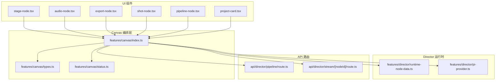
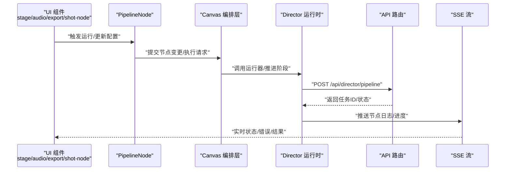
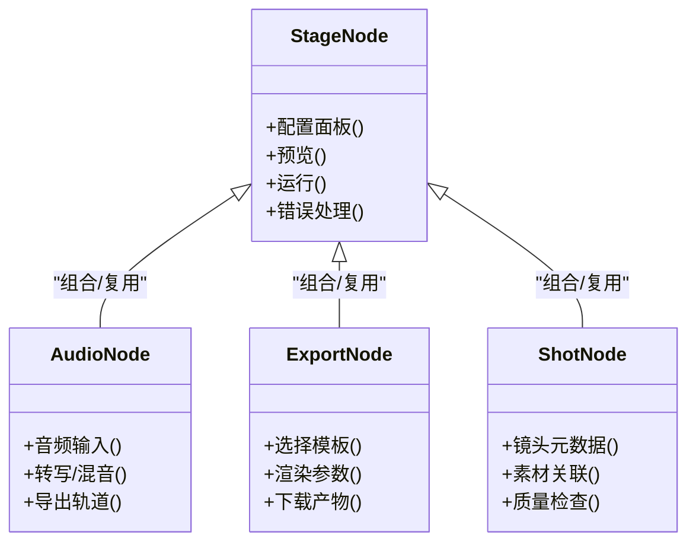
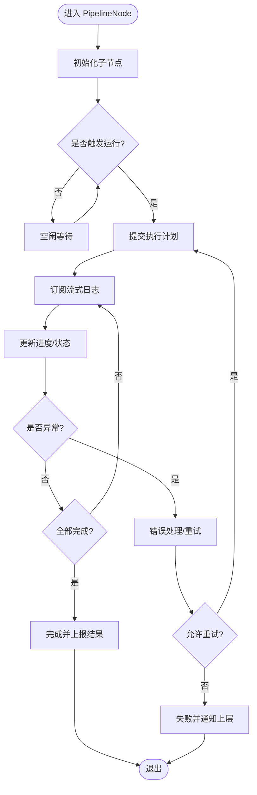
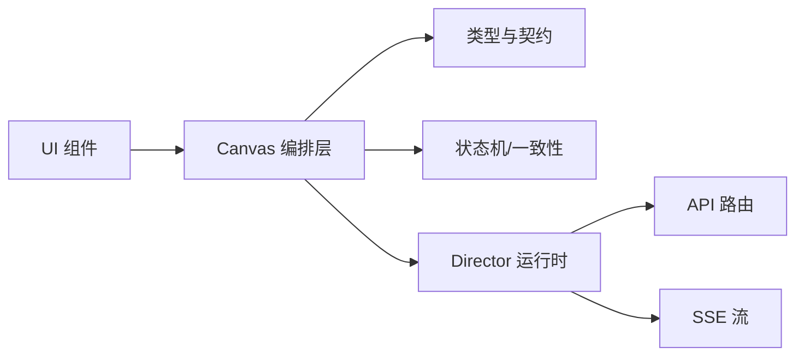
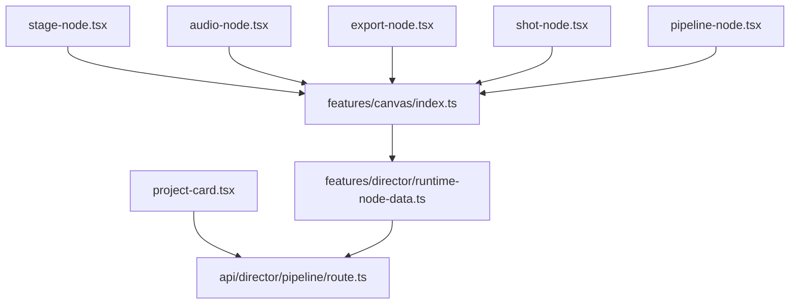

# 业务组件系统

<cite>
**本文引用的文件**   
- [src/components/ui/node/stage-node.tsx](file://src/components/ui/node/stage-node.tsx)
- [src/components/ui/node/audio-node.tsx](file://src/components/ui/node/audio-node.tsx)
- [src/components/ui/node/export-node.tsx](file://src/components/ui/node/export-node.tsx)
- [src/components/ui/node/shot-node.tsx](file://src/components/ui/node/shot-node.tsx)
- [src/components/ui/node/types.ts](file://src/components/ui/node/types.ts)
- [src/components/ui/pipeline-node.tsx](file://src/components/ui/pipeline-node.tsx)
- [src/components/ui/project-card.tsx](file://src/components/ui/project-card.tsx)
- [src/app/products/(app)/canvas/[projectId]/flow-elements.tsx](file://src/app/products/(app)/canvas/[projectId]/flow-elements.tsx)
- [src/app/products/(app)/canvas/[projectId]/live-status.ts](file://src/app/products/(app)/canvas/[projectId]/live-status.ts)
- [src/app/products/(app)/canvas/[projectId]/pipeline-feedback.ts](file://src/app/projects/(app)/canvas/[projectId]/pipeline-feedback.ts)
- [src/features/canvas/index.ts](file://src/features/canvas/index.ts)
- [src/features/canvas/types.ts](file://src/features/canvas/types.ts)
- [src/features/canvas/status.ts](file://src/features/canvas/status.ts)
- [src/features/director/runtime-node-data.ts](file://src/features/director/runtime-node-data.ts)
- [src/features/director/pi-provider.ts](file://src/features/director/pi-provider.ts)
- [src/app/api/director/pipeline/route.ts](file://src/app/api/director/pipeline/route.ts)
- [src/app/api/director/stream/[nodeId]/route.ts](file://src/app/api/director/stream/[nodeId]/route.ts)
</cite>

## 目录
1. [引言](#引言)
2. [项目结构](#项目结构)
3. [核心组件](#核心组件)
4. [架构总览](#架构总览)
5. [详细组件分析](#详细组件分析)
6. [依赖关系分析](#依赖关系分析)
7. [性能考量](#性能考量)
8. [故障排查指南](#故障排查指南)
9. [结论](#结论)
10. [附录：使用示例与集成指南](#附录使用示例与集成指南)

## 引言
本文件面向 PurpleInk 平台的“业务组件系统”，聚焦于面向特定业务场景的可视化编排与执行能力，包括节点组件（Node）、管道节点（PipelineNode）、项目卡片（ProjectCard）等。文档将深入解释这些组件如何封装复杂的业务逻辑和用户交互模式，涵盖状态管理、数据绑定、与 API 的集成方式，以及配置选项、事件回调和自定义扩展点，并提供实际使用场景的代码示例路径与集成指南。

## 项目结构
PurpleInk 的前端采用 Next.js App Router，业务组件主要位于 src/components/ui 与 src/app/products/(app)/canvas 下；Canvas 编排层与运行时在 src/features/canvas 与 src/features/director 中实现；API 路由位于 src/app/api。

图表来源
- [src/components/ui/node/stage-node.tsx](file://src/components/ui/node/stage-node.tsx)
- [src/components/ui/node/audio-node.tsx](file://src/components/ui/node/audio-node.tsx)
- [src/components/ui/node/export-node.tsx](file://src/components/ui/node/export-node.tsx)
- [src/components/ui/node/shot-node.tsx](file://src/components/ui/node/shot-node.tsx)
- [src/components/ui/pipeline-node.tsx](file://src/components/ui/pipeline-node.tsx)
- [src/components/ui/project-card.tsx](file://src/components/ui/project-card.tsx)
- [src/features/canvas/index.ts](file://src/features/canvas/index.ts)
- [src/features/canvas/types.ts](file://src/features/canvas/types.ts)
- [src/features/canvas/status.ts](file://src/features/canvas/status.ts)
- [src/features/director/runtime-node-data.ts](file://src/features/director/runtime-node-data.ts)
- [src/features/director/pi-provider.ts](file://src/features/director/pi-provider.ts)
- [src/app/api/director/pipeline/route.ts](file://src/app/api/director/pipeline/route.ts)
- [src/app/api/director/stream/[nodeId]/route.ts](file://src/app/api/director/stream/[nodeId]/route.ts)

章节来源
- [src/components/ui/node/stage-node.tsx](file://src/components/ui/node/stage-node.tsx)
- [src/components/ui/node/audio-node.tsx](file://src/components/ui/node/audio-node.tsx)
- [src/components/ui/node/export-node.tsx](file://src/components/ui/node/export-node.tsx)
- [src/components/ui/node/shot-node.tsx](file://src/components/ui/node/shot-node.tsx)
- [src/components/ui/pipeline-node.tsx](file://src/components/ui/pipeline-node.tsx)
- [src/components/ui/project-card.tsx](file://src/components/ui/project-card.tsx)
- [src/features/canvas/index.ts](file://src/features/canvas/index.ts)
- [src/features/canvas/types.ts](file://src/features/canvas/types.ts)
- [src/features/canvas/status.ts](file://src/features/canvas/status.ts)
- [src/features/director/runtime-node-data.ts](file://src/features/director/runtime-node-data.ts)
- [src/features/director/pi-provider.ts](file://src/features/director/pi-provider.ts)
- [src/app/api/director/pipeline/route.ts](file://src/app/api/director/pipeline/route.ts)
- [src/app/api/director/stream/[nodeId]/route.ts](file://src/app/api/director/stream/[nodeId]/route.ts)

## 核心组件
- 节点组件（Node）
  - stage-node.tsx：舞台节点，承载分镜/阶段类任务，支持输入输出连接与运行状态展示。
  - audio-node.tsx：音频节点，处理音频采集、转写、混音等流程。
  - export-node.tsx：导出节点，负责渲染产物导出与下载。
  - shot-node.tsx：镜头节点，表示具体镜头的生产管线步骤。
- 管道节点（PipelineNode）
  - pipeline-node.tsx：通用管道节点容器，封装节点生命周期、错误边界与进度反馈。
- 项目卡片（ProjectCard）
  - project-card.tsx：项目概览卡片，聚合项目关键指标与快捷操作入口。

章节来源
- [src/components/ui/node/stage-node.tsx](file://src/components/ui/node/stage-node.tsx)
- [src/components/ui/node/audio-node.tsx](file://src/components/ui/node/audio-node.tsx)
- [src/components/ui/node/export-node.tsx](file://src/components/ui/node/export-node.tsx)
- [src/components/ui/node/shot-node.tsx](file://src/components/ui/node/shot-node.tsx)
- [src/components/ui/pipeline-node.tsx](file://src/components/ui/pipeline-node.tsx)
- [src/components/ui/project-card.tsx](file://src/components/ui/project-card.tsx)

## 架构总览
业务组件通过 Canvas 编排层组织节点图，借助 Director 运行时驱动执行，并通过 API 路由进行远程调度与流式日志回传。

图表来源
- [src/components/ui/node/stage-node.tsx](file://src/components/ui/node/stage-node.tsx)
- [src/components/ui/node/audio-node.tsx](file://src/components/ui/node/audio-node.tsx)
- [src/components/ui/node/export-node.tsx](file://src/components/ui/node/export-node.tsx)
- [src/components/ui/node/shot-node.tsx](file://src/components/ui/node/shot-node.tsx)
- [src/components/ui/pipeline-node.tsx](file://src/components/ui/pipeline-node.tsx)
- [src/features/canvas/index.ts](file://src/features/canvas/index.ts)
- [src/features/director/runtime-node-data.ts](file://src/features/director/runtime-node-data.ts)
- [src/app/api/director/pipeline/route.ts](file://src/app/api/director/pipeline/route.ts)
- [src/app/api/director/stream/[nodeId]/route.ts](file://src/app/api/director/stream/[nodeId]/route.ts)

## 详细组件分析

### 节点组件族（Stage/Audio/Export/Shot）
- 职责与交互
  - 统一暴露配置面板、预览区域、运行按钮、错误提示与结果展示。
  - 通过 Canvas 编排层维护连接关系与拓扑校验。
  - 与 Director 运行时协作，获取执行状态与日志。
- 状态管理
  - 本地状态：配置项、选中态、错误信息。
  - 远端状态：运行进度、阶段状态、产物链接。
  - 同步策略：增量更新 + 事件订阅（SSE）。
- 数据绑定
  - 受控组件模式：props 驱动渲染，onChange 回调更新父级状态。
  - 类型约束：基于 types.ts 定义的数据模型。
- 与 API 集成
  - 启动/暂停/重试：调用 /api/director/pipeline。
  - 日志/进度：订阅 /api/director/stream/[nodeId]。
- 配置选项与扩展点
  - 每个节点提供可插拔的配置表单字段。
  - 支持自定义验证规则与默认值。
  - 可通过 Hook 或 Provider 注入外部服务。

图表来源
- [src/components/ui/node/stage-node.tsx](file://src/components/ui/node/stage-node.tsx)
- [src/components/ui/node/audio-node.tsx](file://src/components/ui/node/audio-node.tsx)
- [src/components/ui/node/export-node.tsx](file://src/components/ui/node/export-node.tsx)
- [src/components/ui/node/shot-node.tsx](file://src/components/ui/node/shot-node.tsx)

章节来源
- [src/components/ui/node/stage-node.tsx](file://src/components/ui/node/stage-node.tsx)
- [src/components/ui/node/audio-node.tsx](file://src/components/ui/node/audio-node.tsx)
- [src/components/ui/node/export-node.tsx](file://src/components/ui/node/export-node.tsx)
- [src/components/ui/node/shot-node.tsx](file://src/components/ui/node/shot-node.tsx)
- [src/components/ui/node/types.ts](file://src/components/ui/node/types.ts)

### 管道节点（PipelineNode）
- 职责
  - 作为节点容器，统一管理生命周期（初始化、运行、暂停、恢复、销毁）。
  - 提供错误边界与重试机制。
  - 聚合子节点的进度与状态，向上汇报。
- 状态管理
  - 内部维护运行态、错误码、进度百分比。
  - 与 Canvas 状态同步，避免不一致。
- 事件回调
  - onRun/onPause/onResume/onError/onComplete。
  - 支持自定义中间件钩子（如埋点、审计）。
- 与 API 集成
  - 批量提交节点执行计划。
  - 订阅流式日志并映射到 UI。

图表来源
- [src/components/ui/pipeline-node.tsx](file://src/components/ui/pipeline-node.tsx)
- [src/features/canvas/index.ts](file://src/features/canvas/index.ts)
- [src/app/api/director/pipeline/route.ts](file://src/app/api/director/pipeline/route.ts)
- [src/app/api/director/stream/[nodeId]/route.ts](file://src/app/api/director/stream/[nodeId]/route.ts)

章节来源
- [src/components/ui/pipeline-node.tsx](file://src/components/ui/pipeline-node.tsx)
- [src/features/canvas/index.ts](file://src/features/canvas/index.ts)
- [src/app/api/director/pipeline/route.ts](file://src/app/api/director/pipeline/route.ts)
- [src/app/api/director/stream/[nodeId]/route.ts](file://src/app/api/director/stream/[nodeId]/route.ts)

### 项目卡片（ProjectCard）
- 职责
  - 展示项目摘要（名称、状态、最近更新时间、关键指标）。
  - 提供快捷操作（打开画布、导出、设置）。
- 数据绑定
  - 从项目列表或详情接口拉取数据，映射为只读视图。
  - 支持局部刷新与缓存。
- 事件回调
  - onClick、onOpenSettings、onExport 等。
- 与 API 集成
  - 读取项目元数据与统计信息。
  - 触发导出或跳转至对应页面。

章节来源
- [src/components/ui/project-card.tsx](file://src/components/ui/project-card.tsx)

### Canvas 编排层与运行时
- Canvas 编排层
  - 维护节点图、连接关系、布局与拓扑校验。
  - 提供查询与变更 API，供 UI 组件调用。
- Director 运行时
  - 解析执行计划，调度阶段执行。
  - 维护节点运行数据与产物读写。
  - 与 API 路由协作，持久化状态与日志。

图表来源
- [src/features/canvas/index.ts](file://src/features/canvas/index.ts)
- [src/features/canvas/types.ts](file://src/features/canvas/types.ts)
- [src/features/canvas/status.ts](file://src/features/canvas/status.ts)
- [src/features/director/runtime-node-data.ts](file://src/features/director/runtime-node-data.ts)
- [src/features/director/pi-provider.ts](file://src/features/director/pi-provider.ts)
- [src/app/api/director/pipeline/route.ts](file://src/app/api/director/pipeline/route.ts)
- [src/app/api/director/stream/[nodeId]/route.ts](file://src/app/api/director/stream/[nodeId]/route.ts)

章节来源
- [src/features/canvas/index.ts](file://src/features/canvas/index.ts)
- [src/features/canvas/types.ts](file://src/features/canvas/types.ts)
- [src/features/canvas/status.ts](file://src/features/canvas/status.ts)
- [src/features/director/runtime-node-data.ts](file://src/features/director/runtime-node-data.ts)
- [src/features/director/pi-provider.ts](file://src/features/director/pi-provider.ts)
- [src/app/api/director/pipeline/route.ts](file://src/app/api/director/pipeline/route.ts)
- [src/app/api/director/stream/[nodeId]/route.ts](file://src/app/api/director/stream/[nodeId]/route.ts)

## 依赖关系分析
- 组件耦合
  - 节点组件强依赖 Canvas 编排层提供的查询/变更接口。
  - PipelineNode 聚合多个节点，向上暴露统一生命周期。
  - ProjectCard 仅依赖项目数据源，低耦合。
- 外部依赖
  - API 路由提供执行与流式日志能力。
  - SSE 用于实时状态推送。
- 潜在循环依赖
  - 通过类型契约与分层隔离避免循环引用。

图表来源
- [src/components/ui/node/stage-node.tsx](file://src/components/ui/node/stage-node.tsx)
- [src/components/ui/node/audio-node.tsx](file://src/components/ui/node/audio-node.tsx)
- [src/components/ui/node/export-node.tsx](file://src/components/ui/node/export-node.tsx)
- [src/components/ui/node/shot-node.tsx](file://src/components/ui/node/shot-node.tsx)
- [src/components/ui/pipeline-node.tsx](file://src/components/ui/pipeline-node.tsx)
- [src/components/ui/project-card.tsx](file://src/components/ui/project-card.tsx)
- [src/features/canvas/index.ts](file://src/features/canvas/index.ts)
- [src/features/director/runtime-node-data.ts](file://src/features/director/runtime-node-data.ts)
- [src/app/api/director/pipeline/route.ts](file://src/app/api/director/pipeline/route.ts)

章节来源
- [src/components/ui/node/stage-node.tsx](file://src/components/ui/node/stage-node.tsx)
- [src/components/ui/node/audio-node.tsx](file://src/components/ui/node/audio-node.tsx)
- [src/components/ui/node/export-node.tsx](file://src/components/ui/node/export-node.tsx)
- [src/components/ui/node/shot-node.tsx](file://src/components/ui/node/shot-node.tsx)
- [src/components/ui/pipeline-node.tsx](file://src/components/ui/pipeline-node.tsx)
- [src/components/ui/project-card.tsx](file://src/components/ui/project-card.tsx)
- [src/features/canvas/index.ts](file://src/features/canvas/index.ts)
- [src/features/director/runtime-node-data.ts](file://src/features/director/runtime-node-data.ts)
- [src/app/api/director/pipeline/route.ts](file://src/app/api/director/pipeline/route.ts)

## 性能考量
- 渲染优化
  - 节点组件按需渲染，避免整图重绘。
  - 使用受控组件最小化 re-render 范围。
- 网络优化
  - 批量提交执行计划，减少请求次数。
  - SSE 增量推送，避免轮询开销。
- 内存与稳定性
  - 错误边界与重试限制，防止雪崩。
  - 大产物导出采用分片与后台任务。

[本节为通用指导，不直接分析具体文件]

## 故障排查指南
- 常见问题
  - 节点运行失败：检查配置合法性、上游依赖是否就绪、API 返回码。
  - 日志不更新：确认 SSE 连接是否正常、节点 ID 是否正确。
  - 状态不一致：查看 Canvas 状态快照与后端持久化差异。
- 定位手段
  - 启用调试日志与埋点。
  - 使用浏览器开发者工具观察网络与事件流。
  - 通过 API 路由与流式端点回放问题。

章节来源
- [src/app/api/director/pipeline/route.ts](file://src/app/api/director/pipeline/route.ts)
- [src/app/api/director/stream/[nodeId]/route.ts](file://src/app/api/director/stream/[nodeId]/route.ts)

## 结论
PurpleInk 的业务组件系统以 Canvas 编排层为核心，结合 Director 运行时与 API 路由，实现了节点化、可编排、可观测的生产管线。节点组件封装了丰富的业务逻辑与交互模式，PipelineNode 提供统一的执行生命周期管理，ProjectCard 则提供项目层面的概览与快捷操作。通过类型契约、状态机与 SSE 流，系统在可扩展性、一致性与实时性方面具备良好表现。

[本节为总结，不直接分析具体文件]

## 附录：使用示例与集成指南
- 在画布中使用节点
  - 引入节点组件并挂载到 flow-elements.tsx 的节点注册表中。
  - 通过 Canvas 编排层的 API 创建节点实例、建立连接、触发运行。
- 订阅运行状态
  - 使用 live-status.ts 中的订阅方法监听节点状态变化。
  - 在 pipeline-feedback.ts 中展示进度与错误信息。
- 与 API 集成
  - 调用 /api/director/pipeline 提交执行计划。
  - 订阅 /api/director/stream/[nodeId] 获取实时日志。

章节来源
- [src/app/products/(app)/canvas/[projectId]/flow-elements.tsx](file://src/app/products/(app)/canvas/[projectId]/flow-elements.tsx)
- [src/app/products/(app)/canvas/[projectId]/live-status.ts](file://src/app/products/(app)/canvas/[projectId]/live-status.ts)
- [src/app/products/(app)/canvas/[projectId]/pipeline-feedback.ts](file://src/app/products/(app)/canvas/[projectId]/pipeline-feedback.ts)
- [src/app/api/director/pipeline/route.ts](file://src/app/api/director/pipeline/route.ts)
- [src/app/api/director/stream/[nodeId]/route.ts](file://src/app/api/director/stream/[nodeId]/route.ts)