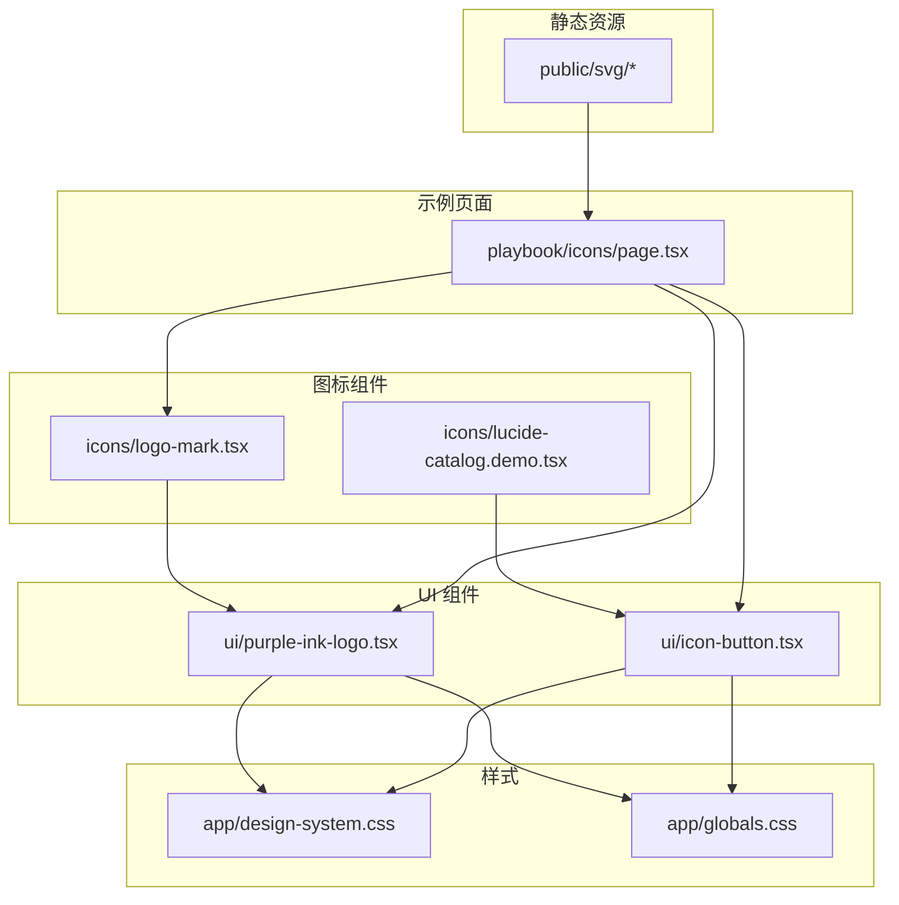
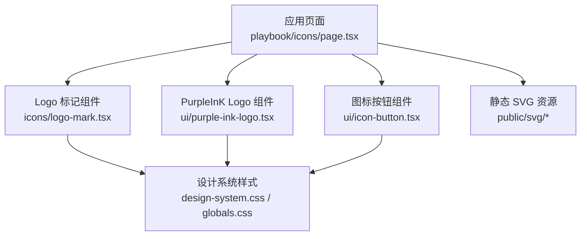
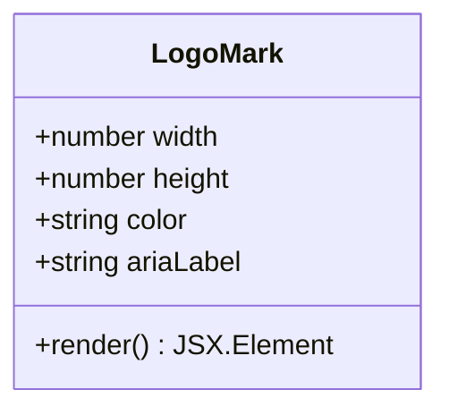
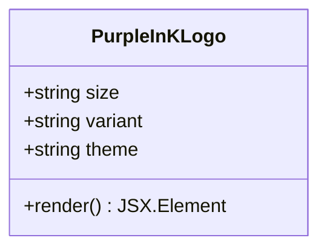
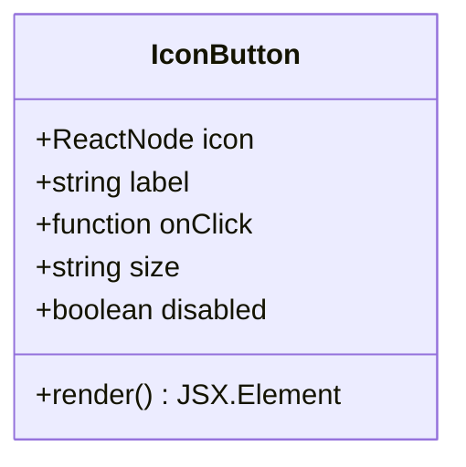
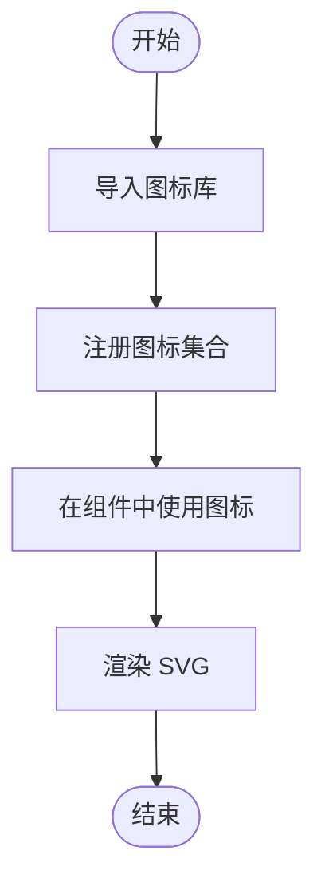
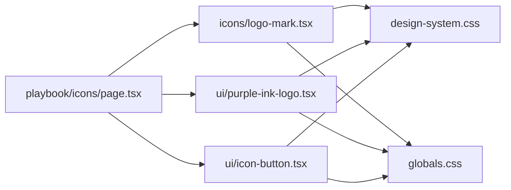

# 图标系统

<cite>
**本文引用的文件**   
- [logo-mark.tsx](file://src/components/icons/logo-mark.tsx)
- [logo-mark.demo.tsx](file://src/components/icons/logo-mark.demo.tsx)
- [lucide-catalog.demo.tsx](file://src/components/icons/lucide-catalog.demo.tsx)
- [purple-ink-logo.tsx](file://src/components/ui/purple-ink-logo.tsx)
- [purple-ink-logo.demo.tsx](file://src/components/ui/purple-ink-logo.demo.tsx)
- [icon-button.tsx](file://src/components/ui/icon-button.tsx)
- [design-system.css](file://src/app/design-system.css)
- [globals.css](file://src/app/globals.css)
- [playbook/icons/page.tsx](file://src/app/playbook/icons/page.tsx)
</cite>

## 目录
1. [简介](#简介)
2. [项目结构](#项目结构)
3. [核心组件](#核心组件)
4. [架构总览](#架构总览)
5. [详细组件分析](#详细组件分析)
6. [依赖关系分析](#依赖关系分析)
7. [性能考虑](#性能考虑)
8. [故障排查指南](#故障排查指南)
9. [结论](#结论)
10. [附录](#附录)

## 简介
本文件为 PurpleInK 平台的图标系统提供完整文档，涵盖图标的组织结构、命名规范与导入方式；深入解析 Logo 组件与其他品牌图标的实现细节；说明图标的大小变体、颜色主题与 SVG 优化策略；并提供使用示例、自定义图标添加方法与性能优化技巧，确保在不同设备与分辨率下保持一致的显示效果。

## 项目结构
图标相关代码主要分布在以下位置：
- src/components/icons：Logo 与图标目录（如 logo-mark、Lucide 图标目录演示）
- src/components/ui：通用 UI 组件（包含 purple-ink-logo 与 icon-button）
- src/app/playbook/icons：图标使用示例页面
- public/svg：静态 SVG 资源目录（可用于存放外部或第三方 SVG）
- src/app/design-system.css / src/app/globals.css：全局样式与主题变量（影响图标颜色与尺寸）

图表来源 
- [logo-mark.tsx](file://src/components/icons/logo-mark.tsx)
- [lucide-catalog.demo.tsx](file://src/components/icons/lucide-catalog.demo.tsx)
- [purple-ink-logo.tsx](file://src/components/ui/purple-ink-logo.tsx)
- [icon-button.tsx](file://src/components/ui/icon-button.tsx)
- [playbook/icons/page.tsx](file://src/app/playbook/icons/page.tsx)
- [design-system.css](file://src/app/design-system.css)
- [globals.css](file://src/app/globals.css)

章节来源
- [logo-mark.tsx](file://src/components/icons/logo-mark.tsx)
- [purple-ink-logo.tsx](file://src/components/ui/purple-ink-logo.tsx)
- [icon-button.tsx](file://src/components/ui/icon-button.tsx)
- [playbook/icons/page.tsx](file://src/app/playbook/icons/page.tsx)
- [design-system.css](file://src/app/design-system.css)
- [globals.css](file://src/app/globals.css)

## 核心组件
- Logo 标记组件（logo-mark）：用于展示品牌标识的核心图形，通常以 SVG 形式内联渲染，支持尺寸与颜色控制。
- PurpleInK Logo 组件（purple-ink-logo）：封装完整的品牌 Logo，常用于头部导航、页脚等品牌曝光区域。
- 图标按钮（icon-button）：将任意图标作为按钮内容，统一交互与可访问性处理。
- Lucide 图标目录演示（lucide-catalog.demo）：展示如何引入与使用第三方图标库（如 Lucide）。

章节来源
- [logo-mark.tsx](file://src/components/icons/logo-mark.tsx)
- [purple-ink-logo.tsx](file://src/components/ui/purple-ink-logo.tsx)
- [icon-button.tsx](file://src/components/ui/icon-button.tsx)
- [lucide-catalog.demo.tsx](file://src/components/icons/lucide-catalog.demo.tsx)

## 架构总览
图标系统的整体架构遵循“组件化 + 主题化”的设计：
- 组件层：Logo 与图标组件以 React 组件形式存在，便于复用与组合。
- 样式层：通过 CSS 变量与全局样式控制颜色、尺寸与响应式表现。
- 资源层：SVG 资源以内联或静态文件形式加载，避免额外请求开销。
- 示例层：Playbook 页面集中展示图标的使用方式与最佳实践。

图表来源 
- [playbook/icons/page.tsx](file://src/app/playbook/icons/page.tsx)
- [logo-mark.tsx](file://src/components/icons/logo-mark.tsx)
- [purple-ink-logo.tsx](file://src/components/ui/purple-ink-logo.tsx)
- [icon-button.tsx](file://src/components/ui/icon-button.tsx)
- [design-system.css](file://src/app/design-system.css)
- [globals.css](file://src/app/globals.css)

## 详细组件分析

### Logo 标记组件（logo-mark）
- 职责：渲染品牌核心图形，支持尺寸与颜色参数，适配不同布局场景。
- 数据模型：通常接受 width/height、color、aria-label 等属性，内部以 SVG 元素绘制。
- 复杂度：O(1)，仅渲染固定路径与形状。
- 依赖链：无外部运行时依赖，样式来自设计系统。
- 错误处理：对缺失属性进行默认值处理，保证降级渲染。
- 性能：内联 SVG，避免网络请求；建议启用 viewBox 与 preserveAspectRatio 保证缩放质量。

图表来源 
- [logo-mark.tsx](file://src/components/icons/logo-mark.tsx)

章节来源
- [logo-mark.tsx](file://src/components/icons/logo-mark.tsx)
- [logo-mark.demo.tsx](file://src/components/icons/logo-mark.demo.tsx)

### PurpleInK Logo 组件（purple-ink-logo）
- 职责：封装完整品牌 Logo，常用于头部、登录页等关键位置。
- 数据模型：支持 size（小/中/大）、variant（单色/双色）、theme（亮/暗）等属性。
- 复杂度：O(1)，根据属性选择不同 SVG 片段或样式类。
- 依赖链：依赖设计系统颜色变量与尺寸 token。
- 错误处理：当 theme 或 variant 不匹配时回退到默认样式。
- 性能：按需切换 SVG 片段，避免冗余 DOM。

图表来源 
- [purple-ink-logo.tsx](file://src/components/ui/purple-ink-logo.tsx)

章节来源
- [purple-ink-logo.tsx](file://src/components/ui/purple-ink-logo.tsx)
- [purple-ink-logo.demo.tsx](file://src/components/ui/purple-ink-logo.demo.tsx)

### 图标按钮（icon-button）
- 职责：将图标作为按钮内容，统一焦点管理、键盘事件与可访问性标签。
- 数据模型：接受 icon（ReactNode）、label、onClick、size、disabled 等属性。
- 复杂度：O(1)，包装子节点并注入事件处理器。
- 依赖链：依赖设计系统样式与主题变量。
- 错误处理：未提供 label 时使用 aria-hidden 与 title 提示。
- 性能：避免重复创建事件处理器，建议使用 useMemo。

图表来源 
- [icon-button.tsx](file://src/components/ui/icon-button.tsx)

章节来源
- [icon-button.tsx](file://src/components/ui/icon-button.tsx)

### Lucide 图标目录演示（lucide-catalog.demo）
- 职责：展示如何引入与使用第三方图标库（如 Lucide），包括批量注册与按需使用。
- 数据模型：通过图标名称映射到对应组件，支持 size/color 配置。
- 复杂度：O(n) 初始化注册，渲染 O(1)。
- 依赖链：依赖 lucide-react 或其他图标库。
- 错误处理：未知图标名时返回占位符或警告。
- 性能：按需导入减少包体积，避免全量引入。

图表来源 
- [lucide-catalog.demo.tsx](file://src/components/icons/lucide-catalog.demo.tsx)

章节来源
- [lucide-catalog.demo.tsx](file://src/components/icons/lucide-catalog.demo.tsx)

## 依赖关系分析
图标组件之间的依赖关系如下：
- playbook/icons/page.tsx 作为示例入口，引用 logo-mark、purple-ink-logo、icon-button 等组件。
- logo-mark 与 purple-ink-logo 依赖 design-system.css 与 globals.css 中的颜色与尺寸变量。
- icon-button 依赖设计系统样式与主题变量，确保一致的视觉风格。

图表来源 
- [playbook/icons/page.tsx](file://src/app/playbook/icons/page.tsx)
- [logo-mark.tsx](file://src/components/icons/logo-mark.tsx)
- [purple-ink-logo.tsx](file://src/components/ui/purple-ink-logo.tsx)
- [icon-button.tsx](file://src/components/ui/icon-button.tsx)
- [design-system.css](file://src/app/design-system.css)
- [globals.css](file://src/app/globals.css)

章节来源
- [playbook/icons/page.tsx](file://src/app/playbook/icons/page.tsx)
- [design-system.css](file://src/app/design-system.css)
- [globals.css](file://src/app/globals.css)

## 性能考虑
- 内联 SVG：优先使用内联 SVG 以减少 HTTP 请求，提升首屏渲染速度。
- 按需导入：对于第三方图标库（如 Lucide），采用按需导入避免打包过大。
- 缓存策略：静态 SVG 资源可使用浏览器缓存与 CDN 加速。
- 尺寸与缩放：设置合理的 viewBox 与 preserveAspectRatio，确保在不同分辨率下的清晰度。
- 主题切换：通过 CSS 变量控制颜色，避免重新渲染整个 SVG。
- 懒加载：非首屏图标可采用懒加载或 IntersectionObserver 延迟渲染。

[本节为通用指导，无需特定文件来源]

## 故障排查指南
- 图标颜色异常：检查 design-system.css 与 globals.css 中的颜色变量是否正确覆盖。
- 尺寸不一致：确认组件传入的 width/height 与父容器约束是否冲突。
- 第三方图标无法显示：核对图标名称与注册表是否一致，检查导入路径。
- 可访问性问题：确保所有图标按钮具备合适的 aria-label 或 title。
- 性能问题：使用浏览器开发者工具检查重绘与回流，优化不必要的状态更新。

章节来源
- [design-system.css](file://src/app/design-system.css)
- [globals.css](file://src/app/globals.css)
- [icon-button.tsx](file://src/components/ui/icon-button.tsx)

## 结论
PurpleInK 的图标系统以组件化为核心，结合主题化样式与内联 SVG 策略，实现了高复用性与高性能。通过统一的命名规范与导入方式，开发者可以快速集成与扩展图标资源。建议在新增图标时遵循现有模式，确保视觉一致性与性能最优。

[本节为总结，无需特定文件来源]

## 附录
- 命名规范：图标组件以功能命名（如 logo-mark、purple-ink-logo），演示文件以 .demo.tsx 结尾。
- 导入方式：从 components/icons 与 components/ui 目录直接导入组件，或使用 Playbook 页面作为参考。
- 自定义图标：将新 SVG 放入 public/svg，并在组件中通过相对路径引用，或通过内联方式嵌入。
- 大小变体：通过 size 属性（小/中/大）控制图标尺寸，配合 CSS 变量实现响应式。
- 颜色主题：通过 theme 属性（亮/暗）与 CSS 变量切换颜色，确保对比度符合无障碍标准。
- 设备适配：使用 viewBox 与媒体查询确保在不同屏幕密度下的清晰度与布局稳定性。

[本节为补充信息，无需特定文件来源]