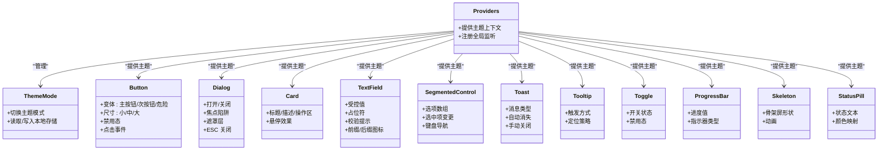
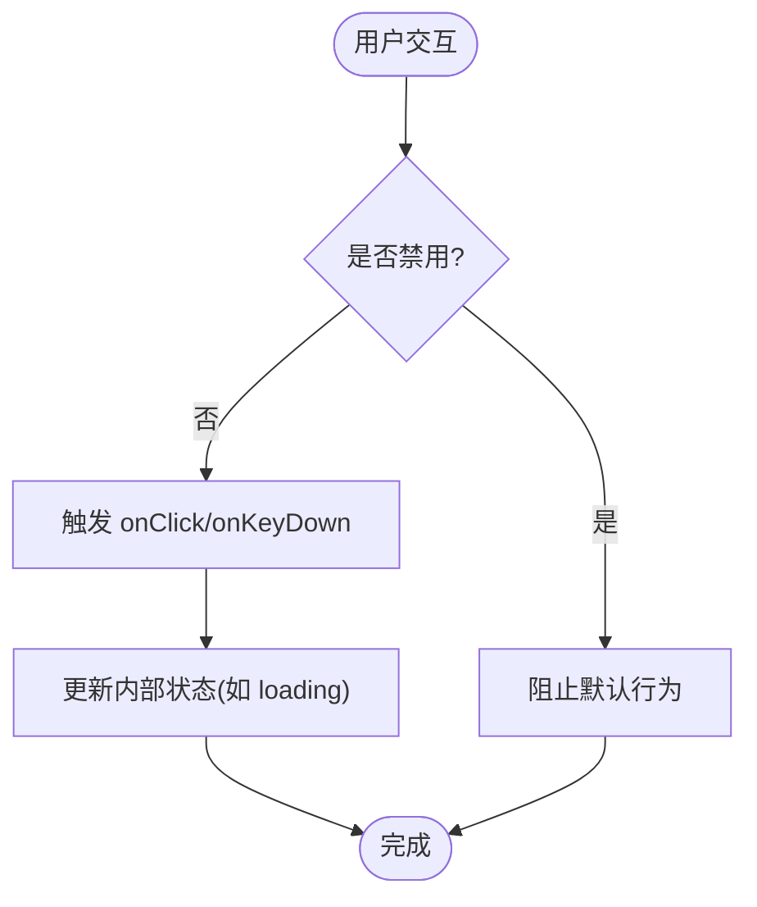
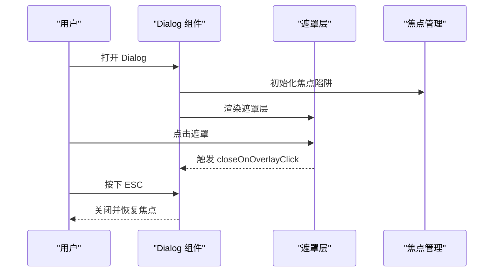
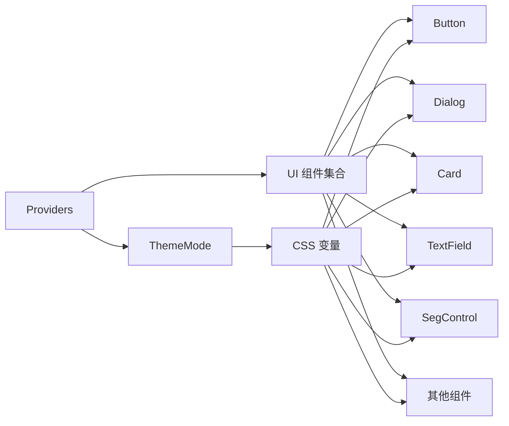

# 基础 UI 组件库

<cite>
**本文引用的文件**   
- [src/components/ui/button.tsx](file://src/components/ui/button.tsx)
- [src/components/ui/dialog.tsx](file://src/components/ui/dialog.tsx)
- [src/components/ui/card.tsx](file://src/components/ui/card.tsx)
- [src/components/ui/text-field.tsx](file://src/components/ui/text-field.tsx)
- [src/components/ui/segmented-control.tsx](file://src/components/ui/segmented-control.tsx)
- [src/components/ui/settings-panel.tsx](file://src/components/ui/settings-panel.tsx)
- [src/components/ui/sidebar.tsx](file://src/components/ui/sidebar.tsx)
- [src/app/design-system.css](file://src/app/design-system.css)
- [src/app/globals.css](file://src/app/globals.css)
- [src/lib/theme-mode.ts](file://src/lib/theme-mode.ts)
- [src/app/providers.tsx](file://src/app/providers.tsx)
- [src/components/ui/toast.tsx](file://src/components/ui/toast.tsx)
- [src/components/ui/tooltip.tsx](file://src/components/ui/tooltip.tsx)
- [src/components/ui/toggle.tsx](file://src/components/ui/toggle.tsx)
- [src/components/ui/progress-bar.tsx](file://src/components/ui/progress-bar.tsx)
- [src/components/ui/skeleton.tsx](file://src/components/ui/skeleton.tsx)
- [src/components/ui/status-pill.tsx](file://src/components/ui/status-pill.tsx)
- [src/components/ui/nav-item.tsx](file://src/components/ui/nav-item.tsx)
- [src/components/ui/top-bar.tsx](file://src/components/ui/top-bar.tsx)
- [src/components/ui/search-field.tsx](file://src/components/ui/search-field.tsx)
- [src/components/ui/collapsible-card.tsx](file://src/components/ui/collapsible-card.tsx)
- [src/components/ui/project-card.tsx](file://src/components/ui/project-card.tsx)
- [src/components/ui/queue-status-bar.tsx](file://src/components/ui/queue-status-bar.tsx)
- [src/components/ui/pipeline-node.tsx](file://src/components/ui/pipeline-node.tsx)
- [src/components/ui/artifact-chip.tsx](file://src/components/ui/artifact-chip.tsx)
</cite>

## 目录
1. [简介](#简介)
2. [项目结构](#项目结构)
3. [核心组件](#核心组件)
4. [架构总览](#架构总览)
5. [详细组件分析](#详细组件分析)
6. [依赖关系分析](#依赖关系分析)
7. [性能考量](#性能考量)
8. [故障排查指南](#故障排查指南)
9. [结论](#结论)
10. [附录](#附录)

## 简介
本文件为 PurpleInk 平台的基础 UI 组件库文档，聚焦 Button、Dialog、Card、Input（Text Field）、Select（Segmented Control）等核心组件的设计理念与实现原理。内容涵盖：
- Props 接口约定、事件处理与组合模式
- 可访问性支持（无障碍）与键盘交互
- 响应式设计与主题适配机制
- 最佳实践与常见陷阱避免
- 代码示例路径与使用建议

## 项目结构
UI 组件集中位于 src/components/ui 目录，样式与主题在 src/app 下的全局样式文件中定义，主题切换逻辑位于 src/lib/theme-mode.ts，应用级 Provider 在 src/app/providers.tsx 中提供上下文能力。

```mermaid
graph TB
subgraph "应用层"
Providers["应用提供者<br/>src/app/providers.tsx"]
GlobalCSS["全局样式<br/>src/app/globals.css"]
DesignSystemCSS["设计系统样式<br/>src/app/design-system.css"]
end
subgraph "主题与工具"
ThemeMode["主题模式<br/>src/lib/theme-mode.ts"]
end
subgraph "基础组件"
Button["Button<br/>src/components/ui/button.tsx"]
Dialog["Dialog<br/>src/components/ui/dialog.tsx"]
Card["Card<br/>src/components/ui/card.tsx"]
TextField["Text Field<br/>src/components/ui/text-field.tsx"]
SegControl["Segmented Control<br/>src/components/ui/segmented-control.tsx"]
Toast["Toast<br/>src/components/ui/toast.tsx"]
Tooltip["Tooltip<br/>src/components/ui/tooltip.tsx"]
Toggle["Toggle<br/>src/components/ui/toggle.tsx"]
ProgressBar["Progress Bar<br/>src/components/ui/progress-bar.tsx"]
Skeleton["Skeleton<br/>src/components/ui/skeleton.tsx"]
StatusPill["Status Pill<br/>src/components/ui/status-pill.tsx"]
NavItem["Nav Item<br/>src/components/ui/nav-item.tsx"]
TopBar["Top Bar<br/>src/components/ui/top-bar.tsx"]
SearchField["Search Field<br/>src/components/ui/search-field.tsx"]
CollapsibleCard["Collapsible Card<br/>src/components/ui/collapsible-card.tsx"]
ProjectCard["Project Card<br/>src/components/ui/project-card.tsx"]
QueueStatusBar["Queue Status Bar<br/>src/components/ui/queue-status-bar.tsx"]
PipelineNode["Pipeline Node<br/>src/components/ui/pipeline-node.tsx"]
ArtifactChip["Artifact Chip<br/>src/components/ui/artifact-chip.tsx"]
end
Providers --> ThemeMode
Providers --> Button
Providers --> Dialog
Providers --> Card
Providers --> TextField
Providers --> SegControl
Providers --> Toast
Providers --> Tooltip
Providers --> Toggle
Providers --> ProgressBar
Providers --> Skeleton
Providers --> StatusPill
Providers --> NavItem
Providers --> TopBar
Providers --> SearchField
Providers --> CollapsibleCard
Providers --> ProjectCard
Providers --> QueueStatusBar
Providers --> PipelineNode
Providers --> ArtifactChip
GlobalCSS --> DesignSystemCSS
DesignSystemCSS --> Button
DesignSystemCSS --> Dialog
DesignSystemCSS --> Card
DesignSystemCSS --> TextField
DesignSystemCSS --> SegControl
```

图表来源
- [src/app/providers.tsx](file://src/app/providers.tsx)
- [src/app/globals.css](file://src/app/globals.css)
- [src/app/design-system.css](file://src/app/design-system.css)
- [src/lib/theme-mode.ts](file://src/lib/theme-mode.ts)
- [src/components/ui/button.tsx](file://src/components/ui/button.tsx)
- [src/components/ui/dialog.tsx](file://src/components/ui/dialog.tsx)
- [src/components/ui/card.tsx](file://src/components/ui/card.tsx)
- [src/components/ui/text-field.tsx](file://src/components/ui/text-field.tsx)
- [src/components/ui/segmented-control.tsx](file://src/components/ui/segmented-control.tsx)
- [src/components/ui/toast.tsx](file://src/components/ui/toast.tsx)
- [src/components/ui/tooltip.tsx](file://src/components/ui/tooltip.tsx)
- [src/components/ui/toggle.tsx](file://src/components/ui/toggle.tsx)
- [src/components/ui/progress-bar.tsx](file://src/components/ui/progress-bar.tsx)
- [src/components/ui/skeleton.tsx](file://src/components/ui/skeleton.tsx)
- [src/components/ui/status-pill.tsx](file://src/components/ui/status-pill.tsx)
- [src/components/ui/nav-item.tsx](file://src/components/ui/nav-item.tsx)
- [src/components/ui/top-bar.tsx](file://src/components/ui/top-bar.tsx)
- [src/components/ui/search-field.tsx](file://src/components/ui/search-field.tsx)
- [src/components/ui/collapsible-card.tsx](file://src/components/ui/collapsible-card.tsx)
- [src/components/ui/project-card.tsx](file://src/components/ui/project-card.tsx)
- [src/components/ui/queue-status-bar.tsx](file://src/components/ui/queue-status-bar.tsx)
- [src/components/ui/pipeline-node.tsx](file://src/components/ui/pipeline-node.tsx)
- [src/components/ui/artifact-chip.tsx](file://src/components/ui/artifact-chip.tsx)

章节来源
- [src/app/providers.tsx](file://src/app/providers.tsx)
- [src/app/globals.css](file://src/app/globals.css)
- [src/app/design-system.css](file://src/app/design-system.css)
- [src/lib/theme-mode.ts](file://src/lib/theme-mode.ts)

## 核心组件
本节概述 Button、Dialog、Card、Text Field、Segmented Control 的设计目标与通用行为：
- 一致性：统一的尺寸、间距、颜色与动效规范，遵循设计系统变量
- 可访问性：语义化标签、ARIA 属性、键盘导航与焦点管理
- 主题适配：通过 CSS 变量与主题模式切换，自动适配明暗主题
- 响应式：基于容器与断点的弹性布局，适配移动端与桌面端
- 组合性：以“原子 + 复合”的方式组合，便于扩展与复用

章节来源
- [src/components/ui/button.tsx](file://src/components/ui/button.tsx)
- [src/components/ui/dialog.tsx](file://src/components/ui/dialog.tsx)
- [src/components/ui/card.tsx](file://src/components/ui/card.tsx)
- [src/components/ui/text-field.tsx](file://src/components/ui/text-field.tsx)
- [src/components/ui/segmented-control.tsx](file://src/components/ui/segmented-control.tsx)

## 架构总览
组件库采用“Provider + 主题变量 + 组件”的分层架构：
- 应用层 Provider 注入主题状态与全局上下文
- 主题层通过 CSS 变量暴露颜色、字号、圆角、阴影等设计令牌
- 组件层消费主题变量，统一样式与交互行为
- 辅助组件（Toast、Tooltip、Toggle、ProgressBar、Skeleton、StatusPill 等）增强交互体验

图表来源
- [src/app/providers.tsx](file://src/app/providers.tsx)
- [src/lib/theme-mode.ts](file://src/lib/theme-mode.ts)
- [src/components/ui/button.tsx](file://src/components/ui/button.tsx)
- [src/components/ui/dialog.tsx](file://src/components/ui/dialog.tsx)
- [src/components/ui/card.tsx](file://src/components/ui/card.tsx)
- [src/components/ui/text-field.tsx](file://src/components/ui/text-field.tsx)
- [src/components/ui/segmented-control.tsx](file://src/components/ui/segmented-control.tsx)
- [src/components/ui/toast.tsx](file://src/components/ui/toast.tsx)
- [src/components/ui/tooltip.tsx](file://src/components/ui/tooltip.tsx)
- [src/components/ui/toggle.tsx](file://src/components/ui/toggle.tsx)
- [src/components/ui/progress-bar.tsx](file://src/components/ui/progress-bar.tsx)
- [src/components/ui/skeleton.tsx](file://src/components/ui/skeleton.tsx)
- [src/components/ui/status-pill.tsx](file://src/components/ui/status-pill.tsx)

## 详细组件分析

### Button 组件
- 设计理念：强调清晰的视觉层级与一致的交互反馈，支持多种变体与尺寸
- Props 接口要点：
  - 变体：primary、secondary、danger 等
  - 尺寸：small、medium、large
  - 状态：disabled、loading
  - 事件：onClick、onKeyDown
  - 样式：className、style
- 事件处理：
  - 点击回调与键盘回车/空格触发
  - 禁用态阻止默认行为
- 可访问性：
  - 语义化 button 标签
  - aria-disabled、aria-busy（加载态）
  - 焦点可见性与键盘可达
- 主题适配：
  - 通过 CSS 变量控制颜色、边框、阴影
  - 跟随主题模式切换
- 响应式设计：
  - 自适应内边距与字号
  - 在小屏设备上保持触控友好尺寸
- 组合模式：
  - 与 Icon 组合显示
  - 作为表单提交或动作触发入口
- 最佳实践：
  - 明确按钮职责，避免过多变体混用
  - 加载态时禁用重复提交
- 常见陷阱：
  - 未处理键盘事件导致不可达
  - 在禁用态仍触发副作用

图表来源
- [src/components/ui/button.tsx](file://src/components/ui/button.tsx)

章节来源
- [src/components/ui/button.tsx](file://src/components/ui/button.tsx)

### Dialog 组件
- 设计理念：提供模态对话框，确保用户注意力与任务隔离
- Props 接口要点：
  - 可见性：open、onOpenChange
  - 标题与内容：title、children
  - 行为：closeOnOverlayClick、closeOnEsc
  - 样式：className、style
- 事件处理：
  - ESC 关闭、遮罩点击关闭
  - 焦点陷阱与初始焦点管理
- 可访问性：
  - role="dialog"、aria-modal、aria-labelledby
  - 焦点管理与 Tab 顺序
- 主题适配：
  - 背景遮罩与卡片样式随主题变化
- 响应式设计：
  - 移动端全屏或底部弹出
  - 桌面端居中弹窗
- 组合模式：
  - 与 Form、Alert、Button 组合
- 最佳实践：
  - 合理设置焦点初始位置
  - 避免嵌套多个 Dialog
- 常见陷阱：
  - 忘记关闭遮罩导致无法交互
  - 未处理 ESC 键造成卡死

图表来源
- [src/components/ui/dialog.tsx](file://src/components/ui/dialog.tsx)

章节来源
- [src/components/ui/dialog.tsx](file://src/components/ui/dialog.tsx)

### Card 组件
- 设计理念：信息块容器，承载标题、描述与操作区
- Props 接口要点：
  - 标题、描述、操作区插槽
  - 悬停与阴影效果开关
  - 样式覆盖
- 可访问性：
  - 语义化 article/div 结构
  - 标题层级与可读性
- 主题适配：
  - 背景色、边框、阴影随主题变化
- 响应式设计：
  - 网格布局下自适应宽度
- 组合模式：
  - 与 Button、Icon、Avatar 组合
- 最佳实践：
  - 控制内容密度，避免过度拥挤
- 常见陷阱：
  - 未设置标题导致屏幕阅读器识别困难

章节来源
- [src/components/ui/card.tsx](file://src/components/ui/card.tsx)

### Text Field（输入框）
- 设计理念：标准输入控件，支持受控与非受控模式
- Props 接口要点：
  - value、onChange、placeholder
  - 前缀/后缀图标、辅助说明
  - 校验提示与错误状态
  - disabled、readOnly
- 事件处理：
  - 输入变更、聚焦/失焦
  - 键盘快捷键（如 Enter 提交）
- 可访问性：
  - label 关联、aria-invalid、aria-describedby
  - 错误提示与焦点管理
- 主题适配：
  - 边框、背景、文字颜色随主题变化
- 响应式设计：
  - 全宽输入与自适应高度
- 组合模式：
  - 与 Validation、Tooltip、Button 组合
- 最佳实践：
  - 始终提供清晰 label 与错误提示
- 常见陷阱：
  - 未绑定 onChange 导致受控组件失效

章节来源
- [src/components/ui/text-field.tsx](file://src/components/ui/text-field.tsx)

### Segmented Control（分段选择器）
- 设计理念：用于单选分组的选择控件，替代传统 Radio Group
- Props 接口要点：
  - options（文本/图标/禁用态）
  - value、onChange
  - 尺寸与对齐
- 事件处理：
  - 键盘左右切换、Enter 确认
  - 点击切换选中项
- 可访问性：
  - role="radiogroup"、aria-checked
  - 焦点与 Tab 顺序
- 主题适配：
  - 选中态高亮与禁用态灰度
- 响应式设计：
  - 横向滚动与换行
- 组合模式：
  - 与 Filter、Tabs 类似场景
- 最佳实践：
  - 选项数量适中，避免过长
- 常见陷阱：
  - 未处理键盘事件导致不可达

章节来源
- [src/components/ui/segmented-control.tsx](file://src/components/ui/segmented-control.tsx)

### 其他常用组件概览
- Toast：消息通知，支持类型、自动消失、手动关闭
- Tooltip：悬浮提示，支持定位策略与触发方式
- Toggle：开关控件，支持禁用态与状态同步
- ProgressBar：进度指示，支持线性与环形
- Skeleton：骨架屏，提升加载感知
- StatusPill：状态标识，颜色映射与文本展示
- NavItem、TopBar：导航与顶部栏，配合 Sidebar 构建布局
- SearchField：搜索输入，支持清空与快捷操作
- CollapsibleCard、ProjectCard：业务卡片，承载复杂信息与操作
- QueueStatusBar、PipelineNode、ArtifactChip：工作流与制品相关可视化

章节来源
- [src/components/ui/toast.tsx](file://src/components/ui/toast.tsx)
- [src/components/ui/tooltip.tsx](file://src/components/ui/tooltip.tsx)
- [src/components/ui/toggle.tsx](file://src/components/ui/toggle.tsx)
- [src/components/ui/progress-bar.tsx](file://src/components/ui/progress-bar.tsx)
- [src/components/ui/skeleton.tsx](file://src/components/ui/skeleton.tsx)
- [src/components/ui/status-pill.tsx](file://src/components/ui/status-pill.tsx)
- [src/components/ui/nav-item.tsx](file://src/components/ui/nav-item.tsx)
- [src/components/ui/top-bar.tsx](file://src/components/ui/top-bar.tsx)
- [src/components/ui/search-field.tsx](file://src/components/ui/search-field.tsx)
- [src/components/ui/collapsible-card.tsx](file://src/components/ui/collapsible-card.tsx)
- [src/components/ui/project-card.tsx](file://src/components/ui/project-card.tsx)
- [src/components/ui/queue-status-bar.tsx](file://src/components/ui/queue-status-bar.tsx)
- [src/components/ui/pipeline-node.tsx](file://src/components/ui/pipeline-node.tsx)
- [src/components/ui/artifact-chip.tsx](file://src/components/ui/artifact-chip.tsx)

## 依赖关系分析
组件之间通过 Provider 共享主题与上下文，样式由设计系统统一管理，减少耦合与重复。

图表来源
- [src/app/providers.tsx](file://src/app/providers.tsx)
- [src/lib/theme-mode.ts](file://src/lib/theme-mode.ts)
- [src/app/design-system.css](file://src/app/design-system.css)
- [src/components/ui/button.tsx](file://src/components/ui/button.tsx)
- [src/components/ui/dialog.tsx](file://src/components/ui/dialog.tsx)
- [src/components/ui/card.tsx](file://src/components/ui/card.tsx)
- [src/components/ui/text-field.tsx](file://src/components/ui/text-field.tsx)
- [src/components/ui/segmented-control.tsx](file://src/components/ui/segmented-control.tsx)

章节来源
- [src/app/providers.tsx](file://src/app/providers.tsx)
- [src/lib/theme-mode.ts](file://src/lib/theme-mode.ts)
- [src/app/design-system.css](file://src/app/design-system.css)

## 性能考量
- 组件渲染优化：
  - 合理使用 memo/useMemo/useCallback 避免不必要的重渲染
  - 列表与大数据集使用虚拟滚动
- 样式与主题：
  - 使用 CSS 变量减少计算与重排
  - 避免频繁切换主题导致的闪烁
- 事件处理：
  - 防抖与节流用于高频输入与滚动
- 资源加载：
  - 懒加载非关键组件与图标
- 可访问性：
  - 避免过度 ARIA 导致屏幕阅读器负担

[本节为通用指导，不直接分析具体文件]

## 故障排查指南
- 主题不生效：
  - 检查 Provider 是否正确包裹应用
  - 确认 CSS 变量已正确注入
- 键盘不可达：
  - 检查 tabIndex、focus 管理与键盘事件绑定
- 表单受控失效：
  - 确保 value 与 onChange 同时绑定
- 弹窗焦点丢失：
  - 验证焦点陷阱与初始焦点设置
- 样式冲突：
  - 使用命名空间类名与 CSS Modules 隔离样式

章节来源
- [src/app/providers.tsx](file://src/app/providers.tsx)
- [src/app/design-system.css](file://src/app/design-system.css)
- [src/components/ui/dialog.tsx](file://src/components/ui/dialog.tsx)
- [src/components/ui/text-field.tsx](file://src/components/ui/text-field.tsx)

## 结论
PurpleInk 基础 UI 组件库以一致的设计语言、完善的可访问性与灵活的主题适配为核心，结合 Provider 与 CSS 变量实现跨组件的统一风格。通过合理的组合模式与最佳实践，开发者可以快速构建高质量、易维护的界面。建议在项目中严格遵循组件接口与可访问性规范，充分利用主题与响应式能力，提升用户体验与开发效率。

[本节为总结，不直接分析具体文件]

## 附录
- 代码示例路径（按组件分类）：
  - Button：[button.demo.tsx](file://src/components/ui/button.demo.tsx)
  - Dialog：[dialog.demo.tsx](file://src/components/ui/dialog.demo.tsx)
  - Card：[card.demo.tsx](file://src/components/ui/card.demo.tsx)
  - Text Field：[text-field.demo.tsx](file://src/components/ui/text-field.demo.tsx)
  - Segmented Control：[segmented-control.demo.tsx](file://src/components/ui/segmented-control.demo.tsx)
  - Toast：[toast.demo.tsx](file://src/components/ui/toast.demo.tsx)
  - Tooltip：[tooltip.demo.tsx](file://src/components/ui/tooltip.demo.tsx)
  - Toggle：[toggle.demo.tsx](file://src/components/ui/toggle.demo.tsx)
  - Progress Bar：[progress-bar.demo.tsx](file://src/components/ui/progress-bar.demo.tsx)
  - Skeleton：[skeleton.demo.tsx](file://src/components/ui/skeleton.demo.tsx)
  - Status Pill：[status-pill.demo.tsx](file://src/components/ui/status-pill.demo.tsx)
  - Nav Item：[nav-item.demo.tsx](file://src/components/ui/nav-item.demo.tsx)
  - Top Bar：[top-bar.demo.tsx](file://src/components/ui/top-bar.demo.tsx)
  - Search Field：[search-field.demo.tsx](file://src/components/ui/search-field.demo.tsx)
  - Collapsible Card：[collapsible-card.demo.tsx](file://src/components/ui/collapsible-card.demo.tsx)
  - Project Card：[project-card.demo.tsx](file://src/components/ui/project-card.demo.tsx)
  - Queue Status Bar：[queue-status-bar.demo.tsx](file://src/components/ui/queue-status-bar.demo.tsx)
  - Pipeline Node：[pipeline-node.demo.tsx](file://src/components/ui/pipeline-node.demo.tsx)
  - Artifact Chip：[artifact-chip.demo.tsx](file://src/components/ui/artifact-chip.demo.tsx)

章节来源
- [src/components/ui/button.demo.tsx](file://src/components/ui/button.demo.tsx)
- [src/components/ui/dialog.demo.tsx](file://src/components/ui/dialog.demo.tsx)
- [src/components/ui/card.demo.tsx](file://src/components/ui/card.demo.tsx)
- [src/components/ui/text-field.demo.tsx](file://src/components/ui/text-field.demo.tsx)
- [src/components/ui/segmented-control.demo.tsx](file://src/components/ui/segmented-control.demo.tsx)
- [src/components/ui/toast.demo.tsx](file://src/components/ui/toast.demo.tsx)
- [src/components/ui/tooltip.demo.tsx](file://src/components/ui/tooltip.demo.tsx)
- [src/components/ui/toggle.demo.tsx](file://src/components/ui/toggle.demo.tsx)
- [src/components/ui/progress-bar.demo.tsx](file://src/components/ui/progress-bar.demo.tsx)
- [src/components/ui/skeleton.demo.tsx](file://src/components/ui/skeleton.demo.tsx)
- [src/components/ui/status-pill.demo.tsx](file://src/components/ui/status-pill.demo.tsx)
- [src/components/ui/nav-item.demo.tsx](file://src/components/ui/nav-item.demo.tsx)
- [src/components/ui/top-bar.demo.tsx](file://src/components/ui/top-bar.demo.tsx)
- [src/components/ui/search-field.demo.tsx](file://src/components/ui/search-field.demo.tsx)
- [src/components/ui/collapsible-card.demo.tsx](file://src/components/ui/collapsible-card.demo.tsx)
- [src/components/ui/project-card.demo.tsx](file://src/components/ui/project-card.demo.tsx)
- [src/components/ui/queue-status-bar.demo.tsx](file://src/components/ui/queue-status-bar.demo.tsx)
- [src/components/ui/pipeline-node.demo.tsx](file://src/components/ui/pipeline-node.demo.tsx)
- [src/components/ui/artifact-chip.demo.tsx](file://src/components/ui/artifact-chip.demo.tsx)