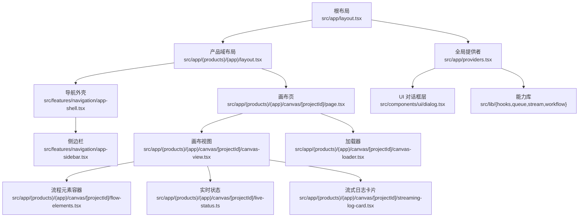
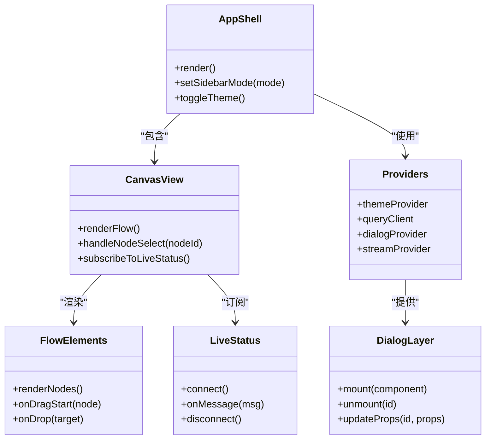
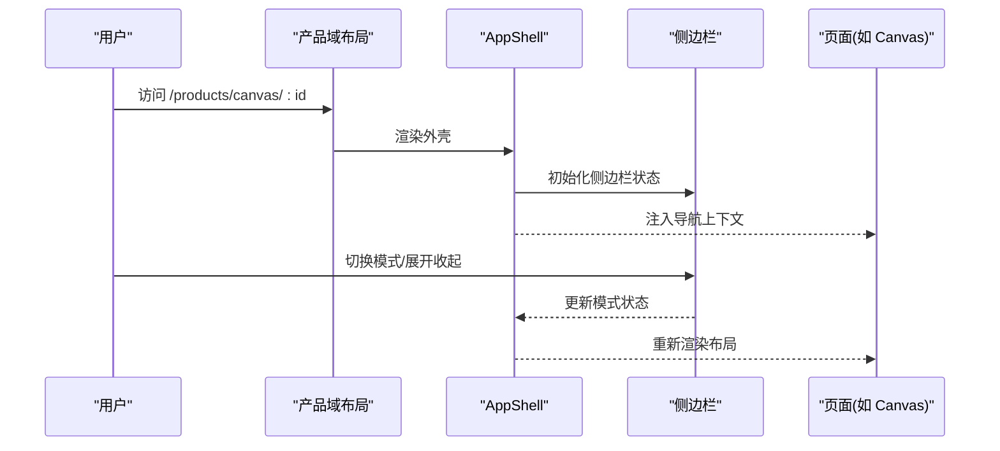
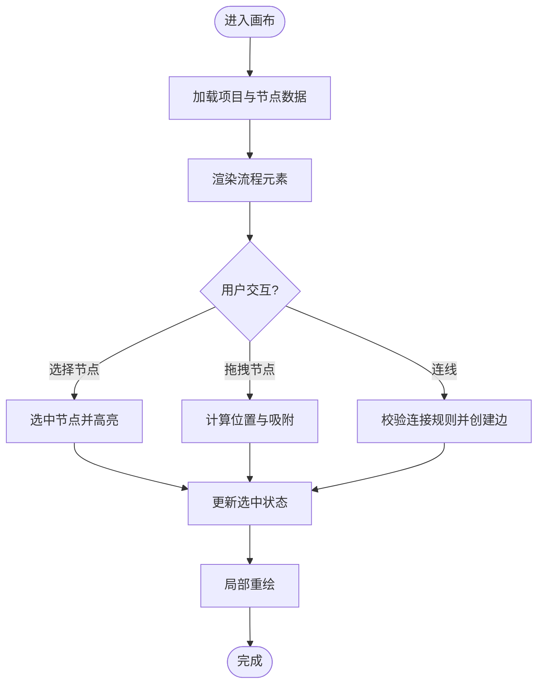
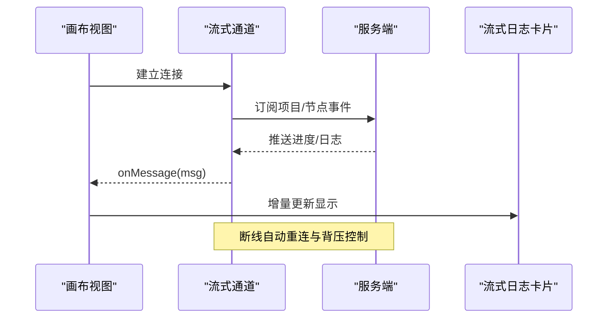
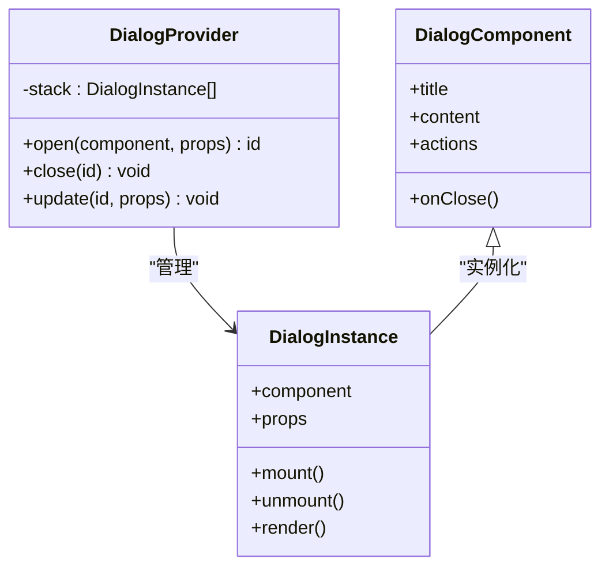
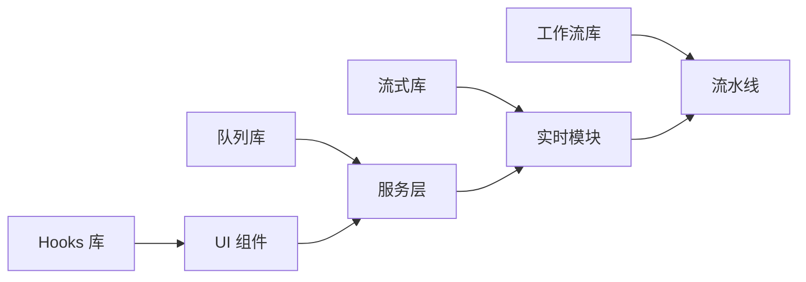
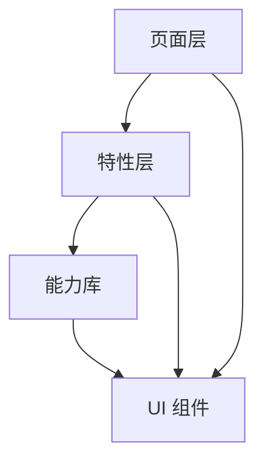

# 组件架构原则

<cite>
**本文引用的文件**   
- [src/app/layout.tsx](file://src/app/layout.tsx)
- [src/app/providers.tsx](file://src/app/providers.tsx)
- [src/app/(products)/(app)/layout.tsx](file://src/app/(products)/(app)/layout.tsx)
- [src/app/(products)/(app)/canvas/[projectId]/page.tsx](file://src/app/(products)/(app)/canvas/[projectId]/page.tsx)
- [src/app/(products)/(app)/canvas/[projectId]/canvas-view.tsx](file://src/app/(products)/(app)/canvas/[projectId]/canvas-view.tsx)
- [src/app/(products)/(app)/canvas/[projectId]/canvas-loader.tsx](file://src/app/(products)/(app)/canvas/[projectId]/canvas-loader.tsx)
- [src/app/(products)/(app)/canvas/[projectId]/flow-elements.tsx](file://src/app/(products)/(app)/canvas/[projectId]/flow-elements.tsx)
- [src/app/(products)/(app)/canvas/[projectId]/live-status.ts](file://src/app/(products)/(app)/canvas/[projectId]/live-status.ts)
- [src/app/(products)/(app)/canvas/[projectId]/streaming-log-card.tsx](file://src/app/(products)/(app)/canvas/[projectId]/streaming-log-card.tsx)
- [src/features/navigation/app-shell.tsx](file://src/features/navigation/app-shell.tsx)
- [src/features/navigation/app-sidebar.tsx](file://src/features/navigation/app-sidebar.tsx)
- [src/components/ui/dialog.tsx](file://src/components/ui/dialog.tsx)
- [src/lib/hooks/index.ts](file://src/lib/hooks/index.ts)
- [src/lib/queue/index.ts](file://src/lib/queue/index.ts)
- [src/lib/stream/index.ts](file://src/lib/stream/index.ts)
- [src/lib/workflow/index.ts](file://src/lib/workflow/index.ts)
- [src/instrumentation.ts](file://src/instrumentation.ts)
</cite>

## 目录
1. [引言](#引言)
2. [项目结构](#项目结构)
3. [核心组件](#核心组件)
4. [架构总览](#架构总览)
5. [详细组件分析](#详细组件分析)
6. [依赖分析](#依赖分析)
7. [性能考量](#性能考量)
8. [故障排查指南](#故障排查指南)
9. [结论](#结论)
10. [附录](#附录)

## 引言
本文件面向 PurpleInk 平台的前端组件架构，系统化阐述分层设计、职责分离与依赖管理策略；深入解释 Overlay Root 等基础设施组件的设计理念及其对复杂前端状态与生命周期的协调方式；总结组件间通信模式、事件总线设计与状态共享机制；并给出组件测试策略、可组合性设计与性能监控的实践建议。同时提供架构决策的技术背景与权衡考虑，以及新组件开发的设计指南，帮助团队在演进中保持一致性与可维护性。

## 项目结构
PurpleInk 采用 Next.js App Router 组织页面与路由，业务功能按“features”划分，通用 UI 组件集中在“components/ui”，跨领域能力通过“lib”模块暴露（如 hooks、队列、流式处理、工作流）。应用壳层由根布局与产品域布局共同构成，Canvas 作为核心编辑场景，承载复杂的运行时状态与渲染管线。

**图示来源** 
- [src/app/layout.tsx](file://src/app/layout.tsx)
- [src/app/(products)/(app)/layout.tsx](file://src/app/(products)/(app)/layout.tsx)
- [src/features/navigation/app-shell.tsx](file://src/features/navigation/app-shell.tsx)
- [src/features/navigation/app-sidebar.tsx](file://src/features/navigation/app-sidebar.tsx)
- [src/app/(products)/(app)/canvas/[projectId]/page.tsx](file://src/app/(products)/(app)/canvas/[projectId]/page.tsx)
- [src/app/(products)/(app)/canvas/[projectId]/canvas-view.tsx](file://src/app/(products)/(app)/canvas/[projectId]/canvas-view.tsx)
- [src/app/(products)/(app)/canvas/[projectId]/canvas-loader.tsx](file://src/app/(products)/(app)/canvas/[projectId]/canvas-loader.tsx)
- [src/app/(products)/(app)/canvas/[projectId]/flow-elements.tsx](file://src/app/(products)/(app)/canvas/[projectId]/flow-elements.tsx)
- [src/app/(products)/(app)/canvas/[projectId]/live-status.ts](file://src/app/(products)/(app)/canvas/[projectId]/live-status.ts)
- [src/app/(products)/(app)/canvas/[projectId]/streaming-log-card.tsx](file://src/app/(products)/(app)/canvas/[projectId]/streaming-log-card.tsx)
- [src/app/providers.tsx](file://src/app/providers.tsx)
- [src/components/ui/dialog.tsx](file://src/components/ui/dialog.tsx)
- [src/lib/hooks/index.ts](file://src/lib/hooks/index.ts)
- [src/lib/queue/index.ts](file://src/lib/queue/index.ts)
- [src/lib/stream/index.ts](file://src/lib/stream/index.ts)
- [src/lib/workflow/index.ts](file://src/lib/workflow/index.ts)

**章节来源**
- [src/app/layout.tsx](file://src/app/layout.tsx)
- [src/app/(products)/(app)/layout.tsx](file://src/app/(products)/(app)/layout.tsx)
- [src/app/(products)/(app)/canvas/[projectId]/page.tsx](file://src/app/(products)/(app)/canvas/[projectId]/page.tsx)

## 核心组件
- 应用壳层与导航：负责整体布局、路由上下文与侧边栏模式切换，为子页面提供一致的交互框架。
- 画布视图与流程元素：承载节点编排、数据流与渲染逻辑，是复杂状态与生命周期的高频交互区。
- 实时状态与流式日志：基于流式通道聚合后端进度与日志，驱动 UI 增量更新。
- 对话框与层级管理：统一弹窗的挂载点与 z-index 管理，避免层级冲突。
- 能力库（hooks/queue/stream/workflow）：抽象跨组件的通用能力，降低耦合度，提升复用性。

**章节来源**
- [src/features/navigation/app-shell.tsx](file://src/features/navigation/app-shell.tsx)
- [src/features/navigation/app-sidebar.tsx](file://src/features/navigation/app-sidebar.tsx)
- [src/app/(products)/(app)/canvas/[projectId]/canvas-view.tsx](file://src/app/(products)/(app)/canvas/[projectId]/canvas-view.tsx)
- [src/app/(products)/(app)/canvas/[projectId]/flow-elements.tsx](file://src/app/(products)/(app)/canvas/[projectId]/flow-elements.tsx)
- [src/app/(products)/(app)/canvas/[projectId]/live-status.ts](file://src/app/(products)/(app)/canvas/[projectId]/live-status.ts)
- [src/app/(products)/(app)/canvas/[projectId]/streaming-log-card.tsx](file://src/app/(products)/(app)/canvas/[projectId]/streaming-log-card.tsx)
- [src/components/ui/dialog.tsx](file://src/components/ui/dialog.tsx)
- [src/lib/hooks/index.ts](file://src/lib/hooks/index.ts)
- [src/lib/queue/index.ts](file://src/lib/queue/index.ts)
- [src/lib/stream/index.ts](file://src/lib/stream/index.ts)
- [src/lib/workflow/index.ts](file://src/lib/workflow/index.ts)

## 架构总览
PurpleInk 的前端架构遵循“页面-特性-组件-能力库”的分层模型：
- 页面层：Next.js 路由驱动的页面与布局，负责装配与数据获取。
- 特性层：按业务域组织（如 canvas、navigation、render），封装领域逻辑与状态。
- 组件层：UI 原子与复合组件，强调无副作用与高内聚。
- 能力库层：跨领域的基础设施（hooks、队列、流、工作流），对外暴露稳定接口。

Overlay Root 作为全局弹窗与浮层的统一挂载点，确保层级一致性与生命周期可控。它通过 Provider 注入到应用树，被各特性与组件按需消费。

**图示来源** 
- [src/features/navigation/app-shell.tsx](file://src/features/navigation/app-shell.tsx)
- [src/app/(products)/(app)/canvas/[projectId]/canvas-view.tsx](file://src/app/(products)/(app)/canvas/[projectId]/canvas-view.tsx)
- [src/app/(products)/(app)/canvas/[projectId]/flow-elements.tsx](file://src/app/(products)/(app)/canvas/[projectId]/flow-elements.tsx)
- [src/app/(products)/(app)/canvas/[projectId]/live-status.ts](file://src/app/(products)/(app)/canvas/[projectId]/live-status.ts)
- [src/components/ui/dialog.tsx](file://src/components/ui/dialog.tsx)
- [src/app/providers.tsx](file://src/app/providers.tsx)

## 详细组件分析

### 应用壳层与导航（App Shell）
- 职责：统一布局、路由上下文、侧边栏模式切换、主题控制。
- 设计要点：将导航状态与页面内容解耦，通过 Context/Provider 传递；侧边栏支持折叠与模式切换，适配不同设备。
- 生命周期：在布局层初始化，随路由切换保持状态一致性。

**图示来源** 
- [src/app/(products)/(app)/layout.tsx](file://src/app/(products)/(app)/layout.tsx)
- [src/features/navigation/app-shell.tsx](file://src/features/navigation/app-shell.tsx)
- [src/features/navigation/app-sidebar.tsx](file://src/features/navigation/app-sidebar.tsx)

**章节来源**
- [src/app/(products)/(app)/layout.tsx](file://src/app/(products)/(app)/layout.tsx)
- [src/features/navigation/app-shell.tsx](file://src/features/navigation/app-shell.tsx)
- [src/features/navigation/app-sidebar.tsx](file://src/features/navigation/app-sidebar.tsx)

### 画布视图与流程元素（Canvas View & Flow Elements）
- 职责：渲染节点图、处理拖拽与连线、响应选择与编辑、订阅实时状态。
- 设计要点：将“数据模型”和“渲染逻辑”分离；通过事件总线或状态订阅实现松耦合；大列表渲染需虚拟化与增量更新。
- 性能优化：局部重绘、防抖/节流、请求去重、懒加载。

**图示来源** 
- [src/app/(products)/(app)/canvas/[projectId]/canvas-view.tsx](file://src/app/(products)/(app)/canvas/[projectId]/canvas-view.tsx)
- [src/app/(products)/(app)/canvas/[projectId]/flow-elements.tsx](file://src/app/(products)/(app)/canvas/[projectId]/flow-elements.tsx)

**章节来源**
- [src/app/(products)/(app)/canvas/[projectId]/canvas-view.tsx](file://src/app/(products)/(app)/canvas/[projectId]/canvas-view.tsx)
- [src/app/(products)/(app)/canvas/[projectId]/flow-elements.tsx](file://src/app/(products)/(app)/canvas/[projectId]/flow-elements.tsx)

### 实时状态与流式日志（Live Status & Streaming Log）
- 职责：建立与服务端的流式通道，接收进度与日志消息，驱动 UI 增量更新。
- 设计要点：连接生命周期管理（连接/重连/断开）、消息去重与合并、错误恢复与降级。
- 性能优化：批处理更新、虚拟滚动、节流渲染。

**图示来源** 
- [src/app/(products)/(app)/canvas/[projectId]/live-status.ts](file://src/app/(products)/(app)/canvas/[projectId]/live-status.ts)
- [src/app/(products)/(app)/canvas/[projectId]/streaming-log-card.tsx](file://src/app/(products)/(app)/canvas/[projectId]/streaming-log-card.tsx)
- [src/lib/stream/index.ts](file://src/lib/stream/index.ts)

**章节来源**
- [src/app/(products)/(app)/canvas/[projectId]/live-status.ts](file://src/app/(products)/(app)/canvas/[projectId]/live-status.ts)
- [src/app/(products)/(app)/canvas/[projectId]/streaming-log-card.tsx](file://src/app/(products)/(app)/canvas/[projectId]/streaming-log-card.tsx)
- [src/lib/stream/index.ts](file://src/lib/stream/index.ts)

### 对话框与层级管理（Dialog Layer）
- 职责：集中管理弹窗的挂载、销毁与属性更新，保证 z-index 顺序与焦点管理。
- 设计要点：通过 Provider 注入全局实例，组件调用 API 打开/关闭；支持嵌套与层级限制。
- 可访问性：焦点陷阱、键盘导航、屏幕阅读器支持。

**图示来源** 
- [src/components/ui/dialog.tsx](file://src/components/ui/dialog.tsx)
- [src/app/providers.tsx](file://src/app/providers.tsx)

**章节来源**
- [src/components/ui/dialog.tsx](file://src/components/ui/dialog.tsx)
- [src/app/providers.tsx](file://src/app/providers.tsx)

### 能力库（Hooks/Queue/Stream/Workflow）
- Hooks：封装常用状态与副作用（如表单、网络请求、动画），提供稳定的 API。
- Queue：任务队列与并发控制，保障稳定性与可观测性。
- Stream：流式数据处理，支持背压、重试与错误恢复。
- Workflow：工作流编排，定义阶段、条件与回滚策略。

**图示来源** 
- [src/lib/hooks/index.ts](file://src/lib/hooks/index.ts)
- [src/lib/queue/index.ts](file://src/lib/queue/index.ts)
- [src/lib/stream/index.ts](file://src/lib/stream/index.ts)
- [src/lib/workflow/index.ts](file://src/lib/workflow/index.ts)

**章节来源**
- [src/lib/hooks/index.ts](file://src/lib/hooks/index.ts)
- [src/lib/queue/index.ts](file://src/lib/queue/index.ts)
- [src/lib/stream/index.ts](file://src/lib/stream/index.ts)
- [src/lib/workflow/index.ts](file://src/lib/workflow/index.ts)

## 依赖分析
- 低耦合：页面仅依赖布局与特性层；特性层通过能力库暴露接口，避免直接依赖底层实现。
- 明确边界：UI 组件不持有业务状态；业务状态集中于特性层与能力库。
- 可替换性：能力库通过接口契约约束，便于替换实现（如不同的队列或流式方案）。

**图示来源** 
- [src/app/(products)/(app)/canvas/[projectId]/page.tsx](file://src/app/(products)/(app)/canvas/[projectId]/page.tsx)
- [src/app/(products)/(app)/canvas/[projectId]/canvas-view.tsx](file://src/app/(products)/(app)/canvas/[projectId]/canvas-view.tsx)
- [src/lib/hooks/index.ts](file://src/lib/hooks/index.ts)
- [src/lib/queue/index.ts](file://src/lib/queue/index.ts)
- [src/lib/stream/index.ts](file://src/lib/stream/index.ts)
- [src/lib/workflow/index.ts](file://src/lib/workflow/index.ts)

**章节来源**
- [src/app/(products)/(app)/canvas/[projectId]/page.tsx](file://src/app/(products)/(app)/canvas/[projectId]/page.tsx)
- [src/app/(products)/(app)/canvas/[projectId]/canvas-view.tsx](file://src/app/(products)/(app)/canvas/[projectId]/canvas-view.tsx)

## 性能考量
- 渲染优化：局部重绘、虚拟列表、防抖/节流、请求去重与缓存。
- 内存管理：及时释放订阅与监听器，避免泄漏；大数据集分片处理。
- 网络与流：背压控制、断线重连、错误降级与超时处理。
- 可观测性：埋点与指标上报，定位瓶颈与异常。

[本节为通用指导，不直接分析具体文件]

## 故障排查指南
- 常见问题：弹窗层级错乱、流式连接不稳定、画布卡顿、状态不同步。
- 排查步骤：检查 Provider 注入顺序、确认订阅生命周期、验证消息去重与批处理、查看错误日志与指标。
- 工具与策略：单元测试覆盖关键路径、集成测试模拟外部依赖、端到端测试验证用户流程。

**章节来源**
- [src/components/ui/dialog.tsx](file://src/components/ui/dialog.tsx)
- [src/app/(products)/(app)/canvas/[projectId]/live-status.ts](file://src/app/(products)/(app)/canvas/[projectId]/live-status.ts)
- [src/app/(products)/(app)/canvas/[projectId]/streaming-log-card.tsx](file://src/app/(products)/(app)/canvas/[projectId]/streaming-log-card.tsx)

## 结论
PurpleInk 的组件架构以分层与职责分离为核心，通过 Overlay Root 等基础设施统一管理复杂状态与生命周期；以能力库抽象跨领域能力，降低耦合、提升复用；以流式与队列机制保障实时性与稳定性。遵循本文的设计指南与最佳实践，可在保证性能与可维护性的前提下快速迭代与扩展。

[本节为总结性内容，不直接分析具体文件]

## 附录
- 新组件开发设计指南
  - 明确职责边界：UI 组件只负责展示与交互，业务逻辑下沉至特性层。
  - 使用能力库：优先复用 hooks/queue/stream/workflow，避免重复造轮子。
  - 可测试性：为关键路径编写单测与集成测试，模拟外部依赖。
  - 可组合性：通过 Props 与 Context 组合，避免硬编码与深层依赖。
  - 性能优先：关注渲染成本与内存占用，必要时引入虚拟化与懒加载。
  - 可观测性：埋点与指标上报，便于问题定位与性能优化。

[本节为通用指导，不直接分析具体文件]