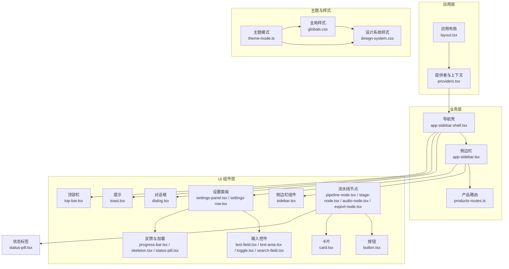
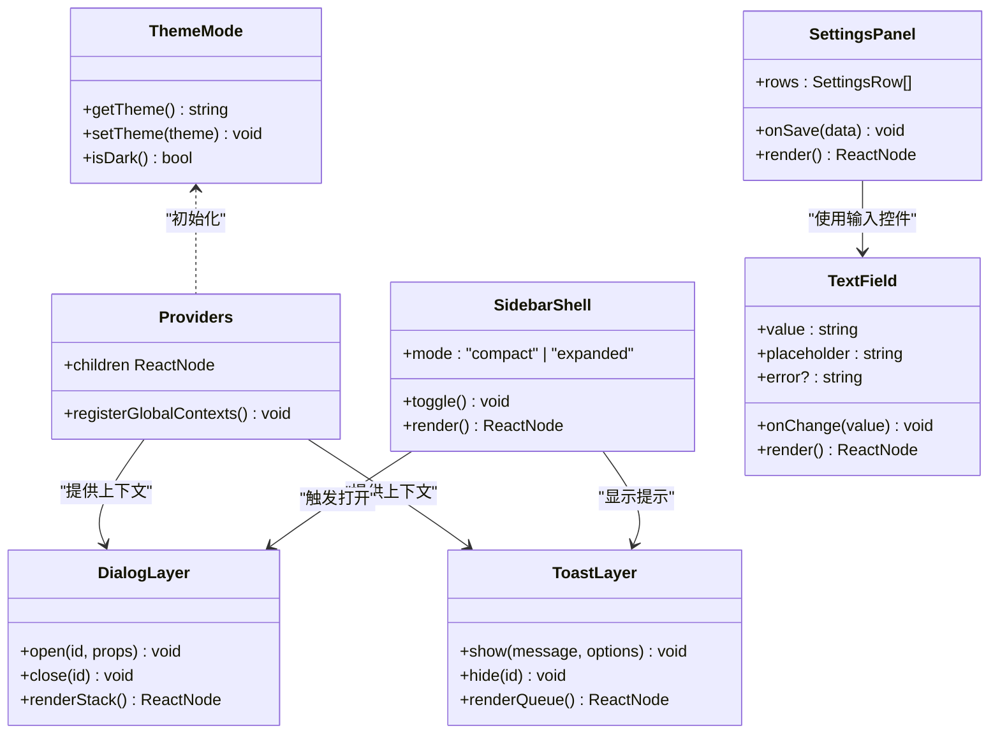
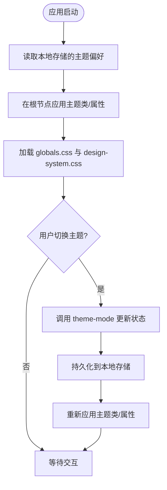
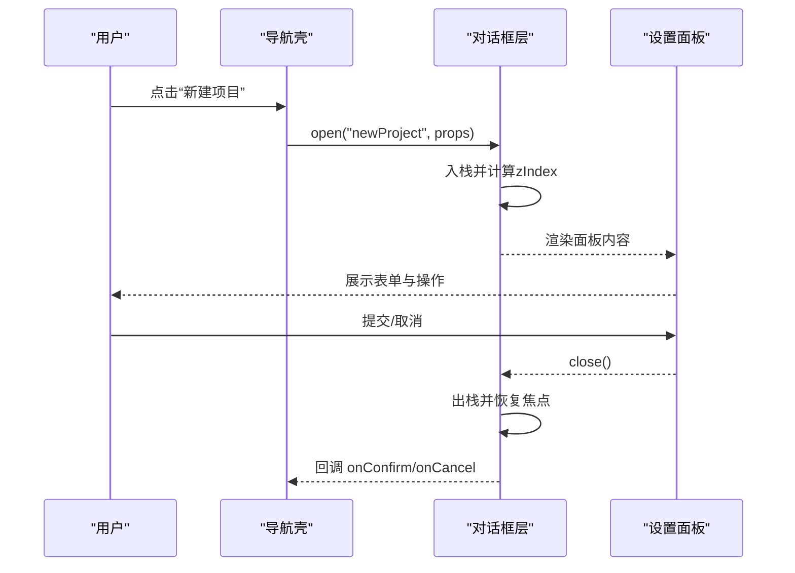
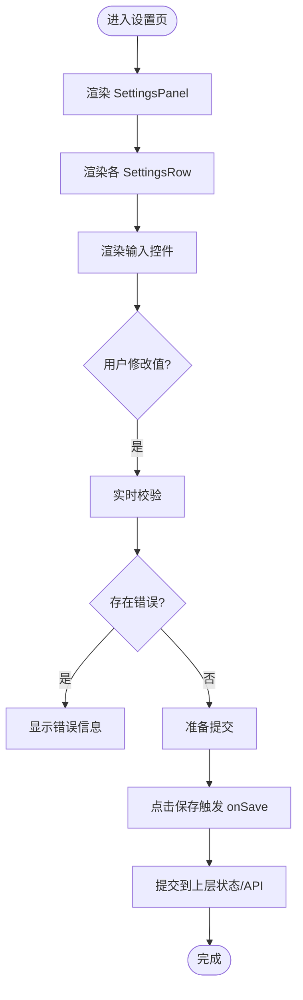
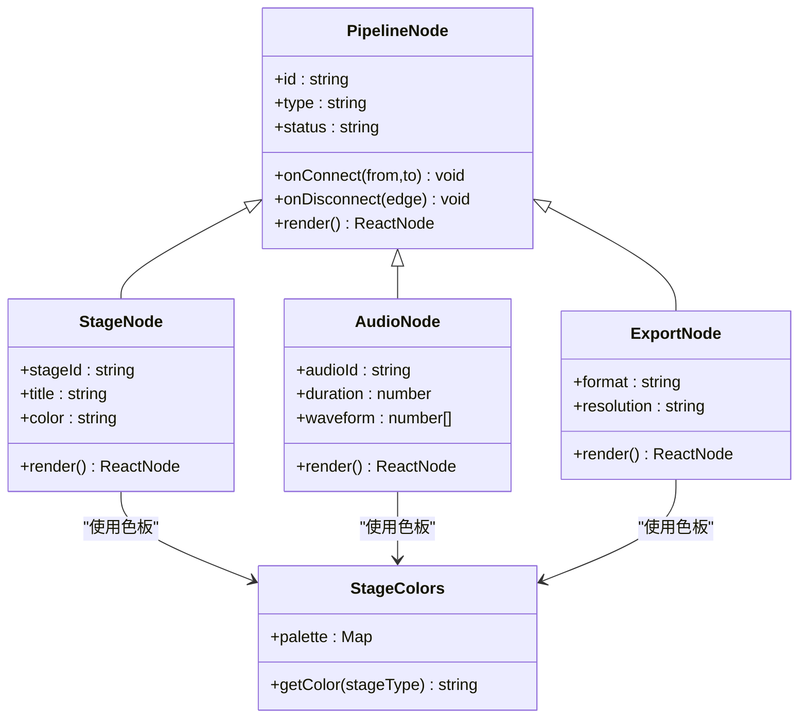
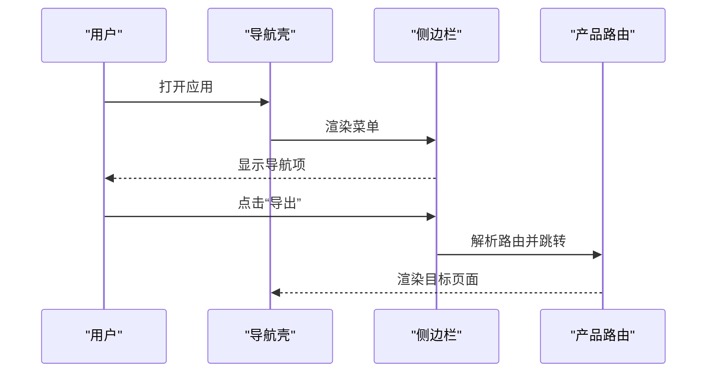
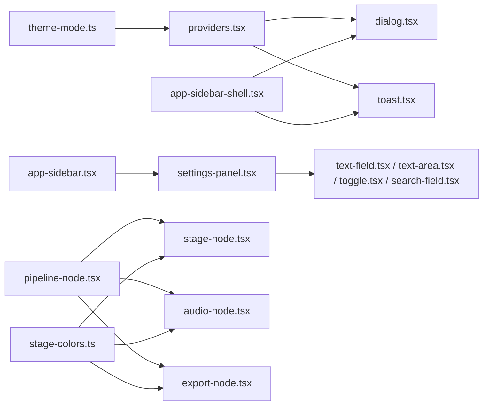

# 组件系统设计

<cite>
**本文引用的文件**   
- [src/app/layout.tsx](file://src/app/layout.tsx)
- [src/app/providers.tsx](file://src/app/providers.tsx)
- [src/app/globals.css](file://src/app/globals.css)
- [src/app/design-system.css](file://src/app/design-system.css)
- [src/lib/theme-mode.ts](file://src/lib/theme-mode.ts)
- [src/components/ui/dialog.tsx](file://src/components/ui/dialog.tsx)
- [src/components/ui/toast.tsx](file://src/components/ui/toast.tsx)
- [src/components/ui/tooltip.tsx](file://src/components/ui/tooltip.tsx)
- [src/components/ui/button.tsx](file://src/components/ui/button.tsx)
- [src/components/ui/card.tsx](file://src/components/ui/card.tsx)
- [src/components/ui/sidebar.tsx](file://src/components/ui/sidebar.tsx)
- [src/components/ui/top-bar.tsx](file://src/components/ui/top-bar.tsx)
- [src/components/ui/settings-panel.tsx](file://src/components/ui/settings-panel.tsx)
- [src/components/ui/settings-row.tsx](file://src/components/ui/settings-row.tsx)
- [src/components/ui/text-field.tsx](file://src/components/ui/text-field.tsx)
- [src/components/ui/text-area.tsx](file://src/components/ui/text-area.tsx)
- [src/components/ui/toggle.tsx](file://src/components/ui/toggle.tsx)
- [src/components/ui/search-field.tsx](file://src/components/ui/search-field.tsx)
- [src/components/ui/progress-bar.tsx](file://src/components/ui/progress-bar.tsx)
- [src/components/ui/skeleton.tsx](file://src/components/ui/skeleton.tsx)
- [src/components/ui/status-pill.tsx](file://src/components/ui/status-pill.tsx)
- [src/components/ui/nav-item.tsx](file://src/components/ui/nav-item.tsx)
- [src/components/ui/pipeline-node.tsx](file://src/components/ui/pipeline-node.tsx)
- [src/components/ui/node/types.ts](file://src/components/ui/node/types.ts)
- [src/components/ui/node/stage-node.tsx](file://src/components/ui/node/stage-node.tsx)
- [src/components/ui/node/audio-node.tsx](file://src/components/ui/node/audio-node.tsx)
- [src/components/ui/node/export-node.tsx](file://src/components/ui/node/export-node.tsx)
- [src/components/ui/node/stage-colors.ts](file://src/components/ui/node/stage-colors.ts)
- [src/features/navigation/app-sidebar-shell.tsx](file://src/features/navigation/app-sidebar-shell.tsx)
- [src/features/navigation/app-sidebar.tsx](file://src/features/navigation/app-sidebar.tsx)
- [src/features/navigation/nav-context.tsx](file://src/features/navigation/nav-context.tsx)
- [src/features/navigation/products-routes.ts](file://src/features/navigation/products-routes.ts)
- [src/app/playbook/registry.ts](file://src/app/playbook/registry.ts)
- [src/app/_components/new-project-dialog.tsx](file://src/app/_components/new-project-dialog.tsx)
- [src/components/marketing/theme-switch.tsx](file://src/components/marketing/theme-switch.tsx)
</cite>

## 目录
1. [简介](#简介)
2. [项目结构](#项目结构)
3. [核心组件](#核心组件)
4. [架构总览](#架构总览)
5. [详细组件分析](#详细组件分析)
6. [依赖关系分析](#依赖关系分析)
7. [性能考虑](#性能考虑)
8. [故障排查指南](#故障排查指南)
9. [结论](#结论)
10. [附录](#附录)

## 简介
本设计文档面向 PurpleInk 平台的 UI 组件系统，目标是建立一套基于 React 的分层组件架构与规范：基础 UI 组件、业务组件与页面组件职责清晰、接口稳定、可复用性强。文档涵盖主题系统实现、样式管理方案、响应式设计模式、测试策略、可访问性支持与性能优化技巧，并提供复杂交互组件（对话框、模态框、覆盖层）的层级管理与最佳实践。

## 项目结构
PurpleInk 采用 Next.js App Router 组织应用，UI 组件集中在 src/components/ui，业务与导航能力在 src/features，全局样式与主题在 src/app 与 src/lib。整体分层如下：
- 页面组件（App Router 路由页）：组合布局与业务面板，负责数据获取与状态编排
- 业务组件（features）：封装领域逻辑与跨页面复用的交互（如导航壳、产品路由）
- 基础 UI 组件（components/ui）：原子化、无业务语义的可复用控件
- 主题与样式（app + lib）：CSS 变量、主题切换、设计令牌

**图表来源** 
- [src/app/layout.tsx](file://src/app/layout.tsx)
- [src/app/providers.tsx](file://src/app/providers.tsx)
- [src/app/globals.css](file://src/app/globals.css)
- [src/app/design-system.css](file://src/app/design-system.css)
- [src/lib/theme-mode.ts](file://src/lib/theme-mode.ts)
- [src/features/navigation/app-sidebar-shell.tsx](file://src/features/navigation/app-sidebar-shell.tsx)
- [src/features/navigation/app-sidebar.tsx](file://src/features/navigation/app-sidebar.tsx)
- [src/features/navigation/products-routes.ts](file://src/features/navigation/products-routes.ts)
- [src/components/ui/dialog.tsx](file://src/components/ui/dialog.tsx)
- [src/components/ui/toast.tsx](file://src/components/ui/toast.tsx)
- [src/components/ui/button.tsx](file://src/components/ui/button.tsx)
- [src/components/ui/card.tsx](file://src/components/ui/card.tsx)
- [src/components/ui/sidebar.tsx](file://src/components/ui/sidebar.tsx)
- [src/components/ui/top-bar.tsx](file://src/components/ui/top-bar.tsx)
- [src/components/ui/settings-panel.tsx](file://src/components/ui/settings-panel.tsx)
- [src/components/ui/settings-row.tsx](file://src/components/ui/settings-row.tsx)
- [src/components/ui/text-field.tsx](file://src/components/ui/text-field.tsx)
- [src/components/ui/text-area.tsx](file://src/components/ui/text-area.tsx)
- [src/components/ui/toggle.tsx](file://src/components/ui/toggle.tsx)
- [src/components/ui/search-field.tsx](file://src/components/ui/search-field.tsx)
- [src/components/ui/progress-bar.tsx](file://src/components/ui/progress-bar.tsx)
- [src/components/ui/skeleton.tsx](file://src/components/ui/skeleton.tsx)
- [src/components/ui/status-pill.tsx](file://src/components/ui/status-pill.tsx)
- [src/components/ui/pipeline-node.tsx](file://src/components/ui/pipeline-node.tsx)
- [src/components/ui/node/stage-node.tsx](file://src/components/ui/node/stage-node.tsx)
- [src/components/ui/node/audio-node.tsx](file://src/components/ui/node/audio-node.tsx)
- [src/components/ui/node/export-node.tsx](file://src/components/ui/node/export-node.tsx)

**章节来源**
- [src/app/layout.tsx](file://src/app/layout.tsx)
- [src/app/providers.tsx](file://src/app/providers.tsx)
- [src/app/globals.css](file://src/app/globals.css)
- [src/app/design-system.css](file://src/app/design-system.css)
- [src/lib/theme-mode.ts](file://src/lib/theme-mode.ts)
- [src/features/navigation/app-sidebar-shell.tsx](file://src/features/navigation/app-sidebar-shell.tsx)
- [src/features/navigation/app-sidebar.tsx](file://src/features/navigation/app-sidebar.tsx)
- [src/features/navigation/products-routes.ts](file://src/features/navigation/products-routes.ts)

## 核心组件
- 基础 UI 组件：Button、Card、Dialog、Toast、Tooltip、Sidebar、TopBar、SettingsPanel/Row、TextField/TextArea/Toggle/SearchField、ProgressBar/Skeleton/StatusPill、PipelineNode 及 Node 家族（Stage/Audio/Export）。这些组件遵循统一的 Props 约定、无障碍属性与主题变量接入。
- 业务组件：导航壳与侧边栏、产品路由表等，负责页面级布局与导航状态。
- 页面组件：Next.js 路由页，组合业务与 UI 组件，处理数据流与用户交互。

组件职责划分原则：
- 基础 UI 组件不感知业务上下文，仅暴露最小必要 Props，通过事件回调向上通知
- 业务组件聚合多个 UI 组件，封装领域状态与交互流程
- 页面组件负责路由、数据获取与状态编排，尽量保持“薄”

**章节来源**
- [src/components/ui/button.tsx](file://src/components/ui/button.tsx)
- [src/components/ui/card.tsx](file://src/components/ui/card.tsx)
- [src/components/ui/dialog.tsx](file://src/components/ui/dialog.tsx)
- [src/components/ui/toast.tsx](file://src/components/ui/toast.tsx)
- [src/components/ui/tooltip.tsx](file://src/components/ui/tooltip.tsx)
- [src/components/ui/sidebar.tsx](file://src/components/ui/sidebar.tsx)
- [src/components/ui/top-bar.tsx](file://src/components/ui/top-bar.tsx)
- [src/components/ui/settings-panel.tsx](file://src/components/ui/settings-panel.tsx)
- [src/components/ui/settings-row.tsx](file://src/components/ui/settings-row.tsx)
- [src/components/ui/text-field.tsx](file://src/components/ui/text-field.tsx)
- [src/components/ui/text-area.tsx](file://src/components/ui/text-area.tsx)
- [src/components/ui/toggle.tsx](file://src/components/ui/toggle.tsx)
- [src/components/ui/search-field.tsx](file://src/components/ui/search-field.tsx)
- [src/components/ui/progress-bar.tsx](file://src/components/ui/progress-bar.tsx)
- [src/components/ui/skeleton.tsx](file://src/components/ui/skeleton.tsx)
- [src/components/ui/status-pill.tsx](file://src/components/ui/status-pill.tsx)
- [src/components/ui/pipeline-node.tsx](file://src/components/ui/pipeline-node.tsx)
- [src/components/ui/node/stage-node.tsx](file://src/components/ui/node/stage-node.tsx)
- [src/components/ui/node/audio-node.tsx](file://src/components/ui/node/audio-node.tsx)
- [src/components/ui/node/export-node.tsx](file://src/components/ui/node/export-node.tsx)

## 架构总览
PurpleInk 的 UI 架构以“提供者 + 上下文”为核心，结合 CSS 变量与主题模式实现全局样式与主题切换；导航与路由由 features 层统一管控；UI 组件层提供原子化控件，页面层进行组合编排。

**图表来源** 
- [src/lib/theme-mode.ts](file://src/lib/theme-mode.ts)
- [src/app/providers.tsx](file://src/app/providers.tsx)
- [src/components/ui/dialog.tsx](file://src/components/ui/dialog.tsx)
- [src/components/ui/toast.tsx](file://src/components/ui/toast.tsx)
- [src/features/navigation/app-sidebar-shell.tsx](file://src/features/navigation/app-sidebar-shell.tsx)
- [src/components/ui/settings-panel.tsx](file://src/components/ui/settings-panel.tsx)
- [src/components/ui/text-field.tsx](file://src/components/ui/text-field.tsx)

**章节来源**
- [src/app/providers.tsx](file://src/app/providers.tsx)
- [src/lib/theme-mode.ts](file://src/lib/theme-mode.ts)
- [src/components/ui/dialog.tsx](file://src/components/ui/dialog.tsx)
- [src/components/ui/toast.tsx](file://src/components/ui/toast.tsx)
- [src/features/navigation/app-sidebar-shell.tsx](file://src/features/navigation/app-sidebar-shell.tsx)
- [src/components/ui/settings-panel.tsx](file://src/components/ui/settings-panel.tsx)
- [src/components/ui/text-field.tsx](file://src/components/ui/text-field.tsx)

## 详细组件分析

### 主题系统与样式管理
- 主题模式：通过 theme-mode 模块维护当前主题（亮/暗），并在根节点设置 data-theme 或类名，驱动 CSS 变量生效
- 全局样式：globals.css 定义基础重置与通用变量；design-system.css 集中设计令牌（颜色、间距、圆角、阴影等）
- 主题开关：marketing/theme-switch 提供用户切换入口，调用 theme-mode 更新状态并持久化

**图表来源** 
- [src/lib/theme-mode.ts](file://src/lib/theme-mode.ts)
- [src/app/globals.css](file://src/app/globals.css)
- [src/app/design-system.css](file://src/app/design-system.css)
- [src/components/marketing/theme-switch.tsx](file://src/components/marketing/theme-switch.tsx)

**章节来源**
- [src/lib/theme-mode.ts](file://src/lib/theme-mode.ts)
- [src/app/globals.css](file://src/app/globals.css)
- [src/app/design-system.css](file://src/app/design-system.css)
- [src/components/marketing/theme-switch.tsx](file://src/components/marketing/theme-switch.tsx)

### 对话框与覆盖层层级管理
- 层级模型：DialogLayer 维护一个栈式容器，按 z-index 递增顺序渲染，确保后打开的对话框覆盖在前者之上
- 生命周期：打开时创建实例并插入栈顶，关闭时移除并聚焦上一个焦点元素
- 与 Toast/Tooltip 协作：Toast 独立队列，Tooltip 悬浮定位，互不干扰

**图表来源** 
- [src/components/ui/dialog.tsx](file://src/components/ui/dialog.tsx)
- [src/app/_components/new-project-dialog.tsx](file://src/app/_components/new-project-dialog.tsx)
- [src/components/ui/settings-panel.tsx](file://src/components/ui/settings-panel.tsx)
- [src/features/navigation/app-sidebar-shell.tsx](file://src/features/navigation/app-sidebar-shell.tsx)

**章节来源**
- [src/components/ui/dialog.tsx](file://src/components/ui/dialog.tsx)
- [src/app/_components/new-project-dialog.tsx](file://src/app/_components/new-project-dialog.tsx)
- [src/components/ui/settings-panel.tsx](file://src/components/ui/settings-panel.tsx)
- [src/features/navigation/app-sidebar-shell.tsx](file://src/features/navigation/app-sidebar-shell.tsx)

### 设置面板与输入控件
- SettingsPanel 作为容器，接收一组 SettingsRow，每行对应一个配置项
- 输入控件（TextField/TextArea/Toggle/SearchField）统一暴露 value/onChange 与错误提示
- 保存行为：面板收集所有行的值，校验后通过 onSave 回调提交

**图表来源** 
- [src/components/ui/settings-panel.tsx](file://src/components/ui/settings-panel.tsx)
- [src/components/ui/settings-row.tsx](file://src/components/ui/settings-row.tsx)
- [src/components/ui/text-field.tsx](file://src/components/ui/text-field.tsx)
- [src/components/ui/text-area.tsx](file://src/components/ui/text-area.tsx)
- [src/components/ui/toggle.tsx](file://src/components/ui/toggle.tsx)
- [src/components/ui/search-field.tsx](file://src/components/ui/search-field.tsx)

**章节来源**
- [src/components/ui/settings-panel.tsx](file://src/components/ui/settings-panel.tsx)
- [src/components/ui/settings-row.tsx](file://src/components/ui/settings-row.tsx)
- [src/components/ui/text-field.tsx](file://src/components/ui/text-field.tsx)
- [src/components/ui/text-area.tsx](file://src/components/ui/text-area.tsx)
- [src/components/ui/toggle.tsx](file://src/components/ui/toggle.tsx)
- [src/components/ui/search-field.tsx](file://src/components/ui/search-field.tsx)

### 流水线节点组件族
- PipelineNode 为抽象基类，定义节点通用行为（拖拽、连接、状态展示）
- StageNode/AudioNode/ExportNode 继承或组合 PipelineNode，扩展特定渲染与交互
- StageColors 提供阶段色板，保证视觉一致性

**图表来源** 
- [src/components/ui/pipeline-node.tsx](file://src/components/ui/pipeline-node.tsx)
- [src/components/ui/node/types.ts](file://src/components/ui/node/types.ts)
- [src/components/ui/node/stage-node.tsx](file://src/components/ui/node/stage-node.tsx)
- [src/components/ui/node/audio-node.tsx](file://src/components/ui/node/audio-node.tsx)
- [src/components/ui/node/export-node.tsx](file://src/components/ui/node/export-node.tsx)
- [src/components/ui/node/stage-colors.ts](file://src/components/ui/node/stage-colors.ts)

**章节来源**
- [src/components/ui/pipeline-node.tsx](file://src/components/ui/pipeline-node.tsx)
- [src/components/ui/node/types.ts](file://src/components/ui/node/types.ts)
- [src/components/ui/node/stage-node.tsx](file://src/components/ui/node/stage-node.tsx)
- [src/components/ui/node/audio-node.tsx](file://src/components/ui/node/audio-node.tsx)
- [src/components/ui/node/export-node.tsx](file://src/components/ui/node/export-node.tsx)
- [src/components/ui/node/stage-colors.ts](file://src/components/ui/node/stage-colors.ts)

### 导航与路由
- 导航壳（app-sidebar-shell）提供侧边栏展开/收起与内容区域布局
- 侧边栏（app-sidebar）渲染菜单项与分组
- 产品路由（products-routes）集中声明产品路径与权限控制

**图表来源** 
- [src/features/navigation/app-sidebar-shell.tsx](file://src/features/navigation/app-sidebar-shell.tsx)
- [src/features/navigation/app-sidebar.tsx](file://src/features/navigation/app-sidebar.tsx)
- [src/features/navigation/products-routes.ts](file://src/features/navigation/products-routes.ts)
- [src/features/navigation/nav-context.tsx](file://src/features/navigation/nav-context.tsx)

**章节来源**
- [src/features/navigation/app-sidebar-shell.tsx](file://src/features/navigation/app-sidebar-shell.tsx)
- [src/features/navigation/app-sidebar.tsx](file://src/features/navigation/app-sidebar.tsx)
- [src/features/navigation/products-routes.ts](file://src/features/navigation/products-routes.ts)
- [src/features/navigation/nav-context.tsx](file://src/features/navigation/nav-context.tsx)

### 组件注册与 Playbook
- Playbook registry 用于集中注册与预览组件，便于设计与开发协同
- 每个组件可通过 demo 文件暴露示例，供文档与调试使用

**章节来源**
- [src/app/playbook/registry.ts](file://src/app/playbook/registry.ts)

## 依赖关系分析
- 主题与样式：theme-mode 被 providers 初始化，影响全局 CSS 变量；design-system.css 与 globals.css 共同构成样式基础
- 导航与 UI：导航壳依赖 dialog/toast 提供交互反馈；侧边栏与设置面板组合多种输入控件
- 节点组件：PipelineNode 抽象被具体节点复用，StageColors 提供统一色板

**图表来源** 
- [src/lib/theme-mode.ts](file://src/lib/theme-mode.ts)
- [src/app/providers.tsx](file://src/app/providers.tsx)
- [src/components/ui/dialog.tsx](file://src/components/ui/dialog.tsx)
- [src/components/ui/toast.tsx](file://src/components/ui/toast.tsx)
- [src/features/navigation/app-sidebar-shell.tsx](file://src/features/navigation/app-sidebar-shell.tsx)
- [src/features/navigation/app-sidebar.tsx](file://src/features/navigation/app-sidebar.tsx)
- [src/components/ui/settings-panel.tsx](file://src/components/ui/settings-panel.tsx)
- [src/components/ui/text-field.tsx](file://src/components/ui/text-field.tsx)
- [src/components/ui/text-area.tsx](file://src/components/ui/text-area.tsx)
- [src/components/ui/toggle.tsx](file://src/components/ui/toggle.tsx)
- [src/components/ui/search-field.tsx](file://src/components/ui/search-field.tsx)
- [src/components/ui/pipeline-node.tsx](file://src/components/ui/pipeline-node.tsx)
- [src/components/ui/node/stage-node.tsx](file://src/components/ui/node/stage-node.tsx)
- [src/components/ui/node/audio-node.tsx](file://src/components/ui/node/audio-node.tsx)
- [src/components/ui/node/export-node.tsx](file://src/components/ui/node/export-node.tsx)
- [src/components/ui/node/stage-colors.ts](file://src/components/ui/node/stage-colors.ts)

**章节来源**
- [src/lib/theme-mode.ts](file://src/lib/theme-mode.ts)
- [src/app/providers.tsx](file://src/app/providers.tsx)
- [src/components/ui/dialog.tsx](file://src/components/ui/dialog.tsx)
- [src/components/ui/toast.tsx](file://src/components/ui/toast.tsx)
- [src/features/navigation/app-sidebar-shell.tsx](file://src/features/navigation/app-sidebar-shell.tsx)
- [src/features/navigation/app-sidebar.tsx](file://src/features/navigation/app-sidebar.tsx)
- [src/components/ui/settings-panel.tsx](file://src/components/ui/settings-panel.tsx)
- [src/components/ui/text-field.tsx](file://src/components/ui/text-field.tsx)
- [src/components/ui/text-area.tsx](file://src/components/ui/text-area.tsx)
- [src/components/ui/toggle.tsx](file://src/components/ui/toggle.tsx)
- [src/components/ui/search-field.tsx](file://src/components/ui/search-field.tsx)
- [src/components/ui/pipeline-node.tsx](file://src/components/ui/pipeline-node.tsx)
- [src/components/ui/node/stage-node.tsx](file://src/components/ui/node/stage-node.tsx)
- [src/components/ui/node/audio-node.tsx](file://src/components/ui/node/audio-node.tsx)
- [src/components/ui/node/export-node.tsx](file://src/components/ui/node/export-node.tsx)
- [src/components/ui/node/stage-colors.ts](file://src/components/ui/node/stage-colors.ts)

## 性能考虑
- 组件粒度：基础 UI 组件保持轻量，避免内嵌重型逻辑；业务组件按需懒加载
- 渲染优化：合理使用 React.memo、useMemo、useCallback 减少重渲染；列表渲染使用稳定 key
- 样式性能：优先使用 CSS 变量与 Tailwind 原子类，避免运行时计算样式；大段动画使用 requestAnimationFrame
- 资源加载：图片与媒体资源使用懒加载与占位骨架屏（Skeleton）
- 交互反馈：Toast 与 ProgressBar 提供即时反馈，降低用户等待焦虑

[本节为通用指导，不直接分析具体文件]

## 故障排查指南
- 主题不生效：检查 theme-mode 是否正确写入根节点；确认 design-system.css 与 globals.css 已加载；验证浏览器缓存
- 对话框层级异常：确认 DialogLayer 的 z-index 计算逻辑；检查是否有多层覆盖冲突；确保关闭后焦点恢复
- Toast 堆积：检查队列去重与自动消失时间；避免重复触发相同消息
- 输入控件校验失败：确认 onChange 与 error 状态同步；检查必填字段与格式校验规则
- 节点连接问题：检查 PipelineNode 的连接点坐标与命中检测；确认 StageColors 色板映射正确

**章节来源**
- [src/lib/theme-mode.ts](file://src/lib/theme-mode.ts)
- [src/app/globals.css](file://src/app/globals.css)
- [src/app/design-system.css](file://src/app/design-system.css)
- [src/components/ui/dialog.tsx](file://src/components/ui/dialog.tsx)
- [src/components/ui/toast.tsx](file://src/components/ui/toast.tsx)
- [src/components/ui/text-field.tsx](file://src/components/ui/text-field.tsx)
- [src/components/ui/pipeline-node.tsx](file://src/components/ui/pipeline-node.tsx)
- [src/components/ui/node/stage-colors.ts](file://src/components/ui/node/stage-colors.ts)

## 结论
PurpleInk 的 UI 组件系统以清晰的层次划分、稳定的接口与良好的主题支持为基础，配合完善的测试与可访问性保障，能够支撑复杂业务场景与高复用需求。建议持续完善组件文档与用例，强化类型约束与错误边界，提升整体可维护性与用户体验。

[本节为总结性内容，不直接分析具体文件]

## 附录
- 组件开发指南
  - Props 设计：最小必要、命名一致、可选参数明确默认值；事件回调命名 with onXxx
  - 事件处理：合成事件优先，避免直接 DOM 操作；异步操作需处理加载与错误状态
  - 状态管理：组件内部状态尽量局部化，跨组件共享通过 Context 或上层状态提升
  - 可访问性：提供 aria-* 属性、键盘导航、屏幕阅读器文本；对比度符合 WCAG 标准
  - 响应式设计：使用断点与弹性布局，确保移动端体验；图标与文字自适应缩放
  - 测试策略：单元测试覆盖关键逻辑与边界条件；集成测试验证交互流程；快照测试用于 UI 回归
  - 性能优化：避免不必要的重渲染；拆分大组件；使用虚拟滚动处理长列表
- 复杂交互模式
  - 对话框/模态框：层级管理、焦点陷阱、ESC 关闭、点击外部关闭
  - 覆盖层：遮罩与内容分离，支持多层叠加与穿透点击
  - 工具提示与气泡：定位算法与视口适配，避免溢出与遮挡

[本节为通用指导，不直接分析具体文件]