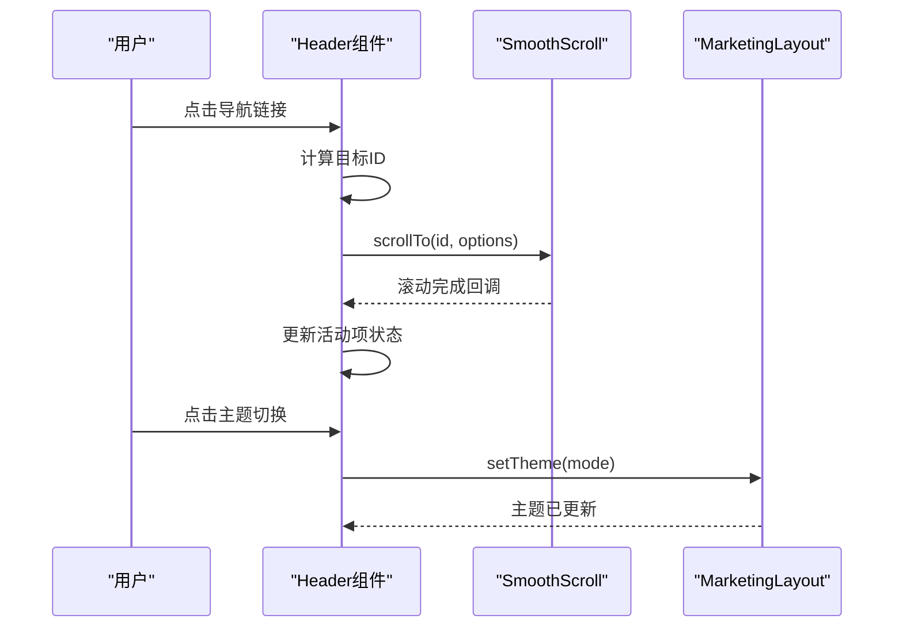
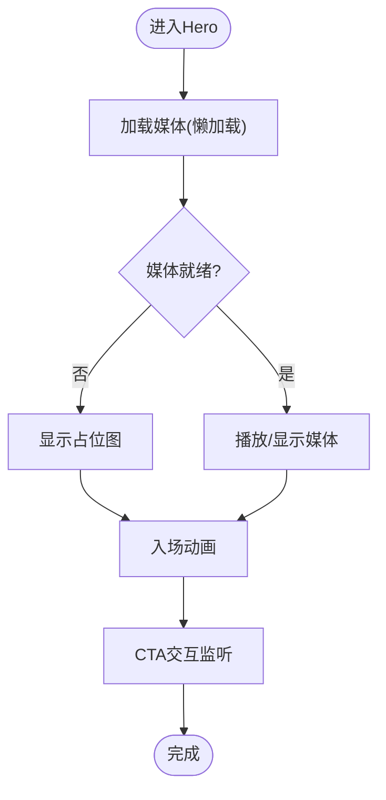
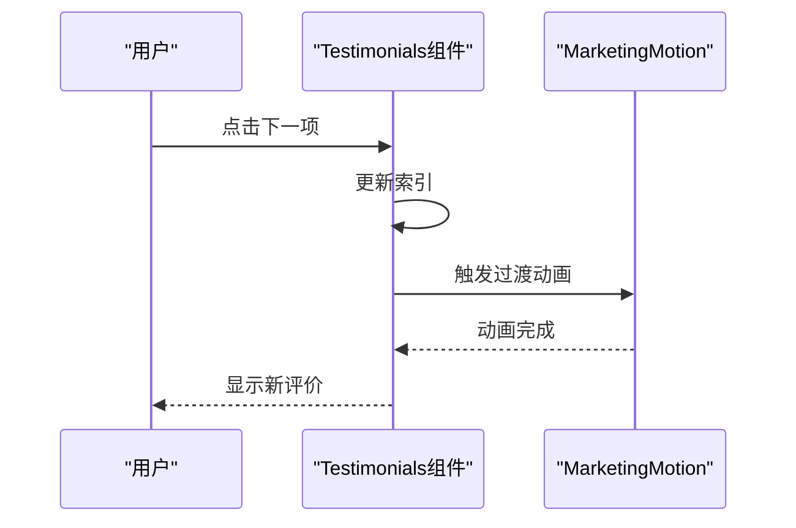
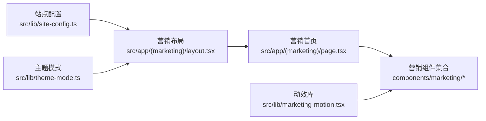

# 营销页面组件

<cite>
**本文引用的文件**   
- [src/app/(marketing)/layout.tsx](file://src/app/(marketing)/layout.tsx)
- [src/app/(marketing)/page.tsx](file://src/app/(marketing)/page.tsx)
- [src/components/marketing/header.tsx](file://src/components/marketing/header.tsx)
- [src/components/marketing/hero.tsx](file://src/components/marketing/hero.tsx)
- [src/components/marketing/pricing.tsx](file://src/components/marketing/pricing.tsx)
- [src/components/marketing/testimonials.tsx](file://src/components/marketing/testimonials.tsx)
- [src/components/marketing/footer.tsx](file://src/components/marketing/footer.tsx)
- [src/components/marketing/bottom-cta.tsx](file://src/components/marketing/bottom-cta.tsx)
- [src/components/marketing/community-gallery.tsx](file://src/components/marketing/community-gallery.tsx)
- [src/components/marketing/faq.tsx](file://src/components/marketing/faq.tsx)
- [src/components/marketing/fluid-cursor.tsx](file://src/components/marketing/fluid-cursor.tsx)
- [src/components/marketing/image-reveal.tsx](file://src/components/marketing/image-reveal.tsx)
- [src/components/marketing/launch-composer.tsx](file://src/components/marketing/launch-composer.tsx)
- [src/components/marketing/providers.tsx](file://src/components/marketing/providers.tsx)
- [src/components/marketing/showcase-cards.tsx](file://src/components/marketing/showcase-cards.tsx)
- [src/components/marketing/skip-to-content.tsx](file://src/components/marketing/skip-to-content.tsx)
- [src/components/marketing/smooth-scroll.tsx](file://src/components/marketing/smooth-scroll.tsx)
- [src/components/marketing/stats.tsx](file://src/components/marketing/stats.tsx)
- [src/components/marketing/text-reveal.tsx](file://src/components/marketing/text-reveal.tsx)
- [src/components/marketing/theme-switch.tsx](file://src/components/marketing/theme-switch.tsx)
- [src/components/marketing/tools-carousel.tsx](file://src/components/marketing/tools-carousel.tsx)
- [src/components/marketing/trusted-by.tsx](file://src/components/marketing/trusted-by.tsx)
- [src/lib/marketing-motion.tsx](file://src/lib/marketing-motion.tsx)
- [src/lib/site-config.ts](file://src/lib/site-config.ts)
- [src/lib/theme-mode.ts](file://src/lib/theme-mode.ts)
- [src/app/layout.tsx](file://src/app/layout.tsx)
- [src/app/globals.css](file://src/app/globals.css)
- [src/app/design-system.css](file://src/app/design-system.css)
- [public/site.webmanifest](file://public/site.webmanifest)
</cite>

## 目录
1. [简介](#简介)
2. [项目结构](#项目结构)
3. [核心组件](#核心组件)
4. [架构总览](#架构总览)
5. [详细组件分析](#详细组件分析)
6. [依赖关系分析](#依赖关系分析)
7. [性能考虑](#性能考虑)
8. [故障排查指南](#故障排查指南)
9. [结论](#结论)
10. [附录](#附录)

## 简介
本文件为 PurpleInk 平台的营销页面组件提供系统化文档，覆盖 Header、Hero、Pricing、Testimonials、Footer 等关键组件的实现与使用方式。内容包含视觉设计要点、动画效果与交互行为说明，响应式适配策略、SEO 优化实践与性能考量，以及组件的自定义配置、主题设置与多语言支持方法。文末提供完整的页面组装示例与最佳实践指导，帮助快速搭建高质量营销网站。

## 项目结构
营销页面位于 Next.js App Router 的 (marketing) 路由组中，由布局文件组织全局导航、主题与 SEO 元信息，主页面聚合各营销区块组件。通用 UI 与营销专用组件分别位于 components/ui 与 components/marketing，动效与站点配置集中在 lib 目录。

```mermaid
graph TB
A["应用根布局<br/>src/app/layout.tsx"] --> B["营销布局<br/>src/app/(marketing)/layout.tsx"]
B --> C["营销首页<br/>src/app/(marketing)/page.tsx"]
C --> D["头部 Header<br/>src/components/marketing/header.tsx"]
C --> E["首屏 Hero<br/>src/components/marketing/hero.tsx"]
C --> F["定价 Pricing<br/>src/components/marketing/pricing.tsx"]
C --> G["口碑 Testimonials<br/>src/components/marketing/testimonials.tsx"]
C --> H["页脚 Footer<br/>src/components/marketing/footer.tsx"]
C --> I["底部CTA BottomCTA<br/>src/components/marketing/bottom-cta.tsx"]
C --> J["社区画廊 CommunityGallery<br/>src/components/marketing/community-gallery.tsx"]
C --> K["常见问题 FAQ<br/>src/components/marketing/faq.tsx"]
C --> L["展示卡片 ShowcaseCards<br/>src/components/marketing/showcase-cards.tsx"]
C --> M["统计数据 Stats<br/>src/components/marketing/stats.tsx"]
C --> N["工具轮播 ToolsCarousel<br/>src/components/marketing/tools-carousel.tsx"]
C --> O["信任背书 TrustedBy<br/>src/components/marketing/trusted-by.tsx"]
C --> P["启动器 LaunchComposer<br/>src/components/marketing/launch-composer.tsx"]
C --> Q["图片揭示 ImageReveal<br/>src/components/marketing/image-reveal.tsx"]
C --> R["文本揭示 TextReveal<br/>src/components/marketing/text-reveal.tsx"]
C --> S["平滑滚动 SmoothScroll<br/>src/components/marketing/smooth-scroll.tsx"]
C --> T["跳过到内容 SkipToContent<br/>src/components/marketing/skip-to-content.tsx"]
C --> U["主题切换 ThemeSwitch<br/>src/components/marketing/theme-switch.tsx"]
C --> V["流体光标 FluidCursor<br/>src/components/marketing/fluid-cursor.tsx"]
C --> W["营销提供者 Providers<br/>src/components/marketing/providers.tsx"]
X["动效库<br/>src/lib/marketing-motion.tsx"] --> E
X --> Q
X --> R
Y["站点配置<br/>src/lib/site-config.ts"] --> B
Z["主题模式<br/>src/lib/theme-mode.ts"] --> B
```



图表来源
- [src/app/layout.tsx](file://src/app/layout.tsx)
- [src/app/(marketing)/layout.tsx](file://src/app/(marketing)/layout.tsx)
- [src/app/(marketing)/page.tsx](file://src/app/(marketing)/page.tsx)
- [src/components/marketing/header.tsx](file://src/components/marketing/header.tsx)
- [src/components/marketing/hero.tsx](file://src/components/marketing/hero.tsx)
- [src/components/marketing/pricing.tsx](file://src/components/marketing/pricing.tsx)
- [src/components/marketing/testimonials.tsx](file://src/components/marketing/testimonials.tsx)
- [src/components/marketing/footer.tsx](file://src/components/marketing/footer.tsx)
- [src/components/marketing/bottom-cta.tsx](file://src/components/marketing/bottom-cta.tsx)
- [src/components/marketing/community-gallery.tsx](file://src/components/marketing/community-gallery.tsx)
- [src/components/marketing/faq.tsx](file://src/components/marketing/faq.tsx)
- [src/components/marketing/showcase-cards.tsx](file://src/components/marketing/showcase-cards.tsx)
- [src/components/marketing/stats.tsx](file://src/components/marketing/stats.tsx)
- [src/components/marketing/tools-carousel.tsx](file://src/components/marketing/tools-carousel.tsx)
- [src/components/marketing/trusted-by.tsx](file://src/components/marketing/trusted-by.tsx)
- [src/components/marketing/launch-composer.tsx](file://src/components/marketing/launch-composer.tsx)
- [src/components/marketing/image-reveal.tsx](file://src/components/marketing/image-reveal.tsx)
- [src/components/marketing/text-reveal.tsx](file://src/components/marketing/text-reveal.tsx)
- [src/components/marketing/smooth-scroll.tsx](file://src/components/marketing/smooth-scroll.tsx)
- [src/components/marketing/skip-to-content.tsx](file://src/components/marketing/skip-to-content.tsx)
- [src/components/marketing/theme-switch.tsx](file://src/components/marketing/theme-switch.tsx)
- [src/components/marketing/fluid-cursor.tsx](file://src/components/marketing/fluid-cursor.tsx)
- [src/components/marketing/providers.tsx](file://src/components/marketing/providers.tsx)
- [src/lib/marketing-motion.tsx](file://src/lib/marketing-motion.tsx)
- [src/lib/site-config.ts](file://src/lib/site-config.ts)
- [src/lib/theme-mode.ts](file://src/lib/theme-mode.ts)

章节来源
- [src/app/(marketing)/layout.tsx](file://src/app/(marketing)/layout.tsx)
- [src/app/(marketing)/page.tsx](file://src/app/(marketing)/page.tsx)
- [src/lib/site-config.ts](file://src/lib/site-config.ts)
- [src/lib/theme-mode.ts](file://src/lib/theme-mode.ts)

## 核心组件
本节聚焦营销页面的核心区块：Header、Hero、Pricing、Testimonials、Footer。每个组件均具备清晰的职责边界、可配置的属性与一致的交互体验。

- Header（头部）
  - 功能：品牌标识、主导航、主题切换、移动端菜单、锚点跳转。
  - 视觉：透明背景渐变至实色、滚动吸顶、高亮当前节。
  - 交互：点击导航平滑滚动、移动端抽屉菜单、键盘可达性。
  - 响应式：小屏隐藏次要链接，汉堡菜单展开。
  - SEO：语义化 nav、aria-label、skip-link 配合。
  - 性能：懒加载非关键图标、按需渲染。

- Hero（首屏）
  - 功能：主标题、副标题、CTA 按钮、背景媒体（视频/图片）。
  - 视觉：全屏留白、强对比文案、动态背景或视差。
  - 交互：入场动画、滚动触发、CTA 跳转。
  - 响应式：字号与间距自适应，媒体占位与裁剪。
  - SEO：h1/h2 层级、alt 描述、结构化数据。
  - 性能：媒体懒加载、poster 预加载、节流动画。

- Pricing（定价）
  - 功能：套餐对比、推荐标签、CTA、FAQ 入口。
  - 视觉：卡片网格、高亮推荐项、价格数字强调。
  - 交互：悬停阴影、选中态、切换周期（月/年）。
  - 响应式：单列到多列自适应。
  - SEO：table/ul 语义、价格结构化数据。
  - 性能：静态数据内联、避免重排。

- Testimonials（口碑）
  - 功能：用户评价轮播或网格、头像、引用语。
  - 视觉：卡片化、引用样式、品牌 Logo。
  - 交互：自动轮播、手动控制、无障碍键盘操作。
  - 响应式：滑动与堆叠布局。
  - SEO：blockquote、cite、alt。
  - 性能：虚拟列表或分页加载。

- Footer（页脚）
  - 功能：版权信息、链接分组、社交图标、订阅入口。
  - 视觉：深色背景、清晰分区、弱对比文字。
  - 交互：链接跳转、订阅表单校验。
  - 响应式：多列变单列。
  - SEO：nav、a 语义、sitemap 链接。
  - 性能：静态资源缓存。

章节来源
- [src/components/marketing/header.tsx](file://src/components/marketing/header.tsx)
- [src/components/marketing/hero.tsx](file://src/components/marketing/hero.tsx)
- [src/components/marketing/pricing.tsx](file://src/components/marketing/pricing.tsx)
- [src/components/marketing/testimonials.tsx](file://src/components/marketing/testimonials.tsx)
- [src/components/marketing/footer.tsx](file://src/components/marketing/footer.tsx)

## 架构总览
营销页面采用“布局 + 页面 + 组件”的分层架构。布局负责全局上下文（主题、SEO、导航），页面聚合区块组件，组件内部封装动效与交互逻辑。站点配置集中管理文案、链接与主题变量，确保一致性与可维护性。

```mermaid
classDiagram
class MarketingLayout {
+render() JSX
+setTheme(mode)
+getMetadata() Metadata
}
class HomePage {
+render() JSX
+sections : Section[]
}
class Header {
+props : { links, logo, themeMode }
+handleNavClick(id)
+toggleMobileMenu()
}
class Hero {
+props : { title, subtitle, cta, media }
+onCtaClick()
}
class Pricing {
+props : { plans, currency, period }
+onPlanSelect(plan)
}
class Testimonials {
+props : { items, autoplay }
+next()
+prev()
}
class Footer {
+props : { links, social, copyright }
+onSubscribe(email)
}
MarketingLayout --> HomePage : "包含"
HomePage --> Header : "渲染"
HomePage --> Hero : "渲染"
HomePage --> Pricing : "渲染"
HomePage --> Testimonials : "渲染"
HomePage --> Footer : "渲染"
```

图表来源
- [src/app/(marketing)/layout.tsx](file://src/app/(marketing)/layout.tsx)
- [src/app/(marketing)/page.tsx](file://src/app/(marketing)/page.tsx)
- [src/components/marketing/header.tsx](file://src/components/marketing/header.tsx)
- [src/components/marketing/hero.tsx](file://src/components/marketing/hero.tsx)
- [src/components/marketing/pricing.tsx](file://src/components/marketing/pricing.tsx)
- [src/components/marketing/testimonials.tsx](file://src/components/marketing/testimonials.tsx)
- [src/components/marketing/footer.tsx](file://src/components/marketing/footer.tsx)

## 详细组件分析

### Header（头部）
- 职责：品牌展示、主导航、主题切换、移动端菜单、锚点定位。
- 数据结构：导航项数组（标题、链接、是否活动）、主题模式状态。
- 交互流程：点击导航 → 平滑滚动到目标节 → 更新活动项；切换主题 → 写入本地存储并更新 DOM。
- 响应式：小屏隐藏次要链接，汉堡菜单展开收起。
- 可访问性：aria-label、role="navigation"、键盘焦点顺序。
- 性能：图标与菜单延迟渲染，减少首屏负担。



图表来源
- [src/components/marketing/header.tsx](file://src/components/marketing/header.tsx)
- [src/components/marketing/smooth-scroll.tsx](file://src/components/marketing/smooth-scroll.tsx)
- [src/app/(marketing)/layout.tsx](file://src/app/(marketing)/layout.tsx)

章节来源
- [src/components/marketing/header.tsx](file://src/components/marketing/header.tsx)
- [src/components/marketing/smooth-scroll.tsx](file://src/components/marketing/smooth-scroll.tsx)
- [src/app/(marketing)/layout.tsx](file://src/app/(marketing)/layout.tsx)

### Hero（首屏）
- 职责：传达核心价值主张、引导转化、展示媒体。
- 数据结构：标题、副标题、CTA 文案与链接、媒体对象（图片/视频）。
- 动画：入场渐显、背景视差、滚动触发动画。
- 响应式：媒体裁剪与占位、字号与行高自适应。
- SEO：语义化标题、alt 描述、结构化数据。
- 性能：媒体懒加载、poster 预加载、动画节流。



图表来源
- [src/components/marketing/hero.tsx](file://src/components/marketing/hero.tsx)
- [src/lib/marketing-motion.tsx](file://src/lib/marketing-motion.tsx)

章节来源
- [src/components/marketing/hero.tsx](file://src/components/marketing/hero.tsx)
- [src/lib/marketing-motion.tsx](file://src/lib/marketing-motion.tsx)

### Pricing（定价）
- 职责：展示套餐、突出推荐项、支持周期切换。
- 数据结构：套餐数组（名称、价格、周期、特性列表、是否推荐）。
- 交互：选择套餐、切换月/年、CTA 跳转。
- 响应式：网格布局自适应。
- SEO：表格或列表语义、价格结构化数据。
- 性能：静态数据内联、避免重复计算。

```mermaid
classDiagram
class Plan {
+string name
+number price
+string period
+boolean recommended
+string[] features
}
class Pricing {
+props : { plans, currency, period }
+selectedPlan : Plan
+onPlanSelect(plan)
+togglePeriod()
}
Pricing --> Plan : "展示多个"
```

图表来源
- [src/components/marketing/pricing.tsx](file://src/components/marketing/pricing.tsx)

章节来源
- [src/components/marketing/pricing.tsx](file://src/components/marketing/pricing.tsx)

### Testimonials（口碑）
- 职责：展示用户评价，增强信任感。
- 数据结构：评价项数组（作者、头像、引用语、公司/职位）。
- 交互：自动轮播、手动切换、暂停/继续。
- 响应式：滑动与堆叠布局。
- SEO：blockquote、cite、alt。
- 性能：虚拟列表或分页加载。



图表来源
- [src/components/marketing/testimonials.tsx](file://src/components/marketing/testimonials.tsx)
- [src/lib/marketing-motion.tsx](file://src/lib/marketing-motion.tsx)

章节来源
- [src/components/marketing/testimonials.tsx](file://src/components/marketing/testimonials.tsx)
- [src/lib/marketing-motion.tsx](file://src/lib/marketing-motion.tsx)

### Footer（页脚）
- 职责：版权信息、链接分组、社交图标、订阅入口。
- 数据结构：链接数组、社交媒体对象、版权文案。
- 交互：链接跳转、订阅表单校验与提交。
- 响应式：多列变单列。
- SEO：nav、a 语义、sitemap 链接。
- 性能：静态资源缓存。

章节来源
- [src/components/marketing/footer.tsx](file://src/components/marketing/footer.tsx)

### 其他营销组件概览
- BottomCTA（底部CTA）：在页面末尾强化转化，支持文案与链接配置。
- CommunityGallery（社区画廊）：展示用户作品或案例，支持懒加载与网格布局。
- FAQ（常见问题）：手风琴式问答，提升信息获取效率。
- ShowcaseCards（展示卡片）：产品能力或亮点卡片集合。
- Stats（统计数据）：关键指标展示，支持计数动画。
- ToolsCarousel（工具轮播）：工具或集成展示，支持滑动与指示器。
- TrustedBy（信任背书）：合作伙伴或客户 Logo 墙。
- LaunchComposer（启动器）：引导新用户快速上手。
- ImageReveal（图片揭示）：滚动触发的图片揭示动效。
- TextReveal（文本揭示）：逐字或逐段揭示动画。
- SmoothScroll（平滑滚动）：统一滚动行为与锚点定位。
- SkipToContent（跳过到内容）：提升可访问性。
- ThemeSwitch（主题切换）：明暗主题切换与持久化。
- FluidCursor（流体光标）：装饰性光标效果，可选启用。
- Providers（营销提供者）：封装上下文与全局状态。

章节来源
- [src/components/marketing/bottom-cta.tsx](file://src/components/marketing/bottom-cta.tsx)
- [src/components/marketing/community-gallery.tsx](file://src/components/marketing/community-gallery.tsx)
- [src/components/marketing/faq.tsx](file://src/components/marketing/faq.tsx)
- [src/components/marketing/showcase-cards.tsx](file://src/components/marketing/showcase-cards.tsx)
- [src/components/marketing/stats.tsx](file://src/components/marketing/stats.tsx)
- [src/components/marketing/tools-carousel.tsx](file://src/components/marketing/tools-carousel.tsx)
- [src/components/marketing/trusted-by.tsx](file://src/components/marketing/trusted-by.tsx)
- [src/components/marketing/launch-composer.tsx](file://src/components/marketing/launch-composer.tsx)
- [src/components/marketing/image-reveal.tsx](file://src/components/marketing/image-reveal.tsx)
- [src/components/marketing/text-reveal.tsx](file://src/components/marketing/text-reveal.tsx)
- [src/components/marketing/smooth-scroll.tsx](file://src/components/marketing/smooth-scroll.tsx)
- [src/components/marketing/skip-to-content.tsx](file://src/components/marketing/skip-to-content.tsx)
- [src/components/marketing/theme-switch.tsx](file://src/components/marketing/theme-switch.tsx)
- [src/components/marketing/fluid-cursor.tsx](file://src/components/marketing/fluid-cursor.tsx)
- [src/components/marketing/providers.tsx](file://src/components/marketing/providers.tsx)

## 依赖关系分析
营销页面依赖站点配置与主题模式，动效库提供统一的动画能力。布局文件注入 SEO 元信息与主题上下文，页面组件通过 props 传递数据与行为。



图表来源
- [src/lib/site-config.ts](file://src/lib/site-config.ts)
- [src/lib/theme-mode.ts](file://src/lib/theme-mode.ts)
- [src/app/(marketing)/layout.tsx](file://src/app/(marketing)/layout.tsx)
- [src/app/(marketing)/page.tsx](file://src/app/(marketing)/page.tsx)
- [src/lib/marketing-motion.tsx](file://src/lib/marketing-motion.tsx)

章节来源
- [src/lib/site-config.ts](file://src/lib/site-config.ts)
- [src/lib/theme-mode.ts](file://src/lib/theme-mode.ts)
- [src/app/(marketing)/layout.tsx](file://src/app/(marketing)/layout.tsx)
- [src/app/(marketing)/page.tsx](file://src/app/(marketing)/page.tsx)
- [src/lib/marketing-motion.tsx](file://src/lib/marketing-motion.tsx)

## 性能考虑
- 媒体优化：使用 poster、懒加载、WebP/AVIF 格式、尺寸适配。
- 动画优化：节流与防抖、IntersectionObserver 触发、禁用低性能设备动画。
- 代码分割：按需导入重型组件与动效库。
- 缓存策略：静态资源与字体缓存、HTTP 缓存头。
- 可访问性：语义化标签、ARIA 属性、键盘导航。
- SEO：结构化数据、meta 描述、robots 与 sitemap。

[本节为通用指导，不直接分析具体文件]

## 故障排查指南
- 主题切换无效：检查主题模式状态与本地存储读写、DOM class 更新。
- 滚动异常：确认 SmoothScroll 初始化与锚点 ID 匹配。
- 媒体加载失败：检查路径与网络状态、降级占位图。
- 动画卡顿：降低复杂度、关闭非必要效果、检查重绘重排。
- SEO 缺失：验证 meta、结构化数据与语义标签。

章节来源
- [src/lib/theme-mode.ts](file://src/lib/theme-mode.ts)
- [src/components/marketing/smooth-scroll.tsx](file://src/components/marketing/smooth-scroll.tsx)
- [src/components/marketing/hero.tsx](file://src/components/marketing/hero.tsx)
- [src/lib/marketing-motion.tsx](file://src/lib/marketing-motion.tsx)

## 结论
PurpleInk 营销页面组件以清晰的职责划分、一致的交互体验与完善的可访问性为基础，结合动效库与站点配置实现高度可定制的营销网站。遵循本文档的最佳实践，可在保证性能与 SEO 的前提下快速构建高质量的营销页面。

[本节为总结，不直接分析具体文件]

## 附录

### 页面组装示例
- 在营销布局中注入站点配置与主题模式。
- 在主页面按顺序组合 Header、Hero、Pricing、Testimonials、Footer 等组件。
- 通过 props 配置文案、链接、媒体与动画参数。
- 使用 Providers 包裹全局上下文（如主题、国际化）。

章节来源
- [src/app/(marketing)/layout.tsx](file://src/app/(marketing)/layout.tsx)
- [src/app/(marketing)/page.tsx](file://src/app/(marketing)/page.tsx)
- [src/components/marketing/providers.tsx](file://src/components/marketing/providers.tsx)

### 主题设置与多语言支持
- 主题设置：通过主题模式切换明暗主题，持久化到本地存储。
- 多语言支持：将文案抽离到站点配置或独立 i18n 模块，组件通过 props 或上下文读取。
- 设计系统：使用 design-system.css 与 globals.css 统一管理样式变量。

章节来源
- [src/lib/theme-mode.ts](file://src/lib/theme-mode.ts)
- [src/lib/site-config.ts](file://src/lib/site-config.ts)
- [src/app/globals.css](file://src/app/globals.css)
- [src/app/design-system.css](file://src/app/design-system.css)

### SEO 优化清单
- 元信息：title、description、canonical、open graph。
- 结构化数据：Organization、Product、Review 等。
- 语义化：h1-h6 层级、nav、section、article、footer。
- 资源：alt、lazy loading、favicon 与 manifest。

章节来源
- [public/site.webmanifest](file://public/site.webmanifest)
- [src/app/(marketing)/layout.tsx](file://src/app/(marketing)/layout.tsx)