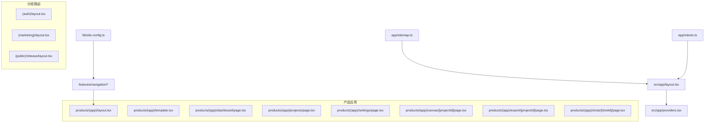
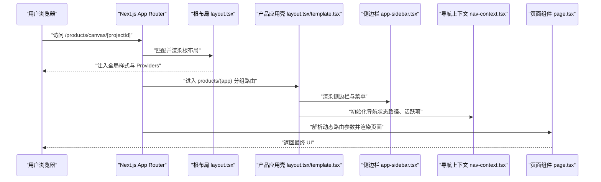
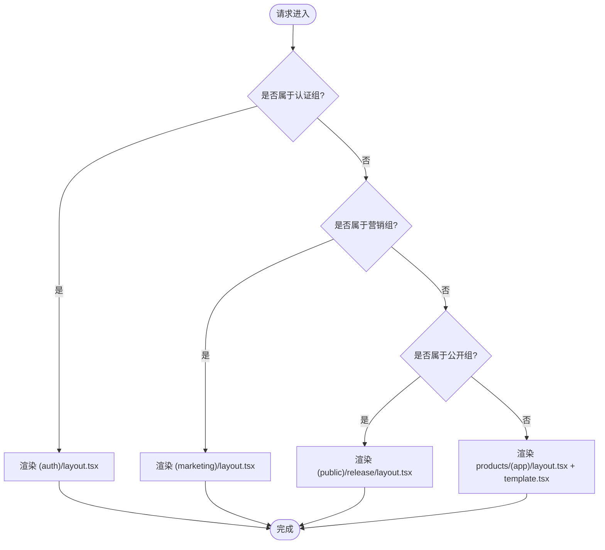
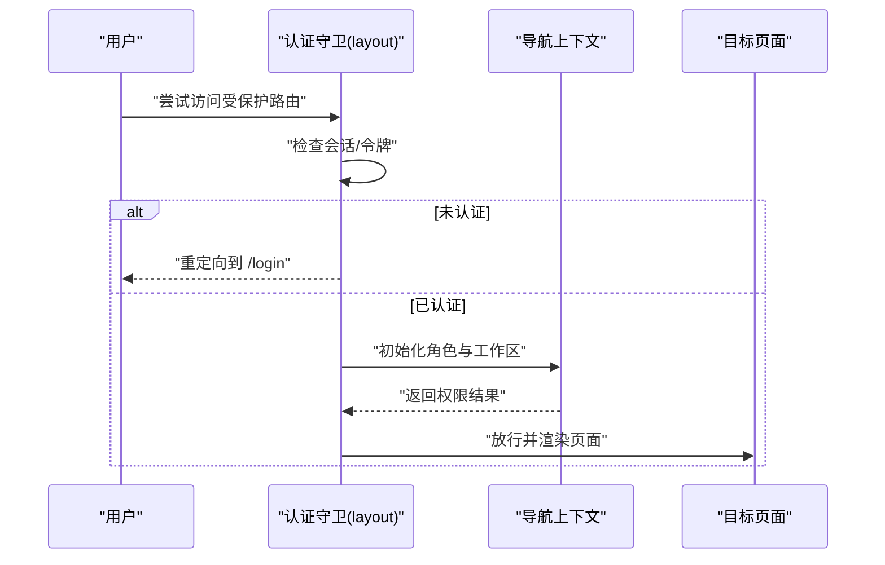
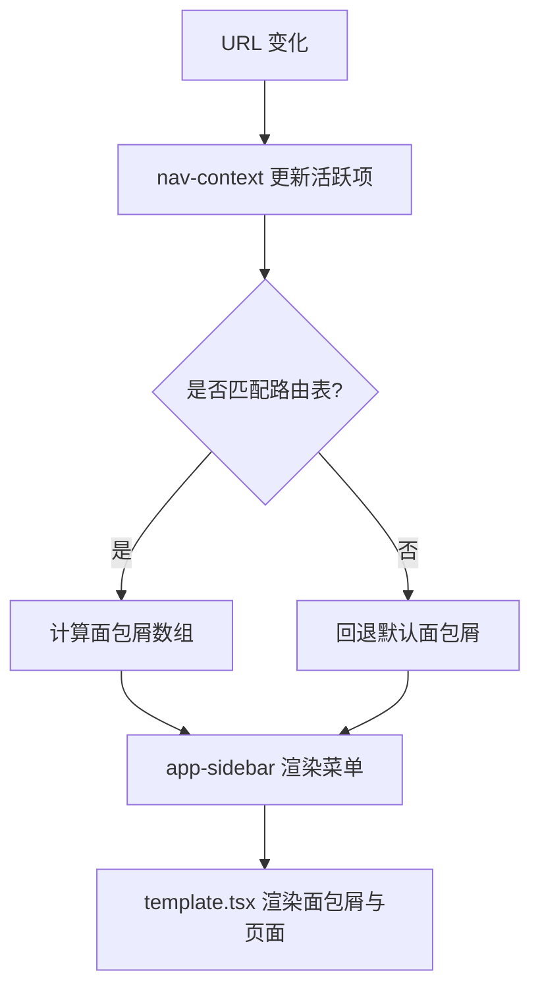
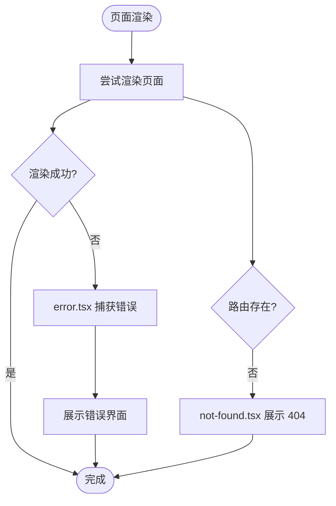
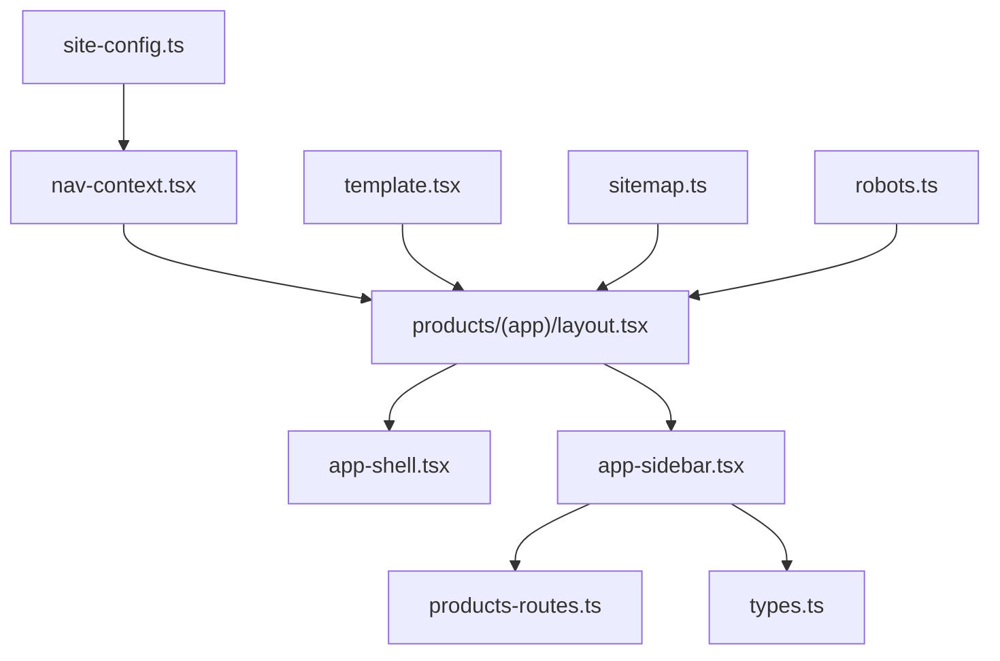

# 路由导航系统

<cite>
**本文引用的文件**   
- [src/app/layout.tsx](file://src/app/layout.tsx)
- [src/app/providers.tsx](file://src/app/providers.tsx)
- [src/app/(auth)/layout.tsx](file://src/app/(auth)/layout.tsx)
- [src/app/(marketing)/layout.tsx](file://src/app/(marketing)/layout.tsx)
- [src/app/(public)/release/layout.tsx](file://src/app/(public)/release/layout.tsx)
- [src/app/(auth)/login/page.tsx](file://src/app/(auth)/login/page.tsx)
- [src/app/(auth)/signup/page.tsx](file://src/app/(auth)/signup/page.tsx)
- [src/app/(marketing)/page.tsx](file://src/app/(marketing)/page.tsx)
- [src/app/(marketing)/community/page.tsx](file://src/app/(marketing)/community/page.tsx)
- [src/app/products/page.tsx](file://src/app/products/page.tsx)
- [src/app/products/(app)/layout.tsx](file://src/app/products/(app)/layout.tsx)
- [src/app/products/(app)/template.tsx](file://src/app/products/(app)/template.tsx)
- [src/app/products/(app)/loading.tsx](file://src/app/products/(app)/loading.tsx)
- [src/app/products/(app)/not-found.tsx](file://src/app/products/(app)/not-found.tsx)
- [src/app/products/(app)/error.tsx](file://src/app/products/(app)/error.tsx)
- [src/app/products/(app)/dashboard/page.tsx](file://src/app/products/(app)/dashboard/page.tsx)
- [src/app/products/(app)/projects/page.tsx](file://src/app/products/(app)/projects/page.tsx)
- [src/app/products/(app)/settings/page.tsx](file://src/app/products/(app)/settings/page.tsx)
- [src/app/products/(app)/canvas/[projectId]/page.tsx](file://src/app/products/(app)/canvas/[projectId]/page.tsx)
- [src/app/products/(app)/export/[projectId]/page.tsx](file://src/app/products/(app)/export/[projectId]/page.tsx)
- [src/app/products/(app)/shots/[shotId]/page.tsx](file://src/app/products/(app)/shots/[shotId]/page.tsx)
- [src/features/navigation/nav-context.tsx](file://src/features/navigation/nav-context.tsx)
- [src/features/navigation/app-sidebar.tsx](file://src/features/navigation/app-sidebar.tsx)
- [src/features/navigation/app-shell.tsx](file://src/features/navigation/app-shell.tsx)
- [src/features/navigation/app-sidebar-shell.tsx](file://src/features/navigation/app-sidebar-shell.tsx)
- [src/features/navigation/products-routes.ts](file://src/features/navigation/products-routes.ts)
- [src/features/navigation/types.ts](file://src/features/navigation/types.ts)
- [src/lib/site-config.ts](file://src/lib/site-config.ts)
- [src/app/sitemap.ts](file://src/app/sitemap.ts)
- [src/app/robots.ts](file://src/app/robots.ts)
- [next.config.ts](file://next.config.ts)
</cite>

## 目录
1. [简介](#简介)
2. [项目结构](#项目结构)
3. [核心组件](#核心组件)
4. [架构总览](#架构总览)
5. [详细组件分析](#详细组件分析)
6. [依赖关系分析](#依赖关系分析)
7. [性能考量](#性能考量)
8. [故障排查指南](#故障排查指南)
9. [结论](#结论)
10. [附录](#附录)

## 简介
本文件为 PurpleInK 平台的路由导航系统文档，聚焦于基于 Next.js App Router 的路由组织与实现。内容涵盖分组路由、动态路由、嵌套路由的设计模式；认证守卫、权限控制与路由拦截机制；导航状态管理、面包屑生成与菜单渲染逻辑；以及路由懒加载、代码分割与性能优化策略。同时提供多租户与工作区隔离的实践建议、移动端适配、SEO 优化与 URL 结构设计最佳实践。

## 项目结构
PurpleInK 采用 Next.js App Router 的目录即路由约定：
- 根布局与全局提供者位于 src/app 下的 layout.tsx 与 providers.tsx
- 业务域通过分组路由进行划分：(auth)、(marketing)、(public)、products
- 产品应用域 products/(app) 作为主应用壳，包含 dashboard、projects、settings、canvas、export、shots 等页面
- 动态路由使用方括号命名，如 [projectId]、[shotId]
- 导航相关能力集中在 features/navigation 模块，提供上下文、侧边栏、应用壳与路由定义



图表来源
- [src/app/layout.tsx](file://src/app/layout.tsx)
- [src/app/providers.tsx](file://src/app/providers.tsx)
- [src/app/(auth)/layout.tsx](file://src/app/(auth)/layout.tsx)
- [src/app/(marketing)/layout.tsx](file://src/app/(marketing)/layout.tsx)
- [src/app/(public)/release/layout.tsx](file://src/app/(public)/release/layout.tsx)
- [src/app/products/(app)/layout.tsx](file://src/app/products/(app)/layout.tsx)
- [src/app/products/(app)/template.tsx](file://src/app/products/(app)/template.tsx)
- [src/app/products/(app)/dashboard/page.tsx](file://src/app/products/(app)/dashboard/page.tsx)
- [src/app/products/(app)/projects/page.tsx](file://src/app/products/(app)/projects/page.tsx)
- [src/app/products/(app)/settings/page.tsx](file://src/app/products/(app)/settings/page.tsx)
- [src/app/products/(app)/canvas/[projectId]/page.tsx](file://src/app/products/(app)/canvas/[projectId]/page.tsx)
- [src/app/products/(app)/export/[projectId]/page.tsx](file://src/app/products/(app)/export/[projectId]/page.tsx)
- [src/app/products/(app)/shots/[shotId]/page.tsx](file://src/app/products/(app)/shots/[shotId]/page.tsx)
- [src/features/navigation/app-sidebar.tsx](file://src/features/navigation/app-sidebar.tsx)
- [src/lib/site-config.ts](file://src/lib/site-config.ts)
- [src/app/sitemap.ts](file://src/app/sitemap.ts)
- [src/app/robots.ts](file://src/app/robots.ts)

章节来源
- [src/app/layout.tsx](file://src/app/layout.tsx)
- [src/app/providers.tsx](file://src/app/providers.tsx)
- [src/app/(auth)/layout.tsx](file://src/app/(auth)/layout.tsx)
- [src/app/(marketing)/layout.tsx](file://src/app/(marketing)/layout.tsx)
- [src/app/(public)/release/layout.tsx](file://src/app/(public)/release/layout.tsx)
- [src/app/products/(app)/layout.tsx](file://src/app/products/(app)/layout.tsx)
- [src/app/products/(app)/template.tsx](file://src/app/products/(app)/template.tsx)
- [src/app/products/(app)/dashboard/page.tsx](file://src/app/products/(app)/dashboard/page.tsx)
- [src/app/products/(app)/projects/page.tsx](file://src/app/products/(app)/projects/page.tsx)
- [src/app/products/(app)/settings/page.tsx](file://src/app/products/(app)/settings/page.tsx)
- [src/app/products/(app)/canvas/[projectId]/page.tsx](file://src/app/products/(app)/canvas/[projectId]/page.tsx)
- [src/app/products/(app)/export/[projectId]/page.tsx](file://src/app/products/(app)/export/[projectId]/page.tsx)
- [src/app/products/(app)/shots/[shotId]/page.tsx](file://src/app/products/(app)/shots/[shotId]/page.tsx)
- [src/features/navigation/app-sidebar.tsx](file://src/features/navigation/app-sidebar.tsx)
- [src/lib/site-config.ts](file://src/lib/site-config.ts)
- [src/app/sitemap.ts](file://src/app/sitemap.ts)
- [src/app/robots.ts](file://src/app/robots.ts)

## 核心组件
- 应用壳与布局
  - 根布局负责全局样式、元数据注入与通用 Provider 挂载
  - 产品应用壳 products/(app)/layout.tsx 与 template.tsx 承载侧边栏、顶部栏、面包屑与页面容器
- 导航上下文与状态
  - nav-context.tsx 提供当前路径、活跃项、展开状态等导航状态
  - app-sidebar.tsx 与 app-sidebar-shell.tsx 渲染侧边栏菜单与折叠面板
  - app-shell.tsx 组合应用壳与导航上下文
- 路由定义与站点配置
  - products-routes.ts 集中定义产品域路由表（含角色、可见性、工作区）
  - site-config.ts 提供站点级元信息与 SEO 配置
- SEO 与索引
  - sitemap.ts 与 robots.ts 生成站点地图与爬虫规则

章节来源
- [src/app/layout.tsx](file://src/app/layout.tsx)
- [src/app/providers.tsx](file://src/app/providers.tsx)
- [src/app/products/(app)/layout.tsx](file://src/app/products/(app)/layout.tsx)
- [src/app/products/(app)/template.tsx](file://src/app/products/(app)/template.tsx)
- [src/features/navigation/nav-context.tsx](file://src/features/navigation/nav-context.tsx)
- [src/features/navigation/app-sidebar.tsx](file://src/features/navigation/app-sidebar.tsx)
- [src/features/navigation/app-sidebar-shell.tsx](file://src/features/navigation/app-sidebar-shell.tsx)
- [src/features/navigation/app-shell.tsx](file://src/features/navigation/app-shell.tsx)
- [src/features/navigation/products-routes.ts](file://src/features/navigation/products-routes.ts)
- [src/lib/site-config.ts](file://src/lib/site-config.ts)
- [src/app/sitemap.ts](file://src/app/sitemap.ts)
- [src/app/robots.ts](file://src/app/robots.ts)

## 架构总览
下图展示了从浏览器请求到页面渲染的整体流程，包括分组路由选择、应用壳装配、导航上下文初始化、侧边栏与面包屑渲染，以及动态路由参数解析。



图表来源
- [src/app/layout.tsx](file://src/app/layout.tsx)
- [src/app/products/(app)/layout.tsx](file://src/app/products/(app)/layout.tsx)
- [src/app/products/(app)/template.tsx](file://src/app/products/(app)/template.tsx)
- [src/features/navigation/app-sidebar.tsx](file://src/features/navigation/app-sidebar.tsx)
- [src/features/navigation/nav-context.tsx](file://src/features/navigation/nav-context.tsx)
- [src/app/products/(app)/canvas/[projectId]/page.tsx](file://src/app/products/(app)/canvas/[projectId]/page.tsx)

## 详细组件分析

### 分组路由与布局
- (auth) 分组用于登录/注册等认证相关页面，通常配合认证守卫与重定向
- (marketing) 分组用于营销与公共信息页，强调 SEO 与可分享性
- (public) 分组用于无需鉴权的公开资源或发布页
- products/(app) 分组作为主应用壳，统一侧边栏、顶部栏、面包屑与错误处理



图表来源
- [src/app/(auth)/layout.tsx](file://src/app/(auth)/layout.tsx)
- [src/app/(marketing)/layout.tsx](file://src/app/(marketing)/layout.tsx)
- [src/app/(public)/release/layout.tsx](file://src/app/(public)/release/layout.tsx)
- [src/app/products/(app)/layout.tsx](file://src/app/products/(app)/layout.tsx)
- [src/app/products/(app)/template.tsx](file://src/app/products/(app)/template.tsx)

章节来源
- [src/app/(auth)/layout.tsx](file://src/app/(auth)/layout.tsx)
- [src/app/(marketing)/layout.tsx](file://src/app/(marketing)/layout.tsx)
- [src/app/(public)/release/layout.tsx](file://src/app/(public)/release/layout.tsx)
- [src/app/products/(app)/layout.tsx](file://src/app/products/(app)/layout.tsx)
- [src/app/products/(app)/template.tsx](file://src/app/products/(app)/template.tsx)

### 动态路由与参数解析
- 动态段使用方括号命名，例如 canvas/[projectId]、export/[projectId]、shots/[shotId]
- 页面组件通过 Next.js 提供的参数获取接口读取路由参数，并进行校验与数据加载
- 建议在模板层对参数进行默认值与类型约束，提升健壮性

```mermaid
classDiagram
class CanvasPage {
"+projectId : string"
"+onMount() : void"
"-validateParams(params) : boolean"
}
class ExportPage {
"+projectId : string"
"+onMount() : void"
"-validateParams(params) : boolean"
}
class ShotPage {
"+shotId : string"
"+onMount() : void"
"-validateParams(params) : boolean"
}
CanvasPage <|-- ExportPage : "共享参数校验模式"
CanvasPage <|-- ShotPage : "共享参数校验模式"
```

图表来源
- [src/app/products/(app)/canvas/[projectId]/page.tsx](file://src/app/products/(app)/canvas/[projectId]/page.tsx)
- [src/app/products/(app)/export/[projectId]/page.tsx](file://src/app/products/(app)/export/[projectId]/page.tsx)
- [src/app/products/(app)/shots/[shotId]/page.tsx](file://src/app/products/(app)/shots/[shotId]/page.tsx)

章节来源
- [src/app/products/(app)/canvas/[projectId]/page.tsx](file://src/app/products/(app)/canvas/[projectId]/page.tsx)
- [src/app/products/(app)/export/[projectId]/page.tsx](file://src/app/products/(app)/export/[projectId]/page.tsx)
- [src/app/products/(app)/shots/[shotId]/page.tsx](file://src/app/products/(app)/shots/[shotId]/page.tsx)

### 认证守卫与权限控制
- 在 (auth) 分组布局中实现认证守卫：未登录时重定向至登录页，已登录时允许访问受保护路由
- 在 products/(app) 应用壳内结合用户角色与工作区上下文，控制菜单可见性与页面访问
- 建议在导航上下文中维护当前用户角色与工作区 ID，并在路由切换前进行权限校验



图表来源
- [src/app/(auth)/layout.tsx](file://src/app/(auth)/layout.tsx)
- [src/app/(auth)/login/page.tsx](file://src/app/(auth)/login/page.tsx)
- [src/app/(auth)/signup/page.tsx](file://src/app/(auth)/signup/page.tsx)
- [src/features/navigation/nav-context.tsx](file://src/features/navigation/nav-context.tsx)

章节来源
- [src/app/(auth)/layout.tsx](file://src/app/(auth)/layout.tsx)
- [src/app/(auth)/login/page.tsx](file://src/app/(auth)/login/page.tsx)
- [src/app/(auth)/signup/page.tsx](file://src/app/(auth)/signup/page.tsx)
- [src/features/navigation/nav-context.tsx](file://src/features/navigation/nav-context.tsx)

### 导航状态管理与面包屑生成
- 导航上下文维护当前路径、活跃菜单项、折叠状态与面包屑数组
- 侧边栏根据路由表与用户角色渲染菜单，支持分组与折叠
- 面包屑由路径段与路由表映射生成，便于用户快速定位



图表来源
- [src/features/navigation/nav-context.tsx](file://src/features/navigation/nav-context.tsx)
- [src/features/navigation/app-sidebar.tsx](file://src/features/navigation/app-sidebar.tsx)
- [src/app/products/(app)/template.tsx](file://src/app/products/(app)/template.tsx)
- [src/features/navigation/products-routes.ts](file://src/features/navigation/products-routes.ts)

章节来源
- [src/features/navigation/nav-context.tsx](file://src/features/navigation/nav-context.tsx)
- [src/features/navigation/app-sidebar.tsx](file://src/features/navigation/app-sidebar.tsx)
- [src/app/products/(app)/template.tsx](file://src/app/products/(app)/template.tsx)
- [src/features/navigation/products-routes.ts](file://src/features/navigation/products-routes.ts)

### 菜单渲染与路由表
- products-routes.ts 定义路由表，包含路径、标题、图标、角色限制与工作区范围
- app-sidebar.tsx 遍历路由表，按角色过滤并渲染菜单项
- 支持多级菜单与折叠面板，提升复杂应用的导航体验

```mermaid
classDiagram
class RouteItem {
"+path : string"
"+title : string"
"+icon : string"
"+roles : string[]"
"+workspaces : string[]"
}
class Sidebar {
"+routes : RouteItem[]"
"+activePath : string"
"+renderMenu() : JSX"
}
Sidebar --> RouteItem : "遍历与过滤"
```

图表来源
- [src/features/navigation/products-routes.ts](file://src/features/navigation/products-routes.ts)
- [src/features/navigation/app-sidebar.tsx](file://src/features/navigation/app-sidebar.tsx)
- [src/features/navigation/types.ts](file://src/features/navigation/types.ts)

章节来源
- [src/features/navigation/products-routes.ts](file://src/features/navigation/products-routes.ts)
- [src/features/navigation/app-sidebar.tsx](file://src/features/navigation/app-sidebar.tsx)
- [src/features/navigation/types.ts](file://src/features/navigation/types.ts)

### 错误与未找到处理
- products/(app)/error.tsx 捕获应用壳内的运行时错误
- not-found.tsx 处理未匹配路由，提供友好的 404 页面
- loading.tsx 提供骨架屏与加载提示，改善用户体验



图表来源
- [src/app/products/(app)/error.tsx](file://src/app/products/(app)/error.tsx)
- [src/app/products/(app)/not-found.tsx](file://src/app/products/(app)/not-found.tsx)
- [src/app/products/(app)/loading.tsx](file://src/app/products/(app)/loading.tsx)

章节来源
- [src/app/products/(app)/error.tsx](file://src/app/products/(app)/error.tsx)
- [src/app/products/(app)/not-found.tsx](file://src/app/products/(app)/not-found.tsx)
- [src/app/products/(app)/loading.tsx](file://src/app/products/(app)/loading.tsx)

### 多租户与工作区隔离
- 路由表中的 workspaces 字段可用于限定特定工作区的访问权限
- 导航上下文在工作区切换时更新当前工作区 ID，影响菜单可见性与数据加载
- 建议在 API 调用与数据查询中始终携带工作区上下文，确保数据隔离

章节来源
- [src/features/navigation/products-routes.ts](file://src/features/navigation/products-routes.ts)
- [src/features/navigation/nav-context.tsx](file://src/features/navigation/nav-context.tsx)

### 移动端适配与响应式
- 侧边栏在移动端应支持抽屉式展开与遮罩关闭
- 面包屑在小屏幕下简化显示，避免溢出
- 建议使用媒体查询与组件级响应式逻辑，保证不同设备上的可用性

章节来源
- [src/features/navigation/app-sidebar.tsx](file://src/features/navigation/app-sidebar.tsx)
- [src/app/products/(app)/template.tsx](file://src/app/products/(app)/template.tsx)

### SEO 优化与 URL 设计
- sitemap.ts 与 robots.ts 提供站点地图与爬虫规则，提升搜索引擎收录
- 每个页面应设置合适的元数据（标题、描述、Open Graph），提高分享效果
- URL 结构遵循语义化原则，避免过长与冗余参数

章节来源
- [src/app/sitemap.ts](file://src/app/sitemap.ts)
- [src/app/robots.ts](file://src/app/robots.ts)
- [src/lib/site-config.ts](file://src/lib/site-config.ts)

## 依赖关系分析
- 应用壳依赖导航上下文与侧边栏组件
- 侧边栏依赖路由表与类型定义
- 页面组件依赖动态路由参数与业务服务
- SEO 配置与站点配置被布局与页面共同引用



图表来源
- [src/app/products/(app)/layout.tsx](file://src/app/products/(app)/layout.tsx)
- [src/features/navigation/app-shell.tsx](file://src/features/navigation/app-shell.tsx)
- [src/features/navigation/app-sidebar.tsx](file://src/features/navigation/app-sidebar.tsx)
- [src/features/navigation/products-routes.ts](file://src/features/navigation/products-routes.ts)
- [src/features/navigation/types.ts](file://src/features/navigation/types.ts)
- [src/features/navigation/nav-context.tsx](file://src/features/navigation/nav-context.tsx)
- [src/app/products/(app)/template.tsx](file://src/app/products/(app)/template.tsx)
- [src/lib/site-config.ts](file://src/lib/site-config.ts)
- [src/app/sitemap.ts](file://src/app/sitemap.ts)
- [src/app/robots.ts](file://src/app/robots.ts)

章节来源
- [src/app/products/(app)/layout.tsx](file://src/app/products/(app)/layout.tsx)
- [src/features/navigation/app-shell.tsx](file://src/features/navigation/app-shell.tsx)
- [src/features/navigation/app-sidebar.tsx](file://src/features/navigation/app-sidebar.tsx)
- [src/features/navigation/products-routes.ts](file://src/features/navigation/products-routes.ts)
- [src/features/navigation/types.ts](file://src/features/navigation/types.ts)
- [src/features/navigation/nav-context.tsx](file://src/features/navigation/nav-context.tsx)
- [src/app/products/(app)/template.tsx](file://src/app/products/(app)/template.tsx)
- [src/lib/site-config.ts](file://src/lib/site-config.ts)
- [src/app/sitemap.ts](file://src/app/sitemap.ts)
- [src/app/robots.ts](file://src/app/robots.ts)

## 性能考量
- 路由懒加载与代码分割
  - 使用 Next.js 的动态导入与 Suspense 对重型页面进行按需加载
  - 将侧边栏与面包屑等通用组件拆分为独立模块，减少首屏体积
- 缓存与预取
  - 对常用路由进行预取与缓存，缩短二次访问延迟
  - 利用 Next.js 的数据获取策略（服务端渲染/静态生成）优化关键路径
- 构建优化
  - 合理配置 next.config.ts，启用 Tree Shaking 与压缩
  - 避免在布局中引入不必要的依赖，降低包大小

章节来源
- [next.config.ts](file://next.config.ts)
- [src/app/products/(app)/template.tsx](file://src/app/products/(app)/template.tsx)
- [src/features/navigation/app-sidebar.tsx](file://src/features/navigation/app-sidebar.tsx)

## 故障排查指南
- 常见问题
  - 动态路由参数缺失导致页面无法渲染：检查页面组件的参数校验与默认值
  - 认证守卫重定向循环：确认会话状态与重定向条件是否正确
  - 菜单不显示：核对路由表的角色与工作区配置是否与当前上下文匹配
- 调试建议
  - 在导航上下文中打印当前路径与活跃项，验证状态更新
  - 使用浏览器开发者工具查看网络请求与路由匹配情况
  - 检查 error.tsx 与 not-found.tsx 的错误边界覆盖范围

章节来源
- [src/app/products/(app)/canvas/[projectId]/page.tsx](file://src/app/products/(app)/canvas/[projectId]/page.tsx)
- [src/app/(auth)/layout.tsx](file://src/app/(auth)/layout.tsx)
- [src/features/navigation/products-routes.ts](file://src/features/navigation/products-routes.ts)
- [src/features/navigation/nav-context.tsx](file://src/features/navigation/nav-context.tsx)
- [src/app/products/(app)/error.tsx](file://src/app/products/(app)/error.tsx)
- [src/app/products/(app)/not-found.tsx](file://src/app/products/(app)/not-found.tsx)

## 结论
PurpleInK 的路由导航系统基于 Next.js App Router 实现了清晰的分组路由、灵活的动态路由与稳定的应用壳架构。通过统一的导航上下文与侧边栏渲染，提供了良好的用户体验与可扩展性。结合认证守卫、权限控制与多租户隔离，满足了复杂业务场景的需求。在性能与 SEO 方面，通过懒加载、代码分割与站点配置进一步优化了整体质量。建议持续完善错误边界与监控，以提升系统的稳定性与维护性。

## 附录
- 示例路由配置参考
  - 产品应用首页：products/page.tsx
  - 仪表板：products/(app)/dashboard/page.tsx
  - 项目管理：products/(app)/projects/page.tsx
  - 设置页：products/(app)/settings/page.tsx
  - 画布编辑：products/(app)/canvas/[projectId]/page.tsx
  - 导出中心：products/(app)/export/[projectId]/page.tsx
  - 镜头详情：products/(app)/shots/[shotId]/page.tsx

章节来源
- [src/app/products/page.tsx](file://src/app/products/page.tsx)
- [src/app/products/(app)/dashboard/page.tsx](file://src/app/products/(app)/dashboard/page.tsx)
- [src/app/products/(app)/projects/page.tsx](file://src/app/products/(app)/projects/page.tsx)
- [src/app/products/(app)/settings/page.tsx](file://src/app/products/(app)/settings/page.tsx)
- [src/app/products/(app)/canvas/[projectId]/page.tsx](file://src/app/products/(app)/canvas/[projectId]/page.tsx)
- [src/app/products/(app)/export/[projectId]/page.tsx](file://src/app/products/(app)/export/[projectId]/page.tsx)
- [src/app/products/(app)/shots/[shotId]/page.tsx](file://src/app/products/(app)/shots/[shotId]/page.tsx)