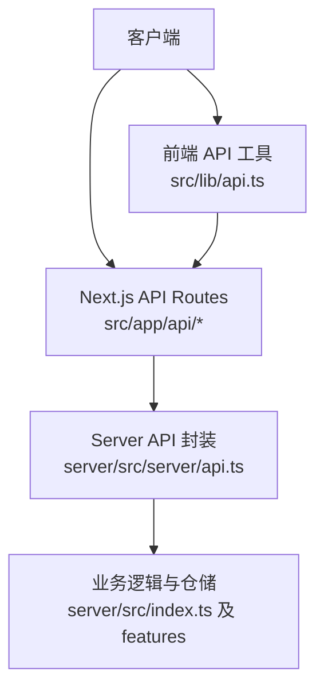
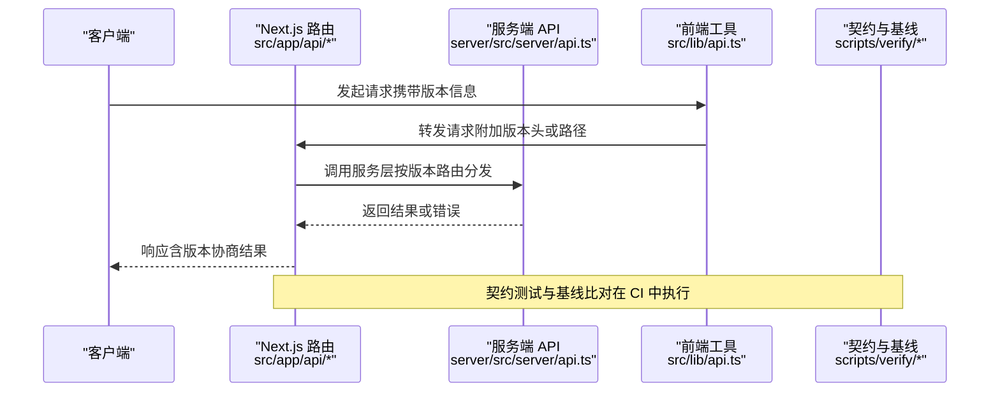
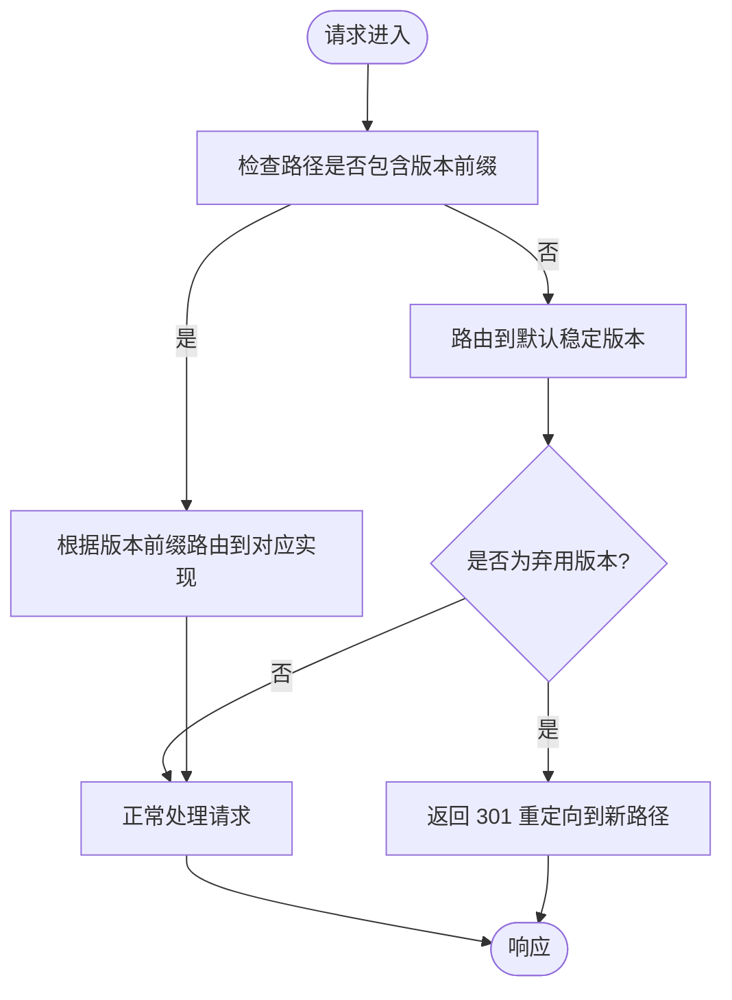
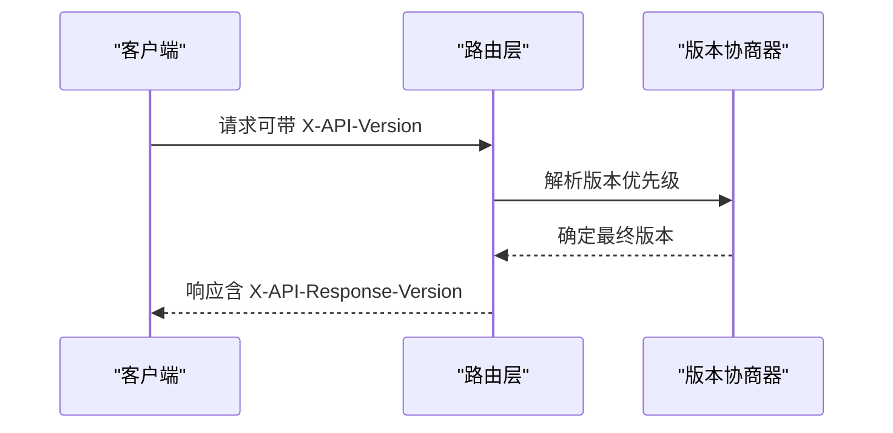
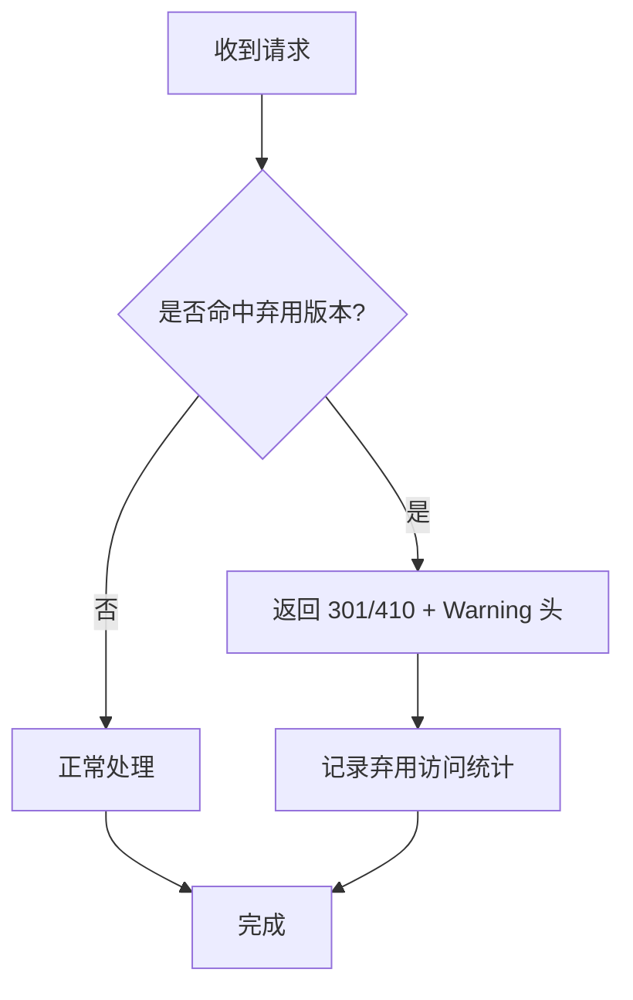
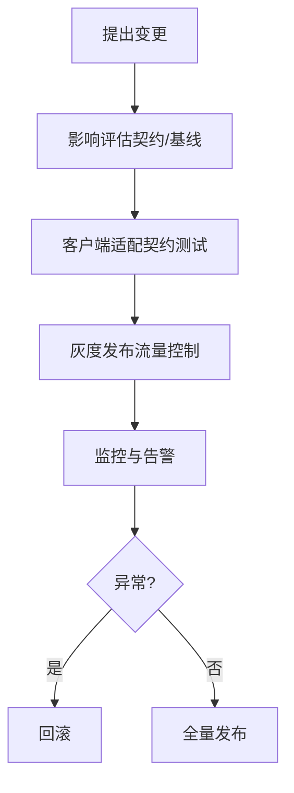
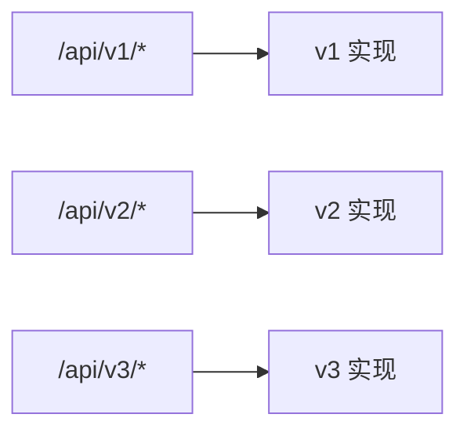
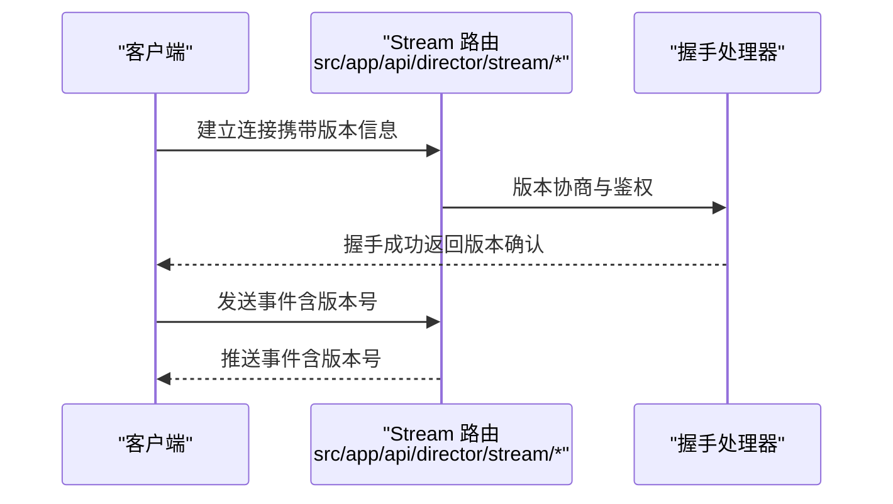
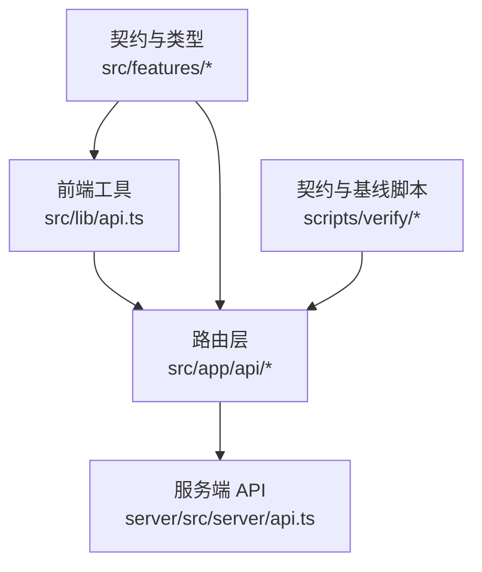

# API 版本管理与兼容性

<cite>
**本文引用的文件**   
- [src/app/api/artifacts/[id]/route.ts](file://src/app/api/artifacts/%5Bid%5D/route.ts)
- [src/app/api/director/pipeline/route.ts](file://src/app/api/director/pipeline/route.ts)
- [src/app/api/director/stage/route.ts](file://src/app/api/director/stage/route.ts)
- [src/app/api/director/stream/[nodeId]/route.ts](file://src/app/api/director/stream/%5BnodeId%5D/route.ts)
- [src/app/api/director/stream/project/[projectId]/route.ts](file://src/app/api/director/stream/project/%5BprojectId%5D/route.ts)
- [src/app/api/jobs/[id]/route.ts](file://src/app/api/jobs/%5Bid%5D/route.ts)
- [src/app/api/projects/route.ts](file://src/app/api/projects/route.ts)
- [src/app/api/projects/[id]/route.ts](file://src/app/api/projects/%5Bid%5D/route.ts)
- [src/app/api/render/route.ts](file://src/app/api/render/route.ts)
- [src/app/api/render/export/route.ts](file://src/app/api/render/export/route.ts)
- [src/app/api/settings/route.ts](file://src/app/api/settings/route.ts)
- [server/src/server/api.ts](file://server/src/server/api.ts)
- [server/src/index.ts](file://server/src/index.ts)
- [src/lib/api.ts](file://src/lib/api.ts)
- [src/features/canvas/contracts.ts](file://src/features/canvas/contracts.ts)
- [src/features/render/types.ts](file://src/features/render/types.ts)
- [tests/app-route-contract.test.tsx](file://tests/app-route-contract.test.tsx)
- [tests/dependency-contract.test.ts](file://tests/dependency-contract.test.ts)
- [scripts/verify/v3-architecture.ts](file://scripts/verify/v3-architecture.ts)
- [scripts/verify/v3-architecture-baseline.json](file://scripts/verify/v3-architecture-baseline.json)
- [scripts/verify/capture-v3-baseline.ts](file://scripts/verify/capture-v3-baseline.ts)
</cite>

## 目录
1. [简介](#简介)
2. [项目结构](#项目结构)
3. [核心组件](#核心组件)
4. [架构总览](#架构总览)
5. [详细组件分析](#详细组件分析)
6. [依赖分析](#依赖分析)
7. [性能考虑](#性能考虑)
8. [故障排查指南](#故障排查指南)
9. [结论](#结论)
10. [附录](#附录)

## 简介
本文件为 PurpleInK 平台制定“API 版本管理与兼容性”规范与落地方案，覆盖以下目标：
- 明确 API 版本策略：URL 路径版本化、头部版本控制、向后兼容保证。
- 废弃接口处理流程：迁移指引、过渡期支持、自动重定向与降级响应。
- 变更管理流程：影响评估、客户端适配、灰度发布与回滚策略。
- 多版本并存示例：如何在同一服务中维护 v1/v2/v3 等并行端点。
- 版本兼容性测试与自动化检测：契约测试、基线比对、端到端冒烟。

## 项目结构
PurpleInK 采用 Next.js App Router 组织 API 路由（src/app/api/*），服务端能力由 server 模块提供（server/src）。关键位置如下：
- API 路由层：src/app/api/* 下的各 route.ts 文件定义 REST/流式接口。
- 服务端入口与统一 API 封装：server/src/index.ts、server/src/server/api.ts。
- 前端通用 API 工具：src/lib/api.ts。
- 领域契约与类型：src/features/canvas/contracts.ts、src/features/render/types.ts。
- 契约与基线验证脚本：scripts/verify/*。

**图表来源** 
- [src/app/api/projects/route.ts](file://src/app/api/projects/route.ts)
- [server/src/server/api.ts](file://server/src/server/api.ts)
- [server/src/index.ts](file://server/src/index.ts)
- [src/lib/api.ts](file://src/lib/api.ts)

**章节来源**
- [src/app/api/projects/route.ts](file://src/app/api/projects/route.ts)
- [server/src/server/api.ts](file://server/src/server/api.ts)
- [server/src/index.ts](file://server/src/index.ts)
- [src/lib/api.ts](file://src/lib/api.ts)

## 核心组件
- API 路由层（Next.js）：按资源划分目录，如 artifacts、director、jobs、projects、render、settings。每个路由文件负责请求解析、鉴权、参数校验、调用服务层并返回响应。
- 服务端 API 封装：集中处理跨切面关注点（日志、错误、重试、限流等），供路由层复用。
- 前端 API 工具：统一封装请求头、错误处理、版本协商、重试与缓存策略。
- 领域契约与类型：以 TypeScript 类型和契约文件约束输入输出，确保前后端一致性。

**章节来源**
- [src/app/api/artifacts/[id]/route.ts](file://src/app/api/artifacts/%5Bid%5D/route.ts)
- [src/app/api/director/pipeline/route.ts](file://src/app/api/director/pipeline/route.ts)
- [src/app/api/director/stage/route.ts](file://src/app/api/director/stage/route.ts)
- [src/app/api/director/stream/[nodeId]/route.ts](file://src/app/api/director/stream/%5BnodeId%5D/route.ts)
- [src/app/api/director/stream/project/[projectId]/route.ts](file://src/app/api/director/stream/project/%5BprojectId%5D/route.ts)
- [src/app/api/jobs/[id]/route.ts](file://src/app/api/jobs/%5Bid%5D/route.ts)
- [src/app/api/projects/route.ts](file://src/app/api/projects/route.ts)
- [src/app/api/projects/[id]/route.ts](file://src/app/api/projects/%5Bid%5D/route.ts)
- [src/app/api/render/route.ts](file://src/app/api/render/route.ts)
- [src/app/api/render/export/route.ts](file://src/app/api/render/export/route.ts)
- [src/app/api/settings/route.ts](file://src/app/api/settings/route.ts)
- [server/src/server/api.ts](file://server/src/server/api.ts)
- [server/src/index.ts](file://server/src/index.ts)
- [src/lib/api.ts](file://src/lib/api.ts)
- [src/features/canvas/contracts.ts](file://src/features/canvas/contracts.ts)
- [src/features/render/types.ts](file://src/features/render/types.ts)

## 架构总览
API 版本管理的整体架构围绕“路由层 + 服务端封装 + 前端工具 + 契约与基线”四层展开，通过版本协商与契约保障实现稳定演进。

**图表来源** 
- [src/app/api/projects/route.ts](file://src/app/api/projects/route.ts)
- [server/src/server/api.ts](file://server/src/server/api.ts)
- [src/lib/api.ts](file://src/lib/api.ts)
- [scripts/verify/v3-architecture.ts](file://scripts/verify/v3-architecture.ts)

## 详细组件分析

### URL 路径版本化策略
- 规则：所有对外 API 使用 /api/vN/... 的路径前缀进行版本化，例如 /api/v1/projects、/api/v2/projects。
- 路由组织：在 src/app/api 下按资源与版本创建目录，如 api/v1/projects/route.ts、api/v2/projects/route.ts。
- 默认行为：未指定版本时，优先路由到当前稳定版；若存在弃用版本，则返回 301 重定向至新路径。

**图表来源** 
- [src/app/api/projects/route.ts](file://src/app/api/projects/route.ts)
- [src/app/api/projects/[id]/route.ts](file://src/app/api/projects/%5Bid%5D/route.ts)

**章节来源**
- [src/app/api/projects/route.ts](file://src/app/api/projects/route.ts)
- [src/app/api/projects/[id]/route.ts](file://src/app/api/projects/%5Bid%5D/route.ts)

### 头部版本控制与协商
- 规则：允许通过请求头 X-API-Version 或 Accept 中的 application/vnd.purpleink.vN+json 进行版本协商。
- 优先级：路径版本 > 头部版本 > 默认版本。
- 响应头：返回 X-API-Response-Version 标明实际响应的版本，便于客户端调试与监控。

**图表来源** 
- [src/lib/api.ts](file://src/lib/api.ts)
- [server/src/server/api.ts](file://server/src/server/api.ts)

**章节来源**
- [src/lib/api.ts](file://src/lib/api.ts)
- [server/src/server/api.ts](file://server/src/server/api.ts)

### 向后兼容性与废弃接口处理
- 兼容性原则：新增字段必须可选且具默认值；删除字段需保留一段时间并标记 deprecated；方法签名变更需通过新版本路径承载。
- 废弃流程：
  - 标记弃用：在路由层添加 deprecation 注释与响应头 Warning。
  - 过渡期：同时维护旧版本路由，返回 301 重定向或 410 Gone（视阶段而定）。
  - 迁移指引：在文档与响应体中包含迁移说明与时间线。

**图表来源** 
- [src/app/api/projects/route.ts](file://src/app/api/projects/route.ts)
- [server/src/server/api.ts](file://server/src/server/api.ts)

**章节来源**
- [src/app/api/projects/route.ts](file://src/app/api/projects/route.ts)
- [server/src/server/api.ts](file://server/src/server/api.ts)

### 变更管理流程（影响评估、客户端适配、灰度发布）
- 影响评估：基于契约文件（contracts.ts、types.ts）与基线（v3-architecture-baseline.json）生成变更报告。
- 客户端适配：要求客户端在升级前通过契约测试与冒烟测试。
- 灰度发布：通过特性开关与流量比例控制逐步放量，结合监控告警快速回滚。

**图表来源** 
- [src/features/canvas/contracts.ts](file://src/features/canvas/contracts.ts)
- [src/features/render/types.ts](file://src/features/render/types.ts)
- [scripts/verify/v3-architecture-baseline.json](file://scripts/verify/v3-architecture-baseline.json)

**章节来源**
- [src/features/canvas/contracts.ts](file://src/features/canvas/contracts.ts)
- [src/features/render/types.ts](file://src/features/render/types.ts)
- [scripts/verify/v3-architecture-baseline.json](file://scripts/verify/v3-architecture-baseline.json)

### 多版本并存示例（v1/v2/v3）
- 目录结构：
  - src/app/api/v1/projects/route.ts
  - src/app/api/v2/projects/route.ts
  - src/app/api/v3/projects/route.ts
- 路由分发：根据路径前缀将请求分发到对应版本的实现。
- 数据模型：不同版本可使用不同的类型定义，但需保持向后兼容的语义。

**图表来源** 
- [src/app/api/projects/route.ts](file://src/app/api/projects/route.ts)
- [src/app/api/projects/[id]/route.ts](file://src/app/api/projects/%5Bid%5D/route.ts)

**章节来源**
- [src/app/api/projects/route.ts](file://src/app/api/projects/route.ts)
- [src/app/api/projects/[id]/route.ts](file://src/app/api/projects/%5Bid%5D/route.ts)

### 流式 API 的版本控制（Director Stream）
- 场景：长连接/事件流（如 SSE/WebSocket）需要版本协商与断线重连策略。
- 实现要点：
  - 在握手阶段协商版本（路径或头部）。
  - 消息体包含版本号字段，便于客户端兼容。
  - 服务端对不兼容版本返回明确的错误码与迁移提示。

**图表来源** 
- [src/app/api/director/stream/[nodeId]/route.ts](file://src/app/api/director/stream/%5BnodeId%5D/route.ts)
- [src/app/api/director/stream/project/[projectId]/route.ts](file://src/app/api/director/stream/project/%5BprojectId%5D/route.ts)

**章节来源**
- [src/app/api/director/stream/[nodeId]/route.ts](file://src/app/api/director/stream/%5BnodeId%5D/route.ts)
- [src/app/api/director/stream/project/[projectId]/route.ts](file://src/app/api/director/stream/project/%5BprojectId%5D/route.ts)

## 依赖分析
- 路由层依赖服务端 API 封装，统一错误与日志。
- 前端工具依赖路由层，并通过契约与类型保证一致性。
- 契约与基线脚本用于 CI 中的自动化检测，防止破坏性变更。

**图表来源** 
- [src/app/api/projects/route.ts](file://src/app/api/projects/route.ts)
- [server/src/server/api.ts](file://server/src/server/api.ts)
- [src/lib/api.ts](file://src/lib/api.ts)
- [src/features/canvas/contracts.ts](file://src/features/canvas/contracts.ts)
- [scripts/verify/v3-architecture.ts](file://scripts/verify/v3-architecture.ts)

**章节来源**
- [src/app/api/projects/route.ts](file://src/app/api/projects/route.ts)
- [server/src/server/api.ts](file://server/src/server/api.ts)
- [src/lib/api.ts](file://src/lib/api.ts)
- [src/features/canvas/contracts.ts](file://src/features/canvas/contracts.ts)
- [scripts/verify/v3-architecture.ts](file://scripts/verify/v3-architecture.ts)

## 性能考虑
- 路由分发开销：通过静态路由与版本前缀匹配减少动态解析成本。
- 流式传输：合理设置缓冲区与背压，避免内存膨胀。
- 缓存策略：对只读接口启用 HTTP 缓存与 CDN 缓存，降低后端压力。
- 监控指标：跟踪版本分布、弃用访问率、错误率与延迟。

[本节为通用指导，无需引用具体文件]

## 故障排查指南
- 常见问题：
  - 版本协商失败：检查请求头与路径版本优先级。
  - 弃用接口报错：查看 Warning 头与迁移指引。
  - 契约测试失败：对比基线与当前实现差异。
- 诊断步骤：
  - 启用详细日志与追踪 ID。
  - 使用契约测试与冒烟脚本定位问题。
  - 通过监控面板观察版本分布与错误热点。

**章节来源**
- [tests/app-route-contract.test.tsx](file://tests/app-route-contract.test.tsx)
- [tests/dependency-contract.test.ts](file://tests/dependency-contract.test.ts)
- [scripts/verify/capture-v3-baseline.ts](file://scripts/verify/capture-v3-baseline.ts)

## 结论
通过统一的版本策略、严格的契约与基线保障、以及完善的废弃与灰度流程，PurpleInK 能够在保证稳定性的前提下持续演进 API。建议团队在每次变更中严格执行影响评估与自动化检测，确保客户端平滑迁移与服务高可用。

[本节为总结，无需引用具体文件]

## 附录
- 版本命名约定：主版本（破坏性变更）、次版本（新增功能）、修订版本（缺陷修复）。
- 响应头规范：X-API-Response-Version、Warning、Deprecation。
- 错误码规范：HTTP 状态码 + 业务错误码组合，便于客户端处理。
- 迁移清单：字段增删、方法签名变化、鉴权方式调整等。

[本节为补充信息，无需引用具体文件]